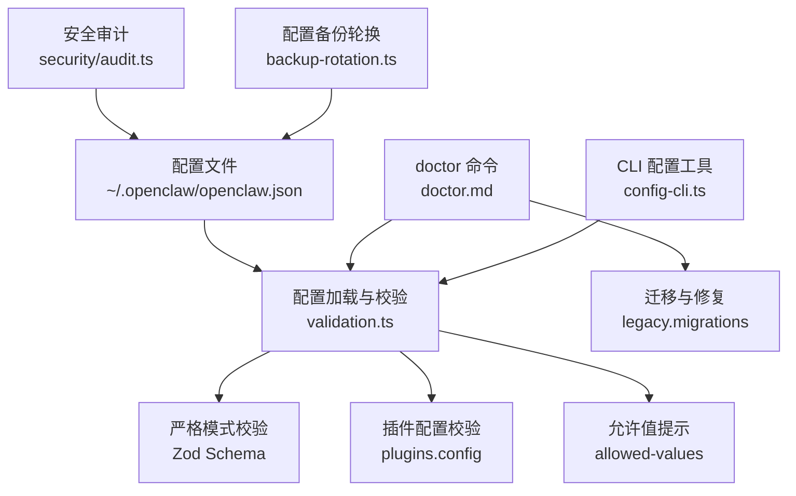
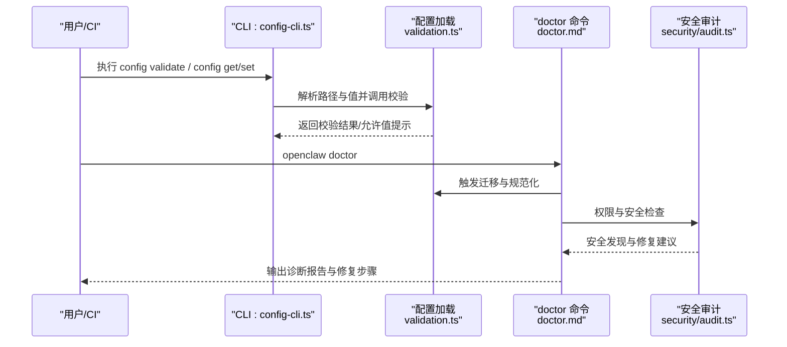
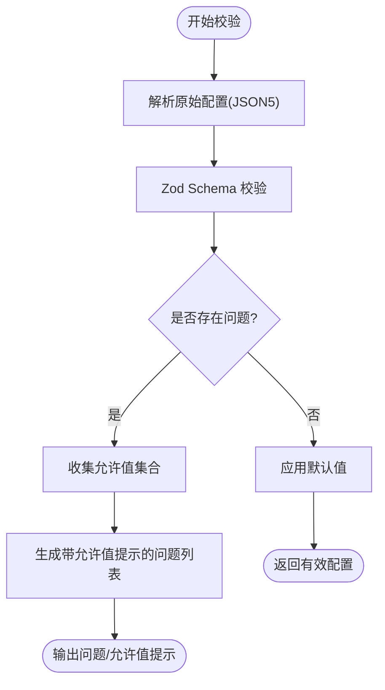
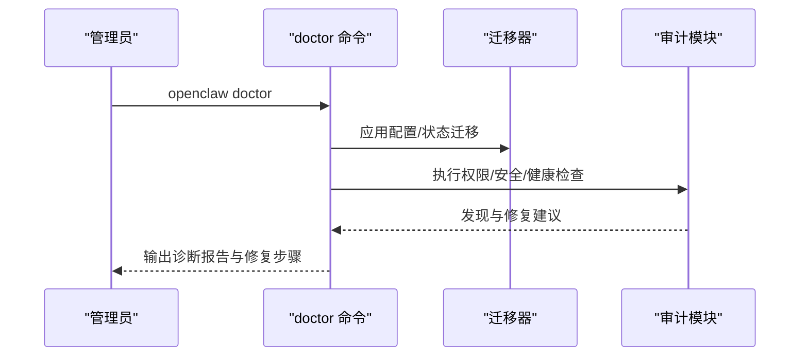
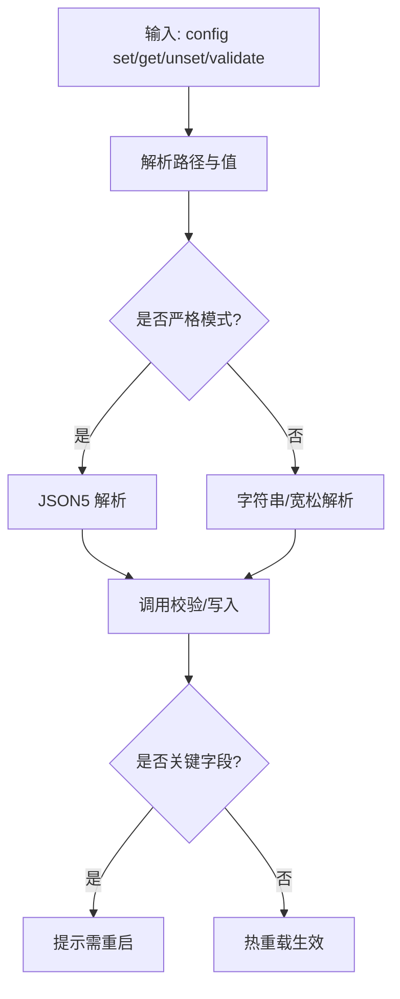
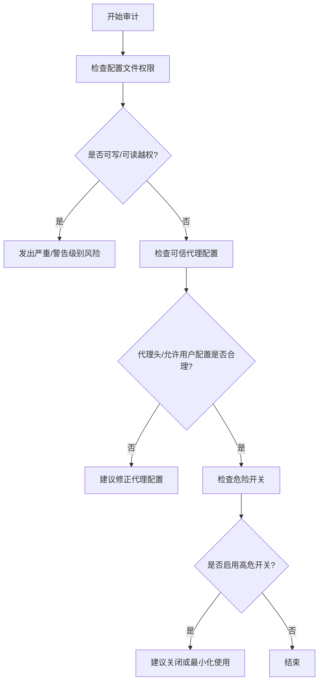
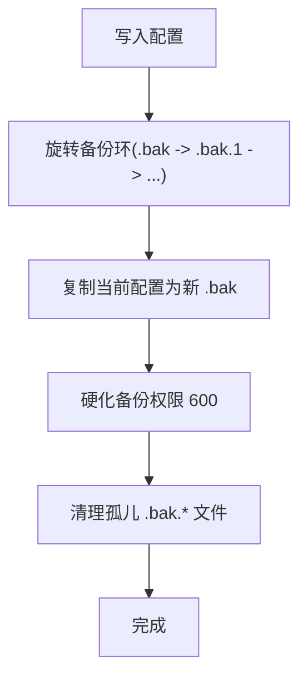
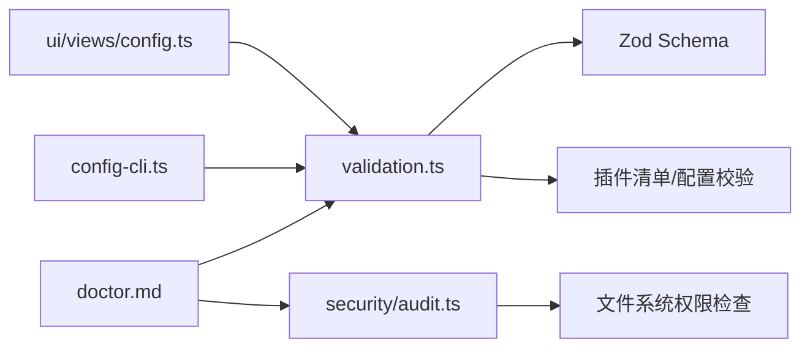

# 配置问题

<cite>
**本文引用的文件**
- [docs/gateway/configuration.md](file://docs/gateway/configuration.md)
- [docs/gateway/troubleshooting.md](file://docs/gateway/troubleshooting.md)
- [docs/gateway/doctor.md](file://docs/gateway/doctor.md)
- [docs/gateway/trusted-proxy-auth.md](file://docs/gateway/trusted-proxy-auth.md)
- [docs/gateway/security/index.md](file://docs/gateway/security/index.md)
- [docs/install/updating.md](file://docs/install/updating.md)
- [docs/install/migrating.md](file://docs/install/migrating.md)
- [src/config/validation.ts](file://src/config/validation.ts)
- [src/config/validation.allowed-values.test.ts](file://src/config/validation.allowed-values.test.ts)
- [src/config/backup-rotation.ts](file://src/config/backup-rotation.ts)
- [src/cli/config-cli.ts](file://src/cli/config-cli.ts)
- [src/cli/program/config-guard.ts](file://src/cli/program/config-guard.ts)
- [src/security/audit.ts](file://src/security/audit.ts)
- [src/security/audit-extra.async.ts](file://src/security/audit-extra.async.ts)
- [src/config/includes.ts](file://src/config/includes.ts)
- [ui/src/ui/views/config.ts](file://ui/src/ui/views/config.ts)
</cite>

## 目录
1. [简介](#简介)
2. [项目结构与定位](#项目结构与定位)
3. [核心组件与职责](#核心组件与职责)
4. [架构总览](#架构总览)
5. [详细组件分析](#详细组件分析)
6. [依赖关系分析](#依赖关系分析)
7. [性能与可用性考量](#性能与可用性考量)
8. [故障排除指南](#故障排除指南)
9. [结论](#结论)
10. [附录：配置验证与最佳实践](#附录配置验证与最佳实践)

## 简介
本指南聚焦于 OpenClaw 的配置问题排查，覆盖配置文件错误、参数不匹配、权限设置不当、网关/渠道/代理/安全配置等常见问题。内容基于官方文档与源码实现，提供系统化诊断流程、配置验证工具用法、迁移与回滚策略，以及面向管理员的最佳实践。

## 项目结构与定位
- 配置读取与校验：通过严格模式的 JSON5 配置文件加载，结合 Zod Schema 校验与插件配置校验，未知键或非法值将导致启动拒绝。
- 运维与诊断：提供 doctor 命令进行健康检查、迁移、修复；提供 doctor --fix 自动修复能力；支持配置热重载与 RPC 写入。
- 安全与权限：对配置文件权限、反向代理信任、可信代理头、危险开关进行审计与告警。
- 迁移与回滚：内置 doctor 迁移、配置备份轮换、更新与回滚策略。

图表来源
- [docs/gateway/configuration.md:61-73](file://docs/gateway/configuration.md#L61-L73)
- [src/config/validation.ts:229-286](file://src/config/validation.ts#L229-L286)
- [docs/gateway/doctor.md:93-131](file://docs/gateway/doctor.md#L93-L131)
- [src/cli/config-cli.ts:25-89](file://src/cli/config-cli.ts#L25-L89)
- [src/security/audit.ts:276-337](file://src/security/audit.ts#L276-L337)
- [src/config/backup-rotation.ts:115-125](file://src/config/backup-rotation.ts#L115-L125)

章节来源
- [docs/gateway/configuration.md:10-73](file://docs/gateway/configuration.md#L10-L73)
- [docs/gateway/doctor.md:9-85](file://docs/gateway/doctor.md#L9-L85)
- [src/config/validation.ts:229-286](file://src/config/validation.ts#L229-L286)

## 核心组件与职责
- 配置加载与严格校验：负责解析 JSON5、应用默认值、执行 Schema 校验、收集允许值提示、检测已知通道与心跳目标有效性。
- doctor 命令：执行迁移、修复、健康检查、服务与权限审计、模型认证检查、端口冲突诊断等。
- CLI 配置工具：提供 get/set/unset/validate 等子命令，支持路径解析与 JSON5 值解析。
- 安全审计：检查配置文件与 include 文件权限、可信代理配置、危险开关等。
- 备份轮换：在写入配置时维护固定数量的 .bak 备份，并硬化权限、清理孤儿备份。
- 可视化配置界面：根据 schema 渲染配置表单，识别 schema 中新增段落。

章节来源
- [src/config/validation.ts:229-286](file://src/config/validation.ts#L229-L286)
- [docs/gateway/doctor.md:59-84](file://docs/gateway/doctor.md#L59-L84)
- [src/cli/config-cli.ts:25-89](file://src/cli/config-cli.ts#L25-L89)
- [src/security/audit.ts:276-337](file://src/security/audit.ts#L276-L337)
- [src/config/backup-rotation.ts:115-125](file://src/config/backup-rotation.ts#L115-L125)
- [ui/src/ui/views/config.ts:405-420](file://ui/src/ui/views/config.ts#L405-L420)

## 架构总览
下图展示配置从加载到校验、诊断与修复的关键交互：

图表来源
- [src/cli/config-cli.ts:25-89](file://src/cli/config-cli.ts#L25-L89)
- [src/config/validation.ts:229-286](file://src/config/validation.ts#L229-L286)
- [docs/gateway/doctor.md:93-131](file://docs/gateway/doctor.md#L93-L131)
- [src/security/audit.ts:276-337](file://src/security/audit.ts#L276-L337)

## 详细组件分析

### 组件一：配置严格校验与允许值提示
- 功能要点
  - 使用 Zod Schema 对原始配置进行严格校验，未知键、类型不匹配、枚举值不在允许集合等情况会被记录为问题。
  - 对联合类型（union）自动收集允许值集合，并在错误消息中附加“允许值”提示，便于快速修复。
  - 检测已知通道 ID 与心跳目标合法性，确保跨插件通道一致性。
- 典型问题
  - update.channel 值不在 ("stable","beta","dev") 中。
  - channels.telegram.streaming 使用了非布尔或非枚举分支的字符串。
  - 未知通道 ID 或未知心跳目标。
- 修复建议
  - 参考允许值提示修正字段值；若为联合类型，优先选择布尔字符串变体或枚举值。
  - 将未知通道 ID 替换为内置通道或已安装插件声明的通道 ID。
  - 心跳目标必须为内置通道名、"last"、"none"或已启用插件声明的通道。

图表来源
- [src/config/validation.ts:117-140](file://src/config/validation.ts#L117-L140)
- [src/config/validation.ts:229-286](file://src/config/validation.ts#L229-L286)
- [src/config/validation.allowed-values.test.ts:4-77](file://src/config/validation.allowed-values.test.ts#L4-L77)

章节来源
- [src/config/validation.ts:117-140](file://src/config/validation.ts#L117-L140)
- [src/config/validation.allowed-values.test.ts:4-77](file://src/config/validation.allowed-values.test.ts#L4-L77)

### 组件二：doctor 命令与迁移修复
- 功能要点
  - 自动迁移旧版配置键、状态目录布局、历史任务存储等。
  - 执行健康检查、服务审计、权限检查、模型认证检查、端口冲突诊断。
  - 支持非交互式修复与强制修复，避免覆盖自定义服务配置。
- 典型场景
  - 启动被阻断：运行 doctor 查看具体原因并按提示修复。
  - 升级后异常：doctor 会自动迁移并给出重启建议。
  - 权限问题：doctor 提示收紧配置文件权限并提供修复命令。
- 修复建议
  - 非交互修复：openclaw doctor --yes 或 --repair。
  - 强制修复：openclaw doctor --repair --force（谨慎使用）。
  - 服务修复：doctor 会提示更新 supervisor 配置或强制重装服务。

图表来源
- [docs/gateway/doctor.md:93-131](file://docs/gateway/doctor.md#L93-L131)
- [docs/gateway/doctor.md:175-183](file://docs/gateway/doctor.md#L175-L183)

章节来源
- [docs/gateway/doctor.md:9-85](file://docs/gateway/doctor.md#L9-L85)
- [docs/gateway/doctor.md:175-183](file://docs/gateway/doctor.md#L175-L183)

### 组件三：CLI 配置工具与热重载
- 功能要点
  - 支持路径解析（点号与方括号）、JSON5 值解析、严格模式校验。
  - 提供 validate 子命令用于离线校验配置。
  - 支持热重载与 RPC 写入（config.apply/config.patch），并有速率限制与重启协调。
- 典型问题
  - 路径格式错误（如缺少闭合方括号）。
  - 值解析失败（未启用严格模式但传入复杂对象）。
  - 热重载不生效：某些关键字段需要重启。
- 修复建议
  - 使用 openclaw config validate 检查语法与类型。
  - 修改关键字段后执行 openclaw gateway restart。
  - 使用 config.patch 进行局部更新，避免整文件替换。

图表来源
- [src/cli/config-cli.ts:25-89](file://src/cli/config-cli.ts#L25-L89)
- [docs/gateway/configuration.md:349-387](file://docs/gateway/configuration.md#L349-L387)

章节来源
- [src/cli/config-cli.ts:25-89](file://src/cli/config-cli.ts#L25-L89)
- [docs/gateway/configuration.md:349-387](file://docs/gateway/configuration.md#L349-L387)

### 组件四：安全与权限审计
- 功能要点
  - 检查配置文件与 include 文件的可读/可写权限，对世界可读/组可读发出严重警告。
  - 审计可信代理配置与反向代理行为，防止身份伪造与绕过。
  - 列出危险开关清单，提示潜在风险。
- 典型问题
  - 配置文件权限为 644 或 666，存在被其他用户修改的风险。
  - 反向代理未正确设置 X-Forwarded-* 头，导致客户端 IP 识别错误。
  - 启用了 dangerouslyAllowPrivateNetwork 等高危开关。
- 修复建议
  - 将配置文件权限收紧至 600。
  - 在反向代理中正确设置 X-Forwarded-For/X-Real-IP 并仅允许受信代理地址。
  - 关闭危险开关或在严格最小化原则下审慎使用。

图表来源
- [src/security/audit.ts:276-337](file://src/security/audit.ts#L276-L337)
- [src/security/audit-extra.async.ts:915-981](file://src/security/audit-extra.async.ts#L915-L981)
- [docs/gateway/security/index.md:294-349](file://docs/gateway/security/index.md#L294-L349)
- [docs/gateway/trusted-proxy-auth.md:30-76](file://docs/gateway/trusted-proxy-auth.md#L30-L76)

章节来源
- [src/security/audit.ts:276-337](file://src/security/audit.ts#L276-L337)
- [src/security/audit-extra.async.ts:915-981](file://src/security/audit-extra.async.ts#L915-L981)
- [docs/gateway/security/index.md:294-349](file://docs/gateway/security/index.md#L294-L349)
- [docs/gateway/trusted-proxy-auth.md:30-76](file://docs/gateway/trusted-proxy-auth.md#L30-L76)

### 组件五：配置备份轮换与回滚
- 功能要点
  - 写入配置前进行环形备份轮换（最多保留 N 份 .bak），硬化备份权限为 600。
  - 清理孤儿 .bak 文件，避免无序增长。
- 典型问题
  - 配置写入失败或中断导致 .bak 数量异常。
  - 备份权限不安全，可能被其他用户读取。
- 修复建议
  - 使用 doctor --repair 或手动维护备份轮换。
  - 回滚：将 .bak.N 复制回 openclaw.json，必要时使用 doctor 重新迁移。

图表来源
- [src/config/backup-rotation.ts:115-125](file://src/config/backup-rotation.ts#L115-L125)

章节来源
- [src/config/backup-rotation.ts:115-125](file://src/config/backup-rotation.ts#L115-L125)

### 组件六：可视化配置界面与 schema 分析
- 功能要点
  - 根据 schema 动态渲染配置表单，识别 schema 新增段落并补充显示。
  - 支持“原始 JSON”编辑作为兜底。
- 典型问题
  - schema 更新后界面未显示新增段落。
  - 表单字段与实际 schema 不一致。
- 修复建议
  - 确认 schema 已更新且界面已刷新。
  - 使用“原始 JSON”直接编辑缺失段落。

章节来源
- [ui/src/ui/views/config.ts:405-420](file://ui/src/ui/views/config.ts#L405-L420)

## 依赖关系分析
- 配置校验依赖 Zod Schema 与插件清单，确保通道与心跳目标合法。
- doctor 依赖迁移器与审计模块，形成闭环修复。
- CLI 与 UI 依赖配置 schema，保证可视化一致性。
- 安全审计依赖平台权限检查与 include 文件扫描。

图表来源
- [src/config/validation.ts:229-286](file://src/config/validation.ts#L229-L286)
- [docs/gateway/doctor.md:93-131](file://docs/gateway/doctor.md#L93-L131)
- [src/security/audit.ts:276-337](file://src/security/audit.ts#L276-L337)
- [src/cli/config-cli.ts:25-89](file://src/cli/config-cli.ts#L25-L89)
- [ui/src/ui/views/config.ts:405-420](file://ui/src/ui/views/config.ts#L405-L420)

章节来源
- [src/config/validation.ts:229-286](file://src/config/validation.ts#L229-L286)
- [docs/gateway/doctor.md:93-131](file://docs/gateway/doctor.md#L93-L131)
- [src/security/audit.ts:276-337](file://src/security/audit.ts#L276-L337)
- [src/cli/config-cli.ts:25-89](file://src/cli/config-cli.ts#L25-L89)
- [ui/src/ui/views/config.ts:405-420](file://ui/src/ui/views/config.ts#L405-L420)

## 性能与可用性考量
- 配置热重载：大部分字段无需重启即可生效；关键字段（如 gateway.*、infrastructure）需要重启。
- RPC 写入：速率限制为每 60 秒最多 3 次，避免频繁写入造成抖动。
- 包含文件：$include 支持多文件深合并，注意嵌套层级与相对路径解析，避免循环包含与越界访问。

章节来源
- [docs/gateway/configuration.md:349-387](file://docs/gateway/configuration.md#L349-L387)
- [src/config/includes.ts:340-346](file://src/config/includes.ts#L340-L346)

## 故障排除指南

### 通用诊断流程
- 第一步：确认配置文件存在且可读
  - 使用 openclaw config file 获取路径，确认文件存在。
  - 使用 openclaw config validate 检查语法与类型。
- 第二步：运行 doctor 获取完整诊断
  - openclaw doctor（或 openclaw doctor --yes/--repair）
  - 关注“配置无效”“服务/端口冲突”“权限问题”“安全风险”等条目。
- 第三步：针对问题逐项修复
  - 依据 doctor 输出的迁移与修复建议执行。
  - 对于权限问题，收紧配置文件权限至 600。
  - 对于可信代理问题，检查 gateway.trustedProxies 与代理头设置。

章节来源
- [docs/gateway/configuration.md:61-73](file://docs/gateway/configuration.md#L61-L73)
- [docs/gateway/doctor.md:9-85](file://docs/gateway/doctor.md#L9-L85)
- [src/security/audit.ts:276-337](file://src/security/audit.ts#L276-L337)

### 常见配置错误与修复

- 配置文件错误（语法/类型/未知键）
  - 现象：启动被拒、doctor 报告“配置无效”。
  - 排查：openclaw config validate；查看允许值提示。
  - 修复：修正类型、删除未知键、使用允许值。
  
  章节来源
  - [src/config/validation.ts:229-286](file://src/config/validation.ts#L229-L286)
  - [src/config/validation.allowed-values.test.ts:4-77](file://src/config/validation.allowed-values.test.ts#L4-L77)

- 参数不匹配（枚举/联合类型）
  - 现象：update.channel、channels.<provider>.<field> 报错。
  - 排查：关注错误消息中的“允许值”提示。
  - 修复：选择内置枚举值或布尔字符串变体。
  
  章节来源
  - [src/config/validation.allowed-values.test.ts:4-77](file://src/config/validation.allowed-values.test.ts#L4-L77)

- 权限设置不当（配置文件/包含文件）
  - 现象：doctor 报告“世界可读/组可读/可写”。
  - 排查：检查配置文件与 $include 文件权限。
  - 修复：chmod 600；必要时移动到更安全位置。
  
  章节来源
  - [src/security/audit.ts:276-337](file://src/security/audit.ts#L276-L337)
  - [src/security/audit-extra.async.ts:915-981](file://src/security/audit-extra.async.ts#L915-L981)

- 网关配置问题（绑定/鉴权/端口）
  - 现象：无法连接、RPC 探测失败、端口占用。
  - 排查：openclaw gateway status；doctor 端口冲突诊断。
  - 修复：设置 gateway.auth.mode 与 token/password；更换端口或停止冲突进程。
  
  章节来源
  - [docs/gateway/troubleshooting.md:152-181](file://docs/gateway/troubleshooting.md#L152-L181)
  - [docs/gateway/doctor.md:304-318](file://docs/gateway/doctor.md#L304-L318)

- 渠道配置问题（DM/群组策略/权限）
  - 现象：消息不达、被忽略、401/403。
  - 排查：openclaw channels status --probe；检查 dmPolicy/allowFrom/groupAllowFrom。
  - 修复：调整策略、补齐权限范围、检查账户作用域。
  
  章节来源
  - [docs/gateway/troubleshooting.md:182-212](file://docs/gateway/troubleshooting.md#L182-L212)

- 代理与可信代理配置（反向代理/Trusted Proxy）
  - 现象：身份伪造风险、客户端 IP 识别错误。
  - 排查：检查 gateway.trustedProxies、X-Forwarded-* 头。
  - 修复：在代理层正确设置头并仅允许受信地址。
  
  章节来源
  - [docs/gateway/trusted-proxy-auth.md:30-76](file://docs/gateway/trusted-proxy-auth.md#L30-L76)
  - [docs/gateway/security/index.md:318-349](file://docs/gateway/security/index.md#L318-L349)

- 安全配置（危险开关/设备认证）
  - 现象：控制 UI 连接失败、设备签名/nonce 错误。
  - 排查：openclaw devices list；检查危险开关与设备令牌。
  - 修复：关闭危险开关；更新/轮换设备令牌。
  
  章节来源
  - [docs/gateway/troubleshooting.md:91-151](file://docs/gateway/troubleshooting.md#L91-L151)
  - [docs/gateway/security/index.md:294-317](file://docs/gateway/security/index.md#L294-L317)

### 配置验证工具与用法
- openclaw config validate
  - 用途：离线校验当前配置，输出问题与允许值提示。
  - 输出：支持 --json，便于自动化集成。
- openclaw config get/set/unset
  - 用途：路径解析（点号/方括号）、JSON5 值解析、严格模式校验。
- openclaw doctor
  - 用途：迁移、修复、健康检查、服务审计、权限审计、端口诊断。

章节来源
- [docs/cli/config.md:60-69](file://docs/cli/config.md#L60-L69)
- [src/cli/config-cli.ts:25-89](file://src/cli/config-cli.ts#L25-L89)
- [docs/gateway/doctor.md:9-85](file://docs/gateway/doctor.md#L9-L85)

### 配置迁移与回滚策略
- 迁移
  - doctor 自动迁移旧版键、状态目录布局、历史任务存储。
  - $include 支持多文件深合并，注意嵌套层级与相对路径。
- 回滚
  - 使用备份轮换：openclaw.json.bak.N 复制回 openclaw.json。
  - doctor --repair 可重写服务配置，必要时使用 --force。
- 版本升级
  - 更新后运行 doctor；若 doctor 提示升级，按建议执行。
  - 若升级后异常，doctor 会给出“令牌漂移/设备认证”等排查清单。

章节来源
- [docs/gateway/doctor.md:99-131](file://docs/gateway/doctor.md#L99-L131)
- [src/config/backup-rotation.ts:115-125](file://src/config/backup-rotation.ts#L115-L125)
- [docs/install/updating.md:206-258](file://docs/install/updating.md#L206-L258)
- [docs/install/migrating.md:68-132](file://docs/install/migrating.md#L68-L132)

## 结论
OpenClaw 的配置体系以严格校验为核心，辅以 doctor 的迁移修复与安全审计，配合 CLI 工具与可视化界面，形成完整的配置生命周期管理。管理员应遵循“先校验、再 doctor、后重启”的流程，重视权限与代理配置，利用备份轮换与迁移工具保障变更安全可控。

## 附录：配置验证与最佳实践

- 配置验证最佳实践
  - 使用 openclaw config validate 作为 CI 步骤，确保每次变更通过校验。
  - 对联合类型字段，优先使用允许值提示中的枚举或布尔字符串。
  - 对未知键，使用 doctor --repair 或手动删除，避免启动被拒。
- 权限与安全最佳实践
  - 配置文件权限：600；包含文件同样要求。
  - 反向代理：仅允许受信代理地址，正确设置 X-Forwarded-* 头。
  - 危险开关：尽量关闭，或在最小化原则下审慎使用。
- 迁移与回滚最佳实践
  - 写入配置前保留 .bak；升级后运行 doctor。
  - 回滚时先恢复 .bak，再运行 doctor 以确保迁移链完整。
- 热重载与 RPC 写入
  - 非关键字段可热重载；关键字段需重启。
  - RPC 写入有速率限制，避免频繁写入。

章节来源
- [docs/gateway/configuration.md:61-73](file://docs/gateway/configuration.md#L61-L73)
- [src/config/validation.ts:229-286](file://src/config/validation.ts#L229-L286)
- [src/security/audit.ts:276-337](file://src/security/audit.ts#L276-L337)
- [docs/gateway/trusted-proxy-auth.md:30-76](file://docs/gateway/trusted-proxy-auth.md#L30-L76)
- [docs/install/updating.md:206-258](file://docs/install/updating.md#L206-L258)
- [src/config/backup-rotation.ts:115-125](file://src/config/backup-rotation.ts#L115-L125)