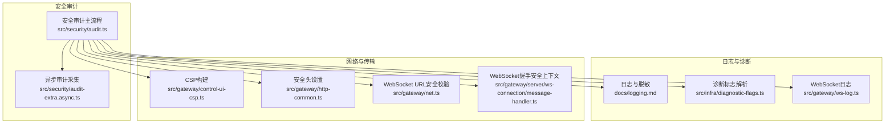
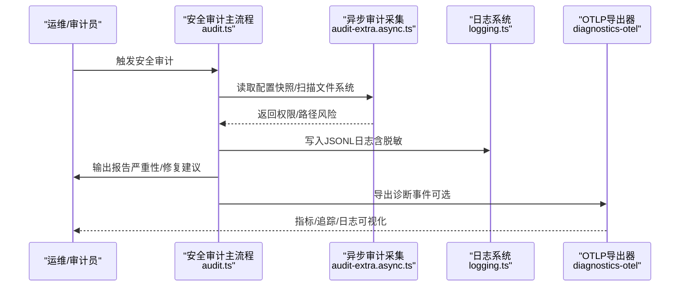
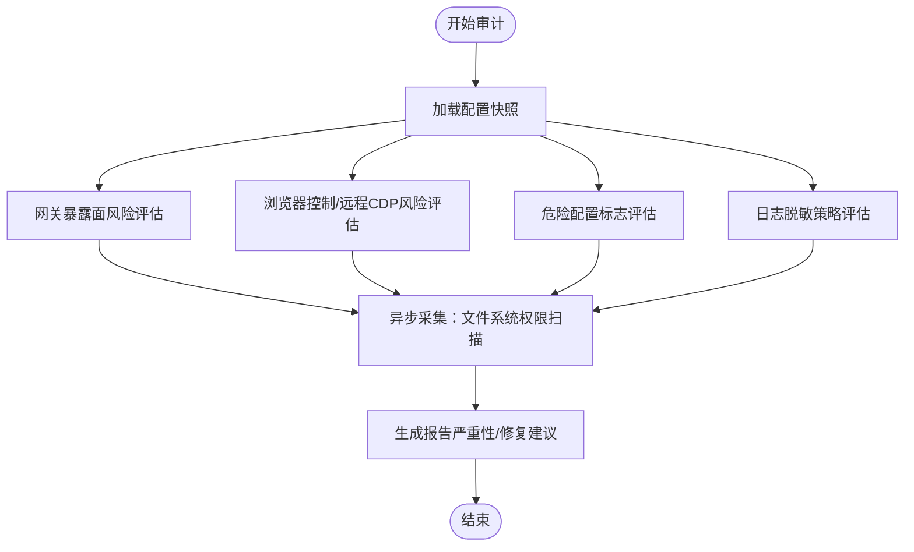
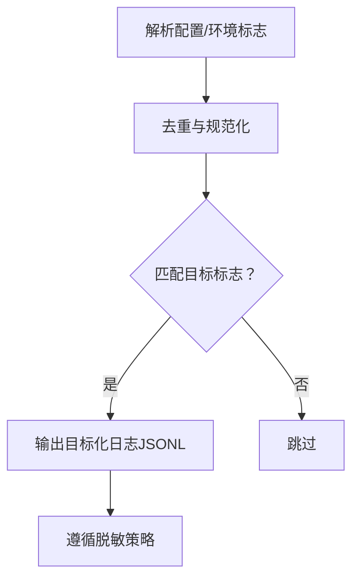
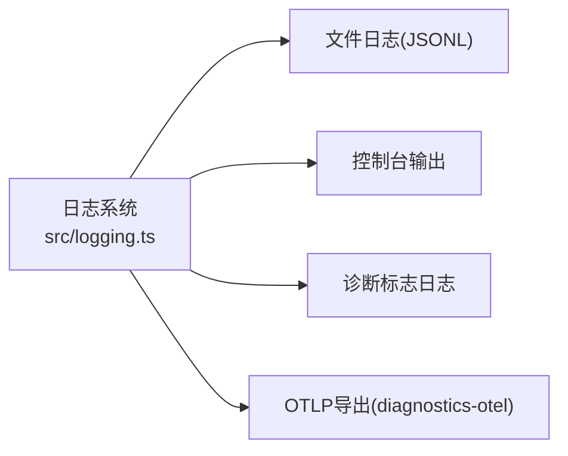
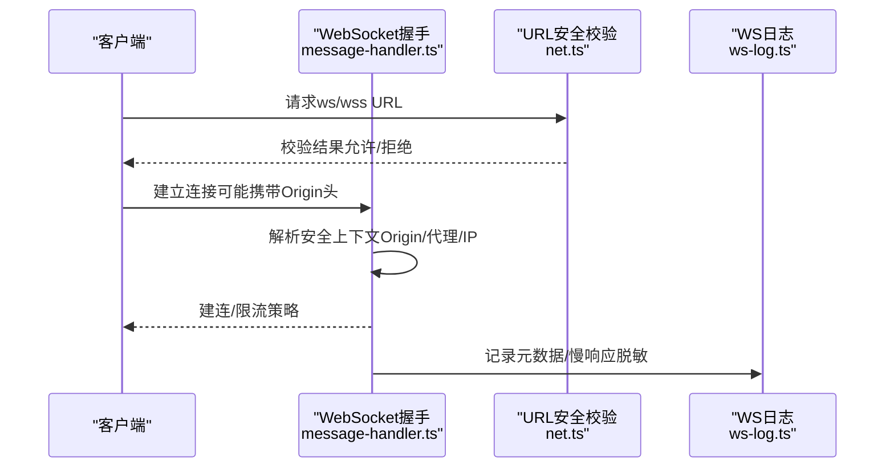
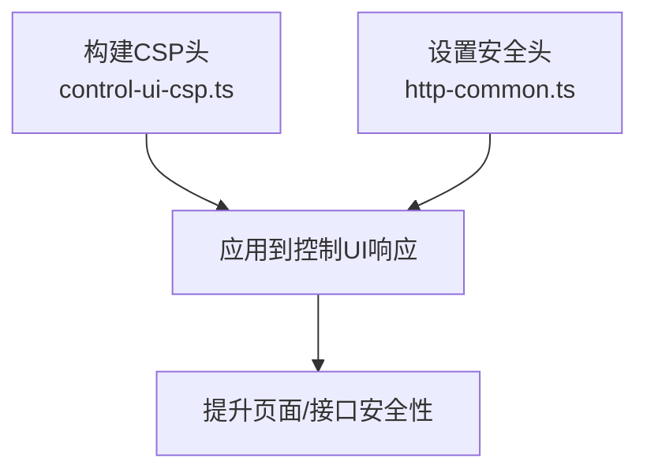
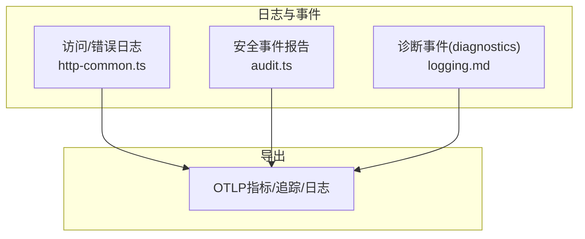
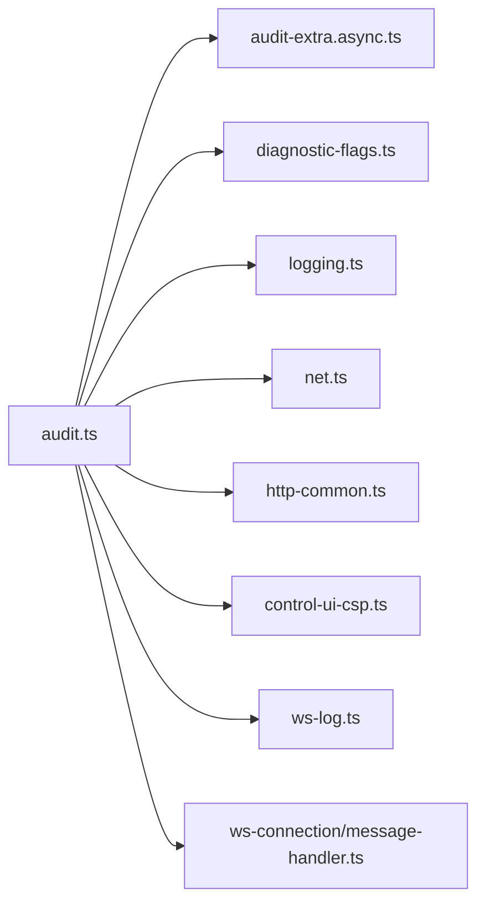

# 安全审计

<cite>
**本文引用的文件**
- [src/security/audit.ts](file://src/security/audit.ts)
- [src/security/audit-extra.async.ts](file://src/security/audit-extra.async.ts)
- [src/infra/diagnostic-flags.ts](file://src/infra/diagnostic-flags.ts)
- [docs/diagnostics/flags.md](file://docs/diagnostics/flags.md)
- [docs/logging.md](file://docs/logging.md)
- [src/gateway/http-common.ts](file://src/gateway/http-common.ts)
- [src/gateway/control-ui-csp.ts](file://src/gateway/control-ui-csp.ts)
- [src/gateway/net.ts](file://src/gateway/net.ts)
- [src/gateway/ws-log.ts](file://src/gateway/ws-log.ts)
- [src/gateway/server/ws-connection/message-handler.ts](file://src/gateway/server/ws-connection/message-handler.ts)
- [src/logging.ts](file://src/logging.ts)
- [docs/security/README.md](file://docs/security/README.md)
</cite>

## 目录
1. [简介](#简介)
2. [项目结构](#项目结构)
3. [核心组件](#核心组件)
4. [架构总览](#架构总览)
5. [详细组件分析](#详细组件分析)
6. [依赖关系分析](#依赖关系分析)
7. [性能考量](#性能考量)
8. [故障排查指南](#故障排查指南)
9. [结论](#结论)
10. [附录](#附录)

## 简介
本指南面向OpenClaw安全审计与运维团队，聚焦于安全配置与审计能力，涵盖以下主题：
- WebSocket日志记录与传输安全
- 安全日志管理与脱敏策略
- 内容安全策略（CSP）配置
- 诊断标志与目标化调试日志
- 访问日志、错误日志、安全事件记录与性能监控
- 审计日志分析、异常检测与安全监控
- 日志聚合、实时监控与告警配置建议

本指南既提供代码级实现映射，也给出可操作的配置建议与最佳实践。

## 项目结构
围绕安全审计的关键模块分布如下：
- 安全审计与发现：src/security/audit.ts、src/security/audit-extra.async.ts
- 诊断标志与目标化日志：src/infra/diagnostic-flags.ts、docs/diagnostics/flags.md
- 日志与脱敏：docs/logging.md、src/logging.ts、src/gateway/ws-log.ts
- 网络与传输安全：src/gateway/net.ts、src/gateway/http-common.ts、src/gateway/control-ui-csp.ts
- WebSocket握手与速率限制：src/gateway/server/ws-connection/message-handler.ts
- 安全文档入口：docs/security/README.md

**图表来源**
- [src/security/audit.ts:1-120](file://src/security/audit.ts#L1-L120)
- [src/security/audit-extra.async.ts:1-60](file://src/security/audit-extra.async.ts#L1-L60)
- [docs/logging.md:1-120](file://docs/logging.md#L1-L120)
- [src/infra/diagnostic-flags.ts:1-93](file://src/infra/diagnostic-flags.ts#L1-L93)
- [src/gateway/ws-log.ts:1-45](file://src/gateway/ws-log.ts#L1-L45)
- [src/gateway/control-ui-csp.ts:1-18](file://src/gateway/control-ui-csp.ts#L1-L18)
- [src/gateway/http-common.ts:1-34](file://src/gateway/http-common.ts#L1-L34)
- [src/gateway/net.ts:410-457](file://src/gateway/net.ts#L410-L457)
- [src/gateway/server/ws-connection/message-handler.ts:89-127](file://src/gateway/server/ws-connection/message-handler.ts#L89-L127)

**章节来源**
- [src/security/audit.ts:1-120](file://src/security/audit.ts#L1-L120)
- [src/security/audit-extra.async.ts:1-60](file://src/security/audit-extra.async.ts#L1-L60)
- [docs/logging.md:1-120](file://docs/logging.md#L1-L120)
- [src/infra/diagnostic-flags.ts:1-93](file://src/infra/diagnostic-flags.ts#L1-L93)
- [src/gateway/ws-log.ts:1-45](file://src/gateway/ws-log.ts#L1-L45)
- [src/gateway/control-ui-csp.ts:1-18](file://src/gateway/control-ui-csp.ts#L1-L18)
- [src/gateway/http-common.ts:1-34](file://src/gateway/http-common.ts#L1-L34)
- [src/gateway/net.ts:410-457](file://src/gateway/net.ts#L410-L457)
- [src/gateway/server/ws-connection/message-handler.ts:89-127](file://src/gateway/server/ws-connection/message-handler.ts#L89-L127)

## 核心组件
- 安全审计主流程：负责收集配置、文件系统权限、网关暴露面、浏览器控制、日志脱敏等安全发现，并生成可执行的修复建议。
- 异步审计采集：对状态目录、会话存储、日志文件等进行权限检查，识别潜在泄露风险。
- 诊断标志：提供细粒度的目标化调试开关，避免提升全局日志级别。
- 日志与脱敏：统一的文件日志与控制台输出，支持JSONL、脱敏策略与OTLP导出。
- 网络与传输安全：HTTP安全头、CSP、WebSocket URL安全校验与握手速率限制。
- WebSocket日志：针对WS连接的元数据、慢响应与敏感内容脱敏记录。

**章节来源**
- [src/security/audit.ts:799-813](file://src/security/audit.ts#L799-L813)
- [src/security/audit-extra.async.ts:1095-1127](file://src/security/audit-extra.async.ts#L1095-L1127)
- [src/infra/diagnostic-flags.ts:44-93](file://src/infra/diagnostic-flags.ts#L44-L93)
- [docs/logging.md:100-223](file://docs/logging.md#L100-L223)
- [src/gateway/http-common.ts:11-22](file://src/gateway/http-common.ts#L11-L22)
- [src/gateway/control-ui-csp.ts:1-18](file://src/gateway/control-ui-csp.ts#L1-L18)
- [src/gateway/net.ts:410-457](file://src/gateway/net.ts#L410-L457)
- [src/gateway/ws-log.ts:1-45](file://src/gateway/ws-log.ts#L1-L45)

## 架构总览
OpenClaw安全审计体系由“发现—记录—导出—监控”闭环构成：
- 发现：安全审计主流程与异步采集扫描配置与文件系统风险。
- 记录：统一日志格式（JSONL）、脱敏策略、诊断标志目标化日志。
- 导出：OTLP/HTTP导出至收集器，支持指标、追踪与日志。
- 监控：结合诊断事件与日志，建立异常检测与告警。

**图表来源**
- [src/security/audit.ts:1-120](file://src/security/audit.ts#L1-L120)
- [src/security/audit-extra.async.ts:1095-1127](file://src/security/audit-extra.async.ts#L1095-L1127)
- [docs/logging.md:142-267](file://docs/logging.md#L142-L267)

**章节来源**
- [src/security/audit.ts:1-120](file://src/security/audit.ts#L1-L120)
- [src/security/audit-extra.async.ts:1095-1127](file://src/security/audit-extra.async.ts#L1095-L1127)
- [docs/logging.md:142-267](file://docs/logging.md#L142-L267)

## 详细组件分析

### 组件A：安全审计主流程与异步采集
- 主流程职责
  - 收集网关绑定、鉴权、反向代理信任、允许来源、mDNS、TailScale等暴露面风险。
  - 检查浏览器控制、远程CDP、危险配置标志等。
  - 评估日志脱敏策略与工具摘要脱敏关闭的风险。
- 异步采集职责
  - 扫描状态目录、配置文件、会话存储、日志文件的权限与可读性，识别潜在泄露风险。
  - 生成可执行的修复建议（权限修正、路径调整）。

**图表来源**
- [src/security/audit.ts:339-687](file://src/security/audit.ts#L339-L687)
- [src/security/audit.ts:799-813](file://src/security/audit.ts#L799-L813)
- [src/security/audit-extra.async.ts:1095-1127](file://src/security/audit-extra.async.ts#L1095-L1127)

**章节来源**
- [src/security/audit.ts:339-687](file://src/security/audit.ts#L339-L687)
- [src/security/audit.ts:799-813](file://src/security/audit.ts#L799-L813)
- [src/security/audit-extra.async.ts:1095-1127](file://src/security/audit-extra.async.ts#L1095-L1127)

### 组件B：诊断标志与目标化日志
- 诊断标志解析
  - 支持配置与环境变量叠加，去重与通配符匹配（如telegram.*、*）。
  - 通过isDiagnosticFlagEnabled判断某子系统日志是否开启。
- 目标化日志
  - 仅在匹配标志时输出，避免提升全局日志级别。
  - 默认输出到标准日志文件，遵循脱敏策略。

**图表来源**
- [src/infra/diagnostic-flags.ts:44-93](file://src/infra/diagnostic-flags.ts#L44-L93)
- [docs/diagnostics/flags.md:1-92](file://docs/diagnostics/flags.md#L1-L92)

**章节来源**
- [src/infra/diagnostic-flags.ts:44-93](file://src/infra/diagnostic-flags.ts#L44-L93)
- [docs/diagnostics/flags.md:1-92](file://docs/diagnostics/flags.md#L1-L92)

### 组件C：日志与脱敏、OTLP导出
- 日志格式
  - 文件日志：JSONL，CLI与控制UI解析结构化输出。
  - 控制台：TTY感知、颜色、紧凑/JSON模式。
- 脱敏策略
  - console输出可脱敏（off/tools），不影响文件日志。
  - 诊断标志日志同样遵循脱敏策略。
- OTLP导出
  - 支持指标、追踪、日志导出，可配置采样率与刷新间隔。
  - 日志导出尊重文件日志级别，控制台脱敏不适用于OTLP。

**图表来源**
- [src/logging.ts:1-70](file://src/logging.ts#L1-L70)
- [docs/logging.md:100-267](file://docs/logging.md#L100-L267)

**章节来源**
- [src/logging.ts:1-70](file://src/logging.ts#L1-L70)
- [docs/logging.md:100-267](file://docs/logging.md#L100-L267)

### 组件D：WebSocket日志记录与传输安全
- WebSocket URL安全校验
  - wss://始终安全；ws://默认仅允许回环地址；可选开启私有网络（受信网络）。
  - 对公网IP、非单播IPv6等拒绝，防止明文传输敏感信息。
- WebSocket握手安全上下文
  - 根据浏览器Origin头与代理头决定是否强制Origin检查、速率限制IP与鉴权限流器。
- WebSocket日志
  - 记录元数据、慢响应阈值、敏感内容脱敏，避免在控制台泄露。

**图表来源**
- [src/gateway/net.ts:410-457](file://src/gateway/net.ts#L410-L457)
- [src/gateway/server/ws-connection/message-handler.ts:89-127](file://src/gateway/server/ws-connection/message-handler.ts#L89-L127)
- [src/gateway/ws-log.ts:1-45](file://src/gateway/ws-log.ts#L1-L45)

**章节来源**
- [src/gateway/net.ts:410-457](file://src/gateway/net.ts#L410-L457)
- [src/gateway/server/ws-connection/message-handler.ts:89-127](file://src/gateway/server/ws-connection/message-handler.ts#L89-L127)
- [src/gateway/ws-log.ts:1-45](file://src/gateway/ws-log.ts#L1-L45)

### 组件E：内容安全策略（CSP）与HTTP安全头
- CSP构建
  - 控制UI场景：禁止框架嵌入、阻止内联脚本、允许必要资源来源（字体等），明确Connect源为self与ws/wss。
- HTTP安全头
  - 设置X-Content-Type-Options、Referrer-Policy、Permissions-Policy，可选Strict-Transport-Security。

**图表来源**
- [src/gateway/control-ui-csp.ts:1-18](file://src/gateway/control-ui-csp.ts#L1-L18)
- [src/gateway/http-common.ts:11-22](file://src/gateway/http-common.ts#L11-L22)

**章节来源**
- [src/gateway/control-ui-csp.ts:1-18](file://src/gateway/control-ui-csp.ts#L1-L18)
- [src/gateway/http-common.ts:11-22](file://src/gateway/http-common.ts#L11-L22)

### 组件F：访问日志、错误日志、安全事件记录与性能监控
- 访问日志
  - 通过HTTP安全头与CSP减少跨站风险；结合日志级别与脱敏控制输出体量。
- 错误日志
  - 统一错误响应格式，避免泄露内部细节；结合诊断标志定位问题。
- 安全事件记录
  - 审计发现（严重性分级）与修复建议；文件系统权限风险与配置暴露风险。
- 性能监控
  - 诊断事件（模型用量、消息流、队列/会话状态）导出至OTLP，结合采样与刷新策略。

**图表来源**
- [src/gateway/http-common.ts:11-71](file://src/gateway/http-common.ts#L11-L71)
- [src/security/audit.ts:56-85](file://src/security/audit.ts#L56-L85)
- [docs/logging.md:142-339](file://docs/logging.md#L142-L339)

**章节来源**
- [src/gateway/http-common.ts:11-71](file://src/gateway/http-common.ts#L11-L71)
- [src/security/audit.ts:56-85](file://src/security/audit.ts#L56-L85)
- [docs/logging.md:142-339](file://docs/logging.md#L142-L339)

## 依赖关系分析
- 审计主流程依赖配置解析、文件系统权限检查、通道安全检查、危险配置标志检查等模块。
- 诊断标志与日志系统耦合，确保目标化日志仅在匹配时输出。
- WebSocket安全依赖URL解析、地址类型判断与握手上下文决策。
- HTTP安全头与CSP独立但共同提升传输与页面安全。

**图表来源**
- [src/security/audit.ts:1-120](file://src/security/audit.ts#L1-L120)
- [src/security/audit-extra.async.ts:1-60](file://src/security/audit-extra.async.ts#L1-L60)
- [src/infra/diagnostic-flags.ts:1-93](file://src/infra/diagnostic-flags.ts#L1-L93)
- [src/logging.ts:1-70](file://src/logging.ts#L1-L70)
- [src/gateway/net.ts:410-457](file://src/gateway/net.ts#L410-L457)
- [src/gateway/http-common.ts:11-22](file://src/gateway/http-common.ts#L11-L22)
- [src/gateway/control-ui-csp.ts:1-18](file://src/gateway/control-ui-csp.ts#L1-L18)
- [src/gateway/ws-log.ts:1-45](file://src/gateway/ws-log.ts#L1-L45)
- [src/gateway/server/ws-connection/message-handler.ts:89-127](file://src/gateway/server/ws-connection/message-handler.ts#L89-L127)

**章节来源**
- [src/security/audit.ts:1-120](file://src/security/audit.ts#L1-L120)
- [src/security/audit-extra.async.ts:1-60](file://src/security/audit-extra.async.ts#L1-L60)
- [src/infra/diagnostic-flags.ts:1-93](file://src/infra/diagnostic-flags.ts#L1-L93)
- [src/logging.ts:1-70](file://src/logging.ts#L1-L70)
- [src/gateway/net.ts:410-457](file://src/gateway/net.ts#L410-L457)
- [src/gateway/http-common.ts:11-22](file://src/gateway/http-common.ts#L11-L22)
- [src/gateway/control-ui-csp.ts:1-18](file://src/gateway/control-ui-csp.ts#L1-L18)
- [src/gateway/ws-log.ts:1-45](file://src/gateway/ws-log.ts#L1-L45)
- [src/gateway/server/ws-connection/message-handler.ts:89-127](file://src/gateway/server/ws-connection/message-handler.ts#L89-L127)

## 性能考量
- 诊断事件导出
  - 使用采样率与刷新间隔控制导出压力；高流量部署建议在收集器侧采样/过滤。
- 日志级别与脱敏
  - 降低文件日志级别与脱敏范围可减少I/O与CPU开销；目标化日志避免全局提升。
- WebSocket慢响应阈值
  - 合理设置慢响应阈值，避免频繁告警与日志风暴。

[本节为通用指导，无需具体文件分析]

## 故障排查指南
- 审计报告
  - 关注严重性分级与修复建议；优先处理“critical”，其次“warn”。
- 诊断标志
  - 使用OPENCLAW_DIAGNOSTICS或配置项启用目标化日志，结合脱敏策略定位问题。
- OTLP导出
  - 检查端点、协议、服务名与采样率；确认日志级别与导出开关。
- WebSocket
  - 若连接被拒绝，检查URL协议与主机类型；确认握手上下文与速率限制策略。

**章节来源**
- [src/security/audit.ts:56-85](file://src/security/audit.ts#L56-L85)
- [src/infra/diagnostic-flags.ts:44-93](file://src/infra/diagnostic-flags.ts#L44-L93)
- [docs/logging.md:224-339](file://docs/logging.md#L224-L339)
- [src/gateway/net.ts:410-457](file://src/gateway/net.ts#L410-L457)
- [src/gateway/server/ws-connection/message-handler.ts:89-127](file://src/gateway/server/ws-connection/message-handler.ts#L89-L127)

## 结论
OpenClaw提供了从配置审计、文件系统风险扫描到日志脱敏、OTLP导出与WebSocket传输安全的完整安全审计能力。通过合理配置诊断标志、日志级别与脱敏策略，结合CSP与HTTP安全头，可在保障可观测性的同时最大化安全性。建议将安全审计纳入CI/CD与生产巡检流程，并配合OTLP收集器建立异常检测与告警机制。

[本节为总结性内容，无需具体文件分析]

## 附录
- 安全文档入口与漏洞上报指引：参见安全文档首页。

**章节来源**
- [docs/security/README.md:1-18](file://docs/security/README.md#L1-L18)