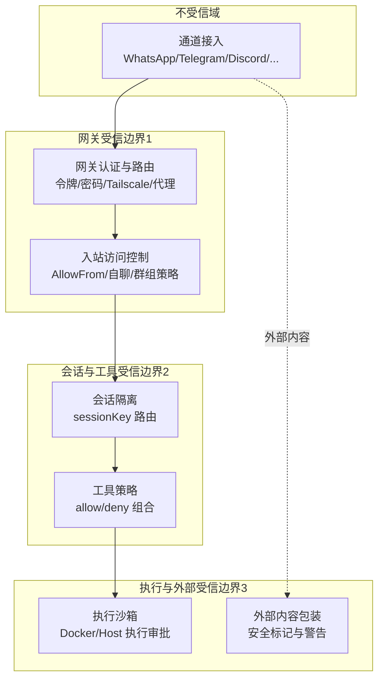
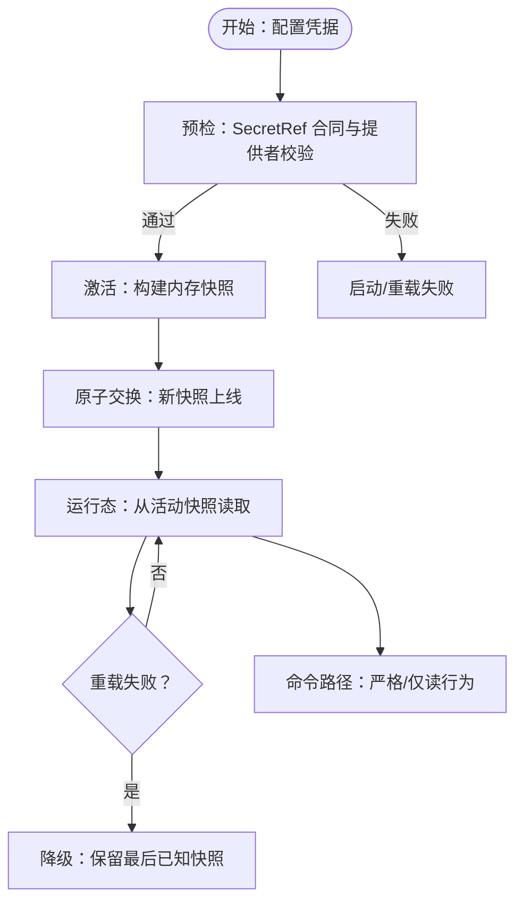
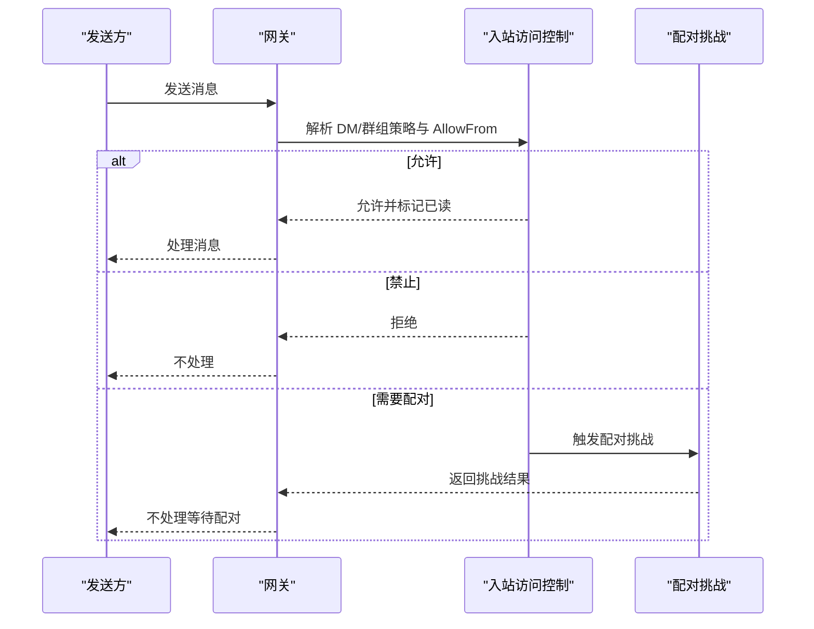
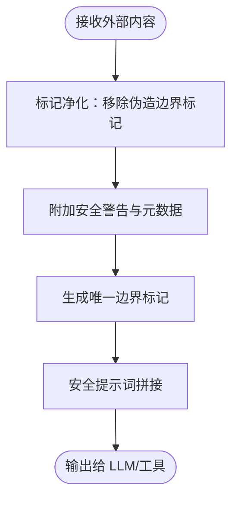
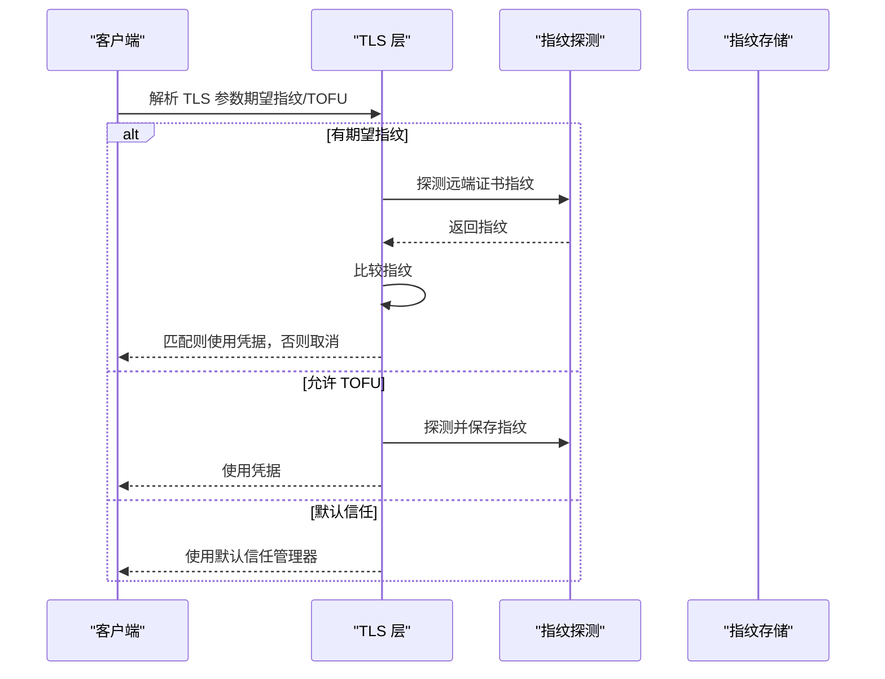
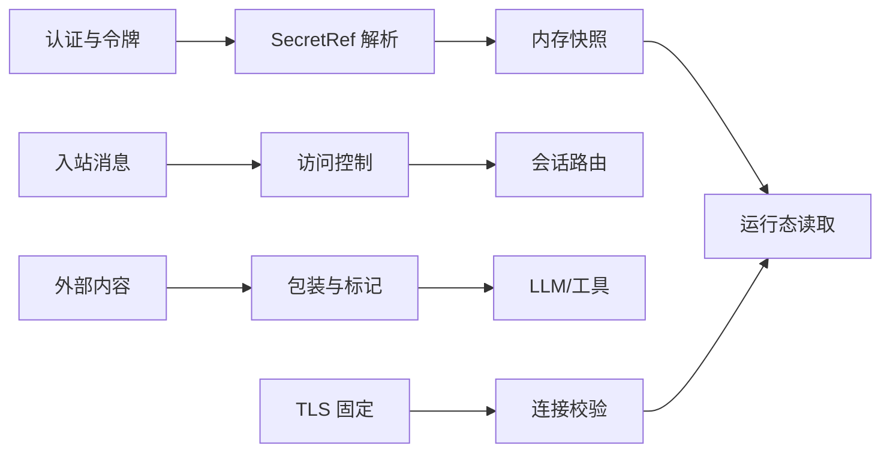

# 安全配置

<cite>
**本文引用的文件**
- [SECURITY.md](file://SECURITY.md)
- [docs/security/README.md](file://docs/security/README.md)
- [docs/security/THREAT-MODEL-ATLAS.md](file://docs/security/THREAT-MODEL-ATLAS.md)
- [docs/gateway/authentication.md](file://docs/gateway/authentication.md)
- [docs/gateway/secrets.md](file://docs/gateway/secrets.md)
- [docs/reference/secretref-credential-surface.md](file://docs/reference/secretref-credential-surface.md)
- [src/agents/auth-profiles/credential-state.ts](file://src/agents/auth-profiles/credential-state.ts)
- [src/secrets/audit.ts](file://src/secrets/audit.ts)
- [src/security/external-content.ts](file://src/security/external-content.ts)
- [src/web/inbound/access-control.ts](file://src/web/inbound/access-control.ts)
- [src/agents/sandbox/tool-policy.ts](file://src/agents/sandbox/tool-policy.ts)
- [apps/android/app/src/main/java/ai/openclaw/app/gateway/GatewayTls.kt](file://apps/android/app/src/main/java/ai/openclaw/app/gateway/GatewayTls.kt)
- [apps/ios/Sources/Gateway/GatewayConnectionController.swift](file://apps/ios/Sources/Gateway/GatewayConnectionController.swift)
- [apps/shared/OpenClawKit/Sources/OpenClawKit/GatewayTLSPinning.swift](file://apps/shared/OpenClawKit/Sources/OpenClawKit/GatewayTLSPinning.swift)
- [extensions/google-gemini-cli-auth/oauth.ts](file://extensions/google-gemini-cli-auth/oauth.ts)
</cite>

## 目录
1. [简介](#简介)
2. [项目结构与安全范围](#项目结构与安全范围)
3. [核心组件与安全机制](#核心组件与安全机制)
4. [架构总览](#架构总览)
5. [详细组件分析](#详细组件分析)
6. [依赖关系与耦合分析](#依赖关系与耦合分析)
7. [性能与安全权衡](#性能与安全权衡)
8. [故障排查与审计](#故障排查与审计)
9. [结论](#结论)
10. [附录：部署模板与检查清单](#附录部署模板与检查清单)

## 简介
本指南面向在不同环境中部署与运营 OpenClaw 的安全与运维人员，系统化梳理认证授权、密钥管理（SecretRef）、访问控制、网络安全、令牌与凭据生命周期、威胁建模与审计加固等关键安全配置要点。文档以仓库内官方文档与源码实现为依据，结合实战建议，帮助您建立可落地的安全基线与检查清单。

## 项目结构与安全范围
OpenClaw 的安全边界与信任模型由官方安全策略与威胁模型文档定义，并在网关、通道接入、会话隔离、工具执行、外部内容处理等层面形成纵深防御。安全范围覆盖：
- 认证与授权：网关令牌/密码、远程网关、代理认证、OAuth 令牌与过期管理
- 密钥与凭据：SecretRef 合同、提供者（env/file/exec）、激活与重载、审计与清理
- 访问控制：入站消息白名单/自聊模式、群组策略、设备配对挑战
- 网络安全：TLS 固定指纹、主机名校验、环回绑定、Canvas 主机暴露限制
- 外部内容与注入防护：外部内容包装与标记、提示注入检测与阻断
- 工具与会话沙箱：工具策略、会话隔离、执行审批与拒绝列表
- 威胁建模：MITRE ATLAS 风险矩阵与关键攻击链

章节来源
- [SECURITY.md: 88-180:88-180](file://SECURITY.md#L88-L180)
- [docs/security/THREAT-MODEL-ATLAS.md: 56-123:56-123](file://docs/security/THREAT-MODEL-ATLAS.md#L56-L123)

## 核心组件与安全机制
- SecretRef 与凭据解析：集中式凭据解析到内存快照，启动失败快速中止；支持 env/file/exec 提供者，严格校验与路径/命令安全检查；提供“仅读”命令路径降级行为。
- 凭据状态评估：对 API Key、Token、OAuth 凭据进行有效性、过期时间与引用完整性判定。
- 入站访问控制：基于 AllowFrom 列表、自聊模式、群组策略与配对宽限期的综合控制。
- 外部内容处理：统一包装器与安全警告，防止边界标记伪造与注入；对多种来源（邮件、Webhook、Web 搜索/抓取）进行标记与上下文注入。
- 网络安全：TLS 固定指纹（证书指纹 pinning）、TOFU（首次信任）与默认信任管理器回退；移动端与共享层一致的 TLS 参数解析与校验。
- 工具与会话沙箱：工具策略允许/拒绝列表、多层来源优先级、图像工具默认保留、会话隔离与执行审批。

章节来源
- [docs/gateway/secrets.md: 16-35:16-35](file://docs/gateway/secrets.md#L16-L35)
- [src/agents/auth-profiles/credential-state.ts: 13-74:13-74](file://src/agents/auth-profiles/credential-state.ts#L13-L74)
- [src/web/inbound/access-control.ts: 41-223:41-223](file://src/web/inbound/access-control.ts#L41-L223)
- [src/security/external-content.ts: 139-345:139-345](file://src/security/external-content.ts#L139-L345)
- [apps/android/app/src/main/java/ai/openclaw/app/gateway/GatewayTls.kt: 35-66:35-66](file://apps/android/app/src/main/java/ai/openclaw/app/gateway/GatewayTls.kt#L35-L66)
- [apps/ios/Sources/Gateway/GatewayConnectionController.swift: 499-1071:499-1071](file://apps/ios/Sources/Gateway/GatewayConnectionController.swift#L499-L1071)
- [apps/shared/OpenClawKit/Sources/OpenClawKit/GatewayTLSPinning.swift: 66-137:66-137](file://apps/shared/OpenClawKit/Sources/OpenClawKit/GatewayTLSPinning.swift#L66-L137)
- [src/agents/sandbox/tool-policy.ts: 35-110:35-110](file://src/agents/sandbox/tool-policy.ts#L35-L110)

## 架构总览
下图展示从通道入口到工具执行的关键安全路径与信任边界：

图表来源
- [docs/security/THREAT-MODEL-ATLAS.md: 56-123:56-123](file://docs/security/THREAT-MODEL-ATLAS.md#L56-L123)
- [src/web/inbound/access-control.ts: 41-223:41-223](file://src/web/inbound/access-control.ts#L41-L223)
- [src/agents/sandbox/tool-policy.ts: 35-110:35-110](file://src/agents/sandbox/tool-policy.ts#L35-L110)
- [src/security/external-content.ts: 239-303:239-303](file://src/security/external-content.ts#L239-L303)

## 详细组件分析

### 认证与授权
- 网关认证：支持令牌/密码与远程网关认证；SecretRef 在活跃表面才强制解析，非活跃表面不阻启动。
- OAuth 与令牌轮换：支持订阅型 setup-token 与 API Key；提供 per-session 与 per-agent 的凭据选择与顺序控制；定期检查过期状态。
- 远程网关与代理：远程令牌/密码在特定条件下才视为活跃；支持受信代理认证与尾数网络模式。

章节来源
- [docs/gateway/authentication.md: 9-180:9-180](file://docs/gateway/authentication.md#L9-L180)
- [docs/gateway/secrets.md: 53-64:53-64](file://docs/gateway/secrets.md#L53-L64)
- [src/agents/auth-profiles/credential-state.ts: 34-74:34-74](file://src/agents/auth-profiles/credential-state.ts#L34-L74)

### SecretRef 与密钥管理
- 合同与提供者：env/file/exec 三类提供者，严格的 id/路径/命令格式校验；支持默认提供者与并发/批大小限制。
- 激活与重载：启动前预检失败即中止；热重载采用原子替换，失败保持最后已知良好快照；命令路径支持“仅读”降级。
- 审计与清理：审计发现明文值、敏感头残留、未解析引用、优先级遮蔽与遗留项；应用时进行一次性 Scrub，不写回历史明文。
- 凭据表面：明确支持与不支持的凭据范围，避免运行时生成或轮换凭据进入 SecretRef 解析。

图表来源
- [docs/gateway/secrets.md: 16-35:16-35](file://docs/gateway/secrets.md#L16-L35)
- [docs/gateway/secrets.md: 312-363:312-363](file://docs/gateway/secrets.md#L312-L363)
- [src/secrets/audit.ts: 256-297:256-297](file://src/secrets/audit.ts#L256-L297)

章节来源
- [docs/gateway/secrets.md: 76-176:76-176](file://docs/gateway/secrets.md#L76-L176)
- [docs/gateway/secrets.md: 312-363:312-363](file://docs/gateway/secrets.md#L312-L363)
- [src/secrets/audit.ts: 256-297:256-297](file://src/secrets/audit.ts#L256-L297)
- [docs/reference/secretref-credential-surface.md: 10-24:10-24](file://docs/reference/secretref-credential-surface.md#L10-L24)

### 访问控制与通道安全
- 入站访问控制：DM 自聊模式、AllowFrom 白名单、群组策略（开放/允许列表/禁用），以及配对宽限期内的挑战与回复抑制。
- 设备配对：30 秒宽限期后失效，阻止拦截与重放；移动端与共享层一致的配对流程与错误处理。
- 通道差异：不同通道（如 WhatsApp）支持运行时组策略回退与默认策略解析。

图表来源
- [src/web/inbound/access-control.ts: 41-223:41-223](file://src/web/inbound/access-control.ts#L41-L223)

章节来源
- [src/web/inbound/access-control.ts: 41-223:41-223](file://src/web/inbound/access-control.ts#L41-L223)

### 外部内容与提示注入防护
- 包装器与标记：为外部来源（邮件、Webhook、Web 搜索/抓取）添加唯一随机 ID 的边界标记与安全警告，防止边界伪造。
- 注入检测：对常见提示注入模式进行检测并记录，作为监控信号。
- 会话键识别：识别来自钩子（Gmail/Webhook）的会话键类型，采取相应包装策略。

图表来源
- [src/security/external-content.ts: 239-303:239-303](file://src/security/external-content.ts#L239-L303)

章节来源
- [src/security/external-content.ts: 139-345:139-345](file://src/security/external-content.ts#L139-L345)

### 网络安全与 TLS 固定
- TLS 参数解析：根据稳定 ID 加载指纹或启用 TOFU；若未设置则使用默认信任管理器。
- 探测与固定：移动端与共享层均支持探测远端证书指纹并在超时后完成；固定指纹匹配失败则拒绝连接。
- Android/iOS/共享层一致性：三端实现遵循相同策略（期望指纹/TOFU/默认信任）。

图表来源
- [apps/ios/Sources/Gateway/GatewayConnectionController.swift: 499-1071:499-1071](file://apps/ios/Sources/Gateway/GatewayConnectionController.swift#L499-L1071)
- [apps/android/app/src/main/java/ai/openclaw/app/gateway/GatewayTls.kt: 35-66:35-66](file://apps/android/app/src/main/java/ai/openclaw/app/gateway/GatewayTls.kt#L35-L66)
- [apps/shared/OpenClawKit/Sources/OpenClawKit/GatewayTLSPinning.swift: 66-137:66-137](file://apps/shared/OpenClawKit/Sources/OpenClawKit/GatewayTLSPinning.swift#L66-L137)

章节来源
- [apps/ios/Sources/Gateway/GatewayConnectionController.swift: 499-1071:499-1071](file://apps/ios/Sources/Gateway/GatewayConnectionController.swift#L499-L1071)
- [apps/android/app/src/main/java/ai/openclaw/app/gateway/GatewayTls.kt: 35-66:35-66](file://apps/android/app/src/main/java/ai/openclaw/app/gateway/GatewayTls.kt#L35-L66)
- [apps/shared/OpenClawKit/Sources/OpenClawKit/GatewayTLSPinning.swift: 66-137:66-137](file://apps/shared/OpenClawKit/Sources/OpenClawKit/GatewayTLSPinning.swift#L66-L137)

### 工具与会话沙箱
- 工具策略：按“agent > global > default”的优先级合并 allow/deny；默认保留图像能力；空 allow 表示“允许全部”，但不会意外转为显式 allow 列表。
- 会话隔离：sessionKey 作为路由标识，不作为每用户授权边界；建议单用户/单网关/单代理的推荐模式。
- 执行审批：危险命令需经审批；会话委托需明确 sandbox 要求，避免无沙箱子会话。

章节来源
- [src/agents/sandbox/tool-policy.ts: 35-110:35-110](file://src/agents/sandbox/tool-policy.ts#L35-L110)
- [SECURITY.md: 98-102:98-102](file://SECURITY.md#L98-L102)

### OAuth 与令牌管理
- OAuth 回调：本地回调服务器监听固定端口与路径，校验 state/code 并返回；超时与缺失参数进行错误处理。
- 令牌过期与检查：提供 per-session 与 per-agent 的令牌选择与过期状态检查；支持自动化脚本与健康检查。

章节来源
- [extensions/google-gemini-cli-auth/oauth.ts: 305-344:305-344](file://extensions/google-gemini-cli-auth/oauth.ts#L305-L344)
- [docs/gateway/authentication.md: 105-113:105-113](file://docs/gateway/authentication.md#L105-L113)

## 依赖关系与耦合分析
- 认证与 SecretRef：认证状态评估依赖 SecretRef 解析结果；SecretRef 的“活跃表面”决定是否在启动阶段强制解析。
- 访问控制与通道：入站访问控制依赖配置与运行时策略（AllowFrom、自聊、群组策略），并与配对挑战联动。
- 外部内容与工具：外部内容包装器在输入到工具/LLM 前统一处理；工具策略在执行前进行二次过滤。
- 网络安全：TLS 固定依赖证书指纹探测与存储；TOFU 与默认信任策略在不同平台实现上保持一致语义。

图表来源
- [src/agents/auth-profiles/credential-state.ts: 34-74:34-74](file://src/agents/auth-profiles/credential-state.ts#L34-L74)
- [docs/gateway/secrets.md: 16-35:16-35](file://docs/gateway/secrets.md#L16-L35)
- [src/web/inbound/access-control.ts: 41-223:41-223](file://src/web/inbound/access-control.ts#L41-L223)
- [src/security/external-content.ts: 239-303:239-303](file://src/security/external-content.ts#L239-L303)
- [apps/ios/Sources/Gateway/GatewayConnectionController.swift: 499-1071:499-1071](file://apps/ios/Sources/Gateway/GatewayConnectionController.swift#L499-L1071)

## 性能与安全权衡
- SecretRef 快照：预解析与原子切换减少请求路径上的凭据延迟，但需要在提供者不可用时考虑降级策略。
- 外部内容包装：标记与净化增加少量 CPU 开销，换取注入风险降低；建议在高吞吐场景开启必要的缓存与批处理。
- TLS 固定：指纹探测与比较带来轻微网络与 CPU 成本，显著提升抗中间人攻击能力。
- 工具策略：允许/拒绝列表越细粒度，安全性越高但灵活性下降；建议按代理维度分层配置。

## 故障排查与审计
- 审计发现项：明文值、敏感头残留、未解析引用、优先级遮蔽、遗留项；建议按“审计—配置—再审计”闭环操作。
- 凭据状态：检查 API Key/Token 是否存在引用、是否过期；确认 SecretRef 提供者可用性与路径/命令权限。
- 入站控制：核对 AllowFrom、自聊模式、群组策略与配对宽限期；查看配对挑战是否被抑制。
- 外部内容：确认包装器是否正确插入边界标记与警告；检查注入检测日志。
- TLS 固定：验证期望指纹是否匹配；若启用 TOFU，确认指纹存储与后续校验逻辑。

章节来源
- [docs/gateway/secrets.md: 365-455:365-455](file://docs/gateway/secrets.md#L365-L455)
- [src/secrets/audit.ts: 256-297:256-297](file://src/secrets/audit.ts#L256-L297)
- [src/web/inbound/access-control.ts: 41-223:41-223](file://src/web/inbound/access-control.ts#L41-L223)
- [src/security/external-content.ts: 239-303:239-303](file://src/security/external-content.ts#L239-L303)

## 结论
OpenClaw 的安全设计以“个人助理”信任模型为核心，强调网关内控制面与执行面的一致性、通道接入的白名单与配对挑战、凭据的 SecretRef 抽象与内存快照、外部内容的包装与注入检测、以及工具与会话的沙箱与策略。通过遵循本文档的安全配置要点、威胁建模与审计流程，可在不同部署环境下建立稳健的安全基线。

## 附录：部署模板与检查清单

### 通用安全基线（建议）
- 网关绑定与访问
  - 默认绑定 loopback 地址；如需远程访问，使用 SSH 隧道或 Tailscale，且启用强认证与防火墙
  - Canvas 主机仅在可信局域网/尾数网络场景暴露，避免公网直连
- 认证与授权
  - 优先使用 API Key；订阅型 setup-token 仅在可接受策略风险前提下使用
  - 为每个代理配置独立认证档案，启用 per-session 与 per-agent 的令牌选择
- SecretRef 与密钥管理
  - 使用 env/file/exec 提供者；确保路径/命令权限与 ACL 检查通过
  - 启动前预检通过后再写入；重载失败保持最后已知快照
  - 审计明文值、敏感头残留与未解析引用
- 访问控制
  - 设置 AllowFrom 白名单；启用自聊模式；群组策略按需设为开放/允许列表/禁用
  - 配对宽限期内触发挑战；抑制历史消息的自动回复
- 外部内容与注入
  - 对所有外部来源内容进行包装与标记；启用注入检测日志
- 网络安全
  - TLS 固定指纹；必要时启用 TOFU 并安全存储指纹
  - 移动端与共享层保持一致的 TLS 参数解析
- 工具与会话
  - 工具策略按“agent > global > default”优先级合并；默认保留图像能力
  - 会话隔离以 sessionKey 为准；避免将 sessionKey 视为每用户授权边界
  - 危险命令必须经审批；委托会话要求沙箱

### 不同部署环境的安全配置要点
- 本地开发/单用户
  - 网关绑定 loopback；SecretRef 使用 env 或本地文件；入站控制启用自聊模式
- 多用户/共享主机
  - 每用户/每 VPS/每网关分离；严格文件权限与最小暴露面；启用 TOFU 与指纹存储
- 远程网关/云托管
  - 使用受信代理认证或 Tailscale；TLS 固定指纹；Canvas 主机仅限内网访问
- 移动端
  - 严格遵循平台 TLS 实现；TOFU 仅在受控场景启用；指纹变更需重新确认

### 安全检查清单（摘自官方审计与安全策略）
- SecretRef
  - 预检通过、提供者可用、引用解析成功
  - 未解析引用、优先级遮蔽、遗留项清理
- 认证
  - API Key/Token 存在且未过期；OAuth 流程与回调校验
- 访问控制
  - AllowFrom 正确配置；自聊模式生效；群组策略符合预期
- 外部内容
  - 包装器插入与标记净化；注入检测日志
- 网络
  - TLS 固定指纹匹配；TOFU 仅在受信场景；默认信任回退
- 工具与会话
  - 工具策略合并正确；会话隔离有效；执行审批启用

章节来源
- [SECURITY.md: 207-288:207-288](file://SECURITY.md#L207-L288)
- [docs/gateway/secrets.md: 365-455:365-455](file://docs/gateway/secrets.md#L365-L455)
- [docs/gateway/authentication.md: 160-180:160-180](file://docs/gateway/authentication.md#L160-L180)
- [src/web/inbound/access-control.ts: 41-223:41-223](file://src/web/inbound/access-control.ts#L41-L223)
- [src/security/external-content.ts: 239-303:239-303](file://src/security/external-content.ts#L239-L303)