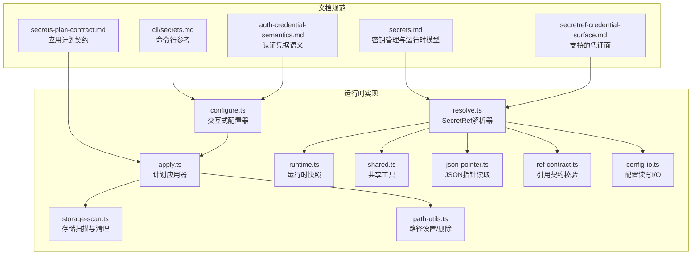
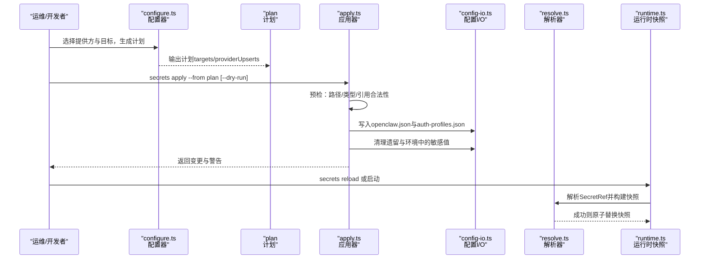
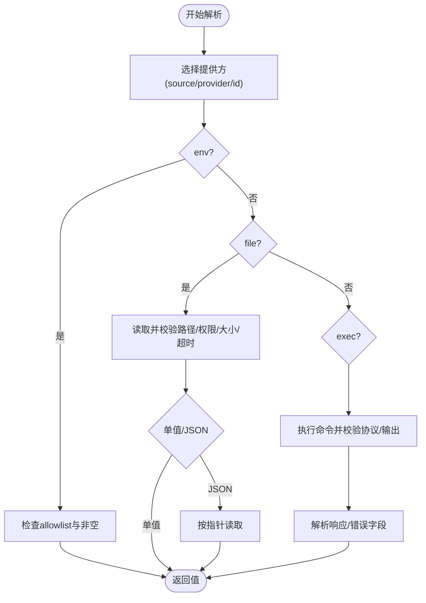
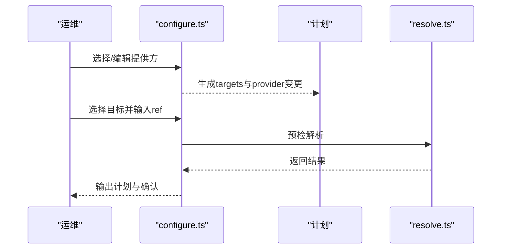
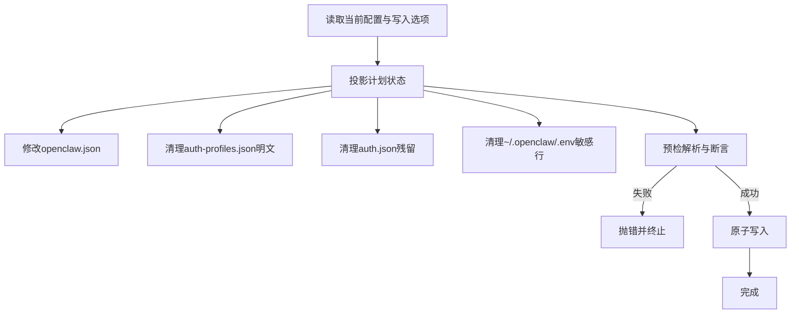
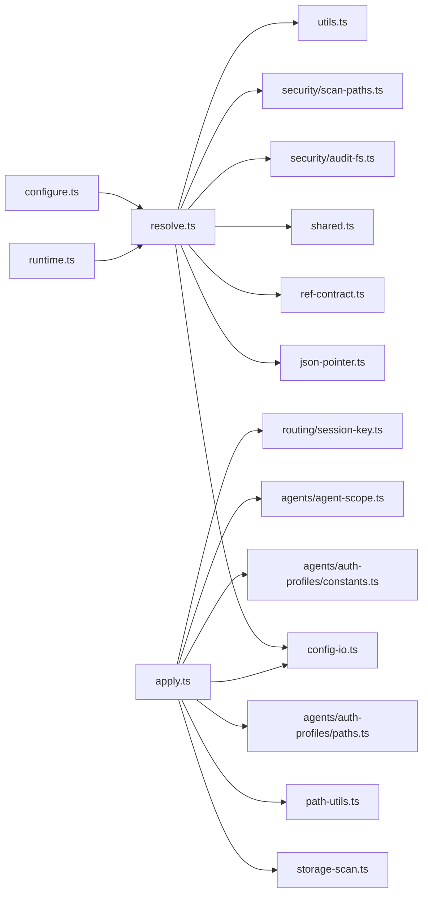

# 密钥管理

<cite>
**本文引用的文件**
- [docs/gateway/secrets.md](file://docs/gateway/secrets.md)
- [docs/reference/secretref-credential-surface.md](file://docs/reference/secretref-credential-surface.md)
- [docs/gateway/secrets-plan-contract.md](file://docs/gateway/secrets-plan-contract.md)
- [docs/cli/secrets.md](file://docs/cli/secrets.md)
- [src/secrets/resolve.ts](file://src/secrets/resolve.ts)
- [src/secrets/configure.ts](file://src/secrets/configure.ts)
- [src/secrets/apply.ts](file://src/secrets/apply.ts)
- [src/secrets/runtime.ts](file://src/secrets/runtime.ts)
- [src/secrets/shared.ts](file://src/secrets/shared.ts)
- [src/secrets/json-pointer.ts](file://src/secrets/json-pointer.ts)
- [src/secrets/ref-contract.ts](file://src/secrets/ref-contract.ts)
- [src/secrets/provider-env-vars.ts](file://src/secrets/provider-env-vars.ts)
- [src/secrets/storage-scan.ts](file://src/secrets/storage-scan.ts)
- [src/secrets/config-io.ts](file://src/secrets/config-io.ts)
- [src/secrets/auth-profiles-scan.ts](file://src/secrets/auth-profiles-scan.ts)
- [src/secrets/secret-value.ts](file://src/secrets/secret-value.ts)
- [src/secrets/path-utils.ts](file://src/secrets/path-utils.ts)
- [src/config/types.secrets.ts](file://src/config/types.secrets.ts)
- [src/config/config.ts](file://src/config/config.ts)
- [src/utils.ts](file://src/utils.ts)
- [src/security/audit-fs.ts](file://src/security/audit-fs.ts)
- [src/security/scan-paths.ts](file://src/security/scan-paths.ts)
- [src/agents/auth-profiles/paths.ts](file://src/agents/auth-profiles/paths.ts)
- [src/agents/auth-profiles/constants.ts](file://src/agents/auth-profiles/constants.ts)
- [src/agents/agent-scope.ts](file://src/agents/agent-scope.ts)
- [src/routing/session-key.ts](file://src/routing/session-key.ts)
- [src/infra/exec-safety.ts](file://src/infra/exec-safety.ts)
- [docs/auth-credential-semantics.md](file://docs/auth-credential-semantics.md)
</cite>

## 目录
1. [简介](#简介)
2. [项目结构](#项目结构)
3. [核心组件](#核心组件)
4. [架构总览](#架构总览)
5. [详细组件分析](#详细组件分析)
6. [依赖关系分析](#依赖关系分析)
7. [性能考量](#性能考量)
8. [故障排查指南](#故障排查指南)
9. [结论](#结论)
10. [附录](#附录)

## 简介
本指南面向OpenClaw密钥管理系统，围绕SecretRef机制、凭证管理、密钥轮换与加密存储等核心能力，提供可操作的安全配置方案。内容覆盖：
- SecretRef对象模型与三类提供方（环境变量、文件、外部命令）的解析与安全约束
- 凭证优先级与“有效表面”过滤策略
- 安全表面管理与兼容性行为（如Google Chat serviceAccountRef）
- 凭证轮换与运行时快照原子切换
- 一次性安全策略与计划化应用（apply）流程
- 多账户凭据管理与敏感信息保护、访问控制建议

## 项目结构
OpenClaw将密钥管理能力以“文档规范 + 运行时实现”的方式组织：
- 文档层：定义SecretRef契约、支持的凭证面、命令行工作流、审计与配置流程
- 实现层：解析器、配置器、应用器、运行时快照、路径工具、类型与共享工具

图表来源
- [docs/gateway/secrets.md](file://docs/gateway/secrets.md)
- [docs/reference/secretref-credential-surface.md](file://docs/reference/secretref-credential-surface.md)
- [docs/gateway/secrets-plan-contract.md](file://docs/gateway/secrets-plan-contract.md)
- [docs/cli/secrets.md](file://docs/cli/secrets.md)
- [src/secrets/resolve.ts](file://src/secrets/resolve.ts)
- [src/secrets/configure.ts](file://src/secrets/configure.ts)
- [src/secrets/apply.ts](file://src/secrets/apply.ts)
- [src/secrets/runtime.ts](file://src/secrets/runtime.ts)
- [src/secrets/shared.ts](file://src/secrets/shared.ts)
- [src/secrets/json-pointer.ts](file://src/secrets/json-pointer.ts)
- [src/secrets/ref-contract.ts](file://src/secrets/ref-contract.ts)
- [src/secrets/config-io.ts](file://src/secrets/config-io.ts)
- [src/secrets/storage-scan.ts](file://src/secrets/storage-scan.ts)
- [src/secrets/path-utils.ts](file://src/secrets/path-utils.ts)

章节来源
- [docs/gateway/secrets.md](file://docs/gateway/secrets.md)
- [docs/reference/secretref-credential-surface.md](file://docs/reference/secretref-credential-surface.md)
- [docs/gateway/secrets-plan-contract.md](file://docs/gateway/secrets-plan-contract.md)
- [docs/cli/secrets.md](file://docs/cli/secrets.md)

## 核心组件
- SecretRef对象模型与三类提供方
  - 环境变量提供方：通过allowlist白名单限制可用变量名，缺失或空值即解析失败
  - 文件提供方：支持单值与JSON两种模式；严格路径安全检查、超时与大小限制
  - 外部命令提供方：遵循协议版本与响应格式；支持超时、无输出超时、输出字节上限、环境变量透传、可信目录与软链策略
- 运行时快照与激活
  - 解析在启动/重载时进行，失败则启动失败或保留上一个已知良好快照
  - 原子交换：成功才替换，失败保持旧快照
  - 命令行路径可选择严格或降级读取策略
- 计划化应用（apply）
  - 严格的计划目标路径与类型校验，不满足即拒绝写入
  - 支持对openclaw.json、auth-profiles.json、遗留auth.json与~/.openclaw/.env中的敏感值进行一次性安全清理
  - 预检通过后原子写入，失败回滚
- 凭证优先级与“有效表面”
  - 同时存在明文与SecretRef时，SecretRef优先
  - 仅对“有效表面”强制解析；非激活/禁用/未选中提供方的引用视为“无效表面”，不阻塞启动/重载
- 安全表面管理与兼容性
  - Google Chat serviceAccountRef优先于明文serviceAccount
  - auth-profiles.json中的keyRef/tokenRef纳入运行时解析与审计范围

章节来源
- [docs/gateway/secrets.md](file://docs/gateway/secrets.md)
- [docs/reference/secretref-credential-surface.md](file://docs/reference/secretref-credential-surface.md)
- [docs/gateway/secrets-plan-contract.md](file://docs/gateway/secrets-plan-contract.md)
- [docs/cli/secrets.md](file://docs/cli/secrets.md)

## 架构总览
下图展示从配置到运行时的关键交互：配置生成计划 → 预检与应用 → 原子写入 → 运行时快照解析。

图表来源
- [src/secrets/configure.ts](file://src/secrets/configure.ts)
- [src/secrets/apply.ts](file://src/secrets/apply.ts)
- [src/secrets/config-io.ts](file://src/secrets/config-io.ts)
- [src/secrets/resolve.ts](file://src/secrets/resolve.ts)
- [src/secrets/runtime.ts](file://src/secrets/runtime.ts)

章节来源
- [src/secrets/configure.ts](file://src/secrets/configore.ts)
- [src/secrets/apply.ts](file://src/secrets/apply.ts)
- [src/secrets/resolve.ts](file://src/secrets/resolve.ts)
- [src/secrets/runtime.ts](file://src/secrets/runtime.ts)

## 详细组件分析

### SecretRef解析器（resolve.ts）
- 提供方抽象与错误类型
  - SecretProviderResolutionError：提供方级错误（路径不可读、超时、权限问题等）
  - SecretRefResolutionError：引用级错误（变量缺失、JSON指针不存在、执行返回为空等）
- 路径与权限安全
  - 绝对路径要求；Windows下ACL不可验证时默认失败闭合
  - 可允许软链与可信目录；禁止世界可读/可写
- 环境变量提供方
  - allowlist白名单；空值即失败
- 文件提供方
  - 单值模式直接返回文本；JSON模式需为对象且按指针读取
  - 超时、最大字节数限制
- 外部命令提供方
  - 协议版本1；必须返回包含values的对象
  - 支持per-id错误字段；超时、无输出超时、输出大小限制
- 并发与批处理
  - 提供并发度、每提供方最大引用数、批量字节上限等限制

图表来源
- [src/secrets/resolve.ts](file://src/secrets/resolve.ts)
- [src/secrets/json-pointer.ts](file://src/secrets/json-pointer.ts)
- [src/secrets/ref-contract.ts](file://src/secrets/ref-contract.ts)
- [src/security/audit-fs.ts](file://src/security/audit-fs.ts)
- [src/security/scan-paths.ts](file://src/security/scan-paths.ts)

章节来源
- [src/secrets/resolve.ts](file://src/secrets/resolve.ts)
- [src/secrets/json-pointer.ts](file://src/secrets/json-pointer.ts)
- [src/secrets/ref-contract.ts](file://src/secrets/ref-contract.ts)
- [src/security/audit-fs.ts](file://src/security/audit-fs.ts)
- [src/security/scan-paths.ts](file://src/security/scan-paths.ts)

### 交互式配置器（configure.ts）
- 工作流
  - 先配置提供方（env/file/exec），再映射目标（openclaw.json与auth-profiles.json），最后预检与可选应用
- 提示与校验
  - 提供方别名、source选择、参数提示与正则/范围校验
  - 对安全可执行路径进行安全检查
- 代理与默认提供方
  - 支持为env/file/exec设置默认别名，简化引用
- 与计划生成
  - 生成SecretsApplyPlan，包含targets与provider变更

图表来源
- [src/secrets/configure.ts](file://src/secrets/configure.ts)
- [src/secrets/resolve.ts](file://src/secrets/resolve.ts)

章节来源
- [src/secrets/configure.ts](file://src/secrets/configure.ts)
- [src/infra/exec-safety.ts](file://src/infra/exec-safety.ts)
- [src/secrets/provider-env-vars.ts](file://src/secrets/provider-env-vars.ts)

### 计划应用器（apply.ts）
- 计划契约
  - 严格的目标类型与路径校验；禁止原型链相关段
  - auth-profiles目标需提供agentId
- 变更投影
  - 对openclaw.json：写入SecretRef并清理明文
  - 对auth-profiles.json：清理对应provider的明文与旧ref，写入新ref
  - 对遗留auth.json与~/.openclaw/.env：清理已迁移的敏感值
- 原子写入与回滚
  - 写入前捕获快照，失败时尽力恢复
- 预检验证
  - 对每个目标进行解析与值类型断言，确保运行时可用

图表来源
- [src/secrets/apply.ts](file://src/secrets/apply.ts)
- [src/secrets/storage-scan.ts](file://src/secrets/storage-scan.ts)
- [src/secrets/path-utils.ts](file://src/secrets/path-utils.ts)

章节来源
- [src/secrets/apply.ts](file://src/secrets/apply.ts)
- [src/secrets/storage-scan.ts](file://src/secrets/storage-scan.ts)
- [src/secrets/path-utils.ts](file://src/secrets/path-utils.ts)

### 运行时快照与激活（runtime.ts + resolve.ts）
- 激活时机
  - 启动预检与最终激活、配置热应用、重启校验、手动reload
- 行为约定
  - 成功原子替换；启动失败中止；重载失败保留上一个已知良好快照
- 命令行路径
  - 严格路径：要求可用，不可降级
  - 降级路径：优先读取活动快照，不可用时尝试本地回退

章节来源
- [src/secrets/runtime.ts](file://src/secrets/runtime.ts)
- [src/secrets/resolve.ts](file://src/secrets/resolve.ts)
- [docs/gateway/secrets.md](file://docs/gateway/secrets.md)

### 类型与契约（types.secrets.ts + ref-contract.ts）
- SecretRef对象形状与source/provider/id约束
- 默认提供方别名解析
- 引用键与路径工具

章节来源
- [src/config/types.secrets.ts](file://src/config/types.secrets.ts)
- [src/secrets/ref-contract.ts](file://src/secrets/ref-contract.ts)

## 依赖关系分析
- 组件耦合
  - resolve.ts被runtime.ts与apply.ts共同依赖，作为解析核心
  - configure.ts依赖resolve.ts进行预检
  - apply.ts依赖config-io.ts、storage-scan.ts、path-utils.ts进行写入与清理
- 外部依赖
  - 文件系统与进程执行（child_process）
  - 安全审计工具（权限检查、路径扫描）

图表来源
- [src/secrets/configure.ts](file://src/secrets/configure.ts)
- [src/secrets/resolve.ts](file://src/secrets/resolve.ts)
- [src/secrets/apply.ts](file://src/secrets/apply.ts)
- [src/secrets/config-io.ts](file://src/secrets/config-io.ts)
- [src/secrets/json-pointer.ts](file://src/secrets/json-pointer.ts)
- [src/secrets/ref-contract.ts](file://src/secrets/ref-contract.ts)
- [src/secrets/shared.ts](file://src/secrets/shared.ts)
- [src/secrets/storage-scan.ts](file://src/secrets/storage-scan.ts)
- [src/secrets/path-utils.ts](file://src/secrets/path-utils.ts)
- [src/agents/auth-profiles/paths.ts](file://src/agents/auth-profiles/paths.ts)
- [src/agents/auth-profiles/constants.ts](file://src/agents/auth-profiles/constants.ts)
- [src/agents/agent-scope.ts](file://src/agents/agent-scope.ts)
- [src/routing/session-key.ts](file://src/routing/session-key.ts)
- [src/utils.ts](file://src/utils.ts)
- [src/security/audit-fs.ts](file://src/security/audit-fs.ts)
- [src/security/scan-paths.ts](file://src/security/scan-paths.ts)

章节来源
- [src/secrets/configure.ts](file://src/secrets/configure.ts)
- [src/secrets/resolve.ts](file://src/secrets/resolve.ts)
- [src/secrets/apply.ts](file://src/secrets/apply.ts)
- [src/secrets/runtime.ts](file://src/secrets/runtime.ts)

## 性能考量
- 并发与批处理
  - 限制每提供方最大引用数与批量字节上限，避免过载
- I/O与超时
  - 文件读取与外部命令执行均有限时与无输出超时，防止阻塞
- 快照与热应用
  - 原子替换减少运行时抖动；失败快速回滚降低风险

[本节为通用指导，无需特定文件来源]

## 故障排查指南
- 常见错误与诊断
  - 提供方路径不可读/权限过大：检查绝对路径、软链与权限
  - 外部命令超时/无输出超时/输出过大：调整超时与输出上限
  - 引用ID不在allowlist或JSON指针不存在：核对提供方别名与ID
  - 计划目标路径非法：使用官方计划契约校验
- 降级与恢复
  - 重载失败进入降级状态，等待下次成功激活恢复
  - apply失败会尽力回滚已写入文件

章节来源
- [src/secrets/resolve.ts](file://src/secrets/resolve.ts)
- [src/secrets/apply.ts](file://src/secrets/apply.ts)
- [docs/gateway/secrets.md](file://docs/gateway/secrets.md)

## 结论
OpenClaw通过SecretRef与三类提供方，实现了对凭证的集中、安全与可审计管理。结合“有效表面”过滤、严格的计划契约与一次性安全策略，系统在保障生产可用性的同时，显著降低了密钥泄露风险。建议在团队内推广标准的SecretRef配置模板与轮换流程，并定期进行审计与预检。

[本节为总结，无需特定文件来源]

## 附录

### 凭证矩阵与优先级
- 支持的凭证面详见“SecretRef凭证面”文档
- 优先级规则
  - 明文与SecretRef同时存在时，SecretRef优先
  - auth-profiles.json中的keyRef/tokenRef参与运行时解析与审计
  - Google Chat serviceAccountRef优先于明文serviceAccount

章节来源
- [docs/reference/secretref-credential-surface.md](file://docs/reference/secretref-credential-surface.md)
- [docs/gateway/secrets.md](file://docs/gateway/secrets.md)
- [docs/auth-credential-semantics.md](file://docs/auth-credential-semantics.md)

### 密钥轮换与运行时快照
- 轮换步骤
  - 在外部密钥库更新凭据
  - 使用“secrets reload”重新解析并原子替换快照
  - 如失败，系统保持上一个已知良好快照
- 计划化应用
  - 通过“secrets apply”生成计划并一次性清理明文残留

章节来源
- [docs/gateway/secrets.md](file://docs/gateway/secrets.md)
- [docs/cli/secrets.md](file://docs/cli/secrets.md)
- [src/secrets/apply.ts](file://src/secrets/apply.ts)

### 安全存储最佳实践
- 环境变量提供方
  - 使用allowlist限制变量名；确保非空
- 文件提供方
  - 严格路径安全检查；单值模式用于简单场景；JSON模式配合指针定位
- 外部命令提供方
  - 仅允许受信任路径与可信目录；必要时允许软链并配以可信目录
  - 透传最小化环境变量集合
- 一次性安全策略
  - apply不写回滚备份；失败时尽力恢复
  - 预检通过后再写入，确保运行时可用

章节来源
- [docs/gateway/secrets.md](file://docs/gateway/secrets.md)
- [src/secrets/resolve.ts](file://src/secrets/resolve.ts)
- [src/secrets/apply.ts](file://src/secrets/apply.ts)

### 凭据轮换策略
- 自动检测与预检
  - onboarding阶段对SecretRef进行预检
- 手动触发
  - 使用“secrets reload”在凭据更新后立即生效
- 计划化迁移
  - 使用“secrets configure”生成计划，再“secrets apply”一次性迁移

章节来源
- [docs/gateway/secrets.md](file://docs/gateway/secrets.md)
- [docs/cli/secrets.md](file://docs/cli/secrets.md)
- [src/secrets/configure.ts](file://src/secrets/configure.ts)
- [src/secrets/apply.ts](file://src/secrets/apply.ts)

### 多账户凭据管理
- auth-profiles.json
  - 按agentId隔离凭据存储
  - 支持新建与映射provider目标
- 运行时解析
  - 加载对应agent目录下的凭据存储
- 清理策略
  - 对应provider的明文与旧ref会被清理

章节来源
- [src/secrets/configure.ts](file://src/secrets/configure.ts)
- [src/secrets/apply.ts](file://src/secrets/apply.ts)
- [src/agents/auth-profiles/paths.ts](file://src/agents/auth-profiles/paths.ts)
- [src/agents/agent-scope.ts](file://src/agents/agent-scope.ts)
- [src/routing/session-key.ts](file://src/routing/session-key.ts)

### 敏感信息保护与访问控制
- 路径与权限
  - 严格要求绝对路径；禁止世界可读/可写；Windows下ACL不可验证时失败闭合
- 最小权限原则
  - 外部命令仅透传必要环境变量；可信目录白名单
- 一次性安全
  - 不记录历史明文备份；失败回滚

章节来源
- [src/secrets/resolve.ts](file://src/secrets/resolve.ts)
- [src/security/audit-fs.ts](file://src/security/audit-fs.ts)
- [src/security/scan-paths.ts](file://src/security/scan-paths.ts)
- [src/secrets/apply.ts](file://src/secrets/apply.ts)