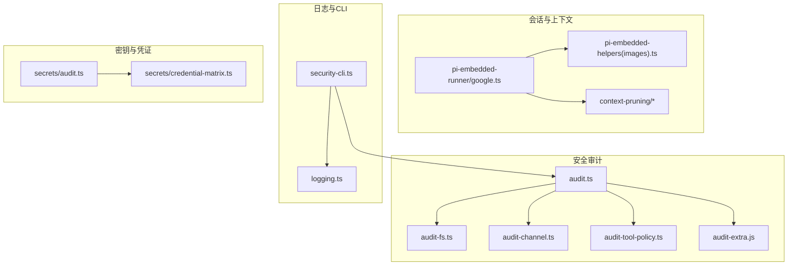
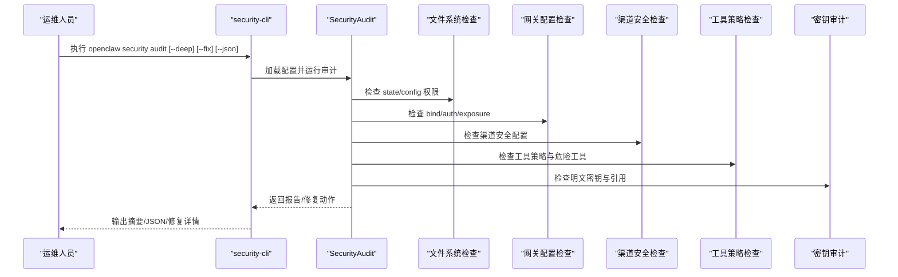
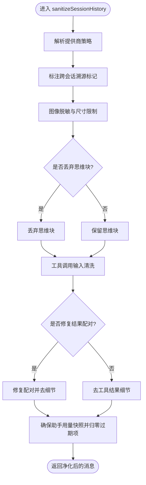
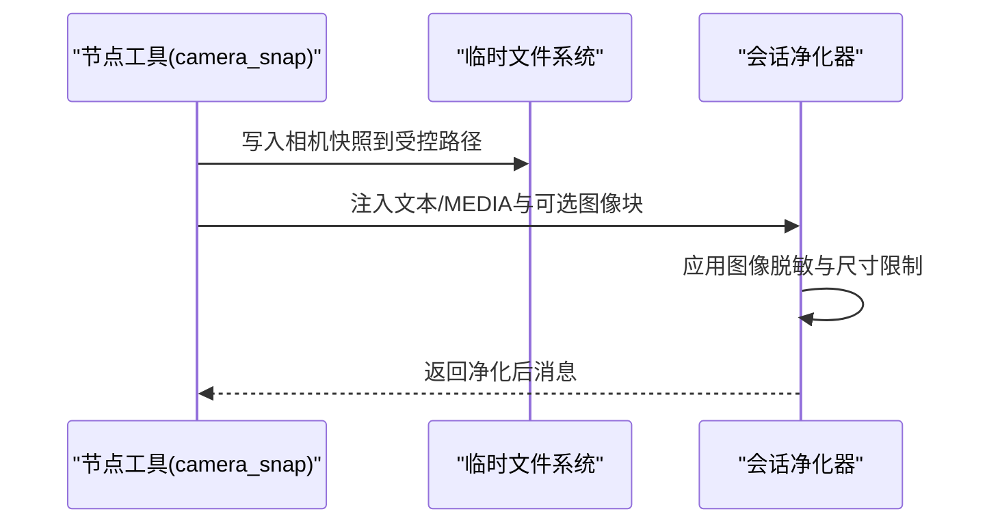
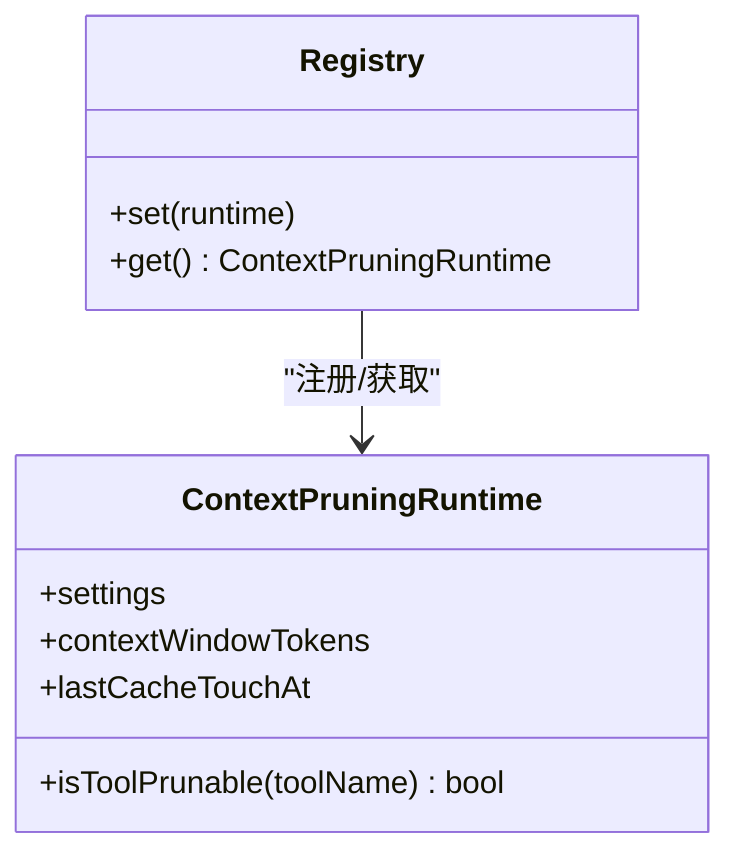
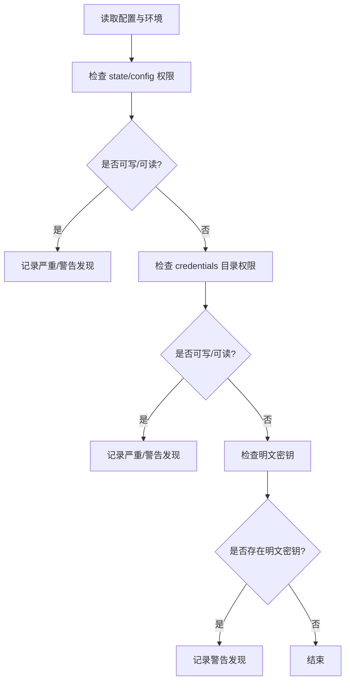
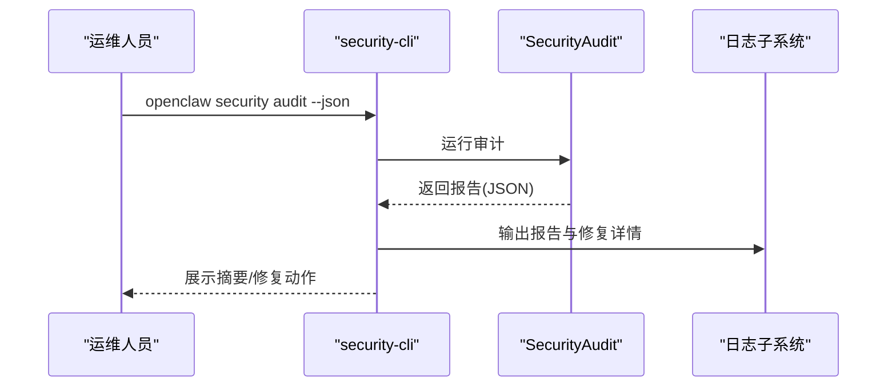
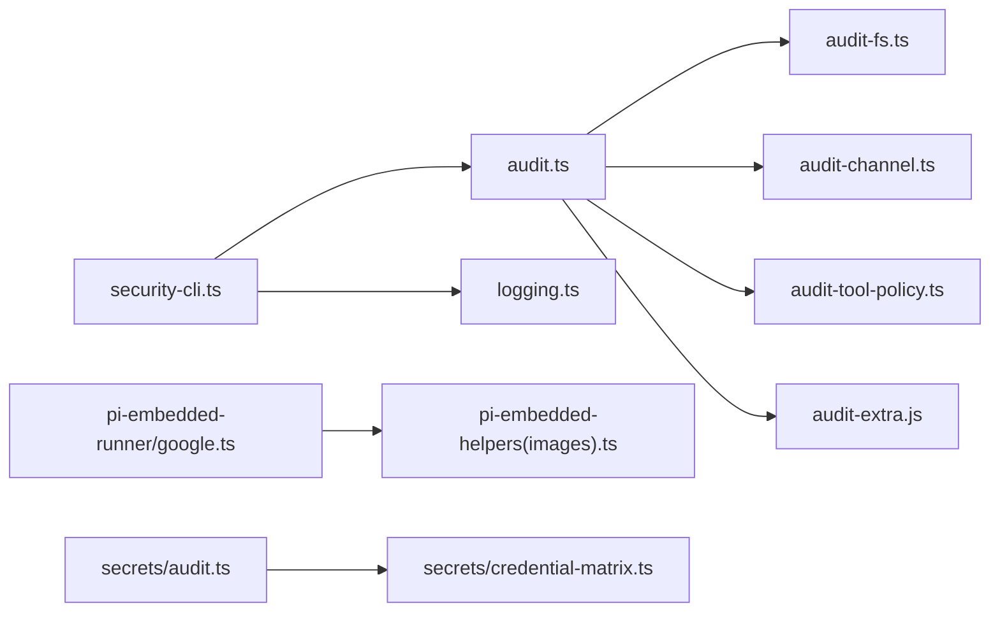

# 数据保护

<cite>
**本文引用的文件**
- [SECURITY.md](file://SECURITY.md)
- [src/security/audit.ts](file://src/security/audit.ts)
- [src/cli/security-cli.ts](file://src/cli/security-cli.ts)
- [docs/reference/transcript-hygiene.md](file://docs/reference/transcript-hygiene.md)
- [src/agents/pi-embedded-runner/google.ts](file://src/agents/pi-embedded-runner/google.ts)
- [src/agents/pi-embedded-helpers.sanitize-session-messages-images.removes-empty-assistant-text-blocks-but-preserves.test.ts](file://src/agents/pi-embedded-helpers.sanitize-session-messages-images.removes-empty-assistant-text-blocks-but-preserves.test.ts)
- [src/agents/tools/nodes-tool.ts](file://src/agents/tools/nodes-tool.ts)
- [src/agents/openclaw-tools.camera.test.ts](file://src/agents/openclaw-tools.camera.test.ts)
- [src/security/audit-extra.async.ts](file://src/security/audit-extra.async.ts)
- [src/logging.ts](file://src/logging.ts)
- [docs/cli/security.md](file://docs/cli/security.md)
- [src/agents/pi-extensions/context-pruning.ts](file://src/agents/pi-extensions/context-pruning.ts)
- [src/agents/pi-extensions/context-pruning/runtime.ts](file://src/agents/pi-extensions/context-pruning/runtime.ts)
- [src/channels/account-snapshot-fields.ts](file://src/channels/account-snapshot-fields.ts)
- [src/secrets/audit.ts](file://src/secrets/audit.ts)
- [src/secrets/credential-matrix.ts](file://src/secrets/credential-matrix.ts)
- [src/security/audit-channel.ts](file://src/security/audit-channel.ts)
- [src/security/audit-fs.ts](file://src/security/audit-fs.ts)
- [src/security/audit-tool-policy.ts](file://src/security/audit-tool-policy.ts)
- [src/security/audit-extra.sync.ts](file://src/security/audit-extra.sync.ts)
- [src/security/audit-extra.async.ts](file://src/security/audit-extra.async.ts)
- [src/security/audit-extra.js](file://src/security/audit-extra.js)
- [src/security/audit-extra.sync.test.ts](file://src/security/audit-extra.sync.test.ts)
- [src/security/audit-extra.async.test.ts](file://src/security/audit-extra.async.test.ts)
- [src/security/audit-channel.test.ts](file://src/security/audit-channel.test.ts)
- [src/security/audit-fs.test.ts](file://src/security/audit-fs.test.ts)
- [src/security/audit-tool-policy.test.ts](file://src/security/audit-tool-policy.test.ts)
- [src/security/audit.test.ts](file://src/security/audit.test.ts)
- [src/security/audit.ts](file://src/security/audit.ts)
- [src/security/audit.ts](file://src/security/audit.ts)
- [src/security/audit.ts](file://src/security/audit.ts)
- [src/security/audit.ts](file://src/security/audit.ts)
- [src/security/audit.ts](file://src/security/audit.ts)
- [src/security/audit.ts](file://src/security/audit.ts)
- [src/security/audit.ts](file://src/security/audit.ts)
- [src/security/audit.ts](file://src/security/audit.ts)
- [src/security/audit.ts](file://src/security/audit.ts)
- [src/security/audit.ts](file://src/security/audit.ts)
- [src/security/audit.ts](file://src/security/audit.ts)
- [src/security/audit.ts](file://src/security/audit.ts)
- [src/security/audit.ts](file://src/security/audit.ts)
- [src/security/audit.ts](file://src/security/audit.ts)
- [src/security/audit.ts](file://src/security/audit.ts)
- [src/security/audit.ts](file://src/security/audit.ts)
- [src/security/audit.ts](file://src/security/audit.ts)
- [src/security/audit.ts](file://src/security/audit.ts)
- [src/security/audit.ts](file://src/security/audit.ts)
- [src/security/audit.ts](file://src/security/audit.ts)
- [src/security/audit.ts](file://src/security/audit.ts)
- [src/security/audit.ts](file://src/security/audit.ts)
- [src/security/audit.ts](file://src/security/audit.ts)
- [src/security/audit.ts](file://src/security/audit.ts)
- [src/security/audit.ts](file://src/security/audit.ts)
- [src/security/audit.ts](file://src/security/audit.ts)
- [src/security/audit.ts](file://src/security/audit.ts)
- [src/security/audit.ts](file://src/security/audit.ts)
- [src/security/audit.ts](file://src/security/audit.ts)
- [src/security/audit.ts](file://src/security/audit.ts)
- [src/security/audit.ts](file://src/security/audit.ts)
- [src/security/audit.ts](file://src/security/audit.ts)
......
</cite>

## 目录
1. [简介](#简介)
2. [项目结构](#项目结构)
3. [核心组件](#核心组件)
4. [架构总览](#架构总览)
5. [详细组件分析](#详细组件分析)
6. [依赖关系分析](#依赖关系分析)
7. [性能考量](#性能考量)
8. [故障排查指南](#故障排查指南)
9. [结论](#结论)
10. [附录](#附录)

## 简介
本文件面向OpenClaw数据保护系统的安全配置与实践，聚焦以下关键能力：
- 聊天内容净化：基于会话政策的工具调用输入清洗、思维块处理、图像脱敏与转写限制
- 图像探测与快照脱敏：相机快照与媒体文件的临时路径管理、图像尺寸与格式控制
- 上下文保护：跨会话消息溯源标记、上下文裁剪与使用量归零策略
- 敏感信息过滤与隐私保护：配置文件权限检查、密钥审计、日志敏感字段脱敏
- 审计与合规：本地安全审计CLI、深度探测、自动修复建议与合规指引
- 访问日志与审计追踪：日志子系统与敏感字段脱敏策略

本指南以仓库内现有实现与文档为依据，提供可操作的配置建议与最佳实践。

## 项目结构
OpenClaw在多处模块中实现数据保护与安全审计：
- 安全审计与修复：src/security 下的审计器、文件系统检查、渠道安全检查、工具策略检查等
- 会话与上下文：src/agents/pi-embedded-runner 与相关辅助模块负责会话历史净化与图像脱敏
- 日志与敏感字段：src/logging 提供日志子系统与敏感字段脱敏开关
- CLI入口：src/cli/security-cli 提供安全审计命令行接口
- 文档参考：docs/reference/transcript-hygiene.md 与 docs/cli/security.md 提供策略与CLI用法说明
- 配置与密钥：src/secrets 提供密钥审计与凭证矩阵生成

**图表来源**
- [src/security/audit.ts:1-1254](file://src/security/audit.ts#L1-L1254)
- [src/security/audit-fs.ts](file://src/security/audit-fs.ts)
- [src/security/audit-channel.ts](file://src/security/audit-channel.ts)
- [src/security/audit-tool-policy.ts](file://src/security/audit-tool-policy.ts)
- [src/security/audit-extra.js](file://src/security/audit-extra.js)
- [src/agents/pi-embedded-runner/google.ts:520-613](file://src/agents/pi-embedded-runner/google.ts#L520-L613)
- [src/agents/pi-embedded-helpers.sanitize-session-messages-images.removes-empty-assistant-text-blocks-but-preserves.test.ts:174-220](file://src/agents/pi-embedded-helpers.sanitize-session-messages-images.removes-empty-assistant-text-blocks-but-preserves.test.ts#L174-L220)
- [src/agents/pi-extensions/context-pruning.ts:1-19](file://src/agents/pi-extensions/context-pruning.ts#L1-L19)
- [src/agents/pi-extensions/context-pruning/runtime.ts:1-17](file://src/agents/pi-extensions/context-pruning/runtime.ts#L1-L17)
- [src/logging.ts:1-70](file://src/logging.ts#L1-L70)
- [src/cli/security-cli.ts:1-165](file://src/cli/security-cli.ts#L1-L165)
- [src/secrets/audit.ts:203-254](file://src/secrets/audit.ts#L203-L254)
- [src/secrets/credential-matrix.ts:35-60](file://src/secrets/credential-matrix.ts#L35-L60)

**章节来源**
- [src/security/audit.ts:1-1254](file://src/security/audit.ts#L1-L1254)
- [src/cli/security-cli.ts:1-165](file://src/cli/security-cli.ts#L1-L165)
- [src/logging.ts:1-70](file://src/logging.ts#L1-L70)
- [docs/reference/transcript-hygiene.md:1-152](file://docs/reference/transcript-hygiene.md#L1-L152)

## 核心组件
- 安全审计器（SecurityAudit）：集中收集文件系统权限、网关暴露面、浏览器控制、渠道安全、工具策略、密钥配置等发现项，并支持深度探测与自动修复
- 会话净化器（sanitizeSessionHistory）：按提供商策略对会话历史进行图像脱敏、工具调用输入清洗、思维块处理、结果配对修复与使用量归零
- 日志子系统（logging）：提供日志级别、文件输出、子系统路由与敏感字段脱敏开关
- CLI安全审计（security-cli）：提供 openclaw security audit 命令，支持 --deep、--fix、--json 等选项
- 密钥审计与凭证矩阵：检测明文密钥、跟踪引用与提供者影子覆盖，并生成用户可控凭证矩阵

**章节来源**
- [src/security/audit.ts:87-113](file://src/security/audit.ts#L87-L113)
- [src/agents/pi-embedded-runner/google.ts:520-613](file://src/agents/pi-embedded-runner/google.ts#L520-L613)
- [src/logging.ts:1-70](file://src/logging.ts#L1-L70)
- [src/cli/security-cli.ts:46-60](file://src/cli/security-cli.ts#L46-L60)
- [src/secrets/audit.ts:203-254](file://src/secrets/audit.ts#L203-L254)
- [src/secrets/credential-matrix.ts:35-60](file://src/secrets/credential-matrix.ts#L35-L60)

## 架构总览
OpenClaw的数据保护由“审计—净化—记录—合规”闭环构成：
- 审计：通过CLI触发，扫描配置文件权限、网关绑定与认证、浏览器控制、渠道与工具策略、密钥存储状态等
- 净化：在构建模型上下文前，按提供商策略对会话历史进行图像脱敏、工具调用清洗、思维块处理与结果配对修复
- 记录：统一的日志子系统支持敏感字段脱敏与文件输出，便于审计追踪
- 合规：结合信任模型与部署假设，提供最小暴露面与最小权限原则的配置建议

**图表来源**
- [src/cli/security-cli.ts:46-60](file://src/cli/security-cli.ts#L46-L60)
- [src/security/audit.ts:208-337](file://src/security/audit.ts#L208-L337)
- [src/security/audit.ts:339-687](file://src/security/audit.ts#L339-L687)
- [src/security/audit.ts:800-800](file://src/security/audit.ts#L800-L800)
- [src/security/audit.ts:983-1026](file://src/security/audit.ts#L983-L1026)
- [src/secrets/audit.ts:203-254](file://src/secrets/audit.ts#L203-L254)

## 详细组件分析

### 组件A：聊天内容净化与上下文保护
- 图像脱敏与尺寸限制：在会话历史构建前，对图像进行尺寸压缩与格式规范化，避免超限与令牌压力
- 工具调用输入清洗：丢弃缺失输入与参数的工具调用，防止部分持久化导致的提供方拒绝
- 思维块处理：根据提供商策略丢弃或标准化思维签名，保持上下文一致性
- 上下文裁剪：在请求级内存上下文中裁剪，不重写磁盘持久化的历史
- 使用量归零：对过期助手用量快照进行结构化归零，避免统计污染

**图表来源**
- [src/agents/pi-embedded-runner/google.ts:520-613](file://src/agents/pi-embedded-runner/google.ts#L520-L613)
- [docs/reference/transcript-hygiene.md:51-77](file://docs/reference/transcript-hygiene.md#L51-L77)
- [docs/reference/transcript-hygiene.md:80-94](file://docs/reference/transcript-hygiene.md#L80-L94)

**章节来源**
- [src/agents/pi-embedded-runner/google.ts:520-613](file://src/agents/pi-embedded-runner/google.ts#L520-L613)
- [docs/reference/transcript-hygiene.md:1-152](file://docs/reference/transcript-hygiene.md#L1-L152)
- [src/agents/pi-embedded-helpers.sanitize-session-messages-images.removes-empty-assistant-text-blocks-but-preserves.test.ts:174-220](file://src/agents/pi-embedded-helpers.sanitize-session-messages-images.removes-empty-assistant-text-blocks-but-preserves.test.ts#L174-L220)

### 组件B：图像探测与快照脱敏
- 相机快照流程：节点工具将相机payload写入受控临时路径，必要时注入图像内容；测试覆盖默认参数与格式映射
- 临时目录边界：强调仅允许在OpenClaw管理的临时根下使用绝对路径，避免任意主机tmp路径信任
- 介质验证与沙箱：建议插件/扩展使用SDK临时路径工具，而非直接使用系统tmp

**图表来源**
- [src/agents/tools/nodes-tool.ts:300-327](file://src/agents/tools/nodes-tool.ts#L300-L327)
- [src/agents/openclaw-tools.camera.test.ts:196-226](file://src/agents/openclaw-tools.camera.test.ts#L196-L226)
- [SECURITY.md:190-206](file://SECURITY.md#L190-L206)

**章节来源**
- [src/agents/tools/nodes-tool.ts:300-327](file://src/agents/tools/nodes-tool.ts#L300-L327)
- [src/agents/openclaw-tools.camera.test.ts:196-226](file://src/agents/openclaw-tools.camera.test.ts#L196-L226)
- [SECURITY.md:190-206](file://SECURITY.md#L190-L206)

### 组件C：上下文保护与会话溯源
- 跨会话溯源标记：在用户消息前添加短前缀，帮助模型区分内部路由消息与外部指令
- 上下文裁剪：请求级内存裁剪，避免跨请求泄露
- 使用量归零：对最新压缩时间点之前的助手用量快照进行归零，避免统计污染

**图表来源**
- [src/agents/pi-extensions/context-pruning/runtime.ts:1-17](file://src/agents/pi-extensions/context-pruning/runtime.ts#L1-L17)
- [src/agents/pi-extensions/context-pruning.ts:1-19](file://src/agents/pi-extensions/context-pruning.ts#L1-L19)

**章节来源**
- [src/agents/pi-embedded-runner/google.ts:64-78](file://src/agents/pi-embedded-runner/google.ts#L64-L78)
- [src/agents/pi-extensions/context-pruning/runtime.ts:1-17](file://src/agents/pi-extensions/context-pruning/runtime.ts#L1-L17)
- [src/agents/pi-extensions/context-pruning.ts:1-19](file://src/agents/pi-extensions/context-pruning.ts#L1-L19)

### 组件D：敏感信息过滤与隐私保护
- 配置文件权限：严格限制world/group可读写，建议使用0600/0700模式
- 渠动目录权限：credentials目录若可写/可读，存在凭证泄露风险
- 明文密钥检测：对配置中的明文值进行告警，优先使用密钥引用
- 渠道凭证状态：从凭证状态推断账户是否已配置，避免误判

**图表来源**
- [src/security/audit.ts:208-337](file://src/security/audit.ts#L208-L337)
- [src/security/audit-extra.async.ts:983-1026](file://src/security/audit-extra.async.ts#L983-L1026)
- [src/secrets/audit.ts:203-254](file://src/secrets/audit.ts#L203-L254)
- [src/channels/account-snapshot-fields.ts:61-78](file://src/channels/account-snapshot-fields.ts#L61-L78)

**章节来源**
- [src/security/audit.ts:208-337](file://src/security/audit.ts#L208-L337)
- [src/security/audit-extra.async.ts:983-1026](file://src/security/audit-extra.async.ts#L983-L1026)
- [src/secrets/audit.ts:203-254](file://src/secrets/audit.ts#L203-L254)
- [src/channels/account-snapshot-fields.ts:61-78](file://src/channels/account-snapshot-fields.ts#L61-L78)

### 组件E：日志与审计追踪
- 日志子系统：提供日志级别、文件输出、子系统路由与敏感字段脱敏开关
- CLI输出：支持JSON输出，便于CI与策略检查；--fix可应用安全修复
- 审计报告：包含严重/警告/信息计数与逐条修复建议

**图表来源**
- [src/cli/security-cli.ts:46-60](file://src/cli/security-cli.ts#L46-L60)
- [docs/cli/security.md:43-72](file://docs/cli/security.md#L43-L72)
- [src/logging.ts:1-70](file://src/logging.ts#L1-L70)

**章节来源**
- [src/cli/security-cli.ts:1-165](file://src/cli/security-cli.ts#L1-L165)
- [docs/cli/security.md:43-72](file://docs/cli/security.md#L43-L72)
- [src/logging.ts:1-70](file://src/logging.ts#L1-L70)

## 依赖关系分析
- 审计器依赖：文件系统检查、渠道安全、工具策略、密钥审计、网关探测、浏览器控制等子模块
- 会话净化器依赖：图像脱敏辅助、工具调用修复、上下文策略与使用量归零
- CLI依赖：配置加载、运行时日志输出、命令格式化与帮助格式化
- 日志子系统被CLI与审计器共同使用

**图表来源**
- [src/cli/security-cli.ts:1-165](file://src/cli/security-cli.ts#L1-L165)
- [src/security/audit.ts:1-1254](file://src/security/audit.ts#L1-L1254)
- [src/agents/pi-embedded-runner/google.ts:1-613](file://src/agents/pi-embedded-runner/google.ts#L1-L613)
- [src/logging.ts:1-70](file://src/logging.ts#L1-L70)
- [src/secrets/audit.ts:203-254](file://src/secrets/audit.ts#L203-L254)
- [src/secrets/credential-matrix.ts:35-60](file://src/secrets/credential-matrix.ts#L35-L60)

**章节来源**
- [src/security/audit.ts:1-1254](file://src/security/audit.ts#L1-L1254)
- [src/agents/pi-embedded-runner/google.ts:1-613](file://src/agents/pi-embedded-runner/google.ts#L1-L613)
- [src/cli/security-cli.ts:1-165](file://src/cli/security-cli.ts#L1-L165)
- [src/logging.ts:1-70](file://src/logging.ts#L1-L70)
- [src/secrets/audit.ts:203-254](file://src/secrets/audit.ts#L203-L254)
- [src/secrets/credential-matrix.ts:35-60](file://src/secrets/credential-matrix.ts#L35-L60)

## 性能考量
- 图像脱敏与尺寸限制：降低令牌消耗与提供方拒绝概率，同时减少上下文体积
- 工具调用清洗：避免无效/半持久化调用导致的重试与失败
- 上下文裁剪：在请求级内存中裁剪，避免跨请求上下文膨胀
- 日志脱敏：减少敏感字段输出，降低日志体量与泄露风险

[本节为通用指导，无需特定文件分析]

## 故障排查指南
- 审计报告解读：关注严重/警告计数与具体checkId，优先处理严重问题（如配置文件可写、无认证绑定非回环地址）
- 自动修复：--fix可收紧权限与默认策略，但不旋转密钥或改变网关暴露面
- 深度探测：--deep尝试对网关进行探测，注意超时与网络暴露风险
- 日志脱敏：确认 logging.redactSensitive 设置，避免敏感信息泄露

**章节来源**
- [src/cli/security-cli.ts:46-60](file://src/cli/security-cli.ts#L46-L60)
- [docs/cli/security.md:43-72](file://docs/cli/security.md#L43-L72)
- [src/security/audit.ts:339-687](file://src/security/audit.ts#L339-L687)

## 结论
OpenClaw通过“审计—净化—记录—合规”的闭环，为聊天内容、图像与上下文提供了系统化的数据保护能力。建议在生产环境中：
- 严格限制配置与状态目录权限，启用自动修复
- 在非回环绑定场景下强制认证与速率限制
- 对图像进行脱敏与尺寸限制，避免令牌压力
- 使用会话净化策略与上下文裁剪，确保上下文一致性与最小暴露
- 开启日志敏感字段脱敏，配合审计报告持续改进

[本节为总结性内容，无需特定文件分析]

## 附录
- 参考文档与信任模型：见 SECURITY.md 中的信任模型、部署假设与运营指导
- CLI用法与JSON输出：见 docs/cli/security.md 与 src/cli/security-cli.ts

**章节来源**
- [SECURITY.md:88-288](file://SECURITY.md#L88-L288)
- [docs/cli/security.md:43-72](file://docs/cli/security.md#L43-L72)
- [src/cli/security-cli.ts:30-43](file://src/cli/security-cli.ts#L30-L43)