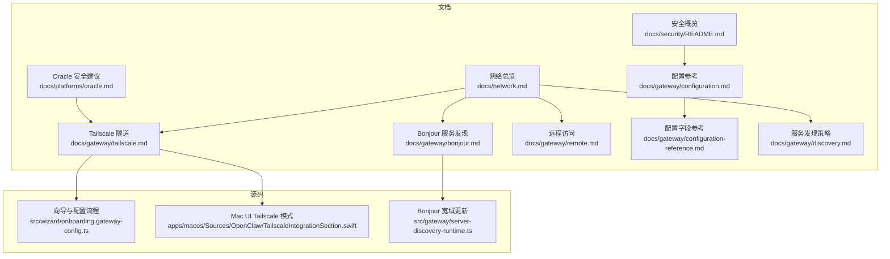
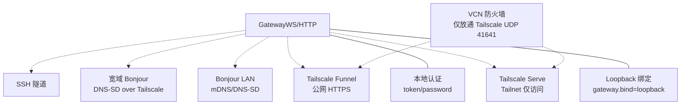
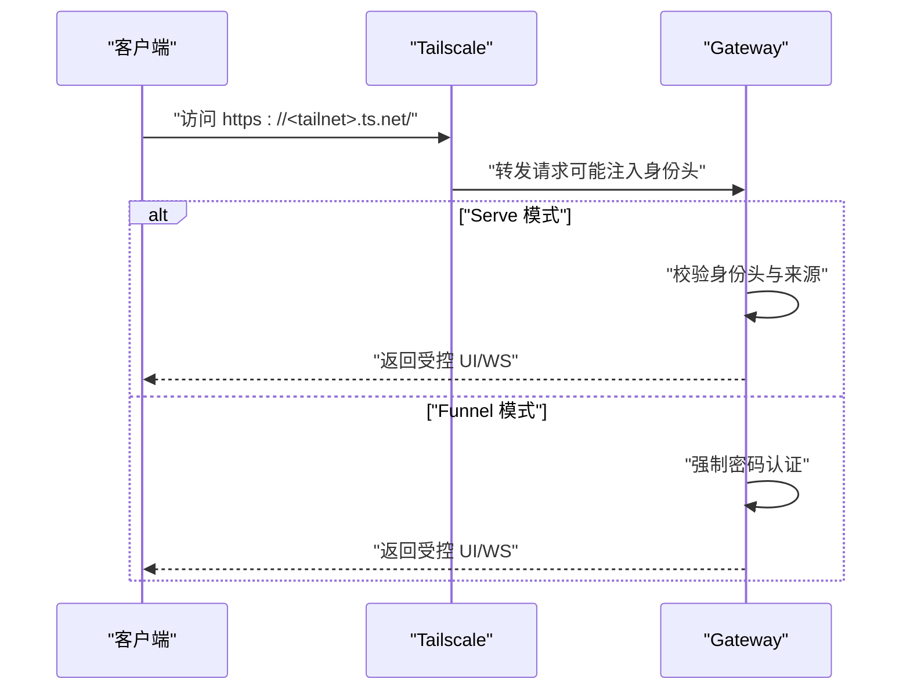
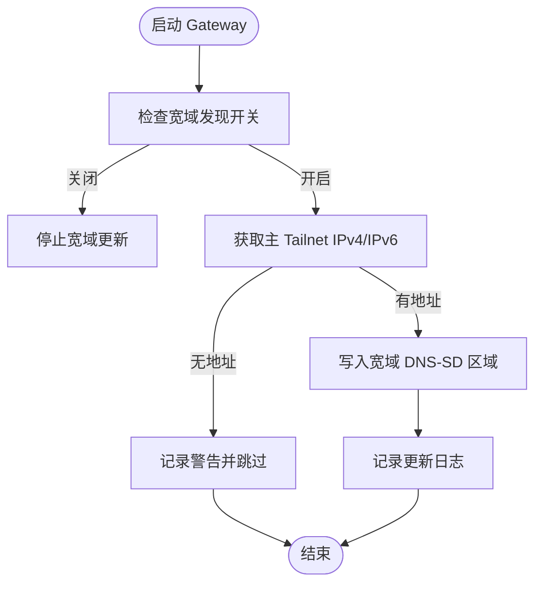
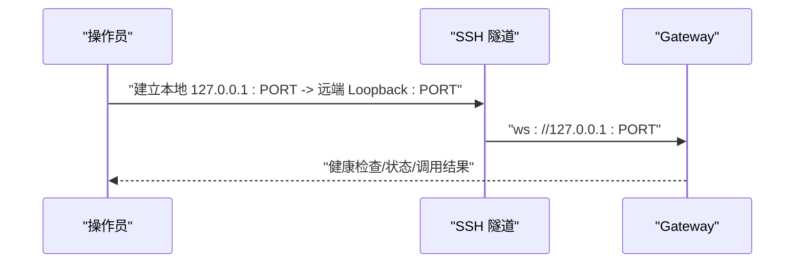
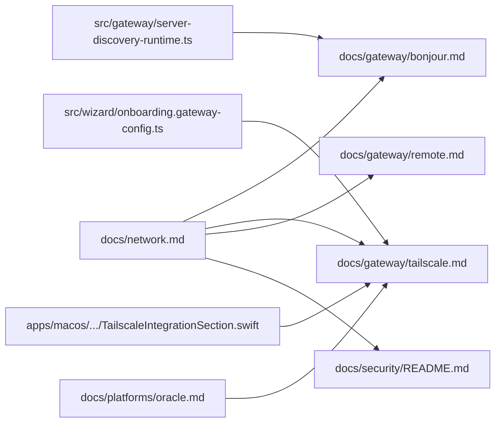

# 网络安全

<cite>
**本文引用的文件**
- [network.md](file://docs/network.md)
- [README.md](file://README.md)
- [security/README.md](file://docs/security/README.md)
- [gateway/tailscale.md](file://docs/gateway/tailscale.md)
- [gateway/bonjour.md](file://docs/gateway/bonjour.md)
- [gateway/discovery.md](file://docs/gateway/discovery.md)
- [gateway/remote.md](file://docs/gateway/remote.md)
- [gateway/configuration.md](file://docs/gateway/configuration.md)
- [gateway/configuration-reference.md](file://docs/gateway/configuration-reference.md)
- [platforms/oracle.md](file://docs/platforms/oracle.md)
- [onboarding.gateway-config.ts](file://src/wizard/onboarding.gateway-config.ts)
- [TailscaleIntegrationSection.swift](file://apps/macos/Sources/OpenClaw/TailscaleIntegrationSection.swift)
- [server-discovery-runtime.ts](file://src/gateway/server-discovery-runtime.ts)
</cite>

## 目录
1. [简介](#简介)
2. [项目结构](#项目结构)
3. [核心组件](#核心组件)
4. [架构总览](#架构总览)
5. [详细组件分析](#详细组件分析)
6. [依赖关系分析](#依赖关系分析)
7. [性能考量](#性能考量)
8. [故障排查指南](#故障排查指南)
9. [结论](#结论)
10. [附录](#附录)

## 简介
本指南面向部署与运维工程师，聚焦于 OpenClaw 网络安全部署与配置实践，涵盖网络连接安全、来源检查、Tailscale 隧道、Bonjour 服务发现、防火墙与网络隔离、远程访问安全、服务发现安全、内网穿透与远程访问控制、网络监控等主题。文档结合官方文档与源码实现，提供可操作的安全配置模板与最佳实践。

## 项目结构
OpenClaw 将“网络与安全”相关知识集中于文档目录，并在关键模块中体现安全约束与实现细节：
- 文档中心：网络总览、安全概览、Bonjour 与服务发现、Tailscale、远程访问、配置参考等
- 源码实现：向导与配置流程中的安全约束（如 Tailscale 模式与绑定策略）、Bonjour 广播与宽域 DNS-SD 更新逻辑、平台安装文档中的 VCN/防火墙建议

**图表来源**
- [network.md:10-55](file://docs/network.md#L10-L55)
- [security/README.md:1-18](file://docs/security/README.md#L1-L18)
- [gateway/bonjour.md:1-178](file://docs/gateway/bonjour.md#L1-L178)
- [gateway/tailscale.md:1-133](file://docs/gateway/tailscale.md#L1-L133)
- [gateway/remote.md:1-154](file://docs/gateway/remote.md#L1-L154)
- [gateway/discovery.md:71-98](file://docs/gateway/discovery.md#L71-L98)
- [gateway/configuration.md:1-547](file://docs/gateway/configuration.md#L1-L547)
- [gateway/configuration-reference.md:1-800](file://docs/gateway/configuration-reference.md#L1-L800)
- [onboarding.gateway-config.ts:116-157](file://src/wizard/onboarding.gateway-config.ts#L116-L157)
- [TailscaleIntegrationSection.swift:1-55](file://apps/macos/Sources/OpenClaw/TailscaleIntegrationSection.swift#L1-L55)
- [server-discovery-runtime.ts:60-100](file://src/gateway/server-discovery-runtime.ts#L60-L100)
- [platforms/oracle.md:152-188](file://docs/platforms/oracle.md#L152-L188)

**章节来源**
- [network.md:10-55](file://docs/network.md#L10-L55)
- [security/README.md:1-18](file://docs/security/README.md#L1-L18)

## 核心组件
- 网络与安全总览：链接核心网络模型、配对与身份、服务发现与传输、节点与传输、安全与排障
- Bonjour 与服务发现：LAN 便捷发现、宽域 Bonjour（unicast DNS-SD over Tailscale）、TXT 安全注意事项
- Tailscale 隧道：Serve（Tailnet）与 Funnel（公网）两种模式，身份注入与认证策略
- 远程访问：SSH 隧道、尾网直连、凭证优先级与安全规则
- 配置与策略：严格校验、热重载、环境变量与密钥注入、Hook/Webhook 安全注意事项
- 平台安全建议：以 Oracle 为例的 VCN 防火墙锁定与 Tailscale 结合

**章节来源**
- [gateway/discovery.md:71-98](file://docs/gateway/discovery.md#L71-L98)
- [gateway/bonjour.md:1-178](file://docs/gateway/bonjour.md#L1-L178)
- [gateway/tailscale.md:1-133](file://docs/gateway/tailscale.md#L1-L133)
- [gateway/remote.md:135-154](file://docs/gateway/remote.md#L135-L154)
- [gateway/configuration.md:61-73](file://docs/gateway/configuration.md#L61-L73)
- [platforms/oracle.md:152-188](file://docs/platforms/oracle.md#L152-L188)

## 架构总览
下图展示 OpenClaw 网络安全部署的关键交互：Gateway 通过 Loopback 绑定与本地认证，借助 Tailscale Serve/Funnel 实现 Tailnet 或公网访问；Bonjour 用于 LAN 便捷发现，同时支持宽域 DNS-SD；远程访问通过 SSH 隧道或 Tailnet；平台侧（如 Oracle）通过 VCN 防火墙强化边界安全。

**图表来源**
- [gateway/tailscale.md:15-42](file://docs/gateway/tailscale.md#L15-L42)
- [gateway/bonjour.md:15-31](file://docs/gateway/bonjour.md#L15-L31)
- [gateway/remote.md:135-151](file://docs/gateway/remote.md#L135-L151)
- [platforms/oracle.md:152-188](file://docs/platforms/oracle.md#L152-L188)

## 详细组件分析

### Tailscale 隧道与认证
- 模式选择
  - Serve：Tailnet 仅访问，Gateway 保持 loopback 绑定，Tailscale 注入身份头
  - Funnel：公网 HTTPS，要求密码认证
  - Off：默认不自动化
- 认证策略
  - Serve 可启用 Tailscale 身份头认证（需满足特定条件），HTTP API 仍需 token/password
  - Funnel 强制 password 模式，避免公开暴露
- 安全建议
  - 未受信任主机上禁用免密 Serve，强制 token/password
  - 仅在必要时开启 Funnel，谨慎管理共享密码
  - 支持在退出时重置 Serve/Funnel 配置

**图表来源**
- [gateway/tailscale.md:21-42](file://docs/gateway/tailscale.md#L21-L42)
- [gateway/tailscale.md:79-98](file://docs/gateway/tailscale.md#L79-L98)

**章节来源**
- [gateway/tailscale.md:15-42](file://docs/gateway/tailscale.md#L15-L42)
- [gateway/tailscale.md:79-98](file://docs/gateway/tailscale.md#L79-L98)
- [onboarding.gateway-config.ts:116-157](file://src/wizard/onboarding.gateway-config.ts#L116-L157)
- [TailscaleIntegrationSection.swift:32-55](file://apps/macos/Sources/OpenClaw/TailscaleIntegrationSection.swift#L32-L55)

### Bonjour 服务发现与安全
- LAN 便捷发现：Bonjour 作为最佳-effort 辅助，不替代 SSH 或 Tailnet
- 宽域 Bonjour：通过 Tailscale 的 split DNS 与自建 DNS 服务器发布 _openclaw-gw._tcp 记录
- 安全要点
  - TXT 为非认证提示，路由应优先解析 SRV/A/AAAA
  - TLS Pinning 不得覆盖已存储指纹
  - iOS/Android 建议按提示进行首次指纹确认
- 禁用与覆盖
  - 环境变量与配置项可禁用广告、覆盖 SSH 端口、MagicDNS、CLI 路径等

**图表来源**
- [server-discovery-runtime.ts:60-100](file://src/gateway/server-discovery-runtime.ts#L60-L100)

**章节来源**
- [gateway/bonjour.md:1-178](file://docs/gateway/bonjour.md#L1-L178)
- [gateway/discovery.md:71-98](file://docs/gateway/discovery.md#L71-L98)
- [server-discovery-runtime.ts:60-100](file://src/gateway/server-discovery-runtime.ts#L60-L100)

### 远程访问与 SSH 隧道
- 核心思想：Gateway WS 默认 loopback 绑定，远程通过 SSH 隧道或 Tailnet 访问
- 安全规则
  - 默认保持 loopback + SSH/Tailscale Serve 最安全
  - 非 loopback 绑定必须启用 token/password
  - wss:// 可通过 TLS 指纹固定远端证书
  - 浏览器控制视为操作员访问，建议 Tailnet + 明确节点配对
- 凭证优先级：显式参数 > 环境变量 > 配置（含 SecretRef）

**图表来源**
- [gateway/remote.md:69-103](file://docs/gateway/remote.md#L69-L103)

**章节来源**
- [gateway/remote.md:135-154](file://docs/gateway/remote.md#L135-L154)

### 防火墙与网络隔离（以 Oracle 为例）
- VCN 安全：仅开放 Tailscale UDP 41641，阻断 SSH、HTTP、HTTPS 等公网入口
- Gateway 绑定：保持 loopback，配合 Tailscale 提供 HTTPS 与身份认证
- 效果：在网络边缘阻断公共流量，管理访问经由 Tailnet

**章节来源**
- [platforms/oracle.md:152-188](file://docs/platforms/oracle.md#L152-L188)

### 配置与密钥管理
- 严格校验：未知键、类型错误、非法值将导致 Gateway 拒绝启动
- 热重载：大部分设置即时生效；Gateway 与基础设施变更需重启
- 环境变量与 SecretRef：支持环境变量替换、文件/命令注入密钥
- Hook/Webhook 安全：视作不受信输入，谨慎开启危险选项

**章节来源**
- [gateway/configuration.md:61-73](file://docs/gateway/configuration.md#L61-L73)
- [gateway/configuration.md:349-387](file://docs/gateway/configuration.md#L349-L387)
- [gateway/configuration.md:449-539](file://docs/gateway/configuration.md#L449-L539)
- [gateway/configuration-reference.md:1-800](file://docs/gateway/configuration-reference.md#L1-L800)

## 依赖关系分析
- 文档层：网络总览串联 Bonjour、Tailscale、远程访问与安全
- 源码层：向导与 UI 对 Tailscale 模式进行约束与提示；Bonjour 宽域更新依赖 Tailscale 地址与 split DNS
- 平台层：Oracle 安装文档提供 VCN 防火墙锁定建议

**图表来源**
- [network.md:10-55](file://docs/network.md#L10-L55)
- [onboarding.gateway-config.ts:116-157](file://src/wizard/onboarding.gateway-config.ts#L116-L157)
- [TailscaleIntegrationSection.swift:32-55](file://apps/macos/Sources/OpenClaw/TailscaleIntegrationSection.swift#L32-L55)
- [server-discovery-runtime.ts:60-100](file://src/gateway/server-discovery-runtime.ts#L60-L100)
- [platforms/oracle.md:152-188](file://docs/platforms/oracle.md#L152-L188)

**章节来源**
- [network.md:10-55](file://docs/network.md#L10-L55)

## 性能考量
- Bonjour 宽域更新：仅在具备 Tailnet IPv4/IPv6 时进行，失败时记录警告，避免无效操作
- Tailscale 模式：Serve/Funnel 仅暴露 Gateway 控制 UI 与 WS，节点复用同一 WS，减少额外端口占用
- 远程访问：SSH 隧道与 Tailnet 直连对性能影响有限，主要瓶颈在节点工具调用与上游模型服务

**章节来源**
- [server-discovery-runtime.ts:60-100](file://src/gateway/server-discovery-runtime.ts#L60-L100)
- [gateway/tailscale.md:108-110](file://docs/gateway/tailscale.md#L108-L110)

## 故障排查指南
- Bonjour 问题
  - LAN 不跨网：使用 Tailnet 或 SSH
  - 多播受限：部分 Wi-Fi 禁用 mDNS
  - 解析失败：简化主机名、重启 Gateway
  - 日志定位：关注 bonjour: 开头的滚动日志
- Tailscale 问题
  - Funnel 必须为 password 模式；Serve 需 HTTPS 与身份头
  - 退出时重置 Serve/Funnel 配置
- 远程访问问题
  - loopback-only 时必须先建立 SSH 隧道
  - 凭证优先级与 URL 覆盖规则
- 配置问题
  - 严格校验失败时仅诊断命令可用，使用 doctor 修复

**章节来源**
- [gateway/bonjour.md:149-178](file://docs/gateway/bonjour.md#L149-L178)
- [gateway/discovery.md:71-98](file://docs/gateway/discovery.md#L71-L98)
- [gateway/tailscale.md:100-126](file://docs/gateway/tailscale.md#L100-L126)
- [gateway/remote.md:135-154](file://docs/gateway/remote.md#L135-L154)
- [gateway/configuration.md:61-73](file://docs/gateway/configuration.md#L61-L73)

## 结论
通过“Loopback + SSH/Tailscale Serve/Funnel”的组合，OpenClaw 在保证易用性的同时实现了强边界安全。Bonjour 与宽域 DNS-SD 提升了跨网络发现体验，但必须遵循非认证提示原则与 TLS Pinning 最小化策略。平台侧（如 Oracle）通过 VCN 防火墙进一步强化网络边界。建议在生产环境采用 Serve/Tailnet 绑定与严格认证策略，谨慎启用 Funnel 并妥善管理共享密码。

## 附录

### 安全配置模板与建议
- 仅 Tailnet 访问（推荐）
  - Gateway 绑定：loopback
  - 认证：token/password
  - Tailscale：serve
- 公网访问（谨慎）
  - Tailscale：funnel
  - 认证：password
  - 退出时重置 Serve/Funnel
- Bonjour 与宽域发现
  - LAN：Bonjour 便捷发现
  - 跨网络：split DNS + 自建 DNS 服务器发布 _openclaw-gw._tcp
  - TXT 仅作提示，路由优先 SRV/A/AAAA
- 远程访问
  - 默认 loopback + SSH 隧道
  - Tailnet 内直连或 Tailscale Serve
  - TLS 指纹固定 wss://
- 平台防火墙
  - 仅开放 Tailscale UDP 41641，阻断 SSH、HTTP、HTTPS 等公网入口

**章节来源**
- [gateway/tailscale.md:44-98](file://docs/gateway/tailscale.md#L44-L98)
- [gateway/bonjour.md:32-67](file://docs/gateway/bonjour.md#L32-L67)
- [gateway/remote.md:135-151](file://docs/gateway/remote.md#L135-L151)
- [platforms/oracle.md:152-188](file://docs/platforms/oracle.md#L152-L188)