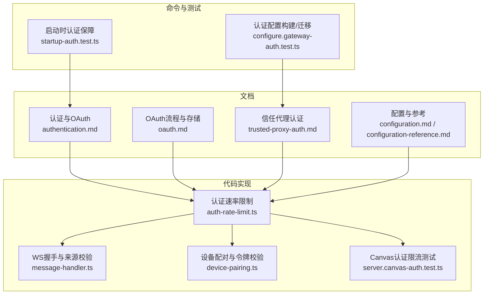
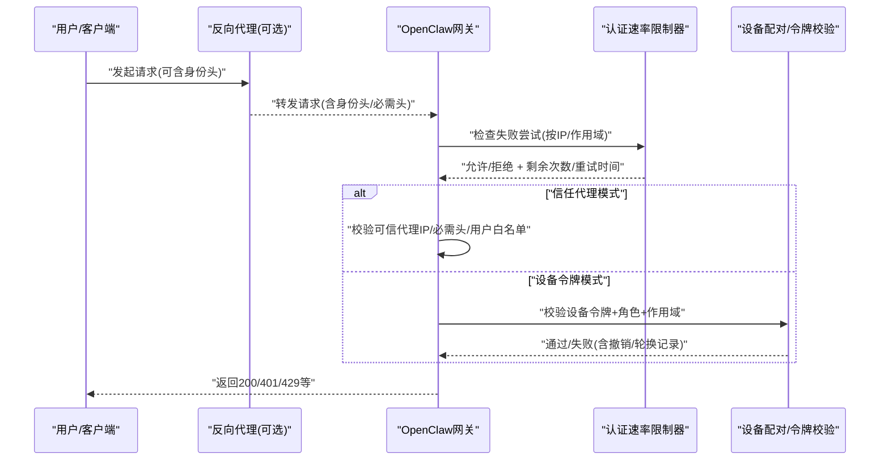
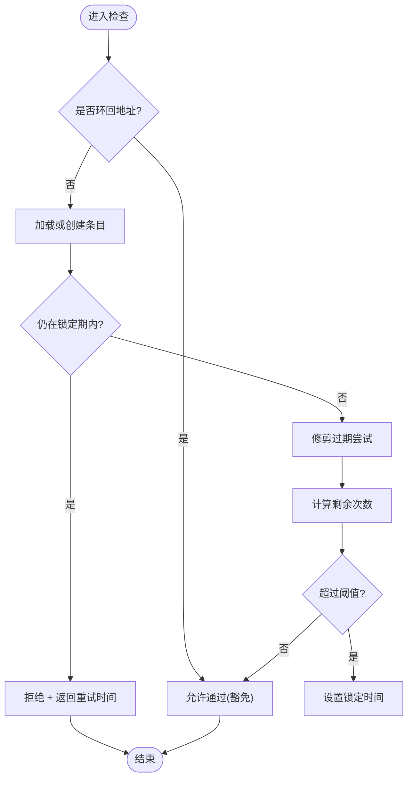
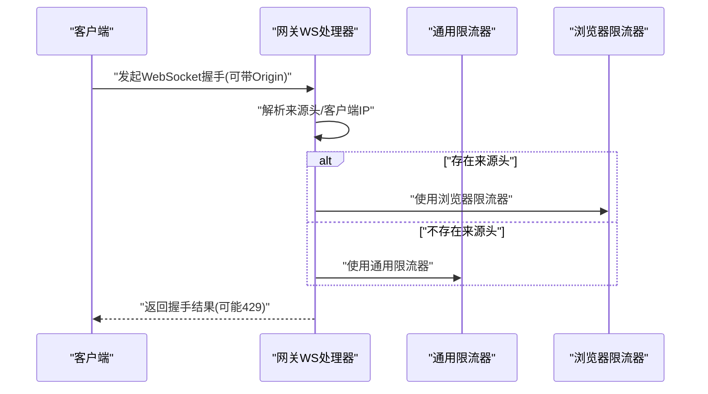
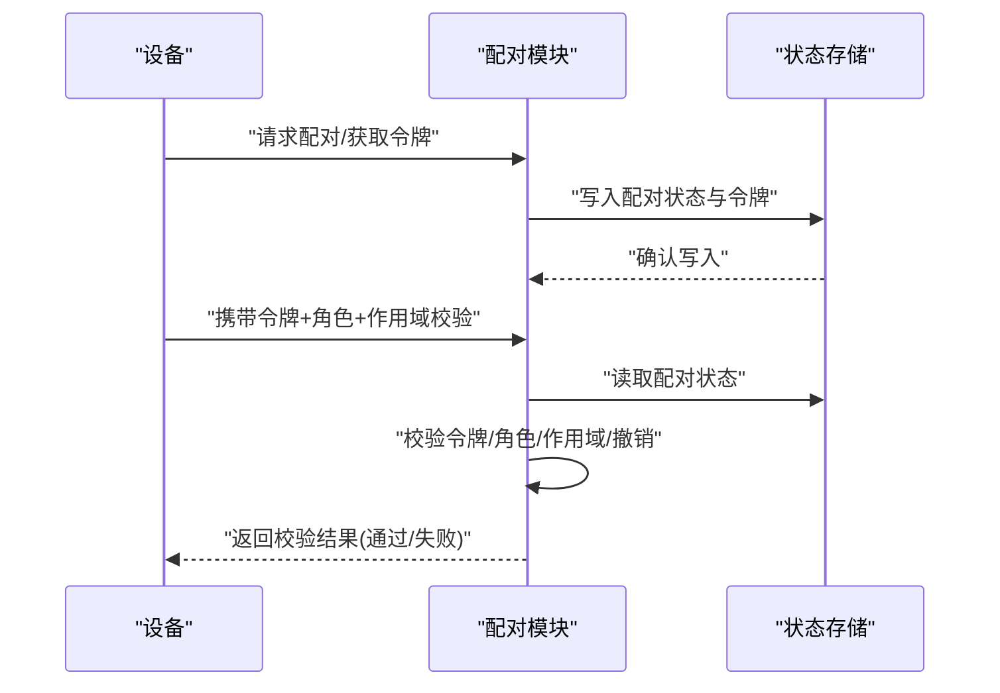
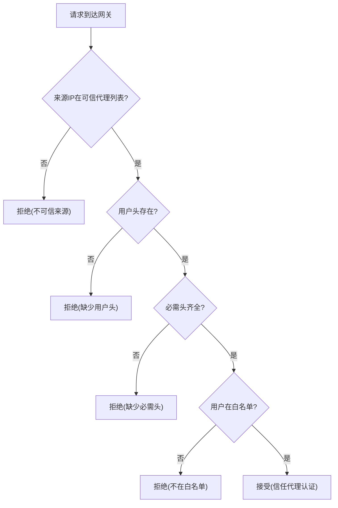
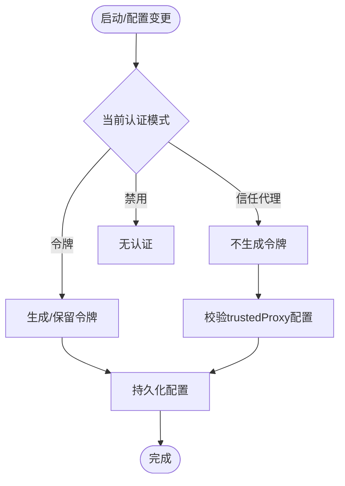
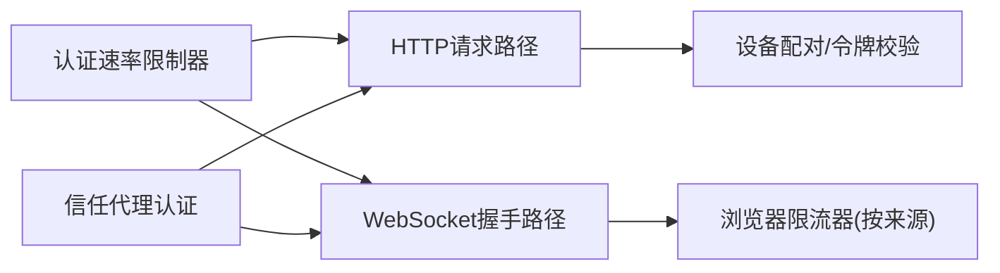

# 认证与授权

<cite>
**本文引用的文件**
- [authentication.md](file://docs/gateway/authentication.md)
- [oauth.md](file://docs/concepts/oauth.md)
- [trusted-proxy-auth.md](file://docs/gateway/trusted-proxy-auth.md)
- [configuration.md](file://docs/gateway/configuration.md)
- [configuration-reference.md](file://docs/gateway/configuration-reference.md)
- [auth-rate-limit.ts](file://src/gateway/auth-rate-limit.ts)
- [server.canvas-auth.test.ts](file://src/gateway/server.canvas-auth.test.ts)
- [message-handler.ts](file://src/gateway/server/ws-connection/message-handler.ts)
- [configure.gateway-auth.test.ts](file://src/commands/configure.gateway-auth.test.ts)
- [startup-auth.test.ts](file://src/gateway/startup-auth.test.ts)
- [device-pairing.ts](file://src/infra/device-pairing.ts)
</cite>

## 目录
1. [简介](#简介)
2. [项目结构](#项目结构)
3. [核心组件](#核心组件)
4. [架构总览](#架构总览)
5. [详细组件分析](#详细组件分析)
6. [依赖关系分析](#依赖关系分析)
7. [性能考量](#性能考量)
8. [故障排查指南](#故障排查指南)
9. [结论](#结论)
10. [附录](#附录)

## 简介
本文件面向OpenClaw认证与授权系统的安全配置，围绕以下主题展开：连接认证机制、身份验证策略、授权模式、访问控制列表、Token管理、OAuth流程、代理认证、设备认证、认证策略配置、速率限制、信任代理配置等。文档同时提供不同使用场景下的认证方案选择与最佳实践建议，并通过图示帮助读者理解关键流程。

## 项目结构
OpenClaw在多个层面提供认证与授权能力：
- 文档层：认证与OAuth、信任代理认证、配置与配置参考等文档，覆盖策略与部署要点。
- 代码层：认证速率限制器、WebSocket握手与浏览器来源校验、设备配对与令牌校验、启动时认证保障等实现。
- 命令与测试：认证配置构建与迁移、启动时认证生成与模式校验、Canvas认证速率限制测试等。

**图表来源**
- [authentication.md](file://docs/gateway/authentication.md)
- [oauth.md](file://docs/concepts/oauth.md)
- [trusted-proxy-auth.md](file://docs/gateway/trusted-proxy-auth.md)
- [configuration.md](file://docs/gateway/configuration.md)
- [configuration-reference.md](file://docs/gateway/configuration-reference.md)
- [auth-rate-limit.ts](file://src/gateway/auth-rate-limit.ts)
- [message-handler.ts](file://src/gateway/server/ws-connection/message-handler.ts)
- [device-pairing.ts](file://src/infra/device-pairing.ts)
- [server.canvas-auth.test.ts](file://src/gateway/server.canvas-auth.test.ts)
- [configure.gateway-auth.test.ts](file://src/commands/configure.gateway-auth.test.ts)
- [startup-auth.test.ts](file://src/gateway/startup-auth.test.ts)

**章节来源**
- [configuration.md](file://docs/gateway/configuration.md)
- [configuration-reference.md](file://docs/gateway/configuration-reference.md)

## 核心组件
- 认证速率限制器：基于滑动窗口的内存级限流，支持按作用域（如共享密钥、设备令牌、Hook认证）区分计数，具备周期性清理与环回地址豁免。
- WebSocket握手与来源校验：根据请求来源头与环回地址决定是否启用来源检查与浏览器专用限流器，统一速率限制入口。
- 设备配对与令牌校验：设备侧令牌生成、持久化、角色与作用域校验、撤销与轮换记录，以及配对状态读取与更新。
- 信任代理认证：通过反向代理传递的身份头进行认证，要求可信代理列表与可选的用户白名单、必需头校验。
- 启动时认证保障：在不同认证模式下生成或保留令牌，避免在受信代理模式下无谓生成令牌。
- Canvas认证限流测试：演示HTTP与WS升级路径下的429响应与重试等待头。

**章节来源**
- [auth-rate-limit.ts](file://src/gateway/auth-rate-limit.ts)
- [message-handler.ts](file://src/gateway/server/ws-connection/message-handler.ts)
- [device-pairing.ts](file://src/infra/device-pairing.ts)
- [trusted-proxy-auth.md](file://docs/gateway/trusted-proxy-auth.md)
- [startup-auth.test.ts](file://src/gateway/startup-auth.test.ts)
- [server.canvas-auth.test.ts](file://src/gateway/server.canvas-auth.test.ts)

## 架构总览
OpenClaw的认证与授权由“策略配置 + 传输层校验 + 会话/设备令牌 + 速率限制 + 可选代理认证”构成闭环。策略配置来自配置文件与命令；传输层校验包括HTTP与WebSocket；会话/设备令牌用于设备侧身份与权限；速率限制防止暴力破解；代理认证在前置反向代理完成身份鉴别后，由网关进行可信代理校验与用户白名单控制。

**图表来源**
- [auth-rate-limit.ts](file://src/gateway/auth-rate-limit.ts)
- [message-handler.ts](file://src/gateway/server/ws-connection/message-handler.ts)
- [device-pairing.ts](file://src/infra/device-pairing.ts)
- [trusted-proxy-auth.md](file://docs/gateway/trusted-proxy-auth.md)

## 详细组件分析

### 组件A：认证速率限制器
- 滑动窗口：以毫秒为单位的固定窗口，仅保留窗口内的失败尝试时间戳。
- 锁定机制：超过最大失败次数后进入锁定期，期间直接拒绝请求并返回重试时间。
- 作用域隔离：支持多作用域（默认、共享密钥、设备令牌、Hook认证），同一IP在不同作用域独立计数。
- 清理策略：定时清理过期条目，避免Map无限增长。
- 环回豁免：本地环回地址默认不参与限流，便于CLI调试。

**图表来源**
- [auth-rate-limit.ts](file://src/gateway/auth-rate-limit.ts)

**章节来源**
- [auth-rate-limit.ts](file://src/gateway/auth-rate-limit.ts)
- [server.canvas-auth.test.ts](file://src/gateway/server.canvas-auth.test.ts)

### 组件B：WebSocket握手与来源校验
- 来源头检测：若请求携带来源头，则强制执行来源检查，并可能切换到浏览器专用限流器。
- 环回地址处理：对环回地址采用特殊客户端IP标记，确保本地调试体验。
- 速率限制入口：根据是否存在来源头选择全局或浏览器限流器实例。

**图表来源**
- [message-handler.ts](file://src/gateway/server/ws-connection/message-handler.ts)

**章节来源**
- [message-handler.ts](file://src/gateway/server/ws-connection/message-handler.ts)

### 组件C：设备配对与令牌校验
- 配对状态：设备配对请求、令牌生成与持久化、撤销与轮换记录。
- 角色与作用域：规范化角色与作用域，扩展隐含关系，进行许可判定。
- 令牌校验：验证令牌哈希、角色存在性、未撤销、作用域匹配，并更新最近使用时间。

**图表来源**
- [device-pairing.ts](file://src/infra/device-pairing.ts)

**章节来源**
- [device-pairing.ts](file://src/infra/device-pairing.ts)

### 组件D：信任代理认证
- 工作原理：反向代理完成身份鉴别，将用户标识注入特定头；网关仅校验请求来源IP在可信代理列表内，并可选校验必需头与用户白名单。
- 安全清单：代理必须是唯一入口、可信代理列表最小化、代理必须覆盖而非追加转发头、TLS终止于代理、建议设置用户白名单。
- 迁移注意：从令牌模式迁移到信任代理模式时，需先验证代理连通性与身份头正确性，再更新配置并重启。

**图表来源**
- [trusted-proxy-auth.md](file://docs/gateway/trusted-proxy-auth.md)

**章节来源**
- [trusted-proxy-auth.md](file://docs/gateway/trusted-proxy-auth.md)

### 组件E：启动时认证保障与配置构建
- 模式切换：在令牌/密码/信任代理/禁用模式之间切换时，保留或丢弃相关字段（如allowTailscale），并确保信任代理模式下必须提供trustedProxy配置。
- 令牌生成：在非信任代理与非禁用模式下生成随机令牌；在信任代理模式下不生成令牌。
- 测试覆盖：通过单元测试验证配置构建逻辑与启动行为。

**图表来源**
- [configure.gateway-auth.test.ts](file://src/commands/configure.gateway-auth.test.ts)
- [startup-auth.test.ts](file://src/gateway/startup-auth.test.ts)

**章节来源**
- [configure.gateway-auth.test.ts](file://src/commands/configure.gateway-auth.test.ts)
- [startup-auth.test.ts](file://src/gateway/startup-auth.test.ts)

## 依赖关系分析
- 认证速率限制器被HTTP与WebSocket路径共同使用，作为统一的失败尝试防护层。
- WebSocket握手模块根据来源头动态选择限流器实例，体现“来源感知”的差异化保护。
- 设备配对模块与令牌校验模块独立于代理认证，但共同服务于设备侧身份与权限控制。
- 信任代理认证依赖于前置代理的正确配置与头部传递，网关侧仅做可信度与白名单校验。

**图表来源**
- [auth-rate-limit.ts](file://src/gateway/auth-rate-limit.ts)
- [message-handler.ts](file://src/gateway/server/ws-connection/message-handler.ts)
- [device-pairing.ts](file://src/infra/device-pairing.ts)
- [trusted-proxy-auth.md](file://docs/gateway/trusted-proxy-auth.md)

**章节来源**
- [auth-rate-limit.ts](file://src/gateway/auth-rate-limit.ts)
- [message-handler.ts](file://src/gateway/server/ws-connection/message-handler.ts)
- [device-pairing.ts](file://src/infra/device-pairing.ts)
- [trusted-proxy-auth.md](file://docs/gateway/trusted-proxy-auth.md)

## 性能考量
- 速率限制器采用纯内存Map，避免外部依赖，适合单进程场景；定期清理避免内存膨胀。
- 环回地址豁免减少本地调试成本，降低误伤。
- 作用域隔离使不同凭证类别的失败尝试互不影响，提升整体可用性。
- WebSocket握手路径按来源头分流限流器，有助于区分浏览器与服务端流量特征。

[本节为通用性能讨论，无需具体文件分析]

## 故障排查指南
- 信任代理错误
  - 不可信来源：检查代理IP是否在可信代理列表中，容器IP可能变化。
  - 缺少用户头：确认代理正确传递身份头且名称拼写正确。
  - 缺少必需头：检查代理链是否剥离或未传递指定头。
  - 用户不在白名单：添加用户或移除白名单限制。
  - WebSocket仍失败：确认代理支持WS升级、在升级时传递身份头且无额外认证路径。
- 速率限制触发
  - HTTP与WS均可能返回429，检查重试等待头并降低重试频率。
  - 确认环回地址是否被豁免，避免本地调试被限流影响。
- 启动/配置问题
  - 切换到信任代理模式时未提供trustedProxy配置将报错。
  - 在信任代理模式下不会自动生成令牌，需确保代理已正确传递身份信息。

**章节来源**
- [trusted-proxy-auth.md](file://docs/gateway/trusted-proxy-auth.md)
- [server.canvas-auth.test.ts](file://src/gateway/server.canvas-auth.test.ts)
- [configure.gateway-auth.test.ts](file://src/commands/configure.gateway-auth.test.ts)
- [startup-auth.test.ts](file://src/gateway/startup-auth.test.ts)

## 结论
OpenClaw提供了多层次的认证与授权能力：通过速率限制器抵御暴力破解，通过设备配对与令牌校验强化设备侧身份，通过信任代理认证实现集中式身份鉴别与细粒度白名单控制。结合配置与测试用例，系统在安全性与可用性之间取得平衡。建议在生产环境优先采用信任代理认证并严格遵循安全清单，在开发与单机场景可考虑令牌或禁用模式以简化部署。

[本节为总结性内容，无需具体文件分析]

## 附录

### 场景化认证方案选择与最佳实践
- 单机/个人使用
  - 推荐：令牌模式或禁用模式，配合环回绑定与TLS终止于网关。
  - 最佳实践：启用速率限制，避免环回豁免影响生产环境；定期轮换令牌。
- 多用户/组织内网
  - 推荐：信任代理认证（Pomerium/Caddy/nginx/Traefik），由代理完成OAuth/OIDC/SAML等鉴权。
  - 最佳实践：代理为唯一入口、可信代理列表最小化、代理覆盖转发头、设置用户白名单、TLS终止于代理。
- 远程访问/公网暴露
  - 推荐：信任代理认证 + HSTS（代理处设置）、严格安全头、最小暴露面。
  - 最佳实践：仅开放代理端口，防火墙阻断网关直连；代理侧启用WAF/速率限制。
- 设备侧接入
  - 推荐：设备配对+令牌校验，结合角色与作用域控制最小权限。
  - 最佳实践：定期轮换令牌，记录撤销与轮换时间，监控最近使用时间。

**章节来源**
- [trusted-proxy-auth.md](file://docs/gateway/trusted-proxy-auth.md)
- [configuration.md](file://docs/gateway/configuration.md)
- [configuration-reference.md](file://docs/gateway/configuration-reference.md)