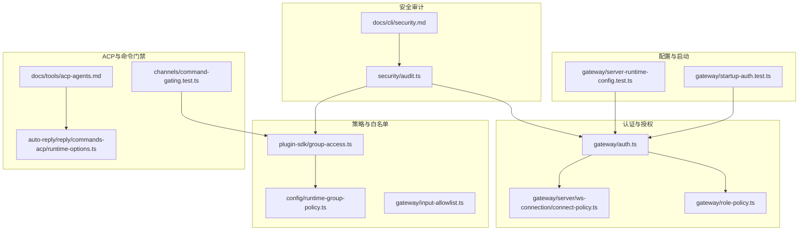
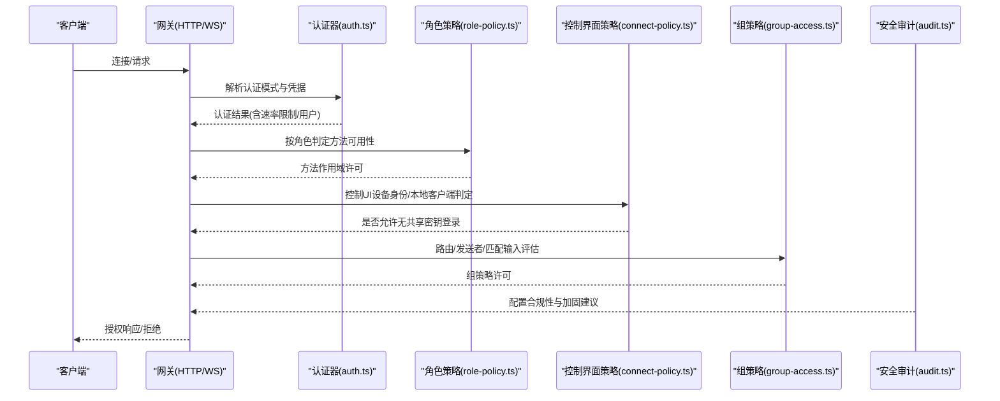
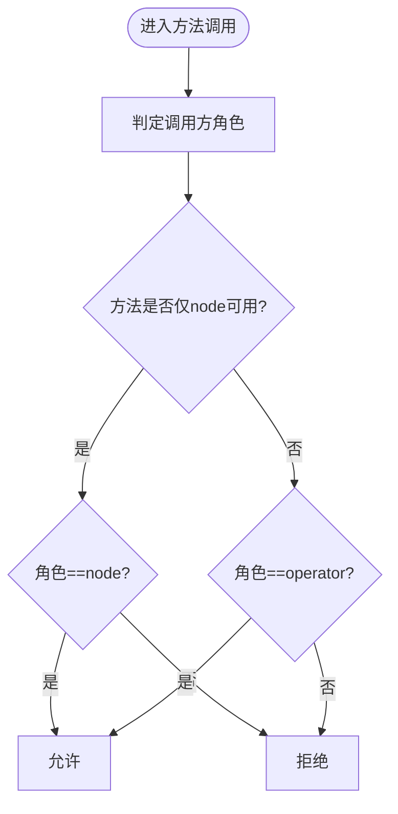
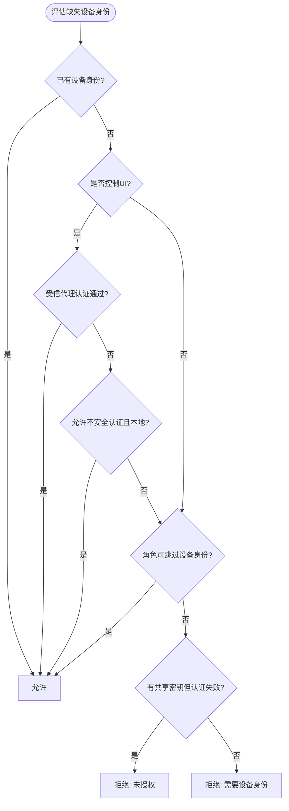
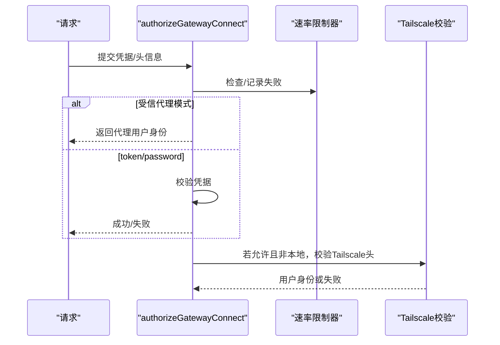
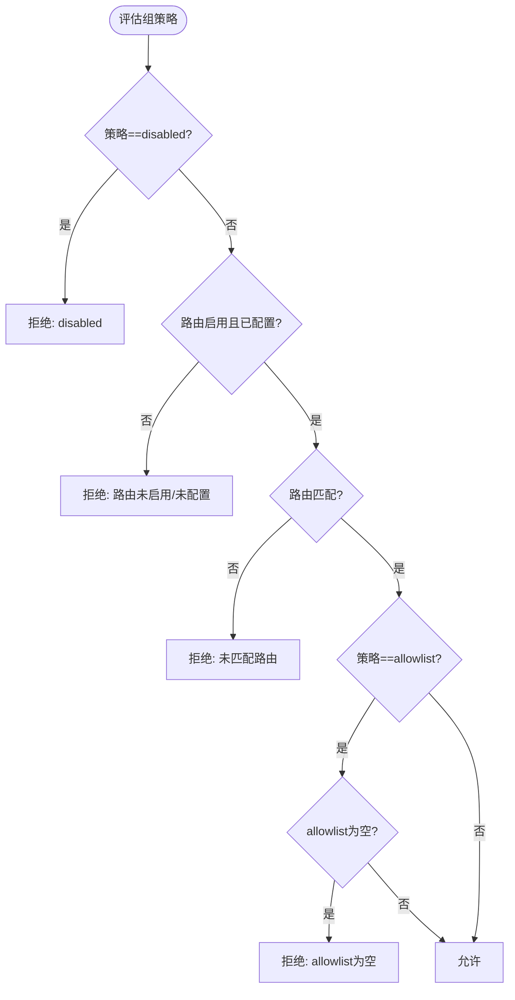
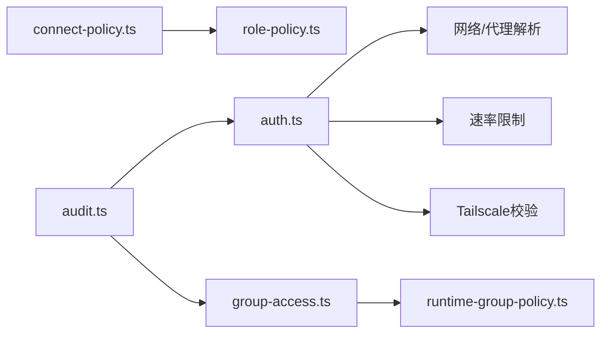

# 访问控制

<cite>
**本文引用的文件**
- [src/gateway/auth.ts](file://src/gateway/auth.ts)
- [src/gateway/role-policy.ts](file://src/gateway/role-policy.ts)
- [src/gateway/server/ws-connection/connect-policy.ts](file://src/gateway/server/ws-connection/connect-policy.ts)
- [src/gateway/server-runtime-config.test.ts](file://src/gateway/server-runtime-config.test.ts)
- [src/gateway/startup-auth.test.ts](file://src/gateway/startup-auth.test.ts)
- [src/gateway/input-allowlist.ts](file://src/gateway/input-allowlist.ts)
- [src/plugin-sdk/group-access.ts](file://src/plugin-sdk/group-access.ts)
- [src/config/runtime-group-policy.ts](file://src/config/runtime-group-policy.ts)
- [src/security/audit.ts](file://src/security/audit.ts)
- [docs/cli/security.md](file://docs/cli/security.md)
- [docs/tools/acp-agents.md](file://docs/tools/acp-agents.md)
- [src/auto-reply/reply/commands-acp/runtime-options.ts](file://src/auto-reply/reply/commands-acp/runtime-options.ts)
- [src/channels/command-gating.test.ts](file://src/channels/command-gating.test.ts)
- [SECURITY.md](file://SECURITY.md)
</cite>

## 目录
1. [简介](#简介)
2. [项目结构](#项目结构)
3. [核心组件](#核心组件)
4. [架构总览](#架构总览)
5. [详细组件分析](#详细组件分析)
6. [依赖关系分析](#依赖关系分析)
7. [性能考量](#性能考量)
8. [故障排查指南](#故障排查指南)
9. [结论](#结论)
10. [附录](#附录)

## 简介
本文件面向OpenClaw访问控制系统，系统性梳理角色策略、输入白名单、方法作用域、安全路径与认证授权、资源访问控制、API调用限制、权限分配与动态权限控制、访问审计等安全配置要点，并提供多层级权限管理与高级安全实践的实操建议。内容以仓库现有实现为依据，结合CLI安全工具与审计报告，帮助读者在不同部署形态（本地回环、局域网、反向代理、Tailscale）下建立稳健的访问控制与安全基线。

## 项目结构
围绕访问控制的关键代码分布在以下模块：
- 认证与授权：gateway/auth.ts、gateway/server/ws-connection/connect-policy.ts、gateway/role-policy.ts
- 安全审计与加固：security/audit.ts、docs/cli/security.md
- 组策略与白名单：plugin-sdk/group-access.ts、config/runtime-group-policy.ts、gateway/input-allowlist.ts
- 配置校验与启动：gateway/server-runtime-config.test.ts、gateway/startup-auth.test.ts
- ACP权限与非交互场景：docs/tools/acp-agents.md、auto-reply/reply/commands-acp/runtime-options.ts
- 命令级访问组与门禁：channels/command-gating.test.ts
- 安全边界与范围：SECURITY.md

**图表来源**
- [src/gateway/auth.ts:1-504](file://src/gateway/auth.ts#L1-L504)
- [src/gateway/server/ws-connection/connect-policy.ts:1-103](file://src/gateway/server/ws-connection/connect-policy.ts#L1-L103)
- [src/gateway/role-policy.ts:1-24](file://src/gateway/role-policy.ts#L1-L24)
- [src/plugin-sdk/group-access.ts:1-209](file://src/plugin-sdk/group-access.ts#L1-L209)
- [src/config/runtime-group-policy.ts:1-119](file://src/config/runtime-group-policy.ts#L1-L119)
- [src/gateway/input-allowlist.ts:1-9](file://src/gateway/input-allowlist.ts#L1-L9)
- [src/security/audit.ts:1-800](file://src/security/audit.ts#L1-L800)
- [docs/cli/security.md:1-72](file://docs/cli/security.md#L1-L72)
- [docs/tools/acp-agents.md:566-603](file://docs/tools/acp-agents.md#L566-L603)
- [src/auto-reply/reply/commands-acp/runtime-options.ts:265-296](file://src/auto-reply/reply/commands-acp/runtime-options.ts#L265-L296)
- [src/channels/command-gating.test.ts:1-46](file://src/channels/command-gating.test.ts#L1-L46)
- [src/gateway/server-runtime-config.test.ts:70-112](file://src/gateway/server-runtime-config.test.ts#L70-L112)
- [src/gateway/startup-auth.test.ts:308-360](file://src/gateway/startup-auth.test.ts#L308-L360)

**章节来源**
- [src/gateway/auth.ts:1-504](file://src/gateway/auth.ts#L1-L504)
- [src/gateway/server/ws-connection/connect-policy.ts:1-103](file://src/gateway/server/ws-connection/connect-policy.ts#L1-L103)
- [src/gateway/role-policy.ts:1-24](file://src/gateway/role-policy.ts#L1-L24)
- [src/plugin-sdk/group-access.ts:1-209](file://src/plugin-sdk/group-access.ts#L1-L209)
- [src/config/runtime-group-policy.ts:1-119](file://src/config/runtime-group-policy.ts#L1-L119)
- [src/gateway/input-allowlist.ts:1-9](file://src/gateway/input-allowlist.ts#L1-L9)
- [src/security/audit.ts:1-800](file://src/security/audit.ts#L1-L800)
- [docs/cli/security.md:1-72](file://docs/cli/security.md#L1-L72)
- [docs/tools/acp-agents.md:566-603](file://docs/tools/acp-agents.md#L566-L603)
- [src/auto-reply/reply/commands-acp/runtime-options.ts:265-296](file://src/auto-reply/reply/commands-acp/runtime-options.ts#L265-L296)
- [src/channels/command-gating.test.ts:1-46](file://src/channels/command-gating.test.ts#L1-L46)
- [src/gateway/server-runtime-config.test.ts:70-112](file://src/gateway/server-runtime-config.test.ts#L70-L112)
- [src/gateway/startup-auth.test.ts:308-360](file://src/gateway/startup-auth.test.ts#L308-L360)

## 核心组件
- 角色与方法作用域：通过角色枚举与方法判定，限定“operator/节点”对HTTP与WS接口的可访问方法集合。
- 控制界面认证策略：区分本地与远程、设备身份检查、反向代理信任等维度，决定是否允许无共享密钥登录或绕过设备校验。
- 共享密钥认证：支持token/password模式，含速率限制、Tailscale头注入、受信代理透传用户身份。
- 组策略与路由白名单：按provider/路由/匹配输入进行allowlist/open/disabled三态评估，支持运行时回退策略。
- 输入白名单：对主机名/域名等输入进行标准化与白名单化，避免越权或内网探测。
- 安全审计：自动扫描配置文件权限、绑定暴露面、反向代理可信度、速率限制缺失、工具启用风险等。
- ACP权限与非交互：在无TTY环境下控制文件写入/执行提示的处理策略，避免非预期崩溃或静默拒绝。

**章节来源**
- [src/gateway/role-policy.ts:14-23](file://src/gateway/role-policy.ts#L14-L23)
- [src/gateway/server/ws-connection/connect-policy.ts:5-103](file://src/gateway/server/ws-connection/connect-policy.ts#L5-L103)
- [src/gateway/auth.ts:23-77](file://src/gateway/auth.ts#L23-L77)
- [src/plugin-sdk/group-access.ts:53-143](file://src/plugin-sdk/group-access.ts#L53-L143)
- [src/config/runtime-group-policy.ts:16-87](file://src/config/runtime-group-policy.ts#L16-L87)
- [src/gateway/input-allowlist.ts:1-9](file://src/gateway/input-allowlist.ts#L1-L9)
- [src/security/audit.ts:339-687](file://src/security/audit.ts#L339-L687)
- [docs/tools/acp-agents.md:566-603](file://docs/tools/acp-agents.md#L566-L603)

## 架构总览
下图展示从客户端到服务端的认证与授权关键路径，以及策略评估与审计联动：

**图表来源**
- [src/gateway/auth.ts:378-503](file://src/gateway/auth.ts#L378-L503)
- [src/gateway/role-policy.ts:14-23](file://src/gateway/role-policy.ts#L14-L23)
- [src/gateway/server/ws-connection/connect-policy.ts:68-103](file://src/gateway/server/ws-connection/connect-policy.ts#L68-L103)
- [src/plugin-sdk/group-access.ts:53-143](file://src/plugin-sdk/group-access.ts#L53-L143)
- [src/security/audit.ts:339-687](file://src/security/audit.ts#L339-L687)

## 详细组件分析

### 角色策略与方法作用域
- 角色定义：operator与node两类角色，分别对应不同的方法访问范围。
- 方法作用域判定：若方法属于node专用，则仅node可调用；否则仅operator可调用。
- 设备身份豁免：当共享密钥已通过且角色为operator时，可跳过设备身份检查。

**图表来源**
- [src/gateway/role-policy.ts:18-23](file://src/gateway/role-policy.ts#L18-L23)

**章节来源**
- [src/gateway/role-policy.ts:1-24](file://src/gateway/role-policy.ts#L1-L24)

### 控制界面认证策略与安全路径
- 控制UI策略包含三项关键开关：是否允许不安全认证、是否危险地禁用设备身份、是否允许绕过。
- 对于远程连接，即使配置了允许不安全认证，仍需满足设备身份要求；本地localhost在特定条件下可放宽。
- 当使用受信代理认证时，operator角色可通过代理身份直接放行。
- 未满足设备身份且无共享密钥时，根据角色与认证状态返回拒绝原因。

**图表来源**
- [src/gateway/server/ws-connection/connect-policy.ts:68-103](file://src/gateway/server/ws-connection/connect-policy.ts#L68-L103)

**章节来源**
- [src/gateway/server/ws-connection/connect-policy.ts:1-103](file://src/gateway/server/ws-connection/connect-policy.ts#L1-L103)

### 共享密钥认证与速率限制
- 支持三种认证模式：token、password、trusted-proxy；默认token。
- 受信代理模式要求明确配置trustedProxies与userHeader，并可选allowUsers白名单。
- HTTP/WS均支持速率限制，失败尝试计入并可能阻断后续请求。
- Tailscale头注入在WS控制UI场景启用，允许非本地但经Tailscale转发的用户以头信息认证。

**图表来源**
- [src/gateway/auth.ts:378-503](file://src/gateway/auth.ts#L378-L503)

**章节来源**
- [src/gateway/auth.ts:23-77](file://src/gateway/auth.ts#L23-L77)
- [src/gateway/auth.ts:378-503](file://src/gateway/auth.ts#L378-L503)

### 组策略与路由白名单
- 组策略三态：disabled、allowlist、open；运行时可基于provider存在与否应用回退策略。
- 路由级评估：考虑路由是否启用、是否配置allowlist、是否匹配到路由。
- 发送者级评估：基于allowFrom列表与发送者ID判定。
- 匹配输入评估：可要求必须提供匹配输入，否则拒绝。

**图表来源**
- [src/plugin-sdk/group-access.ts:53-143](file://src/plugin-sdk/group-access.ts#L53-L143)
- [src/config/runtime-group-policy.ts:16-87](file://src/config/runtime-group-policy.ts#L16-L87)

**章节来源**
- [src/plugin-sdk/group-access.ts:1-209](file://src/plugin-sdk/group-access.ts#L1-L209)
- [src/config/runtime-group-policy.ts:1-119](file://src/config/runtime-group-policy.ts#L1-L119)

### 输入白名单与主机名规范化
- 输入白名单用于限制可接受的主机名/域名，避免通配或非法值导致的SSRF或内网探测。
- 对输入进行trim与过滤，空集合视为未配置。

**章节来源**
- [src/gateway/input-allowlist.ts:1-9](file://src/gateway/input-allowlist.ts#L1-L9)

### 安全审计与加固建议
- 文件系统：检查state/config目录及文件权限，发现世界可写/可读时给出修复建议。
- 网络暴露：gateway.bind非loopback且无认证、Control UI未配置allowedOrigins、X-Real-IP回退开启、mDNS full模式等均会触发告警。
- 认证：未配置速率限制、受信代理缺少必要配置、token过短等。
- 浏览器控制：启用浏览器控制但未配置认证时警告。
- CLI：提供openclaw security audit与--fix能力，输出JSON便于CI集成。

**章节来源**
- [src/security/audit.ts:339-687](file://src/security/audit.ts#L339-L687)
- [docs/cli/security.md:17-72](file://docs/cli/security.md#L17-L72)

### ACP权限与非交互场景
- 在无TTY的ACP会话中，可通过配置控制文件写入/执行的自动批准行为与非交互提示的处理策略。
- 默认行为与可选策略见文档，建议在非交互场景选择“静默拒绝”以避免崩溃。

**章节来源**
- [docs/tools/acp-agents.md:566-603](file://docs/tools/acp-agents.md#L566-L603)

### 命令级访问组与门禁
- 当useAccessGroups启用时，需要至少一个authorizer被配置且允许，否则拒绝。
- 可通过modeWhenAccessGroupsOff控制关闭时的行为（默认允许，可设为deny）。

**章节来源**
- [src/channels/command-gating.test.ts:1-46](file://src/channels/command-gating.test.ts#L1-L46)

### 配置校验与启动安全
- server-runtime-config测试覆盖了受信代理模式下的绑定与代理配置约束，确保loopback绑定时必须包含本地回环地址或CIDR。
- startup-auth测试覆盖了不同认证模式下的启动行为与令牌生成策略。

**章节来源**
- [src/gateway/server-runtime-config.test.ts:70-112](file://src/gateway/server-runtime-config.test.ts#L70-L112)
- [src/gateway/startup-auth.test.ts:308-360](file://src/gateway/startup-auth.test.ts#L308-L360)

## 依赖关系分析
- 认证模块依赖速率限制、网络解析、Tailscale身份校验与环境变量解析。
- 控制界面策略依赖角色策略与共享密钥状态。
- 组策略依赖运行时组策略解析与provider配置存在性。
- 安全审计模块汇总各子系统发现并输出修复建议。

**图表来源**
- [src/gateway/auth.ts:1-504](file://src/gateway/auth.ts#L1-L504)
- [src/gateway/server/ws-connection/connect-policy.ts:1-103](file://src/gateway/server/ws-connection/connect-policy.ts#L1-L103)
- [src/gateway/role-policy.ts:1-24](file://src/gateway/role-policy.ts#L1-L24)
- [src/plugin-sdk/group-access.ts:1-209](file://src/plugin-sdk/group-access.ts#L1-L209)
- [src/config/runtime-group-policy.ts:1-119](file://src/config/runtime-group-policy.ts#L1-L119)
- [src/security/audit.ts:1-800](file://src/security/audit.ts#L1-L800)

**章节来源**
- [src/gateway/auth.ts:1-504](file://src/gateway/auth.ts#L1-L504)
- [src/gateway/server/ws-connection/connect-policy.ts:1-103](file://src/gateway/server/ws-connection/connect-policy.ts#L1-L103)
- [src/gateway/role-policy.ts:1-24](file://src/gateway/role-policy.ts#L1-L24)
- [src/plugin-sdk/group-access.ts:1-209](file://src/plugin-sdk/group-access.ts#L1-L209)
- [src/config/runtime-group-policy.ts:1-119](file://src/config/runtime-group-policy.ts#L1-L119)
- [src/security/audit.ts:1-800](file://src/security/audit.ts#L1-L800)

## 性能考量
- 速率限制：在高并发场景下，合理设置maxAttempts与窗口大小，避免误伤合法请求。
- Tailscale校验：仅在允许头注入的场景触发，通常开销较小。
- 组策略评估：allowlist规模较大时，建议预编译/缓存匹配逻辑，减少每次请求的计算成本。
- 审计扫描：深度审计涉及外部探测与文件系统检查，建议在维护窗口执行，避免影响在线服务。

## 故障排查指南
- 无法通过受信代理认证
  - 检查gateway.trustedProxies是否包含代理IP、userHeader是否正确配置、allowUsers是否限制过严。
  - 参考：[src/gateway/auth.ts:335-372](file://src/gateway/auth.ts#L335-L372)
- Control UI远程连接被拒
  - 确认allowInsecureAuth仅在本地有效；远程连接需满足设备身份要求。
  - 参考：[src/gateway/server/ws-connection/connect-policy.ts:68-103](file://src/gateway/server/ws-connection/connect-policy.ts#L68-L103)
- 绑定非loopback但无认证
  - 设置gateway.auth(token推荐)或绑定至loopback。
  - 参考：[src/security/audit.ts:428-436](file://src/security/audit.ts#L428-L436)
- 未配置速率限制
  - 为gateway.auth.rateLimit设置合理阈值。
  - 参考：[src/security/audit.ts:673-684](file://src/security/audit.ts#L673-L684)
- ACP非交互场景权限提示失败
  - 调整plugins.entries.acpx.config.permissionMode与nonInteractivePermissions。
  - 参考：[docs/tools/acp-agents.md:566-603](file://docs/tools/acp-agents.md#L566-L603)

**章节来源**
- [src/gateway/auth.ts:335-372](file://src/gateway/auth.ts#L335-L372)
- [src/gateway/server/ws-connection/connect-policy.ts:68-103](file://src/gateway/server/ws-connection/connect-policy.ts#L68-L103)
- [src/security/audit.ts:428-436](file://src/security/audit.ts#L428-L436)
- [src/security/audit.ts:673-684](file://src/security/audit.ts#L673-L684)
- [docs/tools/acp-agents.md:566-603](file://docs/tools/acp-agents.md#L566-L603)

## 结论
OpenClaw的访问控制体系以“角色+方法作用域+共享密钥+组策略+输入白名单+安全审计”为核心，既保证了最小权限原则，又提供了灵活的部署适配（本地、LAN、反向代理、Tailscale）。通过CLI安全审计工具与严格的启动配置校验，可在部署阶段即发现并修复常见安全风险。对于非交互场景（如ACP），建议采用保守的权限策略与静默降级，避免因提示不可用导致的会话中断。

## 附录
- 安全边界声明与范围：参见SECURITY.md中的“Out of Scope”，明确不作为安全问题的范畴与例外情况。
- 常用配置要点速查
  - 认证模式：token优先，password次之，trusted-proxy用于企业统一认证。
  - 组策略：默认allowlist（fail-closed），显式open需谨慎。
  - 控制UI：非loopback部署务必配置allowedOrigins，禁用dangerouslyAllowHostHeaderOriginFallback。
  - 速率限制：对非loopback暴露的网关强制配置。
  - 审计与修复：定期执行openclaw security audit，必要时使用--fix。

**章节来源**
- [SECURITY.md:112-131](file://SECURITY.md#L112-L131)