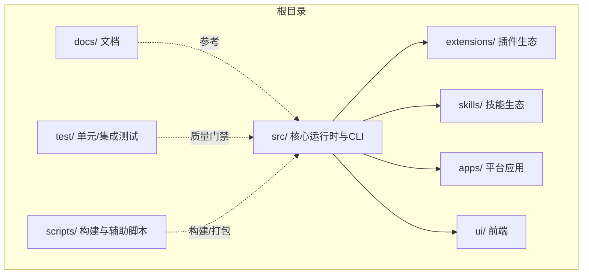
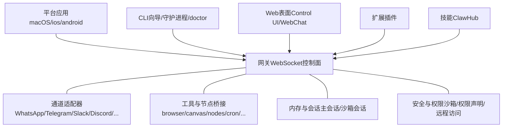
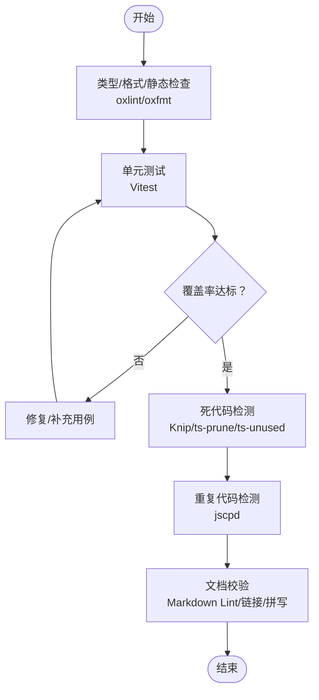
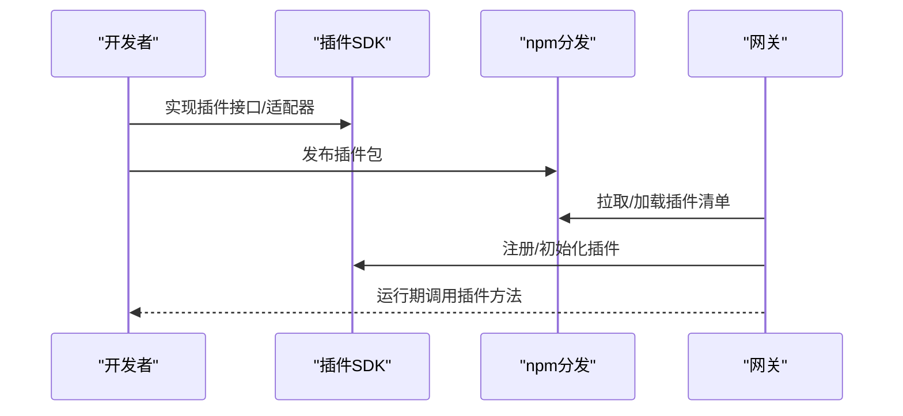
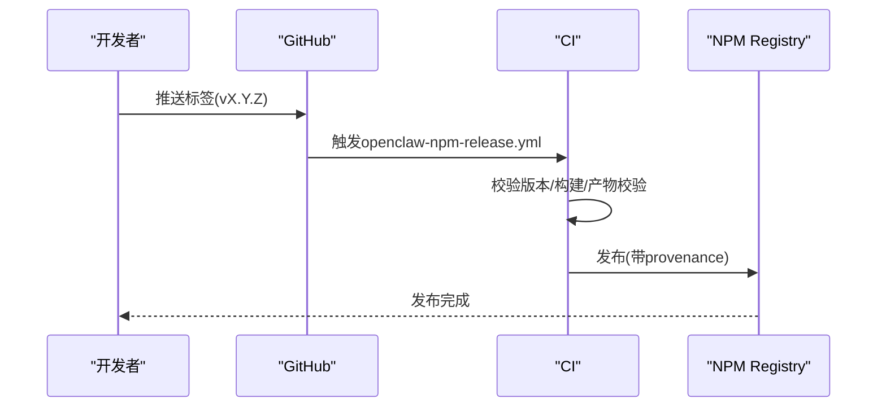

# 开发实践

<cite>
**本文引用的文件**
- [README.md](file://README.md)
- [CONTRIBUTING.md](file://CONTRIBUTING.md)
- [VISION.md](file://VISION.md)
- [.github/workflows/ci.yml](file://.github/workflows/ci.yml)
- [.github/workflows/openclaw-npm-release.yml](file://.github/workflows/openclaw-npm-release.yml)
- [package.json](file://package.json)
- [tsconfig.json](file://tsconfig.json)
- [vitest.config.ts](file://vitest.config.ts)
- [knip.config.ts](file://knip.config.ts)
- [.github/dependabot.yml](file://.github/dependabot.yml)
- [.github/actionlint.yaml](file://.github/actionlint.yaml)
</cite>

## 目录
1. [引言](#引言)
2. [项目结构](#项目结构)
3. [核心组件](#核心组件)
4. [架构总览](#架构总览)
5. [详细组件分析](#详细组件分析)
6. [依赖分析](#依赖分析)
7. [性能考虑](#性能考虑)
8. [故障排查指南](#故障排查指南)
9. [结论](#结论)
10. [附录](#附录)

## 引言
本指南面向OpenClaw的贡献者与维护者，系统化阐述开发质量标准、测试策略、重构原则、代码审查流程，以及插件、技能、工具等扩展开发的最佳实践；并提供代码规范、命名约定、注释标准、持续集成与自动化测试、性能测试、团队协作与版本管理、发布流程等软件工程最佳实践。目标是帮助新老贡献者快速达成一致的工程实践，提升交付质量与效率。

## 项目结构
OpenClaw是一个多语言混合的大型工程：核心以TypeScript实现，配套Swift（macOS/ios应用）、Gradle（Android）、Python（部分技能脚本）与Shell脚本；通过统一的包管理与构建脚本组织各子系统。仓库采用monorepo风格，根目录包含核心源码、文档、CI工作流、脚本与示例扩展与技能。

- 核心运行时与CLI：src/
- 平台应用：apps/macos、apps/ios、apps/android、apps/shared/OpenClawKit
- 扩展生态：extensions/（插件）、skills/（技能）
- 文档与参考：docs/、VISION.md、README.md
- 工具与脚本：scripts/、ui/、packages/、assets/
- 测试：test/、extensions/*/src/**/*.test.ts、skills/**/*test*.py
- CI与发布：.github/workflows/、package.json脚本

图示来源
- [README.md:1-560](file://README.md#L1-L560)
- [package.json:1-465](file://package.json#L1-L465)

章节来源
- [README.md:1-560](file://README.md#L1-L560)
- [package.json:1-465](file://package.json#L1-L465)

## 核心组件
- 运行时与协议：WebSocket控制面、通道适配器、工具与节点桥接、会话与内存模型、安全沙箱与权限控制。
- CLI与运维：向导、守护进程、健康检查、日志与诊断、远程访问与暴露（Tailscale/SSH隧道）。
- 平台应用：macOS菜单栏、iOS/Android节点、浏览器控制与Canvas可视化。
- 扩展与技能：插件SDK、插件清单与分发、技能注册表（ClawHub）与安装治理。
- 测试与质量：单元/集成/端到端测试、覆盖率阈值、格式化与静态检查、死代码检测、重复代码扫描。

章节来源
- [README.md:1-560](file://README.md#L1-L560)
- [CONTRIBUTING.md:1-194](file://CONTRIBUTING.md#L1-L194)
- [VISION.md:1-111](file://VISION.md#L1-L111)

## 架构总览
OpenClaw采用“网关控制平面 + 多平台客户端/节点”的分布式架构。网关负责会话、路由、工具与事件编排；通道适配器连接外部消息渠道；平台应用提供本地能力与交互；扩展与技能通过插件SDK与ClawHub生态增强功能。

图示来源
- [README.md:185-238](file://README.md#L185-L238)
- [README.md:318-431](file://README.md#L318-L431)

章节来源
- [README.md:185-238](file://README.md#L185-L238)
- [README.md:318-431](file://README.md#L318-L431)

## 详细组件分析

### 代码质量与测试策略
- 单元测试与覆盖率：使用Vitest，按模块划分测试范围，覆盖率阈值在配置中明确；排除大量集成/手动验证模块，确保核心逻辑可测。
- 集成与端到端测试：通过独立配置与脚本触发，覆盖通道、网关服务器、UI交互等复杂场景。
- 死代码与冗余检测：Knip用于检测未使用导出与入口点，结合ts-prune/ts-unused-exports形成闭环。
- 重复代码扫描：jscpd对TS/JS进行重复检测，设定最小行/令牌阈值。
- 类型与格式化：TypeScript严格模式、oxlint（类型感知）、oxfmt统一格式化；Swift侧swiftlint/swiftformat。
- 文档校验：Markdown Lint、链接审计、拼写检查。

图示来源
- [vitest.config.ts:1-203](file://vitest.config.ts#L1-L203)
- [knip.config.ts:1-106](file://knip.config.ts#L1-L106)
- [package.json:252-287](file://package.json#L252-L287)

章节来源
- [vitest.config.ts:1-203](file://vitest.config.ts#L1-L203)
- [knip.config.ts:1-106](file://knip.config.ts#L1-L106)
- [package.json:252-287](file://package.json#L252-L287)

### 重构原则与代码审查
- 保持单一职责：每个PR聚焦一个主题或问题域，避免“大杂烩”式提交。
- 严格遵循现有风格：TypeScript装饰器兼容性、UI装饰器风格、Swift格式与命名。
- 审查对话作者负责：机器人/人工审查意见需由作者跟进处理，避免遗留未解决评论。
- AI辅助PR：鼓励AI协作，但需标注、自检与自审，确保可追溯与可复现。

章节来源
- [CONTRIBUTING.md:85-136](file://CONTRIBUTING.md#L85-L136)
- [CONTRIBUTING.md:108-122](file://CONTRIBUTING.md#L108-L122)

### 插件开发最佳实践
- 插件SDK与导出：通过package.json的exports为各插件子路径提供类型与默认导出，便于统一消费。
- 插件清单与分发：遵循openclaw.plugin.json规范，本地开发与npm分发并行。
- 兼容性与边界：避免在插件SDK入口集中导入过多模块，减少冷启动与体积负担。
- 认证与授权：按渠道提供认证桥接（如OAuth），并在插件内收敛错误与重试策略。
- 与核心解耦：优先通过MCP桥接或插件机制扩展，避免将通用能力直接合并入核心。

图示来源
- [package.json:37-216](file://package.json#L37-L216)
- [VISION.md:52-83](file://VISION.md#L52-L83)

章节来源
- [package.json:37-216](file://package.json#L37-L216)
- [VISION.md:52-83](file://VISION.md#L52-L83)

### 技能开发最佳实践
- 技能注册与安装：通过ClawHub进行首次发布与发现，核心尽量只保留基础UX所需技能。
- 脚本化与可测试：Python技能脚本需通过ruff与pytest校验，保证可维护性与稳定性。
- 与插件协同：技能与插件边界清晰，技能偏向业务动作与数据处理，插件偏向通道/工具桥接。

章节来源
- [VISION.md:66-71](file://VISION.md#L66-L71)
- [.github/workflows/ci.yml:236-261](file://.github/workflows/ci.yml#L236-L261)

### 工具开发最佳实践
- 工具与节点：浏览器控制、Canvas、节点能力（摄像头/屏幕录制/通知）等通过统一的节点协议与工具接口暴露。
- 端到端与性能：通过e2e与性能热点分析脚本保障工具链路稳定与性能预算。
- 安全与权限：macOS TCC权限、沙箱模式、工具白名单/黑名单策略。

章节来源
- [README.md:240-254](file://README.md#L240-L254)
- [README.md:332-338](file://README.md#L332-L338)
- [package.json:328-329](file://package.json#L328-L329)

### 代码规范与命名约定
- TypeScript
  - 装饰器：UI使用传统装饰器（legacy），根tsconfig已配置兼容项。
  - 类型：严格模式、TypeBox Schema广泛使用，确保协议与配置强约束。
  - 导入别名：tsconfig中为插件SDK提供路径别名，便于跨模块引用。
- Swift
  - 命名与格式：swiftlint/swiftformat统一风格。
- 文档与注释
  - Markdown Lint与链接审计，确保文档一致性与可读性。
  - 重要变更与安全建议在README/VISION中明确。

章节来源
- [CONTRIBUTING.md:108-122](file://CONTRIBUTING.md#L108-L122)
- [tsconfig.json:1-29](file://tsconfig.json#L1-L29)
- [package.json:272-282](file://package.json#L272-L282)

## 依赖分析
- 依赖更新策略：Dependabot按生态分组与冷却周期自动发起PR，生产/开发依赖分别管理。
- 依赖审计：CI中执行私钥检测、工作流zizmor审计、生产依赖审计，降低供应链风险。
- 仅构建依赖：pnpm overrides与onlyBuiltDependencies确保二进制依赖在构建阶段可用，减少运行时污染。

图示来源
- [.github/dependabot.yml:1-128](file://.github/dependabot.yml#L1-L128)
- [.github/workflows/ci.yml:305-328](file://.github/workflows/ci.yml#L305-L328)
- [package.json:426-463](file://package.json#L426-L463)

章节来源
- [.github/dependabot.yml:1-128](file://.github/dependabot.yml#L1-L128)
- [.github/workflows/ci.yml:305-328](file://.github/workflows/ci.yml#L305-L328)
- [package.json:426-463](file://package.json#L426-L463)

## 性能考虑
- 性能预算与热点：提供性能预算检查与热点分析脚本，CI中可作为门禁。
- 测试并行与资源：Vitest在CI中限制workers并设置超时，Windows与Linux差异配置以平衡稳定性与速度。
- 构建与产物：严格产物校验（release:check），确保发布物完整性与合规性。

章节来源
- [package.json:328-329](file://package.json#L328-L329)
- [vitest.config.ts:1-203](file://vitest.config.ts#L1-L203)
- [.github/workflows/ci.yml:114-138](file://.github/workflows/ci.yml#L114-L138)

## 故障排查指南
- 常见问题定位
  - 安全与权限：检查沙箱模式、工具白名单、macOS TCC状态与节点权限。
  - 渠道连通性：核对令牌/密钥、Webhook配置、群组/允许列表策略。
  - 网关与远程：Tailscale Serve/Funnel配置、SSH隧道、本地绑定与鉴权。
- 诊断工具
  - doctor命令、日志级别、Web控制面板、远程日志拉取脚本。
- 团队协作
  - 提交前自检：build、check、test；PR描述清晰、截图对比；关注审查对话并及时回复。

章节来源
- [README.md:112-125](file://README.md#L112-L125)
- [README.md:442-448](file://README.md#L442-L448)
- [CONTRIBUTING.md:85-106](file://CONTRIBUTING.md#L85-L106)

## 结论
本指南从质量、测试、重构、审查、扩展开发、规范、CI/CD与发布、团队协作等维度，给出了OpenClaw的工程实践框架。建议所有贡献者在提交前对照本指南自查，并在PR中明确变更范围与影响面，确保高质量演进与长期可维护性。

## 附录

### 持续集成与自动化测试
- CI流水线
  - 文档变更检测与跳过重型任务、变更范围检测矩阵、构建产物共享、多平台测试分片。
  - macOS作业合并TS测试与Swift lint/build/test，Windows作业分片并行。
- 发布流程
  - 标签触发NPM发布，先校验版本与元数据，再构建与内容校验，最后发布并启用provenance。

图示来源
- [.github/workflows/openclaw-npm-release.yml:1-80](file://.github/workflows/openclaw-npm-release.yml#L1-L80)
- [.github/workflows/ci.yml:1-737](file://.github/workflows/ci.yml#L1-L737)

章节来源
- [.github/workflows/openclaw-npm-release.yml:1-80](file://.github/workflows/openclaw-npm-release.yml#L1-L80)
- [.github/workflows/ci.yml:1-737](file://.github/workflows/ci.yml#L1-L737)

### 版本管理与发布
- 版本通道：stable/beta/dev，支持切换与升级。
- 发布校验：release:check确保产物符合预期；NPM发布前二次校验。
- 依赖与工作流审计：zizmor与依赖审计，降低安全风险。

章节来源
- [README.md:83-90](file://README.md#L83-L90)
- [.github/workflows/openclaw-npm-release.yml:37-79](file://.github/workflows/openclaw-npm-release.yml#L37-L79)
- [.github/workflows/ci.yml:308-328](file://.github/workflows/ci.yml#L308-L328)

### 团队协作与代码审查
- PR规范：聚焦单一主题、限制变更规模、提供前后对比图、及时响应审查意见。
- 审查对话责任：作者负责跟进机器人/人工审查意见，确保闭环。
- AI辅助：鼓励AI协作，需标注程度、测试情况与提示词，自审后再请求审查。

章节来源
- [CONTRIBUTING.md:85-136](file://CONTRIBUTING.md#L85-L136)