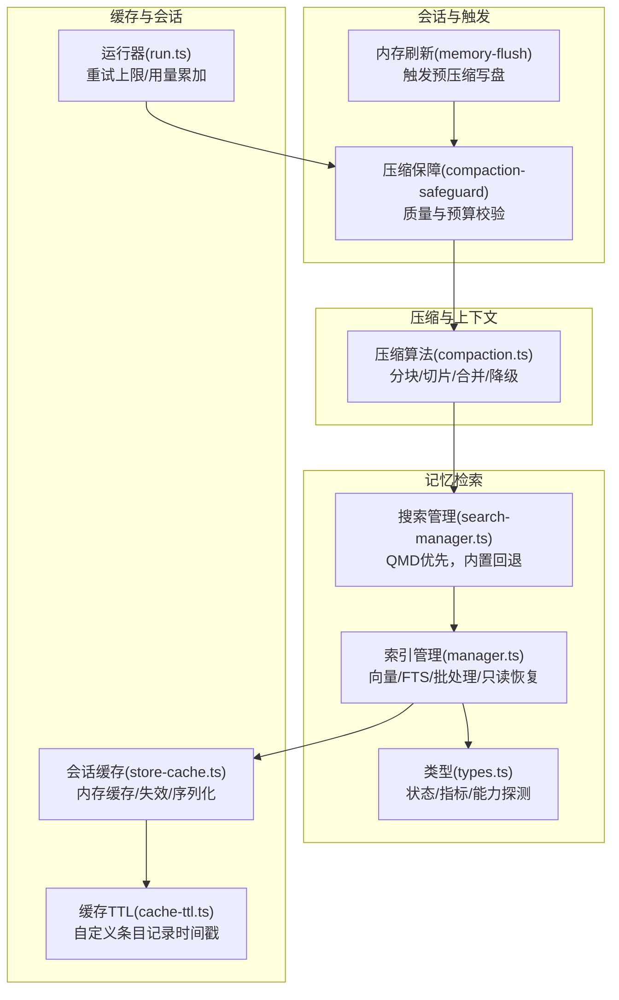
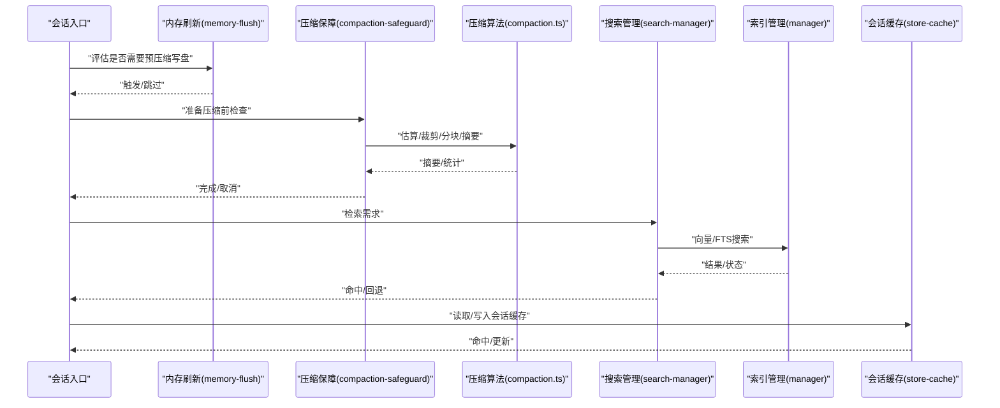
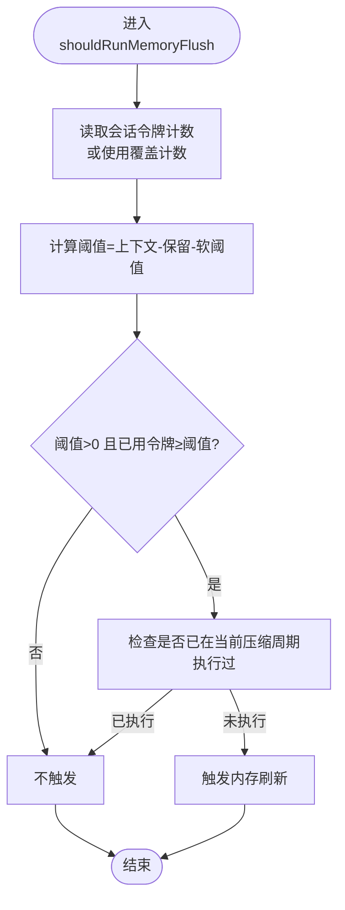
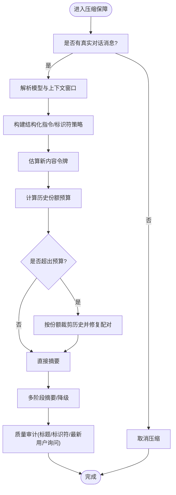
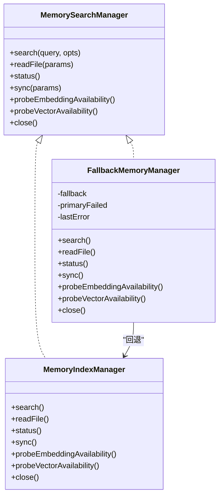
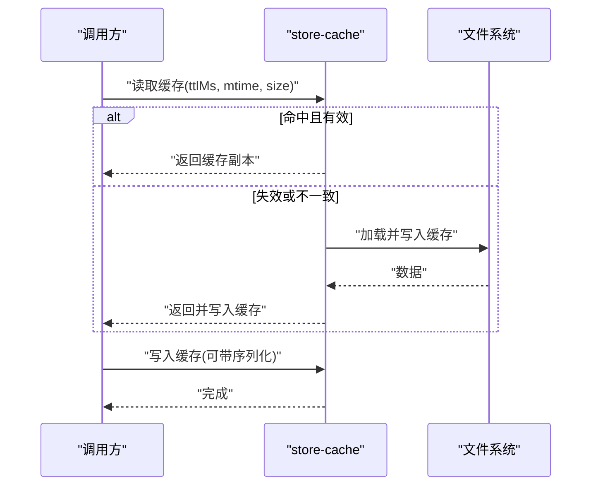
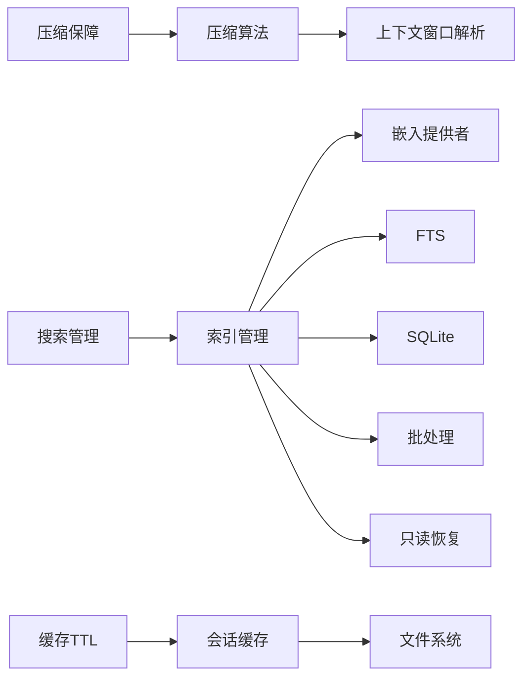

# 性能优化

<cite>
**本文引用的文件**
- [src/agents/compaction.ts](file://src/agents/compaction.ts)
- [src/auto-reply/reply/memory-flush.ts](file://src/auto-reply/reply/memory-flush.ts)
- [src/agents/pi-extensions/compaction-safeguard.ts](file://src/agents/pi-extensions/compaction-safeguard.ts)
- [src/memory/manager.ts](file://src/memory/manager.ts)
- [src/memory/search-manager.ts](file://src/memory/search-manager.ts)
- [src/memory/types.ts](file://src/memory/types.ts)
- [src/config/sessions/store-cache.ts](file://src/config/sessions/store-cache.ts)
- [src/agents/pi-embedded-runner/cache-ttl.ts](file://src/agents/pi-embedded-runner/cache-ttl.ts)
- [src/agents/pi-embedded-runner/run.ts](file://src/agents/pi-embedded-runner/run.ts)
- [src/commands/health.ts](file://src/commands/health.ts)
- [extensions/open-prose/skills/prose/lib/profiler.prose](file://extensions/open-prose/skills/prose/lib/profiler.prose)
</cite>

## 目录
1. [简介](#简介)
2. [项目结构](#项目结构)
3. [核心组件](#核心组件)
4. [架构总览](#架构总览)
5. [详细组件分析](#详细组件分析)
6. [依赖关系分析](#依赖关系分析)
7. [性能考量](#性能考量)
8. [故障排查指南](#故障排查指南)
9. [结论](#结论)
10. [附录](#附录)

## 简介
本指南聚焦于OpenClaw在会话压缩、上下文窗口优化、内存管理与缓存策略方面的性能优化实践，覆盖会话清理、历史记录压缩、缓存与只读数据库恢复、向量检索与混合检索、以及大规模部署下的调优策略。文档同时提供面向不同渠道、代理配置与工具调用的优化建议，并给出可操作的配置参数、资源监控与瓶颈定位方法。

## 项目结构
OpenClaw围绕“会话—压缩—记忆检索—缓存”形成闭环：会话入口与触发条件由自动回复与压缩保障扩展控制；压缩算法与上下文预算由压缩模块实现；记忆检索由内置索引与可选QMD回退实现；缓存与只读恢复贯穿存储层与会话存储。

图表来源
- [src/auto-reply/reply/memory-flush.ts:170-229](file://src/auto-reply/reply/memory-flush.ts#L170-L229)
- [src/agents/pi-extensions/compaction-safeguard.ts:698-760](file://src/agents/pi-extensions/compaction-safeguard.ts#L698-L760)
- [src/agents/compaction.ts:135-200](file://src/agents/compaction.ts#L135-L200)
- [src/memory/search-manager.ts:25-86](file://src/memory/search-manager.ts#L25-L86)
- [src/memory/manager.ts:61-120](file://src/memory/manager.ts#L61-L120)
- [src/memory/types.ts:24-59](file://src/memory/types.ts#L24-L59)
- [src/config/sessions/store-cache.ts:37-81](file://src/config/sessions/store-cache.ts#L37-L81)
- [src/agents/pi-embedded-runner/cache-ttl.ts:38-76](file://src/agents/pi-embedded-runner/cache-ttl.ts#L38-L76)
- [src/agents/pi-embedded-runner/run.ts:121-155](file://src/agents/pi-embedded-runner/run.ts#L121-L155)

章节来源
- [src/auto-reply/reply/memory-flush.ts:1-229](file://src/auto-reply/reply/memory-flush.ts#L1-L229)
- [src/agents/compaction.ts:1-465](file://src/agents/compaction.ts#L1-L465)
- [src/agents/pi-extensions/compaction-safeguard.ts:1-800](file://src/agents/pi-extensions/compaction-safeguard.ts#L1-L800)
- [src/memory/search-manager.ts:1-253](file://src/memory/search-manager.ts#L1-L253)
- [src/memory/manager.ts:1-804](file://src/memory/manager.ts#L1-L804)
- [src/memory/types.ts:1-81](file://src/memory/types.ts#L1-L81)
- [src/config/sessions/store-cache.ts:1-81](file://src/config/sessions/store-cache.ts#L1-L81)
- [src/agents/pi-embedded-runner/cache-ttl.ts:1-76](file://src/agents/pi-embedded-runner/cache-ttl.ts#L1-L76)
- [src/agents/pi-embedded-runner/run.ts:121-155](file://src/agents/pi-embedded-runner/run.ts#L121-L155)

## 核心组件
- 会话内存刷新（Memory Flush）
  - 触发条件：基于上下文窗口与保留/软阈值计算，避免重复刷写；支持按会话转录大小强制触发。
  - 安全提示：目标文件、追加写入、只读保护等提示确保写入安全。
- 压缩保障（Compaction Safeguard）
  - 质量守卫：结构化摘要、标识符保留策略、最近回合保留、工具失败汇总、工作区规则注入。
  - 预算控制：根据上下文份额裁剪历史，避免越界；对超大消息采用分阶段/降级策略。
- 压缩算法（Compaction）
  - 分块/切片：自适应块比例、安全余量、超大消息拆分。
  - 合并/降级：多阶段摘要、部分摘要+注释、最终合并。
- 记忆检索（Memory Index Manager）
  - 混合检索：向量+关键词（FTS）融合，MMR与时间衰减。
  - 批处理与只读恢复：批处理失败计数与锁定、只读数据库错误自动重建连接。
- 缓存与会话（Store Cache / Cache TTL）
  - 会话存储缓存：内存缓存、TTL失效、mtime/size一致性校验。
  - 自定义缓存TTL：以自定义条目记录时间戳，便于追踪与清理。

章节来源
- [src/auto-reply/reply/memory-flush.ts:170-229](file://src/auto-reply/reply/memory-flush.ts#L170-L229)
- [src/agents/pi-extensions/compaction-safeguard.ts:698-760](file://src/agents/pi-extensions/compaction-safeguard.ts#L698-L760)
- [src/agents/compaction.ts:135-200](file://src/agents/compaction.ts#L135-L200)
- [src/memory/manager.ts:452-552](file://src/memory/manager.ts#L452-L552)
- [src/config/sessions/store-cache.ts:37-81](file://src/config/sessions/store-cache.ts#L37-L81)
- [src/agents/pi-embedded-runner/cache-ttl.ts:38-76](file://src/agents/pi-embedded-runner/cache-ttl.ts#L38-L76)

## 架构总览
OpenClaw的性能路径从“会话—压缩—检索—缓存”形成闭环，关键优化点包括：
- 会话层面：内存刷新与压缩触发双轨制，避免重复工作。
- 压缩层面：分块/切片/合并/降级策略，结合上下文份额裁剪。
- 检索层面：向量+FTS混合、批处理与只读恢复，降低I/O与错误影响。
- 缓存层面：会话存储缓存与自定义TTL，提升热路径性能。

图表来源
- [src/auto-reply/reply/memory-flush.ts:170-229](file://src/auto-reply/reply/memory-flush.ts#L170-L229)
- [src/agents/pi-extensions/compaction-safeguard.ts:698-760](file://src/agents/pi-extensions/compaction-safeguard.ts#L698-L760)
- [src/agents/compaction.ts:333-396](file://src/agents/compaction.ts#L333-L396)
- [src/memory/search-manager.ts:118-139](file://src/memory/search-manager.ts#L118-L139)
- [src/memory/manager.ts:257-365](file://src/memory/manager.ts#L257-L365)
- [src/config/sessions/store-cache.ts:41-81](file://src/config/sessions/store-cache.ts#L41-L81)

## 详细组件分析

### 组件A：会话内存刷新（Memory Flush）
- 触发逻辑
  - 基于上下文窗口、保留令牌与软阈值计算阈值，超过阈值且未在当前压缩周期执行过刷新则触发。
  - 支持按会话转录大小强制触发，避免超大转录导致后续压缩成本过高。
- 安全约束
  - 强制提示目标文件、追加写入、只读保护，防止误写关键文件。
- 实践要点
  - 合理设置软阈值与保留令牌，平衡“及时落盘”与“频繁IO”。
  - 对大转录场景启用强制字节阈值，降低压缩压力。

图表来源
- [src/auto-reply/reply/memory-flush.ts:170-229](file://src/auto-reply/reply/memory-flush.ts#L170-L229)

章节来源
- [src/auto-reply/reply/memory-flush.ts:1-229](file://src/auto-reply/reply/memory-flush.ts#L1-L229)

### 组件B：压缩保障与算法（Compaction Safeguard + Compaction）
- 压缩保障
  - 结构化摘要：强制标题、标识符策略、最近回合保留、工具失败汇总、工作区规则注入。
  - 预算控制：按上下文份额裁剪历史，避免越界；对超大消息采用分阶段/降级策略。
- 压缩算法
  - 自适应块比例：根据平均消息大小动态调整，避免单条消息过大导致不可压缩。
  - 分块/切片：应用安全余量补偿token估算误差；超大消息拆分。
  - 多阶段摘要：全量摘要失败时尝试部分摘要并注释被省略内容；最终合并阶段再做一次摘要。

图表来源
- [src/agents/pi-extensions/compaction-safeguard.ts:698-800](file://src/agents/pi-extensions/compaction-safeguard.ts#L698-L800)
- [src/agents/compaction.ts:333-396](file://src/agents/compaction.ts#L333-L396)

章节来源
- [src/agents/pi-extensions/compaction-safeguard.ts:1-800](file://src/agents/pi-extensions/compaction-safeguard.ts#L1-L800)
- [src/agents/compaction.ts:1-465](file://src/agents/compaction.ts#L1-L465)

### 组件C：记忆检索（Memory Index Manager + Search Manager）
- 搜索流程
  - QMD优先：若可用则优先使用QMD管理器；失败则回退至内置索引管理器。
  - 混合检索：向量相似度与关键词匹配融合，支持MMR与时间衰减。
  - 只读恢复：检测只读数据库错误后自动重建连接并重试。
- 关键指标
  - provider状态、向量维度、FTS可用性、批处理失败次数与并发参数、缓存条目数等。

图表来源
- [src/memory/types.ts:61-80](file://src/memory/types.ts#L61-L80)
- [src/memory/search-manager.ts:104-246](file://src/memory/search-manager.ts#L104-L246)
- [src/memory/manager.ts:61-120](file://src/memory/manager.ts#L61-L120)

章节来源
- [src/memory/search-manager.ts:1-253](file://src/memory/search-manager.ts#L1-L253)
- [src/memory/manager.ts:1-804](file://src/memory/manager.ts#L1-L804)
- [src/memory/types.ts:1-81](file://src/memory/types.ts#L1-L81)

### 组件D：缓存与会话（Store Cache + Cache TTL）
- 会话存储缓存
  - 内存缓存+TTL，基于mtime/size一致性校验，避免脏读。
  - 支持序列化缓存，加速热路径。
- 缓存TTL
  - 通过自定义条目记录时间戳，便于追踪与清理。

图表来源
- [src/config/sessions/store-cache.ts:41-81](file://src/config/sessions/store-cache.ts#L41-L81)

章节来源
- [src/config/sessions/store-cache.ts:1-81](file://src/config/sessions/store-cache.ts#L1-L81)
- [src/agents/pi-embedded-runner/cache-ttl.ts:38-76](file://src/agents/pi-embedded-runner/cache-ttl.ts#L38-L76)

## 依赖关系分析
- 组件耦合
  - 压缩保障依赖压缩算法与上下文窗口解析；压缩算法依赖token估算与分块策略。
  - 搜索管理器依赖索引管理器；索引管理器依赖嵌入提供者、FTS、批处理与只读恢复。
  - 会话缓存与自定义TTL贯穿会话读写路径，降低重复I/O。
- 外部依赖
  - 嵌入提供者（OpenAI/Gemini/Voyage/Mistral/Ollama）、SQLite、向量扩展、文件系统。

图表来源
- [src/agents/compaction.ts:462-465](file://src/agents/compaction.ts#L462-L465)
- [src/memory/search-manager.ts:25-86](file://src/memory/search-manager.ts#L25-L86)
- [src/memory/manager.ts:61-120](file://src/memory/manager.ts#L61-L120)
- [src/config/sessions/store-cache.ts:37-81](file://src/config/sessions/store-cache.ts#L37-L81)
- [src/agents/pi-embedded-runner/cache-ttl.ts:38-76](file://src/agents/pi-embedded-runner/cache-ttl.ts#L38-L76)

章节来源
- [src/agents/compaction.ts:1-465](file://src/agents/compaction.ts#L1-L465)
- [src/memory/manager.ts:1-804](file://src/memory/manager.ts#L1-L804)
- [src/memory/search-manager.ts:1-253](file://src/memory/search-manager.ts#L1-L253)
- [src/config/sessions/store-cache.ts:1-81](file://src/config/sessions/store-cache.ts#L1-L81)
- [src/agents/pi-embedded-runner/cache-ttl.ts:1-76](file://src/agents/pi-embedded-runner/cache-ttl.ts#L1-L76)

## 性能考量
- 内存管理
  - 通过内存刷新在压缩前落盘，降低压缩阶段的写放大与令牌估算误差。
  - 使用上下文份额裁剪历史，避免压缩阶段反复尝试超限摘要。
- 会话压缩
  - 自适应块比例与安全余量降低超大消息带来的不可压缩风险。
  - 多阶段摘要与降级策略在失败时仍能产出可接受摘要。
- 上下文窗口优化
  - 严格区分“保留令牌”“软阈值”“上下文窗口”，避免误判触发。
  - 在压缩保障中结合“最近回合保留”与“标识符策略”，兼顾连续性与准确性。
- 检索性能
  - 混合检索（向量+FTS）与MMR/时间衰减提升召回质量与相关性。
  - 批处理失败锁定与只读恢复减少I/O抖动与长时间阻塞。
- 缓存策略
  - 会话存储缓存配合TTL与一致性校验，显著降低重复读取成本。
  - 序列化缓存用于热点会话，进一步缩短加载时间。
- 大规模部署
  - 合理设置批处理并发与轮询间隔，避免资源争用。
  - 通过健康命令与状态接口监控provider可用性、缓存命中率与只读恢复次数。

## 故障排查指南
- 压缩失败/摘要异常
  - 检查是否触发了“部分摘要+注释”路径；确认“最近回合保留”与“标识符策略”配置。
  - 关注“多阶段摘要”的重试上限与信号中断处理。
- 检索无结果或缓慢
  - 查看provider状态与向量可用性；确认FTS是否可用及候选倍数设置。
  - 检查批处理失败次数与并发参数；关注只读恢复日志。
- 会话缓存异常
  - 校验mtime/size一致性；确认TTL是否过短导致频繁失效。
  - 检查序列化缓存是否缺失或损坏。
- 健康检查
  - 使用健康命令查看通道账户绑定与配置状态，辅助定位外部依赖问题。

章节来源
- [src/agents/pi-embedded-runner/run.ts:121-155](file://src/agents/pi-embedded-runner/run.ts#L121-L155)
- [src/memory/manager.ts:452-552](file://src/memory/manager.ts#L452-L552)
- [src/config/sessions/store-cache.ts:41-81](file://src/config/sessions/store-cache.ts#L41-L81)
- [src/commands/health.ts:577-609](file://src/commands/health.ts#L577-L609)

## 结论
OpenClaw通过“内存刷新—压缩保障—压缩算法—检索—缓存”的完整链路实现端到端性能优化。实践中应重点关注上下文预算、自适应分块、混合检索与缓存一致性，并结合健康监控与重试策略，在保证质量的前提下最大化吞吐与稳定性。

## 附录

### 配置参数与调优建议
- 会话内存刷新
  - 软阈值与保留令牌：平衡触发频率与IO开销。
  - 强制转录大小：对大会话启用，降低压缩成本。
- 压缩保障
  - 最近回合保留：保留关键上下文，减少重复信息。
  - 标识符策略：严格/关闭/自定义，依据任务对精确性的要求选择。
  - 质量守卫重试：适度增加重试次数以提升成功率。
- 检索
  - 向量权重/文本权重/候选倍数：根据业务语料调整融合比例。
  - MMR与时间衰减：提升相关性与时效性。
- 缓存
  - 会话缓存TTL：根据访问模式设定，避免过短导致抖动。
  - 批处理并发与轮询间隔：避免资源争用与饥饿。

### 资源使用监控与瓶颈识别
- 运行器用量累加：输入/输出/缓存读写/总耗时，用于成本与效率归因。
- Profiler技能：结构化分析成本、时间、效率、缓存读写比与热点。
- 健康命令：通道账户配置与绑定状态，辅助定位外部依赖问题。

章节来源
- [src/agents/pi-embedded-runner/run.ts:121-155](file://src/agents/pi-embedded-runner/run.ts#L121-L155)
- [extensions/open-prose/skills/prose/lib/profiler.prose:317-400](file://extensions/open-prose/skills/prose/lib/profiler.prose#L317-L400)
- [src/commands/health.ts:577-609](file://src/commands/health.ts#L577-L609)