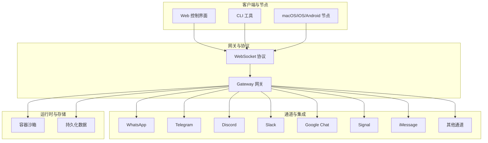
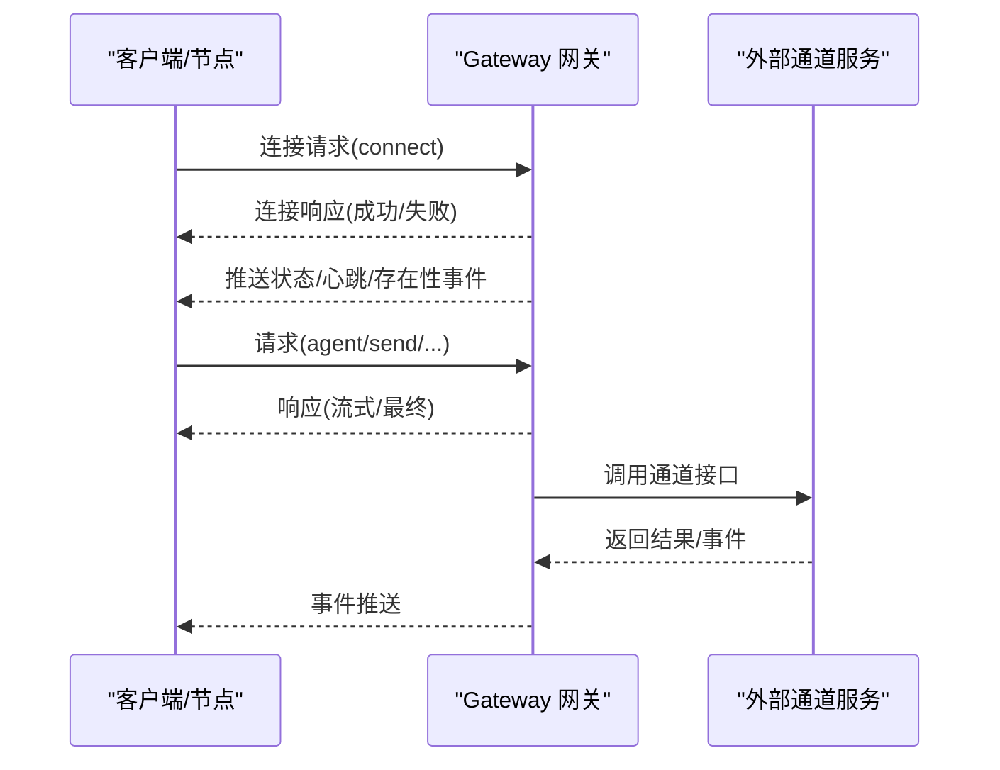
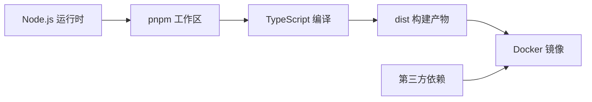

# 最佳实践

<cite>
**本文引用的文件**
- [README.md](file://README.md)
- [CONTRIBUTING.md](file://CONTRIBUTING.md)
- [SECURITY.md](file://SECURITY.md)
- [VISION.md](file://VISION.md)
- [package.json](file://package.json)
- [Dockerfile](file://Dockerfile)
- [fly.toml](file://fly.toml)
- [docs/gateway/configuration.md](file://docs/gateway/configuration.md)
- [docs/concepts/architecture.md](file://docs/concepts/architecture.md)
- [docs/install/docker.md](file://docs/install/docker.md)
- [docs/security/README.md](file://docs/security/README.md)
</cite>

## 目录
1. [简介](#简介)
2. [项目结构](#项目结构)
3. [核心组件](#核心组件)
4. [架构总览](#架构总览)
5. [详细组件分析](#详细组件分析)
6. [依赖关系分析](#依赖关系分析)
7. [性能考量](#性能考量)
8. [故障排查指南](#故障排查指南)
9. [结论](#结论)
10. [附录](#附录)

## 简介
本指南面向OpenClaw使用者与开发者，系统总结项目在实际使用中的经验与教训，围绕性能优化、安全配置、配置管理、部署策略与运维方法给出可操作的最佳实践，并覆盖大规模部署、高可用架构、监控告警等高级主题。内容基于仓库内官方文档与实现细节提炼，确保建议可落地、可验证。

## 项目结构
OpenClaw是一个以“个人AI助理”为核心的多平台应用，包含：
- 核心网关（Gateway）：单点控制平面，承载会话、通道、工具与事件；通过WebSocket提供统一协议。
- 多通道接入：WhatsApp、Telegram、Discord、Slack、Google Chat、Signal、iMessage、IRC、Teams、Matrix、Feishu、LINE、Mattermost、Nextcloud Talk、Nostr、Synology Chat、Tlon、Twitch、Zalo、WebChat等。
- 客户端与节点：macOS/iOS/Android节点、CLI、Web控制界面、浏览器自动化。
- 插件与技能生态：插件SDK、扩展能力、ClawHub技能注册中心。
- 运维与容器化：Docker镜像、Fly.io部署示例、健康检查与持久化。

图表来源
- [docs/concepts/architecture.md:12-58](file://docs/concepts/architecture.md#L12-L58)
- [docs/install/docker.md:539-544](file://docs/install/docker.md#L539-L544)

章节来源
- [README.md:185-254](file://README.md#L185-L254)
- [docs/concepts/architecture.md:12-58](file://docs/concepts/architecture.md#L12-L58)

## 核心组件
- 网关（Gateway）
  - 单一控制平面，负责消息通道连接、会话路由、工具执行、事件推送与健康状态。
  - 默认绑定回环地址，支持Tailscale Serve/Funnel或SSH隧道远程访问。
- 客户端与节点
  - 客户端（macOS应用、CLI、Web UI）与节点（设备侧）均通过WebSocket连接网关，节点需设备配对与权限声明。
- 沙箱（Sandbox）
  - 非主会话默认在Docker容器中执行工具，隔离文件系统、网络与进程，降低风险面。
- 配置与热重载
  - 支持交互向导、CLI、Control UI与直接编辑；严格模式下未知键拒绝启动；支持热重载与RPC更新。
- 容器化与部署
  - 提供Dockerfile与Compose脚本，内置健康检查；Fly.io示例展示生产级部署要点。

章节来源
- [docs/concepts/architecture.md:27-58](file://docs/concepts/architecture.md#L27-L58)
- [docs/gateway/configuration.md:349-387](file://docs/gateway/configuration.md#L349-L387)
- [docs/install/docker.md:508-538](file://docs/install/docker.md#L508-L538)
- [Dockerfile:216-230](file://Dockerfile#L216-L230)

## 架构总览
OpenClaw采用“网关集中控制 + 多通道接入 + 可选沙箱隔离”的架构。客户端与节点通过WebSocket连接网关，网关统一调度模型、工具与通道，同时提供Canvas/A2UI可视化工作区与浏览器自动化能力。

图表来源
- [docs/concepts/architecture.md:59-78](file://docs/concepts/architecture.md#L59-L78)

章节来源
- [docs/concepts/architecture.md:80-140](file://docs/concepts/architecture.md#L80-L140)

## 详细组件分析

### 网关与协议
- 连接生命周期与握手
  - 必须先发connect帧，随后请求/响应与事件推送；支持幂等键去重缓存。
- 设备配对与本地信任
  - 新设备ID需配对批准；本地回环连接可自动批准；所有连接仍受网关认证约束。
- 远程访问
  - 推荐Tailscale或VPN；SSH隧道亦可；远端TLS可选启用。

章节来源
- [docs/concepts/architecture.md:80-128](file://docs/concepts/architecture.md#L80-L128)

### 配置与热重载
- 配置来源与优先级
  - 支持交互向导、CLI、Control UI与直接编辑；支持环境变量导入与SecretRef凭据引用。
- 严格校验与启动行为
  - 严格模式下未知键/类型错误/非法值导致网关拒绝启动；doctor命令用于诊断与修复。
- 热重载策略
  - 大多数字段即时生效；网关服务器与基础设施相关变更需要重启；可通过RPC进行部分/全量更新。
- 分割配置
  - 支持$include按文件拆分，支持数组深合并与嵌套包含。

章节来源
- [docs/gateway/configuration.md:37-73](file://docs/gateway/configuration.md#L37-L73)
- [docs/gateway/configuration.md:349-387](file://docs/gateway/configuration.md#L349-L387)
- [docs/gateway/configuration.md:389-447](file://docs/gateway/configuration.md#L389-L447)
- [docs/gateway/configuration.md:501-536](file://docs/gateway/configuration.md#L501-L536)

### 沙箱与安全
- 默认策略
  - 非主会话默认在容器中执行工具；默认允许exec、process、读写等基础能力，禁止browser/canvas/nodes等高危工具。
- 硬化参数
  - 网络none、只读根文件系统、资源限制、seccomp/AppArmor、DNS/额外主机等。
- 多代理与工具策略
  - 支持按代理覆盖沙箱与工具策略，实现差异化访问级别。

章节来源
- [docs/install/docker.md:577-673](file://docs/install/docker.md#L577-L673)
- [docs/install/docker.md:674-701](file://docs/install/docker.md#L674-L701)
- [docs/install/docker.md:702-789](file://docs/install/docker.md#L702-L789)

### 容器化与部署
- Docker镜像与构建
  - 多阶段构建，最小化运行时；非root用户运行；可选安装Chromium与Docker CLI；健康检查探针。
- Compose与持久化
  - 绑定宿主机目录到容器内配置与工作空间；注意权限与UID映射。
- 生产部署示例（Fly.io）
  - 使用Dockerfile；设置内存、进程数与挂载数据卷；强制HTTPS与最小机器数常驻。

章节来源
- [Dockerfile:1-231](file://Dockerfile#L1-L231)
- [docs/install/docker.md:539-544](file://docs/install/docker.md#L539-L544)
- [fly.toml:1-35](file://fly.toml#L1-L35)

### 安全与威胁模型
- 信任模型
  - 以“单用户可信操作者”为主，默认不模拟多租户对抗边界；跨用户隔离需通过独立网关/主机/用户边界实现。
- 插件与内存
  - 插件作为可信计算基，安装即授予与本地代码同等信任；建议使用allow白名单与最小权限。
- 临时目录与媒体
  - 临时目录仅接受受管路径，避免任意主机tmp路径信任；插件/扩展应使用受控临时路径工具。
- 运行时要求
  - Node.js版本需满足安全补丁要求；Docker运行建议只读文件系统与能力降级。

章节来源
- [SECURITY.md:88-103](file://SECURITY.md#L88-L103)
- [SECURITY.md:182-189](file://SECURITY.md#L182-L189)
- [SECURITY.md:190-206](file://SECURITY.md#L190-L206)
- [SECURITY.md:246-276](file://SECURITY.md#L246-L276)

### 性能与可靠性
- 会话与上下文
  - 合理设置会话作用域与线程绑定，减少跨会话上下文污染；必要时启用压缩与清理策略。
- 工具与媒体
  - 图像降采样、媒体大小上限、临时文件生命周期管理；浏览器自动化可预装Chromium以减少冷启动开销。
- 并发与限流
  - Cron并发、RPC速率限制等；根据负载调整资源配额与容器限制。

章节来源
- [docs/gateway/configuration.md:178-204](file://docs/gateway/configuration.md#L178-L204)
- [docs/install/docker.md:375-391](file://docs/install/docker.md#L375-L391)
- [docs/install/docker.md:666-673](file://docs/install/docker.md#L666-L673)

## 依赖关系分析
- 运行时与依赖
  - Node.js版本要求与安全补丁；关键依赖包括WebSocket、HTTP框架、通道SDK、媒体处理库等。
- 包管理与构建
  - pnpm工作区与构建脚本；TypeScript编译与插件SDK生成；Docker多阶段构建与缓存层优化。
- 第三方服务
  - 模型提供商SDK、通道API、云服务等；建议通过凭据引用与环境注入管理敏感信息。

图表来源
- [package.json:340-395](file://package.json#L340-L395)
- [Dockerfile:40-84](file://Dockerfile#L40-L84)

章节来源
- [package.json:340-395](file://package.json#L340-L395)
- [package.json:422-425](file://package.json#L422-L425)

## 性能考量
- 启动与热重载
  - 避免频繁重启；利用热重载与RPC增量更新；合理设置重载模式与防抖。
- 资源与并发
  - 在沙箱与容器中设置CPU/内存/句柄/进程限制；根据通道并发与工具调用频率调整。
- 媒体与I/O
  - 控制图像尺寸与媒体大小；使用临时目录与清理策略；预装浏览器以减少冷启动。
- 监控与可观测性
  - 利用健康检查端点与日志；结合外部监控系统采集指标与告警。

章节来源
- [docs/gateway/configuration.md:349-387](file://docs/gateway/configuration.md#L349-L387)
- [docs/install/docker.md:469-495](file://docs/install/docker.md#L469-L495)
- [Dockerfile:224-230](file://Dockerfile#L224-L230)

## 故障排查指南
- 配置问题
  - 使用doctor命令定位未知键/类型/值问题；必要时--fix自动修复；确认$include路径与循环包含。
- 连接与认证
  - 确认网关token、设备配对与本地信任；远程访问使用Tailscale/SSH隧道；检查防火墙与端口发布。
- 沙箱与工具
  - 检查工具策略与沙箱权限；确认容器网络与资源限制；必要时调整策略或重建容器。
- 容器与持久化
  - 核对UID/GID与权限；确认挂载路径与命名卷；关注磁盘增长热点（媒体/会话/日志）。
- 安全与合规
  - 遵循信任模型与最小权限原则；定期扫描密钥与漏洞；升级Node.js与依赖版本。

章节来源
- [docs/gateway/configuration.md:61-73](file://docs/gateway/configuration.md#L61-L73)
- [docs/concepts/architecture.md:93-109](file://docs/concepts/architecture.md#L93-L109)
- [docs/install/docker.md:392-404](file://docs/install/docker.md#L392-L404)
- [SECURITY.md:169-194](file://SECURITY.md#L169-L194)

## 结论
OpenClaw的最佳实践围绕“安全默认、可控扩展、可观测运维”展开。通过严格的配置校验、合理的沙箱策略、稳健的容器化与远程访问方案，以及完善的监控与告警体系，可在个人与企业环境中实现稳定、可扩展且易于维护的AI助理平台。

## 附录
- 官方文档索引
  - 配置参考与示例：[配置](file://docs/gateway/configuration.md)
  - 架构与协议：[架构](file://docs/concepts/architecture.md)
  - Docker与部署：[Docker](file://docs/install/docker.md)
  - 安全与威胁模型：[安全](file://docs/security/README.md)
- 项目愿景与贡献
  - [愿景](file://VISION.md)
  - [贡献指南](file://CONTRIBUTING.md)
  - [安全策略](file://SECURITY.md)