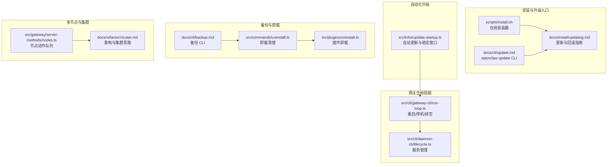
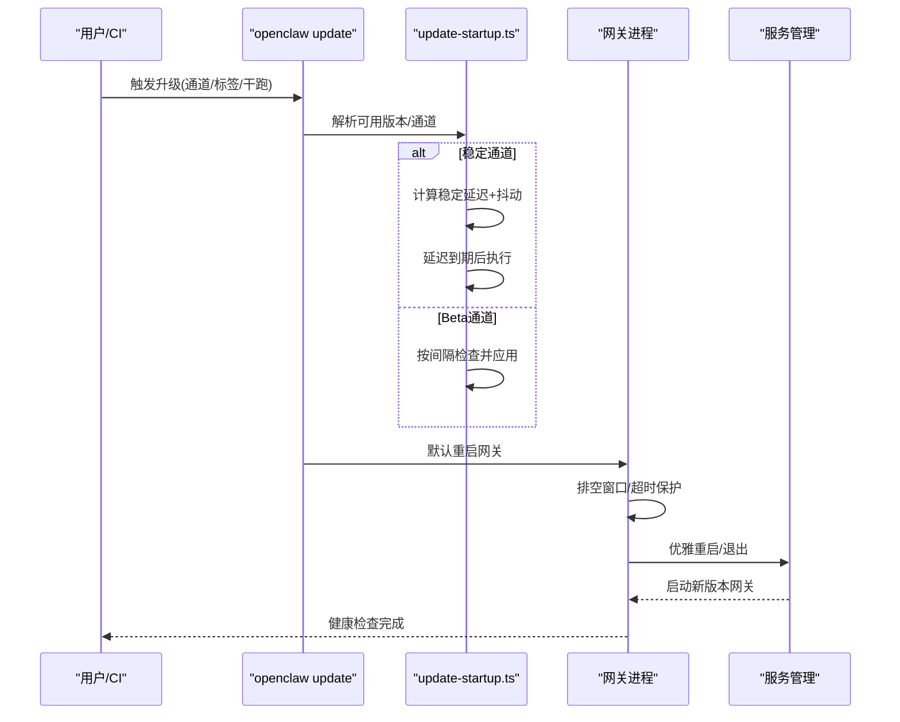
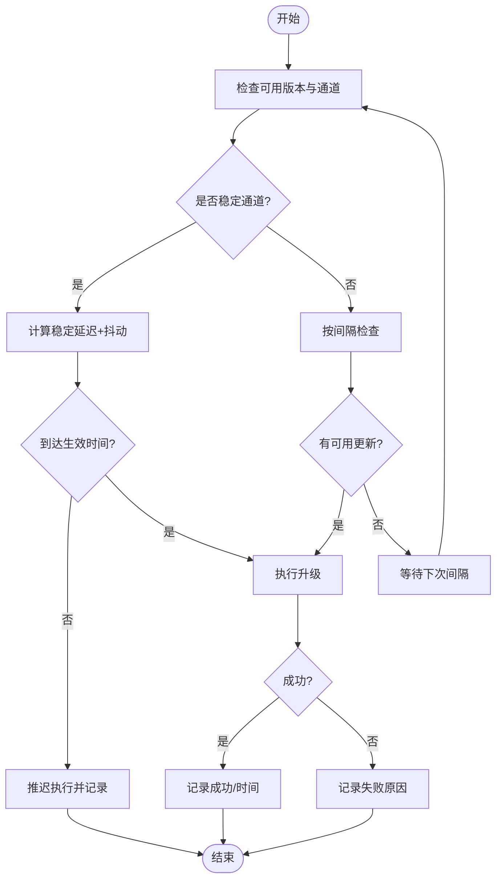
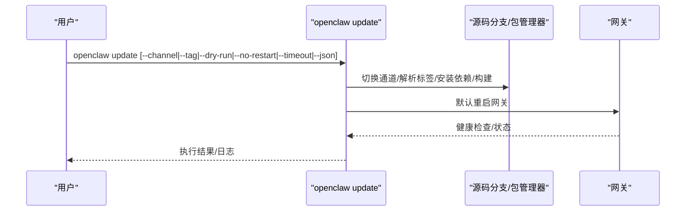
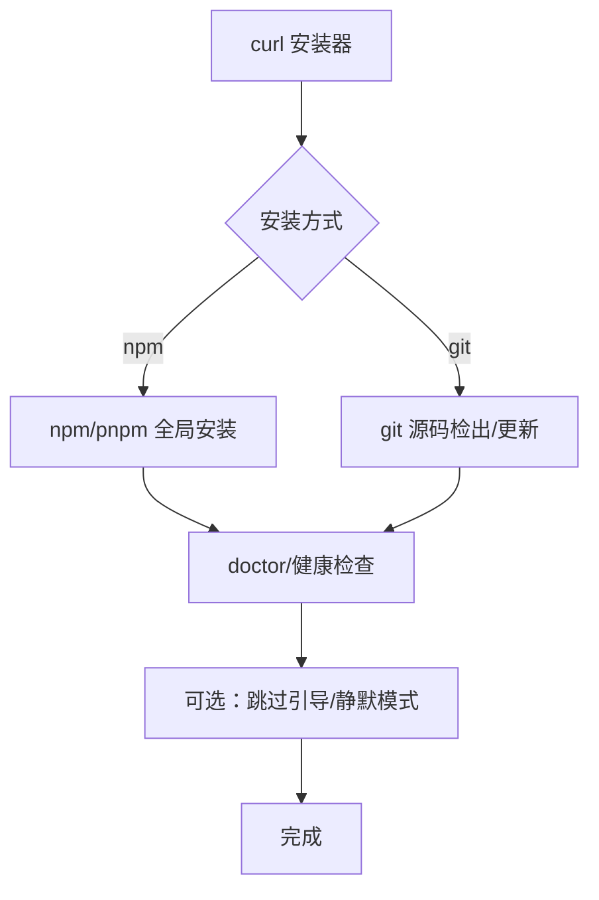
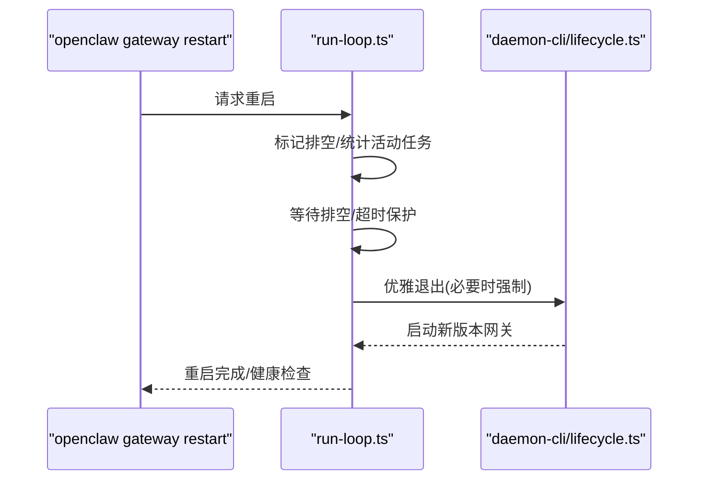
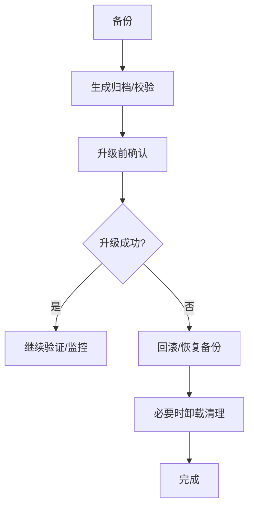
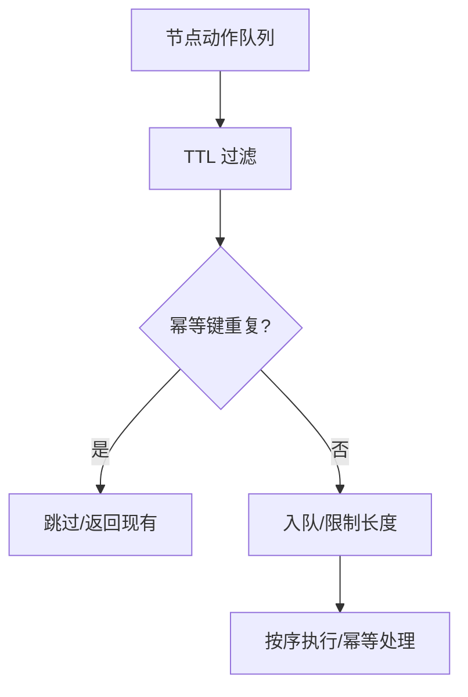
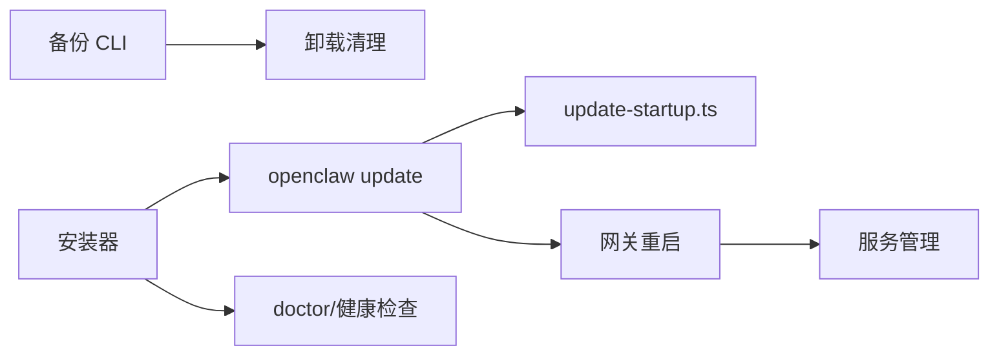

# 升级策略

<cite>
**本文引用的文件**
- [scripts/install.sh](file://scripts/install.sh)
- [docs/install/updating.md](file://docs/install/updating.md)
- [docs/cli/update.md](file://docs/cli/update.md)
- [docs/cli/backup.md](file://docs/cli/backup.md)
- [src/infra/update-startup.ts](file://src/infra/update-startup.ts)
- [src/cli/gateway-cli/run-loop.ts](file://src/cli/gateway-cli/run-loop.ts)
- [src/cli/daemon-cli/lifecycle.ts](file://src/cli/daemon-cli/lifecycle.ts)
- [src/commands/uninstall.ts](file://src/commands/uninstall.ts)
- [src/plugins/uninstall.ts](file://src/plugins/uninstall.ts)
- [src/gateway/server-methods/nodes.ts](file://src/gateway/server-methods/nodes.ts)
- [docs/refactor/cluster.md](file://docs/refactor/cluster.md)
- [docs/gateway/doctor.md](file://docs/gateway/doctor.md)
- [docs/install/installer.md](file://docs/install/installer.md)
</cite>

## 目录
1. [引言](#引言)
2. [项目结构](#项目结构)
3. [核心组件](#核心组件)
4. [架构总览](#架构总览)
5. [详细组件分析](#详细组件分析)
6. [依赖关系分析](#依赖关系分析)
7. [性能考量](#性能考量)
8. [故障排查指南](#故障排查指南)
9. [结论](#结论)
10. [附录](#附录)

## 引言
本指南面向在生产环境中部署与维护 OpenClaw 的工程团队，系统化地给出升级策略与最佳实践，覆盖小版本更新、大版本升级与回滚，升级前准备、兼容性与风险评估，自动化升级与回滚流程，多节点与多实例环境下的滚动升级与零停机方案，以及升级后的验证、功能测试与性能回归检查。同时提供升级失败的应急处理、数据保护与卸载清理、配置迁移与依赖更新的实操建议。

## 项目结构
围绕升级能力的关键位置包括：
- 安装器与升级入口：shell 安装脚本与 CLI 文档
- 自动化升级与稳定窗口：核心更新启动逻辑
- 网关生命周期与重启策略：优雅停机与重启
- 备份与卸载：数据保护与清理
- 多节点与集群：节点动作队列与多实例协调

图表来源
- [scripts/install.sh:1001-1040](file://scripts/install.sh#L1001-L1040)
- [docs/cli/update.md:15-28](file://docs/cli/update.md#L15-L28)
- [docs/install/updating.md:1-258](file://docs/install/updating.md#L1-L258)
- [src/infra/update-startup.ts:156-482](file://src/infra/update-startup.ts#L156-L482)
- [src/cli/gateway-cli/run-loop.ts:98-129](file://src/cli/gateway-cli/run-loop.ts#L98-L129)
- [src/cli/daemon-cli/lifecycle.ts:193-228](file://src/cli/daemon-cli/lifecycle.ts#L193-L228)
- [docs/cli/backup.md:1-77](file://docs/cli/backup.md#L1-L77)
- [src/commands/uninstall.ts:159-199](file://src/commands/uninstall.ts#L159-L199)
- [src/plugins/uninstall.ts:1-59](file://src/plugins/uninstall.ts#L1-L59)
- [src/gateway/server-methods/nodes.ts:141-183](file://src/gateway/server-methods/nodes.ts#L141-L183)
- [docs/refactor/cluster.md:1-300](file://docs/refactor/cluster.md#L1-L300)

章节来源
- [scripts/install.sh:1001-1040](file://scripts/install.sh#L1001-L1040)
- [docs/install/updating.md:1-258](file://docs/install/updating.md#L1-L258)

## 核心组件
- 在线安装器与升级入口：提供统一的升级路径与参数，支持 npm/git 双通道、版本/标签选择、静默与干跑等。
- 自动化升级与稳定窗口：在稳定通道中引入延迟与抖动，实现分批滚动发布；在 beta 通道按固定间隔检查并应用。
- 网关生命周期与重启策略：区分停机与重启，提供排空窗口、超时强制退出与健康检查等待。
- 备份与卸载：提供本地状态归档、校验与清理流程，确保升级前后可恢复。
- 多节点与集群：通过节点动作队列与集群重构思路，支撑多实例与多节点的协调升级。

章节来源
- [scripts/install.sh:1001-1040](file://scripts/install.sh#L1001-L1040)
- [src/infra/update-startup.ts:409-473](file://src/infra/update-startup.ts#L409-L473)
- [src/cli/gateway-cli/run-loop.ts:98-129](file://src/cli/gateway-cli/run-loop.ts#L98-L129)
- [docs/cli/backup.md:1-77](file://docs/cli/backup.md#L1-L77)
- [src/commands/uninstall.ts:159-199](file://src/commands/uninstall.ts#L159-L199)

## 架构总览
下图展示从用户触发到网关重启的升级与重启链路，以及自动更新在稳定通道中的延迟与抖动控制。

图表来源
- [docs/cli/update.md:62-91](file://docs/cli/update.md#L62-L91)
- [src/infra/update-startup.ts:409-473](file://src/infra/update-startup.ts#L409-L473)
- [src/cli/gateway-cli/run-loop.ts:98-129](file://src/cli/gateway-cli/run-loop.ts#L98-L129)
- [src/cli/daemon-cli/lifecycle.ts:220-228](file://src/cli/daemon-cli/lifecycle.ts#L220-L228)

## 详细组件分析

### 组件A：自动化升级与稳定窗口
- 稳定通道：在检测到新版本后，先等待固定小时数，再按安装 ID 与版本/标签确定的稳定抖动窗口内随机生效，避免全量同时升级。
- Beta 通道：按小时级间隔检查并应用。
- 防抖与重试：对同一版本的近期尝试进行去抖，避免频繁重试。
- 结果记录：成功/失败均写入状态缓存，便于后续判断。

图表来源
- [src/infra/update-startup.ts:409-473](file://src/infra/update-startup.ts#L409-L473)
- [src/infra/update-startup.ts:189-206](file://src/infra/update-startup.ts#L189-L206)

章节来源
- [src/infra/update-startup.ts:156-171](file://src/infra/update-startup.ts#L156-L171)
- [src/infra/update-startup.ts:173-187](file://src/infra/update-startup.ts#L173-L187)
- [src/infra/update-startup.ts:189-206](file://src/infra/update-startup.ts#L189-L206)
- [src/infra/update-startup.ts:409-473](file://src/infra/update-startup.ts#L409-L473)

### 组件B：升级命令与参数
- 支持通道切换（stable/beta/dev）、一次性标签覆盖、干跑预演、不重启网关、超时控制与 JSON 输出。
- 对于非 git 安装（npm/pnpm），update 会尝试通过包管理器更新；若无法检测则建议直接使用全局更新方式。

图表来源
- [docs/cli/update.md:15-28](file://docs/cli/update.md#L15-L28)
- [docs/cli/update.md:30-37](file://docs/cli/update.md#L30-L37)
- [docs/cli/update.md:113-129](file://docs/cli/update.md#L113-L129)

章节来源
- [docs/cli/update.md:1-103](file://docs/cli/update.md#L1-L103)

### 组件C：安装器与升级入口
- 提供统一的在线安装器，支持 npm/git 安装方式、版本/标签选择、beta 通道、静默/干跑、交互提示等。
- 与 CLI 更新命令互补：当需要整体重装或修复环境时，优先重跑网站安装器。

图表来源
- [scripts/install.sh:1001-1040](file://scripts/install.sh#L1001-L1040)
- [docs/install/installer.md:129-148](file://docs/install/installer.md#L129-L148)

章节来源
- [scripts/install.sh:1001-1040](file://scripts/install.sh#L1001-L1040)
- [docs/install/installer.md:129-148](file://docs/install/installer.md#L129-L148)

### 组件D：网关重启与停机策略
- 区分停机与重启：重启包含排空窗口，拒绝新任务进入，等待活动任务完成后再退出，超时则强制退出并由服务管理器重启。
- 服务管理：支持通过服务管理器或端口探测进行停止/重启，并带健康检查等待。

图表来源
- [src/cli/gateway-cli/run-loop.ts:98-129](file://src/cli/gateway-cli/run-loop.ts#L98-L129)
- [src/cli/daemon-cli/lifecycle.ts:220-228](file://src/cli/daemon-cli/lifecycle.ts#L220-L228)

章节来源
- [src/cli/gateway-cli/run-loop.ts:98-129](file://src/cli/gateway-cli/run-loop.ts#L98-L129)
- [src/cli/daemon-cli/lifecycle.ts:193-228](file://src/cli/daemon-cli/lifecycle.ts#L193-L228)

### 组件E：备份与卸载
- 备份：创建包含状态目录、配置、凭据与工作区的本地归档，支持仅配置备份、校验与输出路径控制。
- 卸载：支持服务卸载、状态与链接路径清理、工作区删除、应用卸载等，升级前建议先备份。

图表来源
- [docs/cli/backup.md:1-77](file://docs/cli/backup.md#L1-L77)
- [src/commands/uninstall.ts:159-199](file://src/commands/uninstall.ts#L159-L199)
- [src/plugins/uninstall.ts:1-59](file://src/plugins/uninstall.ts#L1-L59)

章节来源
- [docs/cli/backup.md:1-77](file://docs/cli/backup.md#L1-L77)
- [src/commands/uninstall.ts:159-199](file://src/commands/uninstall.ts#L159-L199)
- [src/plugins/uninstall.ts:1-59](file://src/plugins/uninstall.ts#L1-L59)

### 组件F：多节点与集群协调
- 节点动作队列：每个节点维护待处理动作队列，带 TTL 与最大长度限制，保证幂等与去重。
- 集群重构思路：面向多实例/多节点的升级，建议采用分批、隔离与幂等策略，参考集群重构文档中的模块化与生命周期抽象。

图表来源
- [src/gateway/server-methods/nodes.ts:141-183](file://src/gateway/server-methods/nodes.ts#L141-L183)

章节来源
- [src/gateway/server-methods/nodes.ts:141-183](file://src/gateway/server-methods/nodes.ts#L141-L183)
- [docs/refactor/cluster.md:1-300](file://docs/refactor/cluster.md#L1-L300)

## 依赖关系分析
- 升级入口依赖安装器与 CLI 文档，确保参数与行为一致。
- 自动化升级依赖版本解析、通道与稳定窗口策略。
- 网关重启依赖生命周期与服务管理，保障优雅停机与健康检查。
- 备份与卸载为升级前保护与回退提供基础。

图表来源
- [docs/cli/update.md:62-91](file://docs/cli/update.md#L62-L91)
- [src/infra/update-startup.ts:409-473](file://src/infra/update-startup.ts#L409-L473)
- [src/cli/gateway-cli/run-loop.ts:98-129](file://src/cli/gateway-cli/run-loop.ts#L98-L129)
- [src/cli/daemon-cli/lifecycle.ts:220-228](file://src/cli/daemon-cli/lifecycle.ts#L220-L228)
- [docs/cli/backup.md:1-77](file://docs/cli/backup.md#L1-L77)
- [src/commands/uninstall.ts:159-199](file://src/commands/uninstall.ts#L159-L199)
- [scripts/install.sh:1001-1040](file://scripts/install.sh#L1001-L1040)
- [docs/gateway/doctor.md](file://docs/gateway/doctor.md)

章节来源
- [docs/install/updating.md:169-183](file://docs/install/updating.md#L169-L183)

## 性能考量
- 自动化升级在稳定通道引入延迟与抖动，降低峰值资源占用与瞬时压力。
- 网关重启的排空窗口与超时保护，避免长时间阻塞导致的用户体验劣化。
- 备份与卸载流程尽量避免重复扫描与压缩，优先硬链接与最小化复制。

## 故障排查指南
- 升级失败的常见原因与处理：
  - 包管理器错误：根据安装器诊断输出定位依赖缺失或权限问题，必要时自动安装构建工具或调整 npm 配置。
  - 权限与路径：确保 Node/npm 版本满足要求，必要时通过安装器引导修复。
  - 升级后异常：运行 doctor 以修复/迁移配置、审计策略与健康检查；如需回滚，使用 pin 或源码回退。
- 应急处理：
  - 使用备份归档快速恢复状态与配置。
  - 若服务未随重启恢复，检查服务管理器状态并手动重启。
  - 对于插件/扩展安装失败，采用卸载清理后重装。

章节来源
- [scripts/install.sh:743-838](file://scripts/install.sh#L743-L838)
- [docs/cli/backup.md:49-61](file://docs/cli/backup.md#L49-L61)
- [src/cli/daemon-cli/lifecycle.ts:220-228](file://src/cli/daemon-cli/lifecycle.ts#L220-L228)
- [src/commands/uninstall.ts:159-199](file://src/commands/uninstall.ts#L159-L199)

## 结论
通过统一的升级入口、稳定的自动化升级策略、优雅的网关重启机制、完善的备份与卸载流程，以及面向多节点/多实例的协调思路，OpenClaw 能够在保证业务连续性的前提下安全高效地完成升级。建议在生产环境中结合稳定通道的延迟与抖动、干跑预演与 doctor 检查，形成标准化的升级流水线。

## 附录

### A. 升级场景与策略清单
- 小版本更新
  - 使用稳定通道，启用自动化升级并在稳定窗口内生效；或使用 CLI 干跑预演后执行。
  - 升级后立即运行 doctor 与健康检查。
- 大版本升级
  - 使用 dev/beta 通道先行验证；必要时在源码分支上进行预构建与 lint。
  - 升级前创建完整备份，升级后进行功能回归与性能回归检查。
- 回滚操作
  - 全局安装：使用 pin 指定已知版本；源码安装：基于日期回退到历史提交。
  - 如遇服务异常，使用服务管理器重启或强制退出后由系统守护重启。

章节来源
- [docs/install/updating.md:206-257](file://docs/install/updating.md#L206-L257)
- [docs/cli/update.md:62-91](file://docs/cli/update.md#L62-L91)

### B. 升级前准备与风险评估
- 环境与安装方式确认：全局安装（npm/pnpm）或源码安装（git）。
- 网关运行方式：前台终端或受管服务（launchd/systemd/WIN）。
- 数据保护：创建完整备份，包含状态、配置、凭据与工作区。
- 风险评估：对关键配置变更、插件/扩展兼容性与依赖更新进行评估。

章节来源
- [docs/install/updating.md:37-45](file://docs/install/updating.md#L37-L45)
- [docs/cli/backup.md:34-47](file://docs/cli/backup.md#L34-L47)

### C. 自动化升级脚本与配置选项
- 安装器参数：安装方式、版本/标签、beta 通道、静默/干跑、交互提示等。
- CLI 升级参数：通道、标签覆盖、干跑、不重启、超时、JSON 输出。
- 自动化升级配置：稳定延迟、抖动窗口、beta 检查间隔等。

章节来源
- [docs/install/installer.md:129-148](file://docs/install/installer.md#L129-L148)
- [docs/cli/update.md:30-37](file://docs/cli/update.md#L30-L37)
- [docs/install/updating.md:74-98](file://docs/install/updating.md#L74-L98)

### D. 多节点与多实例的滚动升级
- 分批升级：按节点/实例分组，逐批应用升级并观察健康状态。
- 幂等与去重：利用节点动作队列的幂等键与 TTL，避免重复执行。
- 隔离与回退：对关键实例保留隔离策略，失败时快速回退。

章节来源
- [src/gateway/server-methods/nodes.ts:141-183](file://src/gateway/server-methods/nodes.ts#L141-L183)
- [docs/refactor/cluster.md:1-300](file://docs/refactor/cluster.md#L1-L300)

### E. 升级后的验证与回归检查
- 功能验证：核心通道/节点/插件连通性与消息流转。
- 性能回归：CPU/内存/IO 基准对比，关注重启/重建阶段的峰值。
- 日志与告警：检查升级前后日志与健康指标变化。

章节来源
- [docs/install/updating.md:169-183](file://docs/install/updating.md#L169-L183)

### F. 卸载清理与配置迁移
- 卸载范围：服务、状态、工作区、应用等，支持干跑预览。
- 插件卸载：尊重安装来源与默认路径，避免误删自定义路径。
- 配置迁移：doctor 会迁移旧配置与文件位置，必要时人工介入。

章节来源
- [src/commands/uninstall.ts:159-199](file://src/commands/uninstall.ts#L159-L199)
- [src/plugins/uninstall.ts:1-59](file://src/plugins/uninstall.ts#L1-L59)
- [docs/gateway/doctor.md](file://docs/gateway/doctor.md)