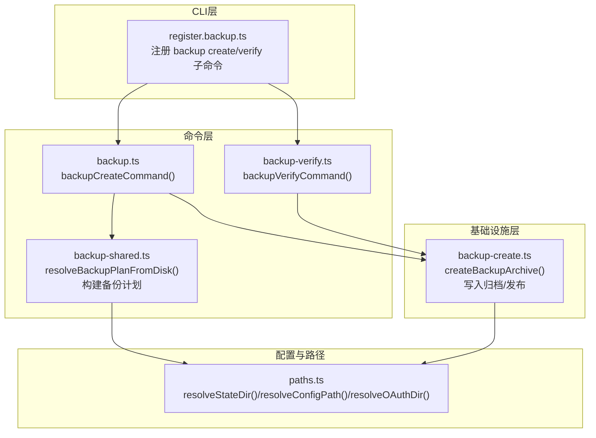
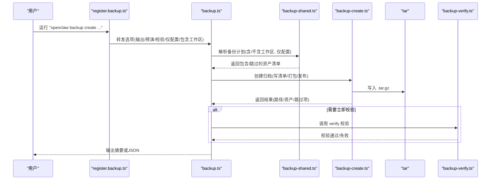
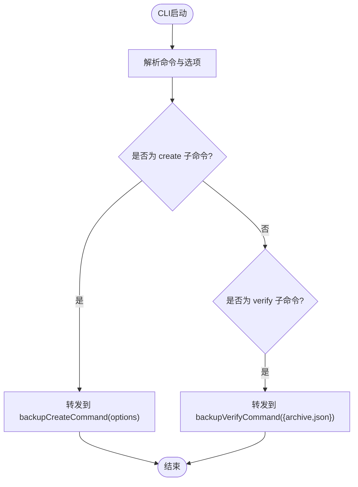
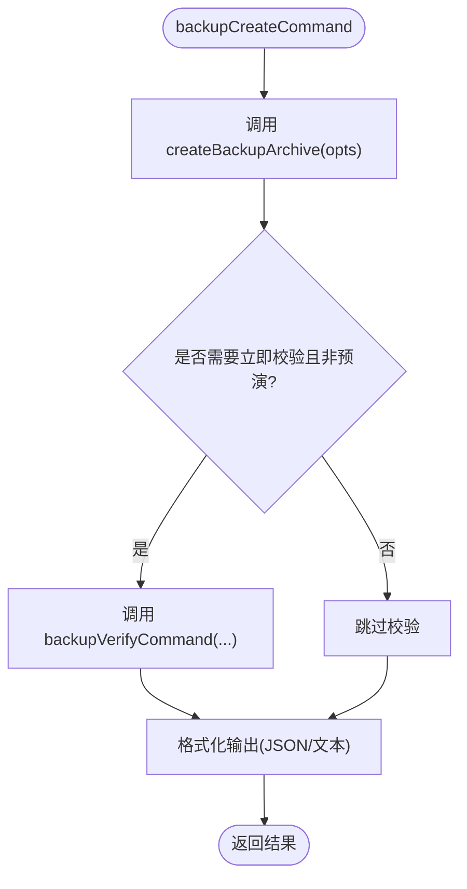
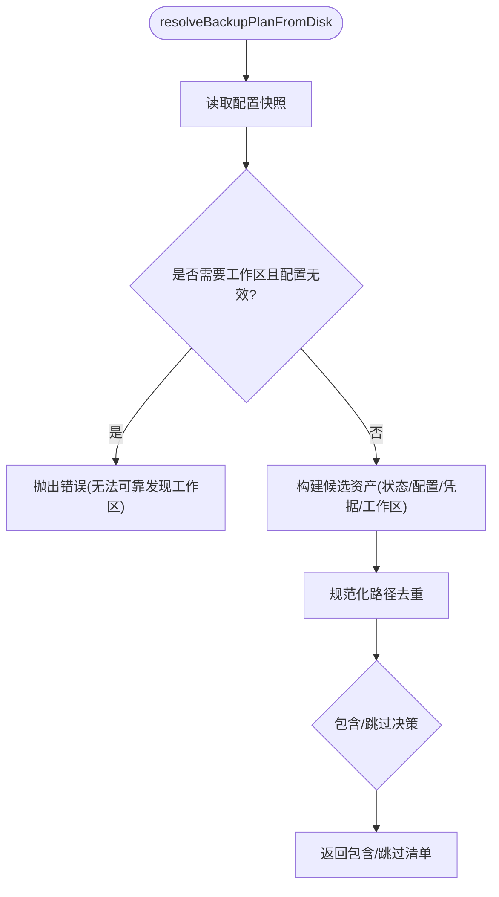
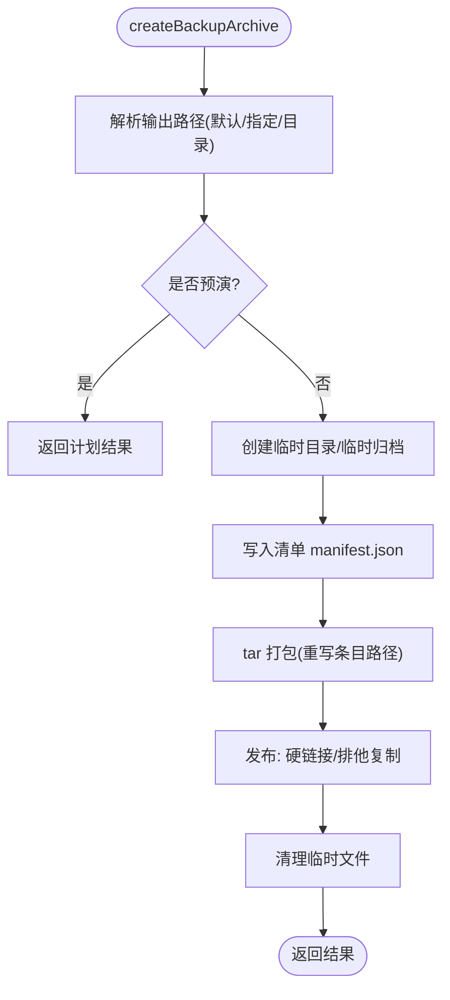
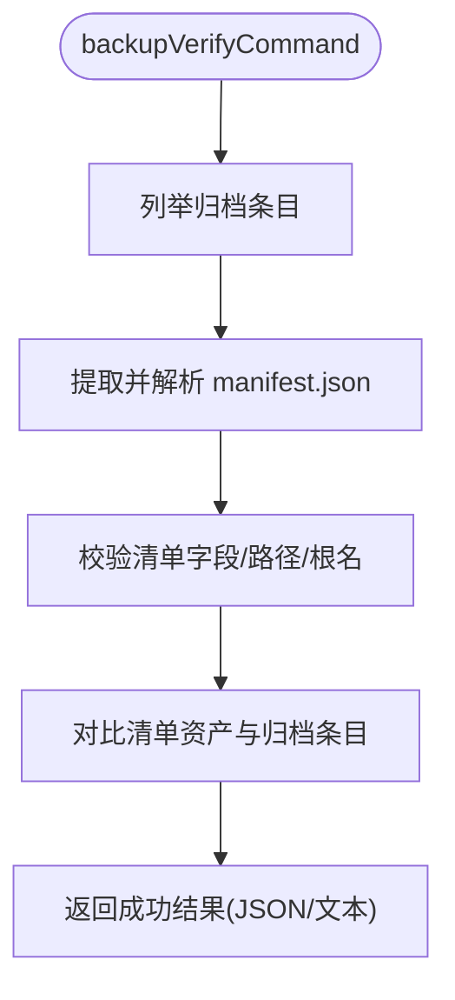
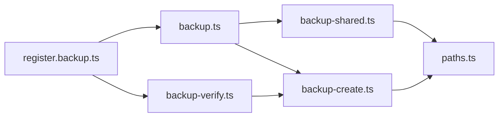

# 备份恢复

<cite>
**本文引用的文件**
- [docs/cli/backup.md](file://docs/cli/backup.md)
- [src/cli/program/register.backup.ts](file://src/cli/program/register.backup.ts)
- [src/commands/backup.ts](file://src/commands/backup.ts)
- [src/commands/backup-verify.ts](file://src/commands/backup-verify.ts)
- [src/commands/backup-shared.ts](file://src/commands/backup-shared.ts)
- [src/infra/backup-create.ts](file://src/infra/backup-create.ts)
- [src/config/paths.ts](file://src/config/paths.ts)
</cite>

## 目录
1. [简介](#简介)
2. [项目结构](#项目结构)
3. [核心组件](#核心组件)
4. [架构总览](#架构总览)
5. [详细组件分析](#详细组件分析)
6. [依赖关系分析](#依赖关系分析)
7. [性能与规模考量](#性能与规模考量)
8. [故障排查指南](#故障排查指南)
9. [结论](#结论)
10. [附录：操作指南与最佳实践](#附录操作指南与最佳实践)

## 简介
本指南面向OpenClaw备份恢复系统，围绕openclaw backup命令提供从策略到实操的全链路说明。内容覆盖：
- 数据备份策略与范围（状态、配置、凭据、工作区）
- 备份类型与频率建议（完整/增量/选择性）
- 命令用法与参数详解（输出、预演、校验、仅配置、排除工作区）
- 备份文件存储位置、命名规范与版本管理
- 验证、完整性检查与恢复测试流程
- 灾难恢复计划（RTO/RPO）、业务连续性保障
- 高级场景（部分数据恢复、跨平台迁移、批量恢复）

## 项目结构
OpenClaw的备份能力由CLI注册、命令实现、共享计划与底层归档写入四层构成，并通过配置路径解析确定默认源目录。

**图表来源**
- [src/cli/program/register.backup.ts:10-92](file://src/cli/program/register.backup.ts#L10-L92)
- [src/commands/backup.ts:11-31](file://src/commands/backup.ts#L11-L31)
- [src/commands/backup-verify.ts:279-324](file://src/commands/backup-verify.ts#L279-L324)
- [src/commands/backup-shared.ts:106-254](file://src/commands/backup-shared.ts#L106-L254)
- [src/infra/backup-create.ts:272-368](file://src/infra/backup-create.ts#L272-L368)
- [src/config/paths.ts:60-264](file://src/config/paths.ts#L60-L264)

**章节来源**
- [src/cli/program/register.backup.ts:10-92](file://src/cli/program/register.backup.ts#L10-L92)
- [src/commands/backup.ts:11-31](file://src/commands/backup.ts#L11-L31)
- [src/commands/backup-verify.ts:279-324](file://src/commands/backup-verify.ts#L279-L324)
- [src/commands/backup-shared.ts:106-254](file://src/commands/backup-shared.ts#L106-L254)
- [src/infra/backup-create.ts:272-368](file://src/infra/backup-create.ts#L272-L368)
- [src/config/paths.ts:60-264](file://src/config/paths.ts#L60-L264)

## 核心组件
- CLI子命令注册：定义backup create与backup verify的参数、帮助与示例。
- 备份创建命令：组合计划解析与归档写入，支持预演、校验、JSON输出。
- 备份验证命令：读取归档、提取并解析清单、校验清单与归档一致性。
- 备份共享模块：根据当前配置与环境，生成“包含/跳过”的资产清单。
- 归档基础设施：构建清单、写入tar.gz、发布最终文件、错误处理与清理。

**章节来源**
- [src/cli/program/register.backup.ts:10-92](file://src/cli/program/register.backup.ts#L10-L92)
- [src/commands/backup.ts:11-31](file://src/commands/backup.ts#L11-L31)
- [src/commands/backup-verify.ts:279-324](file://src/commands/backup-verify.ts#L279-L324)
- [src/commands/backup-shared.ts:106-254](file://src/commands/backup-shared.ts#L106-L254)
- [src/infra/backup-create.ts:272-368](file://src/infra/backup-create.ts#L272-L368)

## 架构总览
下图展示一次“创建备份”到“验证备份”的端到端流程。

**图表来源**
- [src/cli/program/register.backup.ts:53-64](file://src/cli/program/register.backup.ts#L53-L64)
- [src/commands/backup.ts:11-31](file://src/commands/backup.ts#L11-L31)
- [src/commands/backup-shared.ts:106-254](file://src/commands/backup-shared.ts#L106-L254)
- [src/infra/backup-create.ts:272-368](file://src/infra/backup-create.ts#L272-L368)
- [src/commands/backup-verify.ts:279-324](file://src/commands/backup-verify.ts#L279-L324)

## 详细组件分析

### 组件A：CLI注册与参数转发
- 功能要点
  - 定义backup create与backup verify两个子命令
  - 支持输出目录/文件、JSON输出、预演、立即校验、仅配置、排除工作区
  - 将用户输入映射为命令选项并传递给具体实现
- 关键行为
  - create子命令将选项透传至backupCreateCommand
  - verify子命令将归档路径与JSON开关透传至backupVerifyCommand
  - 提供丰富的示例帮助

**图表来源**
- [src/cli/program/register.backup.ts:53-91](file://src/cli/program/register.backup.ts#L53-L91)

**章节来源**
- [src/cli/program/register.backup.ts:10-92](file://src/cli/program/register.backup.ts#L10-L92)

### 组件B：备份创建命令
- 功能要点
  - 调用createBackupArchive执行实际归档
  - 可选在非预演时自动调用verify进行校验
  - 支持JSON或人类可读摘要输出
- 错误处理
  - 预演模式不写入文件，直接返回计划结果
  - 根据选项决定是否包含工作区与仅配置

**图表来源**
- [src/commands/backup.ts:11-31](file://src/commands/backup.ts#L11-L31)

**章节来源**
- [src/commands/backup.ts:11-31](file://src/commands/backup.ts#L11-L31)

### 组件C：备份计划解析（共享模块）
- 功能要点
  - 依据环境变量与配置快照，解析状态目录、配置文件、凭据目录
  - 可选发现工作区目录；当仅配置模式时跳过工作区
  - 去重与优先级排序，避免重复包含与覆盖
- 行为细节
  - 若配置无效且启用工作区，会抛出错误以避免不可靠的工作区发现
  - 对于不存在的路径标记为“跳过”，对被更大目录覆盖的路径标记为“被覆盖”

**图表来源**
- [src/commands/backup-shared.ts:106-254](file://src/commands/backup-shared.ts#L106-L254)

**章节来源**
- [src/commands/backup-shared.ts:106-254](file://src/commands/backup-shared.ts#L106-L254)

### 组件D：归档写入与发布（基础设施）
- 功能要点
  - 生成时间戳根名与归档名，构建清单并写入临时归档
  - 使用tar打包，重写条目路径以符合归档布局
  - 优先硬链接发布，不支持时回退到排他复制
  - 清理临时文件与目录
- 输出与命名
  - 默认输出为当前目录下的时间戳.tar.gz
  - 当当前目录位于源树内时，默认改到家目录
  - 不覆盖已存在文件

**图表来源**
- [src/infra/backup-create.ts:272-368](file://src/infra/backup-create.ts#L272-L368)

**章节来源**
- [src/infra/backup-create.ts:272-368](file://src/infra/backup-create.ts#L272-L368)

### 组件E：备份验证（独立命令）
- 功能要点
  - 列举归档条目，解析并校验清单
  - 检查清单唯一性、相对路径、无路径穿越、根名单合法
  - 校验清单声明的每个资产在归档中存在或被嵌套包含
- 输出
  - 成功时输出归档路径、根名、创建时间、运行时版本、资产数、扫描条目数
  - 支持JSON输出便于自动化

**图表来源**
- [src/commands/backup-verify.ts:279-324](file://src/commands/backup-verify.ts#L279-L324)

**章节来源**
- [src/commands/backup-verify.ts:279-324](file://src/commands/backup-verify.ts#L279-L324)

## 依赖关系分析
- CLI层依赖命令层；命令层依赖共享模块与基础设施层；共享模块与基础设施层共同依赖配置路径解析。
- 关键耦合点
  - 备份计划依赖配置快照与状态/配置/凭据路径解析
  - 归档写入依赖tar库与文件系统发布策略
  - 验证过程独立于创建流程，但依赖清单结构约定

**图表来源**
- [src/cli/program/register.backup.ts:10-92](file://src/cli/program/register.backup.ts#L10-L92)
- [src/commands/backup.ts:11-31](file://src/commands/backup.ts#L11-L31)
- [src/commands/backup-verify.ts:279-324](file://src/commands/backup-verify.ts#L279-L324)
- [src/commands/backup-shared.ts:106-254](file://src/commands/backup-shared.ts#L106-L254)
- [src/infra/backup-create.ts:272-368](file://src/infra/backup-create.ts#L272-L368)
- [src/config/paths.ts:60-264](file://src/config/paths.ts#L60-L264)

**章节来源**
- [src/cli/program/register.backup.ts:10-92](file://src/cli/program/register.backup.ts#L10-L92)
- [src/commands/backup.ts:11-31](file://src/commands/backup.ts#L11-L31)
- [src/commands/backup-verify.ts:279-324](file://src/commands/backup-verify.ts#L279-L324)
- [src/commands/backup-shared.ts:106-254](file://src/commands/backup-shared.ts#L106-L254)
- [src/infra/backup-create.ts:272-368](file://src/infra/backup-create.ts#L272-L368)
- [src/config/paths.ts:60-264](file://src/config/paths.ts#L60-L264)

## 性能与规模考量
- 大型工作区是归档体积的主要驱动因素。若关注速度与体积，建议：
  - 使用“排除工作区”选项
  - 使用“仅配置”选项
- 归档写入涉及磁盘I/O与压缩，建议：
  - 在有足够可用空间的目标上执行
  - 避免在源树内部写入默认输出，必要时显式指定输出目录
- 校验阶段会重新扫描归档，建议在CI或离线环境中执行

**章节来源**
- [docs/cli/backup.md:63-77](file://docs/cli/backup.md#L63-L77)
- [src/infra/backup-create.ts:305-307](file://src/infra/backup-create.ts#L305-L307)

## 故障排查指南
- 常见问题与处理
  - “拒绝覆盖现有备份归档”
    - 原因：目标文件已存在
    - 处理：更换输出路径或删除旧归档
  - “输出必须不能写入源路径内部”
    - 原因：防止自包含与循环
    - 处理：将输出移出任一源路径之外
  - “找不到清单条目或清单数量不为1”
    - 原因：归档损坏或被篡改
    - 处理：重新创建备份
  - “清单资产在归档中缺失或路径非法”
    - 原因：清单与归档不一致
    - 处理：检查归档完整性或重新打包
  - “配置无效且启用了工作区”
    - 原因：无法可靠发现工作区
    - 处理：修复配置或使用“排除工作区”选项进行部分备份
  - “仅配置模式但未找到配置文件”
    - 原因：未检测到有效配置
    - 处理：确认配置路径或先创建配置

**章节来源**
- [src/infra/backup-create.ts:113-124](file://src/infra/backup-create.ts#L113-L124)
- [src/infra/backup-create.ts:295-303](file://src/infra/backup-create.ts#L295-L303)
- [src/commands/backup-verify.ts:282-302](file://src/commands/backup-verify.ts#L282-L302)
- [src/commands/backup-shared.ts:158-163](file://src/commands/backup-shared.ts#L158-L163)
- [src/infra/backup-create.ts:287-293](file://src/infra/backup-create.ts#L287-L293)

## 结论
OpenClaw的备份系统以清晰的分层设计实现了“可预演、可校验、可选择”的本地归档能力。通过CLI参数与共享计划模块，用户可以灵活控制备份范围与粒度；通过验证命令确保归档完整性；通过默认输出策略与发布机制保证安全性与可移植性。结合本文提供的策略与流程，可在不同场景下建立稳健的备份与恢复体系。

## 附录：操作指南与最佳实践

### 一、备份策略与范围
- 备份内容
  - 状态目录（通常为家目录下的隐藏目录）
  - 活动配置文件
  - 凭据/OAuth目录
  - 工作区目录（可选）
- 备份类型
  - 完整备份：包含状态、配置、凭据与工作区
  - 仅配置备份：仅包含活动配置文件
  - 排除工作区备份：包含状态、配置、凭据，但不包含工作区
- 备份频率
  - 开发/测试：每次重大变更后
  - 生产：每日/每周增量（如需）+ 每月完整
  - 特殊事件：升级前、迁移前、卸载前

**章节来源**
- [docs/cli/backup.md:34-47](file://docs/cli/backup.md#L34-L47)
- [src/commands/backup-shared.ts:106-156](file://src/commands/backup-shared.ts#L106-L156)

### 二、openclaw backup 命令用法
- 创建备份
  - 基本用法：在当前目录生成时间戳归档
  - 指定输出目录：将归档写入指定目录
  - 预演与JSON：打印计划而不写入
  - 立即校验：创建完成后立即验证
  - 仅配置：仅归档活动配置文件
  - 排除工作区：不包含工作区目录
- 验证备份
  - 校验归档结构与清单一致性
  - 支持JSON输出用于自动化

**章节来源**
- [docs/cli/backup.md:13-21](file://docs/cli/backup.md#L13-L21)
- [src/cli/program/register.backup.ts:20-64](file://src/cli/program/register.backup.ts#L20-L64)
- [src/cli/program/register.backup.ts:66-91](file://src/cli/program/register.backup.ts#L66-L91)

### 三、备份文件存储位置、命名规范与版本管理
- 存储位置
  - 默认：当前工作目录（若当前目录位于源树内，则改到家目录）
  - 指定：通过输出参数指定文件或目录
- 命名规范
  - 根名：时间戳 + 固定后缀
  - 文件名：根名 + .tar.gz
- 版本管理
  - 建议按日期/用途打标（例如latest、monthly），配合外部归档工具维护多版本
  - 避免覆盖已有归档，遵循“不覆盖”策略

**章节来源**
- [docs/cli/backup.md:25-31](file://docs/cli/backup.md#L25-L31)
- [src/commands/backup-shared.ts:60-84](file://src/commands/backup-shared.ts#L60-L84)
- [src/infra/backup-create.ts:78-111](file://src/infra/backup-create.ts#L78-L111)

### 四、备份验证与恢复测试
- 验证流程
  - 使用验证命令检查清单与归档一致性
  - 在CI或离线环境中定期执行
- 恢复测试
  - 在隔离环境中解压并比对关键文件
  - 验证配置与凭据可用性
  - 测试工作区加载（如适用）

**章节来源**
- [docs/cli/backup.md:25-31](file://docs/cli/backup.md#L25-L31)
- [src/commands/backup-verify.ts:279-324](file://src/commands/backup-verify.ts#L279-L324)

### 五、灾难恢复计划（RTO/RPO）
- RTO（恢复时间目标）
  - 通过预演与验证缩短恢复准备时间
  - 使用“仅配置”快速恢复最小可用环境
- RPO（恢复点目标）
  - 通过定期完整备份与按需增量（如需）控制最大可接受的数据丢失
- 业务连续性
  - 保持配置与凭据可恢复
  - 在升级/迁移前后执行备份与验证

**章节来源**
- [docs/cli/backup.md:63-77](file://docs/cli/backup.md#L63-L77)

### 六、高级场景
- 部分数据恢复
  - 仅恢复配置：使用“仅配置”备份
  - 仅恢复状态：排除工作区与凭据
- 跨平台迁移
  - 使用同一时间戳归档在不同平台解压
  - 注意路径编码差异（系统/POSIX/Windows）
- 批量恢复
  - 在脚本中循环调用验证与解压
  - 通过JSON输出对接自动化流水线

**章节来源**
- [src/commands/backup-shared.ts:68-84](file://src/commands/backup-shared.ts#L68-L84)
- [src/commands/backup-verify.ts:279-324](file://src/commands/backup-verify.ts#L279-L324)