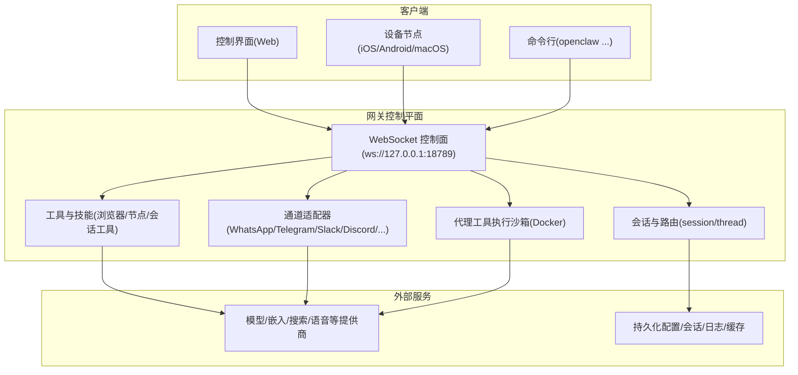
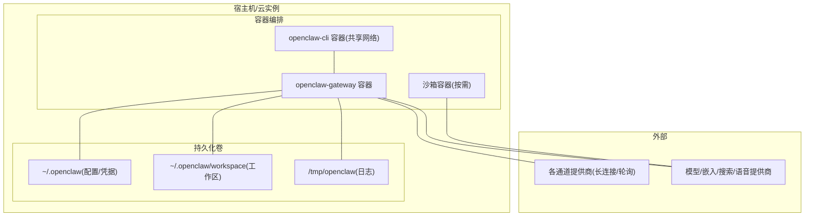
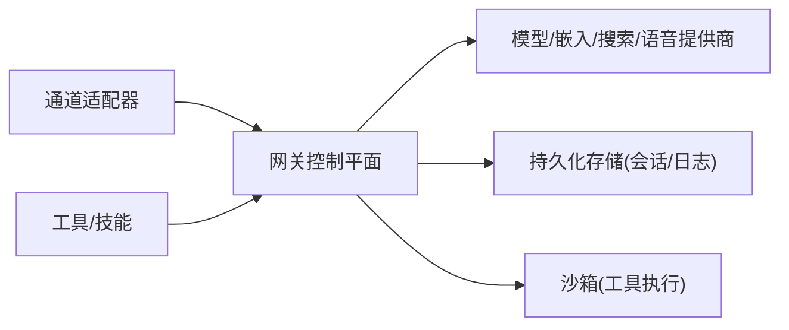

# 容量规划

<cite>
**本文引用的文件**
- [README.md](file://README.md)
- [docs/install/docker.md](file://docs/install/docker.md)
- [docs/gateway/configuration.md](file://docs/gateway/configuration.md)
- [docs/gateway/health.md](file://docs/gateway/health.md)
- [docs/reference/api-usage-costs.md](file://docs/reference/api-usage-costs.md)
- [docs/automation/auth-monitoring.md](file://docs/automation/auth-monitoring.md)
- [src/shared/usage-aggregates.ts](file://src/shared/usage-aggregates.ts)
- [src/gateway/gateway-models.profiles.live.test.ts](file://src/gateway/gateway-models.profiles.live.test.ts)
- [src/discord/monitor/thread-bindings.lifecycle.ts](file://src/discord/monitor/thread-bindings.lifecycle.ts)
- [extensions/nostr/src/metrics.ts](file://extensions/nostr/src/metrics.ts)
- [extensions/nostr/src/nostr-bus.integration.test.ts](file://extensions/nostr/src/nostr-bus.integration.test.ts)
- [extensions/open-prose/skills/prose/lib/profiler.prose](file://extensions/open-prose/skills/prose/lib/profiler.prose)
</cite>

## 目录
1. [简介](#简介)
2. [项目结构](#项目结构)
3. [核心组件](#核心组件)
4. [架构总览](#架构总览)
5. [详细组件分析](#详细组件分析)
6. [依赖关系分析](#依赖关系分析)
7. [性能考量](#性能考量)
8. [故障排查指南](#故障排查指南)
9. [结论](#结论)
10. [附录](#附录)

## 简介
本指南面向在个人到企业级规模部署 OpenClaw 的容量管理与运维团队，提供系统资源需求评估方法（CPU、内存、存储、网络）、并发用户与消息吞吐的容量基准、性能基准测试与压力测试方法、监控指标体系、自动扩缩容与高可用策略、容量预警与扩容决策支持，以及成本优化与资源利用率提升的最佳实践。OpenClaw 的核心是“网关控制平面”，通过 WebSocket 提供统一的控制面，并承载多通道接入、会话路由、工具执行与媒体处理等能力。

## 项目结构
OpenClaw 采用模块化与分层架构：前端控制界面与聊天界面由网关提供；后端以“网关 + 多通道适配器 + 工具与技能”构成；容器化与沙箱能力可按需启用。下图展示与容量规划直接相关的运行时与部署要素：

图表来源
- [README.md:185-202](file://README.md#L185-L202)
- [docs/install/docker.md:539-544](file://docs/install/docker.md#L539-L544)

章节来源
- [README.md:185-202](file://README.md#L185-L202)
- [docs/install/docker.md:539-544](file://docs/install/docker.md#L539-L544)

## 核心组件
- 网关控制平面：统一的 WebSocket 控制面，负责会话、通道、工具与事件编排；健康探针与就绪检查；远程访问与安全暴露。
- 通道适配器：对多渠道（如 WhatsApp、Telegram、Discord 等）进行连接、鉴权与消息路由。
- 工具与技能：浏览器控制、Canvas、节点操作、定时任务、会话工具等；可结合沙箱隔离工具执行。
- 沙箱：基于 Docker 的非主会话工具执行隔离，限制权限与资源，降低跨会话风险。
- 存储与日志：会话、转录、日志与缓存的持久化路径，影响磁盘容量与 IO 压力。
- 性能度量：延迟聚合、每日延迟统计、指标收集与快照，支撑容量与成本分析。

章节来源
- [docs/gateway/configuration.md:349-387](file://docs/gateway/configuration.md#L349-L387)
- [docs/reference/api-usage-costs.md:15-32](file://docs/reference/api-usage-costs.md#L15-L32)
- [src/shared/usage-aggregates.ts:1-66](file://src/shared/usage-aggregates.ts#L1-L66)

## 架构总览
下图展示 OpenClaw 在容器化与沙箱场景下的典型部署形态，以及与外部提供商的交互关系，便于进行容量与成本建模。

图表来源
- [docs/install/docker.md:539-544](file://docs/install/docker.md#L539-L544)
- [docs/install/docker.md:549-576](file://docs/install/docker.md#L549-L576)

章节来源
- [docs/install/docker.md:539-544](file://docs/install/docker.md#L539-L544)
- [docs/install/docker.md:549-576](file://docs/install/docker.md#L549-L576)

## 详细组件分析

### 资源需求评估与容量基准
- CPU
  - 单核通用场景：轻量会话与少量通道，CPU 使用率通常稳定在低中段。
  - 多通道/多会话并发：CPU 使用率随通道连接数、消息处理与工具执行增加而上升；建议为并发峰值预留 20%-40% 缓冲。
  - 模型推理与媒体理解：大模型调用与音频/图像处理显著提升 CPU 占用，应按峰值并发估算。
- 内存
  - 运行时内存占用与会话数量、上下文长度、媒体缓存、浏览器进程有关；容器镜像默认以非 root 用户运行，避免额外权限开销。
  - 持久化配置与工作区位于宿主挂载目录，容器内仅保留临时缓存；注意容器内存限制与 swap 配置。
- 存储
  - 主要增长点：媒体目录、会话 JSON、转录日志、定时任务运行记录、滚动日志文件。
  - 建议：为日志与会话数据设置上限与轮转策略，定期清理过期会话与运行记录。
- 网络
  - 通道接入：多数通道采用长连接或轮询，网络带宽主要受消息大小、媒体传输与并发连接数决定。
  - 外部提供商：模型/嵌入/搜索/语音等 API 调用产生出站带宽；建议按峰值并发与平均消息大小估算。

章节来源
- [docs/install/docker.md:539-544](file://docs/install/docker.md#L539-L544)
- [docs/reference/api-usage-costs.md:44-142](file://docs/reference/api-usage-costs.md#L44-L142)

### 并发用户数、消息吞吐与响应时间基准
- 并发用户数
  - 以每通道活跃会话数与并发线程数为基准；可通过通道适配器的生命周期与并发控制参数进行约束。
- 消息吞吐
  - 基于通道类型与消息大小估算：文本消息吞吐量较高，媒体消息吞吐量较低但延迟更高。
- 响应时间
  - 关键指标：P50/P95/P99 延迟、首包延迟、模型推理延迟、工具执行延迟；结合延迟聚合与每日延迟统计进行趋势分析。

章节来源
- [src/shared/usage-aggregates.ts:18-66](file://src/shared/usage-aggregates.ts#L18-L66)
- [extensions/nostr/src/metrics.ts:157-194](file://extensions/nostr/src/metrics.ts#L157-L194)

### 容量规划模板（个人到企业级）
- 个人使用（单通道/少会话）
  - CPU：1 核以上，内存 2-4 GB，存储 20-50 GB 可用空间。
  - 网络：上行/下行带宽 10-50 Mbps。
- 小型团队（3-10 人，多通道）
  - CPU：2-4 核，内存 4-8 GB，存储 50-200 GB。
  - 网络：上行/下行带宽 50-200 Mbps。
- 中型企业（10-50 人，多通道+多会话）
  - CPU：4-8 核，内存 8-16 GB，存储 200-1000 GB。
  - 网络：上行/下行带宽 200-1000 Mbps。
- 大型企业（50+ 人，高并发）
  - CPU：8-16 核，内存 16-32 GB，存储 1-10 TB。
  - 网络：上行/下行带宽 1-10 Gbps。

说明：上述模板基于通用硬件与通道数量估算，实际需结合具体模型与媒体使用强度进行校准。

### 性能基准测试与压力测试
- 基准测试
  - 使用内置健康探针与状态命令进行基线测量：/healthz、/readyz、openclaw health --json、openclaw status。
  - 采集延迟聚合与每日延迟统计，建立基线分布。
- 压力测试
  - 通过并发发送消息、批量导入会话、触发工具执行与媒体处理，逐步提升并发至瓶颈点。
  - 结合沙箱启用与禁用对比，评估工具执行隔离对资源的影响。
- 指标采集
  - 使用内置指标收集器与快照接口，记录事件接收/处理、重复事件、拒绝原因、解密成功率、内存占用等。

章节来源
- [docs/gateway/health.md:12-36](file://docs/gateway/health.md#L12-L36)
- [src/shared/usage-aggregates.ts:32-66](file://src/shared/usage-aggregates.ts#L32-L66)
- [extensions/nostr/src/metrics.ts:157-194](file://extensions/nostr/src/metrics.ts#L157-L194)

### 自动扩缩容与高可用
- 自动扩缩容
  - 基于延迟与错误率阈值触发扩容；结合并发线程与通道连接数动态调整副本数。
  - 对于通道适配器，限制启动阶段的并发探测，避免大规模抖动。
- 高可用
  - 多实例部署：通过负载均衡器分发 WS 连接与 HTTP 请求；健康检查与就绪检查确保流量只进入可用实例。
  - 沙箱隔离：非主会话工具执行在独立容器中，降低故障传播范围。
- 负载均衡
  - 依据通道类型与会话绑定规则进行路由；对长连接通道采用粘性会话或会话亲和。

章节来源
- [src/discord/monitor/thread-bindings.lifecycle.ts:45-81](file://src/discord/monitor/thread-bindings.lifecycle.ts#L45-L81)
- [docs/gateway/configuration.md:349-387](file://docs/gateway/configuration.md#L349-L387)

### 容量预警与扩容决策
- 预警指标
  - 延迟分位数（P95/P99）、错误率、队列积压、CPU/内存使用率、磁盘空间、网络带宽利用率。
- 决策流程
  - 当延迟超过阈值且持续一定周期，触发扩容；若资源接近上限则提前扩容。
  - 结合成本分析（API 使用与提供商计费），在保证 SLA 的前提下选择更优模型与参数。

章节来源
- [docs/reference/api-usage-costs.md:15-32](file://docs/reference/api-usage-costs.md#L15-L32)
- [extensions/open-prose/skills/prose/lib/profiler.prose:317-357](file://extensions/open-prose/skills/prose/lib/profiler.prose#L317-L357)

### 成本优化与资源利用率提升
- 成本优化
  - 合理选择模型与参数，减少 token 使用；启用媒体降采样与压缩；关闭不必要的工具与通道。
  - 利用提供商免费额度与配额窗口，结合状态命令查看使用情况。
- 资源利用率
  - 通过并发控制与限流，避免资源浪费；启用沙箱减少工具执行对宿主的资源占用；合理设置容器内存与 CPU 上限。
  - 使用延迟聚合与每日延迟统计，识别热点与瓶颈，持续优化。

章节来源
- [docs/reference/api-usage-costs.md:27-32](file://docs/reference/api-usage-costs.md#L27-L32)
- [docs/install/docker.md:549-576](file://docs/install/docker.md#L549-L576)

## 依赖关系分析
OpenClaw 的容量与性能受以下依赖影响：
- 通道适配器：连接稳定性与并发控制直接影响延迟与吞吐。
- 模型提供商：API 延迟与配额限制是容量瓶颈的关键因素。
- 工具与技能：浏览器与媒体处理对 CPU/内存/IO 的消耗较大。
- 沙箱：隔离带来额外资源开销，但提升安全性与稳定性。

图表来源
- [README.md:185-202](file://README.md#L185-L202)
- [docs/install/docker.md:539-544](file://docs/install/docker.md#L539-L544)

章节来源
- [README.md:185-202](file://README.md#L185-L202)
- [docs/install/docker.md:539-544](file://docs/install/docker.md#L539-L544)

## 性能考量
- 延迟与吞吐
  - 通过延迟聚合与每日延迟统计，建立 SLA 基线；对关键路径（模型推理、工具执行、媒体处理）进行专项优化。
- 资源分配
  - 为 CPU、内存、存储与网络分别设定上限与缓冲；容器内存与 swap 需与宿主一致，避免 OOM。
- 并发与限流
  - 通道适配器与会话绑定生命周期中存在并发限制逻辑，避免启动风暴与资源争抢。

章节来源
- [src/shared/usage-aggregates.ts:32-66](file://src/shared/usage-aggregates.ts#L32-L66)
- [src/discord/monitor/thread-bindings.lifecycle.ts:45-81](file://src/discord/monitor/thread-bindings.lifecycle.ts#L45-L81)

## 故障排查指南
- 健康检查
  - 使用 /healthz、/readyz、openclaw health --json 与 openclaw status 获取实时状态；关注通道断连、认证过期与会话异常。
- 认证监控
  - 定期检查模型提供商认证状态，及时刷新或告警；使用自动化脚本与 systemd timer 实现无人值守监控。
- 日志与诊断
  - 关注会话存储、转录日志与通道探针输出；必要时执行 relink 流程重新建立通道连接。

章节来源
- [docs/gateway/health.md:12-36](file://docs/gateway/health.md#L12-L36)
- [docs/automation/auth-monitoring.md:14-26](file://docs/automation/auth-monitoring.md#L14-L26)

## 结论
通过将 OpenClaw 的网关控制平面、通道适配器、工具与技能、沙箱与外部提供商进行整体容量建模，结合延迟聚合、每日延迟统计与成本分析，可在个人到企业级规模实现稳健的资源规划与成本优化。建议以健康检查与自动化监控为基础，配合自动扩缩容与高可用策略，持续迭代容量基准与成本策略。

## 附录
- 部署与配置参考
  - 容器化与沙箱：参见 Docker 部署与沙箱配置文档。
  - 配置热重载与 RPC 更新：参见配置文档中的热重载与 RPC 更新说明。
- 性能与成本
  - API 使用与成本可见性：参见 API 使用与成本文档。
  - 指标与快照：参见指标收集与集成测试示例。

章节来源
- [docs/install/docker.md:539-544](file://docs/install/docker.md#L539-L544)
- [docs/gateway/configuration.md:349-387](file://docs/gateway/configuration.md#L349-L387)
- [docs/reference/api-usage-costs.md:15-32](file://docs/reference/api-usage-costs.md#L15-L32)
- [extensions/nostr/src/metrics.ts:157-194](file://extensions/nostr/src/metrics.ts#L157-L194)