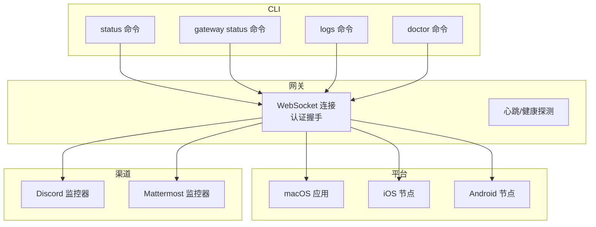
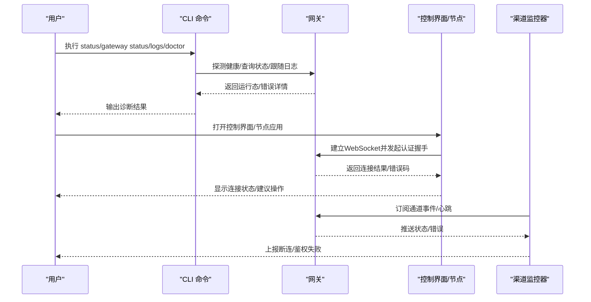
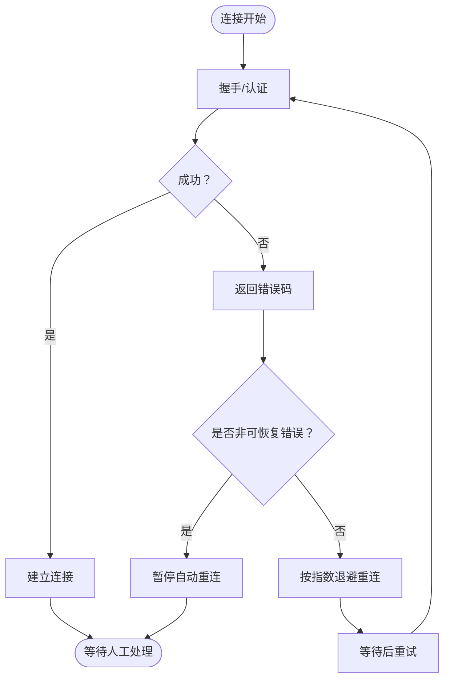
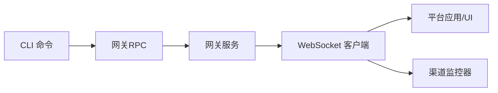

# 故障排查

<cite>
**本文引用的文件**
- [docs/help/troubleshooting.md](file://docs/help/troubleshooting.md)
- [docs/gateway/troubleshooting.md](file://docs/gateway/troubleshooting.md)
- [docs/cli/doctor.md](file://docs/cli/doctor.md)
- [docs/cli/logs.md](file://docs/cli/logs.md)
- [docs/platforms/android.md](file://docs/platforms/android.md)
- [docs/platforms/ios.md](file://docs/platforms/ios.md)
- [docs/platforms/macos.md](file://docs/platforms/macos.md)
- [docs/debug/node-issue.md](file://docs/debug/node-issue.md)
- [src/commands/doctor-gateway-health.ts](file://src/commands/doctor-gateway-health.ts)
- [src/commands/status-all.ts](file://src/commands/status-all.ts)
- [src/commands/status.command.ts](file://src/commands/status.command.ts)
- [apps/shared/OpenClawKit/Sources/OpenClawKit/GatewayErrors.swift](file://apps/shared/OpenClawKit/Sources/OpenClawKit/GatewayErrors.swift)
- [src/gateway/client.ts](file://src/gateway/client.ts)
- [ui/src/ui/gateway.ts](file://ui/src/ui/gateway.ts)
- [apps/macos/Sources/OpenClaw/GatewayEndpointStore.swift](file://apps/macos/Sources/OpenClaw/GatewayEndpointStore.swift)
- [src/commands/doctor-platform-notes.ts](file://src/commands/doctor-platform-notes.ts)
- [src/commands/doctor-sandbox.ts](file://src/commands/doctor-sandbox.ts)
- [src/security/audit-extra.sync.ts](file://src/security/audit-extra.sync.ts)
- [src/commands/doctor.warns-per-agent-sandbox-docker-browser-prune.e2e.test.ts](file://src/commands/doctor.warns-per-agent-sandbox-docker-browser-prune.e2e.test.ts)
- [src/commands/doctor-sandbox.warns-sandbox-enabled-without-docker.test.ts](file://src/commands/doctor-sandbox.warns-sandbox-enabled-without-docker.test.ts)
- [src/discord/monitor/provider.lifecycle.ts](file://src/discord/monitor/provider.lifecycle.ts)
- [extensions/mattermost/src/mattermost/monitor-websocket.ts](file://extensions/mattermost/src/mattermost/monitor-websocket.ts)
</cite>

## 目录
1. [简介](#简介)
2. [项目结构](#项目结构)
3. [核心组件](#核心组件)
4. [架构总览](#架构总览)
5. [详细组件分析](#详细组件分析)
6. [依赖关系分析](#依赖关系分析)
7. [性能考量](#性能考量)
8. [故障排查指南](#故障排查指南)
9. [结论](#结论)
10. [附录](#附录)

## 简介
本指南面向OpenClaw用户与运维人员，提供系统化的故障排查流程与方法，覆盖通道连接失败、网关不可达、会话异常、认证失败、权限不足、沙箱与Docker环境缺失、以及跨平台（macOS、iOS、Android）的特定问题。文档同时详解doctor命令的使用与输出解读，并给出调试工具、日志分析技巧与问题上报流程。

## 项目结构
OpenClaw由多语言模块组成：CLI命令、网关服务、前端控制界面、移动端节点应用（iOS/Android）、以及大量渠道插件。故障排查涉及以下关键路径：
- CLI层：status、gateway status、logs、doctor等命令
- 网关层：WebSocket连接、认证握手、心跳与健康探测
- 平台层：macOS菜单栏应用、iOS/Android节点应用
- 插件层：各渠道监控器对连接状态的观测与回退

图示来源
- [docs/help/troubleshooting.md:13-25](file://docs/help/troubleshooting.md#L13-L25)
- [docs/gateway/troubleshooting.md:14-31](file://docs/gateway/troubleshooting.md#L14-L31)

章节来源
- [docs/help/troubleshooting.md:13-25](file://docs/help/troubleshooting.md#L13-L25)
- [docs/gateway/troubleshooting.md:14-31](file://docs/gateway/troubleshooting.md#L14-L31)

## 核心组件
- doctor命令：执行健康检查、快速修复、清理过时配置与状态，支持交互式提示与非交互模式
- status/gateway status：查询网关运行态、可达性、认证方式与版本信息
- logs命令：远程跟随网关日志，支持JSON输出与本地时间戳
- 平台特定诊断：macOS launchctl环境变量覆盖、iOS/Android节点连接与配对流程
- 认证与重连策略：结构化错误码、设备令牌重试预算、非可恢复错误暂停重连

章节来源
- [docs/cli/doctor.md:18-34](file://docs/cli/doctor.md#L18-L34)
- [docs/cli/logs.md:9-29](file://docs/cli/logs.md#L9-L29)
- [src/commands/status.command.ts:256-286](file://src/commands/status.command.ts#L256-L286)
- [src/commands/status-all.ts:170-202](file://src/commands/status-all.ts#L170-L202)
- [apps/shared/OpenClawKit/Sources/OpenClawKit/GatewayErrors.swift:31-115](file://apps/shared/OpenClawKit/Sources/OpenClawKit/GatewayErrors.swift#L31-L115)

## 架构总览
下图展示从CLI到网关、再到各平台与渠道的端到端连接链路及关键断点：

图示来源
- [docs/help/troubleshooting.md:13-25](file://docs/help/troubleshooting.md#L13-L25)
- [docs/gateway/troubleshooting.md:14-31](file://docs/gateway/troubleshooting.md#L14-L31)
- [ui/src/ui/gateway.ts:169-211](file://ui/src/ui/gateway.ts#L169-L211)
- [src/gateway/client.ts:401-444](file://src/gateway/client.ts#L401-L444)

## 详细组件分析

### doctor命令：健康检查与快速修复
- 功能要点
  - 配置完整性检查：删除未知键、扫描遗留任务计划、检测会话目录孤儿转录文件并归档
  - 网关内存搜索就绪检查：探测embedding可用性并给出模型配置建议
  - 沙箱模式检查：当启用但Docker不可用时发出高信号警告并建议关闭或安装Docker
  - 平台提示：macOS launchctl环境变量覆盖导致的“未授权”问题
- 使用建议
  - 常规：openclaw doctor
  - 交互修复：openclaw doctor --repair 或 --fix
  - 深度检查：openclaw doctor --deep
- 输出解读
  - 高优先级警告：如“Docker不可用且沙箱开启”，需先安装Docker或关闭沙箱
  - 配置清理：列出被移除的未知键，便于定位升级后遗留项
  - 内存搜索：缺失嵌入凭据时建议执行configure --section model

章节来源
- [docs/cli/doctor.md:18-34](file://docs/cli/doctor.md#L18-L34)
- [src/commands/doctor-gateway-health.ts:67-92](file://src/commands/doctor-gateway-health.ts#L67-L92)
- [src/commands/doctor-platform-notes.ts:75-105](file://src/commands/doctor-platform-notes.ts#L75-L105)
- [src/commands/doctor-sandbox.ts:147-160](file://src/commands/doctor-sandbox.ts#L147-L160)

### 网关连接与认证：错误码与重连策略
- 结构化错误
  - GatewayConnectAuthError：包含detailCode、recommendedNextStep、是否可重试设备令牌
  - GatewayResponseError：响应式错误，携带method/code/message/details
- 重连策略
  - 对于非可恢复错误（如令牌缺失、配对要求、速率限制、设备身份缺失），客户端暂停自动重连，等待人工干预
  - 对于令牌不匹配且受信任端点，允许一次设备令牌重试，消耗重试预算后停止自动重连
- 控制界面映射
  - fetch失败映射为令牌不匹配；TypeError映射为速率限制提示

图示来源
- [apps/shared/OpenClawKit/Sources/OpenClawKit/GatewayErrors.swift:31-115](file://apps/shared/OpenClawKit/Sources/OpenClawKit/GatewayErrors.swift#L31-L115)
- [src/gateway/client.ts:417-444](file://src/gateway/client.ts#L417-L444)
- [ui/src/ui/gateway.ts:188-198](file://ui/src/ui/gateway.ts#L188-L198)

章节来源
- [apps/shared/OpenClawKit/Sources/OpenClawKit/GatewayErrors.swift:31-115](file://apps/shared/OpenClawKit/Sources/OpenClawKit/GatewayErrors.swift#L31-L115)
- [src/gateway/client.ts:401-444](file://src/gateway/client.ts#L401-L444)
- [ui/src/ui/gateway.ts:169-211](file://ui/src/ui/gateway.ts#L169-L211)

### 状态与日志：诊断网关健康与通道状态
- status命令
  - 展示网关模式、目标URL、可达性、认证方式与版本信息
  - 当远程URL缺失时，提供本地回退与修复建议
- logs命令
  - 支持--follow、--json、--limit、--local-time等参数，便于工具链集成与本地时区查看
- doctor与通道健康
  - doctor在网关健康正常时进一步探测channels.status，汇总通道告警并给出修复建议

章节来源
- [src/commands/status.command.ts:256-286](file://src/commands/status.command.ts#L256-L286)
- [src/commands/status-all.ts:170-202](file://src/commands/status-all.ts#L170-L202)
- [docs/cli/logs.md:9-29](file://docs/cli/logs.md#L9-L29)
- [src/commands/doctor-gateway-health.ts:38-62](file://src/commands/doctor-gateway-health.ts#L38-L62)

### 平台特定：macOS、iOS、Android
- macOS
  - launchctl环境变量覆盖可能导致“未授权”错误；可通过getenv/unsetenv排查
  - 菜单栏应用负责权限管理、本地/远程模式切换、节点服务桥接
  - 提供独立的连接/发现调试命令，便于对比应用与CLI差异
- iOS
  - 通过Bonjour或跨网络的单播DNS-SD发现网关；手动主机端口作为回退
  - 常见错误：节点后台不可用、Canvas主机未配置、Keychain配对令牌清除后需重新配对
- Android
  - mDNS/NSD或Tailscale尾网发现；手动主机端口回退
  - 前台服务维持连接；首次配对后自动重连；Canvas/A2UI/相机/语音命令需前台运行

章节来源
- [docs/platforms/macos.md:35-49](file://docs/platforms/macos.md#L35-L49)
- [docs/platforms/macos.md:171-199](file://docs/platforms/macos.md#L171-L199)
- [apps/macos/Sources/OpenClaw/GatewayEndpointStore.swift:149-192](file://apps/macos/Sources/OpenClaw/GatewayEndpointStore.swift#L149-L192)
- [docs/platforms/ios.md:52-103](file://docs/platforms/ios.md#L52-L103)
- [docs/platforms/android.md:24-101](file://docs/platforms/android.md#L24-L101)

## 依赖关系分析
- CLI命令依赖网关RPC接口进行健康探测与状态查询
- 平台应用通过WebSocket与网关交互，遵循相同的认证与错误处理逻辑
- 渠道监控器基于各自协议实现连接与断连观测，向上游聚合状态

图示来源
- [docs/help/troubleshooting.md:13-25](file://docs/help/troubleshooting.md#L13-L25)
- [ui/src/ui/gateway.ts:169-211](file://ui/src/ui/gateway.ts#L169-L211)

章节来源
- [docs/help/troubleshooting.md:13-25](file://docs/help/troubleshooting.md#L13-L25)
- [ui/src/ui/gateway.ts:169-211](file://ui/src/ui/gateway.ts#L169-L211)

## 性能考量
- 重连退避：默认指数增长上限至约15秒，避免风暴式重试
- 健康探测超时：doctor与status对网关调用设置合理超时，减少阻塞
- 日志跟随：建议使用--json与--limit，降低带宽与解析成本

章节来源
- [ui/src/ui/gateway.ts:204-211](file://ui/src/ui/gateway.ts#L204-L211)
- [src/commands/doctor-gateway-health.ts:67-92](file://src/commands/doctor-gateway-health.ts#L67-L92)
- [docs/cli/logs.md:17-29](file://docs/cli/logs.md#L17-L29)

## 故障排查指南

### 通用诊断流程（症状优先）
- 快速三分钟梯子
  - openclaw status → openclaw status --all → openclaw gateway probe → openclaw gateway status → openclaw doctor → openclaw channels status --probe → openclaw logs --follow
- 健康预期
  - gateway status显示“运行中”与“RPC探测：ok”
  - doctor无阻塞性配置/服务问题
  - channels status --probe显示通道“已连接/就绪”
  - logs稳定活动，无重复致命错误

章节来源
- [docs/help/troubleshooting.md:13-36](file://docs/help/troubleshooting.md#L13-L36)

### 常见故障模式与处置

#### 1) 通道连接失败
- 症状
  - channels status --probe显示“未连接/异常”
  - 日志出现“提及必需”“待配对”“缺少作用域/禁止/401/403”
- 处置
  - 检查配对状态与允许列表；确认组内提及规则
  - 为发送方批准配对请求；修正渠道权限/作用域
  - 参考：No replies、Channel connected messages not flowing

章节来源
- [docs/gateway/troubleshooting.md:61-90](file://docs/gateway/troubleshooting.md#L61-L90)
- [docs/gateway/troubleshooting.md:182-212](file://docs/gateway/troubleshooting.md#L182-L212)

#### 2) 网关不可达
- 症状
  - gateway status显示“未运行”或“RPC探测：失败”
  - logs出现绑定冲突、启动被阻止、端口占用
- 处置
  - 设置gateway.mode=local或配置gateway.auth.token/password
  - 解决端口冲突或改为loopback绑定
  - 参考：Gateway service not running

章节来源
- [docs/gateway/troubleshooting.md:152-181](file://docs/gateway/troubleshooting.md#L152-L181)

#### 3) 会话异常
- 症状
  - 会话锁文件异常、转录文件孤儿、心跳/定时任务未触发
- 处置
  - doctor自动归档孤儿转录文件并释放空间
  - 检查cron/heartbeat配置与运行窗口
  - 参考：Cron and heartbeat delivery

章节来源
- [docs/cli/doctor.md:29-32](file://docs/cli/doctor.md#L29-L32)
- [docs/gateway/troubleshooting.md:213-244](file://docs/gateway/troubleshooting.md#L213-L244)

#### 4) 认证失败与令牌漂移
- 症状
  - “AUTH_TOKEN_MISMATCH”“AUTH_DEVICE_TOKEN_MISMATCH”
  - 设备身份/签名错误、nonce不匹配、重复“未授权”
- 处置
  - 允许一次可信设备令牌重试；仍失败则执行令牌漂移恢复清单
  - 更新共享令牌/设备令牌并重新批准
  - 参考：Dashboard control ui connectivity

章节来源
- [docs/gateway/troubleshooting.md:91-120](file://docs/gateway/troubleshooting.md#L91-L120)
- [src/gateway/client.ts:417-444](file://src/gateway/client.ts#L417-L444)
- [ui/src/ui/gateway.ts:188-198](file://ui/src/ui/gateway.ts#L188-L198)

#### 5) 权限不足
- 症状
  - 节点工具执行被拒、系统运行被拒绝、权限缺失
- 处置
  - 在macOS应用中配置exec approvals；确保节点前台运行
  - 浏览器工具：检查可执行路径、CDP目标可达性、扩展中继标签页
  - 参考：Node paired tool fails、Browser tool fails

章节来源
- [docs/gateway/troubleshooting.md:245-275](file://docs/gateway/troubleshooting.md#L245-L275)
- [docs/gateway/troubleshooting.md:276-306](file://docs/gateway/troubleshooting.md#L276-L306)

#### 6) 升级后功能异常
- 症状
  - URL/认证覆盖行为变化、严格绑定与认证守卫、配对/设备身份状态变更
- 处置
  - 检查gateway.mode、gateway.remote.url、gateway.auth.mode
  - 重新安装服务元数据以同步配置与运行态
  - 参考：If you upgraded and something suddenly broke

章节来源
- [docs/gateway/troubleshooting.md:307-380](file://docs/gateway/troubleshooting.md#L307-L380)

### doctor命令使用与输出解读
- 基本用法
  - openclaw doctor：基础健康检查
  - openclaw doctor --repair/--fix：写备份并清理未知键
  - openclaw doctor --deep：深度检查
- 输出关注点
  - 配置清理：未知键移除列表
  - 内存搜索：embedding可用性与模型配置建议
  - 沙箱：Docker不可用警告与修复建议
  - 平台：macOS launchctl环境变量覆盖提示

章节来源
- [docs/cli/doctor.md:18-46](file://docs/cli/doctor.md#L18-L46)
- [src/commands/doctor-gateway-health.ts:67-92](file://src/commands/doctor-gateway-health.ts#L67-L92)
- [src/commands/doctor-platform-notes.ts:75-105](file://src/commands/doctor-platform-notes.ts#L75-L105)

### 跨平台特定排查

#### macOS
- launchctl环境变量覆盖
  - 症状：持续“未授权”
  - 处置：检查并unset OPENCLAW_GATEWAY_TOKEN/PASSWORD
- 菜单栏应用
  - 权限管理、本地/远程模式、节点服务桥接
  - 使用独立连接/发现调试命令对比差异

章节来源
- [docs/cli/doctor.md:35-46](file://docs/cli/doctor.md#L35-L46)
- [apps/macos/Sources/OpenClaw/GatewayEndpointStore.swift:149-192](file://apps/macos/Sources/OpenClaw/GatewayEndpointStore.swift#L149-L192)
- [docs/platforms/macos.md:35-49](file://docs/platforms/macos.md#L35-L49)
- [docs/platforms/macos.md:171-199](file://docs/platforms/macos.md#L171-L199)

#### iOS
- 发现路径：Bonjour/LAN、单播DNS-SD跨网络、手动主机端口
- 常见错误：节点后台不可用、Canvas主机未配置、Keychain令牌清除后需重新配对

章节来源
- [docs/platforms/ios.md:52-103](file://docs/platforms/ios.md#L52-L103)

#### Android
- 发现路径：mDNS/NSD、Tailscale尾网、手动主机端口
- 前台服务维持连接；首次配对后自动重连；Canvas/A2UI/相机/语音命令需前台运行

章节来源
- [docs/platforms/android.md:24-101](file://docs/platforms/android.md#L24-L101)

### 调试工具与日志分析
- doctor
  - 健康检查、配置清理、内存搜索就绪检查、沙箱模式检查
- status/gateway status
  - 展示网关模式、目标URL、可达性、认证方式、版本信息
- logs
  - --follow/--json/--limit/--local-time，便于工具链与本地时区查看
- 日志分析技巧
  - 关注“设备身份/签名/nonce”“AUTH_TOKEN_MISMATCH/DEVICE_TOKEN_MISMATCH”“mention required/pairing/missing_scope/401/403”
  - 区分一次性fetch失败与持续TypeError（前者映射为令牌不匹配，后者映射为速率限制）

章节来源
- [docs/cli/logs.md:9-29](file://docs/cli/logs.md#L9-L29)
- [src/commands/status.command.ts:256-286](file://src/commands/status.command.ts#L256-L286)
- [ui/src/ui/app-gateway.node.test.ts:213-256](file://ui/src/ui/app-gateway.node.test.ts#L213-L256)

### 问题上报流程
- 准备信息
  - openclaw status --all（完整报告）
  - openclaw logs --follow --limit 500（最近500行）
  - doctor输出（含配置清理与沙箱警告）
  - 平台信息（macOS/Windows/Linux/Android/iOS）
- 提交渠道
  - GitHub Issues（参考仓库模板与标签）
  - 附带症状、复现步骤、环境信息与日志片段

章节来源
- [docs/help/troubleshooting.md:13-36](file://docs/help/troubleshooting.md#L13-L36)

## 结论
通过“症状优先”的诊断梯子与doctor命令的自动化检查，大多数OpenClaw故障可在短时间内定位并修复。结合平台特定排查与日志分析技巧，可有效覆盖通道连接、网关可达、认证与权限、沙箱与Docker、以及跨平台兼容性等关键领域。建议将doctor纳入日常维护流程，配合logs与status形成闭环。

## 附录

### 认证错误码速查（节选）
- AUTH_TOKEN_MISSING：客户端未发送必需的共享令牌
- AUTH_TOKEN_MISMATCH：共享令牌与网关不匹配；若可受信重试，允许一次设备令牌重试
- AUTH_DEVICE_TOKEN_MISMATCH：缓存的设备令牌过期或撤销
- PAIRING_REQUIRED：设备身份已知但未批准该角色
- DEVICE_IDENTITY_REQUIRED：缺少设备身份/安全上下文

章节来源
- [docs/gateway/troubleshooting.md:120-130](file://docs/gateway/troubleshooting.md#L120-L130)

### 沙箱与Docker安全审计要点
- Docker不可用但沙箱开启：发出高信号警告
- docker配置但mode=off：标记为忽略的冗余配置
- 危险配置：network=host、seccomp/unconfined、apparmor/unconfined、容器命名空间加入
- per-agent与shared作用域冲突：忽略被覆盖的浏览器/沙箱/清理覆盖项

章节来源
- [src/commands/doctor-sandbox.warns-sandbox-enabled-without-docker.test.ts:66-108](file://src/commands/doctor-sandbox.warns-sandbox-enabled-without-docker.test.ts#L66-L108)
- [src/commands/doctor.warns-per-agent-sandbox-docker-browser-prune.e2e.test.ts:17-46](file://src/commands/doctor.warns-per-agent-sandbox-docker-prune.e2e.test.ts#L17-L46)
- [src/security/audit-extra.sync.ts:822-926](file://src/security/audit-extra.sync.ts#L822-L926)

### Node + tsx “__name is not a function”崩溃
- 现象：Node 25.x + tsx + esbuild keepNames导致函数名辅助变量缺失
- 临时规避：使用Bun或tsc编译后运行；测试Node LTS；禁用keepNames（若可行）

章节来源
- [docs/debug/node-issue.md:11-86](file://docs/debug/node-issue.md#L11-L86)