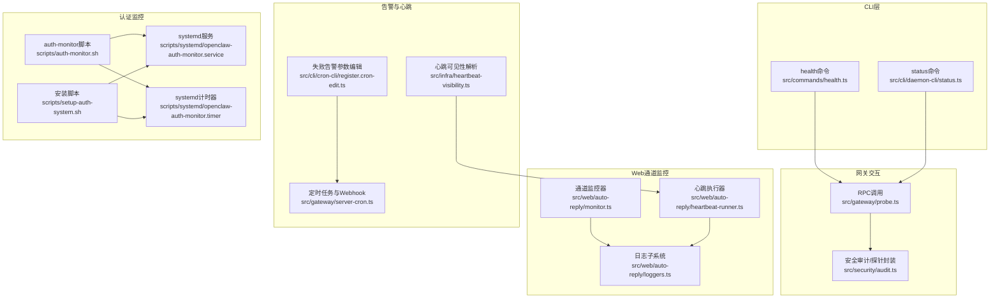
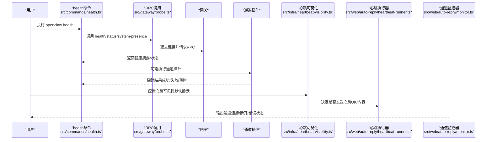
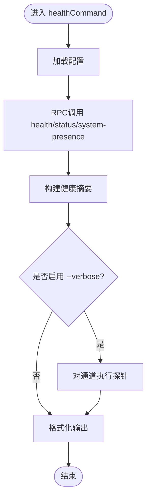
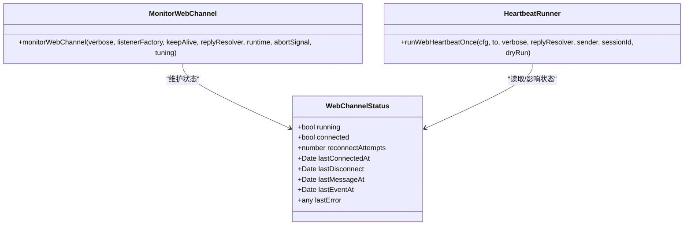
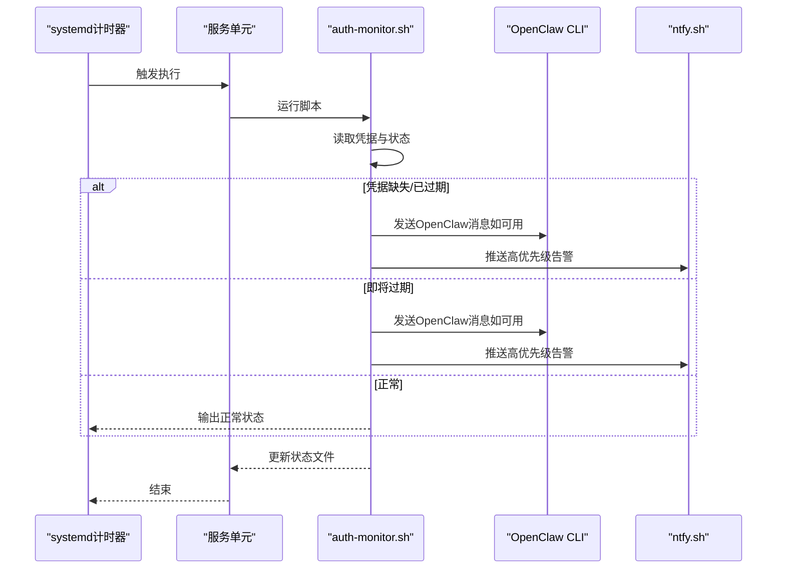
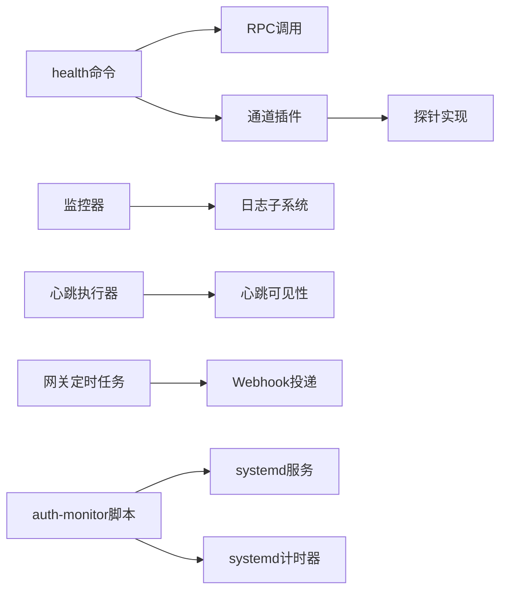

# 监控告警

<cite>
**本文引用的文件**   
- [src/commands/health.ts](file://src/commands/health.ts)
- [src/cli/daemon-cli/status.ts](file://src/cli/daemon-cli/status.ts)
- [src/gateway/probe.ts](file://src/gateway/probe.ts)
- [src/security/audit.ts](file://src/security/audit.ts)
- [src/web/auto-reply/heartbeat-runner.ts](file://src/web/auto-reply/heartbeat-runner.ts)
- [src/web/auto-reply/monitor.ts](file://src/web/auto-reply/monitor.ts)
- [src/web/auto-reply/loggers.ts](file://src/web/auto-reply/loggers.ts)
- [src/infra/heartbeat-visibility.ts](file://src/infra/heartbeat-visibility.ts)
- [src/gateway/server-cron.ts](file://src/gateway/server-cron.ts)
- [src/cli/cron-cli/register.cron-edit.ts](file://src/cli/cron-cli/register.cron-edit.ts)
- [scripts/auth-monitor.sh](file://scripts/auth-monitor.sh)
- [scripts/systemd/openclaw-auth-monitor.service](file://scripts/systemd/openclaw-auth-monitor.service)
- [scripts/systemd/openclaw-auth-monitor.timer](file://scripts/systemd/openclaw-auth-monitor.timer)
- [scripts/setup-auth-system.sh](file://scripts/setup-auth-system.sh)
- [docs/cli/health.md](file://docs/cli/health.md)
- [docs/cli/status.md](file://docs/cli/status.md)
- [docs/automation/auth-monitoring.md](file://docs/automation/auth-monitoring.md)
- [docs/gateway/heartbeat.md](file://docs/gateway/heartbeat.md)
- [src/logging.ts](file://src/logging.ts)
</cite>

## 目录
1. [简介](#简介)
2. [项目结构](#项目结构)
3. [核心组件](#核心组件)
4. [架构总览](#架构总览)
5. [详细组件分析](#详细组件分析)
6. [依赖关系分析](#依赖关系分析)
7. [性能考量](#性能考量)
8. [故障排查指南](#故障排查指南)
9. [结论](#结论)
10. [附录](#附录)

## 简介
本技术文档面向OpenClaw监控与告警体系，聚焦以下目标：
- 健康检查机制：通过RPC调用与通道探针，综合评估网关可达性、通道连接状态、会话活动等关键指标。
- 状态监控：使用openclaw status与health命令进行系统状态诊断与输出。
- 日志收集与分析：识别web-heartbeat、web-reconnect、web-auto-reply等关键日志模块与标记。
- 告警规则与通知：基于心跳可见性、失败告警配置、Webhook与渠道投递，实现阈值化与自动化通知。
- 自动化监控：systemd服务与auth-monitor脚本的安装、配置与最佳实践。

## 项目结构
围绕监控告警的关键代码分布在以下模块：
- 健康检查与状态输出：命令行入口、RPC调用、通道探针与汇总格式化。
- Web通道监控：心跳执行、重连策略、状态跟踪与日志子系统。
- 心跳可见性与告警：心跳显示策略、失败告警配置与Webhook投递。
- 认证过期监控：auth-monitor脚本、systemd单元与安装辅助脚本。
- 文档与CLI参考：health/status命令说明与heartbeat配置示例。

图表来源
- [src/commands/health.ts:1-752](file://src/commands/health.ts#L1-L752)
- [src/cli/daemon-cli/status.ts:1-21](file://src/cli/daemon-cli/status.ts#L1-L21)
- [src/gateway/probe.ts:54-101](file://src/gateway/probe.ts#L54-L101)
- [src/security/audit.ts:1057-1091](file://src/security/audit.ts#L1057-L1091)
- [src/web/auto-reply/heartbeat-runner.ts:29-76](file://src/web/auto-reply/heartbeat-runner.ts#L29-L76)
- [src/web/auto-reply/monitor.ts:40-69](file://src/web/auto-reply/monitor.ts#L40-L69)
- [src/web/auto-reply/loggers.ts:1-7](file://src/web/auto-reply/loggers.ts#L1-L7)
- [src/infra/heartbeat-visibility.ts:1-73](file://src/infra/heartbeat-visibility.ts#L1-L73)
- [src/gateway/server-cron.ts:33-92](file://src/gateway/server-cron.ts#L33-L92)
- [src/cli/cron-cli/register.cron-edit.ts:301-335](file://src/cli/cron-cli/register.cron-edit.ts#L301-L335)
- [scripts/auth-monitor.sh:1-90](file://scripts/auth-monitor.sh#L1-L90)
- [scripts/systemd/openclaw-auth-monitor.service:1-14](file://scripts/systemd/openclaw-auth-monitor.service#L1-L14)
- [scripts/systemd/openclaw-auth-monitor.timer:1-200](file://scripts/systemd/openclaw-auth-monitor.timer#L1-L200)
- [scripts/setup-auth-system.sh:49-82](file://scripts/setup-auth-system.sh#L49-L82)

章节来源
- [src/commands/health.ts:1-752](file://src/commands/health.ts#L1-L752)
- [src/cli/daemon-cli/status.ts:1-21](file://src/cli/daemon-cli/status.ts#L1-L21)
- [src/gateway/probe.ts:54-101](file://src/gateway/probe.ts#L54-L101)
- [src/security/audit.ts:1057-1091](file://src/security/audit.ts#L1057-L1091)
- [src/web/auto-reply/heartbeat-runner.ts:29-76](file://src/web/auto-reply/heartbeat-runner.ts#L29-L76)
- [src/web/auto-reply/monitor.ts:40-69](file://src/web/auto-reply/monitor.ts#L40-L69)
- [src/web/auto-reply/loggers.ts:1-7](file://src/web/auto-reply/loggers.ts#L1-L7)
- [src/infra/heartbeat-visibility.ts:1-73](file://src/infra/heartbeat-visibility.ts#L1-L73)
- [src/gateway/server-cron.ts:33-92](file://src/gateway/server-cron.ts#L33-L92)
- [src/cli/cron-cli/register.cron-edit.ts:301-335](file://src/cli/cron-cli/register.cron-edit.ts#L301-L335)
- [scripts/auth-monitor.sh:1-90](file://scripts/auth-monitor.sh#L1-L90)
- [scripts/systemd/openclaw-auth-monitor.service:1-14](file://scripts/systemd/openclaw-auth-monitor.service#L1-L14)
- [scripts/systemd/openclaw-auth-monitor.timer:1-200](file://scripts/systemd/openclaw-auth-monitor.timer#L1-L200)
- [scripts/setup-auth-system.sh:49-82](file://scripts/setup-auth-system.sh#L49-L82)

## 核心组件
- 健康检查命令（openclaw health）
  - 通过RPC调用网关health端点，聚合通道探针结果与会话信息，支持JSON与详细模式输出。
  - 关键路径：命令入口、RPC调用、通道探针、汇总格式化与输出。
- 状态命令（openclaw status）
  - 聚合节点与网关状态、最近会话、可选深度探针，用于快速诊断与调试。
- Web通道监控
  - 心跳执行器：周期性发送“心跳OK”或内容消息，支持静默/显式可见性控制。
  - 监控器：跟踪连接状态、断开事件、错误与重连策略，维护通道状态快照。
  - 日志子系统：以子系统命名空间区分inbound/outbound/heartbeat等模块。
- 告警与心跳可见性
  - 解析心跳可见性优先级：账户级 > 通道级 > 通道默认 > 全局默认；默认静默显示。
  - 失败告警：支持最小冷却时间、目标渠道、投递模式（公告/HTTP Webhook）、账户ID覆盖。
- 认证过期监控
  - auth-monitor脚本：检测OAuth到期风险并发送通知（OpenClaw消息或ntfy推送），带防刷节流。
  - systemd单元：服务模板与用户计时器，配合安装脚本完成部署。

章节来源
- [src/commands/health.ts:525-751](file://src/commands/health.ts#L525-L751)
- [src/cli/daemon-cli/status.ts:7-20](file://src/cli/daemon-cli/status.ts#L7-L20)
- [src/web/auto-reply/heartbeat-runner.ts:29-76](file://src/web/auto-reply/heartbeat-runner.ts#L29-L76)
- [src/web/auto-reply/monitor.ts:40-69](file://src/web/auto-reply/monitor.ts#L40-L69)
- [src/web/auto-reply/loggers.ts:1-7](file://src/web/auto-reply/loggers.ts#L1-L7)
- [src/infra/heartbeat-visibility.ts:1-73](file://src/infra/heartbeat-visibility.ts#L1-L73)
- [src/gateway/server-cron.ts:33-92](file://src/gateway/server-cron.ts#L33-L92)
- [src/cli/cron-cli/register.cron-edit.ts:301-335](file://src/cli/cron-cli/register.cron-edit.ts#L301-L335)
- [scripts/auth-monitor.sh:1-90](file://scripts/auth-monitor.sh#L1-L90)
- [scripts/systemd/openclaw-auth-monitor.service:1-14](file://scripts/systemd/openclaw-auth-monitor.service#L1-L14)
- [scripts/setup-auth-system.sh:49-82](file://scripts/setup-auth-system.sh#L49-L82)

## 架构总览
下图展示从CLI到网关、通道与告警的整体流程：

图表来源
- [src/commands/health.ts:525-751](file://src/commands/health.ts#L525-L751)
- [src/gateway/probe.ts:54-101](file://src/gateway/probe.ts#L54-L101)
- [src/infra/heartbeat-visibility.ts:1-73](file://src/infra/heartbeat-visibility.ts#L1-L73)
- [src/web/auto-reply/heartbeat-runner.ts:29-76](file://src/web/auto-reply/heartbeat-runner.ts#L29-L76)
- [src/web/auto-reply/monitor.ts:40-69](file://src/web/auto-reply/monitor.ts#L40-L69)

## 详细组件分析

### 健康检查命令（openclaw health）
- 功能要点
  - 通过RPC获取health、status、system-presence与配置快照，汇总通道与会话信息。
  - 支持--verbose模式触发实时通道探针，输出多账号耗时与失败详情。
  - 输出包含代理/会话存储路径、最近会话列表与心跳间隔。
- 关键数据结构
  - HealthSummary：包含ok标志、时间戳、耗时、通道汇总、代理心跳与会话统计。
  - ChannelHealthSummary/AgentHealthSummary：按通道与代理维度聚合状态。
- 错误处理
  - 网关关闭或不可达时，输出明确提示与连接细节；通道问题不阻断整体健康判断。

图表来源
- [src/commands/health.ts:525-751](file://src/commands/health.ts#L525-L751)

章节来源
- [src/commands/health.ts:1-752](file://src/commands/health.ts#L1-L752)
- [docs/cli/health.md:1-22](file://docs/cli/health.md#L1-L22)

### 状态命令（openclaw status）
- 功能要点
  - 汇总节点与网关运行状态、最近会话、可选深度探针与SecretRef诊断。
  - 支持--all/--deep/--usage等选项，便于快速诊断与排障。
- 与健康命令的关系
  - status侧重系统与会话概览；health更强调通道可达性与探针结果。

章节来源
- [src/cli/daemon-cli/status.ts:1-21](file://src/cli/daemon-cli/status.ts#L1-L21)
- [docs/cli/status.md:1-29](file://docs/cli/status.md#L1-L29)

### 网关探针与安全审计
- 网关探针
  - 建立只读客户端，握手后并发请求health/status/system-presence/config快照，返回连接延迟、关闭原因与错误信息。
- 安全审计
  - 统一封装探针调用，处理鉴权解析与警告合并，输出深层网关探测结果。

章节来源
- [src/gateway/probe.ts:54-101](file://src/gateway/probe.ts#L54-L101)
- [src/security/audit.ts:1057-1091](file://src/security/audit.ts#L1057-L1091)

### Web通道监控与日志
- 心跳执行器
  - 生成runId与子日志器，按可见性决定是否发送“心跳OK”，支持干跑与自定义回复解析器。
- 通道监控器
  - 维护连接状态、断开事件、最后消息/事件时间、错误与重连尝试次数；提供状态发射钩子。
- 日志子系统
  - 子系统命名：gateway/channels/whatsapp，细分inbound/outbound/heartbeat，便于过滤与分析。

图表来源
- [src/web/auto-reply/monitor.ts:40-69](file://src/web/auto-reply/monitor.ts#L40-L69)
- [src/web/auto-reply/heartbeat-runner.ts:29-76](file://src/web/auto-reply/heartbeat-runner.ts#L29-L76)

章节来源
- [src/web/auto-reply/heartbeat-runner.ts:29-76](file://src/web/auto-reply/heartbeat-runner.ts#L29-L76)
- [src/web/auto-reply/monitor.ts:40-69](file://src/web/auto-reply/monitor.ts#L40-L69)
- [src/web/auto-reply/loggers.ts:1-7](file://src/web/auto-reply/loggers.ts#L1-L7)

### 心跳可见性与告警规则
- 可见性解析
  - 优先级：账户级 > 通道级 > 通道默认 > 全局默认；默认静默显示（showOk=false）。
  - 对webchat通道，仅使用通道默认配置（无每通道/每账户配置）。
- 失败告警配置
  - CLI参数：failure-alert-after、failure-alert-channel、failure-alert-to、failure-alert-cooldown、failure-alert-mode、failure-alert-accountId。
  - 网关侧：支持公告/HTTP Webhook两种投递模式，含超时与头部设置。
- 最佳实践
  - 将心跳设为“安静模式”（静默OK），仅在异常时显式提醒；为关键通道开启showAlerts与useIndicator。
  - 使用failureAlertCooldown避免重复告警风暴；选择合适的failureAlertChannel与accountId。

章节来源
- [src/infra/heartbeat-visibility.ts:1-73](file://src/infra/heartbeat-visibility.ts#L1-L73)
- [src/cli/cron-cli/register.cron-edit.ts:301-335](file://src/cli/cron-cli/register.cron-edit.ts#L301-L335)
- [src/gateway/server-cron.ts:33-92](file://src/gateway/server-cron.ts#L33-L92)
- [docs/gateway/heartbeat.md:146-207](file://docs/gateway/heartbeat.md#L146-L207)

### 认证过期监控与systemd服务
- auth-monitor脚本
  - 读取Claude凭据，计算剩余小时/分钟，超过阈值（WARN_HOURS）发出告警；支持ntfy推送与OpenClaw消息投递；带防刷节流。
- systemd单元
  - openclaw-auth-monitor.service：一次性服务，执行脚本。
  - openclaw-auth-monitor.timer：用户级计时器，按需启用。
- 安装脚本
  - setup-auth-system.sh：交互式配置ntfy/电话号码，写入环境变量，复制并启用systemd单元。

图表来源
- [scripts/auth-monitor.sh:1-90](file://scripts/auth-monitor.sh#L1-L90)
- [scripts/systemd/openclaw-auth-monitor.service:1-14](file://scripts/systemd/openclaw-auth-monitor.service#L1-L14)
- [scripts/systemd/openclaw-auth-monitor.timer:1-200](file://scripts/systemd/openclaw-auth-monitor.timer#L1-L200)
- [scripts/setup-auth-system.sh:49-82](file://scripts/setup-auth-system.sh#L49-L82)

章节来源
- [scripts/auth-monitor.sh:1-90](file://scripts/auth-monitor.sh#L1-L90)
- [scripts/systemd/openclaw-auth-monitor.service:1-14](file://scripts/systemd/openclaw-auth-monitor.service#L1-L14)
- [scripts/systemd/openclaw-auth-monitor.timer:1-200](file://scripts/systemd/openclaw-auth-monitor.timer#L1-L200)
- [scripts/setup-auth-system.sh:49-82](file://scripts/setup-auth-system.sh#L49-L82)
- [docs/automation/auth-monitoring.md:1-45](file://docs/automation/auth-monitoring.md#L1-L45)

## 依赖关系分析
- 命令层依赖网关RPC与通道插件；通道插件负责具体探针与状态构建。
- Web通道监控依赖日志子系统进行模块化记录；心跳可见性贯穿执行器与监控器。
- 告警配置通过CLI与网关侧共同生效，前者负责参数解析，后者负责投递实现。
- 认证监控独立于主业务，通过systemd计时器驱动脚本执行。

图表来源
- [src/commands/health.ts:525-751](file://src/commands/health.ts#L525-L751)
- [src/web/auto-reply/monitor.ts:40-69](file://src/web/auto-reply/monitor.ts#L40-L69)
- [src/web/auto-reply/loggers.ts:1-7](file://src/web/auto-reply/loggers.ts#L1-L7)
- [src/infra/heartbeat-visibility.ts:1-73](file://src/infra/heartbeat-visibility.ts#L1-L73)
- [src/gateway/server-cron.ts:33-92](file://src/gateway/server-cron.ts#L33-L92)
- [scripts/auth-monitor.sh:1-90](file://scripts/auth-monitor.sh#L1-L90)
- [scripts/systemd/openclaw-auth-monitor.service:1-14](file://scripts/systemd/openclaw-auth-monitor.service#L1-L14)
- [scripts/systemd/openclaw-auth-monitor.timer:1-200](file://scripts/systemd/openclaw-auth-monitor.timer#L1-L200)

章节来源
- [src/commands/health.ts:525-751](file://src/commands/health.ts#L525-L751)
- [src/web/auto-reply/monitor.ts:40-69](file://src/web/auto-reply/monitor.ts#L40-L69)
- [src/web/auto-reply/loggers.ts:1-7](file://src/web/auto-reply/loggers.ts#L1-L7)
- [src/infra/heartbeat-visibility.ts:1-73](file://src/infra/heartbeat-visibility.ts#L1-L73)
- [src/gateway/server-cron.ts:33-92](file://src/gateway/server-cron.ts#L33-L92)
- [scripts/auth-monitor.sh:1-90](file://scripts/auth-monitor.sh#L1-L90)
- [scripts/systemd/openclaw-auth-monitor.service:1-14](file://scripts/systemd/openclaw-auth-monitor.service#L1-L14)
- [scripts/systemd/openclaw-auth-monitor.timer:1-200](file://scripts/systemd/openclaw-auth-monitor.timer#L1-L200)

## 性能考量
- 健康检查默认超时与并发请求，避免单点阻塞；通道探针在--verbose模式下才执行，减少不必要的网络往返。
- Web通道监控维护状态快照与重连尝试次数，有助于快速定位持续性问题而非瞬时波动。
- 告警冷却时间与最小间隔可有效降低噪声与资源消耗。
- 认证监控脚本内置防刷节流，避免频繁通知。

## 故障排查指南
- 网关不可达
  - 使用openclaw health查看连接细节与错误；确认URL、鉴权与TLS指纹配置。
  - 参考安全审计封装的探针结果，结合close原因字段定位问题。
- 通道连接异常
  - 启用--verbose查看各账号探针耗时与失败原因；关注web-reconnect日志中的断开状态码与重连策略。
  - 对于webchat通道，检查channels.defaults.heartbeat配置是否符合预期。
- 告警未触发或过多
  - 检查心跳可见性配置（showOk/showAlerts/useIndicator）与failureAlertCooldown设置。
  - 确认告警目标渠道与账户ID覆盖是否正确。
- 认证过期告警
  - 查看auth-monitor脚本输出与状态文件；确认ntfy主题或手机号配置；验证systemd计时器是否启用。

章节来源
- [src/security/audit.ts:1057-1091](file://src/security/audit.ts#L1057-L1091)
- [src/web/auto-reply/monitor.ts:40-69](file://src/web/auto-reply/monitor.ts#L40-L69)
- [src/infra/heartbeat-visibility.ts:1-73](file://src/infra/heartbeat-visibility.ts#L1-L73)
- [src/cli/cron-cli/register.cron-edit.ts:301-335](file://src/cli/cron-cli/register.cron-edit.ts#L301-L335)
- [scripts/auth-monitor.sh:1-90](file://scripts/auth-monitor.sh#L1-L90)

## 结论
OpenClaw的监控告警体系以RPC健康检查为核心，结合通道探针、心跳可见性与失败告警配置，形成闭环的可观测性与自动化通知能力。Web通道监控与日志子系统提供了细粒度的状态追踪与问题定位手段；systemd驱动的认证监控确保关键凭据的及时续期与告警。通过合理配置心跳静默、告警冷却与投递目标，可在保证稳定性的同时最大化运维效率。

## 附录
- CLI参考
  - openclaw health：参见[docs/cli/health.md:1-22](file://docs/cli/health.md#L1-L22)
  - openclaw status：参见[docs/cli/status.md:1-29](file://docs/cli/status.md#L1-L29)
- 心跳配置示例
  - 参见[docs/gateway/heartbeat.md:146-207](file://docs/gateway/heartbeat.md#L146-L207)
- 认证监控说明
  - 参见[docs/automation/auth-monitoring.md:1-45](file://docs/automation/auth-monitoring.md#L1-L45)
- 日志子系统
  - 参见[src/logging.ts:1-70](file://src/logging.ts#L1-L70)