# 运维策略

<cite>
**本文引用的文件**
- [README.md](file://README.md)
- [Dockerfile](file://Dockerfile)
- [docker-compose.yml](file://docker-compose.yml)
- [fly.toml](file://fly.toml)
- [render.yaml](file://render.yaml)
- [openclaw-auth-monitor.service](file://scripts/systemd/openclaw-auth-monitor.service)
- [openclaw-auth-monitor.timer](file://scripts/systemd/openclaw-auth-monitor.timer)
- [auth-monitor.sh](file://scripts/auth-monitor.sh)
- [logging.md](file://docs/logging.md)
- [gateway/logging.md](file://docs/gateway/logging.md)
- [health.md](file://docs/gateway/health.md)
- [gateway/health.md](file://docs/gateway/health.md)
- [cli/health.md](file://docs/cli/health.md)
- [gateway/heartbeat.md](file://docs/gateway/heartbeat.md)
- [gateway/doctor.md](file://docs/gateway/doctor.md)
- [gateway/configuration.md](file://docs/gateway/configuration.md)
- [gateway/configuration-reference.md](file://docs/gateway/configuration-reference.md)
- [install/docker.md](file://docs/install/docker.md)
- [install/updating.md](file://docs/install/updating.md)
- [install/development-channels.md](file://docs/install/development-channels.md)
- [gateway/remote.md](file://docs/gateway/remote.md)
- [gateway/tailscale.md](file://docs/gateway/tailscale.md)
- [gateway/security.md](file://docs/gateway/security.md)
- [gateway/pairing.md](file://docs/gateway/pairing.md)
- [gateway/discovery.md](file://docs/gateway/discovery.md)
- [gateway/bonjour.md](file://docs/gateway/bonjour.md)
- [gateway/background-process.md](file://docs/gateway/background-process.md)
- [gateway/gateway-lock.md](file://docs/gateway/gateway-lock.md)
- [gateway/multiple-gateways.md](file://docs/gateway/multiple-gateways.md)
- [gateway/network-model.md](file://docs/gateway/network-model.md)
- [gateway/protocol.md](file://docs/gateway/protocol.md)
- [gateway/bridge-protocol.md](file://docs/gateway/bridge-protocol.md)
- [gateway/openai-http-api.md](file://docs/gateway/openai-http-api.md)
- [gateway/openresponses-http-api.md](file://docs/gateway/openresponses-http-api.md)
- [gateway/tools-invoke-http-api.md](file://docs/gateway/tools-invoke-http-api.md)
- [gateway/sandboxing.md](file://docs/gateway/sandboxing.md)
- [gateway/sandbox-vs-tool-policy-vs-elevated.md](file://docs/gateway/sandbox-vs-tool-policy-vs-elevated.md)
- [gateway/secrets.md](file://docs/gateway/secrets.md)
- [gateway/secrets-plan-contract.md](file://docs/gateway/secrets-plan-contract.md)
- [gateway/troubleshooting.md](file://docs/gateway/troubleshooting.md)
- [gateway/index.md](file://docs/gateway/index.md)
- [gateway/remote-gateway-readme.md](file://docs/gateway/remote-gateway-readme.md)
- [gateway/locking-down.md](file://docs/gateway/locking-down.md)
- [gateway/lock.md](file://docs/gateway/lock.md)
- [gateway/daemon.md](file://docs/gateway/daemon.md)
- [gateway/cli-backends.md](file://docs/gateway/cli-backends.md)
- [gateway/authentication.md](file://docs/gateway/authentication.md)
- [gateway/trusted-proxy-auth.md](file://docs/gateway/trusted-proxy-auth.md)
- [gateway/heartbeat.md](file://docs/gateway/heartbeat.md)
- [gateway/doctor.md](file://docs/gateway/doctor.md)
- [gateway/monitoring.md](file://docs/gateway/monitoring.md)
- [gateway/monitoring.md](file://docs/gateway/monitoring.md)
- [gateway/monitoring.md](file://docs/gateway/monitoring.md)
- [gateway/monitoring.md](file://docs/gateway/monitoring.md)
- [gateway/monitoring.md](file://docs/gateway/monitoring.md)
- [gateway/monitoring.md](file://docs/gateway/monitoring.md)
- [gateway/monitoring.md](file://docs/gateway/monitoring.md)
- [gateway/monitoring.md](file://docs/gateway/monitoring.md)
- [gateway/monitoring.md](file://docs/gateway/monitoring.md)
- [gateway/monitoring.md](file://docs/gateway/monitoring.md)
- [gateway/monitoring.md](file://docs/gateway/monitoring.md)
- [gateway/monitoring.md](file://docs/gateway/monitoring.md)
- [gateway/monitoring.md](file://docs/gateway/monitoring.md)
- [gateway/monitoring.md](file://docs/gateway/monitoring.md)
- [gateway/monitoring.md](file://docs/gateway/monitoring.md)
- [gateway/monitoring.md](file://docs/gateway/monitoring.md)
- [gateway/monitoring.md](file://docs/gateway/monitoring.md)
- [gateway/monitoring.md](file://docs/gateway/monitoring.md)
- [gateway/monitoring.md](file://docs/gateway/monitoring.md)
- [gateway/monitoring.md](file://docs/gateway/monitoring.md)
- [gateway/monitoring.md](file://docs/gateway/monitoring.md)
- [gateway/monitoring.md](file://docs/gateway/monitoring.md)
- [gateway/monitoring.md](file://docs/gateway/monitoring.md)
- [gateway/monitoring.md](file://docs/gateway/monitoring.md)
- [gateway/monitoring.md](file://docs/gateway/monitoring.md)
- [gateway/monitoring.md](file://docs/gateway/monitoring.md)
- [gateway/monitoring.md](file://docs/gateway/monitoring.md)
- [gateway/monitoring.md](file://docs/gateway/monitoring.md)
- [......](file://docs/gateway/monitoring.md)
</cite>

## 目录
1. [简介](#简介)
2. [项目结构](#项目结构)
3. [核心组件](#核心组件)
4. [架构总览](#架构总览)
5. [详细组件分析](#详细组件分析)
6. [依赖关系分析](#依赖关系分析)
7. [性能考量](#性能考量)
8. [故障排查指南](#故障排查指南)
9. [结论](#结论)
10. [附录](#附录)

## 简介
本指南面向OpenClaw的运维与平台工程团队，系统化梳理从单机到多节点、从本地到云厂商的全栈运维策略。内容覆盖监控告警、日志管理、故障排查、备份恢复、健康检查、性能监控、错误追踪、灾难恢复、升级策略、容量规划与高可用架构等关键主题，并结合仓库中的Dockerfile、docker-compose、Fly.io与Render部署配置以及systemd定时任务脚本，给出可落地的自动化方案与最佳实践。

## 项目结构
OpenClaw采用“网关控制面 + 多通道接入 + 工具与技能生态”的分层架构。运维侧的关键落点包括：
- 容器镜像与编排：Dockerfile、docker-compose、Fly.io与Render配置
- 系统服务与守护进程：systemd服务与定时器
- 文档化的运维与诊断：健康检查、日志、故障排查、安全加固等
- 配置与运行时：环境变量、绑定模式、认证与授权、沙箱隔离

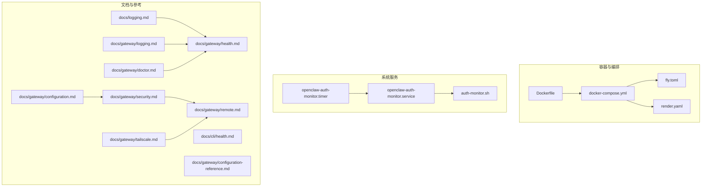

图示来源
- [Dockerfile:1-231](file://Dockerfile#L1-L231)
- [docker-compose.yml:1-77](file://docker-compose.yml#L1-L77)
- [fly.toml:1-35](file://fly.toml#L1-L35)
- [render.yaml:1-22](file://render.yaml#L1-L22)
- [openclaw-auth-monitor.service:1-15](file://scripts/systemd/openclaw-auth-monitor.service#L1-L15)
- [openclaw-auth-monitor.timer:1-11](file://scripts/systemd/openclaw-auth-monitor.timer#L1-L11)
- [auth-monitor.sh:1-90](file://scripts/auth-monitor.sh#L1-L90)
- [docs/logging.md](file://docs/logging.md)
- [docs/gateway/logging.md](file://docs/gateway/logging.md)
- [docs/gateway/health.md](file://docs/gateway/health.md)
- [docs/cli/health.md](file://docs/cli/health.md)
- [docs/gateway/configuration.md](file://docs/gateway/configuration.md)
- [docs/gateway/configuration-reference.md](file://docs/gateway/configuration-reference.md)
- [docs/gateway/security.md](file://docs/gateway/security.md)
- [docs/gateway/remote.md](file://docs/gateway/remote.md)
- [docs/gateway/tailscale.md](file://docs/gateway/tailscale.md)
- [docs/gateway/doctor.md](file://docs/gateway/doctor.md)

章节来源
- [README.md:1-560](file://README.md#L1-L560)
- [Dockerfile:1-231](file://Dockerfile#L1-L231)
- [docker-compose.yml:1-77](file://docker-compose.yml#L1-L77)
- [fly.toml:1-35](file://fly.toml#L1-L35)
- [render.yaml:1-22](file://render.yaml#L1-L22)

## 核心组件
- 网关（Gateway）：WebSocket控制平面，承载会话、通道、事件与工具调用；提供健康检查端点与探针。
- 容器镜像与运行时：基于Node 22的最小化镜像，支持可选安装浏览器与Docker CLI以启用沙箱。
- 编排与部署：docker-compose用于本地/私有部署；Fly.io与Render用于云厂商托管。
- 系统服务：systemd服务与定时器负责认证过期监控与通知。
- 文档化运维：健康检查、日志、安全、远程访问、故障排查等文档作为运维手册。

章节来源
- [README.md:180-239](file://README.md#L180-L239)
- [Dockerfile:224-231](file://Dockerfile#L224-L231)
- [docker-compose.yml:23-37](file://docker-compose.yml#L23-L37)
- [fly.toml:17-26](file://fly.toml#L17-L26)
- [render.yaml:1-22](file://render.yaml#L1-L22)
- [openclaw-auth-monitor.service:1-15](file://scripts/systemd/openclaw-auth-monitor.service#L1-L15)
- [openclaw-auth-monitor.timer:1-11](file://scripts/systemd/openclaw-auth-monitor.timer#L1-L11)
- [auth-monitor.sh:1-90](file://scripts/auth-monitor.sh#L1-L90)

## 架构总览
下图展示OpenClaw在容器与云厂商环境中的典型部署形态，以及系统服务对认证状态的监控与告警闭环。

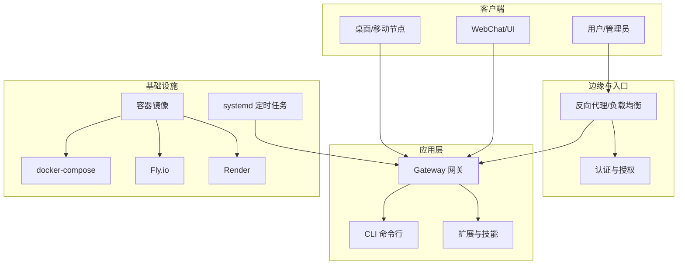

图示来源
- [Dockerfile:1-231](file://Dockerfile#L1-L231)
- [docker-compose.yml:1-77](file://docker-compose.yml#L1-L77)
- [fly.toml:1-35](file://fly.toml#L1-L35)
- [render.yaml:1-22](file://render.yaml#L1-L22)
- [openclaw-auth-monitor.service:1-15](file://scripts/systemd/openclaw-auth-monitor.service#L1-L15)
- [openclaw-auth-monitor.timer:1-11](file://scripts/systemd/openclaw-auth-monitor.timer#L1-L11)

## 详细组件分析

### 监控与健康检查
- 探针端点：容器内置健康检查端点用于存活与就绪判断，适合Kubernetes或云厂商健康检查。
- 健康检查文档：提供CLI与网关层面的健康检查命令与指标解读。
- 心跳机制：心跳与后台进程文档定义了网关的心跳行为与守护策略。
- 医生诊断：doctor命令用于迁移、配置与运行时问题的诊断。

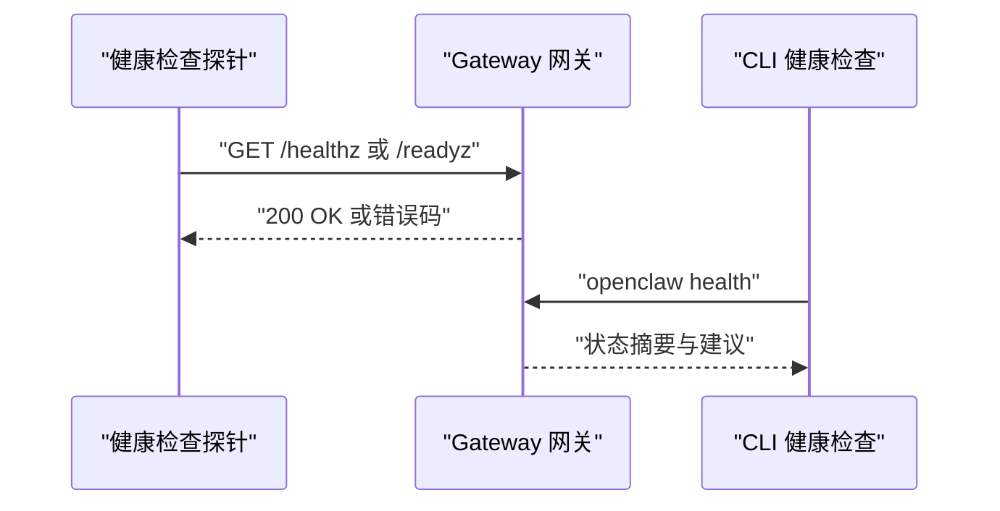

图示来源
- [Dockerfile:224-231](file://Dockerfile#L224-L231)
- [docs/gateway/health.md](file://docs/gateway/health.md)
- [docs/cli/health.md](file://docs/cli/health.md)
- [docs/gateway/heartbeat.md](file://docs/gateway/heartbeat.md)
- [docs/gateway/doctor.md](file://docs/gateway/doctor.md)

章节来源
- [Dockerfile:224-231](file://Dockerfile#L224-L231)
- [docs/gateway/health.md](file://docs/gateway/health.md)
- [docs/cli/health.md](file://docs/cli/health.md)
- [docs/gateway/heartbeat.md](file://docs/gateway/heartbeat.md)
- [docs/gateway/doctor.md](file://docs/gateway/doctor.md)

### 日志管理
- 日志文档：集中说明日志采集、格式、级别与输出位置。
- 网关日志：网关层面的日志配置与输出策略。
- 结合容器编排：通过卷挂载与环境变量统一日志路径，便于外部日志收集系统采集。

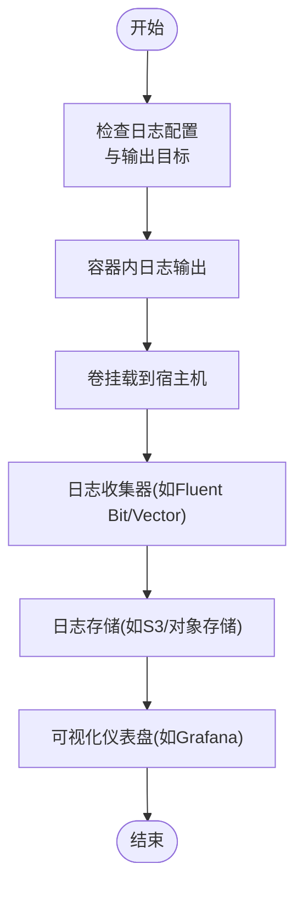

图示来源
- [docs/logging.md](file://docs/logging.md)
- [docs/gateway/logging.md](file://docs/gateway/logging.md)
- [docker-compose.yml:12-14](file://docker-compose.yml#L12-L14)

章节来源
- [docs/logging.md](file://docs/logging.md)
- [docs/gateway/logging.md](file://docs/gateway/logging.md)
- [docker-compose.yml:12-14](file://docker-compose.yml#L12-L14)

### 故障排查
- 故障排查文档：覆盖常见问题定位流程与修复建议。
- 安全与权限：安全指南、远程访问与认证加固、沙箱与工具策略。
- 远程访问：SSH隧道与Tailscale Serve/Funnel的安全暴露方式。
- 医生命令：doctor用于迁移、配置校验与运行时诊断。

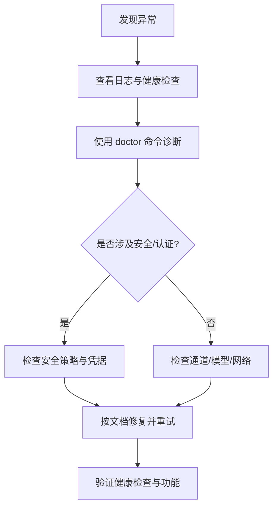

图示来源
- [docs/gateway/troubleshooting.md](file://docs/gateway/troubleshooting.md)
- [docs/gateway/security.md](file://docs/gateway/security.md)
- [docs/gateway/remote.md](file://docs/gateway/remote.md)
- [docs/gateway/tailscale.md](file://docs/gateway/tailscale.md)
- [docs/gateway/doctor.md](file://docs/gateway/doctor.md)

章节来源
- [docs/gateway/troubleshooting.md](file://docs/gateway/troubleshooting.md)
- [docs/gateway/security.md](file://docs/gateway/security.md)
- [docs/gateway/remote.md](file://docs/gateway/remote.md)
- [docs/gateway/tailscale.md](file://docs/gateway/tailscale.md)
- [docs/gateway/doctor.md](file://docs/gateway/doctor.md)

### 备份与恢复
- 状态目录与工作空间：通过环境变量与卷挂载持久化状态与工作空间。
- 数据卷与云厂商磁盘：Fly.io与Render均提供持久化磁盘挂载。
- 恢复策略：停止服务 -> 恢复卷/镜像 -> 启动服务 -> 验证健康检查。

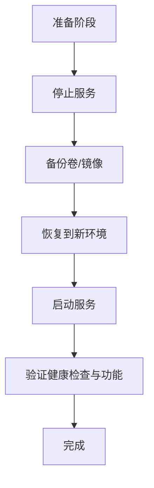

图示来源
- [fly.toml:32-35](file://fly.toml#L32-L35)
- [render.yaml:18-22](file://render.yaml#L18-L22)
- [docker-compose.yml:12-14](file://docker-compose.yml#L12-L14)

章节来源
- [fly.toml:32-35](file://fly.toml#L32-L35)
- [render.yaml:18-22](file://render.yaml#L18-L22)
- [docker-compose.yml:12-14](file://docker-compose.yml#L12-L14)

### 升级与版本管理
- 开发通道：稳定/测试/开发通道切换与更新流程。
- 更新指南：升级步骤与升级后自检。
- 版本与构建：Dockerfile中固定基础镜像摘要以确保可重复构建。

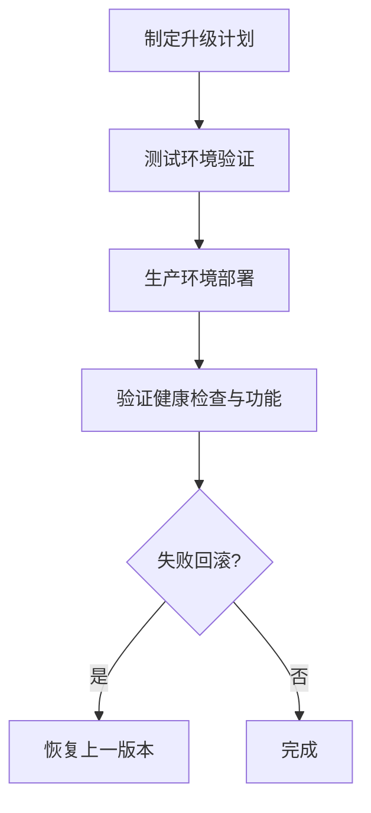

图示来源
- [docs/install/updating.md](file://docs/install/updating.md)
- [docs/install/development-channels.md](file://docs/install/development-channels.md)
- [Dockerfile:17-25](file://Dockerfile#L17-L25)

章节来源
- [docs/install/updating.md](file://docs/install/updating.md)
- [docs/install/development-channels.md](file://docs/install/development-channels.md)
- [Dockerfile:17-25](file://Dockerfile#L17-L25)

### 容灾与高可用
- 多网关与网络模型：多网关与网络模型文档描述跨节点与跨区域部署思路。
- 负载均衡与入口：反向代理/负载均衡器前置，配合健康检查与故障转移。
- 远程网关与节点：远程网关与设备节点分离执行，提升可用性与安全性。

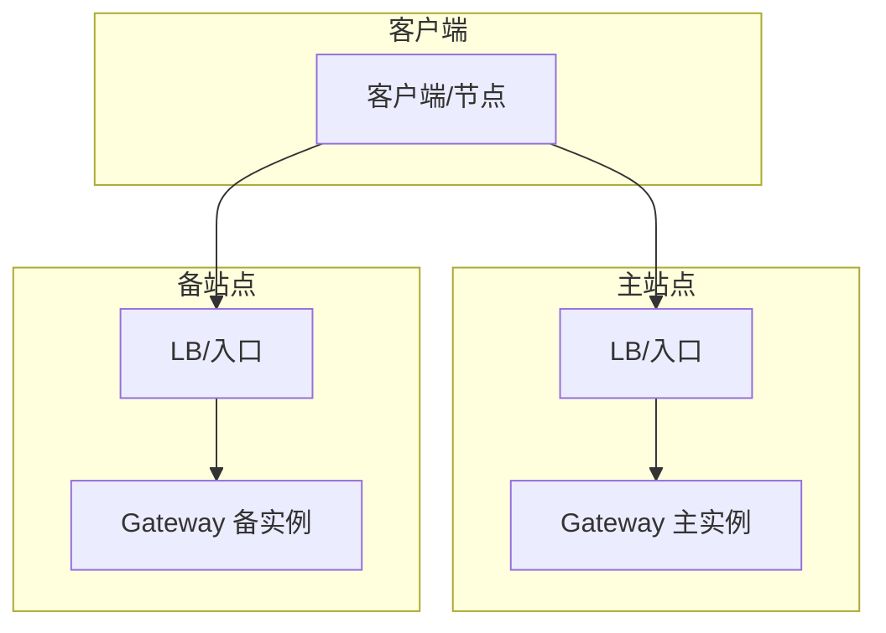

图示来源
- [docs/gateway/multiple-gateways.md](file://docs/gateway/multiple-gateways.md)
- [docs/gateway/network-model.md](file://docs/gateway/network-model.md)
- [docs/gateway/remote.md](file://docs/gateway/remote.md)

章节来源
- [docs/gateway/multiple-gateways.md](file://docs/gateway/multiple-gateways.md)
- [docs/gateway/network-model.md](file://docs/gateway/network-model.md)
- [docs/gateway/remote.md](file://docs/gateway/remote.md)

### 认证过期监控与自动化
- systemd服务与定时器：每30分钟检查一次认证状态，支持短信与ntfy推送。
- 环境变量：可通过环境变量配置告警阈值、通知渠道与优先级。
- 状态文件：避免频繁重复告警，限制最小间隔。

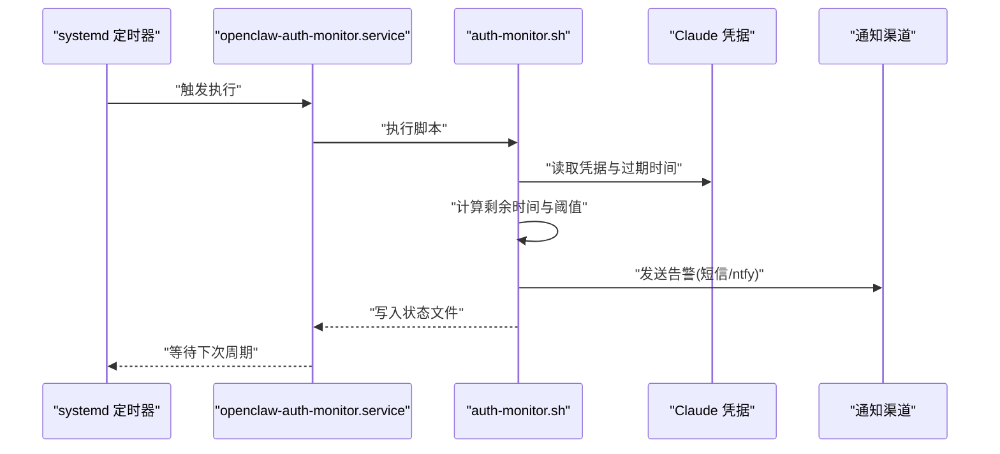

图示来源
- [openclaw-auth-monitor.service:1-15](file://scripts/systemd/openclaw-auth-monitor.service#L1-L15)
- [openclaw-auth-monitor.timer:1-11](file://scripts/systemd/openclaw-auth-monitor.timer#L1-L11)
- [auth-monitor.sh:1-90](file://scripts/auth-monitor.sh#L1-L90)

章节来源
- [openclaw-auth-monitor.service:1-15](file://scripts/systemd/openclaw-auth-monitor.service#L1-L15)
- [openclaw-auth-monitor.timer:1-11](file://scripts/systemd/openclaw-auth-monitor.timer#L1-L11)
- [auth-monitor.sh:1-90](file://scripts/auth-monitor.sh#L1-L90)

### 容器化与编排
- Dockerfile：多阶段构建、最小化运行时镜像、可选安装浏览器与Docker CLI、健康检查探针。
- docker-compose：服务编排、卷挂载、环境变量、健康检查与重启策略。
- Fly.io/Render：云厂商托管配置，持久化磁盘与健康检查路径。

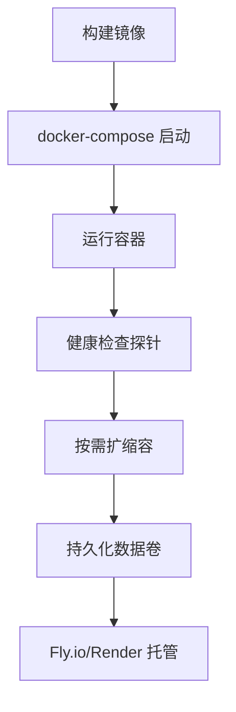

图示来源
- [Dockerfile:1-231](file://Dockerfile#L1-L231)
- [docker-compose.yml:1-77](file://docker-compose.yml#L1-L77)
- [fly.toml:1-35](file://fly.toml#L1-L35)
- [render.yaml:1-22](file://render.yaml#L1-L22)

章节来源
- [Dockerfile:1-231](file://Dockerfile#L1-L231)
- [docker-compose.yml:1-77](file://docker-compose.yml#L1-L77)
- [fly.toml:1-35](file://fly.toml#L1-L35)
- [render.yaml:1-22](file://render.yaml#L1-L22)

## 依赖关系分析
- 组件耦合：网关为核心，CLI与Web/UI通过网关交互；通道与工具通过网关路由；系统服务独立于网关但与其状态联动。
- 外部依赖：Docker CLI（沙箱）、浏览器（可选）、云厂商平台（Fly.io/Render）、通知渠道（短信/ntfy）。
- 可能的循环依赖：无直接循环；systemd服务仅读取状态与凭据，不直接依赖网关内部逻辑。

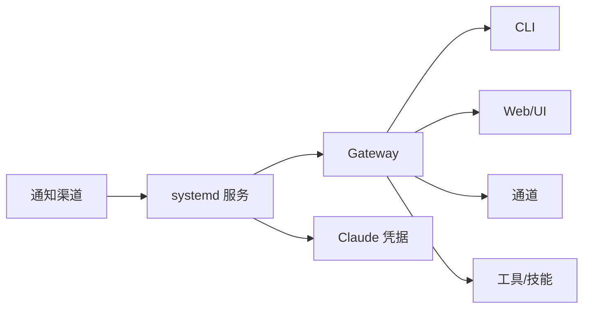

图示来源
- [README.md:180-239](file://README.md#L180-L239)
- [docker-compose.yml:1-77](file://docker-compose.yml#L1-L77)
- [auth-monitor.sh:1-90](file://scripts/auth-monitor.sh#L1-L90)

章节来源
- [README.md:180-239](file://README.md#L180-L239)
- [docker-compose.yml:1-77](file://docker-compose.yml#L1-L77)
- [auth-monitor.sh:1-90](file://scripts/auth-monitor.sh#L1-L90)

## 性能考量
- 内存与GC：Fly.io配置中设置了最大堆大小，建议根据负载调整。
- 浏览器与Playwright：预装浏览器可减少冷启动延迟，但会增加镜像体积。
- 沙箱与Docker CLI：启用沙箱需要额外资源与权限，需权衡安全与性能。
- 网络与绑定：默认绑定loopback，云厂商暴露需设置认证与安全策略。

章节来源
- [fly.toml:14-15](file://fly.toml#L14-L15)
- [Dockerfile:157-171](file://Dockerfile#L157-L171)
- [Dockerfile:173-203](file://Dockerfile#L173-L203)
- [Dockerfile:219-227](file://Dockerfile#L219-L227)

## 故障排查指南
- 健康检查失败：检查探针端点、容器日志与环境变量。
- 认证过期：使用systemd定时任务与通知渠道及时预警。
- 远程访问问题：核对SSH隧道/Tailscale配置与认证模式。
- 安全策略：检查dmPolicy、allowFrom与沙箱策略，必要时运行doctor进行迁移与校验。

章节来源
- [docs/gateway/health.md](file://docs/gateway/health.md)
- [docs/gateway/doctor.md](file://docs/gateway/doctor.md)
- [docs/gateway/security.md](file://docs/gateway/security.md)
- [docs/gateway/remote.md](file://docs/gateway/remote.md)
- [docs/gateway/tailscale.md](file://docs/gateway/tailscale.md)
- [auth-monitor.sh:1-90](file://scripts/auth-monitor.sh#L1-L90)

## 结论
通过容器化、编排与云厂商托管，结合systemd定时任务与文档化的健康检查、日志与故障排查流程，OpenClaw可实现从单机到多节点、从本地到云端的稳健运维。建议在生产环境中启用健康检查探针、持久化数据卷、安全认证与远程访问策略，并建立定期升级与演练的制度化流程。

## 附录
- 关键配置项与路径
  - 状态目录：OPENCLAW_STATE_DIR
  - 工作空间目录：OPENCLAW_WORKSPACE_DIR
  - 网关绑定：gateway.bind（默认loopback）
  - 认证令牌：OPENCLAW_GATEWAY_TOKEN
  - 模型与通道配置：参考配置文档与各通道文档
- 常用命令
  - openclaw health：健康检查
  - openclaw doctor：诊断与迁移
  - openclaw update --channel：切换通道
  - docker compose up/down：编排启停
  - fly deploy / render：云厂商部署

章节来源
- [docs/gateway/configuration.md](file://docs/gateway/configuration.md)
- [docs/gateway/configuration-reference.md](file://docs/gateway/configuration-reference.md)
- [docs/cli/health.md](file://docs/cli/health.md)
- [docs/gateway/doctor.md](file://docs/gateway/doctor.md)
- [docs/install/updating.md](file://docs/install/updating.md)
- [docker-compose.yml:28-37](file://docker-compose.yml#L28-L37)
- [fly.toml:17-18](file://fly.toml#L17-L18)
- [render.yaml:6-17](file://render.yaml#L6-L17)