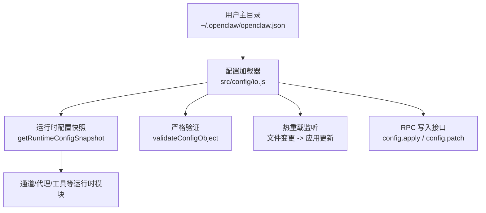
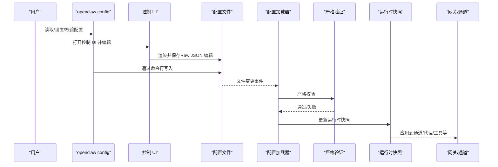
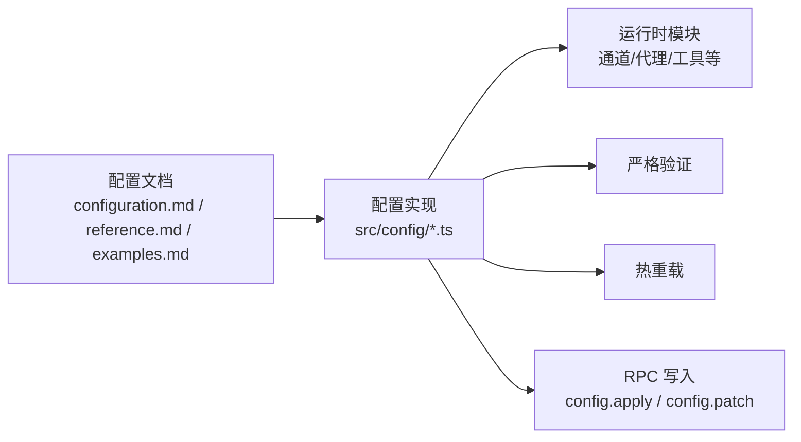

# 基础配置

<cite>
**本文引用的文件**
- [configuration.md](file://docs/gateway/configuration.md)
- [configuration-reference.md](file://docs/gateway/configuration-reference.md)
- [configuration-examples.md](file://docs/gateway/configuration-examples.md)
- [config.md](file://docs/cli/config.md)
- [wizard.md](file://docs/start/wizard.md)
- [wizard-cli-reference.md](file://docs/start/wizard-cli-reference.md)
- [config.ts](file://src/config/config.ts)
</cite>

## 目录
1. [简介](#简介)
2. [项目结构](#项目结构)
3. [核心组件](#核心组件)
4. [架构总览](#架构总览)
5. [详细组件分析](#详细组件分析)
6. [依赖关系分析](#依赖关系分析)
7. [性能考量](#性能考量)
8. [故障排查指南](#故障排查指南)
9. [结论](#结论)
10. [附录](#附录)

## 简介
本指南面向首次接触 OpenClaw 的用户，帮助你从零开始完成基础配置。内容涵盖：
- 配置文件格式与基本结构（JSON5）
- 最小化配置示例与常用字段含义
- 多种配置编辑方式：交互式向导、CLI、控制 UI、直接编辑
- 严格验证机制、配置热重载、环境变量与密钥管理
- 常见配置任务：渠道接入、模型配置、访问控制等

## 项目结构
OpenClaw 的配置入口位于用户主目录下的配置文件，系统默认读取路径为用户主目录下的特定子目录中的 JSON5 文件。配置文档与实现由“文档 + 源码”两部分共同支撑：
- 文档侧：提供配置参考、示例与操作指引
- 源码侧：提供配置加载、校验、热重载与 RPC 写入能力

图表来源
- [configuration.md:12-12](file://docs/gateway/configuration.md#L12-L12)
- [configuration.md:349-387](file://docs/gateway/configuration.md#L349-L387)
- [configuration.md:389-447](file://docs/gateway/configuration.md#L389-L447)
- [config.ts:1-29](file://src/config/config.ts#L1-L29)

章节来源
- [configuration.md:12-12](file://docs/gateway/configuration.md#L12-L12)
- [configuration.md:349-387](file://docs/gateway/configuration.md#L349-L387)
- [configuration.md:389-447](file://docs/gateway/configuration.md#L389-L447)
- [config.ts:1-29](file://src/config/config.ts#L1-L29)

## 核心组件
- 配置文件与格式
  - 默认位置：用户主目录下的配置文件（支持 JSON5，允许注释与尾随逗号）
  - 若文件缺失，系统使用安全默认值
- 编辑方式
  - 交互式向导：onboard/configure
  - CLI：openclaw config get/set/unset/validate
  - 控制 UI：本地 127.0.0.1:18789 的 Config 标签页
  - 直接编辑：修改配置文件后自动热重载
- 严格验证
  - 仅接受完全符合模式的配置；未知键、类型错误或非法值会导致网关拒绝启动
  - 诊断命令：openclaw doctor、openclaw logs、openclaw health、openclaw status
- 热重载
  - 支持多种模式（hybrid/hot/restart/off），大部分安全变更即时生效
- 环境变量与密钥
  - 支持从当前工作目录与用户主目录读取 .env
  - 支持在配置中内联 env 变量与 SecretRef 引用
  - 支持 Shell 导入缺失变量

章节来源
- [configuration.md:12-12](file://docs/gateway/configuration.md#L12-L12)
- [configuration.md:36-59](file://docs/gateway/configuration.md#L36-L59)
- [configuration.md:61-73](file://docs/gateway/configuration.md#L61-L73)
- [configuration.md:349-387](file://docs/gateway/configuration.md#L349-L387)
- [configuration.md:449-539](file://docs/gateway/configuration.md#L449-L539)
- [config.md:1-69](file://docs/cli/config.md#L1-L69)

## 架构总览
下图展示了配置从“被读取/写入”到“驱动运行时”的关键流程。

图表来源
- [configuration.md:349-387](file://docs/gateway/configuration.md#L349-L387)
- [configuration.md:389-447](file://docs/gateway/configuration.md#L389-L447)
- [config.ts:1-29](file://src/config/config.ts#L1-L29)

## 详细组件分析

### 组件一：配置文件与 JSON5 语法
- 文件位置与默认行为
  - 默认读取用户主目录下的配置文件；若不存在则使用安全默认值
- JSON5 特性
  - 允许注释与尾随逗号，便于人类可读与版本控制协作
- 常见根级字段
  - agents、channels、gateway、session、tools、models、hooks、cron、ui、logging、env 等
- 示例与参考
  - 最小配置示例与常见任务示例可在“配置示例”与“配置参考”中查阅

章节来源
- [configuration.md:12-12](file://docs/gateway/configuration.md#L12-L12)
- [configuration-examples.md:16-47](file://docs/gateway/configuration-examples.md#L16-L47)
- [configuration-reference.md:10-16](file://docs/gateway/configuration-reference.md#L10-L16)

### 组件二：最小配置示例与字段含义
- 绝对最小示例
  - 包含代理工作区与一个渠道的允许列表即可开始
- 字段含义要点
  - agents.defaults.workspace：代理工作区路径
  - channels.<provider>：按渠道配置 DM/群组策略、允许列表、媒体限制等
- 更多示例
  - “配置示例”提供了包含身份、日志、路由、工具、会话、渠道、代理运行时、自定义模型、定时任务、Webhook、网关与网络等的完整样例

章节来源
- [configuration-examples.md:16-47](file://docs/gateway/configuration-examples.md#L16-L47)
- [configuration-examples.md:53-446](file://docs/gateway/configuration-examples.md#L53-L446)

### 组件三：配置编辑方法
- 交互式向导
  - onboard：首次引导安装与配置
  - configure：重新配置现有实例
  - wizard 提供 QuickStart 与 Advanced 两种模式
- CLI
  - openclaw config get/set/unset/validate/file
  - 支持点/数组索引路径与 JSON5 值解析
- 控制 UI
  - 访问 http://127.0.0.1:18789，使用 Config 标签页进行表单化编辑，支持 Raw JSON 编辑
- 直接编辑
  - 修改配置文件后自动热重载（除特定关键字段外）

章节来源
- [wizard.md:10-35](file://docs/start/wizard.md#L10-L35)
- [wizard-cli-reference.md:15-96](file://docs/start/wizard-cli-reference.md#L15-L96)
- [config.md:8-69](file://docs/cli/config.md#L8-L69)
- [configuration.md:36-59](file://docs/gateway/configuration.md#L36-L59)

### 组件四：严格验证机制
- 行为特征
  - 仅接受完全匹配模式的配置；未知键、类型错误或非法值导致网关拒绝启动
  - 诊断命令可用（doctor、logs、health、status）
  - 可使用 doctor --fix 自动修复（如可行）
- 适用范围
  - 除顶层 $schema 外，所有字段均需满足模式约束

章节来源
- [configuration.md:61-73](file://docs/gateway/configuration.md#L61-L73)

### 组件五：配置热重载
- 监听与应用
  - 网关监控配置文件变更并自动应用（大多数安全变更即时生效）
- 模式
  - hybrid（默认）：安全变更即时应用，关键变更自动重启
  - hot：仅安全变更，关键变更记录警告
  - restart：任何变更均重启
  - off：禁用监听
- 关键字段重启需求
  - 网关服务器与基础设施类字段需要重启

章节来源
- [configuration.md:349-387](file://docs/gateway/configuration.md#L349-L387)

### 组件六：环境变量与密钥管理
- 环境变量来源
  - 当前进程继承的环境变量
  - 当前工作目录的 .env（若存在）
  - 用户主目录下的 .env（全局回退）
- 在配置中使用
  - 在配置中声明 env 变量或使用 SecretRef 对象引用
  - 支持在字符串值中使用 ${VAR_NAME} 进行替换
- 密钥引用（SecretRef）
  - 支持 env/file/exec 三种来源，用于敏感字段的安全存储与引用
- Shell 导入
  - 可启用导入缺失变量（受超时限制）

章节来源
- [configuration.md:449-539](file://docs/gateway/configuration.md#L449-L539)

### 组件七：常见配置任务
- 设置渠道（WhatsApp、Telegram、Discord、Slack、Signal、iMessage、Google Chat、Mattermost、MS Teams 等）
  - 各渠道均支持 DM 策略与群组策略，遵循统一模式
  - 示例与字段详见各渠道参考
- 选择与配置模型
  - 主模型与备用模型、模型别名、图像处理尺寸等
- 控制谁可以联系机器人
  - DM 策略：pairing/allowlist/open/disabled
  - 群组策略：allowlist/open/disabled
- 群组提及门控
  - 支持元数据 @-提及与文本正则模式
- 会话与重置
  - 会话作用域、线程绑定、重置策略等
- 启用沙箱
  - 代理会话隔离运行容器
- 心跳（周期性检查）
  - 心跳频率、目标平台、直接消息策略等
- 定时任务（Cron）
  - 并发运行数、会话保留、运行日志裁剪等
- Webhooks（Hooks）
  - 开启、令牌、路径、默认会话键、映射规则等
- 多代理路由
  - 多个代理的工作区与会话隔离、绑定规则
- 分割配置（$include）
  - 将大型配置拆分为多个文件并合并

章节来源
- [configuration.md:74-347](file://docs/gateway/configuration.md#L74-L347)
- [configuration-reference.md:18-756](file://docs/gateway/configuration-reference.md#L18-L756)

## 依赖关系分析
- 文档与源码耦合点
  - 文档描述的配置项与行为，由源码中的加载、校验、热重载与 RPC 接口实现
- 关键依赖链
  - 配置文件 → 加载器 → 严格验证 → 运行时快照 → 各运行时模块
- 外部集成
  - 渠道插件、模型提供商、Webhook、定时任务等均通过配置驱动

图表来源
- [configuration.md:349-447](file://docs/gateway/configuration.md#L349-L447)
- [config.ts:1-29](file://src/config/config.ts#L1-L29)

章节来源
- [configuration.md:349-447](file://docs/gateway/configuration.md#L349-L447)
- [config.ts:1-29](file://src/config/config.ts#L1-L29)

## 性能考量
- 热重载模式选择
  - hybrid（默认）在安全变更上获得即时生效，关键变更自动重启，兼顾稳定性与效率
  - hot 模式适合需要精细控制的场景
  - restart/off 适用于大规模变更或调试阶段
- 验证与诊断
  - 使用 doctor 与 validate 在变更前后快速定位问题，减少无效重启
- 资源与并发
  - 工具与模型配置应结合实际资源与并发需求进行调优（例如会话维护、日志裁剪、媒体大小限制等）

## 故障排查指南
- 配置无法启动
  - 使用 doctor 检查具体问题，必要时使用 doctor --fix 自动修复
  - 仅诊断命令可用（logs、health、status）
- 热重载未生效
  - 检查热重载模式是否为 off 或 hot 且关键字段被修改
  - 确认配置文件路径与权限正确
- 环境变量与密钥
  - 确认 .env 与配置中的 env/SecretRef 设置
  - 检查变量名大小写与空值情况
- 渠道连接问题
  - 按渠道参考核对令牌、账号、允许列表与策略
  - 查看对应渠道文档以获取更详细的参数说明

章节来源
- [configuration.md:61-73](file://docs/gateway/configuration.md#L61-L73)
- [configuration.md:349-387](file://docs/gateway/configuration.md#L349-L387)
- [configuration.md:449-539](file://docs/gateway/configuration.md#L449-L539)

## 结论
通过本指南，你可以：
- 明确配置文件的格式与基本结构
- 采用交互式向导、CLI、控制 UI 或直接编辑的方式高效完成配置
- 理解严格验证与热重载机制，降低配置风险
- 完成渠道接入、模型配置与访问控制等常见任务

建议在首次配置时优先使用交互式向导，随后根据业务场景逐步细化 CLI/控制 UI/直接编辑的使用。

## 附录

### A. 最小配置示例（路径）
- 绝对最小示例：[configuration-examples.md:16-25](file://docs/gateway/configuration-examples.md#L16-L25)
- 推荐起步示例：[configuration-examples.md:27-47](file://docs/gateway/configuration-examples.md#L27-L47)

### B. 常用字段参考（路径）
- 渠道与访问控制：[configuration-reference.md:18-756](file://docs/gateway/configuration-reference.md#L18-L756)
- 代理与模型：[configuration-reference.md:757-800](file://docs/gateway/configuration-reference.md#L757-L800)
- 会话与重置：[configuration-reference.md:757-800](file://docs/gateway/configuration-reference.md#L757-L800)

### C. 编辑与验证（路径）
- 交互式向导：[wizard.md:10-35](file://docs/start/wizard.md#L10-L35)，[wizard-cli-reference.md:15-96](file://docs/start/wizard-cli-reference.md#L15-L96)
- CLI：[config.md:8-69](file://docs/cli/config.md#L8-L69)
- 控制 UI：[configuration.md:52-55](file://docs/gateway/configuration.md#L52-L55)

### D. 热重载与 RPC（路径）
- 热重载模式与字段影响：[configuration.md:349-387](file://docs/gateway/configuration.md#L349-L387)
- RPC 写入接口：[configuration.md:389-447](file://docs/gateway/configuration.md#L389-L447)