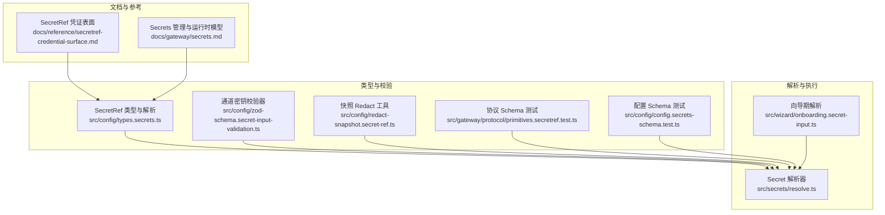
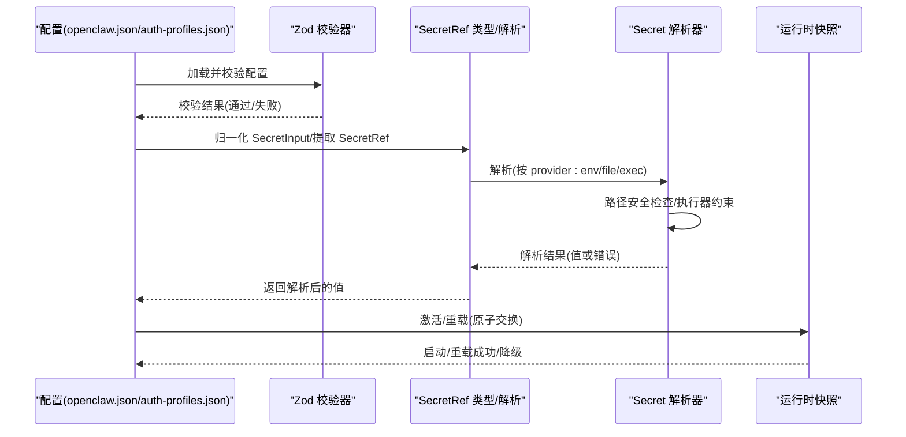
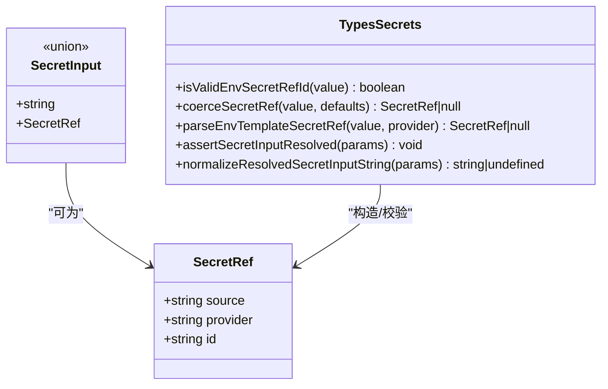
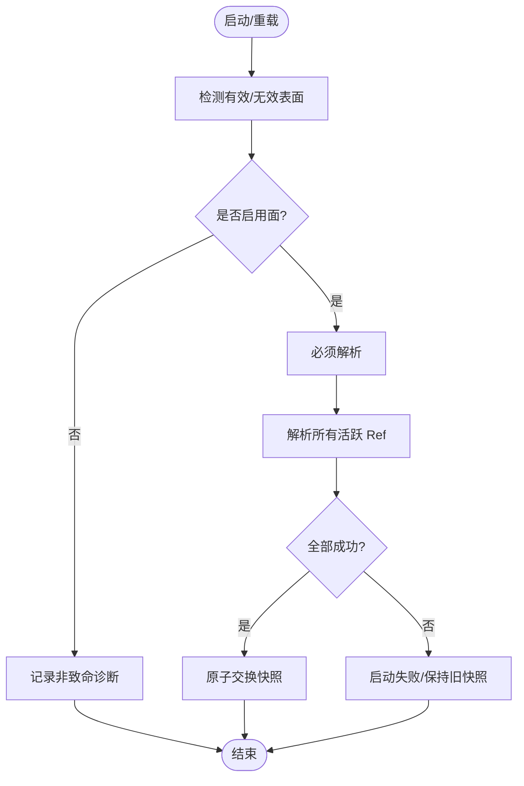
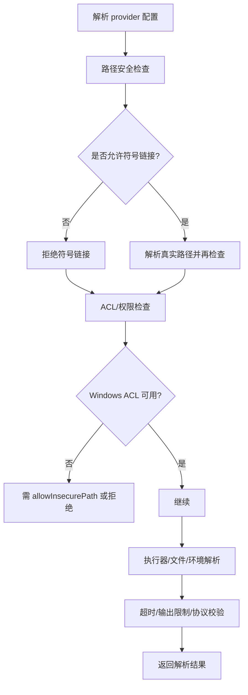
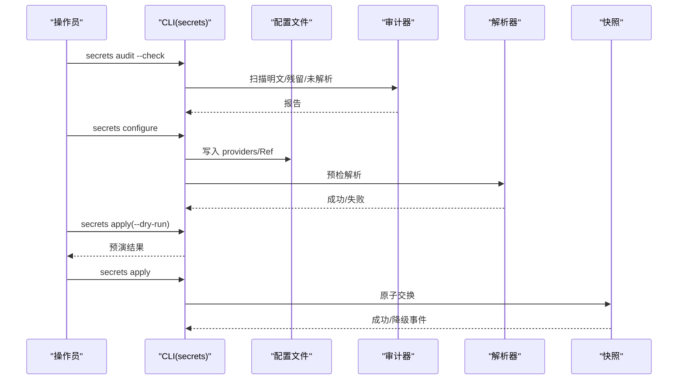
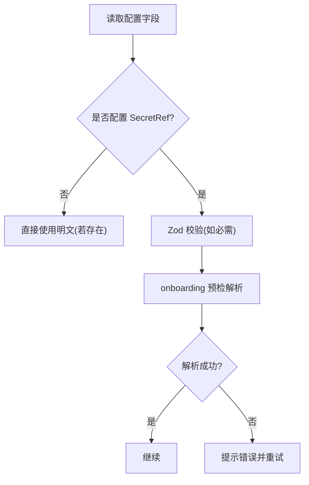
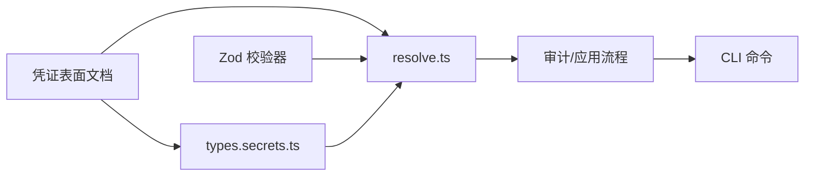

# 配置安全

<cite>
**本文引用的文件**
- [docs/reference/secretref-credential-surface.md](file://docs/reference/secretref-credential-surface.md)
- [docs/gateway/secrets.md](file://docs/gateway/secrets.md)
- [src/config/types.secrets.ts](file://src/config/types.secrets.ts)
- [src/config/zod-schema.secret-input-validation.ts](file://src/config/zod-schema.secret-input-validation.ts)
- [src/config/redact-snapshot.secret-ref.ts](file://src/config/redact-snapshot.secret-ref.ts)
- [src/gateway/protocol/primitives.secretref.test.ts](file://src/gateway/protocol/primitives.secretref.test.ts)
- [src/wizard/onboarding.secret-input.ts](file://src/wizard/onboarding.secret-input.ts)
- [src/secrets/resolve.ts](file://src/secrets/resolve.ts)
- [src/config/config.secrets-schema.test.ts](file://src/config/config.secrets-schema.test.ts)
- [SECURITY.md](file://SECURITY.md)
</cite>

## 目录
1. [简介](#简介)
2. [项目结构](#项目结构)
3. [核心组件](#核心组件)
4. [架构总览](#架构总览)
5. [详细组件分析](#详细组件分析)
6. [依赖关系分析](#依赖关系分析)
7. [性能考量](#性能考量)
8. [故障排查指南](#故障排查指南)
9. [结论](#结论)
10. [附录](#附录)

## 简介
本指南面向在 OpenClaw 中进行“配置安全”的专业读者，聚焦于敏感配置的安全存储、访问控制与权限管理，系统性阐述 SecretRef 密钥管理机制、环境变量安全处理、文件权限控制等安全实践；并进一步解释凭证语义、凭据表面、密钥轮换等安全概念。同时提供配置加密、安全传输、审计日志等高级安全功能的使用建议，并给出配置安全审计、漏洞扫描、安全加固的最佳实践与常见问题的解决方案。

## 项目结构
围绕“配置安全”，OpenClaw 的关键实现分布在以下模块：
- 文档层：定义 SecretRef 凭证表面、运行时模型与安全策略
- 类型与校验层：定义 SecretRef 数据结构、输入归一化、Zod 校验器
- 解析与执行层：实现 SecretRef 的解析、路径安全检查、执行器约束
- 审计与工具层：提供 onboarding 前置校验、Redact 工具、CLI 审计命令

**图表来源**
- [docs/reference/secretref-credential-surface.md:1-130](file://docs/reference/secretref-credential-surface.md#L1-L130)
- [docs/gateway/secrets.md:1-455](file://docs/gateway/secrets.md#L1-L455)
- [src/config/types.secrets.ts:1-225](file://src/config/types.secrets.ts#L1-L225)
- [src/config/zod-schema.secret-input-validation.ts:1-103](file://src/config/zod-schema.secret-input-validation.ts#L1-L103)
- [src/config/redact-snapshot.secret-ref.ts:1-21](file://src/config/redact-snapshot.secret-ref.ts#L1-L21)
- [src/gateway/protocol/primitives.secretref.test.ts:1-35](file://src/gateway/protocol/primitives.secretref.test.ts#L1-L35)
- [src/config/config.secrets-schema.test.ts:1-208](file://src/config/config.secrets-schema.test.ts#L1-L208)
- [src/secrets/resolve.ts:1-960](file://src/secrets/resolve.ts#L1-L960)
- [src/wizard/onboarding.secret-input.ts:1-42](file://src/wizard/onboarding.secret-input.ts#L1-L42)

**章节来源**
- [docs/reference/secretref-credential-surface.md:1-130](file://docs/reference/secretref-credential-surface.md#L1-L130)
- [docs/gateway/secrets.md:1-455](file://docs/gateway/secrets.md#L1-L455)

## 核心组件
- SecretRef 数据模型与解析
  - 定义 SecretRef 的三元组（source/provider/id），支持 env/file/exec 三种来源
  - 提供 SecretInput 归一化、显式/内联 Ref 解析、错误断言与路径格式化
- 凭证表面与激活面过滤
  - 明确“受支持/不受支持”的凭据范围，区分启用/禁用、远程/本地等激活面
  - 不活跃面允许失败但不阻塞启动/重载，活跃面严格 fail-fast
- 路径安全与执行器约束
  - 文件/命令路径绝对化、ACL/权限检查、可信目录白名单、符号链接限制
  - 执行器超时、无输出超时、输出大小限制、仅 JSON 模式等
- 审计与配置工作流
  - secrets audit、secrets configure、secrets apply 的闭环
  - 一次性安全策略：不写回滚备份含历史明文值

**章节来源**
- [src/config/types.secrets.ts:1-225](file://src/config/types.secrets.ts#L1-L225)
- [docs/gateway/secrets.md:16-326](file://docs/gateway/secrets.md#L16-L326)
- [src/secrets/resolve.ts:208-276](file://src/secrets/resolve.ts#L208-L276)

## 架构总览
下图展示从配置到运行时快照的关键流程：配置加载 → SecretRef 解析 → 快照原子替换 → 命令/发送路径读取。

**图表来源**
- [src/config/zod-schema.secret-input-validation.ts:1-103](file://src/config/zod-schema.secret-input-validation.ts#L1-L103)
- [src/config/types.secrets.ts:105-174](file://src/config/types.secrets.ts#L105-L174)
- [src/secrets/resolve.ts:167-180](file://src/secrets/resolve.ts#L167-L180)
- [docs/gateway/secrets.md:16-326](file://docs/gateway/secrets.md#L16-L326)

## 详细组件分析

### 组件A：SecretRef 数据模型与解析
- 数据结构
  - SecretRef: { source, provider, id }
  - 支持字符串模板与默认 provider 别名
- 解析流程
  - 归一化 SecretInput → 提取显式/内联 Ref → 断言未解析 Ref → 返回值
- 错误模型
  - SecretRefResolutionError/SecretProviderResolutionError 区分来源与粒度

**图表来源**
- [src/config/types.secrets.ts:1-225](file://src/config/types.secrets.ts#L1-L225)

**章节来源**
- [src/config/types.secrets.ts:1-225](file://src/config/types.secrets.ts#L1-L225)

### 组件B：凭证表面与激活面过滤
- 支持的凭据面
  - 模型提供商 apiKey、HTTP 头、技能 apiKey、消息 TTS、工具搜索、网关认证/远程认证、各通道令牌/签名密钥等
- 不支持的凭据面
  - 运行时生成/轮换、OAuth 刷新材料、会话类产物等
- 激活面策略
  - 启用面：未解析 Ref 阻止启动/重载
  - 不启用面：未解析 Ref 不阻塞，发出非致命诊断码
  - 网关认证面：根据环境变量/远程模式动态判定活跃

**图表来源**
- [docs/gateway/secrets.md:28-51](file://docs/gateway/secrets.md#L28-L51)
- [docs/reference/secretref-credential-surface.md:19-129](file://docs/reference/secretref-credential-surface.md#L19-L129)

**章节来源**
- [docs/gateway/secrets.md:28-64](file://docs/gateway/secrets.md#L28-L64)
- [docs/reference/secretref-credential-surface.md:19-129](file://docs/reference/secretref-credential-surface.md#L19-L129)

### 组件C：路径安全与执行器约束
- 路径安全
  - 绝对路径、禁止符号链接、可信目录白名单、用户归属、ACL/权限检查
  - Windows 上 ACL 不可用时的 fail-closed 与 allowInsecurePath 兼容
- 执行器约束
  - 超时/无输出超时、最大输出字节、仅 JSON 模式、passEnv 白名单、trustedDirs
  - 协议版本校验、批量请求大小限制、逐条错误映射
- 文件提供者
  - singleValue/json 两种模式，JSON 指针解析，超时与大小限制

**图表来源**
- [src/secrets/resolve.ts:208-276](file://src/secrets/resolve.ts#L208-L276)
- [src/secrets/resolve.ts:278-428](file://src/secrets/resolve.ts#L278-L428)
- [src/secrets/resolve.ts:652-784](file://src/secrets/resolve.ts#L652-L784)

**章节来源**
- [src/secrets/resolve.ts:208-276](file://src/secrets/resolve.ts#L208-L276)
- [src/secrets/resolve.ts:278-428](file://src/secrets/resolve.ts#L278-L428)
- [src/secrets/resolve.ts:652-784](file://src/secrets/resolve.ts#L652-L784)

### 组件D：审计与配置工作流
- secrets audit
  - 发现明文、残留敏感头、未解析 Ref、优先级遮蔽、遗留项
- secrets configure
  - 交互式配置 providers，选择目标字段，预检解析，可立即应用
- secrets apply
  - 应用保存的计划，带 dry-run
- 一次性安全策略
  - 预检必须通过 → 运行时激活验证 → 提交采用原子替换与最佳恢复

**图表来源**
- [docs/gateway/secrets.md:365-424](file://docs/gateway/secrets.md#L365-L424)

**章节来源**
- [docs/gateway/secrets.md:365-424](file://docs/gateway/secrets.md#L365-L424)

### 组件E：凭证语义、凭据表面与密钥轮换
- 凭证语义
  - SecretRef 仅覆盖“用户提供的、非运行时生成/轮换”的凭据
  - 不支持 OAuth 刷新材料、会话类产物
- 凭据表面
  - 明确列出受支持与不受支持的字段路径，便于审计与合规
- 密钥轮换
  - 通过“后端密钥轮换 + openclaw secrets reload”实现，不改变配置结构
  - 重载采用原子交换，失败保留 last-known-good 快照

**章节来源**
- [docs/reference/secretref-credential-surface.md:14-129](file://docs/reference/secretref-credential-surface.md#L14-L129)
- [docs/gateway/secrets.md:312-363](file://docs/gateway/secrets.md#L312-L363)

### 组件F：环境变量安全处理与 Zod 校验
- 环境变量校验
  - env 变量名正则、可选 allowlist、缺失/空值即报错
- 通道密钥强制要求
  - Telegram/Slack 等在特定模式下必须配置对应签名密钥，否则 Zod 报错
- onboarding 期解析
  - 在向导中解析 SecretRef 并给出明确错误信息，便于快速修复

**图表来源**
- [src/config/zod-schema.secret-input-validation.ts:43-102](file://src/config/zod-schema.secret-input-validation.ts#L43-L102)
- [src/wizard/onboarding.secret-input.ts:14-41](file://src/wizard/onboarding.secret-input.ts#L14-L41)

**章节来源**
- [src/config/zod-schema.secret-input-validation.ts:1-103](file://src/config/zod-schema.secret-input-validation.ts#L1-L103)
- [src/wizard/onboarding.secret-input.ts:1-42](file://src/wizard/onboarding.secret-input.ts#L1-L42)

## 依赖关系分析
- 文档与实现耦合
  - 凭证表面文档与实现中的支持列表保持一致，避免“文档漂移”
- 类型与解析耦合
  - types.secrets.ts 为 resolve.ts 的输入/输出契约基础
- 校验与解析耦合
  - zod-schema.secret-input-validation.ts 在配置阶段拦截不合规组合
- 审计与 CLI 耦合
  - secrets audit/apply 与 resolve.ts 的快照原子交换形成闭环

**图表来源**
- [docs/reference/secretref-credential-surface.md:19-129](file://docs/reference/secretref-credential-surface.md#L19-L129)
- [src/config/types.secrets.ts:1-225](file://src/config/types.secrets.ts#L1-L225)
- [src/config/zod-schema.secret-input-validation.ts:1-103](file://src/config/zod-schema.secret-input-validation.ts#L1-L103)
- [src/secrets/resolve.ts:1-960](file://src/secrets/resolve.ts#L1-L960)
- [docs/gateway/secrets.md:365-424](file://docs/gateway/secrets.md#L365-L424)

**章节来源**
- [src/config/types.secrets.ts:1-225](file://src/config/types.secrets.ts#L1-L225)
- [src/secrets/resolve.ts:1-960](file://src/secrets/resolve.ts#L1-L960)
- [src/config/zod-schema.secret-input-validation.ts:1-103](file://src/config/zod-schema.secret-input-validation.ts#L1-L103)

## 性能考量
- 解析并发与批处理
  - 提供商并发、每供应商最大 Ref 数、批量请求字节上限，避免资源滥用
- I/O 限制
  - 文件读取超时、最大字节数；执行器超时/无输出超时、最大输出字节
- 快照原子性
  - 成功才交换，失败保留 last-known-good，避免热路径上的不可用风险

**章节来源**
- [src/secrets/resolve.ts:31-38](file://src/secrets/resolve.ts#L31-L38)
- [src/secrets/resolve.ts:167-180](file://src/secrets/resolve.ts#L167-L180)
- [docs/gateway/secrets.md:20-26](file://docs/gateway/secrets.md#L20-L26)

## 故障排查指南
- 常见错误与定位
  - 未解析 Ref：检查 provider 是否配置、id 是否正确、环境变量是否可见
  - 路径权限过宽：调整文件/命令权限、归属与 ACL，必要时使用 allowInsecurePath
  - 执行器失败：检查命令可执行性、passEnv、trustedDirs、超时设置
  - 通道密钥缺失：根据 Zod 规则补齐 Telegram/Slack 签名密钥
- 诊断信号
  - SECRETS_REF_IGNORED_INACTIVE_SURFACE：不活跃面被忽略
  - SECRETS_GATEWAY_AUTH_SURFACE：网关认证面状态日志
  - SECRETS_RELOADER_DEGRADED/RECOVERED：重载降级与恢复事件
- onboarding 解析错误
  - onboarding.secret-input.ts 将具体 Ref 与错误信息拼接，便于快速修复

**章节来源**
- [src/secrets/resolve.ts:105-146](file://src/secrets/resolve.ts#L105-L146)
- [src/wizard/onboarding.secret-input.ts:7-41](file://src/wizard/onboarding.secret-input.ts#L7-L41)
- [docs/gateway/secrets.md:53-64](file://docs/gateway/secrets.md#L53-L64)
- [docs/gateway/secrets.md:328-342](file://docs/gateway/secrets.md#L328-L342)

## 结论
OpenClaw 通过“凭证表面 + SecretRef + 路径安全 + 执行器约束 + 原子快照”的组合，构建了可审计、可降级、可轮换的安全配置体系。遵循本文档的实践与流程，可在生产环境中安全地管理敏感配置，降低泄露与滥用风险。

## 附录

### A. 高级安全功能使用建议
- 配置加密
  - 使用 exec provider 与 sops、Vault、1Password 等工具配合，将密文解密为明文注入
- 安全传输
  - 通过受控网络边界（SSH 隧道/Tailscale）暴露网关，避免公网直连
- 审计日志
  - 结合 CLI 审计与运行时事件码，建立持续监控与告警

**章节来源**
- [docs/gateway/secrets.md:199-286](file://docs/gateway/secrets.md#L199-L286)
- [SECURITY.md:207-244](file://SECURITY.md#L207-L244)

### B. 安全审计与漏洞扫描
- 本地扫描
  - 使用 detect-secrets 进行基线扫描，定期更新基线
- 深度审计
  - 使用 `openclaw security audit --deep` 识别部署与配置风险
- 最佳实践
  - 严格最小权限、最小暴露面、最小持久化；定期轮换密钥并通过 secrets reload 生效

**章节来源**
- [SECURITY.md:277-287](file://SECURITY.md#L277-L287)
- [docs/gateway/secrets.md:365-424](file://docs/gateway/secrets.md#L365-L424)