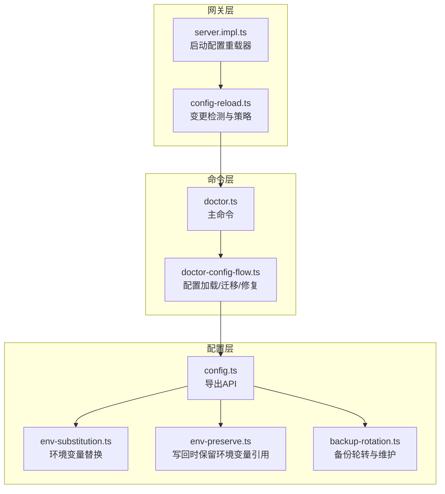
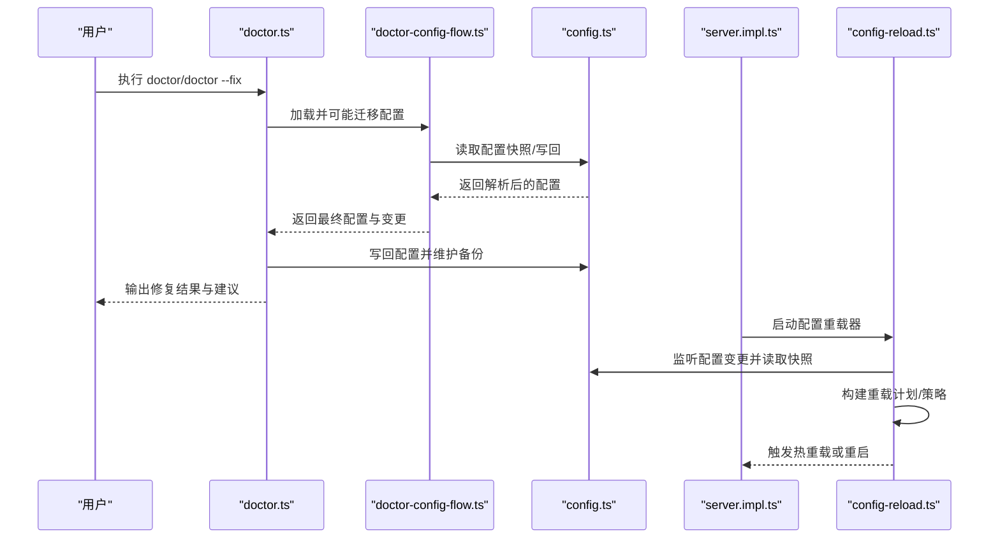
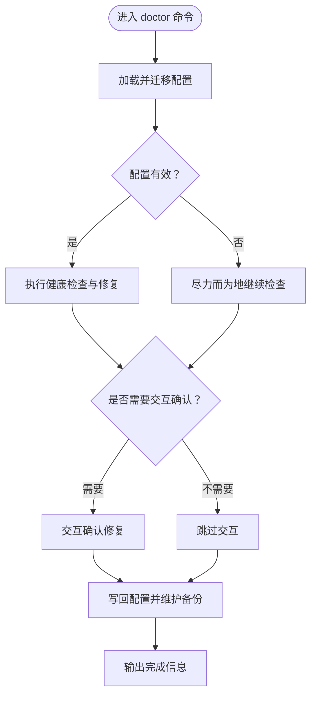
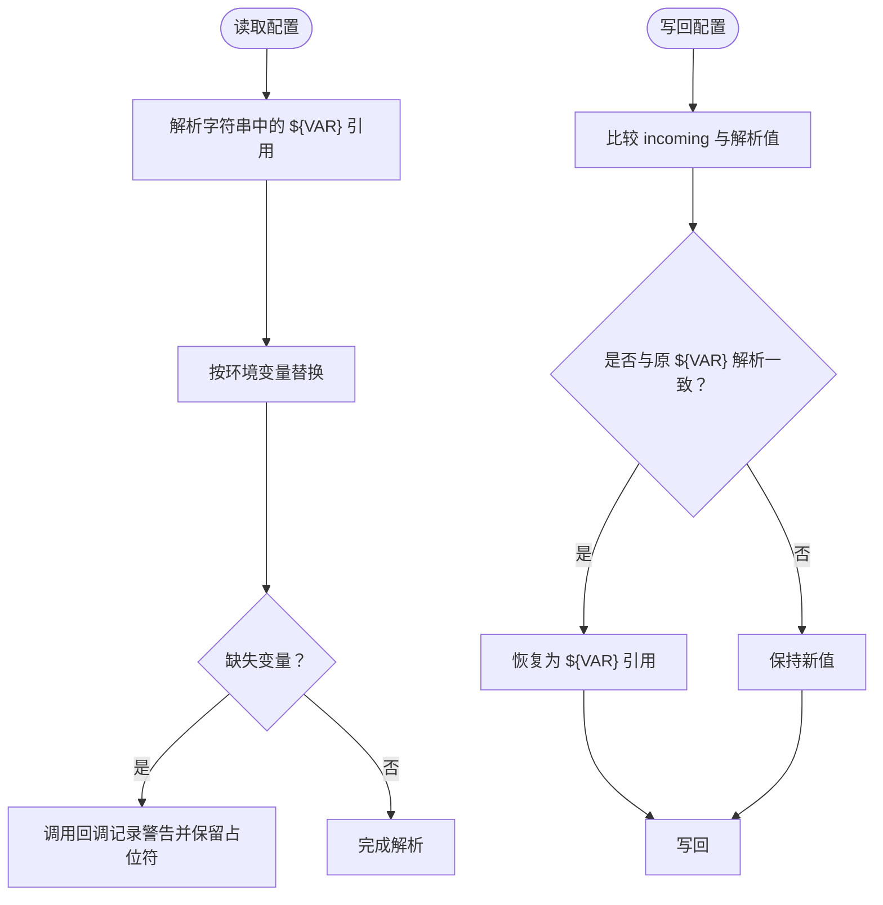
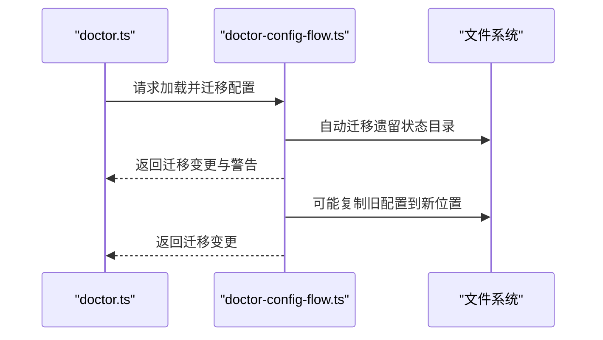
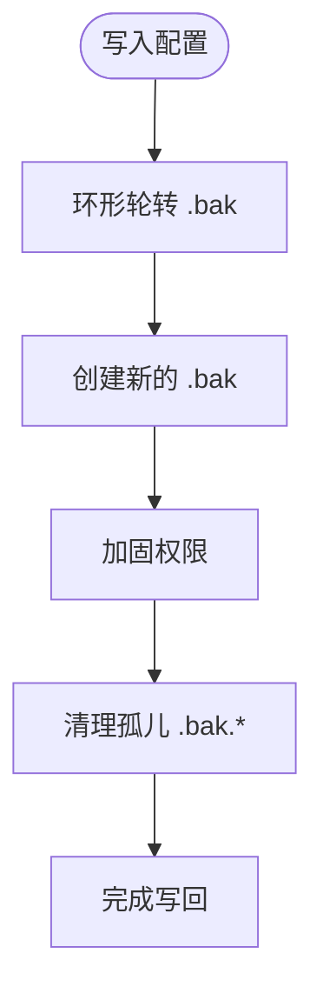
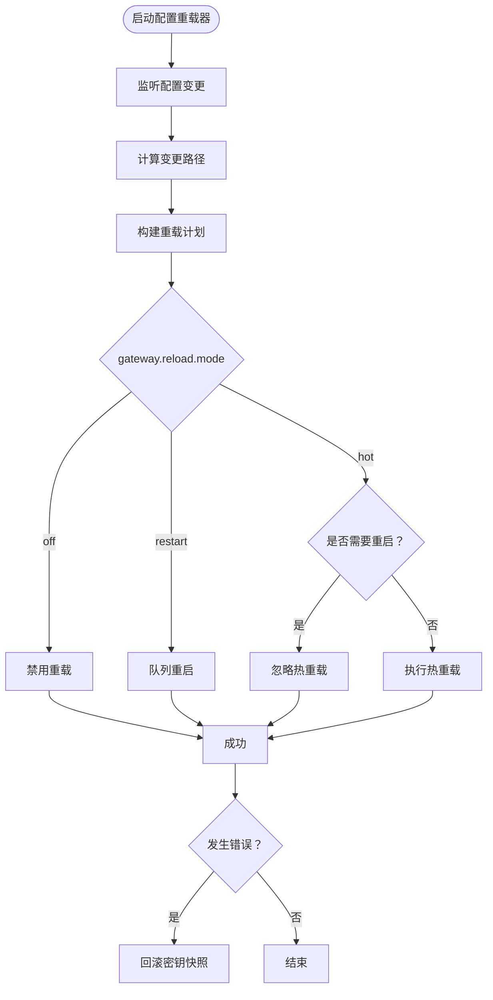
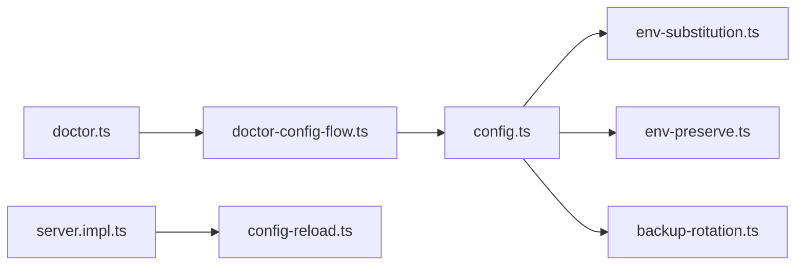

# 配置管理

<cite>
**本文引用的文件**
- [src/commands/doctor.ts](file://src/commands/doctor.ts)
- [src/commands/doctor-config-flow.ts](file://src/commands/doctor-config-flow.ts)
- [src/config/config.ts](file://src/config/config.ts)
- [src/config/env-substitution.ts](file://src/config/env-substitution.ts)
- [src/config/env-preserve.ts](file://src/config/env-preserve.ts)
- [src/config/backup-rotation.ts](file://src/config/backup-rotation.ts)
- [src/gateway/config-reload.ts](file://src/gateway/config-reload.ts)
- [src/gateway/server.impl.ts](file://src/gateway/server.impl.ts)
- [src/gateway/server.reload.test.ts](file://src/gateway/server.reload.test.ts)
- [src/cli/program/config-guard.test.ts](file://src/cli/program/config-guard.test.ts)
- [docs/cli/doctor.md](file://docs/cli/doctor.md)
- [docs/reference/AGENTS.default.md](file://docs/reference/AGENTS.default.md)
</cite>

## 目录
1. [简介](#简介)
2. [项目结构](#项目结构)
3. [核心组件](#核心组件)
4. [架构总览](#架构总览)
5. [详细组件分析](#详细组件分析)
6. [依赖分析](#依赖分析)
7. [性能考量](#性能考量)
8. [故障排查指南](#故障排查指南)
9. [结论](#结论)
10. [附录](#附录)

## 简介
本文件面向OpenClaw的配置管理，系统性梳理配置文件结构、参数优化、环境变量管理、配置迁移与健康检查（doctor）流程，并给出多环境部署、动态配置与热更新的最佳实践。内容覆盖配置验证、版本控制与备份恢复策略，以及在不同场景下的配置模板与优化建议。

## 项目结构
OpenClaw的配置相关能力主要分布在以下模块：
- 命令层：doctor命令及其子流程（配置加载/迁移、健康检查、修复提示）
- 配置层：配置读取、解析、校验、写入、备份轮转、环境变量替换与保留
- 网关层：配置变更检测、热重载与重启决策
- 文档与模板：CLI参考与默认工作空间模板

**图表来源**
- [src/commands/doctor.ts:73-370](file://src/commands/doctor.ts#L73-L370)
- [src/commands/doctor-config-flow.ts:1652-1685](file://src/commands/doctor-config-flow.ts#L1652-L1685)
- [src/config/config.ts:1-29](file://src/config/config.ts#L1-L29)
- [src/config/env-substitution.ts:1-204](file://src/config/env-substitution.ts#L1-L204)
- [src/config/env-preserve.ts:1-38](file://src/config/env-preserve.ts#L1-L38)
- [src/config/backup-rotation.ts:1-125](file://src/config/backup-rotation.ts#L1-L125)
- [src/gateway/config-reload.ts:141-182](file://src/gateway/config-reload.ts#L141-L182)
- [src/gateway/server.impl.ts:982-1013](file://src/gateway/server.impl.ts#L982-L1013)

**章节来源**
- [src/commands/doctor.ts:1-370](file://src/commands/doctor.ts#L1-L370)
- [src/config/config.ts:1-29](file://src/config/config.ts#L1-L29)

## 核心组件
- doctor命令：统一的健康检查与引导式修复入口，贯穿配置加载、迁移、修复、写回与备份维护。
- doctor配置流程：负责遗留配置迁移、无效配置的“尽力而为”读取、警告与变更收集、交互确认与写回。
- 配置API：封装读取、解析、校验、写入、快照与运行时覆盖；对外暴露路径、类型与验证接口。
- 环境变量替换与保留：在读取阶段解析${VAR}，在写回阶段尽可能保留原始引用，避免凭空注入新值。
- 备份轮转：写入前进行环形轮转、创建.bak、权限加固与孤儿.bak清理。
- 网关配置热重载：监听配置变更，基于变更路径构建重载计划，决定热重载或重启。

**章节来源**
- [src/commands/doctor.ts:73-370](file://src/commands/doctor.ts#L73-L370)
- [src/commands/doctor-config-flow.ts:1652-1685](file://src/commands/doctor-config-flow.ts#L1652-L1685)
- [src/config/config.ts:1-29](file://src/config/config.ts#L1-L29)
- [src/config/env-substitution.ts:1-204](file://src/config/env-substitution.ts#L1-L204)
- [src/config/env-preserve.ts:1-38](file://src/config/env-preserve.ts#L1-L38)
- [src/config/backup-rotation.ts:1-125](file://src/config/backup-rotation.ts#L1-L125)
- [src/gateway/config-reload.ts:141-182](file://src/gateway/config-reload.ts#L141-L182)

## 架构总览
下图展示doctor命令到配置与网关层的关键交互路径，包括配置加载/迁移、写回与备份、以及网关配置热重载。

**图表来源**
- [src/commands/doctor.ts:103-106](file://src/commands/doctor.ts#L103-L106)
- [src/commands/doctor-config-flow.ts:1652-1685](file://src/commands/doctor-config-flow.ts#L1652-L1685)
- [src/config/config.ts:1-29](file://src/config/config.ts#L1-L29)
- [src/gateway/server.impl.ts:982-1013](file://src/gateway/server.impl.ts#L982-L1013)
- [src/gateway/config-reload.ts:141-182](file://src/gateway/config-reload.ts#L141-L182)

## 详细组件分析

### doctor命令与配置修复流程
- 入口与流程：doctor命令负责更新前置检查、平台提示、配置加载与迁移、健康检查、安全与沙箱检查、遗留状态迁移、写回与备份维护等。
- 配置加载与迁移：通过doctor-config-flow加载并可能迁移旧版配置，对无效配置采用“尽力而为”的方式继续执行健康检查。
- 交互与写回：支持非交互模式与交互模式；当存在修复项时，写回配置并生成.bak备份；未选择修复时提示使用--fix。
- 平台与环境提示：macOS launchctl环境覆盖、过时环境变量提示、启动优化建议等。

**图表来源**
- [src/commands/doctor.ts:73-370](file://src/commands/doctor.ts#L73-L370)
- [src/commands/doctor-config-flow.ts:1652-1685](file://src/commands/doctor-config-flow.ts#L1652-L1685)

**章节来源**
- [src/commands/doctor.ts:73-370](file://src/commands/doctor.ts#L73-L370)
- [docs/cli/doctor.md:1-46](file://docs/cli/doctor.md#L1-L46)

### 配置文件结构与参数优化
- 结构概览：配置对象包含gateway、models、agents、channels、hooks、secrets等关键域；可通过configure命令设置或doctor引导修复。
- 参数优化建议：
  - 明确gateway.mode与auth.mode，避免歧义配置导致启动失败。
  - 使用SecretRef管理敏感信息，减少明文存储。
  - hooks.gmail.model需在模型目录中可解析且在允许列表内。
  - 模型提供商的API密钥建议通过环境变量引用并在doctor中进行TLS前提检查。

**章节来源**
- [src/commands/doctor.ts:112-133](file://src/commands/doctor.ts#L112-L133)
- [src/commands/doctor.ts:244-280](file://src/commands/doctor.ts#L244-L280)

### 环境变量管理与写回保留
- 替换机制：在读取阶段解析${VAR}，仅匹配大写命名规范；支持转义$${}以输出字面量。
- 缺失处理：默认抛出缺失错误；也可通过回调记录警告并保留占位符。
- 写回保留：在写回时检测incoming值与解析值是否一致，若原值为${VAR}且当前环境解析得到相同值，则恢复引用，避免凭空注入新值。

**图表来源**
- [src/config/env-substitution.ts:88-135](file://src/config/env-substitution.ts#L88-L135)
- [src/config/env-substitution.ts:161-186](file://src/config/env-substitution.ts#L161-L186)
- [src/config/env-preserve.ts:1-38](file://src/config/env-preserve.ts#L1-L38)

**章节来源**
- [src/config/env-substitution.ts:1-204](file://src/config/env-substitution.ts#L1-L204)
- [src/config/env-preserve.ts:1-38](file://src/config/env-preserve.ts#L1-L38)

### 配置迁移与doctor自动迁移
- 旧版状态迁移：检测并迁移遗留状态（如sessions/agent/WhatsApp认证），支持预览与交互确认。
- 旧版配置迁移：迁移遗留配置文件与目录，写入日志并提示变更。
- 迁移幂等：doctor迁移流程在模块实例内仅执行一次，避免重复迁移。

**图表来源**
- [src/commands/doctor.ts:199-220](file://src/commands/doctor.ts#L199-L220)
- [src/commands/doctor-config-flow.ts:1652-1685](file://src/commands/doctor-config-flow.ts#L1652-L1685)

**章节来源**
- [src/commands/doctor.ts:199-220](file://src/commands/doctor.ts#L199-L220)
- [src/commands/doctor-config-flow.ts:1652-1685](file://src/commands/doctor-config-flow.ts#L1652-L1685)

### 配置验证、版本控制与备份恢复
- 验证：提供validateConfigObject与带插件的验证函数，确保配置结构与业务规则符合预期。
- 版本控制：建议将配置文件纳入版本库（私有仓库更佳），配合AGENTS.default模板与工作区管理。
- 备份恢复：写回前进行备份轮转（保留N个.bak），写入后创建.bak，权限加固并清理孤儿.bak文件；doctor --fix会生成.bak用于回滚。

**图表来源**
- [src/config/backup-rotation.ts:115-125](file://src/config/backup-rotation.ts#L115-L125)

**章节来源**
- [src/config/config.ts:24-28](file://src/config/config.ts#L24-L28)
- [src/config/backup-rotation.ts:1-125](file://src/config/backup-rotation.ts#L1-L125)
- [docs/reference/AGENTS.default.md:78-88](file://docs/reference/AGENTS.default.md#L78-L88)
- [docs/cli/doctor.md:29-30](file://docs/cli/doctor.md#L29-L30)

### 多环境部署与动态配置
- 多环境：通过环境变量引用实现多环境隔离（如开发/生产API密钥），doctor在必要时提示TLS前提与Docker可用性。
- 动态配置：doctor支持非交互模式与TTY判断，headless环境跳过交互提示。
- 安全与合规：doctor扫描并提示安全问题，如launchctl环境覆盖、过时环境变量等。

**章节来源**
- [src/commands/doctor.ts:282-306](file://src/commands/doctor.ts#L282-L306)
- [docs/cli/doctor.md:28-33](file://docs/cli/doctor.md#L28-L33)

### 配置热更新与网关重载
- 监听与评估：网关启动后注册配置重载器，监听配置文件变化，读取快照并计算差异路径。
- 策略与决策：根据变更路径构建重载计划；当gateway.reload.mode=off则禁用重载；hot模式下若需重启则忽略热重载；否则执行热重载。
- 容错回滚：热重载失败时回滚到之前的运行时密钥快照，保证系统稳定。

**图表来源**
- [src/gateway/server.impl.ts:982-1013](file://src/gateway/server.impl.ts#L982-L1013)
- [src/gateway/config-reload.ts:141-182](file://src/gateway/config-reload.ts#L141-L182)

**章节来源**
- [src/gateway/server.impl.ts:982-1013](file://src/gateway/server.impl.ts#L982-L1013)
- [src/gateway/config-reload.ts:141-182](file://src/gateway/config-reload.ts#L141-L182)
- [src/gateway/server.reload.test.ts:622-658](file://src/gateway/server.reload.test.ts#L622-L658)

## 依赖分析
- doctor命令依赖doctor-config-flow进行配置加载与迁移，再依赖config.ts进行读写与快照，最终调用doctor-*系列模块执行健康检查与修复。
- 网关层通过server.impl.ts启动配置重载器，由config-reload.ts评估变更并决定热重载或重启。
- 环境变量替换与保留分别在读取与写回阶段发挥作用，确保配置在多环境间的一致性与安全性。

**图表来源**
- [src/commands/doctor.ts:103-106](file://src/commands/doctor.ts#L103-L106)
- [src/commands/doctor-config-flow.ts:1652-1685](file://src/commands/doctor-config-flow.ts#L1652-L1685)
- [src/config/config.ts:1-29](file://src/config/config.ts#L1-L29)
- [src/gateway/server.impl.ts:982-1013](file://src/gateway/server.impl.ts#L982-L1013)
- [src/gateway/config-reload.ts:141-182](file://src/gateway/config-reload.ts#L141-L182)

**章节来源**
- [src/commands/doctor.ts:1-370](file://src/commands/doctor.ts#L1-L370)
- [src/gateway/server.impl.ts:982-1013](file://src/gateway/server.impl.ts#L982-L1013)

## 性能考量
- 配置读取与替换：字符串遍历与正则匹配开销较小，但应避免在高频路径中重复解析；建议缓存解析结果。
- 备份轮转：环形轮转与孤儿文件清理为O(N)操作，N为备份数量；在高并发写入场景下建议降低备份数量或异步化。
- 热重载：变更路径计算与重载计划构建为轻量操作；热重载失败回滚涉及密钥快照切换，应尽量缩短回滚窗口。

## 故障排查指南
- doctor命令行为：
  - 非交互模式：跳过TTY相关提示，适合定时任务与无终端环境。
  - --fix写回：生成.bak备份，删除未知键并列出移除项；建议先备份再修复。
  - macOS launchctl覆盖：若之前通过launchctl设置OPENCLAW_GATEWAY_TOKEN/PASSWORD，可能导致“未授权”错误，需unset后再运行doctor。
- 环境变量缺失：
  - 网关热重载测试显示，缺失环境变量会触发异常并产生降级事件；应确保环境变量在重载前后一致。
- 配置无效：
  - doctor对无效配置采用“尽力而为”，但仍会输出问题列表；建议使用doctor --fix修复或手动修正。

**章节来源**
- [docs/cli/doctor.md:28-45](file://docs/cli/doctor.md#L28-L45)
- [src/gateway/server.reload.test.ts:651-658](file://src/gateway/server.reload.test.ts#L651-L658)
- [src/commands/doctor.ts:360-366](file://src/commands/doctor.ts#L360-L366)

## 结论
OpenClaw的配置管理以doctor为核心，结合配置加载/迁移、环境变量替换与保留、备份轮转与热重载，形成从“健康检查—修复—写回—监控”的闭环。通过明确的策略（如显式auth模式、SecretRef、模型目录校验）与最佳实践（版本控制、备份恢复、多环境隔离），可在复杂部署场景中保持配置一致性与稳定性。

## 附录
- 不同场景下的配置模板与优化建议：
  - 默认工作区模板：参考AGENTS.default.md，建议将工作区纳入版本库并定期提交。
  - 环境隔离：通过${VAR}引用API密钥，避免在配置中硬编码；在不同环境使用不同变量值。
  - 网关模式：优先使用token认证与本地模式，避免歧义配置；必要时使用doctor引导修复。
- 配置验证与版本控制：
  - 使用validateConfigObject进行结构与规则校验；将配置纳入私有仓库，配合.bak进行回滚。
- 备份恢复：
  - doctor --fix会生成.bak；写回前进行轮转与清理，确保历史备份可追溯。

**章节来源**
- [docs/reference/AGENTS.default.md:1-125](file://docs/reference/AGENTS.default.md#L1-L125)
- [src/config/config.ts:24-28](file://src/config/config.ts#L24-L28)
- [src/config/backup-rotation.ts:1-125](file://src/config/backup-rotation.ts#L1-L125)
- [docs/cli/doctor.md:29-30](file://docs/cli/doctor.md#L29-L30)