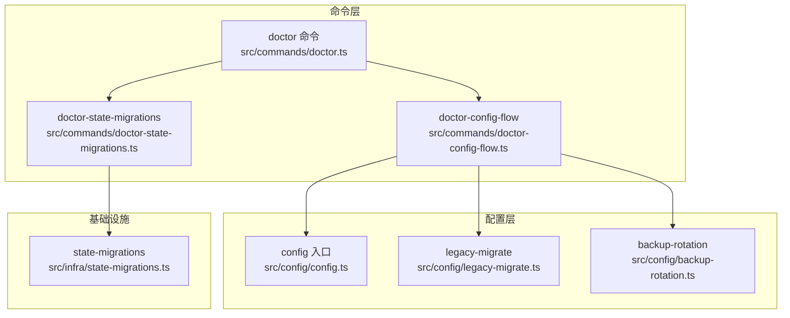
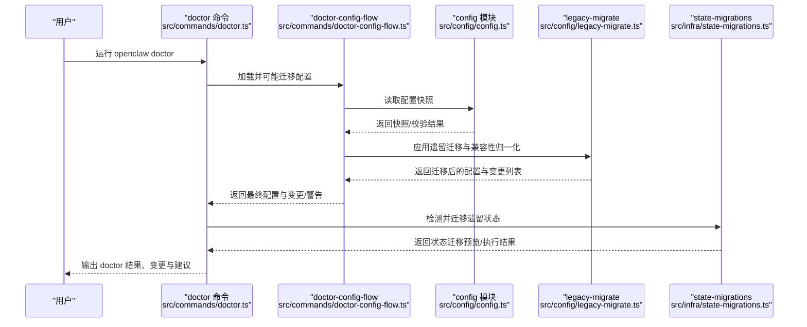
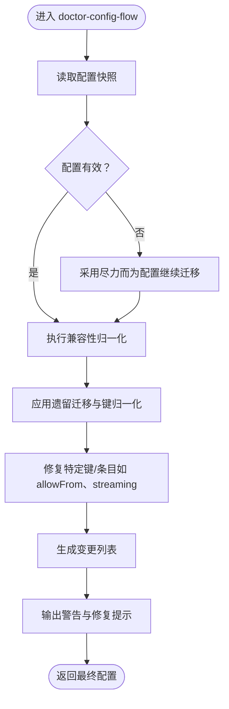
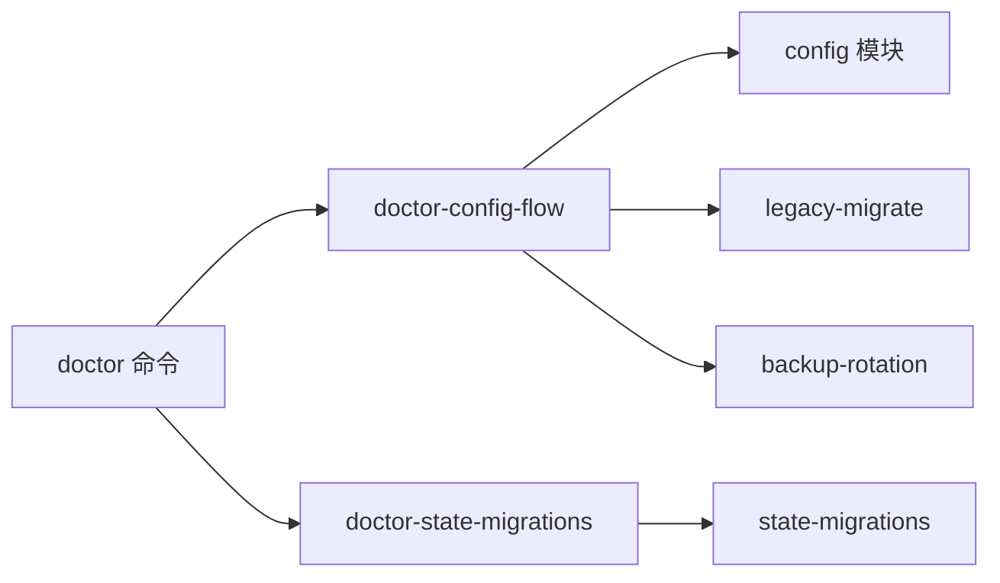

# 配置迁移

<cite>
**本文引用的文件**
- [src/commands/doctor.ts](file://src/commands/doctor.ts)
- [src/commands/doctor-config-flow.ts](file://src/commands/doctor-config-flow.ts)
- [src/commands/doctor-state-migrations.ts](file://src/commands/doctor-state-migrations.ts)
- [src/config/config.ts](file://src/config/config.ts)
- [src/config/legacy-migrate.ts](file://src/config/legacy-migrate.ts)
- [src/config/backup-rotation.ts](file://src/config/backup-rotation.ts)
- [src/infra/state-migrations.ts](file://src/infra/state-migrations.ts)
- [src/commands/doctor-config-flow.ts](file://src/commands/doctor-config-flow.ts)
- [docs/cli/doctor.md](file://docs/cli/doctor.md)
- [src/cli/program/config-guard.test.ts](file://src/cli/program/config-guard.test.ts)
</cite>

## 目录
1. [简介](#简介)
2. [项目结构](#项目结构)
3. [核心组件](#核心组件)
4. [架构总览](#架构总览)
5. [详细组件分析](#详细组件分析)
6. [依赖关系分析](#依赖关系分析)
7. [性能考量](#性能考量)
8. [故障排查指南](#故障排查指南)
9. [结论](#结论)
10. [附录](#附录)

## 简介
本指南面向需要从旧版 OpenClaw 配置迁移到新版配置的用户与运维人员，系统阐述配置迁移的触发条件、迁移策略、兼容性处理、doctor 命令在迁移中的角色（自动修复、迁移验证、迁移日志）、不同版本间的配置差异、迁移注意事项与最佳实践（含备份、测试迁移、生产迁移），以及常见问题的解决方案。

## 项目结构
围绕“配置迁移”的关键模块分布如下：
- doctor 命令：负责健康检查、引导式修复、迁移流程入口与写回配置
- doctor-config-flow：执行配置快照读取、兼容性归一化、遗留键迁移、变更提示与写回
- config 模块：提供配置读取、校验、写入、迁移与路径解析
- state-migrations：处理状态目录与会话数据的遗留迁移
- backup-rotation：维护配置备份轮转与权限加固
- 文档：doctor 命令参考与使用说明

图表来源
- [src/commands/doctor.ts](file://src/commands/doctor.ts)
- [src/commands/doctor-config-flow.ts](file://src/commands/doctor-config-flow.ts)
- [src/commands/doctor-state-migrations.ts](file://src/commands/doctor-state-migrations.ts)
- [src/config/config.ts](file://src/config/config.ts)
- [src/config/legacy-migrate.ts](file://src/config/legacy-migrate.ts)
- [src/config/backup-rotation.ts](file://src/config/backup-rotation.ts)
- [src/infra/state-migrations.ts](file://src/infra/state-migrations.ts)

章节来源
- [src/commands/doctor.ts](file://src/commands/doctor.ts)
- [src/commands/doctor-config-flow.ts](file://src/commands/doctor-config-flow.ts)
- [src/config/config.ts](file://src/config/config.ts)
- [src/config/legacy-migrate.ts](file://src/config/legacy-migrate.ts)
- [src/config/backup-rotation.ts](file://src/config/backup-rotation.ts)
- [src/infra/state-migrations.ts](file://src/infra/state-migrations.ts)

## 核心组件
- doctor 命令：作为迁移与修复的统一入口，负责调用 doctor-config-flow 执行配置迁移与修复，并在需要时写回配置、输出变更与警告、进行健康检查与内存搜索探测。
- doctor-config-flow：读取配置快照、执行兼容性归一化、迁移遗留键、生成变更列表、提示修复建议；支持非交互模式与深度扫描。
- config 模块：提供配置读取、解析、校验、写入、迁移与路径解析；迁移函数对原始配置应用遗留迁移并进行二次校验。
- state-migrations：检测并迁移遗留状态目录、会话数据、OAuth 凭据与 Telegram 允许列表等。
- backup-rotation：在写回配置前后维护配置备份轮转、权限加固与孤儿备份清理。

章节来源
- [src/commands/doctor.ts](file://src/commands/doctor.ts)
- [src/commands/doctor-config-flow.ts](file://src/commands/doctor-config-flow.ts)
- [src/config/config.ts](file://src/config/config.ts)
- [src/config/legacy-migrate.ts](file://src/config/legacy-migrate.ts)
- [src/config/backup-rotation.ts](file://src/config/backup-rotation.ts)
- [src/infra/state-migrations.ts](file://src/infra/state-migrations.ts)

## 架构总览
下图展示 doctor 命令在迁移场景下的调用链与数据流：

图表来源
- [src/commands/doctor.ts](file://src/commands/doctor.ts)
- [src/commands/doctor-config-flow.ts](file://src/commands/doctor-config-flow.ts)
- [src/config/config.ts](file://src/config/config.ts)
- [src/config/legacy-migrate.ts](file://src/config/legacy-migrate.ts)
- [src/infra/state-migrations.ts](file://src/infra/state-migrations.ts)

## 详细组件分析

### doctor 命令与迁移触发
- 触发条件
  - 非只读快速路径命令（如 message）会强制运行 doctor 流程以确保配置有效后再执行 mutating 操作。
  - 对于允许白名单的命令（如 status、gateway health），即使配置无效也会跳过 doctor 的阻断逻辑。
- 迁移策略
  - 调用 doctor-config-flow 执行配置迁移与修复，支持非交互模式与深度扫描。
  - 在需要时写回配置，并输出备份路径与变更摘要。
- 回滚机制
  - 写回前通过备份轮转生成 .bak 文件；若迁移后仍无效，可基于 .bak 恢复。
- doctor 命令参考
  - 支持 --repair/--fix、--deep、非交互模式等选项；写回配置时生成 .bak 备份并丢弃未知键。

章节来源
- [src/commands/doctor.ts](file://src/commands/doctor.ts)
- [docs/cli/doctor.md](file://docs/cli/doctor.md)
- [src/cli/program/config-guard.test.ts](file://src/cli/program/config-guard.test.ts)

### doctor-config-flow：配置迁移与兼容性归一化
- 功能要点
  - 读取配置快照，识别无效配置与警告，必要时采用“尽力而为”的配置进行迁移。
  - 执行兼容性归一化：移动遗留键（如 dmPolicy、allowFrom、streamMode、nativeStreaming 等）、标准化枚举值、将单账号通道顶层键迁移至 accounts.default。
  - 修复特定渠道安全策略别名（如 browser.ssrfPolicy.allowPrivateNetwork → dangerouslyAllowPrivateNetwork）。
  - 修复 Telegram/Slack/Discord 允许列表条目（用户名转数字 ID、去重、合并）。
  - 生成变更列表与修复提示，支持非交互模式与深度扫描。
- 迁移验证
  - 迁移后再次校验配置有效性；若仍无效，记录迁移变更并提示手动修复。

图表来源
- [src/commands/doctor-config-flow.ts](file://src/commands/doctor-config-flow.ts)

章节来源
- [src/commands/doctor-config-flow.ts](file://src/commands/doctor-config-flow.ts)

### config 模块：迁移与写回
- migrateLegacyConfig
  - 对原始配置应用遗留迁移，随后进行带插件的配置校验；若仍无效则返回空配置并保留迁移变更提示。
- 写回与备份
  - doctor 命令在需要时写回配置，并调用备份轮转维护 .bak 文件；同时输出备份路径提示。

章节来源
- [src/config/legacy-migrate.ts](file://src/config/legacy-migrate.ts)
- [src/config/config.ts](file://src/config/config.ts)
- [src/commands/doctor.ts](file://src/commands/doctor.ts)
- [src/config/backup-rotation.ts](file://src/config/backup-rotation.ts)

### state-migrations：遗留状态迁移
- 检测与迁移
  - 自动检测遗留状态目录、会话存储、OAuth 凭据与 Telegram 允许列表，生成迁移预览。
  - 执行会话键规范化、合并、写回目标位置；复制允许列表文件；必要时回滚并给出警告。
- 安全与回滚
  - 若无法建立符号链接或移动失败，尝试回滚并提示设置 OPENCLAW_STATE_DIR 以避免状态分裂。

章节来源
- [src/infra/state-migrations.ts](file://src/infra/state-migrations.ts)
- [src/commands/doctor-state-migrations.ts](file://src/commands/doctor-state-migrations.ts)

## 依赖关系分析
- doctor 命令依赖 doctor-config-flow 与 doctor-state-migrations 完成配置与状态迁移。
- doctor-config-flow 依赖 config 模块读取与写回配置，并调用 legacy-migrate 执行迁移。
- backup-rotation 在写回配置前后被调用以维护 .bak 备份。
- state-migrations 与 doctor-state-migrations 协作完成遗留状态迁移。

图表来源
- [src/commands/doctor.ts](file://src/commands/doctor.ts)
- [src/commands/doctor-config-flow.ts](file://src/commands/doctor-config-flow.ts)
- [src/commands/doctor-state-migrations.ts](file://src/commands/doctor-state-migrations.ts)
- [src/config/config.ts](file://src/config/config.ts)
- [src/config/legacy-migrate.ts](file://src/config/legacy-migrate.ts)
- [src/config/backup-rotation.ts](file://src/config/backup-rotation.ts)
- [src/infra/state-migrations.ts](file://src/infra/state-migrations.ts)

章节来源
- [src/commands/doctor.ts](file://src/commands/doctor.ts)
- [src/commands/doctor-config-flow.ts](file://src/commands/doctor-config-flow.ts)
- [src/commands/doctor-state-migrations.ts](file://src/commands/doctor-state-migrations.ts)
- [src/config/config.ts](file://src/config/config.ts)
- [src/config/legacy-migrate.ts](file://src/config/legacy-migrate.ts)
- [src/config/backup-rotation.ts](file://src/config/backup-rotation.ts)
- [src/infra/state-migrations.ts](file://src/infra/state-migrations.ts)

## 性能考量
- 迁移流程在 doctor 中按需执行，避免不必要的 IO；非交互模式下缩短超时时间以提升响应速度。
- 备份轮转采用环形滚动与孤儿文件清理，减少磁盘占用与碎片。
- 状态迁移优先复制/合并最小必要数据，失败时尽量保持原状并提示回滚。

## 故障排查指南
- 配置无效
  - doctor 会在迁移后再次读取快照，若仍无效，逐项列出问题路径与消息；建议先运行 doctor --fix 修复，再查看 doctor 输出。
- 迁移未生效
  - 确认是否处于允许白名单的命令路径（如 status），这些命令不会强制运行 doctor；改用 mutating 命令或显式运行 doctor。
- 写回失败或覆盖错误
  - 检查 .bak 备份是否存在；若迁移后仍无效，可直接恢复 .bak。
- 状态迁移失败
  - 查看 doctor 输出的警告与回滚提示；必要时设置 OPENCLAW_STATE_DIR 并手动迁移。
- doctor 输出噪音
  - 在非交互模式下 doctor 会抑制 doctor 预检输出但仍执行迁移流程；如需完整日志，去掉非交互模式。

章节来源
- [src/commands/doctor.ts](file://src/commands/doctor.ts)
- [src/commands/doctor-config-flow.ts](file://src/commands/doctor-config-flow.ts)
- [src/commands/doctor-state-migrations.ts](file://src/commands/doctor-state-migrations.ts)
- [src/config/backup-rotation.ts](file://src/config/backup-rotation.ts)

## 结论
OpenClaw 的 doctor 命令将配置迁移、兼容性归一化与状态迁移整合为一次性的健康检查与修复流程。通过迁移前的备份轮转、迁移后的二次校验与详尽的日志输出，用户可以在测试环境先行验证，再在生产环境谨慎推进。遵循本文的最佳实践与排障建议，可显著降低迁移风险并提升稳定性。

## 附录

### 不同版本间的配置差异与迁移注意事项
- 通道预览/流式传输键迁移
  - 将 legacy 键（如 streamMode、boolean streaming）迁移/标准化为统一的 streaming 枚举，并将 nativeStreaming 独立拆分。
- DM 策略与允许列表
  - 将遗留 dm.policy、dm.allowFrom 合并到顶层 dmPolicy、allowFrom；去除冗余字段并去重。
- 浏览器 SSRF 策略别名
  - 将 allowPrivateNetwork 迁移为 dangerouslyAllowPrivateNetwork 并保留行为一致性。
- 单账号通道键迁移
  - 将通道顶层的单账号相关键迁移至 accounts.default，避免分散配置。
- Telegram/Slack/Discord 允许列表修复
  - 将 @username 条目解析为数字 ID，去重并合并；对不可解析的情况给出提示。

章节来源
- [src/commands/doctor-config-flow.ts](file://src/commands/doctor-config-flow.ts)

### doctor 命令在迁移中的作用
- 自动修复：针对已知问题（如键迁移、条目修复、策略别名）自动修复并生成变更列表。
- 迁移验证：迁移后再次读取快照并输出问题清单，确保配置可用。
- 迁移日志：输出 Doctor changes/Doctor warnings 与 Doctor 变更摘要，便于审计与回溯。

章节来源
- [src/commands/doctor.ts](file://src/commands/doctor.ts)
- [docs/cli/doctor.md](file://docs/cli/doctor.md)

### 备份、测试迁移与生产迁移最佳实践
- 备份
  - 写回配置前自动维护 .bak 备份轮转；建议在迁移前手动备份重要配置。
- 测试迁移
  - 在测试环境运行 doctor --fix，观察变更列表与警告；确认无误后再在生产环境执行。
- 生产迁移
  - 使用非交互模式与 --deep 扫描；在低峰时段执行；准备好 .bak 恢复方案；监控 doctor 输出与健康检查结果。

章节来源
- [src/config/backup-rotation.ts](file://src/config/backup-rotation.ts)
- [src/commands/doctor.ts](file://src/commands/doctor.ts)
- [docs/cli/doctor.md](file://docs/cli/doctor.md)