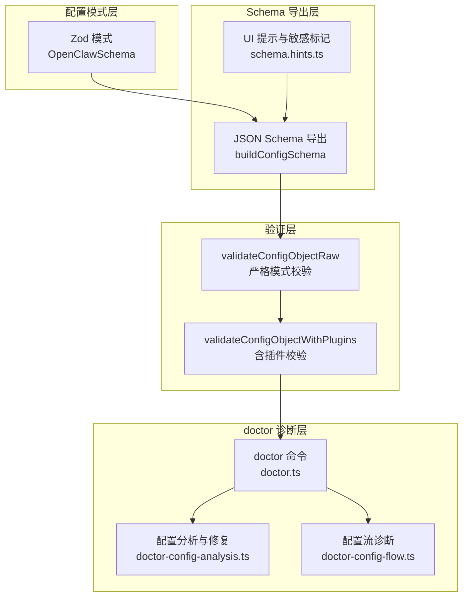
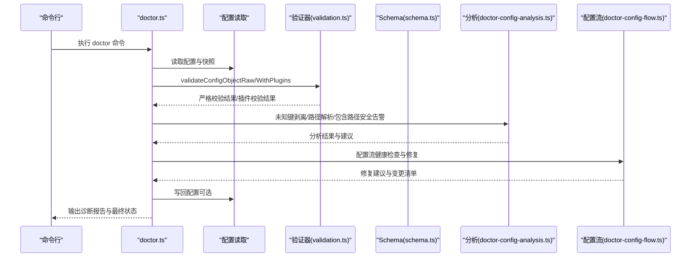
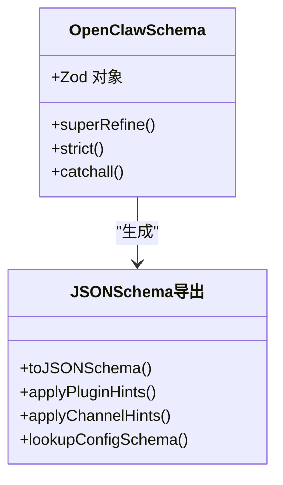
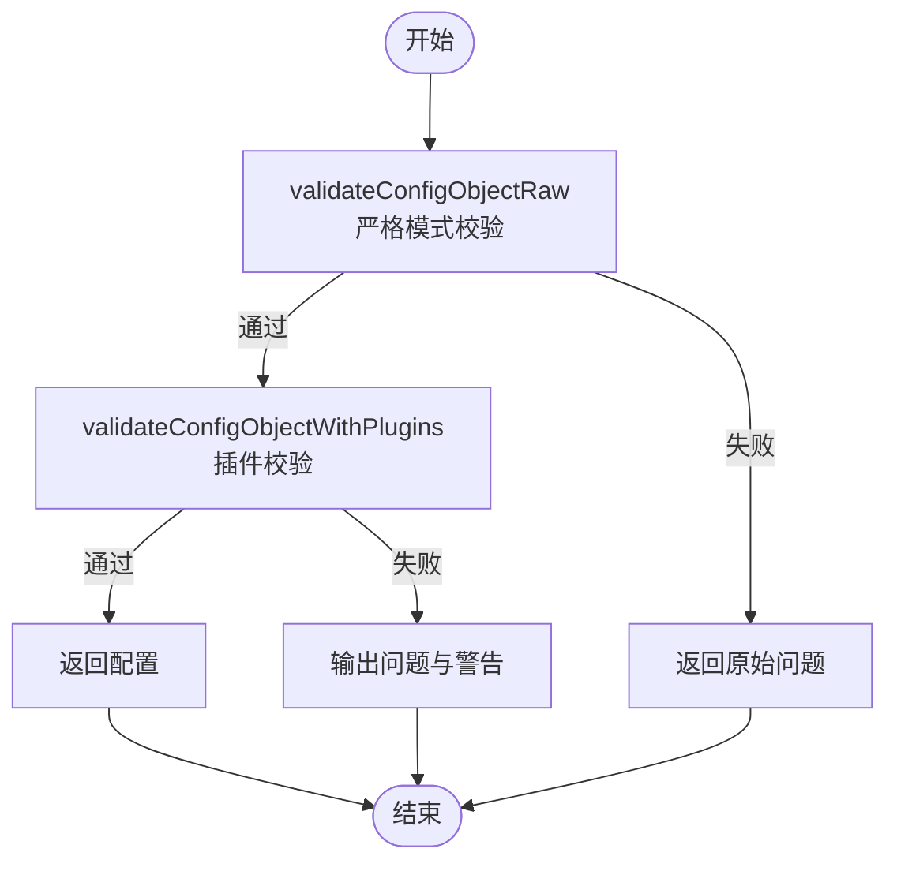
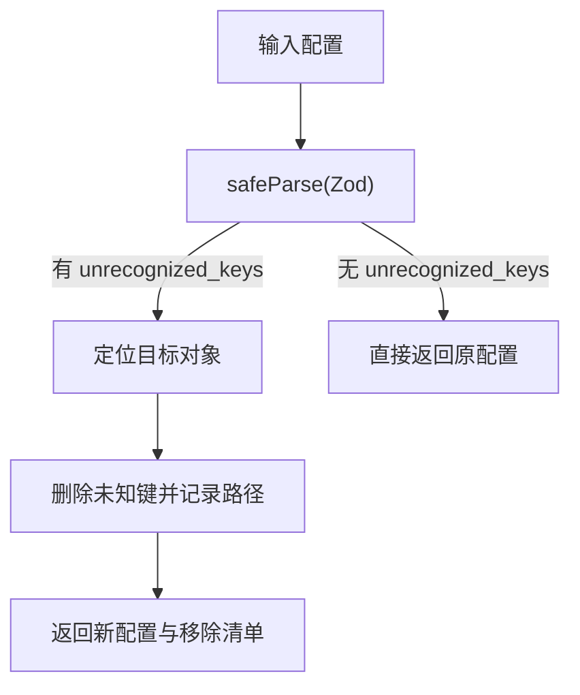
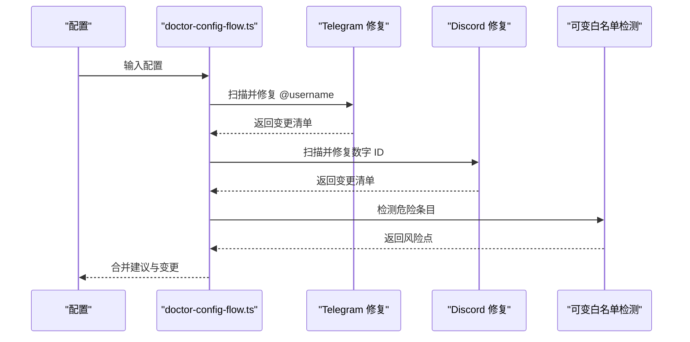
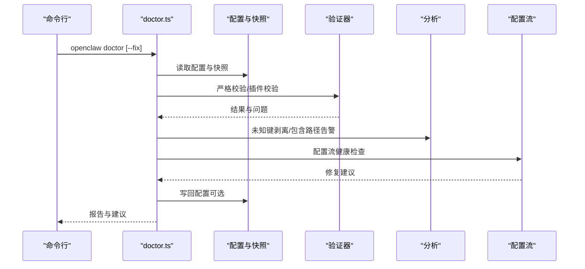
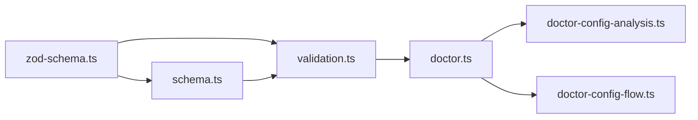

# 配置验证

<cite>
**本文引用的文件**
- [src/commands/doctor.ts](file://src/commands/doctor.ts)
- [src/commands/doctor-config-analysis.ts](file://src/commands/doctor-config-analysis.ts)
- [src/commands/doctor-config-flow.ts](file://src/commands/doctor-config-flow.ts)
- [src/config/validation.ts](file://src/config/validation.ts)
- [src/config/schema.ts](file://src/config/schema.ts)
- [src/config/zod-schema.ts](file://src/config/zod-schema.ts)
- [src/config/issue-format.ts](file://src/config/issue-format.ts)
- [src/config/types.ts](file://src/config/types.ts)
</cite>

## 目录
1. [简介](#简介)
2. [项目结构](#项目结构)
3. [核心组件](#核心组件)
4. [架构总览](#架构总览)
5. [详细组件分析](#详细组件分析)
6. [依赖关系分析](#依赖关系分析)
7. [性能考量](#性能考量)
8. [故障排查指南](#故障排查指南)
9. [结论](#结论)
10. [附录](#附录)

## 简介
本指南面向 OpenClaw 的配置验证与 doctor 命令诊断能力，系统阐述以下内容：
- 配置验证规则与错误类型：类型检查、值范围校验、未知键处理、插件 schema 校验、通道与心跳目标校验等。
- 严格验证机制：原始校验与应用默认后的差异、严格模式下的“零容忍”策略。
- doctor 命令的诊断流程：配置健康检查、错误定位、自动修复建议与交互式确认。
- 常见失败原因与排查步骤：典型错误路径、修复建议、调试技巧与最佳实践。

## 项目结构
OpenClaw 的配置验证与 doctor 诊断由“配置模式定义（Zod）+ 统一 Schema + 运行时验证 + doctor 诊断流程”构成：
- 模式层：基于 Zod 定义的 OpenClawSchema，覆盖所有配置字段的类型、约束与超细化校验。
- Schema 层：将 Zod 模式导出为 JSON Schema，并注入 UI 提示、敏感字段标记与插件/通道扩展 schema。
- 验证层：在不应用运行时默认值的情况下进行严格校验；随后可选择性应用默认值并进行插件 schema 校验。
- 诊断层：doctor 命令按模块化流程执行健康检查、错误定位与修复建议，并支持交互式修复与写回。

图表来源
- [src/config/zod-schema.ts](file://src/config/zod-schema.ts)
- [src/config/schema.ts](file://src/config/schema.ts)
- [src/config/validation.ts](file://src/config/validation.ts)
- [src/commands/doctor.ts](file://src/commands/doctor.ts)
- [src/commands/doctor-config-analysis.ts](file://src/commands/doctor-config-analysis.ts)
- [src/commands/doctor-config-flow.ts](file://src/commands/doctor-config-flow.ts)

章节来源
- [src/config/zod-schema.ts](file://src/config/zod-schema.ts)
- [src/config/schema.ts](file://src/config/schema.ts)
- [src/config/validation.ts](file://src/config/validation.ts)
- [src/commands/doctor.ts](file://src/commands/doctor.ts)

## 核心组件
- Zod 模式定义（OpenClawSchema）
  - 覆盖全局字段、模型、通道、网关、会话、钩子、浏览器、UI、日志、更新、Cron 等完整配置树。
  - 使用 superRefine、strict、catchall 等特性实现复杂约束与扩展属性处理。
- JSON Schema 导出与 UI 提示
  - 将 Zod 模式转换为 JSON Schema，注入 UI 标签、帮助文本、敏感字段标记与派生标签。
  - 支持按插件与通道动态合并 schema 与提示。
- 验证器
  - validateConfigObjectRaw：严格模式，不做默认值填充，返回原始问题列表。
  - validateConfigObject：在严格校验基础上应用默认值，适合写回场景。
  - validateConfigObjectWithPlugins：在严格校验基础上，加载插件注册表并校验插件配置 schema。
- doctor 诊断
  - doctor.ts：统一入口，串联各模块诊断与修复。
  - doctor-config-analysis.ts：未知键剥离、路径格式化、包含路径安全警告、OpenCode Provider 覆盖提示。
  - doctor-config-flow.ts：配置流健康检查（账户默认值、绑定覆盖、Telegram/Discord 允许列表修复、可变白名单检测等）。

章节来源
- [src/config/zod-schema.ts](file://src/config/zod-schema.ts)
- [src/config/schema.ts](file://src/config/schema.ts)
- [src/config/validation.ts](file://src/config/validation.ts)
- [src/commands/doctor.ts](file://src/commands/doctor.ts)
- [src/commands/doctor-config-analysis.ts](file://src/commands/doctor-config-analysis.ts)
- [src/commands/doctor-config-flow.ts](file://src/commands/doctor-config-flow.ts)

## 架构总览
下图展示 doctor 命令如何调用配置验证与分析模块，完成从“读取配置 → 严格校验 → 插件校验 → 诊断修复 → 写回”的闭环。

图表来源
- [src/commands/doctor.ts](file://src/commands/doctor.ts)
- [src/config/validation.ts](file://src/config/validation.ts)
- [src/config/schema.ts](file://src/config/schema.ts)
- [src/commands/doctor-config-analysis.ts](file://src/commands/doctor-config-analysis.ts)
- [src/commands/doctor-config-flow.ts](file://src/commands/doctor-config-flow.ts)

## 详细组件分析

### 组件 A：Zod 模式与 JSON Schema 导出
- Zod 模式职责
  - 类型与范围约束：如数值范围、枚举集合、URL 协议限定、时间戳转换、字节大小解析等。
  - 复杂字段超细化：如 talk.provider 与 providers 的一致性校验、Cron 字段的单位合法性校验。
  - 扩展属性处理：env.catchall、通道与插件 entries 的 additionalProperties。
- JSON Schema 导出
  - 将 Zod 模式转换为 JSON Schema，保留类型、枚举、最小最大值等元数据。
  - 注入 UI 提示与敏感标记，支持按插件/通道动态合并 schema。
  - 提供路径查找与子节点枚举能力，用于 UI 表单生成与提示。

图表来源
- [src/config/zod-schema.ts](file://src/config/zod-schema.ts)
- [src/config/schema.ts](file://src/config/schema.ts)

章节来源
- [src/config/zod-schema.ts](file://src/config/zod-schema.ts)
- [src/config/schema.ts](file://src/config/schema.ts)

### 组件 B：严格验证与插件校验
- 严格验证（validateConfigObjectRaw）
  - 不应用运行时默认值，直接基于 Zod 模式校验。
  - 返回原始问题列表，包含路径、消息与可选的允许值提示。
- 插件校验（validateConfigObjectWithPlugins）
  - 加载插件注册表，收集已知插件 ID 并校验每个插件的配置 schema。
  - 若插件未找到或 schema 缺失，输出相应问题或警告。
  - 对启用但存在配置的禁用插件，输出“配置存在但被禁用”的警告。

图表来源
- [src/config/validation.ts](file://src/config/validation.ts)

章节来源
- [src/config/validation.ts](file://src/config/validation.ts)

### 组件 C：doctor 配置分析与修复
- 未知键剥离（stripUnknownConfigKeys）
  - 识别 unrecognized_keys 问题，递归定位目标对象，删除未知键，记录移除路径。
- 路径格式化与目标解析（formatConfigPath、resolveConfigPathTarget）
  - 将 Zod issues 中的路径数组格式化为可读字符串，支持数组索引与对象键。
  - 安全解析嵌套路径，避免越界与类型不匹配。
- 包含路径安全告警（noteIncludeConfinementWarning）
  - 检测 $include 是否逃逸配置目录，给出移动与相对路径修正建议。
- OpenCode Provider 覆盖提示（noteOpencodeProviderOverrides）
  - 当 models.providers 下设置自定义 Provider 时，提示其会覆盖内置目录路由与成本计算。

图表来源
- [src/commands/doctor-config-analysis.ts](file://src/commands/doctor-config-analysis.ts)

章节来源
- [src/commands/doctor-config-analysis.ts](file://src/commands/doctor-config-analysis.ts)

### 组件 D：doctor 配置流健康检查
- 默认账户与绑定覆盖
  - 检查 channels 下某通道是否配置了多个账户但未设置 accounts.default，或绑定仅覆盖部分账户。
  - 提示添加显式默认账户或补充绑定项。
- Telegram 允许列表修复
  - 自动将 @username 解析为 numeric user id，去重并替换，支持多 token 回退。
- Discord 数字 ID 修复
  - 将 allowFrom 等列表中的数字 ID 转换为字符串，保持一致类型。
- 可变白名单检测
  - 检测允许列表中可能引发危险名称匹配的条目，结合开关路径提示修复。

图表来源
- [src/commands/doctor-config-flow.ts](file://src/commands/doctor-config-flow.ts)

章节来源
- [src/commands/doctor-config-flow.ts](file://src/commands/doctor-config-flow.ts)

### 组件 E：doctor 命令主流程
- 读取与迁移配置、打印安装与环境提示、检查 UI 协议新鲜度。
- 诊断网关模式与认证配置，必要时生成网关 token。
- 检测并迁移遗留状态、检查工作区与引导文件大小、沙箱镜像与安全警告。
- 检查 Hooks Gmail 模型引用、Linux systemd 用户服务留驻、内存搜索健康状态。
- 最终输出诊断报告，若需要写回则持久化配置并输出备份位置。

图表来源
- [src/commands/doctor.ts](file://src/commands/doctor.ts)

章节来源
- [src/commands/doctor.ts](file://src/commands/doctor.ts)

## 依赖关系分析
- 模块耦合
  - doctor.ts 作为编排者，依赖验证器与分析模块；验证器依赖 Zod 模式与 Schema；Schema 依赖 Zod 模式。
  - doctor-config-flow.ts 依赖 channels、telegram、pairing、routing 等模块以实现具体修复逻辑。
- 外部依赖
  - Zod：类型与约束校验核心。
  - JSON Schema：UI 与工具链集成的基础。
- 循环依赖
  - 代码组织上采用“模式 → 导出 → 验证 → 诊断”的单向依赖，未发现循环依赖迹象。

图表来源
- [src/config/zod-schema.ts](file://src/config/zod-schema.ts)
- [src/config/schema.ts](file://src/config/schema.ts)
- [src/config/validation.ts](file://src/config/validation.ts)
- [src/commands/doctor.ts](file://src/commands/doctor.ts)
- [src/commands/doctor-config-analysis.ts](file://src/commands/doctor-config-analysis.ts)
- [src/commands/doctor-config-flow.ts](file://src/commands/doctor-config-flow.ts)

章节来源
- [src/config/zod-schema.ts](file://src/config/zod-schema.ts)
- [src/config/schema.ts](file://src/config/schema.ts)
- [src/config/validation.ts](file://src/config/validation.ts)
- [src/commands/doctor.ts](file://src/commands/doctor.ts)
- [src/commands/doctor-config-analysis.ts](file://src/commands/doctor-config-analysis.ts)
- [src/commands/doctor-config-flow.ts](file://src/commands/doctor-config-flow.ts)

## 性能考量
- Zod safeParse 与 JSON Schema 导出
  - Zod 校验为线性复杂度，受配置层级与字段数量影响；对大型配置树应避免重复解析。
  - JSON Schema 导出与缓存：schema.ts 对基础 schema 与合并后的 schema 进行缓存，减少重复构建开销。
- doctor 诊断
  - Telegram/Discord 修复涉及网络请求与去重，建议在非交互模式下限制并发与超时。
  - 插件校验按插件逐项进行，建议在插件数量较多时分批处理或并行优化。

## 故障排查指南
- 常见错误类型与解读
  - 类型错误：字段类型不符（如数字期望字符串），Zod 会给出期望类型与实际值摘要。
  - 枚举/范围错误：值不在允许集合内或超出范围，验证器会附加允许值摘要与隐藏计数。
  - 未知键：配置包含未在模式中声明的键，doctor-config-analysis 会剥离并记录移除路径。
  - 插件缺失/Schema 缺失：插件 ID 不存在或缺少配置 schema，输出问题或警告。
  - 通道与心跳目标：未知通道 ID 或心跳目标无效，需使用已知通道或修正为目标。
- 错误定位
  - 使用 formatConfigIssueLines 与 normalizeConfigIssuePath 获取标准化路径与消息。
  - doctor-config-analysis 的 formatConfigPath 与 resolveConfigPathTarget 可将路径数组转为可读字符串并安全解析嵌套对象。
- 修复建议
  - 未知键：删除未知键或迁移到正确位置；doctor-config-analysis 会自动剥离未知键并返回移除清单。
  - Telegram 允许列表：将 @username 替换为 numeric id；若无可用 token，提示先配置再修复。
  - Discord 数字 ID：将数字 ID 转为字符串，保持类型一致。
  - OpenCode Provider：移除自定义覆盖以恢复内置目录路由与成本计算。
  - 包含路径：确保 $include 在配置目录内，使用相对路径 ./shared/common.json。
- 调试技巧
  - 使用 validateConfigObjectRaw 获取严格模式结果，便于区分“原始错误”与“默认值导致的合法化”。
  - 在 doctor --fix 非交互模式下谨慎使用，先在非交互模式下预览建议，再决定是否写回。
  - 对插件配置问题，优先检查插件 ID 是否存在于注册表，再核对插件 schema。
- 最佳实践
  - 保持配置最小化与显式化：明确设置默认账户、显式绑定、通道 ID 与心跳目标。
  - 使用 JSON Schema 生成 UI 表单与提示，提升编辑体验与准确性。
  - 定期运行 doctor 命令，及时发现并修复潜在问题。

章节来源
- [src/config/validation.ts](file://src/config/validation.ts)
- [src/config/issue-format.ts](file://src/config/issue-format.ts)
- [src/commands/doctor-config-analysis.ts](file://src/commands/doctor-config-analysis.ts)
- [src/commands/doctor-config-flow.ts](file://src/commands/doctor-config-flow.ts)

## 结论
OpenClaw 的配置验证体系以 Zod 模式为核心，结合 JSON Schema 导出与 doctor 诊断流程，实现了从“严格校验 → 插件校验 → 流程修复 → 写回”的闭环。通过标准化的错误格式化与路径解析，doctor 能够快速定位问题并提供可操作的修复建议。遵循本文的规则与最佳实践，可显著提升配置质量与系统稳定性。

## 附录
- 关键类型与模块
  - ConfigValidationIssue：验证问题结构，包含 path、message、可选 allowedValues 与隐藏计数。
  - OpenClawSchema：Zod 模式根，覆盖全部配置字段与约束。
  - ConfigSchemaResponse：JSON Schema 与 UI 提示响应体。
- 常用工具函数
  - formatConfigIssueLine/formatConfigIssueLines：格式化问题输出。
  - formatConfigPath/resolveConfigPathTarget：路径格式化与安全解析。
  - stripUnknownConfigKeys：未知键剥离与移除清单生成。

章节来源
- [src/config/types.ts](file://src/config/types.ts)
- [src/config/zod-schema.ts](file://src/config/zod-schema.ts)
- [src/config/schema.ts](file://src/config/schema.ts)
- [src/config/issue-format.ts](file://src/config/issue-format.ts)
- [src/commands/doctor-config-analysis.ts](file://src/commands/doctor-config-analysis.ts)