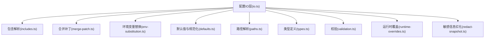
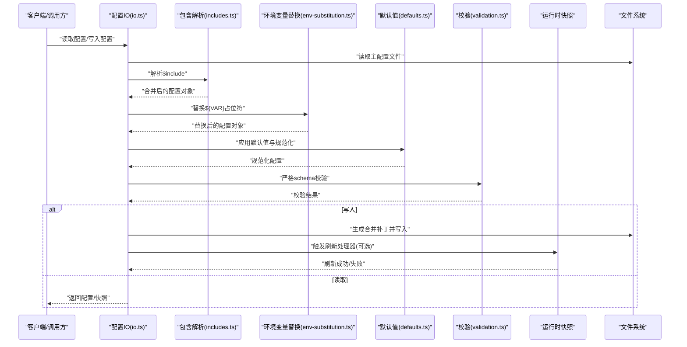
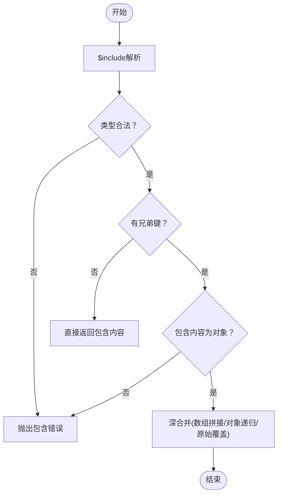
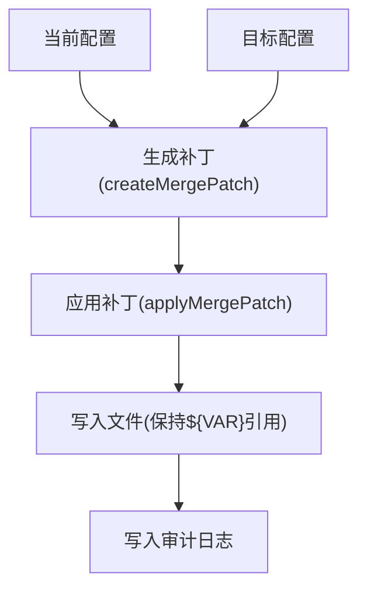
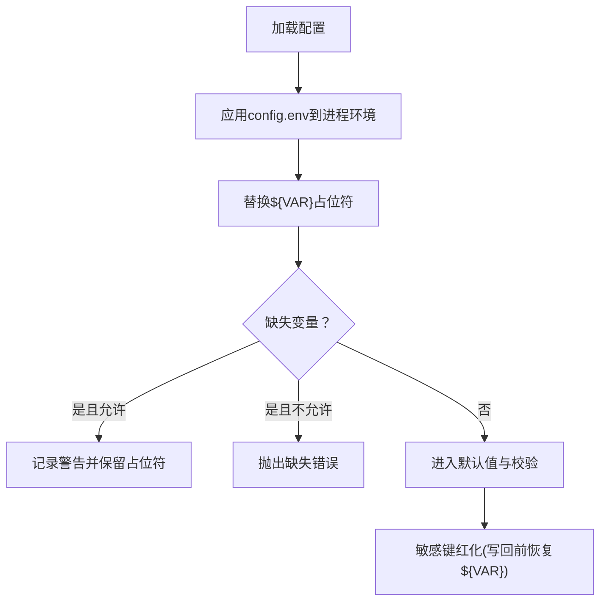
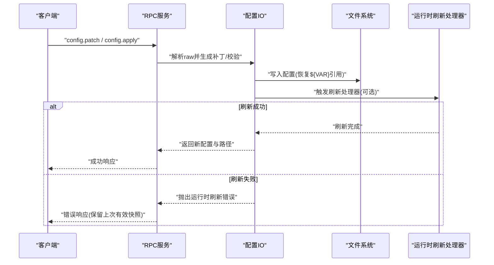
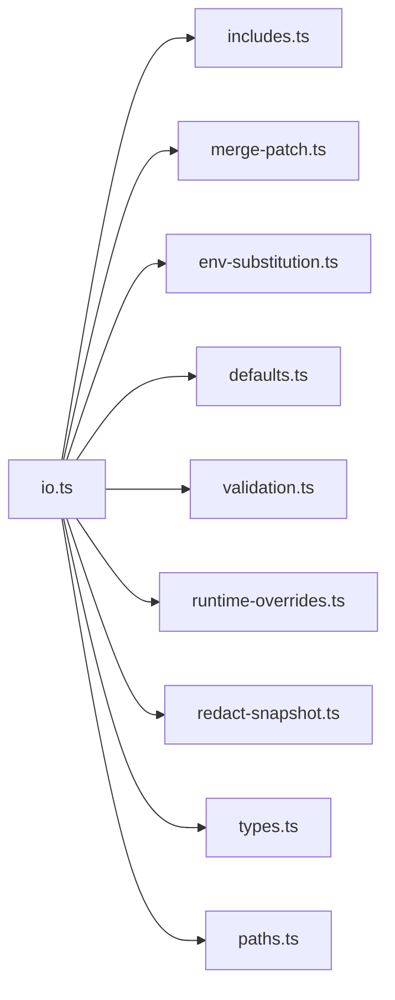

# 高级配置

<cite>
**本文引用的文件**
- [src/config/io.ts](file://src/config/io.ts)
- [src/config/includes.ts](file://src/config/includes.ts)
- [src/config/merge-patch.ts](file://src/config/merge-patch.ts)
- [src/config/env-substitution.ts](file://src/config/env-substitution.ts)
- [src/config/env-vars.ts](file://src/config/env-vars.ts)
- [src/config/redact-snapshot.ts](file://src/config/redact-snapshot.ts)
- [src/config/types.ts](file://src/config/types.ts)
- [src/config/validation.ts](file://src/config/validation.ts)
- [src/config/paths.ts](file://src/config/paths.ts)
- [src/config/defaults.ts](file://src/config/defaults.ts)
- [src/config/runtime-overrides.ts](file://src/config/runtime-overrides.ts)
- [src/config/config.ts](file://src/config/config.ts)
- [src/gateway/server.config-patch.test.ts](file://src/gateway/server.config-patch.test.ts)
- [apps/macos/Sources/OpenClawProtocol/GatewayModels.swift](file://apps/macos/Sources/OpenClawProtocol/GatewayModels.swift)
- [apps/shared/OpenClawKit/Sources/OpenClawProtocol/GatewayModels.swift](file://apps/shared/OpenClawKit/Sources/OpenClawProtocol/GatewayModels.swift)
- [docs/cli/index.md](file://docs/cli/index.md)
</cite>

## 目录
1. [简介](#简介)
2. [项目结构](#项目结构)
3. [核心组件](#核心组件)
4. [架构总览](#架构总览)
5. [详细组件分析](#详细组件分析)
6. [依赖关系分析](#依赖关系分析)
7. [性能考量](#性能考量)
8. [故障排查指南](#故障排查指南)
9. [结论](#结论)
10. [附录](#附录)

## 简介
本文件面向OpenClaw高级用户与集成开发者，系统性阐述“高级配置”能力：包括$include文件组织与多文件配置管理、配置合并规则、配置热重载模式、配置RPC接口（config.apply、config.patch）的使用与错误处理、环境变量导入与变量替换、SecretRef密钥管理与敏感信息保护等。文档同时提供复杂场景下的配置模板与优化建议，帮助在生产环境中安全、可维护地管理配置。

## 项目结构
OpenClaw的配置子系统位于src/config目录，围绕以下关键模块协作：
- IO层：负责配置读取、快照、写入、缓存与运行时快照管理
- 包含解析：支持$include指令，实现多文件模块化配置
- 合并补丁：提供对象与数组的增量合并策略
- 环境变量：支持${VAR}语法替换，并提供安全的缺失变量处理
- 校验与默认值：加载后应用默认值与严格校验
- 路径与类型：统一配置路径解析与类型定义
- 运行时覆盖：允许外部注入运行时覆盖项
- 安全与审计：敏感信息红化与写入审计日志

图表来源
- [src/config/io.ts:1-1560](file://src/config/io.ts#L1-1560)
- [src/config/includes.ts:1-347](file://src/config/includes.ts#L1-347)
- [src/config/merge-patch.ts:1-98](file://src/config/merge-patch.ts#L1-98)
- [src/config/env-substitution.ts:1-204](file://src/config/env-substitution.ts#L1-204)
- [src/config/defaults.ts:1-200](file://src/config/defaults.ts#L1-200)
- [src/config/paths.ts:1-200](file://src/config/paths.ts#L1-200)
- [src/config/types.ts:1-200](file://src/config/types.ts#L1-200)
- [src/config/validation.ts:1-200](file://src/config/validation.ts#L1-200)
- [src/config/runtime-overrides.ts:1-200](file://src/config/runtime-overrides.ts#L1-200)
- [src/config/redact-snapshot.ts:1-200](file://src/config/redact-snapshot.ts#L1-200)

章节来源
- [src/config/io.ts:1-1560](file://src/config/io.ts#L1-1560)
- [src/config/includes.ts:1-347](file://src/config/includes.ts#L1-347)
- [src/config/merge-patch.ts:1-98](file://src/config/merge-patch.ts#L1-98)
- [src/config/env-substitution.ts:1-204](file://src/config/env-substitution.ts#L1-204)
- [src/config/defaults.ts:1-200](file://src/config/defaults.ts#L1-200)
- [src/config/paths.ts:1-200](file://src/config/paths.ts#L1-200)
- [src/config/types.ts:1-200](file://src/config/types.ts#L1-200)
- [src/config/validation.ts:1-200](file://src/config/validation.ts#L1-200)
- [src/config/runtime-overrides.ts:1-200](file://src/config/runtime-overrides.ts#L1-200)
- [src/config/redact-snapshot.ts:1-200](file://src/config/redact-snapshot.ts#L1-200)

## 核心组件
- 配置IO与快照
  - 提供loadConfig、readConfigFileSnapshot、writeConfigFile等核心API
  - 支持运行时配置快照与源快照投影，保障并发读取一致性
  - 写入时进行合并补丁生成与环境变量引用恢复，避免凭空写入敏感值
- $include多文件组织
  - 支持字符串或数组形式的$include，递归深度限制与路径安全检查
  - 深度合并规则：数组拼接、对象递归合并、原始值覆盖
- 合并补丁与增量更新
  - 对象字段按需覆盖；数组支持按id键控的合并，避免整数组替换
  - 生成最小变更补丁，用于写回与审计
- 环境变量导入与替换
  - 支持${VAR}语法；可选择缺失时不抛错而记录警告
  - 写回时基于快照恢复被替换的${VAR}引用
- 默认值与校验
  - 加载后应用模型、会话、消息、日志、压缩、上下文修剪等默认值
  - 使用严格schema校验，失败时返回结构化问题列表
- 运行时覆盖与热重载
  - 支持设置运行时快照刷新处理器，写入后触发刷新或重启流程
  - 提供缓存控制与快照投影，确保读取一致性
- 安全与审计
  - 敏感键红化；写入审计日志记录变更摘要与可疑行为

章节来源
- [src/config/io.ts:1-1560](file://src/config/io.ts#L1-1560)
- [src/config/includes.ts:1-347](file://src/config/includes.ts#L1-347)
- [src/config/merge-patch.ts:1-98](file://src/config/merge-patch.ts#L1-98)
- [src/config/env-substitution.ts:1-204](file://src/config/env-substitution.ts#L1-204)
- [src/config/env-vars.ts:1-200](file://src/config/env-vars.ts#L1-200)
- [src/config/redact-snapshot.ts:1-200](file://src/config/redact-snapshot.ts#L1-200)
- [src/config/types.ts:1-200](file://src/config/types.ts#L1-200)
- [src/config/validation.ts:1-200](file://src/config/validation.ts#L1-200)
- [src/config/defaults.ts:1-200](file://src/config/defaults.ts#L1-200)
- [src/config/runtime-overrides.ts:1-200](file://src/config/runtime-overrides.ts#L1-200)

## 架构总览
下图展示从配置文件到运行时配置的整体流程，包括包含解析、环境变量替换、默认值应用、校验、写入与热重载刷新。

图表来源
- [src/config/io.ts:680-1067](file://src/config/io.ts#L680-1067)
- [src/config/includes.ts:340-347](file://src/config/includes.ts#L340-347)
- [src/config/env-substitution.ts:197-204](file://src/config/env-substitution.ts#L197-204)
- [src/config/merge-patch.ts:62-98](file://src/config/merge-patch.ts#L62-98)
- [src/config/defaults.ts:1-200](file://src/config/defaults.ts#L1-200)
- [src/config/validation.ts:1-200](file://src/config/validation.ts#L1-200)

章节来源
- [src/config/io.ts:680-1067](file://src/config/io.ts#L680-1067)
- [src/config/includes.ts:340-347](file://src/config/includes.ts#L340-347)
- [src/config/env-substitution.ts:197-204](file://src/config/env-substitution.ts#L197-204)
- [src/config/merge-patch.ts:62-98](file://src/config/merge-patch.ts#L62-98)
- [src/config/defaults.ts:1-200](file://src/config/defaults.ts#L1-200)
- [src/config/validation.ts:1-200](file://src/config/validation.ts#L1-200)

## 详细组件分析

### $include文件组织与多文件配置管理
- 语法与行为
  - 支持单文件或文件数组；当存在其他键时，要求包含内容为对象，否则抛出错误
  - 深度合并规则：数组拼接、对象递归合并、原始值覆盖
  - 最大包含深度与文件大小限制，防止资源滥用
- 安全性
  - 严格路径白盒检查，拒绝逃逸根目录与符号链接绕过
  - 可选边界文件读取器，限制最大字节数与禁止硬链接
- 多文件组织建议
  - 将通用默认值放入基础文件，按通道/功能拆分覆盖文件，通过$include组合
  - 使用数组形式$include时，明确覆盖顺序以保证最终语义正确

图表来源
- [src/config/includes.ts:69-153](file://src/config/includes.ts#L69-153)
- [src/config/includes.ts:178-278](file://src/config/includes.ts#L178-278)

章节来源
- [src/config/includes.ts:1-347](file://src/config/includes.ts#L1-347)

### 配置合并规则与补丁生成
- 合并策略
  - 对象字段：仅覆盖非空补丁字段；嵌套对象递归合并
  - 数组：默认整组替换；支持按id键控的特殊合并，避免删除无关条目
- 补丁生成
  - 基于当前配置与目标配置生成最小补丁，写回时仅持久化变更
  - 写回前对包含文件中的${VAR}引用进行恢复，避免凭空写入明文
- 写入选项
  - 支持unsetPaths显式移除某些路径，确保schema默认不会回写

图表来源
- [src/config/io.ts:1086-1333](file://src/config/io.ts#L1086-1333)
- [src/config/merge-patch.ts:62-98](file://src/config/merge-patch.ts#L62-98)

章节来源
- [src/config/merge-patch.ts:1-98](file://src/config/merge-patch.ts#L1-98)
- [src/config/io.ts:1086-1333](file://src/config/io.ts#L1086-1333)

### 环境变量导入、变量替换与SecretRef密钥管理
- 环境变量导入
  - 在读取阶段先应用config.env到进程环境，再进行${VAR}替换
  - 支持shell环境回退机制，按期望键集自动填充
- 变量替换
  - 支持${VAR}与$${}转义；缺失变量可选择抛错或记录警告并保留占位符
  - 写回时基于加载时的环境快照恢复${VAR}引用，避免凭空写入明文
- SecretRef密钥管理
  - 配置快照红化策略：对敏感动态键（如env.*、skills.entries.*.env.*）进行红化
  - 保留回写时的引用恢复能力，确保编辑体验与安全性平衡

图表来源
- [src/config/io.ts:700-780](file://src/config/io.ts#L700-780)
- [src/config/env-substitution.ts:83-135](file://src/config/env-substitution.ts#L83-135)
- [src/config/redact-snapshot.ts:1-200](file://src/config/redact-snapshot.ts#L1-200)

章节来源
- [src/config/env-substitution.ts:1-204](file://src/config/env-substitution.ts#L1-204)
- [src/config/env-vars.ts:1-200](file://src/config/env-vars.ts#L1-200)
- [src/config/redact-snapshot.ts:1-200](file://src/config/redact-snapshot.ts#L1-200)
- [src/config/io.ts:700-780](file://src/config/io.ts#L700-780)

### 配置热重载模式与适用场景
- 模式概览
  - hybrid：写入后尝试刷新运行时快照，失败则回滚并清理快照
  - hot：写入后立即刷新运行时快照，适用于低风险变更
  - restart：写入后触发重启流程，适用于涉及绑定端口、网关模式等高风险变更
  - off：写入后不刷新，保持从磁盘读取，适合离线/只读场景
- 选择建议
  - 仅修改非关键字段（如日志级别、会话参数）时使用hot
  - 修改网络绑定、网关模式、认证令牌等时使用restart
  - 需要渐进式验证与快速回滚时使用hybrid
  - 离线/只读场景使用off
- 刷新处理器
  - 通过设置运行时快照刷新处理器，写入后由处理器决定是否刷新或重启
  - 刷新失败时抛出专用错误，提示写入已发生但运行时未更新

章节来源
- [src/config/io.ts:1461-1559](file://src/config/io.ts#L1461-1559)

### 配置RPC接口：config.apply 与 config.patch
- 接口能力
  - config.patch：接收对象形式的增量补丁，应用后触发重启与唤醒
  - config.apply：接收完整配置的JSON字符串，执行严格校验、写入与重启
- 参数说明
  - config.patch
    - raw：JSON字符串，表示待应用的补丁对象
    - baseHash：当前配置哈希，用于冲突检测
    - sessionKey：会话标识（可选）
    - note：变更备注（可选）
    - restartDelayMs：重启延迟（可选）
  - config.apply
    - raw：JSON字符串，表示完整配置
    - baseHash：当前配置哈希
    - sessionKey：会话标识（可选）
    - note：变更备注（可选）
    - restartDelayMs：重启延迟（可选）
- 错误处理
  - 校验失败时返回结构化问题列表，并在顶层消息中汇总关键问题
  - 对无效参数（如路径包含非法字符）进行拒绝
  - 写入后若运行时刷新失败，抛出专用错误并保留最后一次有效快照
- 平台模型
  - 客户端侧模型定义包含上述参数，便于跨平台调用

图表来源
- [src/gateway/server.config-patch.test.ts:49-181](file://src/gateway/server.config-patch.test.ts#L49-181)
- [apps/macos/Sources/OpenClawProtocol/GatewayModels.swift:1553-1581](file://apps/macos/Sources/OpenClawProtocol/GatewayModels.swift#L1553-L1581)
- [apps/shared/OpenClawKit/Sources/OpenClawProtocol/GatewayModels.swift:1553-1581](file://apps/shared/OpenClawKit/Sources/OpenClawProtocol/GatewayModels.swift#L1553-L1581)
- [src/config/io.ts:1507-1559](file://src/config/io.ts#L1507-1559)

章节来源
- [src/gateway/server.config-patch.test.ts:49-181](file://src/gateway/server.config-patch.test.ts#L49-181)
- [apps/macos/Sources/OpenClawProtocol/GatewayModels.swift:1553-1581](file://apps/macos/Sources/OpenClawProtocol/GatewayModels.swift#L1553-L1581)
- [apps/shared/OpenClawKit/Sources/OpenClawProtocol/GatewayModels.swift:1553-1581](file://apps/shared/OpenClawKit/Sources/OpenClawProtocol/GatewayModels.swift#L1553-L1581)
- [src/config/io.ts:1507-1559](file://src/config/io.ts#L1507-1559)
- [docs/cli/index.md:827-828](file://docs/cli/index.md#L827-L828)

### 复杂场景模板与优化建议
- 多租户/多通道配置
  - 基础配置：包含默认模型、会话、日志与消息参数
  - 通道覆盖：分别定义各通道的认证与路由参数
  - 合并策略：使用$include数组按“基础→通道→运行时覆盖”的顺序合并
- 环境隔离
  - 使用${ENV_VAR}占位符承载令牌与密钥；在CI/CD中通过环境注入
  - 对外暴露的配置文件仅保留${VAR}引用，避免明文泄露
- 热重载策略
  - 非关键参数（如日志级别）使用hot；网络绑定与网关模式使用restart
  - 对高风险变更增加baseHash校验与变更备注，便于审计
- 性能与可靠性
  - 启用配置缓存（通过环境变量控制），减少频繁读取开销
  - 对包含文件进行大小限制与深度限制，避免过大配置导致内存压力

章节来源
- [src/config/includes.ts:21-24](file://src/config/includes.ts#L21-24)
- [src/config/io.ts:1360-1380](file://src/config/io.ts#L1360-1380)
- [src/config/env-substitution.ts:197-204](file://src/config/env-substitution.ts#L197-204)
- [src/config/merge-patch.ts:62-98](file://src/config/merge-patch.ts#L62-98)

## 依赖关系分析
- 组件耦合
  - IO层聚合包含解析、环境变量替换、默认值、校验、运行时覆盖等模块
  - 合并补丁与包含解析相互独立，但共同服务于写回与快照投影
- 外部依赖
  - 文件系统与JSON5解析库
  - 进程环境与路径解析工具
- 循环依赖
  - 通过导出函数与类型解耦，避免循环导入

图表来源
- [src/config/io.ts:1-1560](file://src/config/io.ts#L1-1560)
- [src/config/includes.ts:1-347](file://src/config/includes.ts#L1-347)
- [src/config/merge-patch.ts:1-98](file://src/config/merge-patch.ts#L1-98)
- [src/config/env-substitution.ts:1-204](file://src/config/env-substitution.ts#L1-204)
- [src/config/defaults.ts:1-200](file://src/config/defaults.ts#L1-200)
- [src/config/validation.ts:1-200](file://src/config/validation.ts#L1-200)
- [src/config/runtime-overrides.ts:1-200](file://src/config/runtime-overrides.ts#L1-200)
- [src/config/redact-snapshot.ts:1-200](file://src/config/redact-snapshot.ts#L1-200)
- [src/config/types.ts:1-200](file://src/config/types.ts#L1-200)
- [src/config/paths.ts:1-200](file://src/config/paths.ts#L1-200)

章节来源
- [src/config/io.ts:1-1560](file://src/config/io.ts#L1-1560)

## 性能考量
- 缓存策略
  - 通过环境变量控制配置缓存时长，默认启用短缓存以平衡一致性与性能
- 写入优化
  - 仅写入变更补丁，避免全量写回
  - 写入前进行合并补丁生成与环境引用恢复，减少后续解析成本
- 安全读取
  - 包含文件读取支持边界文件打开，限制最大字节数与禁止硬链接，降低攻击面

章节来源
- [src/config/io.ts:1360-1380](file://src/config/io.ts#L1360-1380)
- [src/config/includes.ts:289-324](file://src/config/includes.ts#L289-324)

## 故障排查指南
- 常见错误与定位
  - 包含错误：检查$include路径是否逃逸根目录、符号链接绕过或超出最大深度
  - 环境变量缺失：确认进程环境或config.env是否正确设置；必要时使用警告模式保留占位符
  - 校验失败：根据错误消息定位具体路径，修正schema不匹配字段
  - 写入失败：检查权限与磁盘空间；关注写入审计日志中的可疑原因
  - 刷新失败：查看运行时刷新处理器返回状态，必要时回滚至上次有效快照
- 审计与诊断
  - 查看配置审计日志，获取变更摘要、哈希、路径变化数量与可疑行为标记
  - 使用best-effort读取接口在无效配置时仍可获得可用配置

章节来源
- [src/config/includes.ts:198-222](file://src/config/includes.ts#L198-222)
- [src/config/env-substitution.ts:29-37](file://src/config/env-substitution.ts#L29-37)
- [src/config/io.ts:944-965](file://src/config/io.ts#L944-965)
- [src/config/io.ts:1269-1333](file://src/config/io.ts#L1269-1333)
- [src/config/io.ts:1534-1546](file://src/config/io.ts#L1534-1546)

## 结论
OpenClaw的高级配置体系通过$include模块化、严格的合并补丁与环境变量替换、完善的默认值与校验、以及安全的写入与热重载机制，实现了在复杂场景下的可维护性与安全性。结合本文提供的模板与最佳实践，可在生产环境中稳定地管理配置变更，降低运维风险并提升开发效率。

## 附录
- CLI参考
  - config.apply与config.patch在CLI文档中有明确说明，建议在自动化脚本中配合baseHash与变更备注使用

章节来源
- [docs/cli/index.md:827-828](file://docs/cli/index.md#L827-L828)