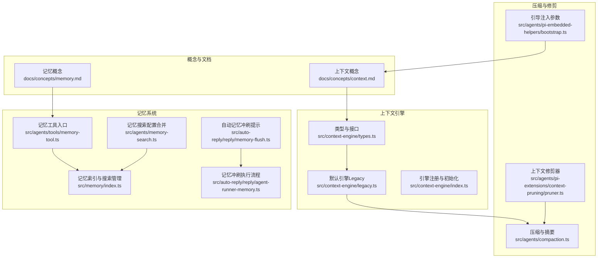
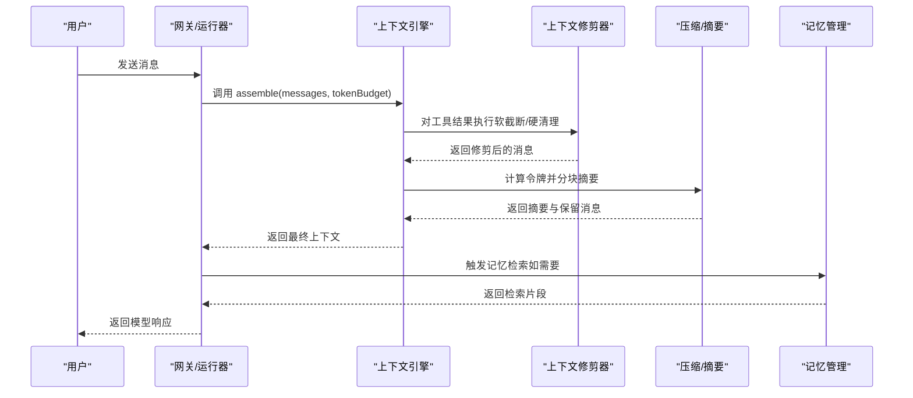
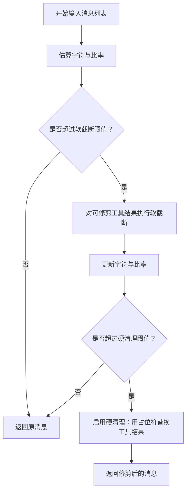
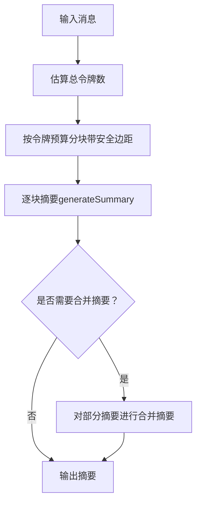
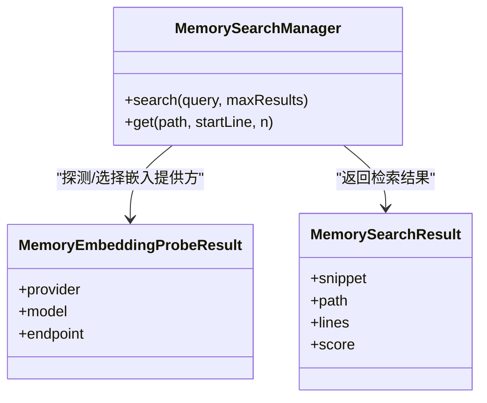
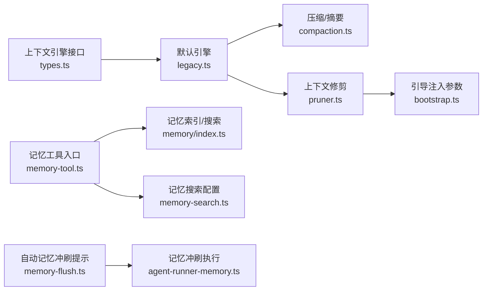

# 上下文窗口

<cite>
**本文引用的文件**
- [docs/concepts/context.md](file://docs/concepts/context.md)
- [docs/zh-CN/concepts/context.md](file://docs/zh-CN/concepts/context.md)
- [docs/concepts/memory.md](file://docs/concepts/memory.md)
- [src/agents/compaction.ts](file://src/agents/compaction.ts)
- [src/agents/pi-extensions/context-pruning/pruner.ts](file://src/agents/pi-extensions/context-pruning/pruner.ts)
- [src/agents/pi-embedded-helpers/bootstrap.ts](file://src/agents/pi-embedded-helpers/bootstrap.ts)
- [src/context-engine/types.ts](file://src/context-engine/types.ts)
- [src/context-engine/legacy.ts](file://src/context-engine/legacy.ts)
- [src/context-engine/index.ts](file://src/context-engine/index.ts)
- [src/agents/defaults.ts](file://src/agents/defaults.ts)
- [src/agents/tools/memory-tool.ts](file://src/agents/tools/memory-tool.ts)
- [src/memory/index.ts](file://src/memory/index.ts)
- [src/agents/memory-search.ts](file://src/agents/memory-search.ts)
- [src/auto-reply/reply/memory-flush.ts](file://src/auto-reply/reply/memory-flush.ts)
- [src/auto-reply/reply/agent-runner-memory.ts](file://src/auto-reply/reply/agent-runner-memory.ts)
- [src/auto-reply/reply/commands-context-report.ts](file://src/auto-reply/reply/commands-context-report.ts)
</cite>

## 目录
1. [简介](#简介)
2. [项目结构](#项目结构)
3. [核心组件](#核心组件)
4. [架构总览](#架构总览)
5. [详细组件分析](#详细组件分析)
6. [依赖关系分析](#依赖关系分析)
7. [性能考量](#性能考量)
8. [故障排查指南](#故障排查指南)
9. [结论](#结论)
10. [附录](#附录)

## 简介
本篇文档围绕 OpenClaw 的“上下文窗口”管理展开，目标是帮助开发者与使用者理解并高效管理 AI 交互中的上下文信息。内容涵盖：
- 上下文窗口的概念与边界：什么是上下文、如何构成、如何度量与检查
- 文本长度限制与信息压缩策略：字符估算、软截断、硬清理、图像处理
- 记忆系统（Memory）：短期与长期记忆的区分、检索算法、向量化与混合检索、自动记忆冲刷
- 上下文优化策略：智能截断、关键信息保留、动态调整机制
- 最佳实践：提示工程、记忆优化、性能调优

## 项目结构
OpenClaw 将“上下文”拆分为“运行期上下文”和“记忆层”，并通过可插拔的“上下文引擎”统一装配与压缩流程。核心模块包括：
- 概念与文档：上下文与记忆的概念说明
- 上下文引擎：定义装配、压缩、摄取等生命周期接口
- 压缩与修剪：基于令牌预算的分块、分阶段摘要、软截断与硬清理
- 记忆系统：Markdown 文件驱动的记忆、向量化检索、自动记忆冲刷
- 引导与注入：工作区文件注入、最大字符限制与警告策略

图表来源
- [src/context-engine/types.ts:68-168](file://src/context-engine/types.ts#L68-L168)
- [src/context-engine/legacy.ts:20-112](file://src/context-engine/legacy.ts#L20-L112)
- [src/agents/compaction.ts:12-396](file://src/agents/compaction.ts#L12-L396)
- [src/agents/pi-extensions/context-pruning/pruner.ts:242-360](file://src/agents/pi-extensions/context-pruning/pruner.ts#L242-L360)
- [src/agents/pi-embedded-helpers/bootstrap.ts:85-123](file://src/agents/pi-embedded-helpers/bootstrap.ts#L85-L123)
- [src/agents/tools/memory-tool.ts:40-71](file://src/agents/tools/memory-tool.ts#L40-L71)
- [src/memory/index.ts:1-12](file://src/memory/index.ts#L1-L12)
- [src/agents/memory-search.ts:143-179](file://src/agents/memory-search.ts#L143-L179)
- [src/auto-reply/reply/memory-flush.ts:25-41](file://src/auto-reply/reply/memory-flush.ts#L25-L41)
- [src/auto-reply/reply/agent-runner-memory.ts:488-525](file://src/auto-reply/reply/agent-runner-memory.ts#L488-L525)

章节来源
- [docs/concepts/context.md:10-170](file://docs/concepts/context.md#L10-L170)
- [docs/concepts/memory.md:1-800](file://docs/concepts/memory.md#L1-L800)
- [src/context-engine/types.ts:68-168](file://src/context-engine/types.ts#L68-L168)
- [src/context-engine/legacy.ts:20-112](file://src/context-engine/legacy.ts#L20-L112)
- [src/agents/compaction.ts:12-396](file://src/agents/compaction.ts#L12-L396)
- [src/agents/pi-extensions/context-pruning/pruner.ts:242-360](file://src/agents/pi-extensions/context-pruning/pruner.ts#L242-L360)
- [src/agents/pi-embedded-helpers/bootstrap.ts:85-123](file://src/agents/pi-embedded-helpers/bootstrap.ts#L85-L123)
- [src/agents/tools/memory-tool.ts:40-71](file://src/agents/tools/memory-tool.ts#L40-L71)
- [src/memory/index.ts:1-12](file://src/memory/index.ts#L1-L12)
- [src/agents/memory-search.ts:143-179](file://src/agents/memory-search.ts#L143-L179)
- [src/auto-reply/reply/memory-flush.ts:25-41](file://src/auto-reply/reply/memory-flush.ts#L25-L41)
- [src/auto-reply/reply/agent-runner-memory.ts:488-525](file://src/auto-reply/reply/agent-runner-memory.ts#L488-L525)

## 核心组件
- 上下文引擎（Context Engine）
  - 定义装配、摄取、压缩、子代理准备、生命周期钩子等接口，支持插件扩展
  - 默认引擎“legacy”兼容现有压缩与组装逻辑
- 上下文修剪（Context Pruning）
  - 基于令牌预算与策略对工具结果进行软截断与硬清理，保护关键助手消息尾部
- 压缩与摘要（Compaction）
  - 分块、分阶段摘要、合并摘要、标识符保留策略、安全边距与失败回退
- 记忆系统（Memory）
  - Markdown 驱动的短期/长期记忆、向量化检索、混合检索（BM25+向量）、自动记忆冲刷
- 引导注入（Bootstrap）
  - 工作区文件注入、单文件与总量上限、截断警告策略

章节来源
- [src/context-engine/types.ts:68-168](file://src/context-engine/types.ts#L68-L168)
- [src/context-engine/legacy.ts:20-112](file://src/context-engine/legacy.ts#L20-L112)
- [src/agents/pi-extensions/context-pruning/pruner.ts:242-360](file://src/agents/pi-extensions/context-pruning/pruner.ts#L242-L360)
- [src/agents/compaction.ts:12-396](file://src/agents/compaction.ts#L12-L396)
- [src/agents/tools/memory-tool.ts:40-71](file://src/agents/tools/memory-tool.ts#L40-L71)
- [src/memory/index.ts:1-12](file://src/memory/index.ts#L1-L12)
- [src/agents/pi-embedded-helpers/bootstrap.ts:85-123](file://src/agents/pi-embedded-helpers/bootstrap.ts#L85-L123)

## 架构总览
OpenClaw 的上下文管理采用“引擎 + 压缩 + 记忆”的分层设计：
- 引擎负责“装配与压缩”的生命周期
- 压缩在运行前根据令牌预算进行分块与摘要
- 修剪在运行中对工具结果进行软截断/硬清理
- 记忆系统提供检索与冲刷，补充上下文窗口外的长期知识

图表来源
- [src/context-engine/types.ts:122-145](file://src/context-engine/types.ts#L122-L145)
- [src/agents/pi-extensions/context-pruning/pruner.ts:242-360](file://src/agents/pi-extensions/context-pruning/pruner.ts#L242-L360)
- [src/agents/compaction.ts:333-396](file://src/agents/compaction.ts#L333-L396)
- [src/agents/tools/memory-tool.ts:40-71](file://src/agents/tools/memory-tool.ts#L40-L71)

## 详细组件分析

### 上下文窗口与概念
- 上下文是模型在一次运行中接收的全部内容，受模型上下文窗口（token 限制）约束
- 组成要素：系统提示词（含工具/技能/工作区）、对话历史、工具调用与结果、附件/转录、压缩摘要与修剪产物
- 上下文 ≠ 记忆：记忆可落盘并重载，上下文是当前窗口内的数据

章节来源
- [docs/concepts/context.md:10-170](file://docs/concepts/context.md#L10-L170)
- [docs/zh-CN/concepts/context.md:17-37](file://docs/zh-CN/concepts/context.md#L17-L37)

### 上下文修剪（Pruning）
- 估算字符：按 4 字符 ≈ 1 令牌的经验值估算
- 保护策略：保留最后 N 条助手消息尾部，避免丢失关键推理/行动线索
- 软截断：对工具结果进行首尾截断并添加注释，尽量保留两端信息
- 硬清理：当超过阈值且满足最小可清理字符时，用占位符替换工具结果
- 图像处理：对包含图片的工具结果，以固定字符估算替代图片块，便于截断

图表来源
- [src/agents/pi-extensions/context-pruning/pruner.ts:242-360](file://src/agents/pi-extensions/context-pruning/pruner.ts#L242-L360)

章节来源
- [src/agents/pi-extensions/context-pruning/pruner.ts:1-361](file://src/agents/pi-extensions/context-pruning/pruner.ts#L1-L361)

### 压缩与摘要（Compaction）
- 分块策略：按令牌数分块，应用安全边距补偿估算误差
- 自适应块比例：根据平均消息大小动态降低块比例，避免单条消息过大导致无法摘要
- 分阶段摘要：多段消息先各自摘要，再对部分摘要进行合并摘要，强调近期上下文
- 标识符保留：严格保留不透明标识符（UUID、哈希、URL、文件名等）
- 失败回退：全量摘要失败时尝试仅摘要较小消息，或仅说明原因

图表来源
- [src/agents/compaction.ts:135-175](file://src/agents/compaction.ts#L135-L175)
- [src/agents/compaction.ts:211-258](file://src/agents/compaction.ts#L211-L258)
- [src/agents/compaction.ts:333-396](file://src/agents/compaction.ts#L333-L396)

章节来源
- [src/agents/compaction.ts:12-465](file://src/agents/compaction.ts#L12-L465)

### 记忆系统（Memory）
- 存储形态：工作区内的 Markdown 文件（短期日志与长期记忆）
- 检索工具：memory_search（语义检索）、memory_get（精确读取）
- 检索算法：向量相似 + BM25 关键词（可选 MMR 与时间衰减）
- 自动记忆冲刷：在接近压缩前触发静默提醒，促使模型将持久记忆写入磁盘
- 搜索配置：提供远程/本地嵌入、批处理、缓存、sqlite-vec 加速等选项

图表来源
- [src/memory/index.ts:1-12](file://src/memory/index.ts#L1-L12)
- [src/agents/tools/memory-tool.ts:40-71](file://src/agents/tools/memory-tool.ts#L40-L71)
- [src/agents/memory-search.ts:143-179](file://src/agents/memory-search.ts#L143-L179)

章节来源
- [docs/concepts/memory.md:1-800](file://docs/concepts/memory.md#L1-L800)
- [src/agents/tools/memory-tool.ts:40-71](file://src/agents/tools/memory-tool.ts#L40-L71)
- [src/memory/index.ts:1-12](file://src/memory/index.ts#L1-L12)
- [src/agents/memory-search.ts:143-179](file://src/agents/memory-search.ts#L143-L179)
- [src/auto-reply/reply/memory-flush.ts:25-41](file://src/auto-reply/reply/memory-flush.ts#L25-L41)
- [src/auto-reply/reply/agent-runner-memory.ts:488-525](file://src/auto-reply/reply/agent-runner-memory.ts#L488-L525)

### 引导注入与文本长度限制
- 工作区文件注入：默认注入一组项目上下文文件，超出单文件与总量上限时进行截断
- 截断策略：按固定比例保留首尾，插入提示警告（可配置）
- 默认上限：单文件与总量上限可通过配置调整

章节来源
- [docs/concepts/context.md:103-118](file://docs/concepts/context.md#L103-L118)
- [src/agents/pi-embedded-helpers/bootstrap.ts:85-123](file://src/agents/pi-embedded-helpers/bootstrap.ts#L85-L123)

### 上下文引擎接口与默认实现
- 接口职责：bootstrap、ingest、assemble、compact、afterTurn、prepareSubagentSpawn、onSubagentEnded、dispose
- 默认引擎（legacy）：将现有压缩与组装逻辑桥接至引擎接口，保证向后兼容

章节来源
- [src/context-engine/types.ts:68-168](file://src/context-engine/types.ts#L68-L168)
- [src/context-engine/legacy.ts:20-112](file://src/context-engine/legacy.ts#L20-L112)
- [src/context-engine/index.ts:1-19](file://src/context-engine/index.ts#L1-L19)

## 依赖关系分析
- 上下文引擎依赖压缩与修剪模块，以在运行前控制上下文大小
- 压缩模块依赖模型上下文窗口与令牌估算，结合安全边距与失败回退
- 修剪模块依赖工具策略与图像标记，保障图像与文本的差异化处理
- 记忆系统依赖嵌入提供方与索引存储，支持向量化与混合检索
- 引导注入模块影响系统提示词大小，进而影响整体上下文占用

图表来源
- [src/context-engine/types.ts:68-168](file://src/context-engine/types.ts#L68-L168)
- [src/context-engine/legacy.ts:20-112](file://src/context-engine/legacy.ts#L20-L112)
- [src/agents/compaction.ts:12-396](file://src/agents/compaction.ts#L12-L396)
- [src/agents/pi-extensions/context-pruning/pruner.ts:242-360](file://src/agents/pi-extensions/context-pruning/pruner.ts#L242-L360)
- [src/agents/pi-embedded-helpers/bootstrap.ts:85-123](file://src/agents/pi-embedded-helpers/bootstrap.ts#L85-L123)
- [src/agents/tools/memory-tool.ts:40-71](file://src/agents/tools/memory-tool.ts#L40-L71)
- [src/memory/index.ts:1-12](file://src/memory/index.ts#L1-L12)
- [src/agents/memory-search.ts:143-179](file://src/agents/memory-search.ts#L143-L179)
- [src/auto-reply/reply/memory-flush.ts:25-41](file://src/auto-reply/reply/memory-flush.ts#L25-L41)
- [src/auto-reply/reply/agent-runner-memory.ts:488-525](file://src/auto-reply/reply/agent-runner-memory.ts#L488-L525)

章节来源
- [src/context-engine/types.ts:68-168](file://src/context-engine/types.ts#L68-L168)
- [src/agents/compaction.ts:12-396](file://src/agents/compaction.ts#L12-L396)
- [src/agents/pi-extensions/context-pruning/pruner.ts:242-360](file://src/agents/pi-extensions/context-pruning/pruner.ts#L242-L360)
- [src/agents/tools/memory-tool.ts:40-71](file://src/agents/tools/memory-tool.ts#L40-L71)
- [src/memory/index.ts:1-12](file://src/memory/index.ts#L1-L12)
- [src/agents/memory-search.ts:143-179](file://src/agents/memory-search.ts#L143-L179)
- [src/auto-reply/reply/memory-flush.ts:25-41](file://src/auto-reply/reply/memory-flush.ts#L25-L41)
- [src/auto-reply/reply/agent-runner-memory.ts:488-525](file://src/auto-reply/reply/agent-runner-memory.ts#L488-L525)

## 性能考量
- 令牌估算与安全边距：使用保守的 4 字符/令牌估算，并引入 20% 安全边距以补偿多字节、特殊令牌与代码令牌
- 分块与自适应：根据平均消息大小动态调整块比例，避免单条消息过大导致摘要失败
- 混合检索与后处理：BM25 + 向量融合、可选 MMR 与时间衰减，提升召回与多样性
- 缓存与加速：嵌入缓存、sqlite-vec 扩展、批处理嵌入，降低重复计算与延迟
- 运行时动态：在接近压缩阈值时触发自动记忆冲刷，避免上下文溢出

## 故障排查指南
- 上下文过长
  - 使用状态与上下文报告命令检查各组成部分大小，定位主导项
  - 调整引导注入上限、启用软截断/硬清理策略
- 压缩失败
  - 检查模型上下文窗口与令牌估算，确认安全边距与分块参数
  - 开启失败回退路径，关注 oversized 消息与合并摘要的提示
- 记忆检索异常
  - 检查嵌入提供方配置与网络连通性，确认缓存与 sqlite-vec 状态
  - 若 QMD 后端不可用，系统会自动回退到内置 SQLite 管理器
- 自动记忆冲刷未生效
  - 确认工作区可写、压缩阈值与软阈值设置、会话配置

章节来源
- [docs/concepts/context.md:22-30](file://docs/concepts/context.md#L22-L30)
- [src/agents/compaction.ts:264-331](file://src/agents/compaction.ts#L264-L331)
- [src/agents/tools/memory-tool.ts:40-71](file://src/agents/tools/memory-tool.ts#L40-L71)
- [src/auto-reply/reply/commands-context-report.ts:173-191](file://src/auto-reply/reply/commands-context-report.ts#L173-L191)

## 结论
OpenClaw 的上下文窗口管理通过“引擎 + 修剪 + 压缩 + 记忆”的协同，实现了对大模型上下文的可控与高效利用。开发者应：
- 明确上下文构成与边界，合理设置引导注入与令牌预算
- 使用软截断与硬清理策略，在保留关键信息的同时控制上下文体积
- 借助记忆系统的检索与冲刷机制，将长期知识纳入模型感知范围
- 结合性能调优与故障排查，持续优化上下文管理效果

## 附录
- 默认上下文窗口：当模型元数据不可用时，采用保守的默认值
- 模型默认：默认提供方与模型，用于运行时兜底

章节来源
- [src/agents/defaults.ts:1-7](file://src/agents/defaults.ts#L1-L7)