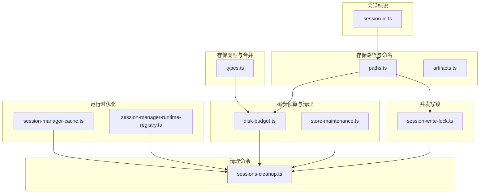
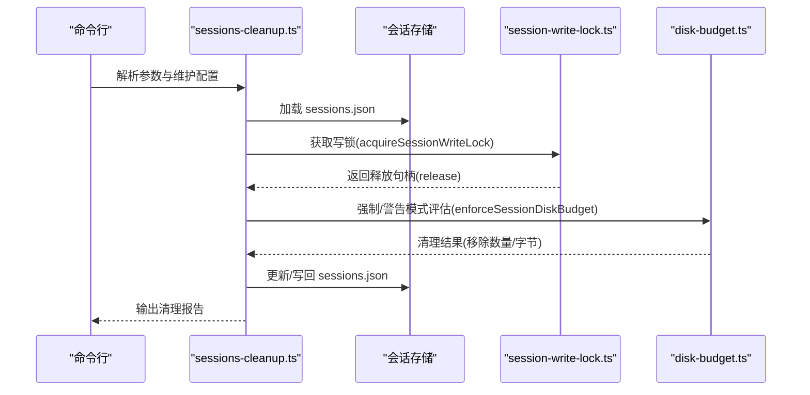
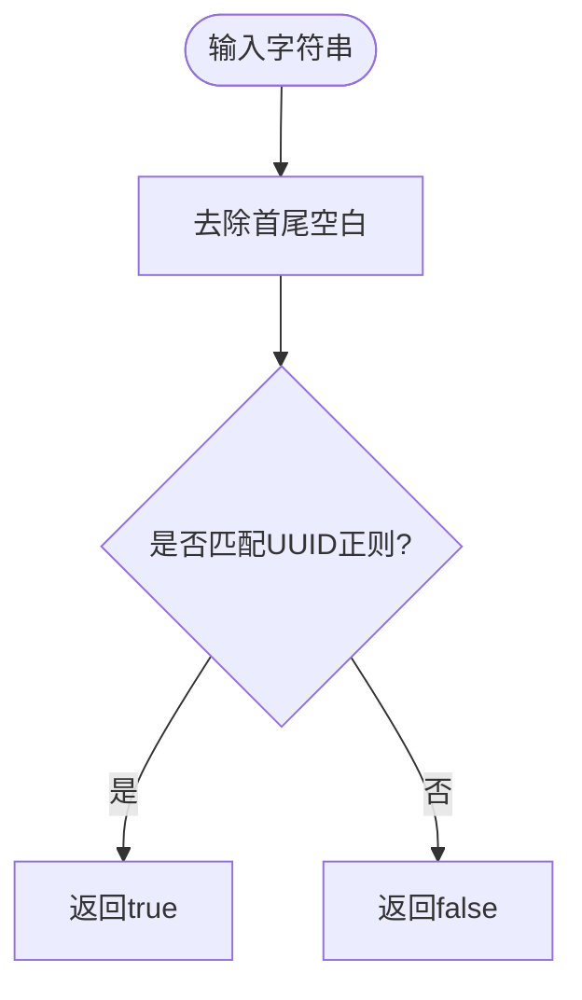
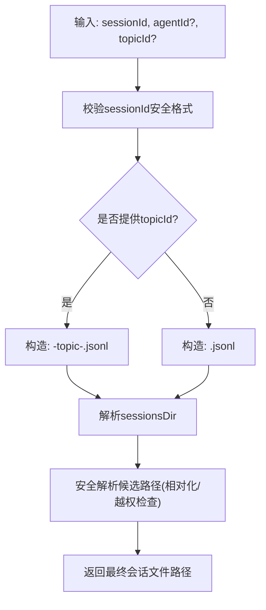
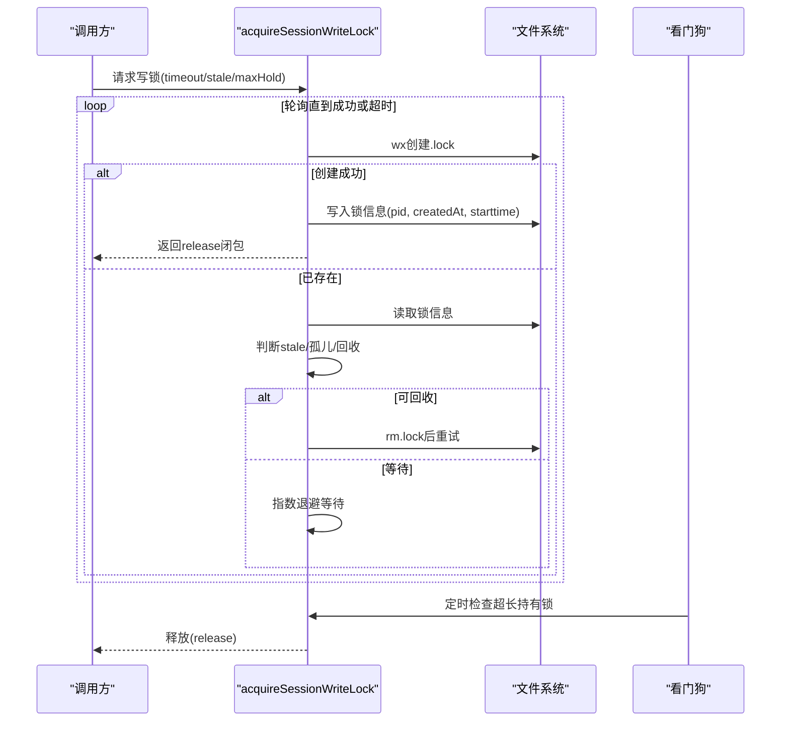
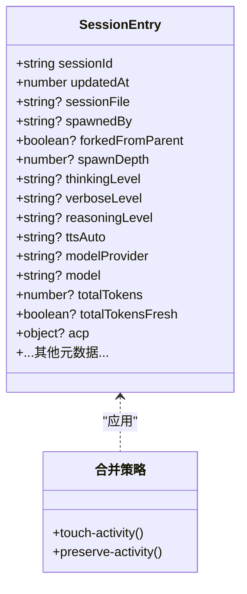
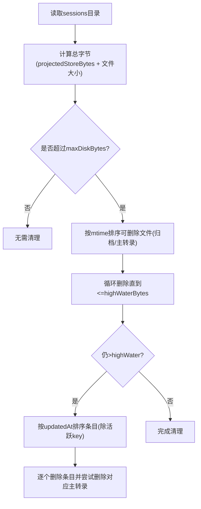
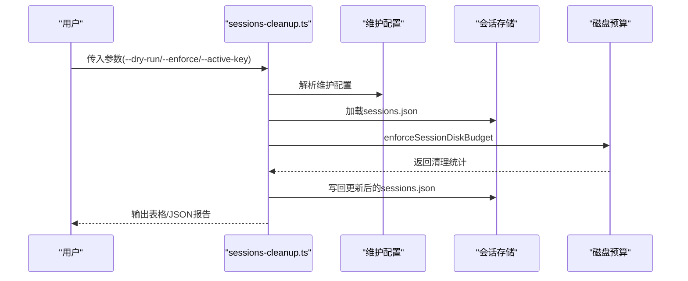
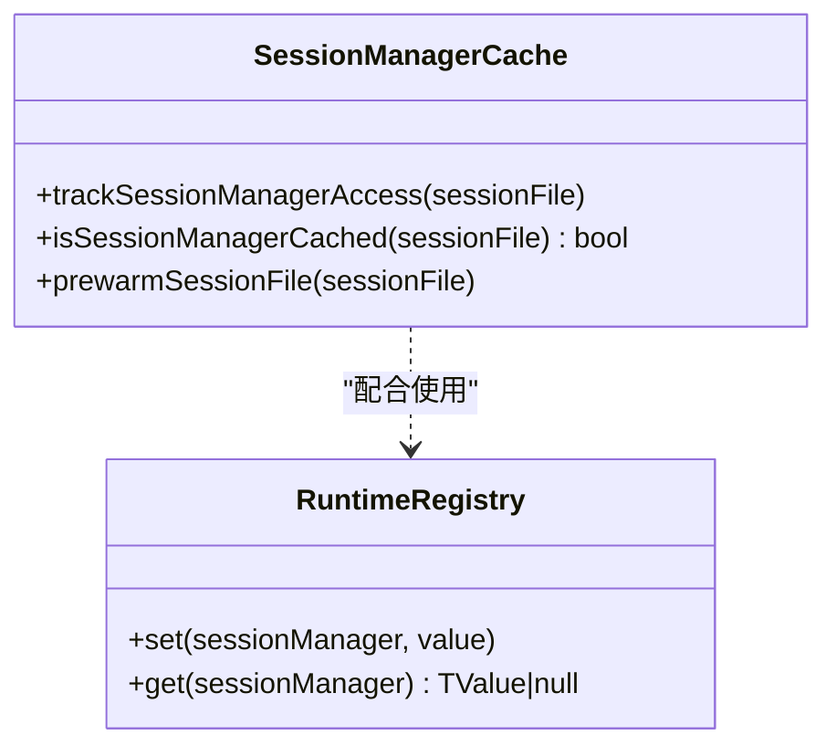
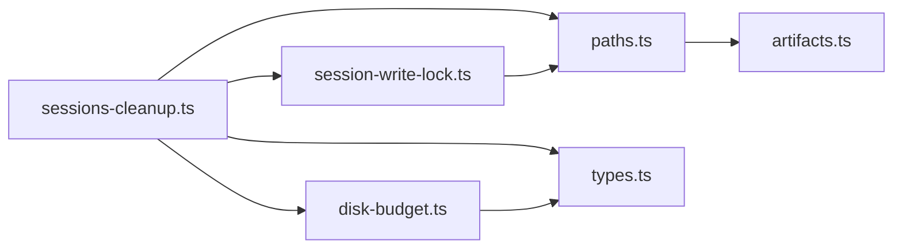

# 代理会话

<cite>
**本文引用的文件**
- [session-id.ts](file://src/sessions/session-id.ts)
- [session-id.test.ts](file://src/sessions/session-id.test.ts)
- [session-write-lock.ts](file://src/agents/session-write-lock.ts)
- [types.ts](file://src/config/sessions/types.ts)
- [paths.ts](file://src/config/sessions/paths.ts)
- [disk-budget.ts](file://src/config/sessions/disk-budget.ts)
- [artifacts.ts](file://src/config/sessions/artifacts.ts)
- [store-maintenance.ts](file://src/config/sessions/store-maintenance.ts)
- [sessions-cleanup.ts](file://src/commands/sessions-cleanup.ts)
- [session-manager-runtime-registry.ts](file://src/agents/pi-extensions/session-manager-runtime-registry.ts)
- [session-manager-cache.ts](file://src/agents/pi-embedded-runner/session-manager-cache.ts)
- [sessions-cleanup.test.ts](file://src/commands/sessions-cleanup.test.ts)
- [session-maintenance-warning.ts](file://src/infra/session-maintenance-warning.ts)
</cite>

## 目录
1. [简介](#简介)
2. [项目结构](#项目结构)
3. [核心组件](#核心组件)
4. [架构总览](#架构总览)
5. [详细组件分析](#详细组件分析)
6. [依赖关系分析](#依赖关系分析)
7. [性能考量](#性能考量)
8. [故障排除指南](#故障排除指南)
9. [结论](#结论)
10. [附录](#附录)

## 简介
本文件系统性阐述 OpenClaw 代理会话管理的设计与实现，覆盖会话概念与生命周期、会话 ID 的生成与校验、会话存储格式与文件结构、并发写入控制、持久化策略、维护与清理工具、最佳实践与故障排除。目标是帮助开发者在多平台、多进程环境下可靠地管理代理会话。

## 项目结构
OpenClaw 将会话相关能力分布在多个子模块：
- 会话标识与校验：会话 ID 正则与判定函数
- 存储路径与命名：会话目录、文件名规范、跨根兼容解析
- 并发写锁：基于文件锁的互斥与回收策略
- 存储类型与合并策略：会话条目结构、合并与归一化
- 磁盘预算与归档：按时间与引用计数的清理与归档
- 维护与清理命令：过期清理、容量限制、磁盘预算强制执行
- 运行时缓存与注册表：会话管理器缓存与弱映射注册表

**图表来源**
- [session-id.ts:1-6](file://src/sessions/session-id.ts#L1-L6)
- [paths.ts:1-308](file://src/config/sessions/paths.ts#L1-L308)
- [artifacts.ts:1-68](file://src/config/sessions/artifacts.ts#L1-L68)
- [session-write-lock.ts:1-561](file://src/agents/session-write-lock.ts#L1-L561)
- [types.ts:1-380](file://src/config/sessions/types.ts#L1-L380)
- [disk-budget.ts:1-376](file://src/config/sessions/disk-budget.ts#L1-L376)
- [store-maintenance.ts:176-219](file://src/config/sessions/store-maintenance.ts#L176-L219)
- [sessions-cleanup.ts:1-56](file://src/commands/sessions-cleanup.ts#L1-L56)
- [session-manager-cache.ts:1-70](file://src/agents/pi-embedded-runner/session-manager-cache.ts#L1-L70)
- [session-manager-runtime-registry.ts:1-30](file://src/agents/pi-extensions/session-manager-runtime-registry.ts#L1-L30)

**章节来源**
- [session-id.ts:1-6](file://src/sessions/session-id.ts#L1-L6)
- [paths.ts:1-308](file://src/config/sessions/paths.ts#L1-L308)
- [artifacts.ts:1-68](file://src/config/sessions/artifacts.ts#L1-L68)
- [session-write-lock.ts:1-561](file://src/agents/session-write-lock.ts#L1-L561)
- [types.ts:1-380](file://src/config/sessions/types.ts#L1-L380)
- [disk-budget.ts:1-376](file://src/config/sessions/disk-budget.ts#L1-L376)
- [store-maintenance.ts:176-219](file://src/config/sessions/store-maintenance.ts#L176-L219)
- [sessions-cleanup.ts:1-56](file://src/commands/sessions-cleanup.ts#L1-L56)
- [session-manager-cache.ts:1-70](file://src/agents/pi-embedded-runner/session-manager-cache.ts#L1-L70)
- [session-manager-runtime-registry.ts:1-30](file://src/agents/pi-extensions/session-manager-runtime-registry.ts#L1-L30)

## 核心组件
- 会话标识与校验
  - 使用正则表达式匹配标准 UUID 格式，提供字符串判定函数，确保输入合法性。
- 存储路径与命名
  - 规范化会话目录、会话文件名（含主题区分）、跨根兼容解析、绝对路径安全约束。
- 并发写锁
  - 基于文件锁的互斥，支持超时、最大持有时间、看门狗回收、孤儿锁检测与回收。
- 存储类型与合并策略
  - 定义 SessionEntry 结构，提供合并策略（保留活动时间戳或触摸更新时间戳），并进行运行时字段归一化。
- 磁盘预算与归档
  - 计算存储大小、按引用计数与时间排序清理、归档文件识别与时间戳解析。
- 维护与清理命令
  - 提供 CLI 清理流程，支持“仅警告”与“强制执行”，并输出清理报告。
- 运行时优化
  - 会话管理器缓存预热与 TTL 控制，弱映射运行时注册表保障对象级稳定性。

**章节来源**
- [session-id.ts:1-6](file://src/sessions/session-id.ts#L1-L6)
- [paths.ts:60-277](file://src/config/sessions/paths.ts#L60-L277)
- [session-write-lock.ts:444-553](file://src/agents/session-write-lock.ts#L444-L553)
- [types.ts:68-288](file://src/config/sessions/types.ts#L68-L288)
- [disk-budget.ts:188-375](file://src/config/sessions/disk-budget.ts#L188-L375)
- [sessions-cleanup.ts:34-56](file://src/commands/sessions-cleanup.ts#L34-L56)
- [session-manager-cache.ts:1-70](file://src/agents/pi-embedded-runner/session-manager-cache.ts#L1-L70)
- [session-manager-runtime-registry.ts:1-30](file://src/agents/pi-extensions/session-manager-runtime-registry.ts#L1-L30)

## 架构总览
下图展示从命令入口到存储层的关键交互：CLI 解析维护配置，加载会话存储，执行清理与预算控制，期间通过写锁保障并发一致性，最终更新存储并输出结果。

**图表来源**
- [sessions-cleanup.ts:1-56](file://src/commands/sessions-cleanup.ts#L1-L56)
- [session-write-lock.ts:444-553](file://src/agents/session-write-lock.ts#L444-L553)
- [disk-budget.ts:188-375](file://src/config/sessions/disk-budget.ts#L188-L375)

## 详细组件分析

### 会话标识与校验
- 设计要点
  - 使用正则表达式严格匹配标准 UUID 字符串，避免误判非会话标识。
  - 提供 trim 后判定，增强鲁棒性。
- 复杂度
  - 判定复杂度 O(1)，空间复杂度 O(1)。
- 测试覆盖
  - 单测验证合法 UUID 与非法值的判定行为。

**图表来源**
- [session-id.ts:1-6](file://src/sessions/session-id.ts#L1-L6)

**章节来源**
- [session-id.ts:1-6](file://src/sessions/session-id.ts#L1-L6)
- [session-id.test.ts:1-14](file://src/sessions/session-id.test.ts#L1-L14)

### 存储路径与命名
- 设计要点
  - 会话目录位于状态根下的 agents/<agentId>/sessions。
  - 文件名规则：主会话为 <sessionId>.jsonl；主题会话为 <sessionId>-topic-<topicId>.jsonl。
  - 支持绝对路径安全解析，防止越权访问；跨根兼容旧路径。
  - 归档文件识别与时间戳解析，便于审计与恢复。
- 复杂度
  - 路径解析涉及文件系统操作，主要瓶颈在 realpath/stat，整体 O(1) 文件系统调用。
- 关键接口
  - 解析会话目录与默认存储路径
  - 解析会话文件路径（含主题）
  - 归档文件与主转录文件识别

**图表来源**
- [paths.ts:235-277](file://src/config/sessions/paths.ts#L235-L277)
- [artifacts.ts:16-67](file://src/config/sessions/artifacts.ts#L16-L67)

**章节来源**
- [paths.ts:1-308](file://src/config/sessions/paths.ts#L1-L308)
- [artifacts.ts:1-68](file://src/config/sessions/artifacts.ts#L1-L68)

### 并发写锁与一致性
- 设计要点
  - 写锁文件采用“独占创建+写入锁信息”的方式，锁文件名与会话文件同名并追加 .lock。
  - 锁信息包含 pid、创建时间、进程启动时间(starttime)，用于 PID 回收检测与孤儿锁判断。
  - 超时轮询获取锁，支持可重入计数；看门狗定时检查超长持有锁并强制释放。
  - 支持信号处理与进程退出同步/异步清理。
- 并发与一致性
  - 通过文件锁实现跨进程互斥；通过 starttime 与进程存活检测避免 PID 回收导致的误判。
  - 最大持有时间与超时宽限期确保死锁场景下的自动恢复。
- 复杂度
  - 获取锁为 O(1) 重试轮询，释放锁为 O(1) 文件操作。

**图表来源**
- [session-write-lock.ts:444-553](file://src/agents/session-write-lock.ts#L444-L553)
- [session-write-lock.ts:193-227](file://src/agents/session-write-lock.ts#L193-L227)

**章节来源**
- [session-write-lock.ts:1-561](file://src/agents/session-write-lock.ts#L1-L561)

### 存储类型与合并策略
- 设计要点
  - SessionEntry 描述会话元数据、运行时选项、令牌用量、ACP 元信息等。
  - 提供两种合并策略：
    - touch-activity：以最新更新时间为准
    - preserve-activity：保留现有活动时间戳，避免因外部更新导致活动时间被覆盖
  - 运行时模型字段归一化，避免空字符串污染。
- 复杂度
  - 合并为 O(n) 遍历与浅拷贝，内存开销与条目数量线性相关。

**图表来源**
- [types.ts:68-288](file://src/config/sessions/types.ts#L68-L288)

**章节来源**
- [types.ts:1-380](file://src/config/sessions/types.ts#L1-L380)

### 磁盘预算与清理
- 设计要点
  - 通过扫描 sessions 目录统计总字节，结合高水位与最大配额决定清理策略。
  - 清理顺序：
    1) 优先删除归档文件（按修改时间升序）
    2) 若仍未达标，则按 updatedAt 升序删除最旧条目，同时删除未被引用的主转录文件
  - 支持“仅警告”模式与“强制执行”模式；DryRun 支持模拟清理效果。
- 复杂度
  - 扫描目录 O(n)；排序 O(n log n)；删除 O(k)；总体 O(n log n)。

**图表来源**
- [disk-budget.ts:188-375](file://src/config/sessions/disk-budget.ts#L188-L375)

**章节来源**
- [disk-budget.ts:1-376](file://src/config/sessions/disk-budget.ts#L1-L376)

### 维护与清理命令
- 设计要点
  - CLI 命令整合维护配置解析、存储加载、清理执行、报告输出。
  - 支持“仅警告”与“强制执行”两种模式；可指定活跃会话键避免误删。
  - 单测覆盖了并发写入时的删除与新增一致性。
- 复杂度
  - 主要受磁盘 I/O 与文件扫描影响，清理阶段为 O(n log n)。

**图表来源**
- [sessions-cleanup.ts:1-56](file://src/commands/sessions-cleanup.ts#L1-L56)
- [disk-budget.ts:188-375](file://src/config/sessions/disk-budget.ts#L188-L375)

**章节来源**
- [sessions-cleanup.ts:1-56](file://src/commands/sessions-cleanup.ts#L1-L56)
- [sessions-cleanup.test.ts:1-91](file://src/commands/sessions-cleanup.test.ts#L1-L91)

### 运行时缓存与注册表
- 设计要点
  - 会话管理器缓存：通过短 TTL 缓存已访问的会话文件，减少重复加载；支持预热读取以利用 OS 页面缓存。
  - 弱映射运行时注册表：以对象身份为键，提供会话作用域内的运行时值存储，保证实例稳定性。
- 复杂度
  - 缓存命中 O(1)；注册表 O(1) 读写。

**图表来源**
- [session-manager-cache.ts:1-70](file://src/agents/pi-embedded-runner/session-manager-cache.ts#L1-L70)
- [session-manager-runtime-registry.ts:1-30](file://src/agents/pi-extensions/session-manager-runtime-registry.ts#L1-L30)

**章节来源**
- [session-manager-cache.ts:1-70](file://src/agents/pi-embedded-runner/session-manager-cache.ts#L1-L70)
- [session-manager-runtime-registry.ts:1-30](file://src/agents/pi-extensions/session-manager-runtime-registry.ts#L1-L30)

## 依赖关系分析
- 组件耦合
  - sessions-cleanup 依赖维护配置、存储加载/更新、磁盘预算、路径解析与写锁。
  - 写锁与路径解析共同保障文件系统层面的一致性与安全性。
  - 类型定义贯穿存储、预算与清理逻辑，确保结构一致。
- 外部依赖
  - Node.js 文件系统 API、进程信息 API（PID/启动时间）。
- 循环依赖
  - 未见直接循环；各模块职责清晰，通过函数/导出解耦。

**图表来源**
- [sessions-cleanup.ts:1-56](file://src/commands/sessions-cleanup.ts#L1-L56)
- [paths.ts:1-308](file://src/config/sessions/paths.ts#L1-L308)
- [artifacts.ts:1-68](file://src/config/sessions/artifacts.ts#L1-L68)
- [disk-budget.ts:1-376](file://src/config/sessions/disk-budget.ts#L1-L376)
- [types.ts:1-380](file://src/config/sessions/types.ts#L1-L380)
- [session-write-lock.ts:1-561](file://src/agents/session-write-lock.ts#L1-L561)

**章节来源**
- [sessions-cleanup.ts:1-56](file://src/commands/sessions-cleanup.ts#L1-L56)
- [paths.ts:1-308](file://src/config/sessions/paths.ts#L1-L308)
- [artifacts.ts:1-68](file://src/config/sessions/artifacts.ts#L1-L68)
- [disk-budget.ts:1-376](file://src/config/sessions/disk-budget.ts#L1-L376)
- [types.ts:1-380](file://src/config/sessions/types.ts#L1-L380)
- [session-write-lock.ts:1-561](file://src/agents/session-write-lock.ts#L1-L561)

## 性能考量
- I/O 优化
  - 使用预热读取与 OS 页面缓存降低首次访问延迟。
  - 通过归并排序与最小化文件遍历次数减少 CPU 开销。
- 并发控制
  - 写锁超时与最大持有时间避免长时间阻塞；看门狗自动回收异常锁。
- 存储结构
  - JSONL 主转录文件便于增量写入与流式处理；sessions.json 作为索引与元数据中心，需谨慎更新。
- 建议
  - 在高并发场景下适当增大超时与宽限期，避免频繁重试。
  - 合理设置磁盘预算阈值，定期执行清理，避免大规模删除带来的抖动。

## 故障排除指南
- 常见问题与定位
  - 会话文件被锁定
    - 现象：获取写锁超时，抛出错误并提示拥有者 pid。
    - 排查：检查锁文件是否存在、拥有者进程是否存活、starttime 是否匹配。
    - 处理：等待锁释放或使用强制回收（谨慎）。
  - 路径越权/解析失败
    - 现象：报错“会话文件路径必须在 sessions 目录内”。
    - 排查：确认传入路径是否在 agents/<agentId>/sessions 下，或使用解析函数规范化。
  - 磁盘预算不足
    - 现象：清理后仍高于高水位，日志提示“清理后仍高于高水位”。
    - 排查：确认归档文件与未引用主转录是否被清理；检查活跃会话键是否被排除。
  - 并发写入冲突
    - 现象：并发更新丢失部分变更。
    - 排查：确保使用统一的更新入口与写锁；单次批量更新应原子化。
- 相关实现参考
  - 写锁获取与回收、孤儿锁检测、staleMs 与最大持有时间
  - 路径解析与安全约束
  - 磁盘预算清理策略与警告/强制模式

**章节来源**
- [session-write-lock.ts:444-553](file://src/agents/session-write-lock.ts#L444-L553)
- [paths.ts:171-233](file://src/config/sessions/paths.ts#L171-L233)
- [disk-budget.ts:342-363](file://src/config/sessions/disk-budget.ts#L342-L363)

## 结论
OpenClaw 的会话管理以“安全、可靠、可观测”为核心设计目标：通过严格的路径解析与文件锁保障并发一致性；通过类型化存储与合并策略提升数据质量；通过磁盘预算与归档机制维持长期可维护性；并通过 CLI 清理工具与运行时缓存优化用户体验。遵循本文最佳实践与故障排除建议，可在复杂环境中稳定管理代理会话。

## 附录

### 会话生命周期与关键节点
- 创建：生成安全会话 ID，初始化 SessionEntry，写入主转录文件与 sessions.json。
- 运行：按回合写入消息，更新 updatedAt 与令牌用量，必要时触发归档。
- 维护：定期清理过期/低频条目，按预算回收磁盘空间。
- 结束：关闭写锁，释放资源，必要时归档或删除。

### 会话 ID 生成与管理
- 生成：使用随机 UUID 作为 sessionId。
- 校验：使用正则表达式与 trim 后判定，确保格式与长度合规。
- 唯一性：由生成器保证；业务侧需避免重复使用相同 ID。

**章节来源**
- [session-id.ts:1-6](file://src/sessions/session-id.ts#L1-L6)
- [types.ts:255-256](file://src/config/sessions/types.ts#L255-L256)

### 存储格式与文件结构
- 主转录：JSONL 文件，每行一条消息记录。
- 索引与元数据：sessions.json，键为会话键（如 agent:main:main），值为 SessionEntry。
- 归档：以 .bak/.reset/.deleted.<timestamp> 结尾的时间戳归档文件。
- 历史记录：通过归档文件保留历史快照，便于审计与恢复。

**章节来源**
- [artifacts.ts:1-68](file://src/config/sessions/artifacts.ts#L1-L68)
- [paths.ts:235-277](file://src/config/sessions/paths.ts#L235-L277)

### 并发处理机制
- 读写锁：使用文件锁实现互斥；支持可重入与看门狗回收。
- 冲突解决：staleMs 与孤儿锁检测；必要时强制回收。
- 一致性：通过 sessions.json 的原子更新与写锁保护，避免竞态。

**章节来源**
- [session-write-lock.ts:294-370](file://src/agents/session-write-lock.ts#L294-L370)

### 实用工具与 API
- 查询与状态检查
  - 通过 sessions.json 读取 SessionEntry，检查 updatedAt、令牌用量、ACP 状态等。
- 清理与维护
  - sessions-cleanup 命令：支持 dry-run、enforce、active-key 等参数。
  - 磁盘预算：按高水位与最大配额清理，支持警告/强制模式。
- 运行时优化
  - 会话管理器缓存：预热与 TTL 控制。
  - 弱映射注册表：对象级运行时值存储。

**章节来源**
- [sessions-cleanup.ts:1-56](file://src/commands/sessions-cleanup.ts#L1-L56)
- [disk-budget.ts:188-375](file://src/config/sessions/disk-budget.ts#L188-L375)
- [session-manager-cache.ts:1-70](file://src/agents/pi-embedded-runner/session-manager-cache.ts#L1-L70)
- [session-manager-runtime-registry.ts:1-30](file://src/agents/pi-extensions/session-manager-runtime-registry.ts#L1-L30)

### 最佳实践
- 会话 ID
  - 使用随机 UUID，避免业务侧硬编码；严格校验输入。
- 路径与安全
  - 使用解析函数规范化路径，避免绝对路径越权；定期审计 sessions 目录。
- 并发
  - 统一通过写锁更新 sessions.json；合理设置超时与最大持有时间。
- 存储
  - 定期执行清理与归档；监控磁盘预算，避免频繁大规模删除。
- 维护
  - 使用“仅警告”模式先观察，再切换“强制执行”；关注活跃会话键的保护。

**章节来源**
- [paths.ts:171-233](file://src/config/sessions/paths.ts#L171-L233)
- [session-write-lock.ts:444-553](file://src/agents/session-write-lock.ts#L444-L553)
- [disk-budget.ts:227-244](file://src/config/sessions/disk-budget.ts#L227-L244)
- [sessions-cleanup.ts:34-56](file://src/commands/sessions-cleanup.ts#L34-L56)