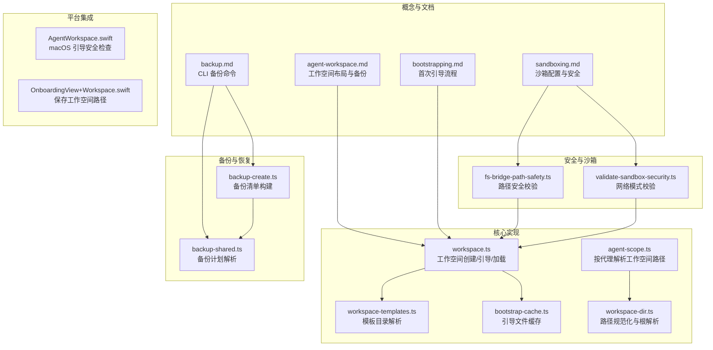
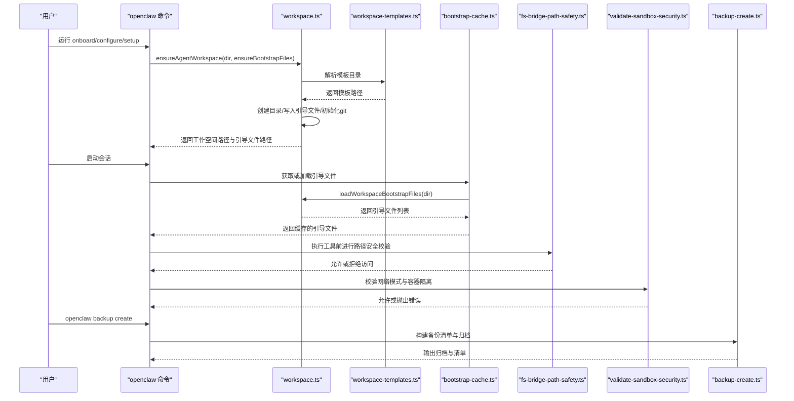
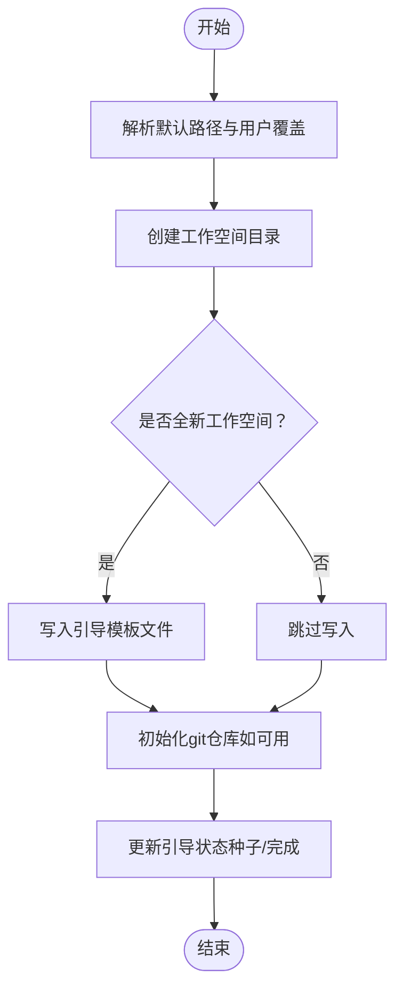
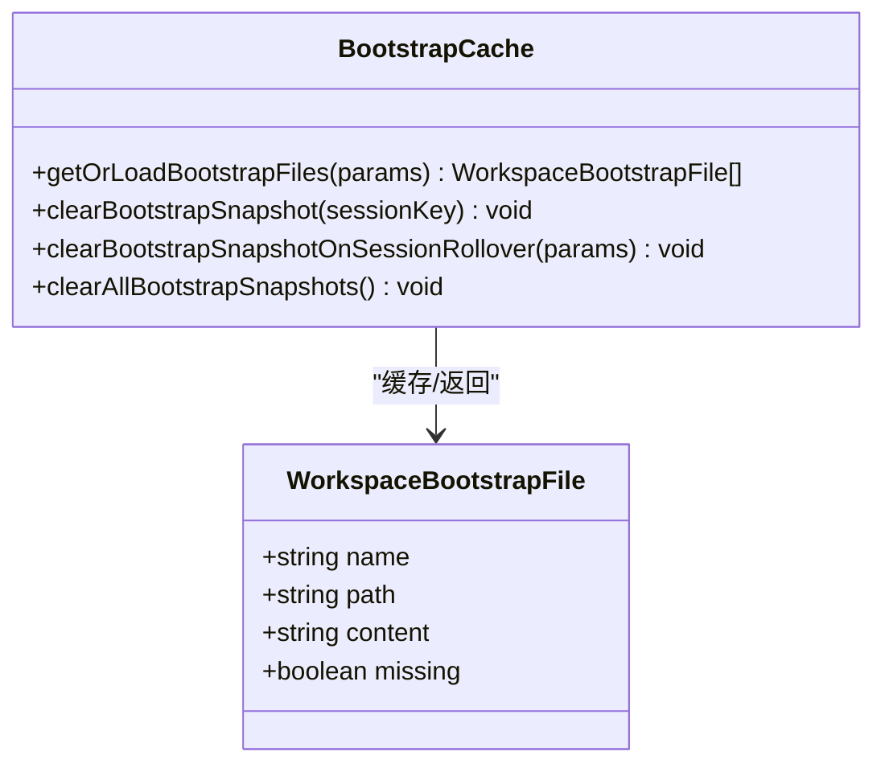
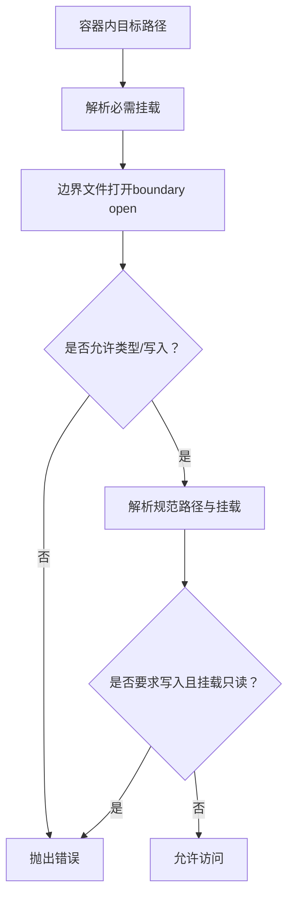
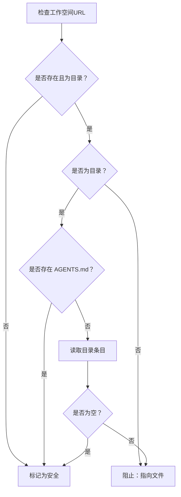
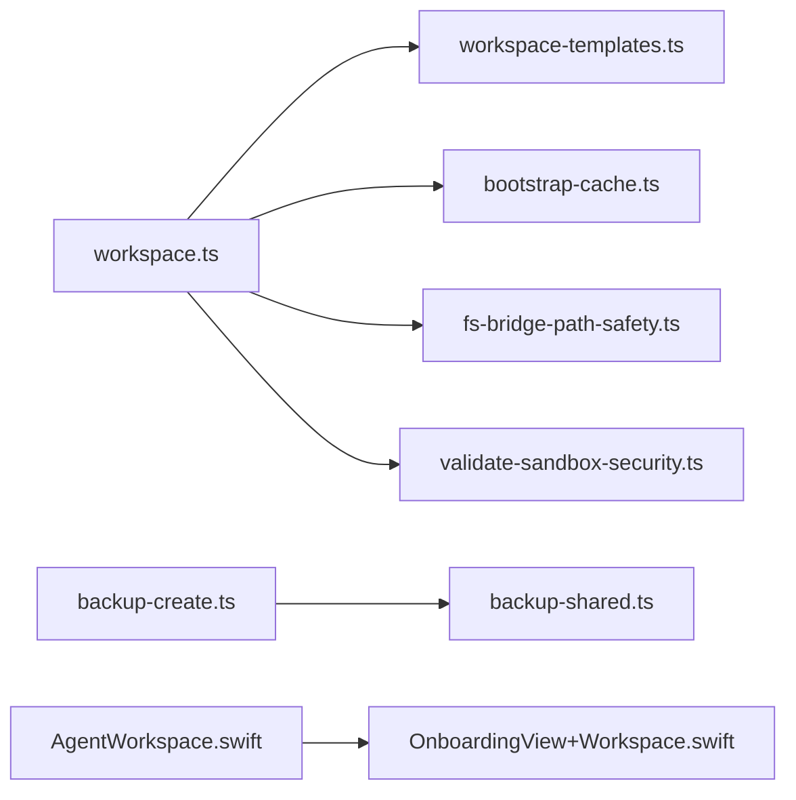

# 代理工作空间

<cite>
**本文引用的文件**
- [workspace.ts](file://src/agents/workspace.ts)
- [agent-workspace.md](file://docs/concepts/agent-workspace.md)
- [bootstrapping.md](file://docs/start/bootstrapping.md)
- [backup.md](file://docs/cli/backup.md)
- [sandboxing.md](file://docs/gateway/sandboxing.md)
- [workspace-templates.ts](file://src/agents/workspace-templates.ts)
- [fs-bridge-path-safety.ts](file://src/agents/sandbox/fs-bridge-path-safety.ts)
- [validate-sandbox-security.ts](file://src/agents/sandbox/validate-sandbox-security.ts)
- [agent-scope.ts](file://src/agents/agent-scope.ts)
- [workspace-dir.ts](file://src/agents/workspace-dir.ts)
- [bootstrap-cache.ts](file://src/agents/bootstrap-cache.ts)
- [backup-create.ts](file://src/infra/backup-create.ts)
- [backup-shared.ts](file://src/commands/backup-shared.ts)
- [windows-acl.ts](file://src/security/windows-acl.ts)
- [audit-extra.async.ts](file://src/security/audit-extra.async.ts)
- [AgentWorkspace.swift](file://apps/macos/Sources/OpenClaw/AgentWorkspace.swift)
- [OnboardingView+Workspace.swift](file://apps/macos/Sources/OpenClaw/OnboardingView+Workspace.swift)
</cite>

## 目录
1. [简介](#简介)
2. [项目结构](#项目结构)
3. [核心组件](#核心组件)
4. [架构总览](#架构总览)
5. [详细组件分析](#详细组件分析)
6. [依赖关系分析](#依赖关系分析)
7. [性能考量](#性能考量)
8. [故障排查指南](#故障排查指南)
9. [结论](#结论)
10. [附录](#附录)

## 简介
本文件系统性阐述 OpenClaw 代理工作空间（Agent Workspace）的设计与实现，覆盖以下主题：
- 工作空间的概念与作用：作为代理的“家”，是文件类工具与上下文的主要工作目录；默认并非硬沙箱，但可通过沙箱配置实现文件系统隔离与网络隔离。
- 文件系统隔离与权限控制：通过边界读取、路径安全校验、只读挂载与容器隔离降低越权风险。
- 沙箱机制：在启用沙箱时，工具执行在容器内进行，支持按会话或按代理共享容器，以及多种工作空间访问模式（无/只读/读写）。
- 目录结构与文件组织：标准引导文件（AGENTS.md、SOUL.md、TOOLS.md、IDENTITY.md、USER.md、HEARTBEAT.md、BOOTSTRAP.md）、每日记忆日志（memory/YYYY-MM-DD.md）、可选长期记忆（MEMORY.md）、技能与画布资源等。
- 生命周期管理：创建工作空间、引导文件生成与清理、备份与恢复策略。
- 安全模型：文件访问控制、工具执行权限、数据隔离、跨平台权限审计与修复建议。
- 配置指南：路径设置、权限配置、性能优化与最佳实践。

## 项目结构
围绕工作空间的关键代码与文档分布如下：
- 核心实现：src/agents/workspace.ts 负责工作空间的创建、引导文件加载与状态记录。
- 文档规范：docs/concepts/agent-workspace.md 描述工作空间布局、文件语义与备份策略。
- 引导流程：docs/start/bootstrapping.md 解释首次运行的引导仪式与身份信息收集。
- 备份与恢复：docs/cli/backup.md 说明本地备份归档的创建与验证；src/infra/backup-create.ts 与 src/commands/backup-shared.ts 提供备份计划与清单构建。
- 沙箱与安全：docs/gateway/sandboxing.md 说明沙箱模式、作用域、工作空间访问与镜像；src/agents/sandbox 下的路径安全与网络模式校验保障容器边界。
- 路径解析与作用域：src/agents/agent-scope.ts 与 src/agents/workspace-dir.ts 提供工作空间路径解析与规范化。
- 引导缓存：src/agents/bootstrap-cache.ts 缓存会话级引导文件快照以提升性能。
- 平台集成：apps/macos/Sources/OpenClaw/AgentWorkspace.swift 与 OnboardingView+Workspace.swift 提供 macOS 应用侧的引导与工作空间路径保存逻辑。



**图表来源**
- [agent-workspace.md:1-237](file://docs/concepts/agent-workspace.md#L1-L237)
- [bootstrapping.md:1-42](file://docs/start/bootstrapping.md#L1-L42)
- [sandboxing.md:1-260](file://docs/gateway/sandboxing.md#L1-L260)
- [backup.md:1-77](file://docs/cli/backup.md#L1-L77)
- [workspace.ts:1-656](file://src/agents/workspace.ts#L1-L656)
- [workspace-templates.ts:1-60](file://src/agents/workspace-templates.ts#L1-L60)
- [bootstrap-cache.ts:1-36](file://src/agents/bootstrap-cache.ts#L1-L36)
- [agent-scope.ts:256-288](file://src/agents/agent-scope.ts#L256-L288)
- [workspace-dir.ts:1-20](file://src/agents/workspace-dir.ts#L1-L20)
- [fs-bridge-path-safety.ts:1-135](file://src/agents/sandbox/fs-bridge-path-safety.ts#L1-L135)
- [validate-sandbox-security.ts:272-306](file://src/agents/sandbox/validate-sandbox-security.ts#L272-L306)
- [backup-create.ts:190-231](file://src/infra/backup-create.ts#L190-L231)
- [backup-shared.ts:98-138](file://src/commands/backup-shared.ts#L98-L138)
- [AgentWorkspace.swift:73-92](file://apps/macos/Sources/OpenClaw/AgentWorkspace.swift#L73-L92)
- [OnboardingView+Workspace.swift:70-97](file://apps/macos/Sources/OpenClaw/OnboardingView+Workspace.swift#L70-L97)

**章节来源**
- [agent-workspace.md:1-237](file://docs/concepts/agent-workspace.md#L1-L237)
- [workspace.ts:1-656](file://src/agents/workspace.ts#L1-L656)

## 核心组件
- 工作空间创建与引导
  - 默认位置与环境变量：根据用户主目录与 OPENCLAW_PROFILE 决定默认工作空间路径；支持 per-agent 覆盖。
  - 引导文件：首次运行自动创建 AGENTS.md、SOUL.md、TOOLS.md、IDENTITY.md、USER.md、HEARTBEAT.md；若为全新工作空间且存在 git 可用，则初始化仓库。
  - 引导状态：记录引导种子时间与完成时间，避免重复引导；BOOTSTRAP.md 在引导完成后删除。
- 引导文件加载与过滤
  - 加载标准引导文件与可选 MEMORY.md/memory.md，并去重同源文件；支持按会话键过滤最小化引导集（子代理与定时任务）。
  - 引导缓存：按会话键缓存引导文件快照，减少重复 IO。
- 模板与路径
  - 模板目录解析：优先包内模板，其次当前工作目录，最后回退到内置模板目录。
  - 路径规范化：拒绝根路径作为工作空间，支持 ~ 展开与大小写敏感平台的规范化。
- 备份与恢复
  - 备份清单：记录 state 目录、配置、凭据、工作空间等路径；支持仅备份配置或排除工作空间。
  - 归档验证：校验清单与归档一致性，防止路径穿越与自包含。
- 沙箱与安全
  - 路径安全：限定容器内路径必须位于挂载根内，禁止越界与只读挂载上的写操作；对符号链接与别名进行二次校验。
  - 网络模式：阻止 host 与容器命名空间加入模式，确保容器网络隔离。
- 平台集成
  - macOS 引导安全检查：检测工作空间路径是否存在、是否为空目录或已存在 AGENTS.md；空目录或仅含 AGENTS.md 视为安全。
  - 引导界面：保存用户选择的工作空间路径至配置并持久化。

**章节来源**
- [workspace.ts:12-656](file://src/agents/workspace.ts#L12-L656)
- [workspace-templates.ts:1-60](file://src/agents/workspace-templates.ts#L1-L60)
- [bootstrap-cache.ts:1-36](file://src/agents/bootstrap-cache.ts#L1-L36)
- [agent-scope.ts:256-288](file://src/agents/agent-scope.ts#L256-L288)
- [workspace-dir.ts:1-20](file://src/agents/workspace-dir.ts#L1-L20)
- [fs-bridge-path-safety.ts:1-135](file://src/agents/sandbox/fs-bridge-path-safety.ts#L1-L135)
- [validate-sandbox-security.ts:272-306](file://src/agents/sandbox/validate-sandbox-security.ts#L272-L306)
- [backup-create.ts:190-231](file://src/infra/backup-create.ts#L190-L231)
- [backup-shared.ts:98-138](file://src/commands/backup-shared.ts#L98-L138)
- [AgentWorkspace.swift:73-92](file://apps/macos/Sources/OpenClaw/AgentWorkspace.swift#L73-L92)
- [OnboardingView+Workspace.swift:70-97](file://apps/macos/Sources/OpenClaw/OnboardingView+Workspace.swift#L70-L97)

## 架构总览
下图展示工作空间从创建到使用的端到端流程，包括引导、加载、沙箱与备份：



**图表来源**
- [workspace.ts:321-459](file://src/agents/workspace.ts#L321-L459)
- [workspace-templates.ts:14-54](file://src/agents/workspace-templates.ts#L14-L54)
- [bootstrap-cache.ts:5-17](file://src/agents/bootstrap-cache.ts#L5-L17)
- [fs-bridge-path-safety.ts:51-116](file://src/agents/sandbox/fs-bridge-path-safety.ts#L51-L116)
- [validate-sandbox-security.ts:283-306](file://src/agents/sandbox/validate-sandbox-security.ts#L283-L306)
- [backup-create.ts:190-231](file://src/infra/backup-create.ts#L190-L231)

## 详细组件分析

### 组件一：工作空间创建与引导（workspace.ts）
- 功能要点
  - 默认路径解析：结合 HOME 与 OPENCLAW_PROFILE，支持 per-agent 覆盖。
  - 引导文件创建：首次运行写入标准引导文件；若未发现用户内容迹象，保留 BOOTSTRAP.md 用于引导；引导完成后删除。
  - git 初始化：品牌新工作空间自动初始化 git 仓库（若可用）。
  - 引导文件加载：读取并缓存引导文件，支持额外通配符匹配与诊断输出。
  - 会话过滤：子代理与定时任务场景仅注入最小化引导集。
- 关键流程图



**图表来源**
- [workspace.ts:321-459](file://src/agents/workspace.ts#L321-L459)

**章节来源**
- [workspace.ts:12-656](file://src/agents/workspace.ts#L12-L656)

### 组件二：引导文件加载与缓存（workspace.ts、bootstrap-cache.ts）
- 功能要点
  - 标准引导文件：AGENTS、SOUL、TOOLS、IDENTITY、USER、HEARTBEAT、BOOTSTRAP。
  - 可选记忆文件：MEMORY.md 或 memory.md，自动去重同源文件。
  - 会话级缓存：按 sessionKey 缓存引导文件快照，避免重复 IO。
  - 过滤策略：子代理与定时任务仅注入最小集合。
- 类图



**图表来源**
- [workspace.ts:143-148](file://src/agents/workspace.ts#L143-L148)
- [bootstrap-cache.ts:1-36](file://src/agents/bootstrap-cache.ts#L1-L36)

**章节来源**
- [workspace.ts:498-573](file://src/agents/workspace.ts#L498-L573)
- [bootstrap-cache.ts:1-36](file://src/agents/bootstrap-cache.ts#L1-L36)

### 组件三：路径安全与沙箱（fs-bridge-path-safety.ts、validate-sandbox-security.ts）
- 功能要点
  - 路径安全：限定容器内路径必须位于挂载根内；对符号链接与别名进行二次解析校验；只读挂载禁止写操作。
  - 网络模式：阻止 host 与容器命名空间加入模式，防止网络隔离被绕过。
- 流程图



**图表来源**
- [fs-bridge-path-safety.ts:51-116](file://src/agents/sandbox/fs-bridge-path-safety.ts#L51-L116)
- [validate-sandbox-security.ts:272-306](file://src/agents/sandbox/validate-sandbox-security.ts#L272-L306)

**章节来源**
- [fs-bridge-path-safety.ts:1-135](file://src/agents/sandbox/fs-bridge-path-safety.ts#L1-L135)
- [validate-sandbox-security.ts:272-306](file://src/agents/sandbox/validate-sandbox-security.ts#L272-L306)

### 组件四：备份与恢复（backup.md、backup-create.ts、backup-shared.ts）
- 功能要点
  - 备份范围：state 目录、配置、凭据、工作空间（可选）。
  - 清单构建：记录源路径与归档布局；支持仅配置备份与排除工作空间。
  - 归档验证：校验清单与归档一致性，防止路径穿越与自包含。
- 序列图

```mermaid
sequenceDiagram
participant CLI as "openclaw backup"
participant Plan as "backup-shared.ts"
participant Create as "backup-create.ts"
CLI->>Plan : 解析备份计划包含/排除工作空间
Plan-->>CLI : 返回包含/跳过的路径
CLI->>Create : 构建清单与归档
Create-->>CLI : 输出归档与清单
```

**图表来源**
- [backup.md:1-77](file://docs/cli/backup.md#L1-L77)
- [backup-shared.ts:98-138](file://src/commands/backup-shared.ts#L98-L138)
- [backup-create.ts:190-231](file://src/infra/backup-create.ts#L190-L231)

**章节来源**
- [backup.md:1-77](file://docs/cli/backup.md#L1-L77)
- [backup-shared.ts:98-138](file://src/commands/backup-shared.ts#L98-L138)
- [backup-create.ts:190-231](file://src/infra/backup-create.ts#L190-L231)

### 组件五：平台集成（macOS 引导安全与路径保存）
- 功能要点
  - 引导安全检查：若目录不存在或非目录则视为安全；若存在 AGENTS.md 则安全；否则目录需为空或提示选择新目录。
  - 路径保存：将用户输入的工作空间路径写入配置并持久化。
- 流程图



**图表来源**
- [AgentWorkspace.swift:73-92](file://apps/macos/Sources/OpenClaw/AgentWorkspace.swift#L73-L92)
- [OnboardingView+Workspace.swift:70-97](file://apps/macos/Sources/OpenClaw/OnboardingView+Workspace.swift#L70-L97)

**章节来源**
- [AgentWorkspace.swift:73-92](file://apps/macos/Sources/OpenClaw/AgentWorkspace.swift#L73-L92)
- [OnboardingView+Workspace.swift:70-97](file://apps/macos/Sources/OpenClaw/OnboardingView+Workspace.swift#L70-L97)

## 依赖关系分析
- 组件耦合
  - workspace.ts 依赖 workspace-templates.ts（模板目录解析）、bootstrap-cache.ts（引导缓存）、fs-bridge-path-safety.ts（路径安全）、validate-sandbox-security.ts（网络安全）。
  - backup-shared.ts 与 backup-create.ts 协作生成备份清单与归档。
  - macOS 平台侧 AgentWorkspace.swift 与 OnboardingView+Workspace.swift 与后端配置交互。
- 外部依赖
  - git 命令（brand-new workspace 初始化）。
  - Docker（沙箱容器，受 validate-sandbox-security.ts 限制）。
  - 文件系统边界读取（openBoundaryFile）与路径解析（realpath）。



**图表来源**
- [workspace.ts:1-656](file://src/agents/workspace.ts#L1-L656)
- [workspace-templates.ts:1-60](file://src/agents/workspace-templates.ts#L1-L60)
- [bootstrap-cache.ts:1-36](file://src/agents/bootstrap-cache.ts#L1-L36)
- [fs-bridge-path-safety.ts:1-135](file://src/agents/sandbox/fs-bridge-path-safety.ts#L1-L135)
- [validate-sandbox-security.ts:272-306](file://src/agents/sandbox/validate-sandbox-security.ts#L272-L306)
- [backup-create.ts:190-231](file://src/infra/backup-create.ts#L190-L231)
- [backup-shared.ts:98-138](file://src/commands/backup-shared.ts#L98-L138)
- [AgentWorkspace.swift:73-92](file://apps/macos/Sources/OpenClaw/AgentWorkspace.swift#L73-L92)
- [OnboardingView+Workspace.swift:70-97](file://apps/macos/Sources/OpenClaw/OnboardingView+Workspace.swift#L70-L97)

**章节来源**
- [workspace.ts:1-656](file://src/agents/workspace.ts#L1-L656)
- [backup-create.ts:190-231](file://src/infra/backup-create.ts#L190-L231)
- [backup-shared.ts:98-138](file://src/commands/backup-shared.ts#L98-L138)

## 性能考量
- 引导文件缓存：按会话键缓存引导文件快照，避免重复读取与解析。
- 边界读取与缓存：工作空间文件读取采用边界安全打开并基于 inode/dev/size/mtime 身份缓存，减少重复 IO。
- 备份体积控制：large workspaces 是主要体积驱动因素；可通过仅备份配置或排除工作空间来减小归档体积。
- 路径安全校验：在容器内进行挂载根与符号链接校验，避免越界访问带来的额外开销。

[本节为通用指导，无需特定文件分析]

## 故障排查指南
- 引导文件缺失或损坏
  - 使用 openclaw setup 重建缺失的默认引导文件；调整 agents.defaults.bootstrapMaxChars 与 agents.defaults.bootstrapTotalMaxChars 控制注入大小。
- 路径越界与只读错误
  - 沙箱内路径必须位于挂载根内；只读挂载上禁止写操作；检查符号链接与别名解析结果。
- 网络模式被阻止
  - host 与容器命名空间加入模式被默认阻止；如需例外，参考危险开关配置并充分信任运行时。
- 权限问题（macOS/Windows）
  - macOS：检查工作空间目录权限与 ACL；必要时使用安全审计与修复工具。
  - Windows：ACL 分类与信任主体集合影响权限判定；注意世界可读写与组可读写的风险。
- 备份失败或不完整
  - 检查备份计划中包含/排除项；使用 openclaw backup verify 校验归档一致性；必要时仅备份配置或排除工作空间。

**章节来源**
- [workspace.ts:498-573](file://src/agents/workspace.ts#L498-L573)
- [fs-bridge-path-safety.ts:51-116](file://src/agents/sandbox/fs-bridge-path-safety.ts#L51-L116)
- [validate-sandbox-security.ts:283-306](file://src/agents/sandbox/validate-sandbox-security.ts#L283-L306)
- [windows-acl.ts:82-119](file://src/security/windows-acl.ts#L82-L119)
- [audit-extra.async.ts:949-981](file://src/security/audit-extra.async.ts#L949-L981)
- [backup.md:1-77](file://docs/cli/backup.md#L1-L77)

## 结论
OpenClaw 的代理工作空间通过“默认非硬沙箱 + 可选容器隔离”的设计，在灵活性与安全性之间取得平衡。其标准引导文件体系、严格的路径安全校验与网络模式限制、完善的备份与恢复能力，共同构成了可靠的工作空间生命周期管理方案。配合 per-agent 路径覆盖与多模式沙箱配置，开发者可以按需实现从轻量到强隔离的多种部署形态。

[本节为总结，无需特定文件分析]

## 附录

### A. 工作空间目录结构与文件语义
- 标准引导文件
  - AGENTS.md：代理操作说明与记忆规则。
  - SOUL.md：人格、语气与边界。
  - USER.md：用户身份与称谓。
  - IDENTITY.md：代理名称、气质与表情。
  - TOOLS.md：本地工具与约定说明。
  - HEARTBEAT.md：心跳检查清单。
  - BOOTSTRAP.md：一次性首次运行仪式，引导完成后删除。
- 记忆与资源
  - memory/YYYY-MM-DD.md：每日记忆日志。
  - MEMORY.md：可选长期记忆。
  - skills/：工作空间专属技能（覆盖内置技能）。
  - canvas/：节点显示的画布 UI 文件（例如 canvas/index.html）。
- 不在工作空间内的内容
  - ~/.openclaw/openclaw.json（配置）、credentials/（OAuth 令牌、API 密钥）、sessions/（会话转录与元数据）、managed skills/。

**章节来源**
- [agent-workspace.md:64-137](file://docs/concepts/agent-workspace.md#L64-L137)

### B. 生命周期管理
- 创建与初始化
  - 通过 openclaw onboard/configure/setup 自动创建工作空间与引导文件；品牌新工作空间自动初始化 git 仓库。
- 引导与清理
  - 引导文件写入后，BOOTSTRAP.md 在引导完成后删除，避免重复执行。
- 备份与恢复
  - 使用 openclaw backup create 创建本地归档；通过 backup verify 校验；迁移时克隆私有仓库并设置 agents.defaults.workspace。

**章节来源**
- [bootstrapping.md:17-25](file://docs/start/bootstrapping.md#L17-L25)
- [agent-workspace.md:138-230](file://docs/concepts/agent-workspace.md#L138-L230)
- [backup.md:1-77](file://docs/cli/backup.md#L1-L77)

### C. 安全模型与最佳实践
- 文件访问控制
  - 使用边界读取与路径安全校验，禁止越界与只读挂载上的写操作。
- 工具执行权限
  - 沙箱模式下工具在容器内执行；elevated exec 明确为宿主机执行的逃生舱口。
- 数据隔离机制
  - workspaceAccess 支持 none/ro/rw；默认 none 将工作空间置于 ~/.openclaw/sandboxes。
- 跨平台权限
  - macOS：检查 ACL 与信任主体；Windows：分类 ACL 并识别世界等价 SID。
- 最佳实践
  - 将工作空间放入私有 git 仓库；避免在工作空间中存储密钥与敏感信息；定期备份；仅在必要时开启 rw 挂载。

**章节来源**
- [sandboxing.md:57-116](file://docs/gateway/sandboxing.md#L57-L116)
- [fs-bridge-path-safety.ts:51-116](file://src/agents/sandbox/fs-bridge-path-safety.ts#L51-L116)
- [validate-sandbox-security.ts:283-306](file://src/agents/sandbox/validate-sandbox-security.ts#L283-L306)
- [windows-acl.ts:82-119](file://src/security/windows-acl.ts#L82-L119)
- [agent-workspace.md:202-222](file://docs/concepts/agent-workspace.md#L202-L222)

### D. 配置指南
- 路径设置
  - 默认：~/.openclaw/workspace；可通过 OPENCLAW_PROFILE 切换带后缀的工作空间；per-agent 可在 agents.list[].workspace 覆盖。
- 权限配置
  - macOS/Windows：使用安全审计与修复工具调整权限；避免组可读与世界可写。
- 性能优化
  - 启用引导文件缓存；仅在需要时启用 rw 挂载；缩小备份范围（仅配置或排除工作空间）。

**章节来源**
- [agent-scope.ts:256-272](file://src/agents/agent-scope.ts#L256-L272)
- [workspace-dir.ts:4-16](file://src/agents/workspace-dir.ts#L4-L16)
- [backup.md:63-77](file://docs/cli/backup.md#L63-L77)