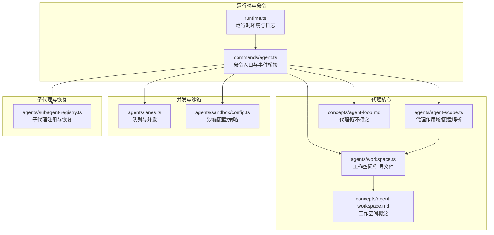
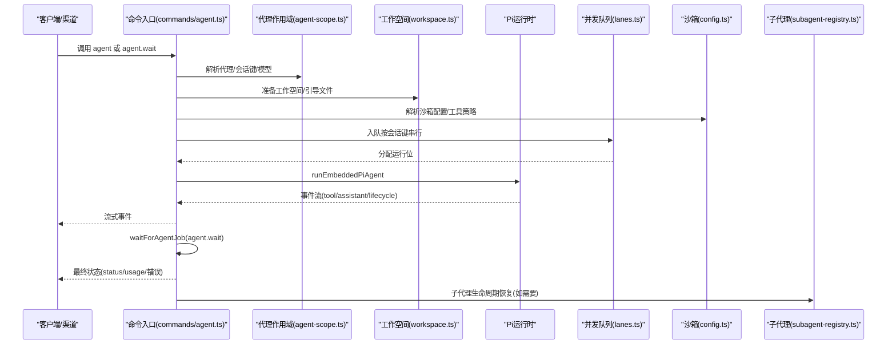
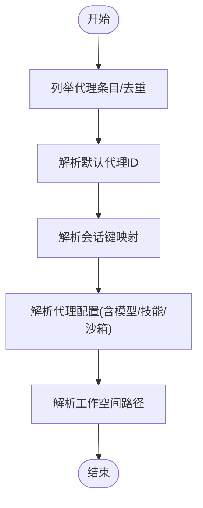
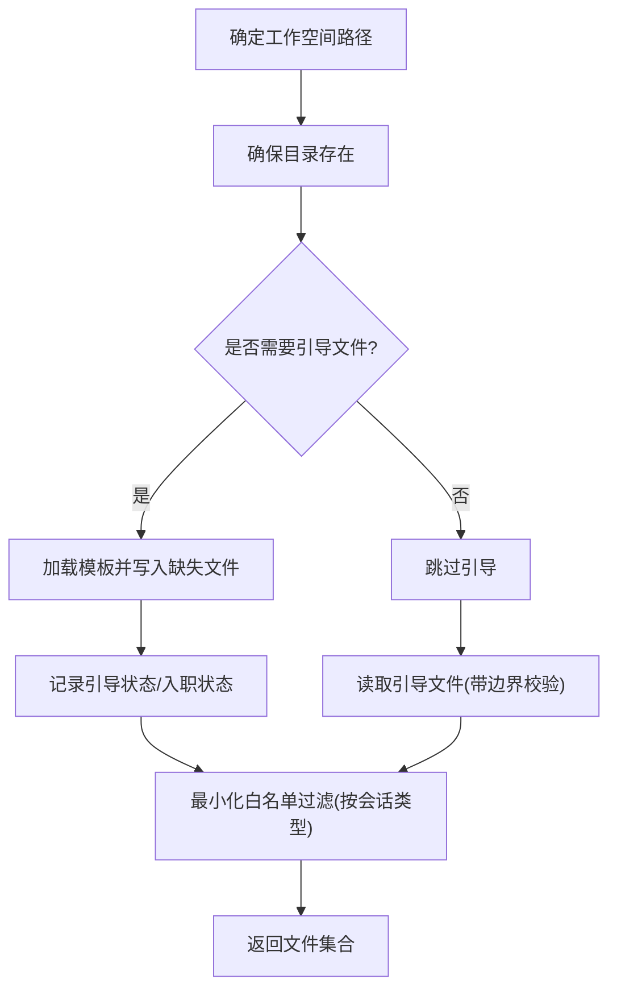
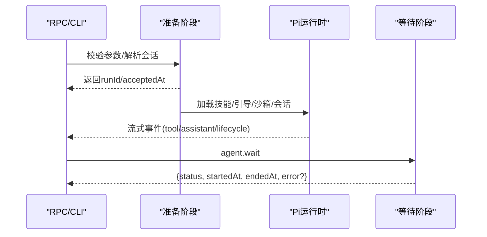
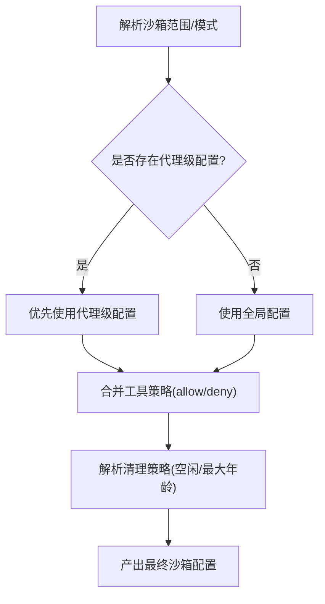
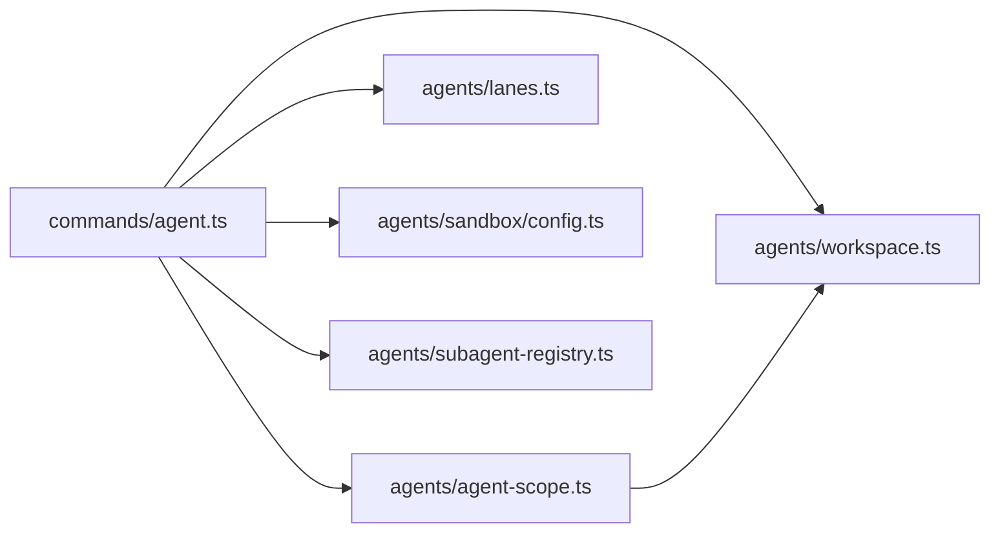

# 代理系统

<cite>
**本文引用的文件**
- [runtime.ts](file://src/runtime.ts)
- [agent-scope.ts](file://src/agents/agent-scope.ts)
- [workspace.ts](file://src/agents/workspace.ts)
- [agent-loop.md](file://docs/concepts/agent-loop.md)
- [agent-workspace.md](file://docs/concepts/agent-workspace.md)
- [config.ts](file://src/agents/sandbox/config.ts)
- [agent.ts](file://src/commands/agent.ts)
- [lanes.ts](file://src/agents/lanes.ts)
- [subagent-registry.ts](file://src/agents/subagent-registry.ts)
- [agent-sandbox-config.e2e.test.ts](file://src/agents/sandbox-agent-config.agent-specific-sandbox-config.e2e.test.ts)
</cite>

## 目录
1. [简介](#简介)
2. [项目结构](#项目结构)
3. [核心组件](#核心组件)
4. [架构总览](#架构总览)
5. [详细组件分析](#详细组件分析)
6. [依赖关系分析](#依赖关系分析)
7. [性能考量](#性能考量)
8. [故障排查指南](#故障排查指南)
9. [结论](#结论)
10. [附录](#附录)

## 简介
本文件面向OpenClaw代理系统，聚焦Pi Agent运行时的工作机制，系统性阐述代理的创建、配置与生命周期管理；深入解析代理循环（Agent Loop）的端到端执行流程（从接收消息到生成响应）；详解代理工作空间（Agent Workspace）的概念与作用（文件系统隔离、工具访问权限、会话状态管理）；说明并发处理与错误恢复机制，以及与渠道系统的集成方式。文末提供可操作的配置示例与最佳实践，帮助开发者高效构建与维护AI代理。

## 项目结构
OpenClaw采用模块化分层组织，代理相关逻辑集中在src/agents及其子目录，配合命令层、网关层、通道层协同工作。关键路径如下：
- 运行时与日志：src/runtime.ts
- 代理作用域与配置解析：src/agents/agent-scope.ts
- 工作空间与引导文件：src/agents/workspace.ts
- 概念文档：docs/concepts/agent-loop.md、docs/concepts/agent-workspace.md
- 沙箱配置与策略：src/agents/sandbox/config.ts
- 命令入口与事件桥接：src/commands/agent.ts
- 并发与队列：src/agents/lanes.ts
- 子代理与生命周期恢复：src/agents/subagent-registry.ts

**图表来源**
- [runtime.ts:1-54](file://src/runtime.ts#L1-L54)
- [agent.ts:724-755](file://src/commands/agent.ts#L724-L755)
- [agent-scope.ts:1-339](file://src/agents/agent-scope.ts#L1-L339)
- [workspace.ts:1-656](file://src/agents/workspace.ts#L1-L656)
- [agent-loop.md:1-149](file://docs/concepts/agent-loop.md#L1-L149)
- [agent-workspace.md:1-237](file://docs/concepts/agent-workspace.md#L1-L237)
- [lanes.ts:1-14](file://src/agents/lanes.ts#L1-L14)
- [config.ts:157-188](file://src/agents/sandbox/config.ts#L157-L188)
- [subagent-registry.ts:279-313](file://src/agents/subagent-registry.ts#L279-L313)

**章节来源**
- [runtime.ts:1-54](file://src/runtime.ts#L1-L54)
- [agent.ts:724-755](file://src/commands/agent.ts#L724-L755)
- [agent-scope.ts:1-339](file://src/agents/agent-scope.ts#L1-L339)
- [workspace.ts:1-656](file://src/agents/workspace.ts#L1-L656)
- [agent-loop.md:1-149](file://docs/concepts/agent-loop.md#L1-L149)
- [agent-workspace.md:1-237](file://docs/concepts/agent-workspace.md#L1-L237)
- [lanes.ts:1-14](file://src/agents/lanes.ts#L1-L14)
- [config.ts:157-188](file://src/agents/sandbox/config.ts#L157-L188)
- [subagent-registry.ts:279-313](file://src/agents/subagent-registry.ts#L279-L313)

## 核心组件
- 运行时与日志：提供统一的日志输出与退出行为，支持测试场景下的非退出模式。
- 代理作用域与配置：解析默认代理、代理列表、会话键映射、模型主备策略、工作空间路径等。
- 工作空间：负责工作空间初始化、引导文件加载与校验、Git仓库初始化、最小化引导白名单过滤等。
- 代理循环：定义从参数校验、会话准备、Pi运行时调用、事件流桥接、等待完成到最终回复组装的全链路。
- 并发与队列：按会话键串行化运行，必要时通过全局队列协调，避免竞态。
- 沙箱：按全局/代理粒度解析沙箱模式、范围、工具策略与清理策略。
- 子代理：注册与生命周期恢复，带宽限时重试保护，确保异常情况下也能收尾。

**章节来源**
- [runtime.ts:1-54](file://src/runtime.ts#L1-L54)
- [agent-scope.ts:1-339](file://src/agents/agent-scope.ts#L1-L339)
- [workspace.ts:1-656](file://src/agents/workspace.ts#L1-L656)
- [agent-loop.md:1-149](file://docs/concepts/agent-loop.md#L1-L149)
- [lanes.ts:1-14](file://src/agents/lanes.ts#L1-L14)
- [config.ts:157-188](file://src/agents/sandbox/config.ts#L157-L188)
- [subagent-registry.ts:279-313](file://src/agents/subagent-registry.ts#L279-L313)

## 架构总览
下图展示一次典型代理循环的端到端调用链：命令入口触发参数校验与会话准备，随后进入Pi运行时，期间通过事件桥接向外部流式输出工具与助手增量，最终在等待阶段汇总结果并返回。

**图表来源**
- [agent.ts:724-755](file://src/commands/agent.ts#L724-L755)
- [agent-scope.ts:1-339](file://src/agents/agent-scope.ts#L1-L339)
- [workspace.ts:1-656](file://src/agents/workspace.ts#L1-L656)
- [config.ts:157-188](file://src/agents/sandbox/config.ts#L157-L188)
- [lanes.ts:1-14](file://src/agents/lanes.ts#L1-L14)
- [subagent-registry.ts:279-313](file://src/agents/subagent-registry.ts#L279-L313)

## 详细组件分析

### 代理作用域与配置解析（agent-scope.ts）
- 列举与去重代理ID，解析默认代理，支持多代理路由与会话键解析。
- 解析代理配置（名称、工作空间、模型、技能、心跳、身份、子代理、沙箱、工具等），并提供显式/有效模型主备解析。
- 解析工作空间根目录与代理专属工作空间路径，支持跨平台路径规范化与包含判断。
- 提供代理目录解析，用于持久化与状态存储。

**图表来源**
- [agent-scope.ts:46-145](file://src/agents/agent-scope.ts#L46-L145)
- [agent-scope.ts:256-272](file://src/agents/agent-scope.ts#L256-L272)

**章节来源**
- [agent-scope.ts:46-145](file://src/agents/agent-scope.ts#L46-L145)
- [agent-scope.ts:256-272](file://src/agents/agent-scope.ts#L256-L272)

### 工作空间与引导文件（workspace.ts）
- 默认工作空间位置与多配置档支持；品牌新工作空间自动初始化Git仓库。
- 引导文件清单（AGENTS、SOUL、TOOLS、IDENTITY、USER、HEARTBEAT、BOOTSTRAP、MEMORY等）加载与边界安全读取，缓存以避免陈旧内容。
- 最小化引导白名单过滤，针对子代理或定时任务会话仅注入必要文件。
- 工作空间状态记录（引导种子时间、入职完成时间），支持迁移与兼容。

**图表来源**
- [workspace.ts:321-459](file://src/agents/workspace.ts#L321-L459)
- [workspace.ts:498-555](file://src/agents/workspace.ts#L498-L555)
- [workspace.ts:565-573](file://src/agents/workspace.ts#L565-L573)

**章节来源**
- [workspace.ts:321-459](file://src/agents/workspace.ts#L321-L459)
- [workspace.ts:498-555](file://src/agents/workspace.ts#L498-L555)
- [workspace.ts:565-573](file://src/agents/workspace.ts#L565-L573)

### 代理循环（Agent Loop）执行流程（概念与实现结合）
- 入口：Gateway RPC（agent、agent.wait）与CLI命令。
- 参数校验与会话解析：立即返回runId与acceptedAt，异步执行。
- 会话准备：工作空间创建/校验、沙箱策略应用、引导文件注入、会话写锁与SessionManager打开。
- Pi运行时：序列化执行、订阅事件流（工具/助手/生命周期）、超时控制。
- 等待完成：agent.wait等待生命周期结束或错误，返回状态与时间戳。
- 流式输出：助手增量、工具事件、生命周期阶段（start/end/error）。
- 复杂度与可靠性：自动压缩与重试、钩子扩展点、插件生命周期钩子。

**图表来源**
- [agent-loop.md:18-44](file://docs/concepts/agent-loop.md#L18-L44)
- [agent-loop.md:127-149](file://docs/concepts/agent-loop.md#L127-L149)

**章节来源**
- [agent-loop.md:1-149](file://docs/concepts/agent-loop.md#L1-L149)

### 并发与队列（lanes.ts）
- 按会话键串行化运行，避免工具/会话竞态。
- 支持嵌套代理与子代理专用队列，避免与定时任务队列冲突。
- 通过CommandLane抽象统一调度语义。

**章节来源**
- [lanes.ts:1-14](file://src/agents/lanes.ts#L1-L14)

### 沙箱配置与工具策略（sandbox/config.ts）
- 按共享/代理粒度解析沙箱范围与模式（如all/off）。
- 合并全局与代理级工具允许/拒绝列表，提供默认值与回退。
- 清理策略（空闲时长/最大年龄）可分别配置。

**图表来源**
- [config.ts:170-188](file://src/agents/sandbox/config.ts#L170-L188)
- [config.ts:157-168](file://src/agents/sandbox/config.ts#L157-L168)

**章节来源**
- [config.ts:157-188](file://src/agents/sandbox/config.ts#L157-L188)

### 子代理生命周期恢复（subagent-registry.ts）
- 在RPC等待未及时返回时，设置宽限定时器，兜底标记子代理运行为错误并发送告别消息。
- 避免重复完成，区分已完成/已成功与错误状态。

**章节来源**
- [subagent-registry.ts:279-313](file://src/agents/subagent-registry.ts#L279-L313)

### 命令入口与事件桥接（commands/agent.ts）
- 解析ACP策略与代理策略，注册运行上下文，发出生命周期start事件。
- 将Pi运行时事件桥接到OpenClaw事件流，驱动外部UI/渠道消费。

**章节来源**
- [agent.ts:724-755](file://src/commands/agent.ts#L724-L755)

## 依赖关系分析
- 命令入口依赖代理作用域解析配置、工作空间准备、并发队列与沙箱策略，并桥接Pi事件流。
- 代理作用域依赖配置模型解析、会话键解析与路径工具。
- 工作空间依赖边界文件读取、用户路径解析、Git可用性检测与模板加载。
- 并发与沙箱分别独立于核心循环，但对稳定性与安全性至关重要。
- 子代理注册在等待阶段兜底，提升整体鲁棒性。

**图表来源**
- [agent.ts:724-755](file://src/commands/agent.ts#L724-L755)
- [agent-scope.ts:1-339](file://src/agents/agent-scope.ts#L1-L339)
- [workspace.ts:1-656](file://src/agents/workspace.ts#L1-L656)
- [lanes.ts:1-14](file://src/agents/lanes.ts#L1-L14)
- [config.ts:157-188](file://src/agents/sandbox/config.ts#L157-L188)
- [subagent-registry.ts:279-313](file://src/agents/subagent-registry.ts#L279-L313)

**章节来源**
- [agent.ts:724-755](file://src/commands/agent.ts#L724-L755)
- [agent-scope.ts:1-339](file://src/agents/agent-scope.ts#L1-L339)
- [workspace.ts:1-656](file://src/agents/workspace.ts#L1-L656)
- [lanes.ts:1-14](file://src/agents/lanes.ts#L1-L14)
- [config.ts:157-188](file://src/agents/sandbox/config.ts#L157-L188)
- [subagent-registry.ts:279-313](file://src/agents/subagent-registry.ts#L279-L313)

## 性能考量
- 串行化保障：按会话键串行执行，降低工具/会话竞态与历史不一致风险。
- 缓存与边界：工作空间文件读取使用边界安全打开与内容标识缓存，减少IO与重复解析。
- 最小化注入：子代理/定时任务仅注入必要引导文件，降低上下文膨胀。
- 超时与重试：运行时超时与自动压缩/重试减少无效占用，提升吞吐。
- 日志与终端：运行时日志在测试场景下可控输出，避免干扰。

[本节为通用指导，无需特定文件引用]

## 故障排查指南
- 代理未结束或卡住：检查agent.wait是否超时，确认Pi运行时是否发出生命周期end/error事件；必要时启用子代理兜底恢复。
- 工具调用异常：关注tool流事件与结果清洗，核对工具策略allow/deny与沙箱范围。
- 工作空间读取失败：确认边界文件读取与路径规范化，检查引导文件完整性与大小限制。
- 并发冲突：确认队列配置与会话键解析，避免跨会话资源竞争。
- 日志与退出：使用非退出运行时在测试中捕获异常，定位具体错误码与堆栈。

**章节来源**
- [agent-loop.md:138-149](file://docs/concepts/agent-loop.md#L138-L149)
- [subagent-registry.ts:279-313](file://src/agents/subagent-registry.ts#L279-L313)
- [workspace.ts:48-88](file://src/agents/workspace.ts#L48-L88)
- [config.ts:157-188](file://src/agents/sandbox/config.ts#L157-L188)

## 结论
OpenClaw代理系统通过清晰的职责划分与强约束的执行链路，实现了可预测、可观测且可恢复的Pi Agent运行时。代理作用域与工作空间提供了稳定的上下文基础，代理循环串联了事件流与等待机制，沙箱与并发策略保障了安全与一致性，子代理恢复机制进一步提升了健壮性。遵循本文的最佳实践与配置建议，可帮助开发者快速搭建高可靠、高性能的AI代理。

[本节为总结，无需特定文件引用]

## 附录

### 代理工作空间概念与作用
- 定位：代理的“家”，作为默认工作目录，承载文件工具与上下文。
- 隔离：默认为非硬沙箱；启用沙箱后，非主会话可在沙箱工作区执行。
- 文件布局：标准引导文件、每日记忆、可选技能与Canvas UI等。
- 备份：推荐私有Git仓库备份，注意不要提交敏感信息。

**章节来源**
- [agent-workspace.md:1-237](file://docs/concepts/agent-workspace.md#L1-L237)

### 代理循环端到端流程（概念要点）
- 入口与参数：RPC/CLI入口、参数校验、会话解析。
- 准备阶段：工作空间/沙箱/引导/会话锁。
- 执行阶段：Pi运行时、事件流、超时控制。
- 等待与返回：agent.wait、状态汇总。
- 流式输出：助手增量、工具事件、生命周期阶段。

**章节来源**
- [agent-loop.md:1-149](file://docs/concepts/agent-loop.md#L1-L149)

### 沙箱配置示例与最佳实践
- 全局与代理级优先级：代理级覆盖全局，便于精细化管控。
- 工具策略合并：allow/deny列表按代理策略合并，避免过度放权。
- 清理策略：根据负载设定空闲与最大年龄，平衡资源占用与启动延迟。
- 示例参考：通过端到端测试验证代理级沙箱策略优先级与全局回退。

**章节来源**
- [config.ts:157-188](file://src/agents/sandbox/config.ts#L157-L188)
- [agent-sandbox-config.e2e.test.ts:211-232](file://src/agents/sandbox-agent-config.agent-specific-sandbox-config.e2e.test.ts#L211-L232)

### 并发与错误恢复最佳实践
- 串行化：按会话键串行，必要时引入全局队列。
- 宽限恢复：子代理在等待阶段兜底，避免长时间悬挂。
- 超时与重试：合理设置运行时超时与自动压缩/重试，减少无效占用。
- 日志与诊断：使用运行时日志与事件流，定位问题根因。

**章节来源**
- [lanes.ts:1-14](file://src/agents/lanes.ts#L1-L14)
- [subagent-registry.ts:279-313](file://src/agents/subagent-registry.ts#L279-L313)
- [agent-loop.md:138-149](file://docs/concepts/agent-loop.md#L138-L149)