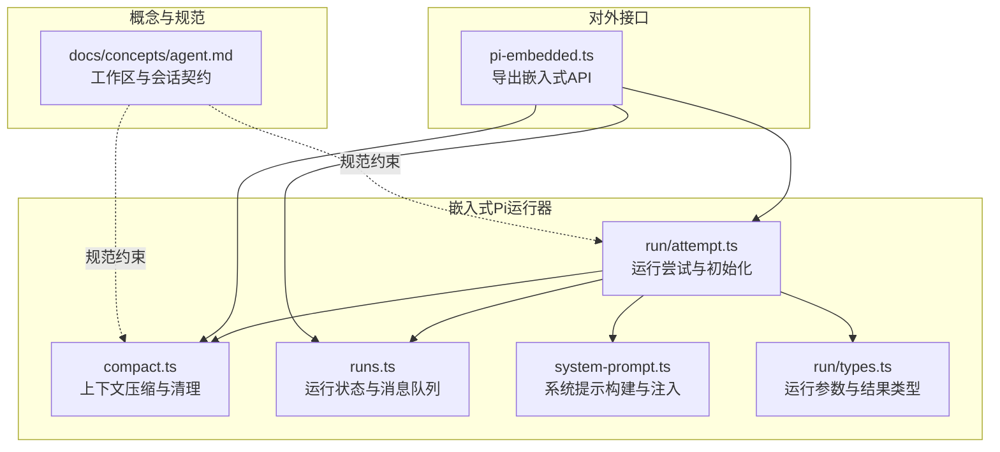
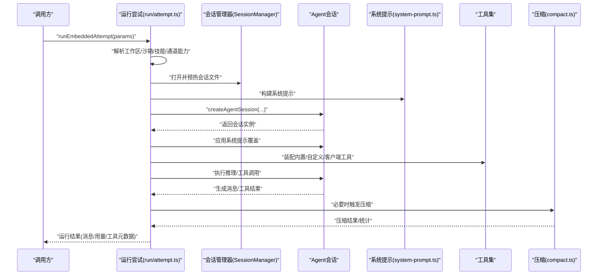
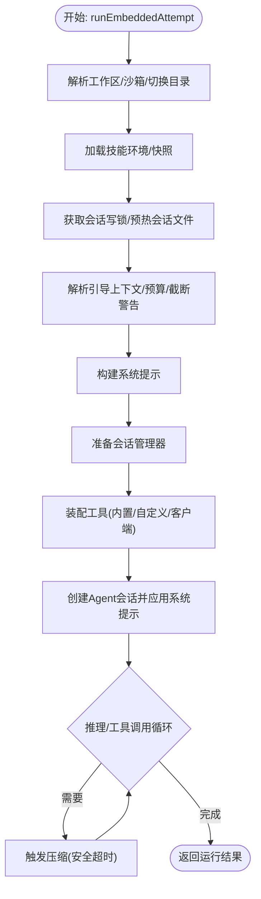
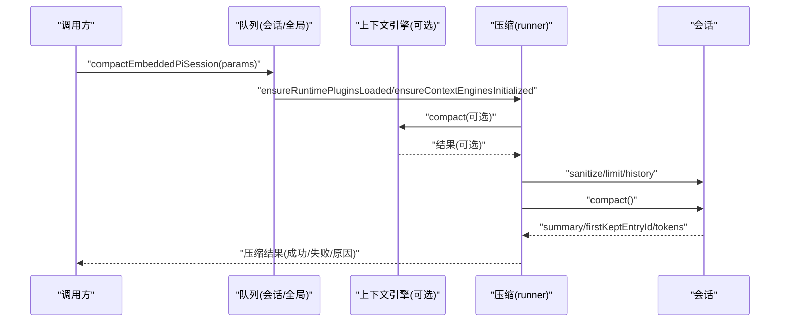
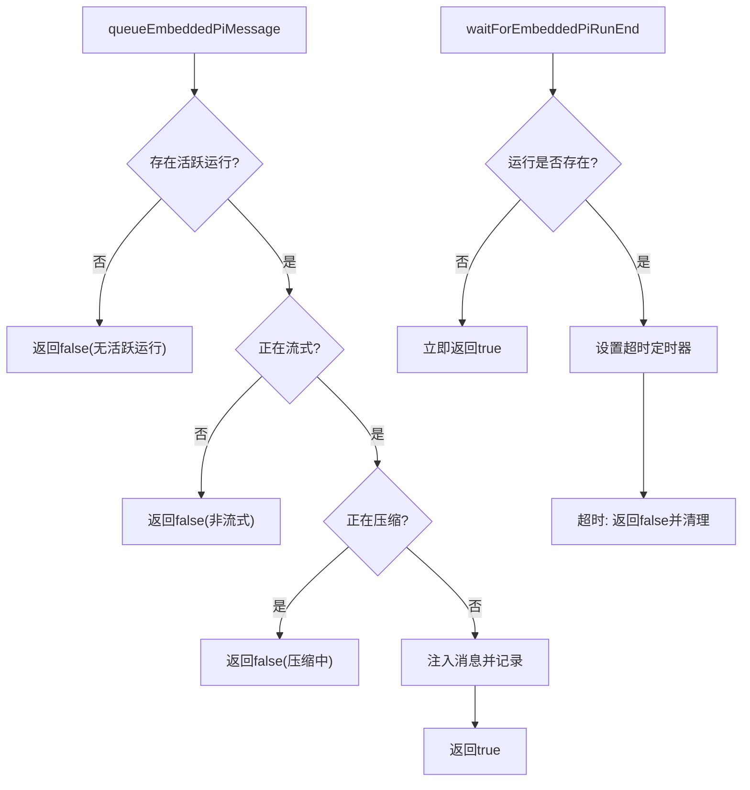
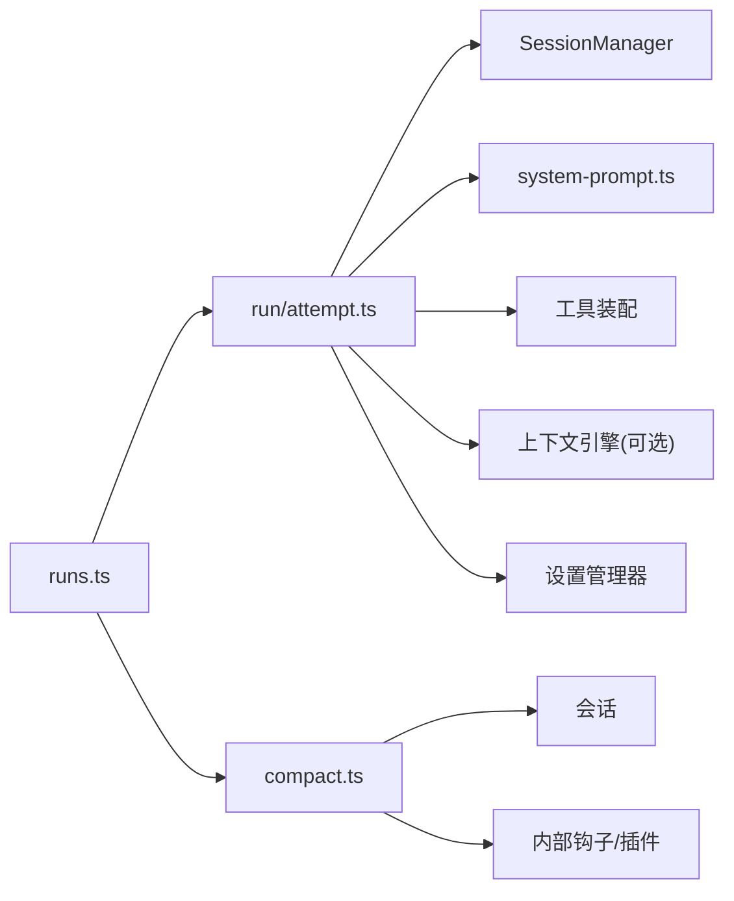

# 代理运行时

<cite>
**本文引用的文件**
- [src/agents/pi-embedded-runner/run/attempt.ts](file://src/agents/pi-embedded-runner/run/attempt.ts)
- [src/agents/pi-embedded-runner/compact.ts](file://src/agents/pi-embedded-runner/compact.ts)
- [src/agents/pi-embedded-runner/runs.ts](file://src/agents/pi-embedded-runner/runs.ts)
- [src/agents/pi-embedded-runner/system-prompt.ts](file://src/agents/pi-embedded-runner/system-prompt.ts)
- [src/agents/pi-embedded-runner/run/types.ts](file://src/agents/pi-embedded-runner/run/types.ts)
- [src/agents/pi-embedded.ts](file://src/agents/pi-embedded.ts)
- [docs/concepts/agent.md](file://docs/concepts/agent.md)
</cite>

## 目录
1. [简介](#简介)
2. [项目结构](#项目结构)
3. [核心组件](#核心组件)
4. [架构总览](#架构总览)
5. [详细组件分析](#详细组件分析)
6. [依赖分析](#依赖分析)
7. [性能考量](#性能考量)
8. [故障排查指南](#故障排查指南)
9. [结论](#结论)
10. [附录](#附录)

## 简介
本文件面向OpenClaw的Pi Agent嵌入式运行时，系统性阐述其工作机制与实现细节，重点覆盖：
- 嵌入式pi-mono运行时的集成方式与边界
- 代理初始化流程、工作空间管理、会话启动与生命周期
- 与pi-mono的复用与自定义：模型/工具沿用，会话管理/发现/工具装配由OpenClaw负责
- 生命周期管理、内存与上下文压缩、并发与队列控制
- 最佳实践：工作空间、模型选择、工具访问策略
- 配置模板与示例路径指引，便于开发者快速部署与调试

## 项目结构
OpenClaw将Pi Agent运行时集中于“嵌入式Pi运行器”子模块，围绕会话管理、系统提示构建、工具装配、上下文压缩与并发控制展开；同时通过文档明确工作区契约与会话引导规则。

图表来源
- [src/agents/pi-embedded-runner/run/attempt.ts](file://src/agents/pi-embedded-runner/run/attempt.ts)
- [src/agents/pi-embedded-runner/compact.ts](file://src/agents/pi-embedded-runner/compact.ts)
- [src/agents/pi-embedded-runner/runs.ts](file://src/agents/pi-embedded-runner/runs.ts)
- [src/agents/pi-embedded-runner/system-prompt.ts](file://src/agents/pi-embedded-runner/system-prompt.ts)
- [src/agents/pi-embedded-runner/run/types.ts](file://src/agents/pi-embedded-runner/run/types.ts)
- [src/agents/pi-embedded.ts](file://src/agents/pi-embedded.ts)
- [docs/concepts/agent.md](file://docs/concepts/agent.md)

章节来源
- [docs/concepts/agent.md:1-124](file://docs/concepts/agent.md#L1-L124)

## 核心组件
- 运行尝试与初始化（run/attempt.ts）
  - 解析工作区、沙箱、技能环境、系统提示、工具集与通道能力
  - 构建会话锁、预热会话文件、准备会话管理器
  - 创建Agent会话并应用系统提示覆盖
  - 支持上下文引擎引导、自动压缩保护、扩展工厂注册
- 上下文压缩（compact.ts）
  - 在安全超时内执行压缩，统计前后消息与token变化
  - 触发压缩前后内部钩子事件，支持插件生态
  - 提供直接压缩与带队列的压缩入口
- 运行状态与消息队列（runs.ts）
  - 维护活跃运行映射、等待结束的观察者
  - 支持在流式阶段向当前运行注入用户消息（受队列模式与并发限制）
- 系统提示构建（system-prompt.ts）
  - 将运行时信息、工具摘要、时间/时区、沙箱/通道能力等拼装为系统提示
  - 提供覆盖函数，确保会话中系统提示被固定
- 类型与契约（run/types.ts）
  - 定义运行尝试参数与结果，承载上下文引擎、预算、认证来源等关键字段
- 对外导出（pi-embedded.ts）
  - 导出嵌入式运行、压缩、消息队列、运行状态查询等API

章节来源
- [src/agents/pi-embedded-runner/run/attempt.ts:749-1200](file://src/agents/pi-embedded-runner/run/attempt.ts#L749-L1200)
- [src/agents/pi-embedded-runner/compact.ts:263-967](file://src/agents/pi-embedded-runner/compact.ts#L263-L967)
- [src/agents/pi-embedded-runner/runs.ts:1-201](file://src/agents/pi-embedded-runner/runs.ts#L1-L201)
- [src/agents/pi-embedded-runner/system-prompt.ts:11-109](file://src/agents/pi-embedded-runner/system-prompt.ts#L11-L109)
- [src/agents/pi-embedded-runner/run/types.ts:1-68](file://src/agents/pi-embedded-runner/run/types.ts#L1-L68)
- [src/agents/pi-embedded.ts:1-16](file://src/agents/pi-embedded.ts#L1-L16)

## 架构总览
嵌入式Pi运行时以“运行尝试”为主线，贯穿工作区准备、会话初始化、系统提示注入、工具装配与调用、上下文压缩与清理。并发通过会话/全局队列避免死锁；系统提示与上下文文件注入确保首次交互的引导质量。

图表来源
- [src/agents/pi-embedded-runner/run/attempt.ts:749-1200](file://src/agents/pi-embedded-runner/run/attempt.ts#L749-L1200)
- [src/agents/pi-embedded-runner/compact.ts:263-967](file://src/agents/pi-embedded-runner/compact.ts#L263-L967)
- [src/agents/pi-embedded-runner/system-prompt.ts:11-109](file://src/agents/pi-embedded-runner/system-prompt.ts#L11-L109)

## 详细组件分析

### 运行尝试与初始化（run/attempt.ts）
- 工作区与沙箱
  - 解析用户路径，按沙箱策略决定有效工作区目录，并确保存在
  - 切换进程工作目录至有效工作区，加载技能环境快照或应用技能环境覆盖
- 会话与锁
  - 打开会话文件，修复/预热，建立写锁，防止并发冲突
  - 准备会话管理器，注入允许的工具名集合与合成工具结果策略
- 系统提示与上下文
  - 解析引导上下文文件与注入文件，计算引导预算与截断警告
  - 构建运行时信息（主机、OS、架构、Node版本、默认/当前模型、Shell、通道、能力、动作）
  - 生成系统提示并覆盖会话默认提示
- 工具装配
  - 基于模型能力筛选工具，按沙箱与通道能力调整
  - 分离内置与自定义工具，注册客户端工具定义并启用循环检测
- 上下文引擎与设置
  - 若存在上下文引擎，先执行引导
  - 准备设置管理器并应用自动压缩保护
  - 注册扩展工厂到资源加载器，启用安全防护
- 会话创建与执行
  - 使用模型、思考层级、工具集与设置管理器创建Agent会话
  - 应用系统提示覆盖后进入推理/工具调用循环
- 结果与清理
  - 记录消息快照、工具元数据、最后助手消息、是否发送消息工具等
  - 释放会话锁，恢复技能环境，回到原工作目录

图表来源
- [src/agents/pi-embedded-runner/run/attempt.ts:749-1200](file://src/agents/pi-embedded-runner/run/attempt.ts#L749-L1200)
- [src/agents/pi-embedded-runner/compact.ts:263-967](file://src/agents/pi-embedded-runner/compact.ts#L263-L967)

章节来源
- [src/agents/pi-embedded-runner/run/attempt.ts:749-1200](file://src/agents/pi-embedded-runner/run/attempt.ts#L749-L1200)

### 上下文压缩（compact.ts）
- 压缩入口
  - 直接压缩：适用于已处于会话/全局队列上下文，避免死锁
  - 带队列压缩：通过会话/全局队列调度，统一并发控制
- 压缩流程
  - 解析压缩模型（优先配置覆盖，否则回退到调用方提供的模型）
  - 获取API密钥（含GitHub Copilot令牌刷新）
  - 解析上下文窗口，应用有效模型上下文限制
  - 修复/裁剪历史，触发压缩前钩子与内部事件
  - 执行压缩并统计前后消息数与token数
  - 触发压缩后钩子与内部事件，返回压缩结果
- 安全与可观测性
  - 使用安全超时包装压缩操作
  - 诊断日志输出压缩前后指标，便于定位异常

图表来源
- [src/agents/pi-embedded-runner/compact.ts:909-967](file://src/agents/pi-embedded-runner/compact.ts#L909-L967)
- [src/agents/pi-embedded-runner/compact.ts:263-902](file://src/agents/pi-embedded-runner/compact.ts#L263-L902)

章节来源
- [src/agents/pi-embedded-runner/compact.ts:263-967](file://src/agents/pi-embedded-runner/compact.ts#L263-L967)

### 运行状态与消息队列（runs.ts）
- 活跃运行管理
  - 维护sessionId到队列句柄的映射，支持查询是否正在流式或压缩
- 消息注入
  - 在流式且非压缩状态下，允许向当前运行注入用户消息
  - 注入前进行状态检查，避免并发冲突
- 运行结束等待
  - 提供等待运行结束的机制，超时则返回未结束标记
  - 通知所有等待者，清理等待集合

图表来源
- [src/agents/pi-embedded-runner/runs.ts:21-201](file://src/agents/pi-embedded-runner/runs.ts#L21-L201)

章节来源
- [src/agents/pi-embedded-runner/runs.ts:1-201](file://src/agents/pi-embedded-runner/runs.ts#L1-L201)

### 系统提示构建（system-prompt.ts）
- 构建要点
  - 合并运行时信息、工具名称与摘要、模型别名、用户时区/时间格式、上下文文件、心跳提示、技能提示、TTS提示、沙箱信息、通道能力与动作提示等
  - 提供覆盖函数，将最终系统提示固定到会话
- 作用
  - 保证首次交互与后续转轮的一致性与上下文完整性
  - 为不同通道与能力提供定制化提示

章节来源
- [src/agents/pi-embedded-runner/system-prompt.ts:11-109](file://src/agents/pi-embedded-runner/system-prompt.ts#L11-L109)

### 类型与契约（run/types.ts）
- 运行尝试参数
  - 包含上下文引擎、上下文token预算、认证来源、模型与注册表、思考层级、兼容性结果等
- 运行尝试结果
  - 包含是否中止/超时、提示错误、会话ID、消息快照、助手文本、工具元数据、消息工具发送详情、用量统计、压缩次数、客户端工具调用等

章节来源
- [src/agents/pi-embedded-runner/run/types.ts:17-68](file://src/agents/pi-embedded-runner/run/types.ts#L17-L68)

### 对外导出（pi-embedded.ts）
- 导出API
  - 运行嵌入式代理、压缩会话、查询运行状态、注入消息、等待运行结束等
- 作用
  - 作为上层调用的统一入口，屏蔽底层实现细节

章节来源
- [src/agents/pi-embedded.ts:1-16](file://src/agents/pi-embedded.ts#L1-L16)

## 依赖分析
- 运行尝试对系统组件的依赖
  - 工作区与沙箱：解析用户路径、切换工作目录、按沙箱策略决定有效工作区
  - 技能与环境：加载技能条目或快照，应用环境覆盖
  - 会话与锁：打开/修复/预热会话文件，获取写锁
  - 系统提示：构建运行时信息、工具摘要、上下文文件、沙箱/通道能力
  - 工具装配：基于模型能力筛选，分离内置/自定义/客户端工具
  - 上下文引擎与设置：引导、自动压缩保护、扩展工厂注册
- 压缩对系统组件的依赖
  - 模型解析与密钥：优先配置覆盖，否则回退调用方提供
  - 上下文窗口：按配置与模型上下文窗口计算有效token预算
  - 历史裁剪与验证：针对Anthropic/Gemini等提供特定校验
  - 钩子与内部事件：压缩前后触发，用于观测与扩展
- 并发与队列
  - 会话/全局队列避免死锁
  - 流式阶段的消息注入受状态检查约束

图表来源
- [src/agents/pi-embedded-runner/run/attempt.ts:749-1200](file://src/agents/pi-embedded-runner/run/attempt.ts#L749-L1200)
- [src/agents/pi-embedded-runner/compact.ts:263-967](file://src/agents/pi-embedded-runner/compact.ts#L263-L967)
- [src/agents/pi-embedded-runner/runs.ts:1-201](file://src/agents/pi-embedded-runner/runs.ts#L1-L201)

章节来源
- [src/agents/pi-embedded-runner/run/attempt.ts:749-1200](file://src/agents/pi-embedded-runner/run/attempt.ts#L749-L1200)
- [src/agents/pi-embedded-runner/compact.ts:263-967](file://src/agents/pi-embedded-runner/compact.ts#L263-L967)
- [src/agents/pi-embedded-runner/runs.ts:1-201](file://src/agents/pi-embedded-runner/runs.ts#L1-L201)

## 性能考量
- 上下文压缩
  - 使用安全超时避免长时间阻塞，压缩前后统计消息与token，便于评估收益
  - 历史裁剪与配对修复减少冗余与不一致，降低token占用
- 流式与分块
  - 块流式默认关闭，可通过配置开启并调节边界与分块策略，减少单行刷屏
  - 工具摘要在工具开始时发出，UI可通过事件聚合
- 并发与队列
  - 会话/全局队列避免死锁，消息注入在流式且非压缩时生效
- 模型与工具
  - 依据模型能力筛选工具，减少无效调用
  - GitHub Copilot令牌自动刷新，避免长会话中的401中断

## 故障排查指南
- 原始块日志（pi-mono）
  - 可通过环境变量启用pi-mono的原始流日志，便于定位OpenAI兼容流的解析问题
  - 日志位置与启用方式见相关文档
- 运行超时与压缩超时
  - 运行尝试与压缩均采用安全超时，超时会返回相应标记
  - 压缩后若token估算失败，会降级为未知值
- 会话锁与并发
  - 若注入消息失败，检查是否处于流式/压缩状态
  - 使用等待运行结束接口确认运行生命周期
- 引擎引导与上下文
  - 上下文引擎引导失败会被记录告警，不影响主流程
  - 确保会话文件修复与预热成功

章节来源
- [src/agents/pi-embedded-runner/runs.ts:156-188](file://src/agents/pi-embedded-runner/runs.ts#L156-L188)
- [src/agents/pi-embedded-runner/compact.ts:794-827](file://src/agents/pi-embedded-runner/compact.ts#L794-L827)

## 结论
OpenClaw的嵌入式Pi运行时在保留pi-mono模型与工具能力的同时，将会话管理、发现与工具装配完全自研，形成清晰的运行契约与可观测性。通过工作区与沙箱策略、系统提示构建、工具装配与上下文压缩，实现了稳定、可控且可扩展的代理运行时。并发与队列机制保障了多会话场景下的稳定性；配置与钩子体系为插件生态提供了扩展点。

## 附录
- 工作区与会话契约
  - 工作区为单一agent工作目录，推荐使用安装脚本初始化
  - 会话存储为JSONL，ID稳定，不读取旧版Pi/Tau会话
- 最小配置建议
  - 至少设置工作区与通道白名单
- 配置模板与示例路径
  - 参考“运行尝试”与“压缩”文件中的参数与行为，结合“概念文档”中的工作区与会话说明，组织配置与引导文件

章节来源
- [docs/concepts/agent.md:12-124](file://docs/concepts/agent.md#L12-L124)