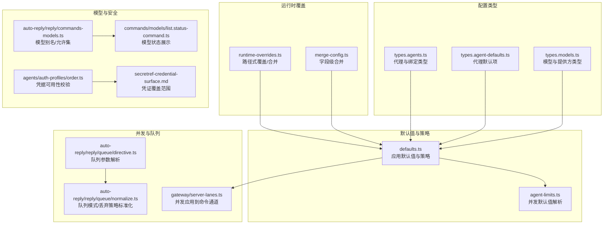
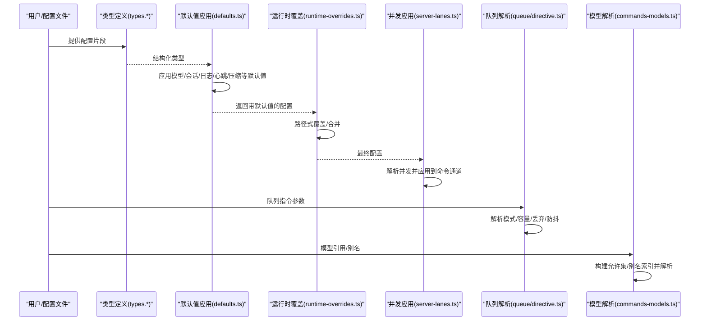
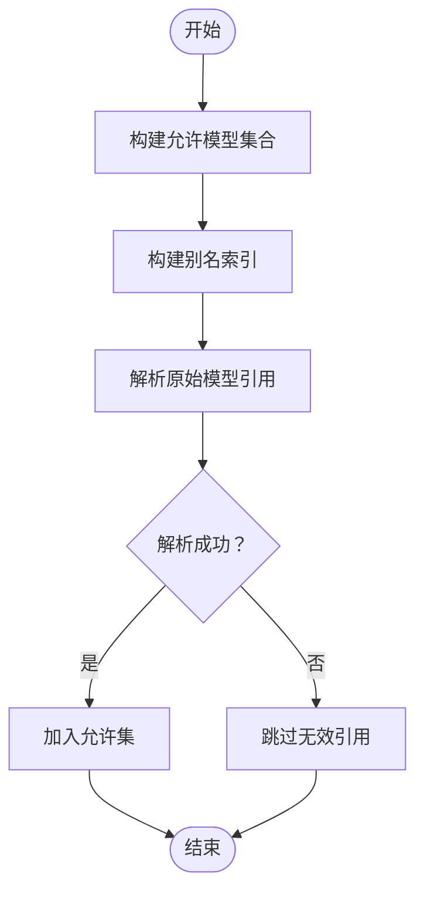
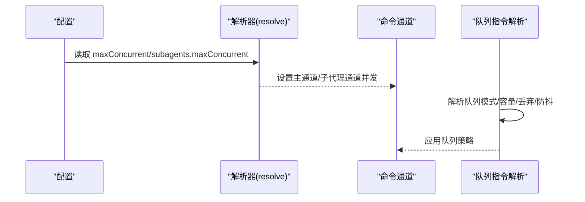
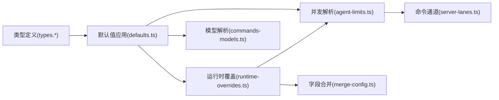

# 代理配置

<cite>
**本文引用的文件**
- [src/config/types.agents.ts](file://src/config/types.agents.ts)
- [src/config/types.agent-defaults.ts](file://src/config/types.agent-defaults.ts)
- [src/config/types.models.ts](file://src/config/types.models.ts)
- [src/config/defaults.ts](file://src/config/defaults.ts)
- [src/config/agent-limits.ts](file://src/config/agent-limits.ts)
- [src/config/runtime-overrides.ts](file://src/config/runtime-overrides.ts)
- [src/config/merge-config.ts](file://src/config/merge-config.ts)
- [src/gateway/server-lanes.ts](file://src/gateway/server-lanes.ts)
- [src/auto-reply/reply/commands-models.ts](file://src/auto-reply/reply/commands-models.ts)
- [src/agents/auth-profiles/order.ts](file://src/agents/auth-profiles/order.ts)
- [docs/reference/secretref-credential-surface.md](file://docs/reference/secretref-credential-surface.md)
- [src/commands/models/list.status-command.ts](file://src/commands/models/list.status-command.ts)
- [src/auto-reply/reply/queue/directive.ts](file://src/auto-reply/reply/queue/directive.ts)
- [src/auto-reply/reply/queue/normalize.ts](file://src/auto-reply/reply/queue/normalize.ts)
</cite>

## 目录
1. [简介](#简介)
2. [项目结构](#项目结构)
3. [核心组件](#核心组件)
4. [架构总览](#架构总览)
5. [详细组件分析](#详细组件分析)
6. [依赖关系分析](#依赖关系分析)
7. [性能考量](#性能考量)
8. [故障排除指南](#故障排除指南)
9. [结论](#结论)
10. [附录：完整配置示例与最佳实践](#附录完整配置示例与最佳实践)

## 简介
本文件面向使用 OpenClaw 的开发者与运维人员，系统化阐述“代理配置”的设计与实现，涵盖基础配置、高级配置、安全配置、模型配置、默认值与覆盖规则、并发与队列管理、以及最佳实践与常见场景。内容基于仓库中的配置类型定义、默认值应用逻辑、并发与队列解析、以及运行时覆盖机制进行归纳总结。

## 项目结构
与代理配置直接相关的核心目录与文件如下：
- 配置类型与默认值
  - src/config/types.agents.ts：定义代理与路由绑定、运行时类型等
  - src/config/types.agent-defaults.ts：定义代理默认项（模型、上下文修剪、心跳、并发、流式、打字指示、工具检索等）
  - src/config/types.models.ts：定义模型提供方、模型能力、兼容性与成本等
  - src/config/defaults.ts：集中应用各类默认值（消息、会话、Talk、模型、代理并发、日志、上下文修剪、压缩等）
  - src/config/agent-limits.ts：代理与子代理的最大并发默认值与解析
- 运行时覆盖与合并
  - src/config/runtime-overrides.ts：运行时动态覆盖配置的路径式写入/删除/合并
  - src/config/merge-config.ts：按字段粒度合并配置（支持对 undefined 的处理策略）
- 并发与队列
  - src/gateway/server-lanes.ts：从配置解析并发并应用到命令通道
  - src/auto-reply/reply/queue/directive.ts：指令解析队列模式/容量/丢弃策略/防抖
  - src/auto-reply/reply/queue/normalize.ts：队列模式与丢弃策略的标准化
- 模型别名与解析
  - src/auto-reply/reply/commands-models.ts：构建允许模型集合、别名索引、解析原始字符串引用
  - src/commands/models/list.status-command.ts：展示模型主备、图片模型、别名与允许列表
- 安全与凭据
  - src/agents/auth-profiles/order.ts：认证配置与凭据可用性校验
  - docs/reference/secretref-credential-surface.md：凭证覆盖范围与审计边界

**图表来源**
- [src/config/types.agents.ts:1-96](file://src/config/types.agents.ts#L1-L96)
- [src/config/types.agent-defaults.ts:1-346](file://src/config/types.agent-defaults.ts#L1-L346)
- [src/config/types.models.ts:1-77](file://src/config/types.models.ts#L1-L77)
- [src/config/defaults.ts:1-537](file://src/config/defaults.ts#L1-L537)
- [src/config/agent-limits.ts:1-23](file://src/config/agent-limits.ts#L1-L23)
- [src/config/runtime-overrides.ts:1-92](file://src/config/runtime-overrides.ts#L1-L92)
- [src/config/merge-config.ts:1-39](file://src/config/merge-config.ts#L1-L39)
- [src/gateway/server-lanes.ts:1-10](file://src/gateway/server-lanes.ts#L1-L10)
- [src/auto-reply/reply/queue/directive.ts:1-122](file://src/auto-reply/reply/queue/directive.ts#L1-L122)
- [src/auto-reply/reply/queue/normalize.ts:1-44](file://src/auto-reply/reply/queue/normalize.ts#L1-L44)
- [src/auto-reply/reply/commands-models.ts:46-92](file://src/auto-reply/reply/commands-models.ts#L46-L92)
- [src/commands/models/list.status-command.ts:96-117](file://src/commands/models/list.status-command.ts#L96-L117)
- [src/agents/auth-profiles/order.ts:25-65](file://src/agents/auth-profiles/order.ts#L25-L65)
- [docs/reference/secretref-credential-surface.md:1-24](file://docs/reference/secretref-credential-surface.md#L1-L24)

**章节来源**
- [src/config/types.agents.ts:1-96](file://src/config/types.agents.ts#L1-L96)
- [src/config/types.agent-defaults.ts:1-346](file://src/config/types.agent-defaults.ts#L1-L346)
- [src/config/types.models.ts:1-77](file://src/config/types.models.ts#L1-L77)
- [src/config/defaults.ts:1-537](file://src/config/defaults.ts#L1-L537)
- [src/config/agent-limits.ts:1-23](file://src/config/agent-limits.ts#L1-L23)
- [src/config/runtime-overrides.ts:1-92](file://src/config/runtime-overrides.ts#L1-L92)
- [src/config/merge-config.ts:1-39](file://src/config/merge-config.ts#L1-L39)
- [src/gateway/server-lanes.ts:1-10](file://src/gateway/server-lanes.ts#L1-L10)
- [src/auto-reply/reply/queue/directive.ts:1-122](file://src/auto-reply/reply/queue/directive.ts#L1-L122)
- [src/auto-reply/reply/queue/normalize.ts:1-44](file://src/auto-reply/reply/queue/normalize.ts#L1-L44)
- [src/auto-reply/reply/commands-models.ts:46-92](file://src/auto-reply/reply/commands-models.ts#L46-L92)
- [src/commands/models/list.status-command.ts:96-117](file://src/commands/models/list.status-command.ts#L96-L117)
- [src/agents/auth-profiles/order.ts:25-65](file://src/agents/auth-profiles/order.ts#L25-L65)
- [docs/reference/secretref-credential-surface.md:1-24](file://docs/reference/secretref-credential-surface.md#L1-L24)

## 核心组件
- 代理与绑定类型
  - 定义代理运行时类型（嵌入/ACP）、路由绑定与 ACP 绑定匹配条件
- 代理默认项
  - 模型与图片/PDF 模型、模型别名、工作空间、时间与时区、上下文修剪、压缩、CLI 后端、流式与打字指示、人类延迟、超时、媒体大小、图像尺寸、心跳、并发与子代理并发、沙箱等
- 模型与提供方
  - 模型 API 类型、模型能力兼容性、成本结构、提供方认证方式与头部注入、Bedrock 发现配置
- 默认值应用
  - 自动填充模型默认值（输入类型、成本、上下文窗口、最大输出、API），代理默认并发、日志敏感信息脱敏、上下文修剪与心跳策略、压缩模式、Talk API Key 注入与归一化
- 并发与队列
  - 解析代理与子代理最大并发；从配置应用到命令通道；队列模式/容量/丢弃策略/防抖解析与标准化
- 运行时覆盖
  - 路径式写入/删除/合并配置，支持过滤非法键与循环引用保护
- 模型别名与解析
  - 构建允许模型集合、别名索引、解析原始字符串引用（含默认提供商标识）

**章节来源**
- [src/config/types.agents.ts:19-96](file://src/config/types.agents.ts#L19-L96)
- [src/config/types.agent-defaults.ts:120-287](file://src/config/types.agent-defaults.ts#L120-L287)
- [src/config/types.models.ts:34-77](file://src/config/types.models.ts#L34-L77)
- [src/config/defaults.ts:213-347](file://src/config/defaults.ts#L213-L347)
- [src/config/agent-limits.ts:8-22](file://src/config/agent-limits.ts#L8-L22)
- [src/gateway/server-lanes.ts:6-10](file://src/gateway/server-lanes.ts#L6-L10)
- [src/auto-reply/reply/queue/directive.ts:6-122](file://src/auto-reply/reply/queue/directive.ts#L6-L122)
- [src/auto-reply/reply/queue/normalize.ts:3-44](file://src/auto-reply/reply/queue/normalize.ts#L3-L44)
- [src/config/runtime-overrides.ts:54-92](file://src/config/runtime-overrides.ts#L54-L92)
- [src/auto-reply/reply/commands-models.ts:46-92](file://src/auto-reply/reply/commands-models.ts#L46-L92)
- [src/commands/models/list.status-command.ts:96-117](file://src/commands/models/list.status-command.ts#L96-L117)

## 架构总览
下图展示了代理配置从“类型定义”到“默认值应用”、“并发与队列解析”、“运行时覆盖”的整体流程。

**图表来源**
- [src/config/types.agents.ts:1-96](file://src/config/types.agents.ts#L1-L96)
- [src/config/types.agent-defaults.ts:1-346](file://src/config/types.agent-defaults.ts#L1-L346)
- [src/config/types.models.ts:1-77](file://src/config/types.models.ts#L1-L77)
- [src/config/defaults.ts:146-211](file://src/config/defaults.ts#L146-L211)
- [src/config/runtime-overrides.ts:86-92](file://src/config/runtime-overrides.ts#L86-L92)
- [src/gateway/server-lanes.ts:6-10](file://src/gateway/server-lanes.ts#L6-L10)
- [src/auto-reply/reply/queue/directive.ts:6-122](file://src/auto-reply/reply/queue/directive.ts#L6-L122)
- [src/auto-reply/reply/commands-models.ts:46-92](file://src/auto-reply/reply/commands-models.ts#L46-L92)

## 详细组件分析

### 基础配置与代理默认项
- 关键点
  - 代理默认项涵盖模型主备与图片/PDF 模型、工作空间、时间与时区、上下文修剪、压缩、CLI 后端、流式与打字指示、人类延迟、超时、媒体大小、图像尺寸、心跳、并发与子代理并发、沙箱等
  - 默认值应用会自动填充模型输入类型、成本、上下文窗口、最大输出、API，以及代理并发、日志敏感信息脱敏、上下文修剪与心跳策略、压缩模式等
- 影响范围
  - 影响代理运行期行为（如回复节奏、上下文长度、工具调用、流式输出、打字指示、心跳触发频率等）

**章节来源**
- [src/config/types.agent-defaults.ts:120-287](file://src/config/types.agent-defaults.ts#L120-L287)
- [src/config/defaults.ts:349-388](file://src/config/defaults.ts#L349-L388)
- [src/config/defaults.ts:390-405](file://src/config/defaults.ts#L390-L405)
- [src/config/defaults.ts:407-507](file://src/config/defaults.ts#L407-L507)

### 高级配置：上下文修剪与压缩
- 上下文修剪
  - 支持关闭、缓存 TTL 两种模式；可配置 TTL、保留最后助手条目数量、软/硬裁剪比例与阈值、最小可裁剪工具文本长度、工具白/黑名单、软裁剪的头尾字符与最大字符数、硬清除占位符等
- 压缩
  - 模式支持 default/safeguard；可配置保留令牌预算、最近保留令牌预算、保留令牌下限、历史最大占比、最近回合保留数、标识符保留策略（严格/关闭/自定义）与自定义指令、质量审计重试、预压缩内存冲刷、压缩后注入段落、压缩模型覆盖等
- 默认策略
  - 当未显式配置时，自动应用模式与 TTL；针对 Anthropic API 在 API Key 模式下自动设置缓存保留参数

**章节来源**
- [src/config/types.agent-defaults.ts:24-45](file://src/config/types.agent-defaults.ts#L24-L45)
- [src/config/types.agent-defaults.ts:289-329](file://src/config/types.agent-defaults.ts#L289-L329)
- [src/config/defaults.ts:407-507](file://src/config/defaults.ts#L407-L507)

### 安全配置与凭据覆盖
- 凭据可用性校验
  - 根据提供商标识与配置模式（OAuth/token/api_key）判断凭据是否可用，并给出原因码
- 凭证覆盖范围
  - 文档定义了支持与不支持的 SecretRef 覆盖范围，用于审计与合规
- Talk API Key 注入与归一化
  - 当未显式配置且存在环境变量或默认提供方时，自动注入 API Key 并归一化配置

**章节来源**
- [src/agents/auth-profiles/order.ts:25-65](file://src/agents/auth-profiles/order.ts#L25-L65)
- [docs/reference/secretref-credential-surface.md:14-24](file://docs/reference/secretref-credential-surface.md#L14-L24)
- [src/config/defaults.ts:172-211](file://src/config/defaults.ts#L172-L211)

### 模型配置：选择、别名解析与提供商标识
- 模型主备与图片/PDF 模型
  - 支持字符串或对象形式的主备模型配置；可单独指定图片与 PDF 模型
- 模型别名
  - 内置常用别名映射（如 opus/sonnet/gpt/gemini 系列），并自动为已配置目标模型补全别名
- 别名解析与允许集
  - 构建允许模型集合与别名索引，解析原始字符串引用（含默认提供商标识）
- 模型状态展示
  - 展示主模型、图片模型、别名与允许列表，便于诊断

**图表来源**
- [src/auto-reply/reply/commands-models.ts:46-92](file://src/auto-reply/reply/commands-models.ts#L46-L92)
- [src/commands/models/list.status-command.ts:96-117](file://src/commands/models/list.status-command.ts#L96-L117)

**章节来源**
- [src/config/types.agent-defaults.ts:11-22](file://src/config/types.agent-defaults.ts#L11-L22)
- [src/config/defaults.ts:213-347](file://src/config/defaults.ts#L213-L347)
- [src/auto-reply/reply/commands-models.ts:46-92](file://src/auto-reply/reply/commands-models.ts#L46-L92)
- [src/commands/models/list.status-command.ts:96-117](file://src/commands/models/list.status-command.ts#L96-L117)

### 并发配置：最大并发数、资源限制、队列管理
- 最大并发
  - 代理与子代理的最大并发默认值与解析函数；从配置解析后应用到命令通道（主通道与子代理通道）
- 资源限制
  - 通过并发上限控制命令通道的并行度，避免资源争用
- 队列管理
  - 指令解析支持队列模式（steer/interrupt/followup/collect/steer-backlog）、容量上限、丢弃策略（旧/新/摘要）、防抖（毫秒）
  - 标准化模块将输入规范化为统一枚举值

**图表来源**
- [src/config/agent-limits.ts:8-22](file://src/config/agent-limits.ts#L8-L22)
- [src/gateway/server-lanes.ts:6-10](file://src/gateway/server-lanes.ts#L6-L10)
- [src/auto-reply/reply/queue/directive.ts:6-122](file://src/auto-reply/reply/queue/directive.ts#L6-L122)
- [src/auto-reply/reply/queue/normalize.ts:3-44](file://src/auto-reply/reply/queue/normalize.ts#L3-L44)

**章节来源**
- [src/config/agent-limits.ts:3-22](file://src/config/agent-limits.ts#L3-L22)
- [src/gateway/server-lanes.ts:6-10](file://src/gateway/server-lanes.ts#L6-L10)
- [src/auto-reply/reply/queue/directive.ts:6-122](file://src/auto-reply/reply/queue/directive.ts#L6-L122)
- [src/auto-reply/reply/queue/normalize.ts:3-44](file://src/auto-reply/reply/queue/normalize.ts#L3-L44)

### 默认值设置与覆盖规则
- 全局默认值
  - 模型默认值（输入类型、成本、上下文窗口、最大输出、API）、代理并发、日志敏感信息脱敏、上下文修剪与心跳策略、压缩模式、Talk API Key 注入与归一化
- 会话特定配置
  - 会话主键始终为“main”，其他值会被忽略并发出警告
- 运行时动态配置
  - 通过路径式覆盖写入/删除/合并配置，支持过滤非法键与循环引用保护；合并时可选择对 undefined 字段的行为

**章节来源**
- [src/config/defaults.ts:146-211](file://src/config/defaults.ts#L146-L211)
- [src/config/defaults.ts:213-347](file://src/config/defaults.ts#L213-L347)
- [src/config/defaults.ts:349-388](file://src/config/defaults.ts#L349-L388)
- [src/config/runtime-overrides.ts:54-92](file://src/config/runtime-overrides.ts#L54-L92)
- [src/config/merge-config.ts:8-24](file://src/config/merge-config.ts#L8-L24)

## 依赖关系分析
- 类型层
  - 代理与模型类型定义为默认值应用与运行时解析提供契约
- 默认值层
  - 将“类型定义”转换为“可用配置”，并注入合理的默认值
- 运行时层
  - 覆盖与合并确保在不破坏契约的前提下灵活调整配置
- 并发与队列层
  - 将配置映射到命令通道与消息队列策略

**图表来源**
- [src/config/types.agents.ts:1-96](file://src/config/types.agents.ts#L1-L96)
- [src/config/types.agent-defaults.ts:1-346](file://src/config/types.agent-defaults.ts#L1-L346)
- [src/config/types.models.ts:1-77](file://src/config/types.models.ts#L1-L77)
- [src/config/defaults.ts:1-537](file://src/config/defaults.ts#L1-L537)
- [src/config/runtime-overrides.ts:1-92](file://src/config/runtime-overrides.ts#L1-L92)
- [src/config/merge-config.ts:1-39](file://src/config/merge-config.ts#L1-L39)
- [src/config/agent-limits.ts:1-23](file://src/config/agent-limits.ts#L1-L23)
- [src/gateway/server-lanes.ts:1-10](file://src/gateway/server-lanes.ts#L1-L10)
- [src/auto-reply/reply/commands-models.ts:46-92](file://src/auto-reply/reply/commands-models.ts#L46-L92)

**章节来源**
- [src/config/defaults.ts:1-537](file://src/config/defaults.ts#L1-L537)
- [src/config/runtime-overrides.ts:1-92](file://src/config/runtime-overrides.ts#L1-L92)
- [src/config/merge-config.ts:1-39](file://src/config/merge-config.ts#L1-L39)
- [src/config/agent-limits.ts:1-23](file://src/config/agent-limits.ts#L1-L23)
- [src/gateway/server-lanes.ts:1-10](file://src/gateway/server-lanes.ts#L1-L10)
- [src/auto-reply/reply/commands-models.ts:46-92](file://src/auto-reply/reply/commands-models.ts#L46-L92)

## 性能考量
- 并发与资源
  - 合理设置代理与子代理最大并发，避免 CPU/IO 抖动；结合命令通道并发限制，平衡吞吐与稳定性
- 上下文修剪与压缩
  - 使用上下文修剪减少长对话带来的 token 压力；在高成本模型上启用压缩以降低费用
- 流式与打字指示
  - 对于长回复开启流式与打字指示，改善用户体验；注意流式输出对资源占用的影响
- 队列策略
  - 在高负载场景下采用“steer/backlog”或“interrupt”模式，结合容量与丢弃策略，避免积压与资源耗尽

[本节为通用指导，无需列出具体文件来源]

## 故障排除指南
- 模型不可用或解析失败
  - 检查模型别名与允许列表；确认提供商标识与 API 类型一致；查看模型状态展示输出
- 并发过高导致资源紧张
  - 降低代理/子代理最大并发；检查命令通道并发设置；观察队列模式与容量是否合理
- 心跳未触发或异常
  - 检查心跳间隔、活动时段与会话键；确认 Talk API Key 是否正确注入与归一化
- 凭据不可用
  - 校验提供商标识与模式一致性；确认凭据是否在支持范围内；参考凭证覆盖范围文档

**章节来源**
- [src/commands/models/list.status-command.ts:96-117](file://src/commands/models/list.status-command.ts#L96-L117)
- [src/auto-reply/reply/queue/directive.ts:6-122](file://src/auto-reply/reply/queue/directive.ts#L6-L122)
- [src/config/defaults.ts:172-211](file://src/config/defaults.ts#L172-L211)
- [src/agents/auth-profiles/order.ts:25-65](file://src/agents/auth-profiles/order.ts#L25-L65)
- [docs/reference/secretref-credential-surface.md:14-24](file://docs/reference/secretref-credential-surface.md#L14-L24)

## 结论
OpenClaw 的代理配置体系以类型安全为核心，通过默认值应用、运行时覆盖与并发/队列策略，实现了从“可配置”到“可运维”的闭环。建议在生产环境中优先明确模型主备与别名、设定合理的并发与队列策略，并结合上下文修剪与压缩降低资源消耗与成本。

[本节为总结性内容，无需列出具体文件来源]

## 附录：完整配置示例与最佳实践

### 配置示例（按类别）
- 基础代理默认项
  - 主要模型与图片/PDF 模型、工作空间、时间与时区、流式与打字指示、人类延迟、超时、媒体大小、图像尺寸、心跳、并发与子代理并发、沙箱
  - 参考路径：[src/config/types.agent-defaults.ts:120-287](file://src/config/types.agent-defaults.ts#L120-L287)
- 模型与提供方
  - 模型 API 类型、模型能力兼容性、成本结构、提供方认证方式与头部注入、Bedrock 发现配置
  - 参考路径：[src/config/types.models.ts:34-77](file://src/config/types.models.ts#L34-L77)
- 上下文修剪与压缩
  - 模式、TTL、软/硬裁剪、标识符保留策略、质量审计重试、预压缩内存冲刷、压缩后注入段落
  - 参考路径：[src/config/types.agent-defaults.ts:24-45](file://src/config/types.agent-defaults.ts#L24-L45)、[src/config/types.agent-defaults.ts:289-329](file://src/config/types.agent-defaults.ts#L289-L329)
- 并发与队列
  - 代理/子代理最大并发、命令通道并发、队列模式/容量/丢弃/防抖
  - 参考路径：[src/config/agent-limits.ts:8-22](file://src/config/agent-limits.ts#L8-L22)、[src/gateway/server-lanes.ts:6-10](file://src/gateway/server-lanes.ts#L6-L10)、[src/auto-reply/reply/queue/directive.ts:6-122](file://src/auto-reply/reply/queue/directive.ts#L6-L122)
- 运行时覆盖
  - 路径式写入/删除/合并配置，支持对 undefined 的处理策略
  - 参考路径：[src/config/runtime-overrides.ts:54-92](file://src/config/runtime-overrides.ts#L54-L92)、[src/config/merge-config.ts:8-24](file://src/config/merge-config.ts#L8-L24)

### 最佳实践
- 性能优化
  - 明确主备模型与别名，减少解析开销；启用上下文修剪与压缩，控制 token 使用；合理设置并发与队列容量，避免资源争用
- 安全性考虑
  - 使用支持范围内的凭据；校验提供商标识与模式一致性；定期审计凭据覆盖范围
- 故障排除
  - 通过模型状态展示定位模型问题；检查心跳配置与 API Key 注入；核对并发与队列策略

[本节为通用指导，无需列出具体文件来源]