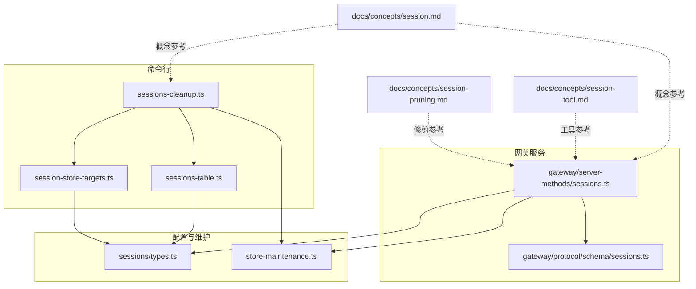
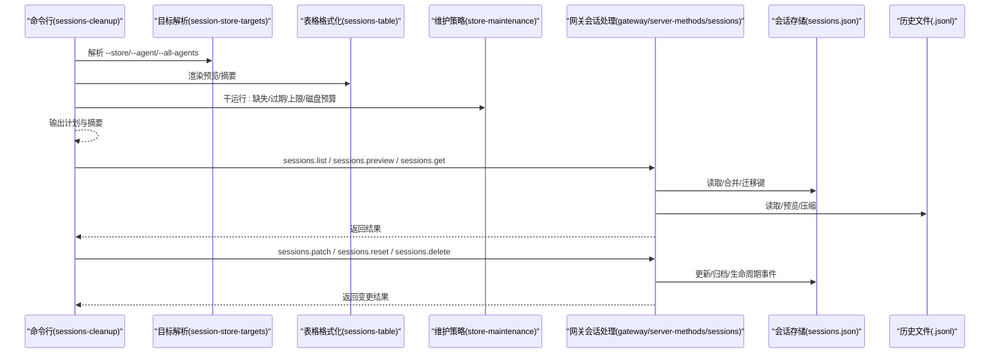
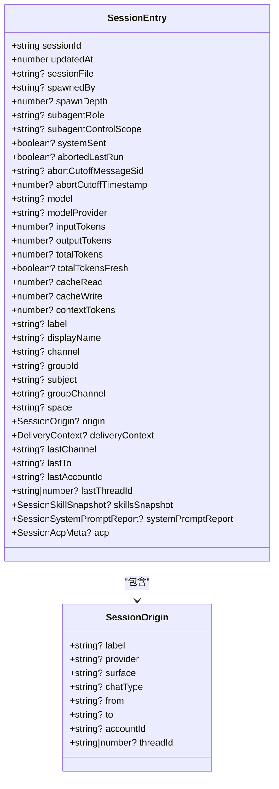
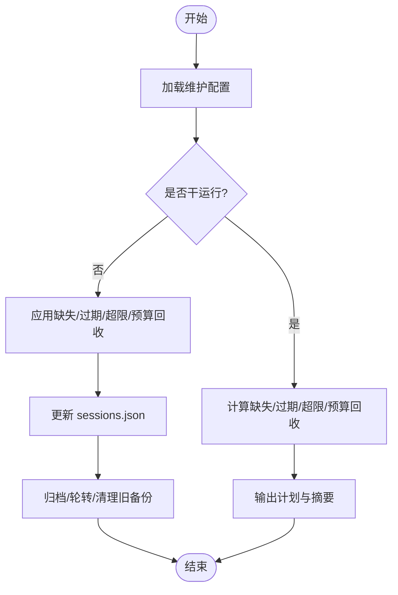
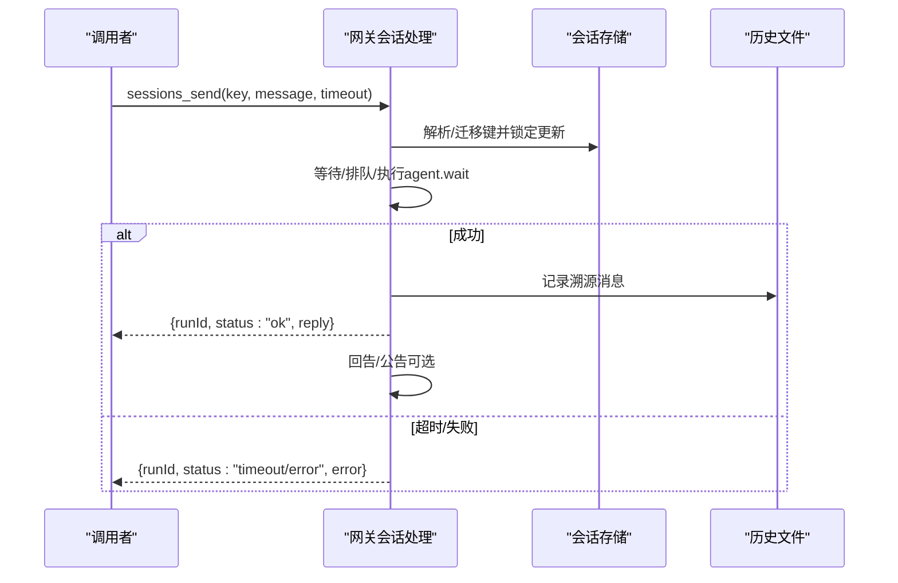
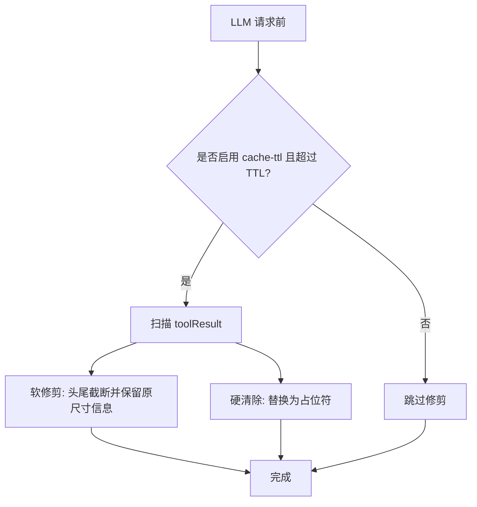
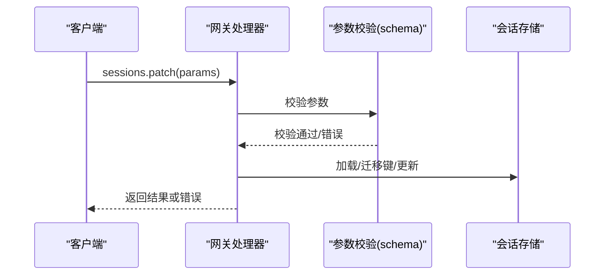
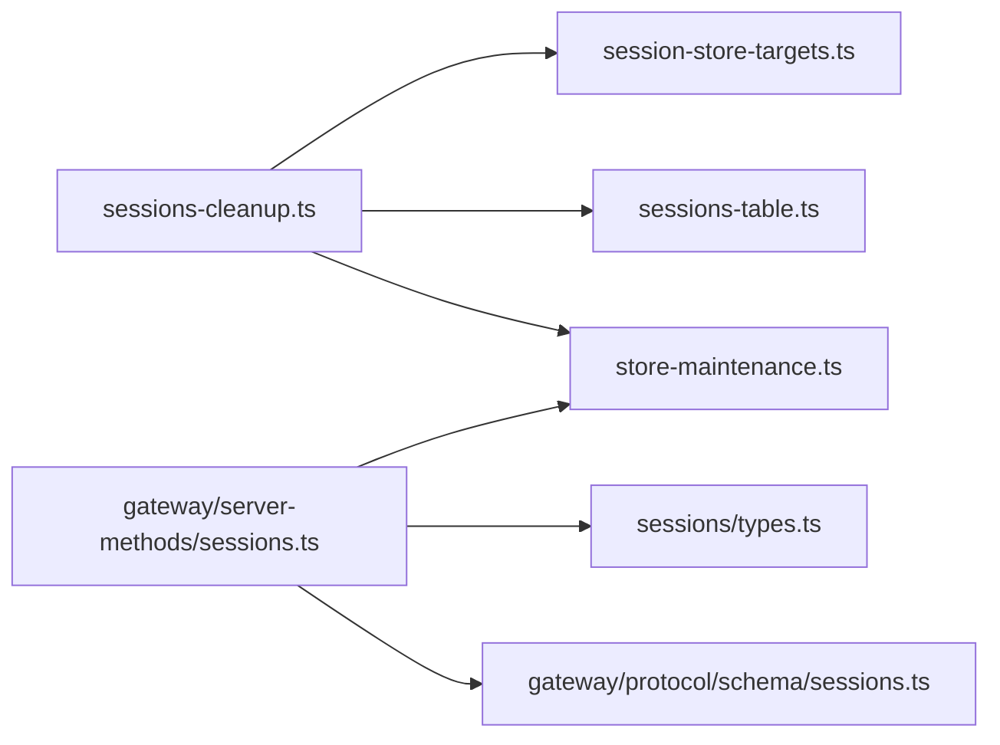

# 会话管理

<cite>
**本文引用的文件**
- [src/config/sessions/store-maintenance.ts](file://src/config/sessions/store-maintenance.ts)
- [src/commands/sessions-cleanup.ts](file://src/commands/sessions-cleanup.ts)
- [docs/concepts/session.md](file://docs/concepts/session.md)
- [docs/concepts/session-tool.md](file://docs/concepts/session-tool.md)
- [docs/concepts/session-pruning.md](file://docs/concepts/session-pruning.md)
- [src/config/sessions/types.ts](file://src/config/sessions/types.ts)
- [src/commands/sessions-table.ts](file://src/commands/sessions-table.ts)
- [src/commands/session-store-targets.ts](file://src/commands/session-store-targets.ts)
- [src/gateway/server-methods/sessions.ts](file://src/gateway/server-methods/sessions.ts)
- [src/gateway/protocol/schema/sessions.ts](file://src/gateway/protocol/schema/sessions.ts)
</cite>

## 目录
1. [简介](#简介)
2. [项目结构](#项目结构)
3. [核心组件](#核心组件)
4. [架构总览](#架构总览)
5. [详细组件分析](#详细组件分析)
6. [依赖关系分析](#依赖关系分析)
7. [性能考量](#性能考量)
8. [故障排查指南](#故障排查指南)
9. [结论](#结论)
10. [附录](#附录)

## 简介
本文件系统性阐述 OpenClaw 的会话管理系统，覆盖会话概念与作用、会话标识符生成与键空间、会话状态存储与维护、消息历史管理、会话工具（Session Tool）的工作原理（调用记录、结果缓存、跨会话数据共享）、会话修剪（Session Pruning）策略（内存管理、历史清理、性能优化），并给出会话配置的最佳实践（持久化、并发访问控制、故障恢复）。目标是帮助开发者全面理解并正确使用会话管理功能。

## 项目结构
围绕会话管理的关键代码分布在以下模块：
- 配置与维护：会话存储解析、维护策略、磁盘预算、文件轮转等
- 命令行工具：会话清理、展示表格、目标选择
- 网关服务：会话列表、预览、解析、补丁更新、重置、删除、压缩等 RPC 接口
- 协议与校验：参数 Schema 校验
- 文档：会话管理、会话工具、会话修剪的概念说明

**图表来源**
- [src/commands/sessions-cleanup.ts:1-469](file://src/commands/sessions-cleanup.ts#L1-L469)
- [src/commands/sessions-table.ts:1-149](file://src/commands/sessions-table.ts#L1-L149)
- [src/commands/session-store-targets.ts:1-96](file://src/commands/session-store-targets.ts#L1-L96)
- [src/config/sessions/types.ts:1-380](file://src/config/sessions/types.ts#L1-L380)
- [src/config/sessions/store-maintenance.ts:1-328](file://src/config/sessions/store-maintenance.ts#L1-L328)
- [src/gateway/server-methods/sessions.ts:1-473](file://src/gateway/server-methods/sessions.ts#L1-L473)
- [src/gateway/protocol/schema/sessions.ts:1-138](file://src/gateway/protocol/schema/sessions.ts#L1-L138)

**章节来源**
- [src/commands/sessions-cleanup.ts:1-469](file://src/commands/sessions-cleanup.ts#L1-L469)
- [src/commands/sessions-table.ts:1-149](file://src/commands/sessions-table.ts#L1-L149)
- [src/commands/session-store-targets.ts:1-96](file://src/commands/session-store-targets.ts#L1-L96)
- [src/config/sessions/types.ts:1-380](file://src/config/sessions/types.ts#L1-L380)
- [src/config/sessions/store-maintenance.ts:1-328](file://src/config/sessions/store-maintenance.ts#L1-L328)
- [src/gateway/server-methods/sessions.ts:1-473](file://src/gateway/server-methods/sessions.ts#L1-L473)
- [src/gateway/protocol/schema/sessions.ts:1-138](file://src/gateway/protocol/schema/sessions.ts#L1-L138)
- [docs/concepts/session.md:1-311](file://docs/concepts/session.md#L1-L311)
- [docs/concepts/session-tool.md:1-224](file://docs/concepts/session-tool.md#L1-L224)
- [docs/concepts/session-pruning.md:1-122](file://docs/concepts/session-pruning.md#L1-L122)

## 核心组件
- 会话条目模型（SessionEntry）
  - 包含运行时模型信息、令牌统计、队列与执行策略、发送策略、来源元数据、子代理角色与控制范围等字段，支持合并策略与活动时间戳维护。
- 维护策略（维护模式、过期阈值、最大条目数、文件轮转、磁盘预算）
  - 提供“警告/强制”两种模式；按时间与数量修剪；文件大小轮转；磁盘预算强制回收。
- 命令行清理（sessions cleanup）
  - 支持干运行预览、缺失历史清理、过期修剪、条目上限裁剪、磁盘预算回收；输出动作行与摘要。
- 网关会话 RPC
  - 列表、预览、解析、补丁更新、重置、删除、获取历史、压缩等接口；参数严格校验；支持生命周期事件与归档。
- 会话工具（Session Tools）
  - sessions_list、sessions_history、sessions_send、sessions_spawn；支持跨会话可见性与沙箱限制；安全策略可按通道/聊天类型阻断。

**章节来源**
- [src/config/sessions/types.ts:68-171](file://src/config/sessions/types.ts#L68-L171)
- [src/config/sessions/store-maintenance.ts:130-148](file://src/config/sessions/store-maintenance.ts#L130-L148)
- [src/commands/sessions-cleanup.ts:158-240](file://src/commands/sessions-cleanup.ts#L158-L240)
- [src/gateway/server-methods/sessions.ts:120-473](file://src/gateway/server-methods/sessions.ts#L120-L473)
- [docs/concepts/session-tool.md:12-224](file://docs/concepts/session-tool.md#L12-L224)

## 架构总览
下图展示了从命令行到网关服务，再到会话存储与历史文件的整体交互路径，并标注了关键的维护与修剪环节。

**图表来源**
- [src/commands/sessions-cleanup.ts:293-469](file://src/commands/sessions-cleanup.ts#L293-L469)
- [src/commands/session-store-targets.ts:28-81](file://src/commands/session-store-targets.ts#L28-L81)
- [src/commands/sessions-table.ts:42-94](file://src/commands/sessions-table.ts#L42-L94)
- [src/config/sessions/store-maintenance.ts:155-327](file://src/config/sessions/store-maintenance.ts#L155-L327)
- [src/gateway/server-methods/sessions.ts:120-473](file://src/gateway/server-methods/sessions.ts#L120-L473)

## 详细组件分析

### 会话条目与键空间
- SessionEntry 字段涵盖运行时模型、令牌统计、队列与执行策略、发送策略、来源元数据、子代理角色与控制范围、最近心跳文本与时间等，支持合并策略以保留或触活动态更新时间戳。
- 键空间映射规则：
  - 直聊默认主键“main”，可按“per-peer/ per-channel-peer/ per-account-channel-peer”隔离；
  - 群组会话独立键，包含渠道与群组标识；
  - 其他来源如 cron/hook/node 等有特定键前缀；
  - 跨通道同一人可通过 identityLinks 合并到统一会话。

**图表来源**
- [src/config/sessions/types.ts:68-171](file://src/config/sessions/types.ts#L68-L171)
- [src/config/sessions/types.ts:14-23](file://src/config/sessions/types.ts#L14-L23)

**章节来源**
- [src/config/sessions/types.ts:68-171](file://src/config/sessions/types.ts#L68-L171)
- [docs/concepts/session.md:189-206](file://docs/concepts/session.md#L189-L206)

### 会话维护与修剪策略
- 维护模式与阈值
  - 默认模式为“警告”，在强制模式下执行修剪、裁剪、归档、轮转与磁盘预算回收。
  - 过期阈值、最大条目数、文件轮转阈值、磁盘预算与高水位线均可配置。
- 修剪流程
  - 按时间修剪过期条目；
  - 按数量裁剪至最新 N 条；
  - 缺失历史文件的条目清理；
  - 磁盘预算回收（先删旧历史文件，再删旧会话）；
  - 超过阈值自动轮转 sessions.json。
- 干运行与应用
  - CLI 支持 --dry-run 预览影响，再通过 --enforce 应用。

**图表来源**
- [src/config/sessions/store-maintenance.ts:130-148](file://src/config/sessions/store-maintenance.ts#L130-L148)
- [src/config/sessions/store-maintenance.ts:155-327](file://src/config/sessions/store-maintenance.ts#L155-L327)
- [src/commands/sessions-cleanup.ts:158-240](file://src/commands/sessions-cleanup.ts#L158-L240)
- [src/commands/sessions-cleanup.ts:293-469](file://src/commands/sessions-cleanup.ts#L293-L469)

**章节来源**
- [src/config/sessions/store-maintenance.ts:130-148](file://src/config/sessions/store-maintenance.ts#L130-L148)
- [src/config/sessions/store-maintenance.ts:155-327](file://src/config/sessions/store-maintenance.ts#L155-L327)
- [src/commands/sessions-cleanup.ts:158-240](file://src/commands/sessions-cleanup.ts#L158-L240)
- [src/commands/sessions-cleanup.ts:293-469](file://src/commands/sessions-cleanup.ts#L293-L469)
- [docs/concepts/session.md:74-120](file://docs/concepts/session.md#L74-L120)

### 会话工具（Session Tools）工作原理
- 工具集
  - sessions_list：列出会话，可带最后 N 条消息；过滤类型、活跃窗口、消息上限。
  - sessions_history：按会话键或 sessionId 获取历史，可包含工具消息。
  - sessions_send：向另一会话发送消息，支持等待完成或异步返回；跨会话消息带溯源标记；支持 ping-pong 回告与公告。
  - sessions_spawn：在隔离会话中启动子代理任务，支持线程绑定、模式选择、附件注入、归档策略与回告。
- 可见性与沙箱
  - 默认仅当前会话与由其派生的子会话可见；沙箱模式可进一步限制。
- 安全策略
  - 基于通道/聊天类型的策略阻断；支持运行时 per-session 覆盖。

**图表来源**
- [docs/concepts/session-tool.md:78-106](file://docs/concepts/session-tool.md#L78-L106)
- [src/gateway/server-methods/sessions.ts:348-369](file://src/gateway/server-methods/sessions.ts#L348-L369)
- [src/gateway/server-methods/sessions.ts:370-471](file://src/gateway/server-methods/sessions.ts#L370-L471)

**章节来源**
- [docs/concepts/session-tool.md:12-224](file://docs/concepts/session-tool.md#L12-L224)
- [src/gateway/server-methods/sessions.ts:348-369](file://src/gateway/server-methods/sessions.ts#L348-L369)
- [src/gateway/server-methods/sessions.ts:370-471](file://src/gateway/server-methods/sessions.ts#L370-L471)

### 会话修剪（Session Pruning）
- 目标与范围
  - 在每次 LLM 请求前，对内存上下文中的旧 toolResult 进行修剪，不改写磁盘历史。
- 触发条件与行为
  - 对 Anthropic API（含 OpenRouter 的 Anthropic 模型）启用 cache-ttl 模式时，若上次调用已超过 TTL，则进行软修剪或硬清除。
  - 保护最近 N 条 assistant 消息；跳过包含图像块的结果；可限制工具集合。
- 参数与默认
  - TTL、保护助手数量、软修剪比例、硬清除比例、最小可修剪字符等均有默认值。

**图表来源**
- [docs/concepts/session-pruning.md:13-26](file://docs/concepts/session-pruning.md#L13-L26)
- [docs/concepts/session-pruning.md:59-87](file://docs/concepts/session-pruning.md#L59-L87)

**章节来源**
- [docs/concepts/session-pruning.md:1-122](file://docs/concepts/session-pruning.md#L1-L122)

### 网关会话 RPC 与参数校验
- 主要方法
  - sessions.list / sessions.preview / sessions.resolve
  - sessions.patch / sessions.reset / sessions.delete
  - sessions.get / sessions.compact
- 参数校验
  - 使用 TypeBox Schema 校验请求参数，保证字段完整性与类型正确性。
- 关键流程
  - 解析目标会话键、迁移与裁剪旧键、加载存储、执行操作、归档与生命周期事件、返回结果。

**图表来源**
- [src/gateway/server-methods/sessions.ts:212-254](file://src/gateway/server-methods/sessions.ts#L212-L254)
- [src/gateway/protocol/schema/sessions.ts:50-89](file://src/gateway/protocol/schema/sessions.ts#L50-L89)

**章节来源**
- [src/gateway/server-methods/sessions.ts:120-473](file://src/gateway/server-methods/sessions.ts#L120-L473)
- [src/gateway/protocol/schema/sessions.ts:1-138](file://src/gateway/protocol/schema/sessions.ts#L1-L138)

## 依赖关系分析
- 组件耦合
  - 命令行清理依赖维护策略与表格渲染；维护策略依赖配置解析与字节/时长解析工具。
  - 网关服务依赖会话存储加载、迁移与归档工具；RPC 方法之间存在参数校验与结果封装的强契约。
- 外部依赖
  - 文件系统用于读写 sessions.json 与 .jsonl 历史文件；
  - 类型校验库用于参数 Schema 校验；
  - 日志子系统用于维护日志输出。

**图表来源**
- [src/commands/sessions-cleanup.ts:1-469](file://src/commands/sessions-cleanup.ts#L1-L469)
- [src/config/sessions/store-maintenance.ts:1-328](file://src/config/sessions/store-maintenance.ts#L1-L328)
- [src/commands/sessions-table.ts:1-149](file://src/commands/sessions-table.ts#L1-L149)
- [src/commands/session-store-targets.ts:1-96](file://src/commands/session-store-targets.ts#L1-L96)
- [src/gateway/server-methods/sessions.ts:1-473](file://src/gateway/server-methods/sessions.ts#L1-L473)
- [src/gateway/protocol/schema/sessions.ts:1-138](file://src/gateway/protocol/schema/sessions.ts#L1-L138)
- [src/config/sessions/types.ts:1-380](file://src/config/sessions/types.ts#L1-L380)

**章节来源**
- [src/commands/sessions-cleanup.ts:1-469](file://src/commands/sessions-cleanup.ts#L1-L469)
- [src/gateway/server-methods/sessions.ts:1-473](file://src/gateway/server-methods/sessions.ts#L1-L473)

## 性能考量
- 维护成本
  - 大规模会话存储会增加写入延迟；建议同时设置时间与数量限制，并在需要时启用磁盘预算。
- 修剪策略
  - cache-ttl 修剪减少首次请求的 cacheWrite，提升后续复用效率；合理设置 TTL 与保护助手数量。
- I/O 与归档
  - 归档与轮转在写路径执行，应避免过于频繁；磁盘预算回收优先删除旧历史文件，再删除旧会话。

**章节来源**
- [docs/concepts/session.md:101-120](file://docs/concepts/session.md#L101-L120)
- [docs/concepts/session-pruning.md:27-41](file://docs/concepts/session-pruning.md#L27-L41)

## 故障排查指南
- 常见问题
  - 无法删除主会话：主会话键受保护，需通过重置或删除其他会话。
  - 会话缺失历史：清理缺失历史后会移除对应条目；可通过修复选项重建。
  - 磁盘空间不足：启用磁盘预算与高水位线，定期执行清理。
  - 会话可见性受限：检查沙箱与可见性配置，确认是否处于沙箱模式或被限制。
- 排查步骤
  - 使用 sessions cleanup --dry-run --json 预览影响；
  - 使用 sessions.list 与 sessions.preview 检查会话状态与预览；
  - 使用 sessions.get 获取指定会话历史进行核对；
  - 检查网关日志与维护日志输出。

**章节来源**
- [src/gateway/server-methods/sessions.ts:277-347](file://src/gateway/server-methods/sessions.ts#L277-L347)
- [src/commands/sessions-cleanup.ts:158-240](file://src/commands/sessions-cleanup.ts#L158-L240)
- [src/gateway/server-methods/sessions.ts:120-197](file://src/gateway/server-methods/sessions.ts#L120-L197)

## 结论
OpenClaw 的会话管理通过严谨的键空间设计、健壮的维护策略、完善的网关 RPC 与严格的参数校验，实现了对会话状态与历史的可靠管理。配合会话工具与修剪策略，既能满足多用户隔离与安全需求，又能有效控制上下文膨胀与磁盘占用。遵循本文最佳实践，可在生产环境中获得稳定、可预测且高性能的会话体验。

## 附录
- 最佳实践清单
  - 使用“强制”维护模式以自动约束增长；
  - 同时设置 pruneAfter 与 maxEntries，避免单一维度失效；
  - 在大规模部署中启用 maxDiskBytes 与 highWaterBytes，并保持合理比例；
  - 定期执行 sessions cleanup --dry-run --json 评估影响；
  - 对多用户/多账号场景启用 per-channel-peer 或 per-account-channel-peer，并配置 identityLinks；
  - 启用 cache-ttl 修剪以优化 Anthropic 模型的缓存行为；
  - 通过 sessions_spawn 实现跨会话任务编排，注意沙箱与可见性限制；
  - 通过 sessions_send 实现跨会话消息路由，注意 sendPolicy 与回告策略。