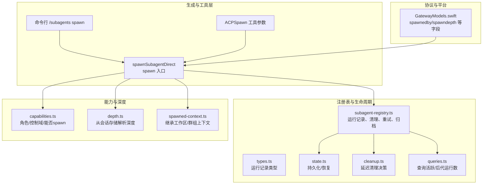
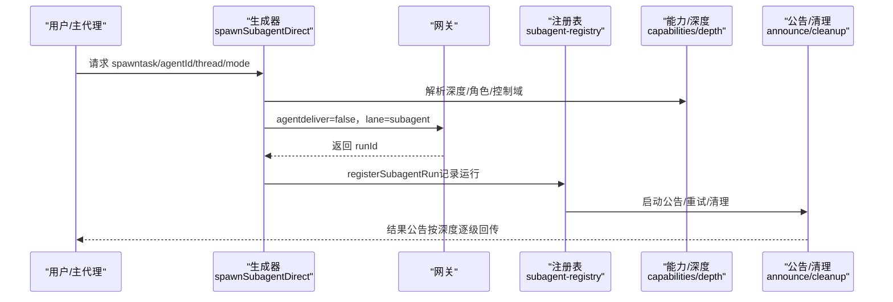
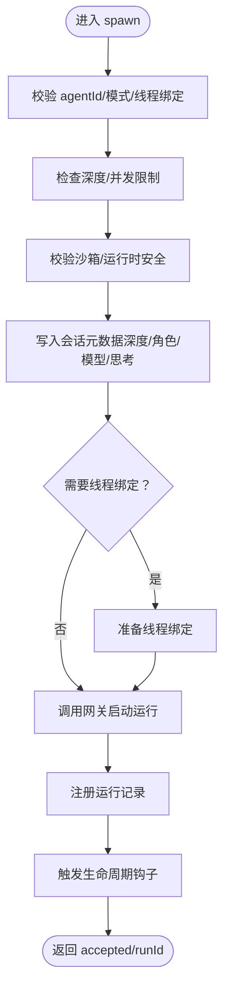
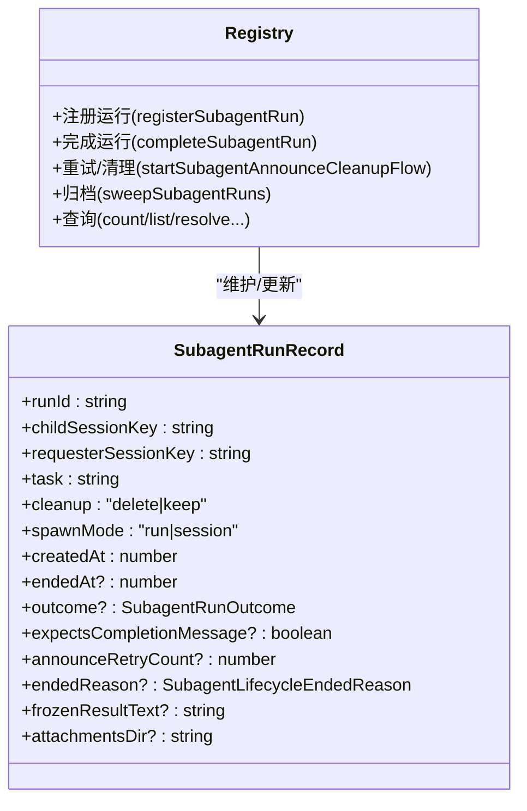
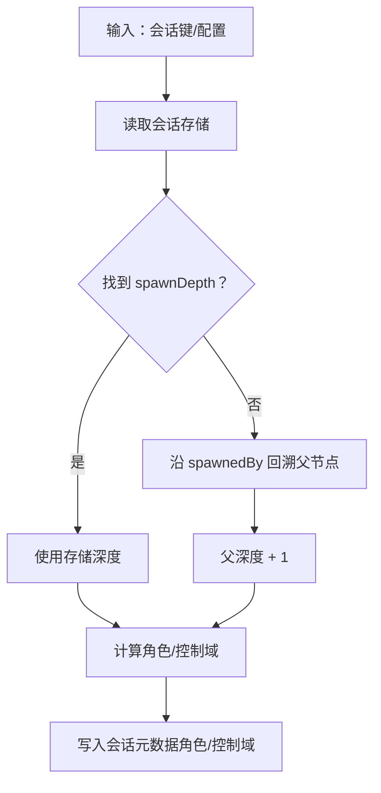
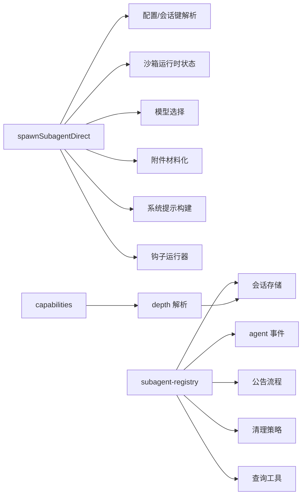

# 多代理系统

<cite>
**本文引用的文件**
- [src/agents/subagent-spawn.ts](file://src/agents/subagent-spawn.ts)
- [src/agents/subagent-registry.ts](file://src/agents/subagent-registry.ts)
- [src/agents/subagent-registry.types.ts](file://src/agents/subagent-registry.types.ts)
- [src/agents/subagent-registry-state.ts](file://src/agents/subagent-registry-state.ts)
- [src/agents/subagent-registry-cleanup.ts](file://src/agents/subagent-registry-cleanup.ts)
- [src/agents/subagent-registry-queries.ts](file://src/agents/subagent-registry-queries.ts)
- [src/agents/subagent-capabilities.ts](file://src/agents/subagent-capabilities.ts)
- [src/agents/subagent-depth.ts](file://src/agents/subagent-depth.ts)
- [src/agents/spawned-context.ts](file://src/agents/spawned-context.ts)
- [src/agents/acp-spawn.ts](file://src/agents/acp-spawn.ts)
- [src/auto-reply/reply/commands-subagents/action-spawn.ts](file://src/auto-reply/reply/commands-subagents/action-spawn.ts)
- [apps/macos/Sources/OpenClawProtocol/GatewayModels.swift](file://apps/macos/Sources/OpenClawProtocol/GatewayModels.swift)
- [apps/shared/OpenClawKit/Sources/OpenClawProtocol/GatewayModels.swift](file://apps/shared/OpenClawKit/Sources/OpenClawProtocol/GatewayModels.swift)
- [docs/concepts/multi-agent.md](file://docs/concepts/multi-agent.md)
- [docs/tools/subagents.md](file://docs/tools/subagents.md)
</cite>

## 目录
1. [引言](#引言)
2. [项目结构](#项目结构)
3. [核心组件](#核心组件)
4. [架构总览](#架构总览)
5. [详细组件分析](#详细组件分析)
6. [依赖关系分析](#依赖关系分析)
7. [性能考量](#性能考量)
8. [故障排查指南](#故障排查指南)
9. [结论](#结论)
10. [附录](#附录)

## 引言
本文件面向开发者与实施者，系统化阐述 OpenClaw 的多代理（多级子代理）体系：主代理与子代理的关系、子代理注册表（Subagent Registry）的工作原理、子代理的生成与管理流程（spawn）、深度限制与资源控制、以及在实际场景中的应用模式（并行任务、复杂工作流分解、代理间通信）。目标是帮助读者快速理解并高效实现多代理解决方案。

## 项目结构
OpenClaw 的多代理能力由“生成器（spawn）+ 注册表（registry）+ 生命周期与公告（announce）+ 深度与权限（capabilities/depth）+ 上下文继承（spawned context）”等模块协同完成。核心代码集中在 src/agents 下，配套文档位于 docs/tools 与 docs/concepts。

图示来源
- [src/agents/subagent-spawn.ts](file://src/agents/subagent-spawn.ts)
- [src/agents/subagent-registry.ts](file://src/agents/subagent-registry.ts)
- [src/agents/subagent-registry.types.ts](file://src/agents/subagent-registry.types.ts)
- [src/agents/subagent-registry-state.ts](file://src/agents/subagent-registry-state.ts)
- [src/agents/subagent-registry-cleanup.ts](file://src/agents/subagent-registry-cleanup.ts)
- [src/agents/subagent-registry-queries.ts](file://src/agents/subagent-registry-queries.ts)
- [src/agents/subagent-capabilities.ts](file://src/agents/subagent-capabilities.ts)
- [src/agents/subagent-depth.ts](file://src/agents/subagent-depth.ts)
- [src/agents/spawned-context.ts](file://src/agents/spawned-context.ts)
- [apps/macos/Sources/OpenClawProtocol/GatewayModels.swift](file://apps/macos/Sources/OpenClawProtocol/GatewayModels.swift)
- [apps/shared/OpenClawKit/Sources/OpenClawProtocol/GatewayModels.swift](file://apps/shared/OpenClawKit/Sources/OpenClawProtocol/GatewayModels.swift)

章节来源
- [src/agents/subagent-spawn.ts](file://src/agents/subagent-spawn.ts)
- [src/agents/subagent-registry.ts](file://src/agents/subagent-registry.ts)
- [src/agents/subagent-capabilities.ts](file://src/agents/subagent-capabilities.ts)
- [src/agents/subagent-depth.ts](file://src/agents/subagent-depth.ts)
- [src/agents/spawned-context.ts](file://src/agents/spawned-context.ts)
- [apps/macos/Sources/OpenClawProtocol/GatewayModels.swift](file://apps/macos/Sources/OpenClawProtocol/GatewayModels.swift)
- [apps/shared/OpenClawKit/Sources/OpenClawProtocol/GatewayModels.swift](file://apps/shared/OpenClawKit/Sources/OpenClawProtocol/GatewayModels.swift)

## 核心组件
- 子代理生成器（spawnSubagentDirect）
  - 负责校验请求参数、解析沙箱与模型、写入会话元数据（深度、角色、控制域）、绑定线程（可选）、调用网关启动子代理运行，并注册到注册表。
- 子代理注册表（Subagent Registry）
  - 维护运行记录（SubagentRunRecord），负责生命周期事件监听、结果冻结、公告投递、重试与最终清理、自动归档、孤儿运行修复等。
- 能力与深度（capabilities/depth）
  - 基于深度与最大深度计算子代理角色（主/编排者/叶子）与控制范围，写入会话元数据以防止越权。
- 上下文继承（spawned-context）
  - 将父会话的群组信息与工作区目录继承给子代理，保证执行环境一致性。
- 平台协议（GatewayModels.swift）
  - 在网关协议中暴露 spawnedby/spawndepth 等字段，支撑跨端展示与路由。

章节来源
- [src/agents/subagent-spawn.ts](file://src/agents/subagent-spawn.ts)
- [src/agents/subagent-registry.ts](file://src/agents/subagent-registry.ts)
- [src/agents/subagent-registry.types.ts](file://src/agents/subagent-registry.types.ts)
- [src/agents/subagent-capabilities.ts](file://src/agents/subagent-capabilities.ts)
- [src/agents/subagent-depth.ts](file://src/agents/subagent-depth.ts)
- [src/agents/spawned-context.ts](file://src/agents/spawned-context.ts)
- [apps/macos/Sources/OpenClawProtocol/GatewayModels.swift](file://apps/macos/Sources/OpenClawProtocol/GatewayModels.swift)
- [apps/shared/OpenClawKit/Sources/OpenClawProtocol/GatewayModels.swift](file://apps/shared/OpenClawKit/Sources/OpenClawProtocol/GatewayModels.swift)

## 架构总览
多代理架构围绕“隔离会话 + 可选线程绑定 + 深度控制 + 权限约束 + 生命周期公告”展开。主代理通过 sessions_spawn 或 /subagents spawn 触发子代理；子代理完成后通过公告回传结果至请求者会话，支持嵌套编排与级联停止。

图示来源
- [src/agents/subagent-spawn.ts](file://src/agents/subagent-spawn.ts)
- [src/agents/subagent-registry.ts](file://src/agents/subagent-registry.ts)
- [src/agents/subagent-capabilities.ts](file://src/agents/subagent-capabilities.ts)
- [src/agents/subagent-depth.ts](file://src/agents/subagent-depth.ts)

## 详细组件分析

### 子代理生成器（spawnSubagentDirect）
职责与关键流程
- 参数校验与默认值：agentId 合法性、模式（run/session）、线程绑定、沙箱模式、超时、思考层级、附件等。
- 深度与并发限制：读取当前调用者的子代理深度与活跃子代数量，结合配置进行门控（maxSpawnDepth、maxChildrenPerAgent）。
- 运行时安全：根据请求者沙箱状态与 sandbox 模式决定是否允许子代理运行。
- 会话元数据写入：设置 spawnDepth、subagentRole、subagentControlScope、模型与思考层级等。
- 线程绑定：通过钩子准备线程绑定（如 Discord），否则拒绝 session 模式。
- 启动运行：调用网关 agent 接口，deliver=false 放入专用 lane，返回 runId。
- 注册运行：registerSubagentRun 写入注册表，触发生命周期钩子与后续公告。

图示来源
- [src/agents/subagent-spawn.ts](file://src/agents/subagent-spawn.ts)

章节来源
- [src/agents/subagent-spawn.ts](file://src/agents/subagent-spawn.ts)

### 子代理注册表（Subagent Registry）
职责与关键机制
- 运行记录（SubagentRunRecord）：包含 runId、子会话键、请求者会话、任务、清理策略、期望完成消息、冻结结果、附件路径、生命周期时间戳、重试计数等。
- 生命周期监听：订阅 agent 事件（start/end/error），更新运行记录并触发完成流程。
- 结果冻结与公告：在结束时捕获最终回复文本，形成公告内容；对嵌套请求者采用内部注入或外部 follow-up。
- 清理与重试：基于配置与重试策略（指数退避）持续尝试公告，超过上限或过期后放弃；支持延迟等待后代稳定后再清理。
- 自动归档：按配置时间窗口归档并删除会话与附件。
- 查询与统计：提供活跃运行数、后代运行数、后代待定数、后代运行列表等查询接口，用于控制与可观测性。

图示来源
- [src/agents/subagent-registry.types.ts](file://src/agents/subagent-registry.types.ts)
- [src/agents/subagent-registry.ts](file://src/agents/subagent-registry.ts)

章节来源
- [src/agents/subagent-registry.ts](file://src/agents/subagent-registry.ts)
- [src/agents/subagent-registry.types.ts](file://src/agents/subagent-registry.types.ts)
- [src/agents/subagent-registry-state.ts](file://src/agents/subagent-registry-state.ts)
- [src/agents/subagent-registry-cleanup.ts](file://src/agents/subagent-registry-cleanup.ts)
- [src/agents/subagent-registry-queries.ts](file://src/agents/subagent-registry-queries.ts)

### 能力与深度（capabilities/depth）
- 深度解析：从会话存储读取 spawnDepth 或通过 spawnedBy 链式推导，支持缓存与候选键匹配。
- 角色与控制域：根据深度与最大深度确定角色（主/编排者/叶子），并据此决定控制范围（children/none）与是否允许 spawn。
- 存储能力：会话元数据中写入 subagentRole 与 subagentControlScope，防止恢复后越权。

图示来源
- [src/agents/subagent-depth.ts](file://src/agents/subagent-depth.ts)
- [src/agents/subagent-capabilities.ts](file://src/agents/subagent-capabilities.ts)

章节来源
- [src/agents/subagent-depth.ts](file://src/agents/subagent-depth.ts)
- [src/agents/subagent-capabilities.ts](file://src/agents/subagent-capabilities.ts)

### 上下文继承（spawned-context）
- 继承规则：支持显式覆盖工作区目录；若未显式指定，则继承自请求者所在代理的工作区目录。
- 群组上下文：将群组 ID、通道、空间等信息透传给子代理，便于在群组环境中保持一致行为。

章节来源
- [src/agents/spawned-context.ts](file://src/agents/spawned-context.ts)

### 平台协议（GatewayModels.swift）
- 字段映射：协议中包含 spawnedby/spawndepth 等字段，用于跨端展示与路由，确保客户端能正确识别子代理来源与层级。

章节来源
- [apps/macos/Sources/OpenClawProtocol/GatewayModels.swift](file://apps/macos/Sources/OpenClawProtocol/GatewayModels.swift)
- [apps/shared/OpenClawKit/Sources/OpenClawProtocol/GatewayModels.swift](file://apps/shared/OpenClawKit/Sources/OpenClawProtocol/GatewayModels.swift)

### 工具与命令入口
- sessions_spawn：编程式 spawn，支持线程绑定、模式选择、沙箱策略、超时与模型/思考覆盖。
- /subagents spawn：用户命令式 spawn，非阻塞，完成后公告结果。
- ACP Spawn：面向 ACP（Codex/Claude Code/Gemini CLI）的 spawn 参数集合。

章节来源
- [src/agents/subagent-spawn.ts](file://src/agents/subagent-spawn.ts)
- [src/auto-reply/reply/commands-subagents/action-spawn.ts](file://src/auto-reply/reply/commands-subagents/action-spawn.ts)
- [src/agents/acp-spawn.ts](file://src/agents/acp-spawn.ts)
- [docs/tools/subagents.md](file://docs/tools/subagents.md)

## 依赖关系分析
- 生成器依赖
  - 配置与会话键解析、沙箱运行时状态、模型选择、附件材料化、系统提示构建、钩子运行器。
- 注册表依赖
  - 事件监听（agent 事件）、公告流程、清理策略、持久化/恢复、查询工具、上下文引擎通知。
- 能力与深度依赖
  - 会话存储读取、会话键解析、默认代理 ID 解析。
- 协议依赖
  - 网关协议字段与客户端展示。

图示来源
- [src/agents/subagent-spawn.ts](file://src/agents/subagent-spawn.ts)
- [src/agents/subagent-registry.ts](file://src/agents/subagent-registry.ts)
- [src/agents/subagent-capabilities.ts](file://src/agents/subagent-capabilities.ts)
- [src/agents/subagent-depth.ts](file://src/agents/subagent-depth.ts)

章节来源
- [src/agents/subagent-spawn.ts](file://src/agents/subagent-spawn.ts)
- [src/agents/subagent-registry.ts](file://src/agents/subagent-registry.ts)
- [src/agents/subagent-capabilities.ts](file://src/agents/subagent-capabilities.ts)
- [src/agents/subagent-depth.ts](file://src/agents/subagent-depth.ts)

## 性能考量
- 并发与队列
  - 子代理使用独立 lane（subagent），全局并发受 agents.defaults.subagents.maxConcurrent 控制，避免资源争用。
- 超时与归档
  - 默认超时可配置；runTimeoutSeconds 不触发自动归档，但会终止运行；自动归档按分钟窗口清理，减少磁盘占用。
- 公告重试
  - 指数退避与最大重试次数限制，避免无限重试导致资源浪费。
- 附件与内存
  - 附件材料化与冻结结果大小限制，防止大输出造成内存压力。

章节来源
- [docs/tools/subagents.md](file://docs/tools/subagents.md)
- [src/agents/subagent-registry.ts](file://src/agents/subagent-registry.ts)
- [src/agents/subagent-registry-cleanup.ts](file://src/agents/subagent-registry-cleanup.ts)

## 故障排查指南
常见问题与定位建议
- spawn 被拒绝（forbidden）
  - 深度过高：检查 agents.defaults.subagents.maxSpawnDepth 与当前 callerDepth。
  - 并发/子代上限：检查 agents.defaults.subagents.maxChildrenPerAgent 与当前活跃子代数。
  - 沙箱不匹配：请求者沙箱且 sandbox="require" 时需目标运行时也为沙箱。
  - 目标 agentId 不被允许：检查 agents.list[].subagents.allowAgents。
- 线程绑定失败
  - 钩子未注册或不可用：确认通道插件已注册 subagent_spawning 钩子。
- 公告未送达
  - 查看重试计数与到期时间；确认 requester 是否为嵌套子代理（内部注入 vs 外部 follow-up）。
- 运行孤儿/未清理
  - 注册表会自动修复孤儿运行并标记错误结局；必要时手动清理或等待归档。
- 结果截断
  - 冻结结果有大小限制，超出会被截断并标注字节信息。

章节来源
- [src/agents/subagent-spawn.ts](file://src/agents/subagent-spawn.ts)
- [src/agents/subagent-registry.ts](file://src/agents/subagent-registry.ts)
- [src/agents/subagent-registry-cleanup.ts](file://src/agents/subagent-registry-cleanup.ts)

## 结论
OpenClaw 的多代理系统通过“隔离会话 + 深度与权限控制 + 线程绑定 + 生命周期公告 + 资源与并发治理”，实现了可扩展、可观测、可编排的子代理生态。开发者可基于 sessions_spawn 与 /subagents 工具快速落地并行任务、复杂工作流分解与代理间协作，同时利用注册表与清理策略保障系统的稳定性与资源健康。

## 附录

### 多代理应用场景示例
- 并行任务处理
  - 主代理将耗时任务拆分为多个子代理并行执行，各自完成后通过公告汇总结果，避免阻塞主线程。
- 复杂工作流分解
  - 使用 maxSpawnDepth=2 的“编排者-工作者”模式：编排者负责协调与聚合，工作者专注具体任务。
- 代理间通信模式
  - 通过公告链路逐级回传：工作者 → 编排者 → 主代理 → 用户；嵌套请求者会收到内部注入的摘要，避免重复播报。

章节来源
- [docs/tools/subagents.md](file://docs/tools/subagents.md)
- [docs/concepts/multi-agent.md](file://docs/concepts/multi-agent.md)