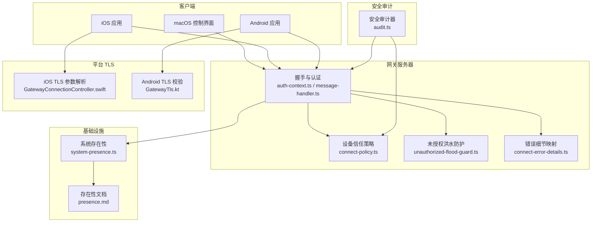
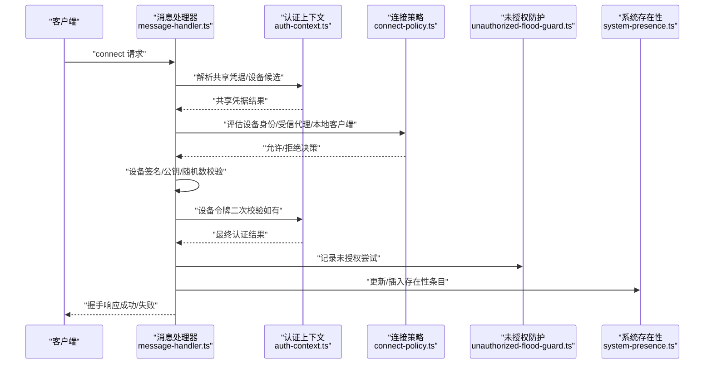
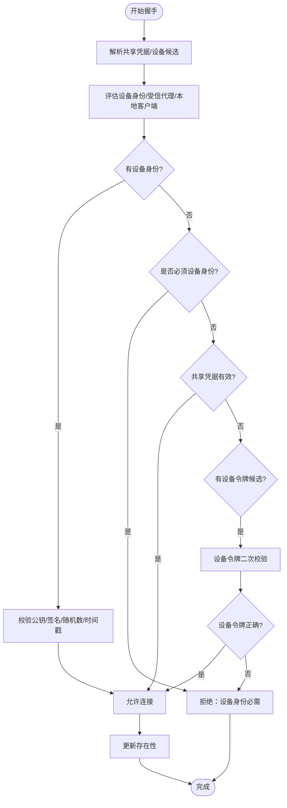
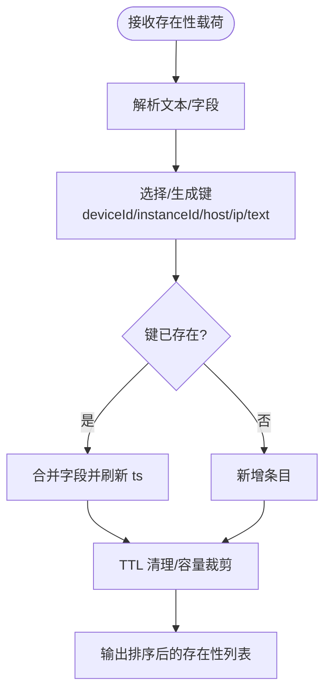
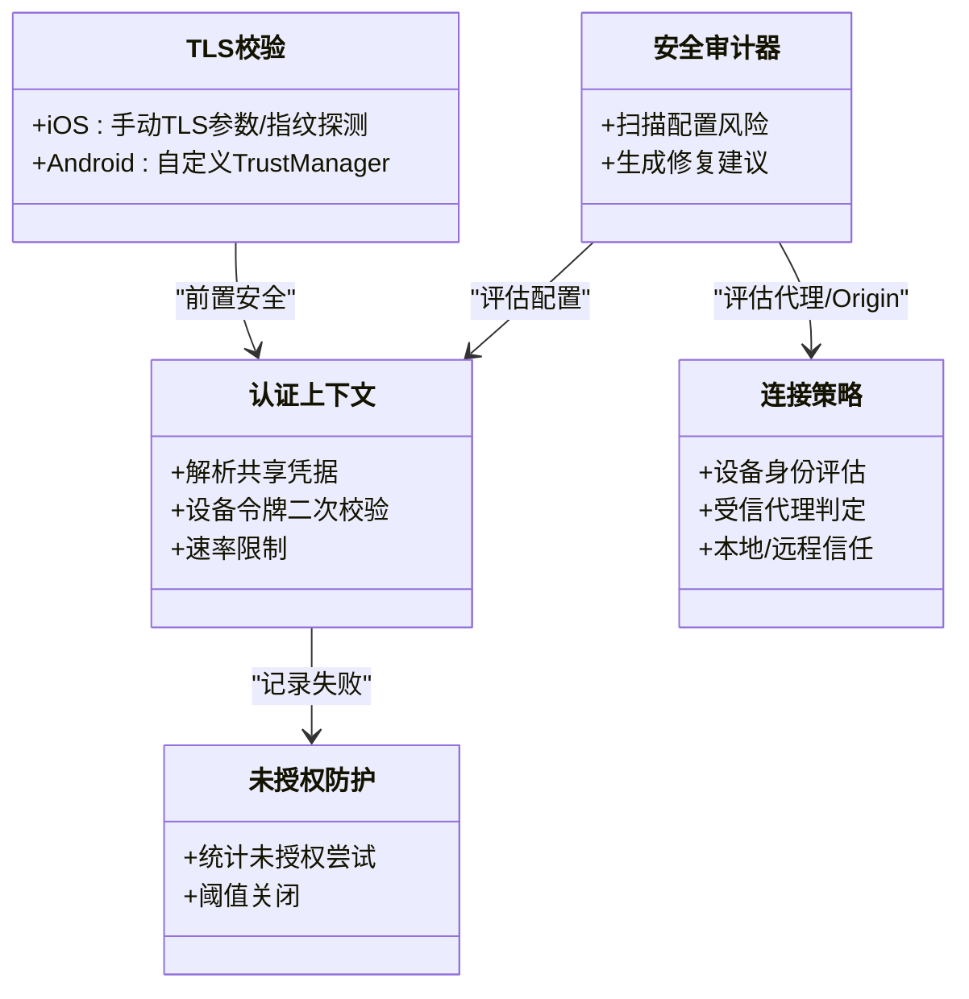
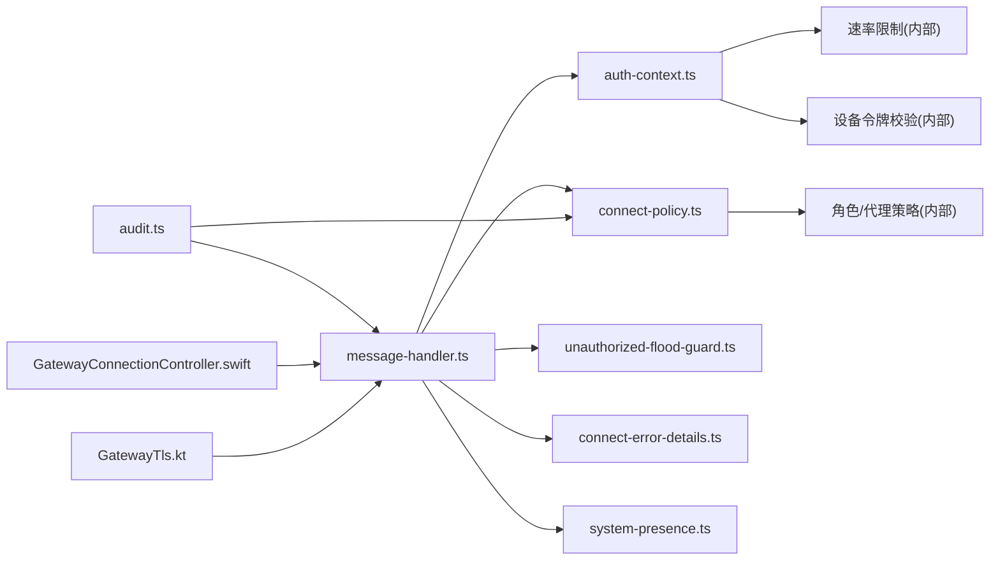

# 安全模型

<cite>
**本文引用的文件**
- [connect-policy.ts](file://src/gateway/server/ws-connection/connect-policy.ts)
- [auth-context.ts](file://src/gateway/server/ws-connection/auth-context.ts)
- [message-handler.ts](file://src/gateway/server/ws-connection/message-handler.ts)
- [auth-messages.ts](file://src/gateway/server/ws-connection/auth-messages.ts)
- [unauthorized-flood-guard.ts](file://src/gateway/server/ws-connection/unauthorized-flood-guard.ts)
- [connect-error-details.ts](file://src/gateway/protocol/connect-error-details.ts)
- [audit.ts](file://src/security/audit.ts)
- [system-presence.ts](file://src/infra/system-presence.ts)
- [presence.md](file://docs/concepts/presence.md)
- [InstancesStore.swift](file://apps/macos/Sources/OpenClaw/InstancesStore.swift)
- [GatewayConnectionController.swift](file://apps/ios/Sources/Gateway/GatewayConnectionController.swift)
- [GatewayTls.kt](file://apps/android/app/src/main/java/ai/openclaw/app/gateway/GatewayTls.kt)
- [README.md](file://docs/security/README.md)
</cite>

## 目录
1. [简介](#简介)
2. [项目结构](#项目结构)
3. [核心组件](#核心组件)
4. [架构总览](#架构总览)
5. [详细组件分析](#详细组件分析)
6. [依赖关系分析](#依赖关系分析)
7. [性能考量](#性能考量)
8. [故障排查指南](#故障排查指南)
9. [结论](#结论)
10. [附录](#附录)

## 简介
本文件系统化阐述 OpenClaw 的安全模型，覆盖设备信任机制、存在性检查（Presence）、网关安全架构与配置、以及安全最佳实践。目标是帮助开发者在部署与使用中实施有效的安全控制，包括设备身份验证、配对流程、本地信任策略、在线状态管理、访问控制、数据保护与审计。

## 项目结构
围绕安全主题的关键代码分布在以下模块：
- 网关握手与认证：WebSocket 握手、设备身份验证、共享凭据校验、速率限制与洪水防护
- 存在性检查：系统级在线状态聚合、去重与过期清理
- 网关安全审计：配置风险扫描、可信代理与认证模式评估
- 平台侧 TLS 与指纹校验：iOS/Android 客户端对网关证书的校验策略
- 文档与信任页：威胁建模与漏洞上报流程

图表来源
- [auth-context.ts:75-154](file://src/gateway/server/ws-connection/auth-context.ts#L75-L154)
- [message-handler.ts:236-800](file://src/gateway/server/ws-connection/message-handler.ts#L236-L800)
- [connect-policy.ts:12-102](file://src/gateway/server/ws-connection/connect-policy.ts#L12-L102)
- [unauthorized-flood-guard.ts:18-58](file://src/gateway/server/ws-connection/unauthorized-flood-guard.ts#L18-L58)
- [connect-error-details.ts:51-105](file://src/gateway/protocol/connect-error-details.ts#L51-L105)
- [system-presence.ts:193-290](file://src/infra/system-presence.ts#L193-L290)
- [presence.md:1-103](file://docs/concepts/presence.md#L1-L103)
- [audit.ts:339-687](file://src/security/audit.ts#L339-L687)
- [GatewayConnectionController.swift:499-523](file://apps/ios/Sources/Gateway/GatewayConnectionController.swift#L499-L523)
- [GatewayTls.kt:35-66](file://apps/android/app/src/main/java/ai/openclaw/app/gateway/GatewayTls.kt#L35-L66)

章节来源
- [auth-context.ts:1-219](file://src/gateway/server/ws-connection/auth-context.ts#L1-L219)
- [message-handler.ts:1-800](file://src/gateway/server/ws-connection/message-handler.ts#L1-L800)
- [connect-policy.ts:1-103](file://src/gateway/server/ws-connection/connect-policy.ts#L1-L103)
- [system-presence.ts:1-290](file://src/infra/system-presence.ts#L1-L290)
- [audit.ts:1-800](file://src/security/audit.ts#L1-L800)
- [GatewayConnectionController.swift:499-523](file://apps/ios/Sources/Gateway/GatewayConnectionController.swift#L499-L523)
- [GatewayTls.kt:35-66](file://apps/android/app/src/main/java/ai/openclaw/app/gateway/GatewayTls.kt#L35-L66)

## 核心组件
- 设备信任与配对策略：通过“设备身份”与“共享凭据”双重路径实现，支持受信代理模式；严格区分本地与远程客户端的信任边界。
- 在线状态（Presence）：多源聚合、键合并、TTL 清理与最大容量约束，保障 UI 可视化与调试可用性。
- 网关安全审计：自动扫描配置风险（如无认证绑定、可信代理缺失、短 Token、速率限制缺失等），并给出修复建议。
- TLS 与证书校验：平台侧强制校验网关证书指纹或采用受信代理终止 TLS，防止中间人攻击。
- 认证消息与错误码：统一格式化未授权提示与错误细节码，便于前端引导用户正确配置。

章节来源
- [connect-policy.ts:12-102](file://src/gateway/server/ws-connection/connect-policy.ts#L12-L102)
- [auth-context.ts:75-154](file://src/gateway/server/ws-connection/auth-context.ts#L75-L154)
- [system-presence.ts:193-290](file://src/infra/system-presence.ts#L193-L290)
- [audit.ts:339-687](file://src/security/audit.ts#L339-L687)
- [auth-messages.ts:7-67](file://src/gateway/server/ws-connection/auth-messages.ts#L7-L67)
- [connect-error-details.ts:51-105](file://src/gateway/protocol/connect-error-details.ts#L51-L105)

## 架构总览
下图展示从客户端到网关握手、认证决策、设备信任评估与存在性更新的整体流程。

图表来源
- [message-handler.ts:363-774](file://src/gateway/server/ws-connection/message-handler.ts#L363-L774)
- [auth-context.ts:75-218](file://src/gateway/server/ws-connection/auth-context.ts#L75-L218)
- [connect-policy.ts:68-102](file://src/gateway/server/ws-connection/connect-policy.ts#L68-L102)
- [unauthorized-flood-guard.ts:29-52](file://src/gateway/server/ws-connection/unauthorized-flood-guard.ts#L29-L52)
- [system-presence.ts:193-246](file://src/infra/system-presence.ts#L193-L246)

## 详细组件分析

### 设备信任机制与配对流程
- 设备身份验证
  - 基于设备公钥派生 ID、时间戳偏差校验、随机数匹配与签名验证，确保设备声明不可伪造。
  - 支持 v2/v3 设备签名载荷版本回退与选择。
- 共享凭据与设备令牌
  - 首选共享凭据（token/password）进行初始认证；若提供设备令牌候选且无设备身份，则进行设备令牌二次校验。
  - 对设备令牌与共享凭据分别施加速率限制，降低暴力破解风险。
- 受信代理与本地信任
  - 受信代理模式下，由上游代理负责用户身份，网关仅信任代理转发的用户头信息。
  - 本地客户端（环回/严格代理）与远程客户端在信任边界上区别对待，避免远程绕过安全上下文要求。
- 配对与升级
  - 非本地或需要角色/作用域升级时，允许静默配对以提升用户体验，同时保留本地与代理约束。

图表来源
- [auth-context.ts:75-218](file://src/gateway/server/ws-connection/auth-context.ts#L75-L218)
- [message-handler.ts:634-774](file://src/gateway/server/ws-connection/message-handler.ts#L634-L774)
- [connect-policy.ts:68-102](file://src/gateway/server/ws-connection/connect-policy.ts#L68-L102)

章节来源
- [auth-context.ts:75-218](file://src/gateway/server/ws-connection/auth-context.ts#L75-L218)
- [message-handler.ts:534-774](file://src/gateway/server/ws-connection/message-handler.ts#L534-L774)
- [connect-policy.ts:68-102](file://src/gateway/server/ws-connection/connect-policy.ts#L68-L102)

### 存在性检查（Presence）
- 多源聚合：网关自检、WS 连接、周期性 system-event、节点连接均产生存在性条目。
- 键合并与去重：优先使用稳定 instanceId，其次按主机/IP/文本片段生成键；同键条目合并字段并刷新时间戳。
- TTL 与容量：5 分钟过期、最多 200 条，避免内存膨胀与陈旧信息误导。
- 平台消费：macOS 实例列表基于此渲染，并根据时间戳计算活跃/空闲/陈旧状态。

图表来源
- [system-presence.ts:193-290](file://src/infra/system-presence.ts#L193-L290)
- [presence.md:63-82](file://docs/concepts/presence.md#L63-L82)

章节来源
- [system-presence.ts:193-290](file://src/infra/system-presence.ts#L193-L290)
- [presence.md:1-103](file://docs/concepts/presence.md#L1-L103)
- [InstancesStore.swift:224-242](file://apps/macos/Sources/OpenClaw/InstancesStore.swift#L224-L242)

### 网关安全架构
- 认证授权
  - 支持 token/password、受信代理、Tailscale 等多种模式；默认拒绝无认证绑定非环回地址。
  - 对共享凭据与设备令牌分别进行速率限制，防止暴力破解。
- 访问控制
  - 严格 Origin 检查与 Host Header 回退策略；可配置允许的 Origins 列表，禁用通配符与危险回退。
  - 反向代理信任：仅当代理 IP 在可信列表内时，才认为本地客户端，否则视为远程并应用更强安全策略。
- 数据保护
  - 审计器扫描 mDNS 全量模式、X-Real-IP 回退、Tailscale Funnel 等高风险暴露点。
  - TLS 校验：平台侧强制校验证书指纹或允许受信代理终止 TLS，避免中间人攻击。

图表来源
- [audit.ts:339-687](file://src/security/audit.ts#L339-L687)
- [auth-context.ts:75-218](file://src/gateway/server/ws-connection/auth-context.ts#L75-L218)
- [connect-policy.ts:12-102](file://src/gateway/server/ws-connection/connect-policy.ts#L12-L102)
- [unauthorized-flood-guard.ts:18-58](file://src/gateway/server/ws-connection/unauthorized-flood-guard.ts#L18-L58)
- [GatewayConnectionController.swift:499-523](file://apps/ios/Sources/Gateway/GatewayConnectionController.swift#L499-L523)
- [GatewayTls.kt:35-66](file://apps/android/app/src/main/java/ai/openclaw/app/gateway/GatewayTls.kt#L35-L66)

章节来源
- [audit.ts:339-687](file://src/security/audit.ts#L339-L687)
- [auth-context.ts:75-218](file://src/gateway/server/ws-connection/auth-context.ts#L75-L218)
- [connect-policy.ts:12-102](file://src/gateway/server/ws-connection/connect-policy.ts#L12-L102)
- [unauthorized-flood-guard.ts:18-58](file://src/gateway/server/ws-connection/unauthorized-flood-guard.ts#L18-L58)
- [GatewayConnectionController.swift:499-523](file://apps/ios/Sources/Gateway/GatewayConnectionController.swift#L499-L523)
- [GatewayTls.kt:35-66](file://apps/android/app/src/main/java/ai/openclaw/app/gateway/GatewayTls.kt#L35-L66)

### 安全配置选项
- 令牌管理
  - 支持长随机 token 与密码两种共享凭据；短 token 将触发告警。
  - 设备令牌作为一次性凭据，用于设备身份绑定，不参与默认共享凭据流程。
- TLS 加密
  - iOS：可解析手动 TLS 参数，支持指纹存储与禁止首次信任（TOFU）。
  - Android：自定义 TrustManager，严格比对首证指纹或允许 TOFU 存储。
- 审计日志
  - 审计器输出结构化发现项，包含严重级别、标题、详情与修复建议；支持深度探测网关可达性与错误原因。

章节来源
- [audit.ts:603-612](file://src/security/audit.ts#L603-L612)
- [auth-context.ts:180-218](file://src/gateway/server/ws-connection/auth-context.ts#L180-L218)
- [GatewayConnectionController.swift:499-523](file://apps/ios/Sources/Gateway/GatewayConnectionController.swift#L499-L523)
- [GatewayTls.kt:35-66](file://apps/android/app/src/main/java/ai/openclaw/app/gateway/GatewayTls.kt#L35-L66)
- [audit.ts:72-85](file://src/security/audit.ts#L72-L85)

### 安全最佳实践指南
- 密钥管理
  - 使用足够长度的随机 token；避免明文或弱口令；定期轮换。
  - 设备令牌用于设备绑定，避免泄露后被滥用；必要时撤销并重新发放。
- 网络隔离
  - 非环回绑定必须配置强认证；优先使用受信代理终止 TLS 并严格限制代理 IP。
  - 禁止通配符 Origins；启用严格的 Origin 白名单。
- 威胁防护策略
  - 启用速率限制；开启审计器定期扫描；避免启用危险配置标志。
  - 严格控制 mDNS 发布范围；避免 X-Real-IP 回退；谨慎使用 Host Header 回退。
  - 对外暴露的网关应采用受信代理或 Tailscale Serve，避免 Funnel 直接暴露。

章节来源
- [audit.ts:428-436](file://src/security/audit.ts#L428-L436)
- [audit.ts:463-492](file://src/security/audit.ts#L463-L492)
- [audit.ts:507-524](file://src/security/audit.ts#L507-L524)
- [audit.ts:526-538](file://src/security/audit.ts#L526-L538)
- [audit.ts:540-555](file://src/security/audit.ts#L540-L555)
- [audit.ts:614-684](file://src/security/audit.ts#L614-L684)

## 依赖关系分析
- 组件耦合
  - 消息处理器依赖认证上下文与连接策略；认证上下文依赖速率限制与设备令牌校验；连接策略依赖角色与受信代理配置。
  - 存在性模块独立于认证链路，但被握手成功后写入，形成可观测闭环。
- 外部依赖
  - 审计器依赖配置解析、环境变量与外部探测函数；平台 TLS 依赖系统证书栈与自定义 TrustManager。
- 循环依赖
  - 未见循环导入；各模块职责清晰，接口边界明确。

图表来源
- [message-handler.ts:1-800](file://src/gateway/server/ws-connection/message-handler.ts#L1-L800)
- [auth-context.ts:1-219](file://src/gateway/server/ws-connection/auth-context.ts#L1-L219)
- [connect-policy.ts:1-103](file://src/gateway/server/ws-connection/connect-policy.ts#L1-L103)
- [unauthorized-flood-guard.ts:1-70](file://src/gateway/server/ws-connection/unauthorized-flood-guard.ts#L1-L70)
- [connect-error-details.ts:1-137](file://src/gateway/protocol/connect-error-details.ts#L1-L137)
- [system-presence.ts:1-290](file://src/infra/system-presence.ts#L1-L290)
- [audit.ts:1-800](file://src/security/audit.ts#L1-L800)
- [GatewayConnectionController.swift:499-523](file://apps/ios/Sources/Gateway/GatewayConnectionController.swift#L499-L523)
- [GatewayTls.kt:35-66](file://apps/android/app/src/main/java/ai/openclaw/app/gateway/GatewayTls.kt#L35-L66)

章节来源
- [message-handler.ts:1-800](file://src/gateway/server/ws-connection/message-handler.ts#L1-L800)
- [audit.ts:1-800](file://src/security/audit.ts#L1-L800)

## 性能考量
- 速率限制与洪水防护
  - 对共享凭据与设备令牌分别施加速率限制，减少认证风暴；未授权尝试超过阈值将主动关闭连接，降低资源消耗。
- 存在性缓存与清理
  - 内存映射 + TTL + 最大容量，避免无限增长；热点实例通过最近更新时间排序，保证 UI 响应性。
- 审计器深探
  - 可配置超时与缓存，避免重复扫描耗时影响主流程。

章节来源
- [auth-context.ts:180-218](file://src/gateway/server/ws-connection/auth-context.ts#L180-L218)
- [unauthorized-flood-guard.ts:18-58](file://src/gateway/server/ws-connection/unauthorized-flood-guard.ts#L18-L58)
- [system-presence.ts:270-290](file://src/infra/system-presence.ts#L270-L290)
- [audit.ts:99-113](file://src/security/audit.ts#L99-L113)

## 故障排查指南
- 常见握手失败
  - 认证失败：根据错误码与恢复建议调整 token/password 或设备令牌；若被限流，等待后再试。
  - 设备身份缺失：确认设备已配对并携带有效签名；本地 HTTPS/localhost 安全上下文要求。
  - 受信代理问题：检查代理用户头与可信代理列表；确保仅代理 IP 可信。
- 存在性异常
  - 重复/陈旧：确认客户端稳定 instanceId；检查 TTL 与容量裁剪；关注隧道场景下的环回 IP 忽略规则。
- 审计告警
  - 无认证绑定、短 token、受信代理配置缺失、Origin 回退、X-Real-IP 回退、mDNS 全量模式等，按建议修复。

章节来源
- [auth-messages.ts:7-67](file://src/gateway/server/ws-connection/auth-messages.ts#L7-L67)
- [connect-error-details.ts:51-105](file://src/gateway/protocol/connect-error-details.ts#L51-L105)
- [message-handler.ts:564-627](file://src/gateway/server/ws-connection/message-handler.ts#L564-L627)
- [system-presence.ts:270-290](file://src/infra/system-presence.ts#L270-L290)
- [audit.ts:428-436](file://src/security/audit.ts#L428-L436)
- [audit.ts:463-492](file://src/security/audit.ts#L463-L492)
- [audit.ts:507-524](file://src/security/audit.ts#L507-L524)
- [audit.ts:526-538](file://src/security/audit.ts#L526-L538)
- [audit.ts:614-684](file://src/security/audit.ts#L614-L684)

## 结论
OpenClaw 的安全模型通过“设备身份+共享凭据”的双轨认证、严格的本地/远程信任边界、受信代理与 Origin 控制、TLS 证书校验以及存在性可观测性，构建了端到端的安全基线。配合安全审计器与最佳实践，可在不同部署形态下实现稳健的访问控制与数据保护。

## 附录
- 威胁建模与漏洞上报
  - 参考安全文档索引与信任页，了解威胁模型与报告流程。

章节来源
- [README.md:1-18](file://docs/security/README.md#L1-L18)