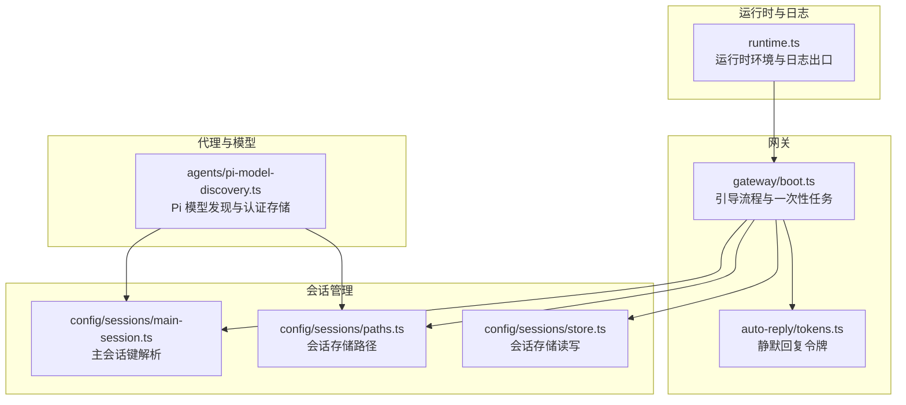
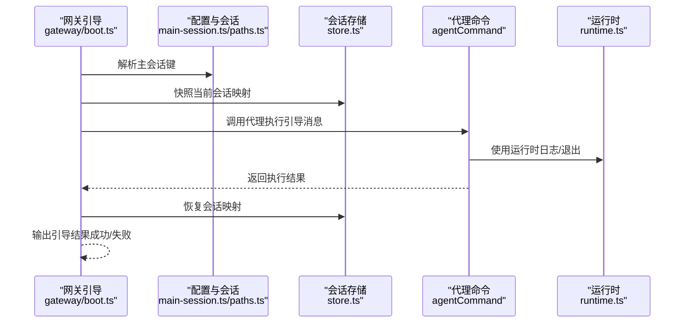
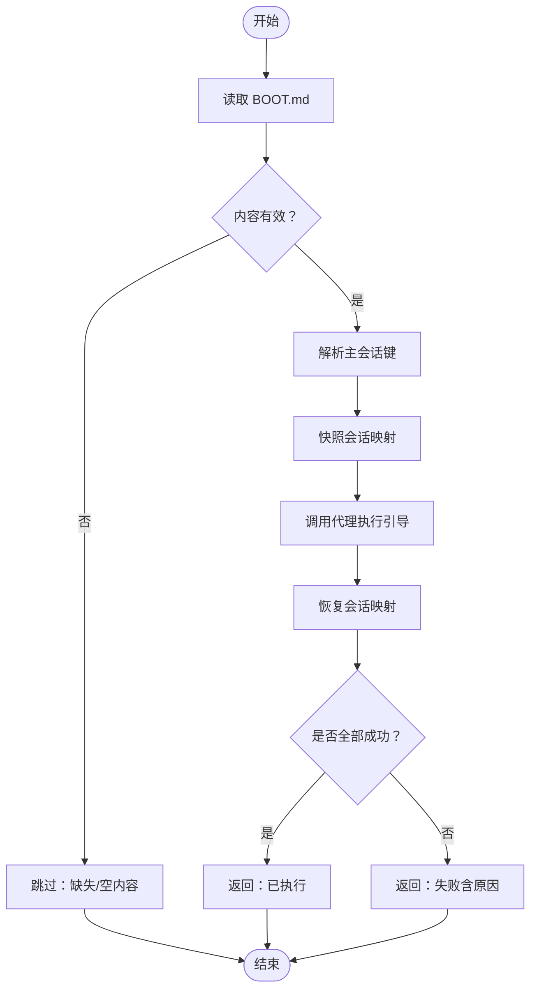
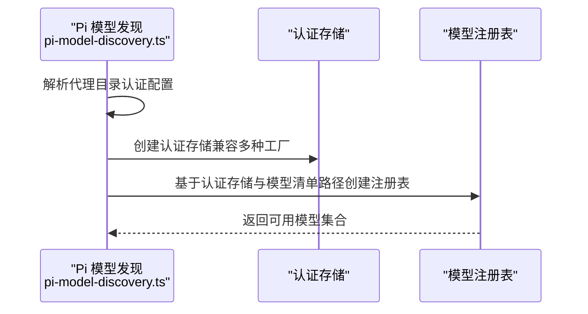
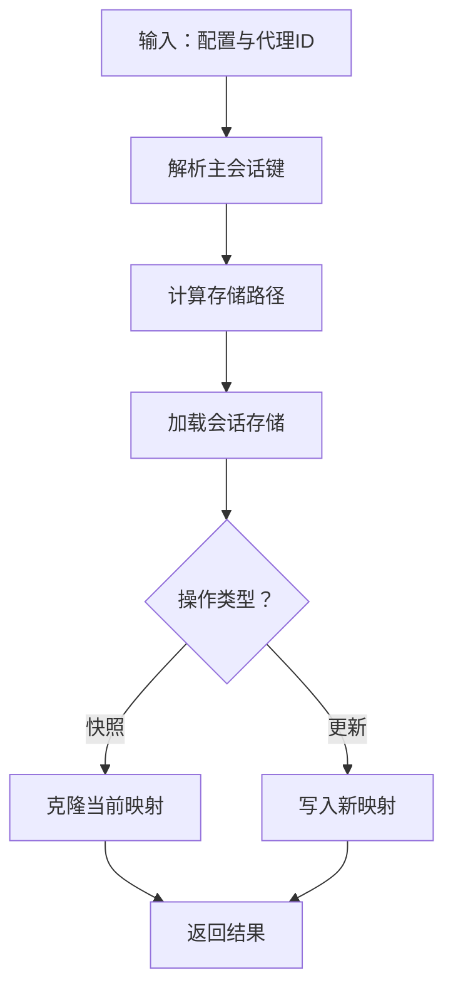
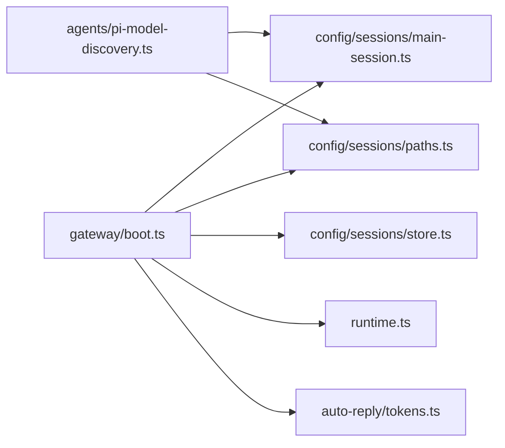

# 核心概念

<cite>
**本文引用的文件**
- [src/runtime.ts](file://src/runtime.ts)
- [src/gateway/boot.ts](file://src/gateway/boot.ts)
- [src/agents/pi-model-discovery.ts](file://src/agents/pi-model-discovery.ts)
- [src/config/sessions/main-session.ts](file://src/config/sessions/main-session.ts)
- [src/config/sessions/paths.ts](file://src/config/sessions/paths.ts)
- [src/config/sessions/store.ts](file://src/config/sessions/store.ts)
- [src/auto-reply/tokens.ts](file://src/auto-reply/tokens.ts)
- [docs/zh-CN/pi.md](file://docs/zh-CN/pi.md)
</cite>

## 目录
1. [引言](#引言)
2. [项目结构](#项目结构)
3. [核心组件](#核心组件)
4. [架构总览](#架构总览)
5. [详细组件分析](#详细组件分析)
6. [依赖分析](#依赖分析)
7. [性能考量](#性能考量)
8. [故障排查指南](#故障排查指南)
9. [结论](#结论)
10. [附录](#附录)

## 引言
本文件面向希望深入理解 OpenClaw 底层工作原理与设计理念的读者，围绕“网关架构”“代理系统（Pi Agent 运行时）”“会话管理”“模型集成”等核心概念展开。我们将从系统架构、组件关系、数据流与处理逻辑入手，结合具体文件路径与图示，帮助您建立从概念到实现的完整认知，并为后续高级使用与二次开发打下坚实基础。

## 项目结构
OpenClaw 采用模块化分层组织：运行时与日志抽象位于顶层；网关负责启动引导、会话映射与一次性任务执行；代理侧通过 Pi 编码代理进行模型发现与认证存储；会话子系统提供主会话键解析、存储路径与持久化能力；自动回复令牌用于引导流程的安全静默应答。

**图表来源**
- [src/runtime.ts:1-54](file://src/runtime.ts#L1-L54)
- [src/gateway/boot.ts:1-204](file://src/gateway/boot.ts#L1-L204)
- [src/auto-reply/tokens.ts](file://src/auto-reply/tokens.ts)
- [src/agents/pi-model-discovery.ts:1-153](file://src/agents/pi-model-discovery.ts#L1-L153)
- [src/config/sessions/main-session.ts](file://src/config/sessions/main-session.ts)
- [src/config/sessions/paths.ts](file://src/config/sessions/paths.ts)
- [src/config/sessions/store.ts](file://src/config/sessions/store.ts)

**章节来源**
- [src/runtime.ts:1-54](file://src/runtime.ts#L1-L54)
- [src/gateway/boot.ts:1-204](file://src/gateway/boot.ts#L1-L204)
- [src/agents/pi-model-discovery.ts:1-153](file://src/agents/pi-model-discovery.ts#L1-L153)
- [src/config/sessions/main-session.ts](file://src/config/sessions/main-session.ts)
- [src/config/sessions/paths.ts](file://src/config/sessions/paths.ts)
- [src/config/sessions/store.ts](file://src/config/sessions/store.ts)
- [src/auto-reply/tokens.ts](file://src/auto-reply/tokens.ts)

## 核心组件
- 运行时与日志抽象：统一日志输出、错误输出与进程退出行为，支持测试环境下的日志开关控制与非退出运行时构造。
- 网关引导（Boot）：负责读取引导脚本、生成一次性会话 ID、快照主会话映射、调用代理执行引导命令并恢复映射。
- 代理与模型集成：通过 Pi 编码代理进行认证存储与模型注册表发现，兼容不同版本的 Pi 存储接口与运行时密钥覆盖。
- 会话管理：提供主会话键解析、存储路径计算与会话存储的读写更新能力，支撑引导流程中的映射快照与恢复。

**章节来源**
- [src/runtime.ts:1-54](file://src/runtime.ts#L1-L54)
- [src/gateway/boot.ts:138-203](file://src/gateway/boot.ts#L138-L203)
- [src/agents/pi-model-discovery.ts:142-153](file://src/agents/pi-model-discovery.ts#L142-L153)
- [src/config/sessions/main-session.ts](file://src/config/sessions/main-session.ts)
- [src/config/sessions/paths.ts](file://src/config/sessions/paths.ts)
- [src/config/sessions/store.ts](file://src/config/sessions/store.ts)

## 架构总览
OpenClaw 的核心是“网关驱动的代理执行 + 会话持久化”的闭环：网关在启动阶段读取引导脚本，构造一次性会话上下文，调用代理执行引导命令；代理在运行时通过 Pi 模型发现与认证存储访问外部模型服务；所有关键状态变更（如会话映射）均以快照/恢复的方式保证一致性。

**图表来源**
- [src/gateway/boot.ts:138-203](file://src/gateway/boot.ts#L138-L203)
- [src/config/sessions/main-session.ts](file://src/config/sessions/main-session.ts)
- [src/config/sessions/paths.ts](file://src/config/sessions/paths.ts)
- [src/config/sessions/store.ts](file://src/config/sessions/store.ts)
- [src/runtime.ts:37-44](file://src/runtime.ts#L37-L44)

## 详细组件分析

### 组件一：运行时与日志抽象（runtime.ts）
- 设计要点
  - 将日志、错误输出与进程退出封装为统一的运行时接口，便于在 CLI、测试与嵌入式场景中一致使用。
  - 支持在测试环境中按需开启或抑制日志输出，避免干扰测试断言。
  - 提供“非退出运行时”构造函数，便于在上层捕获退出信号而非直接终止进程。
- 关键行为
  - 日志输出前清理进度行，避免终端状态混乱。
  - 退出时恢复终端状态，确保交互式体验一致。
- 典型使用场景
  - 网关引导流程中，使用专用运行时以屏蔽引导期间的日志噪声，同时保留错误输出以便诊断。

**章节来源**
- [src/runtime.ts:1-54](file://src/runtime.ts#L1-L54)

### 组件二：网关引导（gateway/boot.ts）
- 设计要点
  - 引导脚本（BOOT.md）内容作为指令源，构建严格格式的引导提示，确保代理按规范执行。
  - 自动生成一次性会话 ID，隔离引导会话与其他会话，避免污染。
  - 在执行前后对主会话映射进行快照与恢复，保证配置一致性与可回滚性。
  - 使用静默回复令牌（SILENT_REPLY_TOKEN）作为自动化应答，避免产生多余消息。
- 执行流程
  - 读取 BOOT.md 并校验存在性与内容有效性。
  - 解析主会话键，计算存储路径，快照当前映射。
  - 调用代理命令执行引导消息，记录异常。
  - 尝试恢复映射，汇总失败原因并返回引导结果。
- 错误处理
  - 文件读取失败、代理执行失败、映射恢复失败分别记录并合并为最终失败原因。

**图表来源**
- [src/gateway/boot.ts:138-203](file://src/gateway/boot.ts#L138-L203)
- [src/auto-reply/tokens.ts](file://src/auto-reply/tokens.ts)

**章节来源**
- [src/gateway/boot.ts:1-204](file://src/gateway/boot.ts#L1-L204)
- [src/auto-reply/tokens.ts](file://src/auto-reply/tokens.ts)

### 组件三：代理与模型集成（agents/pi-model-discovery.ts）
- 设计要点
  - 通过 Pi 编码代理提供的认证存储与模型注册表类，实现对多提供商模型的发现与访问。
  - 兼容不同版本的 Pi 接口：优先使用 inMemory/fromStorage 工厂，其次尝试构造函数，最后支持运行时 API Key 覆盖。
  - 清理历史静态认证文件中的遗留条目，保持认证存储整洁与安全。
- 关键流程
  - 解析代理目录中的认证配置，清洗旧格式后创建认证存储实例。
  - 基于认证存储与模型清单路径创建模型注册表。
- 与会话的关系
  - 代理在引导流程中被调用，其运行时所需的模型与认证信息由该模块提供。

**图表来源**
- [src/agents/pi-model-discovery.ts:142-153](file://src/agents/pi-model-discovery.ts#L142-L153)

**章节来源**
- [src/agents/pi-model-discovery.ts:1-153](file://src/agents/pi-model-discovery.ts#L1-L153)

### 组件四：会话管理（config/sessions）
- 主会话键解析：根据配置与代理 ID 计算主会话键，确保不同代理共享或隔离会话上下文。
- 存储路径：基于配置与代理 ID 解析会话存储路径，支持多代理/多环境部署。
- 存储读写：提供会话存储的加载与更新能力，支持快照/恢复与活动会话键标注。

**图表来源**
- [src/config/sessions/main-session.ts](file://src/config/sessions/main-session.ts)
- [src/config/sessions/paths.ts](file://src/config/sessions/paths.ts)
- [src/config/sessions/store.ts](file://src/config/sessions/store.ts)

**章节来源**
- [src/config/sessions/main-session.ts](file://src/config/sessions/main-session.ts)
- [src/config/sessions/paths.ts](file://src/config/sessions/paths.ts)
- [src/config/sessions/store.ts](file://src/config/sessions/store.ts)

### 组件五：Pi Agent 运行时与代理循环（概念说明）
- Pi Agent 运行时
  - 通过 Pi 编码代理提供的认证存储与模型注册表，代理在运行时可动态选择模型与提供商。
  - 支持运行时 API Key 覆盖，便于在不同环境切换密钥而不修改持久化存储。
- 代理循环
  - 代理循环通常指代理在会话上下文中持续处理消息、调用工具与模型、更新状态的迭代过程。
  - 在引导流程中，代理以一次性会话执行引导命令，随后回到常规循环模式。
- 多模型支持
  - 通过模型注册表集中管理可用模型，代理可根据策略选择最优模型或进行故障转移。
  - 认证存储统一管理各提供商凭据，简化跨模型切换与轮换。

**章节来源**
- [src/agents/pi-model-discovery.ts:142-153](file://src/agents/pi-model-discovery.ts#L142-L153)
- [docs/zh-CN/pi.md:531-539](file://docs/zh-CN/pi.md#L531-L539)

## 依赖分析
- 组件耦合
  - 网关引导依赖会话解析与存储模块，以确保引导期间的状态隔离与可恢复。
  - 代理命令在引导流程中被调用，其运行时依赖运行时抽象与日志系统。
  - 代理与模型集成模块独立于网关引导，但为代理执行提供必要的认证与模型发现能力。
- 外部依赖
  - Pi 编码代理提供认证存储与模型注册表的实现细节，OpenClaw 通过兼容层适配其接口变化。
- 潜在风险
  - 引导流程中的映射恢复失败可能导致配置不一致，需在日志中明确记录并返回失败原因。
  - 认证存储的清理逻辑仅在非只读模式下生效，需确保生产环境权限正确。

**图表来源**
- [src/gateway/boot.ts:1-204](file://src/gateway/boot.ts#L1-L204)
- [src/runtime.ts:1-54](file://src/runtime.ts#L1-L54)
- [src/auto-reply/tokens.ts](file://src/auto-reply/tokens.ts)
- [src/agents/pi-model-discovery.ts:1-153](file://src/agents/pi-model-discovery.ts#L1-L153)
- [src/config/sessions/main-session.ts](file://src/config/sessions/main-session.ts)
- [src/config/sessions/paths.ts](file://src/config/sessions/paths.ts)
- [src/config/sessions/store.ts](file://src/config/sessions/store.ts)

**章节来源**
- [src/gateway/boot.ts:1-204](file://src/gateway/boot.ts#L1-L204)
- [src/runtime.ts:1-54](file://src/runtime.ts#L1-L54)
- [src/agents/pi-model-discovery.ts:1-153](file://src/agents/pi-model-discovery.ts#L1-L153)
- [src/config/sessions/main-session.ts](file://src/config/sessions/main-session.ts)
- [src/config/sessions/paths.ts](file://src/config/sessions/paths.ts)
- [src/config/sessions/store.ts](file://src/config/sessions/store.ts)
- [src/auto-reply/tokens.ts](file://src/auto-reply/tokens.ts)

## 性能考量
- 引导流程的快照/恢复开销较小，主要消耗在磁盘读写与结构化克隆，建议在高并发场景下避免频繁触发引导。
- 代理运行时的模型发现与认证存储访问应尽量缓存，减少重复初始化成本。
- 日志输出在测试环境下可按需关闭，降低 I/O 压力。

## 故障排查指南
- 引导失败
  - 检查 BOOT.md 是否存在且内容非空。
  - 查看引导期间的错误日志，确认代理执行与映射恢复是否成功。
- 会话映射异常
  - 确认会话存储路径与权限设置正确。
  - 验证快照与恢复逻辑是否被调用，必要时手动检查存储文件。
- 认证存储问题
  - 确保非只读模式下历史静态认证条目已被清理。
  - 如启用运行时 API Key 覆盖，请确认覆盖逻辑是否生效。

**章节来源**
- [src/gateway/boot.ts:138-203](file://src/gateway/boot.ts#L138-L203)
- [src/agents/pi-model-discovery.ts:49-90](file://src/agents/pi-model-discovery.ts#L49-L90)

## 结论
OpenClaw 的核心在于以“网关引导 + 会话持久化 + Pi 代理运行时”的组合实现稳定、可恢复、可扩展的智能体执行框架。通过清晰的模块边界与一致的运行时抽象，系统在保证易用性的同时，也为多模型、多提供商与多代理场景提供了坚实的基础设施。

## 附录
- 使用场景建议
  - 新环境首次部署：使用引导流程验证关键通道与代理连通性。
  - 多代理并行：通过主会话键解析与存储路径隔离不同代理的会话状态。
  - 模型切换：利用 Pi 模型注册表与认证存储的解耦特性，快速切换提供商与模型。
- 最佳实践
  - 在测试环境中关闭引导日志输出，避免干扰。
  - 对会话存储定期维护，确保映射快照与恢复的可靠性。
  - 保持认证存储整洁，避免遗留条目影响安全与性能。