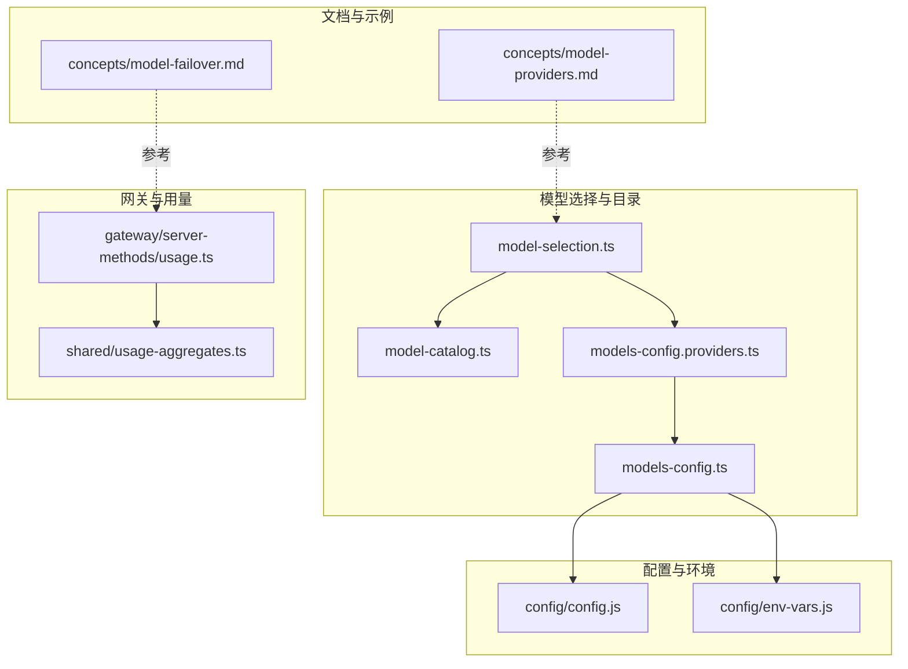
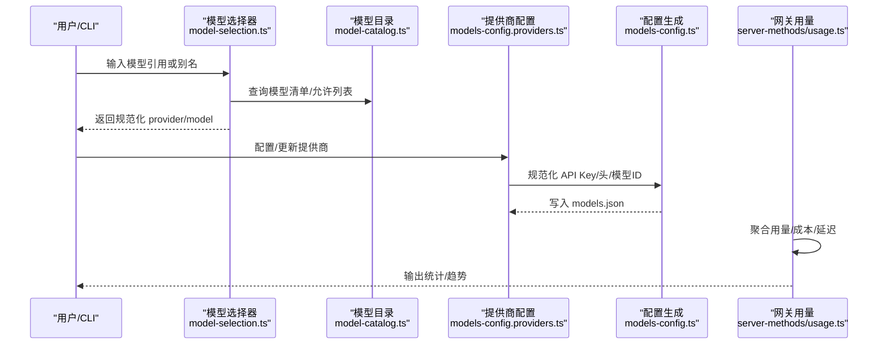
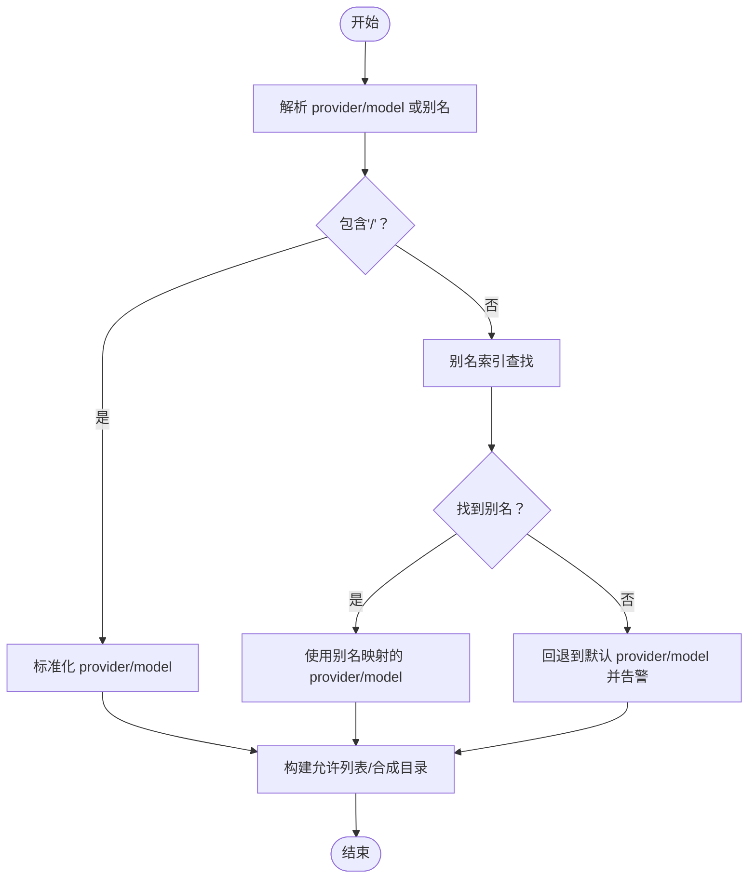
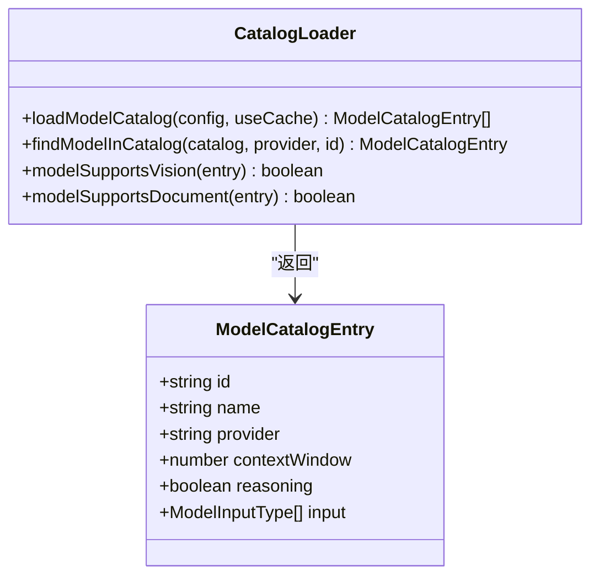
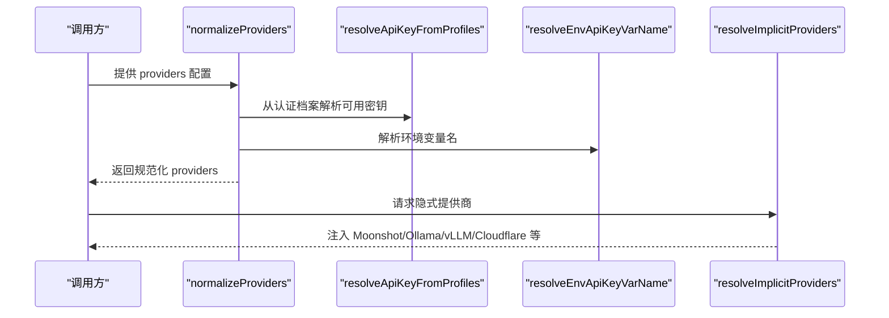
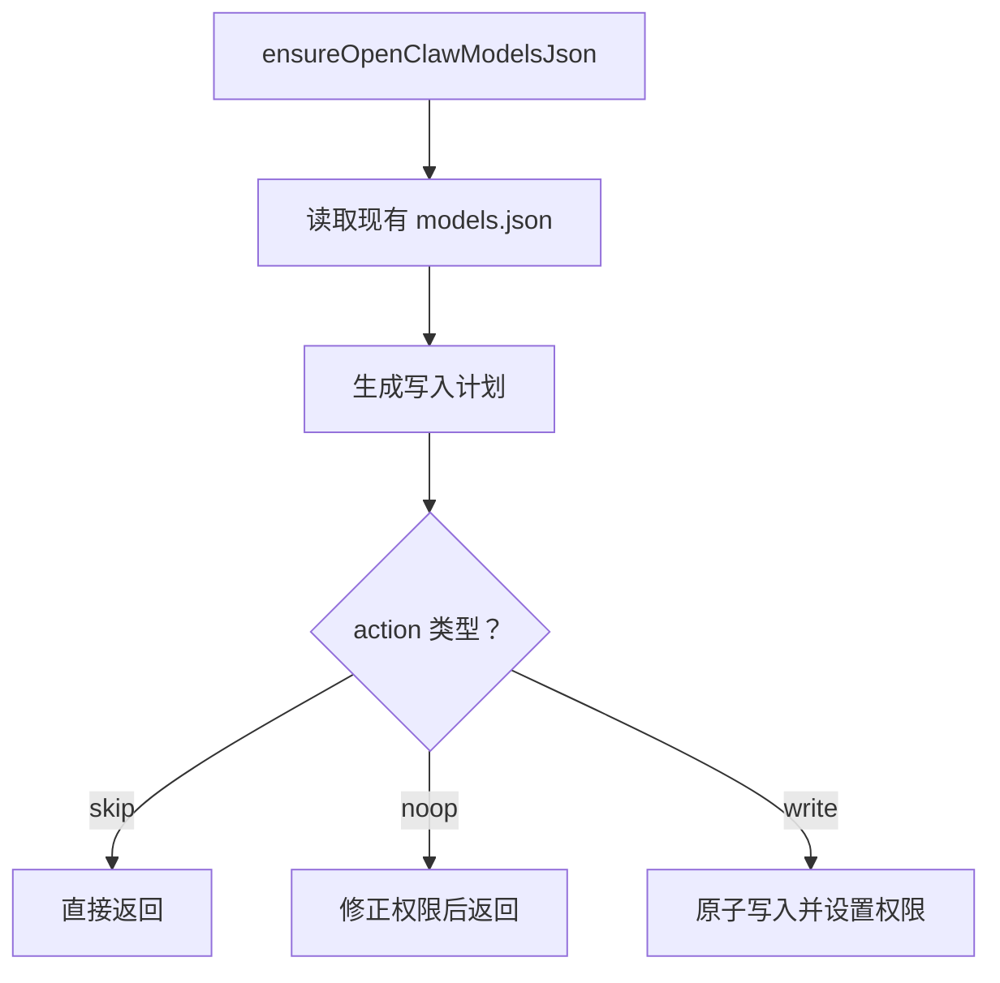
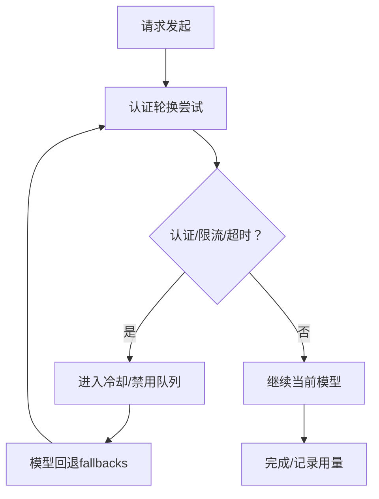
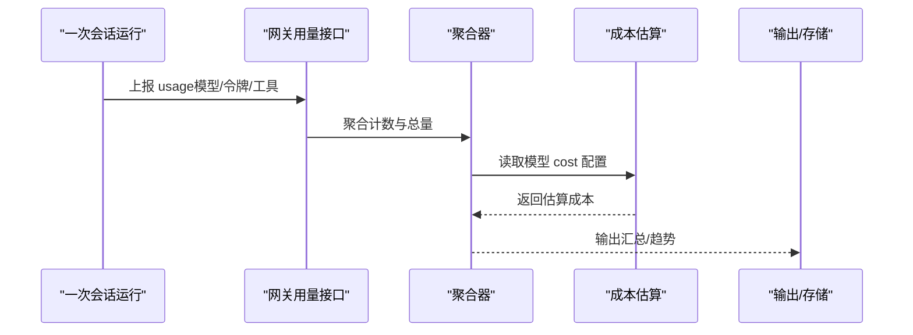
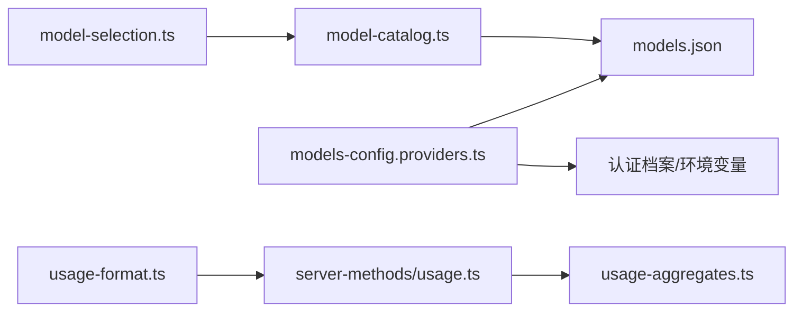

# 模型集成

<cite>
**本文引用的文件**
- [src/agents/defaults.ts](file://src/agents/defaults.ts)
- [src/agents/model-selection.ts](file://src/agents/model-selection.ts)
- [src/agents/model-catalog.ts](file://src/agents/model-catalog.ts)
- [src/agents/models-config.providers.ts](file://src/agents/models-config.providers.ts)
- [src/agents/models-config.ts](file://src/agents/models-config.ts)
- [src/agents/models-config.providers.static.js](file://src/agents/models-config.providers.static.js)
- [src/agents/models-config.providers.discovery.js](file://src/agents/models-config.providers.discovery.js)
- [src/agents/bedrock-discovery.test.ts](file://src/agents/bedrock-discovery.test.ts)
- [src/commands/onboard-auth.models.ts](file://src/commands/onboard-auth.models.ts)
- [src/utils/mask-api-key.ts](file://src/utils/mask-api-key.ts)
- [src/utils/usage-format.ts](file://src/utils/usage-format.ts)
- [src/gateway/server-methods/usage.ts](file://src/gateway/server-methods/usage.ts)
- [src/shared/usage-aggregates.ts](file://src/shared/usage-aggregates.ts)
- [skills/model-usage/scripts/model_usage.py](file://skills/model-usage/scripts/model_usage.py)
- [docs/concepts/model-failover.md](file://docs/concepts/model-failover.md)
- [docs/concepts/model-providers.md](file://docs/concepts/model-providers.md)
- [extensions/open-prose/skills/prose/lib/cost-analyzer.prose](file://extensions/open-prose/skills/prose/lib/cost-analyzer.prose)
- [extensions/open-prose/skills/prose/lib/profiler.prose](file://extensions/open-prose/skills/prose/lib/profiler.prose)
- [src/telegram/model-buttons.ts](file://src/telegram/model-buttons.ts)
</cite>

## 目录
1. [简介](#简介)
2. [项目结构](#项目结构)
3. [核心组件](#核心组件)
4. [架构总览](#架构总览)
5. [详细组件分析](#详细组件分析)
6. [依赖关系分析](#依赖关系分析)
7. [性能考量](#性能考量)
8. [故障排查指南](#故障排查指南)
9. [结论](#结论)
10. [附录：场景与配置建议](#附录场景与配置建议)

## 简介
本文件系统化梳理 OpenClaw 的“模型集成”能力，覆盖以下关键主题：
- 支持的模型提供商与接入方式（OpenAI、Anthropic、Claude、Google Gemini 等）
- 模型选择算法（允许列表、别名解析、默认回退、推理/思考级别推断）
- 故障转移与降级（认证轮换、冷却与禁用、模型回退）
- 配置管理（API 密钥与头信息、请求参数、本地模型文件生成）
- 性能与成本监控（用量聚合、成本估算、趋势追踪）
- 场景化建议与配置示例（按任务类型与预算约束给出选型思路）

## 项目结构
围绕模型集成的关键目录与文件：
- agents 层：模型选择、目录与配置生成、提供商发现与规范化
- config 层：运行时配置加载与环境变量注入
- gateway 层：用量上报与聚合
- skills 与 extensions：成本分析与性能剖析工作流
- docs：概念文档（模型提供商、故障转移）

**图表来源**
- [src/agents/model-selection.ts:1-671](file://src/agents/model-selection.ts#L1-L671)
- [src/agents/model-catalog.ts:1-310](file://src/agents/model-catalog.ts#L1-L310)
- [src/agents/models-config.providers.ts:1-836](file://src/agents/models-config.providers.ts#L1-L836)
- [src/agents/models-config.ts:1-111](file://src/agents/models-config.ts#L1-L111)
- [src/gateway/server-methods/usage.ts:623-660](file://src/gateway/server-methods/usage.ts#L623-L660)
- [src/shared/usage-aggregates.ts:68-109](file://src/shared/usage-aggregates.ts#L68-L109)
- [docs/concepts/model-providers.md:1-461](file://docs/concepts/model-providers.md#L1-L461)
- [docs/concepts/model-failover.md:1-153](file://docs/concepts/model-failover.md#L1-L153)

**章节来源**
- [src/agents/model-selection.ts:1-671](file://src/agents/model-selection.ts#L1-L671)
- [src/agents/model-catalog.ts:1-310](file://src/agents/model-catalog.ts#L1-L310)
- [src/agents/models-config.providers.ts:1-836](file://src/agents/models-config.providers.ts#L1-L836)
- [src/agents/models-config.ts:1-111](file://src/agents/models-config.ts#L1-L111)
- [docs/concepts/model-providers.md:1-461](file://docs/concepts/model-providers.md#L1-L461)
- [docs/concepts/model-failover.md:1-153](file://docs/concepts/model-failover.md#L1-L153)

## 核心组件
- 模型选择器：负责解析用户输入、别名映射、默认回退、允许列表过滤、推理/思考级别推断。
- 模型目录与发现：从内置目录与本地 models.json 合并模型清单，补充合成回退项。
- 提供商配置与规范化：统一处理 API Key、请求头、模型 ID 规范化、隐式提供商注入。
- 用量与成本：聚合会话用量、计算成本、输出趋势报告。

**章节来源**
- [src/agents/model-selection.ts:252-671](file://src/agents/model-selection.ts#L252-L671)
- [src/agents/model-catalog.ts:193-310](file://src/agents/model-catalog.ts#L193-L310)
- [src/agents/models-config.providers.ts:279-438](file://src/agents/models-config.providers.ts#L279-L438)
- [src/utils/usage-format.ts:51-91](file://src/utils/usage-format.ts#L51-L91)

## 架构总览
OpenClaw 在“模型选择”阶段完成“提供商/模型解析 + 允许列表校验”，在“配置生成”阶段写入本地 models.json 并进行密钥/头规范化；在“运行时”通过网关收集用量并进行成本与延迟聚合。

**图表来源**
- [src/agents/model-selection.ts:252-671](file://src/agents/model-selection.ts#L252-L671)
- [src/agents/model-catalog.ts:193-310](file://src/agents/model-catalog.ts#L193-L310)
- [src/agents/models-config.providers.ts:279-438](file://src/agents/models-config.providers.ts#L279-L438)
- [src/agents/models-config.ts:75-111](file://src/agents/models-config.ts#L75-L111)
- [src/gateway/server-methods/usage.ts:623-660](file://src/gateway/server-methods/usage.ts#L623-L660)

## 详细组件分析

### 组件A：模型选择与别名解析
- 功能要点
  - 解析 provider/model 或仅模型别名，支持 Anthropic、Google、OpenRouter 等特殊归一化
  - 别名索引构建与查找，避免歧义
  - 默认回退：当未指定 provider 时回退到默认提供商与模型，并发出警告
  - 允许列表与合成目录回退：当配置了允许列表但目录缺失时，保留已配置条目
  - 推理/思考级别：基于模型是否具备推理能力或特定型号族进行默认值推断

**图表来源**
- [src/agents/model-selection.ts:158-353](file://src/agents/model-selection.ts#L158-L353)

**章节来源**
- [src/agents/model-selection.ts:158-353](file://src/agents/model-selection.ts#L158-L353)
- [src/agents/defaults.ts:1-7](file://src/agents/defaults.ts#L1-L7)

### 组件B：模型目录与合成回退
- 功能要点
  - 加载内置目录与本地 models.json，合并配置中显式声明的提供商模型
  - 对部分提供商（如 KiloCode）应用合成回退，确保新模型 ID 可用
  - 支持按 provider/model 查找模型条目，判断视觉/文档输入能力

**图表来源**
- [src/agents/model-catalog.ts:10-310](file://src/agents/model-catalog.ts#L10-L310)

**章节来源**
- [src/agents/model-catalog.ts:193-310](file://src/agents/model-catalog.ts#L193-L310)

### 组件C：提供商配置与规范化
- 功能要点
  - 头部值规范化：将密钥引用转换为占位符，避免明文持久化
  - API Key 规范化：修复常见错误配置（如 "${VAR}" 误写），优先使用环境变量或认证档案中的密钥
  - 模型 ID 规范化：Google、Antigravity 等提供商的 ID 归一化
  - 隐式提供商注入：根据环境变量或认证档案自动注入 Moonshot、Ollama、vLLM、Cloudflare AI Gateway 等
  - AWS Bedrock 自动发现：读取账户/区域信息并合并模型清单

**图表来源**
- [src/agents/models-config.providers.ts:279-438](file://src/agents/models-config.providers.ts#L279-L438)
- [src/agents/models-config.providers.ts:670-744](file://src/agents/models-config.providers.ts#L670-L744)

**章节来源**
- [src/agents/models-config.providers.ts:279-438](file://src/agents/models-config.providers.ts#L279-L438)
- [src/agents/models-config.providers.ts:670-744](file://src/agents/models-config.providers.ts#L670-L744)
- [src/agents/bedrock-discovery.test.ts:37-76](file://src/agents/bedrock-discovery.test.ts#L37-L76)

### 组件D：本地 models.json 生成与安全
- 功能要点
  - 原子写入与权限控制（600），避免竞态
  - 将运行时配置与源配置投影，确保环境变量与密钥占位符正确
  - 仅在必要时写入，否则跳过或 noop

**图表来源**
- [src/agents/models-config.ts:75-111](file://src/agents/models-config.ts#L75-L111)

**章节来源**
- [src/agents/models-config.ts:1-111](file://src/agents/models-config.ts#L1-L111)

### 组件E：故障转移与降级（认证轮换、冷却、模型回退）
- 认证轮换：同一提供商下按顺序尝试多个认证档案，支持显式/自动排序与粘性会话
- 冷却与禁用：对速率限制/超时/无效请求错误进行指数冷却；余额不足等标记为禁用并长期回退
- 模型回退：当所有认证档案失败时，按 agents.defaults.model.fallbacks 切换下一个模型

**图表来源**
- [docs/concepts/model-failover.md:11-153](file://docs/concepts/model-failover.md#L11-L153)

**章节来源**
- [docs/concepts/model-failover.md:1-153](file://docs/concepts/model-failover.md#L1-L153)

### 组件F：API 密钥与头信息管理
- 密钥掩码：在日志/UI 中对敏感值进行掩码显示
- 头部值规范化：将密钥引用转换为占位符，避免明文写入配置
- 环境变量优先：优先使用环境变量名而非解析后的明文值

**章节来源**
- [src/utils/mask-api-key.ts:1-13](file://src/utils/mask-api-key.ts#L1-L13)
- [src/agents/models-config.providers.ts:98-133](file://src/agents/models-config.providers.ts#L98-L133)
- [src/agents/models-config.providers.ts:362-378](file://src/agents/models-config.providers.ts#L362-L378)

### 组件G：性能与成本监控
- 成本估算：基于模型 cost 配置与用量（输入/输出/缓存读写）计算美元金额
- 用量聚合：按模型、提供商、渠道、日期维度聚合计数与总量
- 趋势追踪：将分析结果写入追踪器，形成时间序列

**图表来源**
- [src/gateway/server-methods/usage.ts:623-660](file://src/gateway/server-methods/usage.ts#L623-L660)
- [src/shared/usage-aggregates.ts:68-109](file://src/shared/usage-aggregates.ts#L68-L109)
- [src/utils/usage-format.ts:51-91](file://src/utils/usage-format.ts#L51-L91)
- [extensions/open-prose/skills/prose/lib/cost-analyzer.prose:96-147](file://extensions/open-prose/skills/prose/lib/cost-analyzer.prose#L96-L147)
- [extensions/open-prose/skills/prose/lib/profiler.prose:109-400](file://extensions/open-prose/skills/prose/lib/profiler.prose#L109-L400)

**章节来源**
- [src/gateway/server-methods/usage.ts:623-660](file://src/gateway/server-methods/usage.ts#L623-L660)
- [src/shared/usage-aggregates.ts:68-109](file://src/shared/usage-aggregates.ts#L68-L109)
- [src/utils/usage-format.ts:51-91](file://src/utils/usage-format.ts#L51-L91)
- [extensions/open-prose/skills/prose/lib/cost-analyzer.prose:96-147](file://extensions/open-prose/skills/prose/lib/cost-analyzer.prose#L96-L147)
- [extensions/open-prose/skills/prose/lib/profiler.prose:109-400](file://extensions/open-prose/skills/prose/lib/profiler.prose#L109-L400)

## 依赖关系分析
- 模型选择依赖模型目录与允许列表；目录又依赖本地 models.json 与内置目录
- 提供商配置依赖认证档案与环境变量；隐式注入依赖外部服务发现（如 Ollama/vLLM/Cloudflare）
- 用量聚合依赖网关上报；成本估算依赖模型 cost 配置

**图表来源**
- [src/agents/model-selection.ts:1-671](file://src/agents/model-selection.ts#L1-L671)
- [src/agents/model-catalog.ts:1-310](file://src/agents/model-catalog.ts#L1-L310)
- [src/agents/models-config.providers.ts:1-836](file://src/agents/models-config.providers.ts#L1-L836)
- [src/gateway/server-methods/usage.ts:623-660](file://src/gateway/server-methods/usage.ts#L623-L660)
- [src/shared/usage-aggregates.ts:68-109](file://src/shared/usage-aggregates.ts#L68-L109)
- [src/utils/usage-format.ts:51-91](file://src/utils/usage-format.ts#L51-L91)

**章节来源**
- [src/agents/model-selection.ts:1-671](file://src/agents/model-selection.ts#L1-L671)
- [src/agents/model-catalog.ts:1-310](file://src/agents/model-catalog.ts#L1-L310)
- [src/agents/models-config.providers.ts:1-836](file://src/agents/models-config.providers.ts#L1-L836)
- [src/gateway/server-methods/usage.ts:623-660](file://src/gateway/server-methods/usage.ts#L623-L660)
- [src/shared/usage-aggregates.ts:68-109](file://src/shared/usage-aggregates.ts#L68-L109)
- [src/utils/usage-format.ts:51-91](file://src/utils/usage-format.ts#L51-L91)

## 性能考量
- 选择策略
  - 使用允许列表限定模型集合，减少无效尝试
  - 为高吞吐任务选择高上下文/推理能力更强的模型，同时结合成本估算控制开销
- 运行时优化
  - 通过“会话粘性”降低远端缓存冷启动带来的延迟抖动
  - 合理设置“思考级别”，避免过度推理导致延迟上升
- 成本优化
  - 基于成本估算与趋势报告定期调整模型组合
  - 对频繁使用的简单任务采用低阶模型，复杂任务使用高阶模型

[本节为通用指导，无需列出具体文件来源]

## 故障排查指南
- 模型无法解析
  - 检查是否遗漏 provider 前缀；若仅提供模型名，确认已在允许列表或别名索引中
  - 若解析失败，系统会回退到默认模型并记录告警
- 认证失败/限流
  - 查看认证档案中的冷却状态与禁用原因；确认环境变量与密钥占位符是否正确
  - 对速率限制错误触发冷却；余额不足触发禁用
- 模型回退不生效
  - 确认 agents.defaults.model.fallbacks 是否配置；检查回退链是否完整
- 用量与成本异常
  - 核对模型 cost 配置是否与实际一致；检查用量聚合逻辑是否覆盖到目标模型

**章节来源**
- [src/agents/model-selection.ts:289-353](file://src/agents/model-selection.ts#L289-L353)
- [docs/concepts/model-failover.md:80-153](file://docs/concepts/model-failover.md#L80-L153)
- [src/gateway/server-methods/usage.ts:623-660](file://src/gateway/server-methods/usage.ts#L623-L660)

## 结论
OpenClaw 的模型集成功能以“可配置、可发现、可观测”为核心设计：通过模型选择器与目录管理实现灵活的模型路由；通过提供商配置与隐式注入保障多源接入；通过认证轮换与模型回退提升鲁棒性；通过用量与成本监控实现持续优化。结合本文档的场景建议与最佳实践，用户可在不同任务与预算约束下选择最优模型组合。

[本节为总结性内容，无需列出具体文件来源]

## 附录：场景与配置建议
- 通用场景
  - 使用允许列表限定可用模型，避免误用
  - 为高推理任务启用较低思考级别，平衡延迟与质量
- 成本敏感场景
  - 优先选用成本更低的模型；结合成本估算与趋势报告动态调整
  - 对简单任务使用低阶模型，复杂任务使用高阶模型
- 高可用场景
  - 配置多份认证档案并启用轮换；合理设置冷却与禁用策略
  - 开启模型回退链，确保主模型不可用时快速切换
- 图像/文档理解
  - 优先选择支持图像/文档输入的模型；在 UI 中通过回调数据进行模型选择

**章节来源**
- [docs/concepts/model-providers.md:14-461](file://docs/concepts/model-providers.md#L14-L461)
- [src/telegram/model-buttons.ts:84-115](file://src/telegram/model-buttons.ts#L84-L115)
- [skills/model-usage/scripts/model_usage.py:132-164](file://skills/model-usage/scripts/model_usage.py#L132-L164)