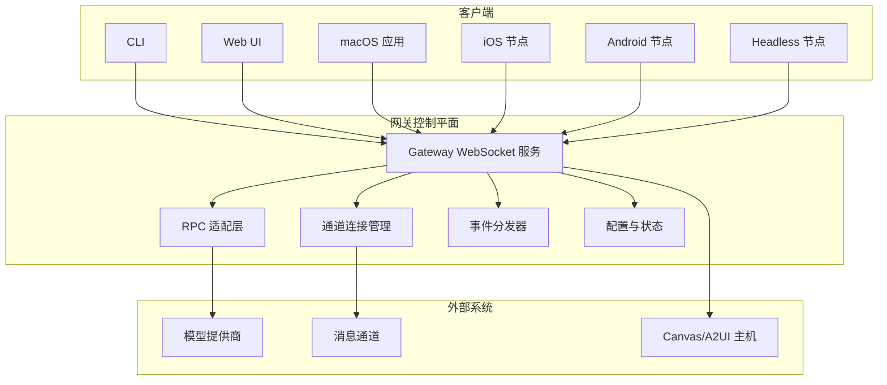
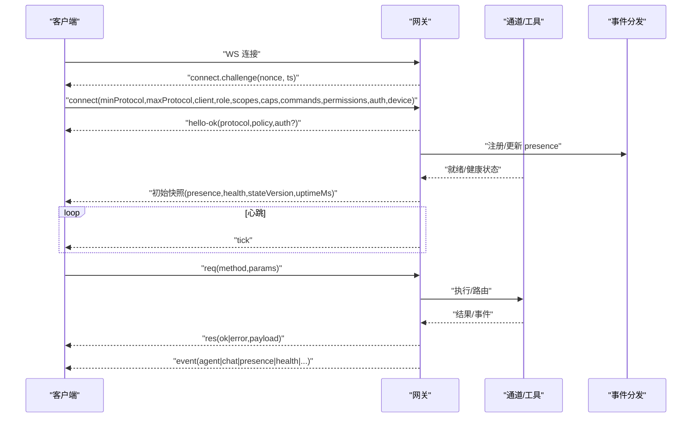
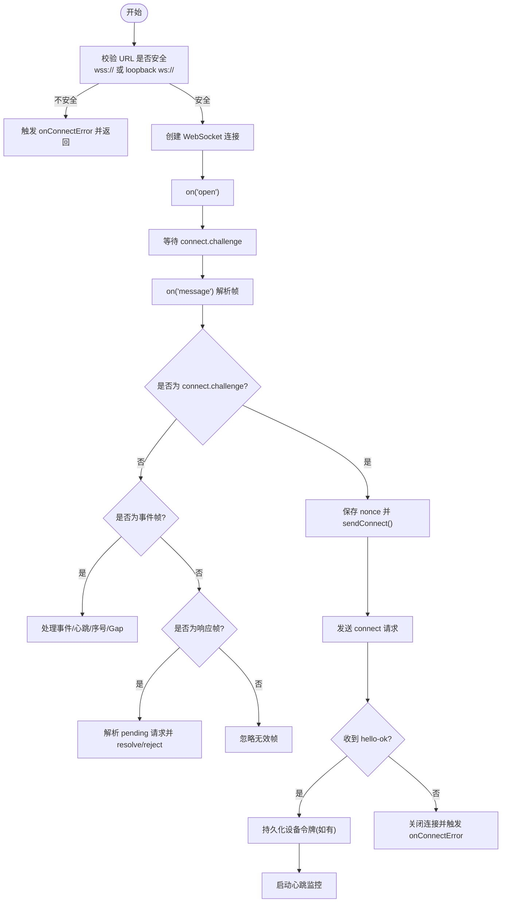
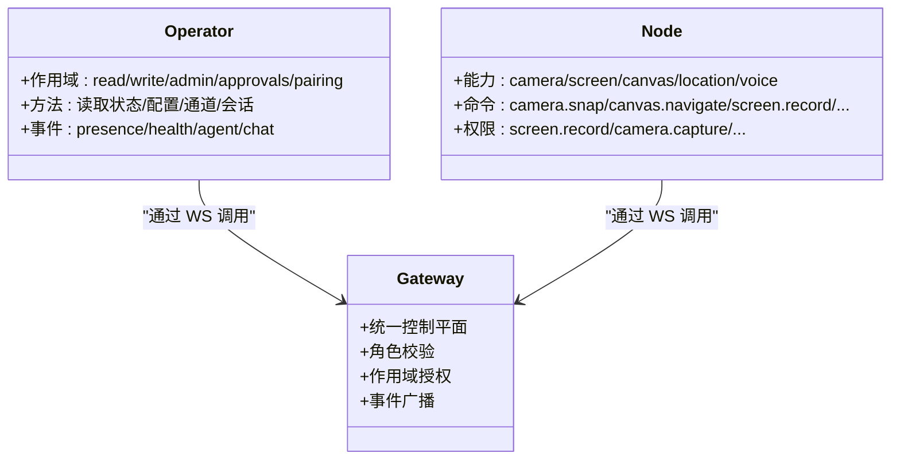
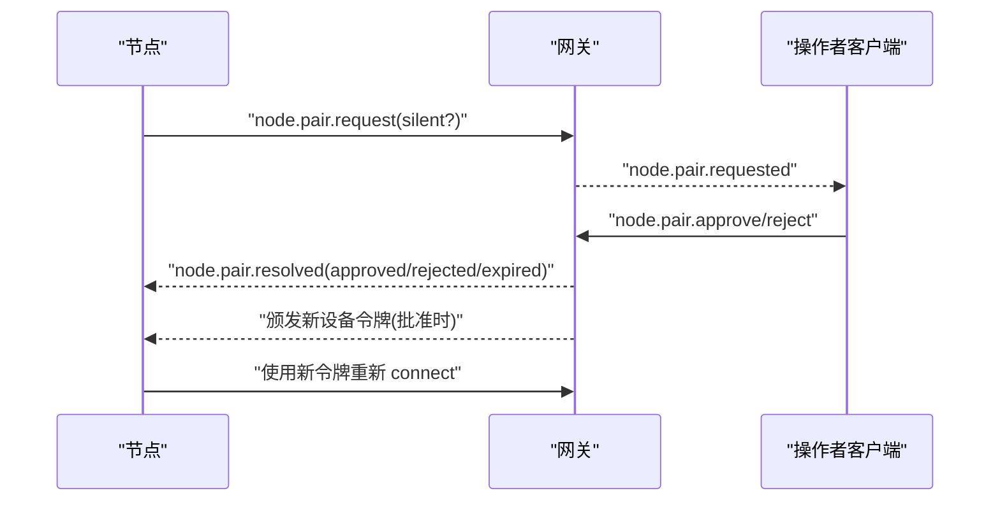
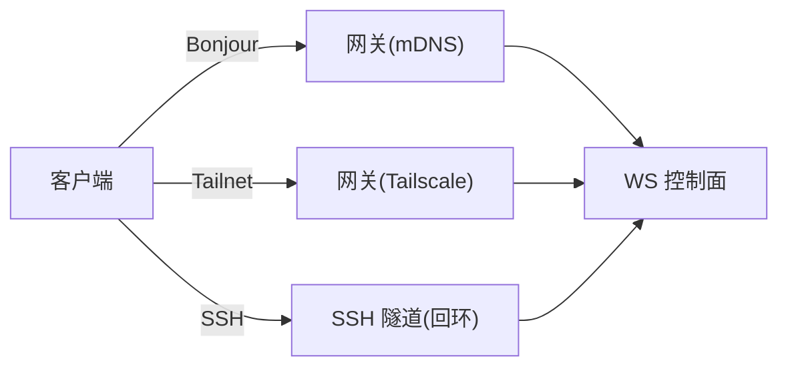
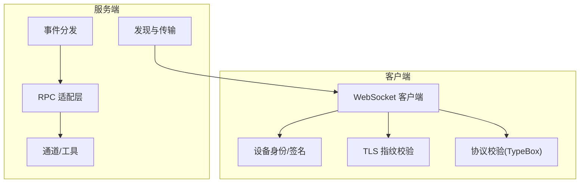

# 网关架构

<cite>
**本文引用的文件**
- [README.md](file://README.md)
- [docs/gateway/index.md](file://docs/gateway/index.md)
- [docs/gateway/protocol.md](file://docs/gateway/protocol.md)
- [docs/gateway/authentication.md](file://docs/gateway/authentication.md)
- [docs/gateway/pairing.md](file://docs/gateway/pairing.md)
- [docs/gateway/discovery.md](file://docs/gateway/discovery.md)
- [docs/gateway/bonjour.md](file://docs/gateway/bonjour.md)
- [src/gateway/client.ts](file://src/gateway/client.ts)
- [src/gateway/server.ts](file://src/gateway/server.ts)
</cite>

## 目录
1. [简介](#简介)
2. [项目结构](#项目结构)
3. [核心组件](#核心组件)
4. [架构总览](#架构总览)
5. [详细组件分析](#详细组件分析)
6. [依赖关系分析](#依赖关系分析)
7. [性能考虑](#性能考虑)
8. [故障排查指南](#故障排查指南)
9. [结论](#结论)
10. [附录](#附录)

## 简介
本文件系统性阐述 OpenClaw 网关（Gateway）的架构设计与实现，聚焦“单网关控制平面”的核心定位：统一承载会话、通道、工具与事件，并通过 WebSocket 提供统一的控制与数据通道。文档覆盖以下主题：
- WebSocket 通信机制与握手流程
- 客户端连接生命周期与重连策略
- 节点角色区分（operator/node）与权限模型
- Canvas 主机服务与能力声明
- 网关组件职责：维护提供商连接、暴露类型化 WS API、验证入站帧、发出事件等
- 控制平面客户端（mac 应用、CLI、Web UI、自动化）与节点（macOS/iOS/Android/headless）的差异化连接方式与安全策略
- 具体的连接序列图与协议细节（握手、身份验证、配对、安全策略）

## 项目结构
OpenClaw 将“网关控制平面”作为核心运行时，所有客户端（CLI、Web UI、mac 应用、iOS/Android 节点、headless 节点）均通过 WebSocket 连接至网关，由网关统一调度会话、通道、工具与事件。

图表来源
- [docs/gateway/index.md:68-93](file://docs/gateway/index.md#L68-L93)
- [docs/gateway/protocol.md:12-16](file://docs/gateway/protocol.md#L12-L16)

章节来源
- [README.md:185-212](file://README.md#L185-L212)
- [docs/gateway/index.md:68-93](file://docs/gateway/index.md#L68-L93)

## 核心组件
- WebSocket 客户端（GatewayClient）
  - 负责建立与网关的 WS 连接、处理握手挑战、发送请求、接收事件与响应、错误处理与重连。
  - 支持设备身份签名、TLS 指纹校验、设备令牌自动重试与恢复策略。
- 网关服务端（GatewayServer）
  - 统一承载控制平面、HTTP API（兼容 OpenAI/Responses）、工具调用、事件广播与健康检查。
  - 默认绑定回环地址，支持通过 Tailscale/SSH 隧道远程访问。
- 协议与模式（Protocol Schema）
  - 定义帧格式（req/res/event）、角色（operator/node）、作用域（scopes）、方法清单与事件集。
  - 通过 TypeBox 生成模型与校验，保证客户端与服务端一致性。
- 发现与传输（Discovery & Transports）
  - Bonjour/mDNS（局域网）、Tailnet（跨网络）、SSH 隧道（通用回退）。
- 配对与鉴权（Pairing & Authentication）
  - 设备身份签名、一次性挑战、设备令牌颁发与轮换、配对审批与 ACL。

章节来源
- [src/gateway/client.ts:109-674](file://src/gateway/client.ts#L109-L674)
- [docs/gateway/protocol.md:17-268](file://docs/gateway/protocol.md#L17-L268)
- [docs/gateway/discovery.md:10-124](file://docs/gateway/discovery.md#L10-L124)
- [docs/gateway/pairing.md:10-100](file://docs/gateway/pairing.md#L10-L100)
- [docs/gateway/authentication.md:9-180](file://docs/gateway/authentication.md#L9-L180)

## 架构总览
网关作为单一控制点，负责：
- 维护提供商连接（模型/工具），统一鉴权与失败转移
- 暴露类型化 WebSocket API（请求/响应/事件）
- 验证入站帧（协议版本、角色、作用域、设备签名）
- 发出系统事件（presence/health/agent/chat/tick/heartbeat/shutdown）
- 管理节点配对与 ACL，转发节点能力声明与命令白名单

图表来源
- [docs/gateway/protocol.md:22-78](file://docs/gateway/protocol.md#L22-L78)
- [docs/gateway/index.md:202-214](file://docs/gateway/index.md#L202-L214)

章节来源
- [docs/gateway/protocol.md:127-134](file://docs/gateway/protocol.md#L127-L134)
- [docs/gateway/index.md:202-214](file://docs/gateway/index.md#L202-L214)

## 详细组件分析

### WebSocket 客户端（GatewayClient）
- 连接建立
  - 仅允许 wss:// 或回环地址的 ws://；非回环的明文 ws:// 会被拒绝，防止中间人窃听凭据与聊天内容。
  - 可选 TLS 指纹校验，避免证书劫持风险。
- 握手与挑战
  - 等待网关下发 connect.challenge，携带随机 nonce 与时间戳。
  - 客户端使用设备身份对挑战进行签名，随 connect 请求一并提交。
- 认证与设备令牌
  - 支持共享令牌/密码或设备令牌；若设备令牌匹配但被网关标记为过期/不一致，将清理本地缓存并暂停自动重连，等待人工干预。
  - 对于可信端点（回环或带指纹的 wss://），在特定错误码下允许一次设备令牌重试。
- 帧处理与事件
  - 校验事件帧与响应帧；记录事件序号，检测断点并触发 gap 回调。
  - 周期性心跳（tick）用于检测静默断开，超时则主动关闭。
- 重连与退避
  - 断线后指数退避，最大不超过 30 秒；遇到认证类错误（如令牌不匹配、速率限制、配对要求）可能暂停重连，直至人工介入。

图表来源
- [src/gateway/client.ts:134-251](file://src/gateway/client.ts#L134-L251)
- [src/gateway/client.ts:267-415](file://src/gateway/client.ts#L267-L415)
- [src/gateway/client.ts:497-554](file://src/gateway/client.ts#L497-L554)
- [src/gateway/client.ts:556-587](file://src/gateway/client.ts#L556-L587)
- [src/gateway/client.ts:596-618](file://src/gateway/client.ts#L596-L618)

章节来源
- [src/gateway/client.ts:109-674](file://src/gateway/client.ts#L109-L674)

### 角色与作用域（operator/node）
- operator（控制面客户端）
  - 来源：CLI、Web UI、macOS 应用、自动化脚本
  - 权限：读/写/管理/审批/配对等作用域，用于控制网关与通道行为
- node（节点）
  - 来源：iOS/Android/headless 节点
  - 能力：相机/屏幕/Canvas/位置/语音等，以 caps/commands/permissions 声明
  - 策略：网关侧进行能力与命令白名单校验，避免越权

图表来源
- [docs/gateway/protocol.md:135-165](file://docs/gateway/protocol.md#L135-L165)

章节来源
- [docs/gateway/protocol.md:135-165](file://docs/gateway/protocol.md#L135-L165)

### 设备身份与配对（Device Identity + Pairing）
- 设备身份
  - 每个节点持有稳定的设备标识（基于密钥指纹），连接时对网关下发的挑战进行签名。
  - 网关颁发设备令牌，按设备+角色维度持久化，支持轮换与撤销。
- 配对流程
  - 节点发起 node.pair.request，网关广播 node.pair.requested。
  - operator 审批/拒绝，批准后网关颁发新令牌并要求节点重新连接。
  - 未决请求 5 分钟后过期；支持静默审批（macOS 应用在特定条件下）。

图表来源
- [docs/gateway/pairing.md:27-71](file://docs/gateway/pairing.md#L27-L71)
- [docs/gateway/protocol.md:216-230](file://docs/gateway/protocol.md#L216-L230)

章节来源
- [docs/gateway/pairing.md:10-100](file://docs/gateway/pairing.md#L10-L100)
- [docs/gateway/protocol.md:216-230](file://docs/gateway/protocol.md#L216-L230)

### 发现与传输（Bonjour/Tailscale/SSH）
- Bonjour/mDNS（局域网）
  - 网关发布 _openclaw-gw._tcp 服务，TXT 提供端口、TLS 指纹、Canvas 端口、SSH 端口等提示。
  - 客户端浏览并选择目标，优先使用 SRV/A/AAAA 解析到的真实地址，而非 TXT 字段。
- Tailnet（跨网络）
  - 在 Tailscale 下可启用“广域 Bonjour”（Unicast DNS-SD），通过 Split DNS 将域名解析到网关主机。
- SSH 隧道（通用回退）
  - 任何有 SSH 的环境均可通过本地端口转发连接到网关回环端口。

图表来源
- [docs/gateway/discovery.md:43-108](file://docs/gateway/discovery.md#L43-L108)
- [docs/gateway/bonjour.md:79-109](file://docs/gateway/bonjour.md#L79-L109)

章节来源
- [docs/gateway/discovery.md:10-124](file://docs/gateway/discovery.md#L10-L124)
- [docs/gateway/bonjour.md:1-178](file://docs/gateway/bonjour.md#L1-178)

### Canvas 主机服务
- 网关可内嵌 Canvas/A2UI 主机，向节点开放渲染与交互能力。
- 节点通过 capabilities/commands 声明能力，网关侧进行白名单校验与权限控制。
- 与浏览器控制、节点本地能力协同，形成统一的可视化工作区。

章节来源
- [README.md:128-133](file://README.md#L128-L133)
- [docs/gateway/protocol.md:156-176](file://docs/gateway/protocol.md#L156-L176)

## 依赖关系分析
- 客户端依赖
  - 设备身份模块：生成/加载设备标识、签名挑战负载
  - TLS 指纹模块：校验远端证书指纹
  - 协议校验模块：TypeBox 生成的帧与参数校验
- 服务端依赖
  - 通道/工具适配层：统一模型提供商与通道连接
  - 事件分发器：聚合系统状态与业务事件
  - 发现模块：Bonjour/Tailscale/SSH 传输路径

图表来源
- [src/gateway/client.ts:1-674](file://src/gateway/client.ts#L1-L674)
- [docs/gateway/protocol.md:191-199](file://docs/gateway/protocol.md#L191-L199)
- [docs/gateway/discovery.md:10-124](file://docs/gateway/discovery.md#L10-L124)

章节来源
- [src/gateway/client.ts:1-674](file://src/gateway/client.ts#L1-L674)
- [docs/gateway/protocol.md:191-199](file://docs/gateway/protocol.md#L191-L199)
- [docs/gateway/discovery.md:10-124](file://docs/gateway/discovery.md#L10-L124)

## 性能考虑
- 心跳与保活
  - 网关周期性发送 tick，客户端检测静默断开并主动关闭，避免资源泄露。
- 负载与缓冲
  - 客户端默认 25MB 最大载荷，满足节点截图/录制等大包场景。
- 重连退避
  - 断线后指数退避，上限 30 秒，降低风暴效应。
- 作用域与白名单
  - 通过 caps/commands/permissions 严格限制节点能力，减少误用与资源占用。

章节来源
- [src/gateway/client.ts:596-618](file://src/gateway/client.ts#L596-L618)
- [src/gateway/client.ts:169-173](file://src/gateway/client.ts#L169-L173)
- [docs/gateway/protocol.md:156-165](file://docs/gateway/protocol.md#L156-L165)

## 故障排查指南
- 常见错误与修复建议
  - “无法绑定网关且未配置认证”：在非回环绑定时必须配置令牌/密码。
  - “端口冲突”：检查 EADDRINUSE，更换端口或停止占用进程。
  - “配置为远程模式”：设置 gateway.mode=local 后重启。
  - “握手失败/超时”：确认已收到 connect.challenge，检查网络与代理。
  - “认证不匹配/速率限制/配对要求”：根据错误详情码暂停自动重连，等待人工处理。
- 诊断命令
  - 网关状态、通道探测、健康检查、日志跟踪、医生检查（doctor）。
- 传输与发现
  - Bonjour/Tailscale/SSH 的可用性与配置核对，确保客户端能解析到真实服务端点。

章节来源
- [docs/gateway/index.md:235-244](file://docs/gateway/index.md#L235-L244)
- [docs/gateway/protocol.md:209-215](file://docs/gateway/protocol.md#L209-L215)

## 结论
OpenClaw 网关以“单网关控制平面”为核心，通过类型化 WebSocket 协议统一承载控制、事件与工具调用，结合严格的设备身份、配对与作用域控制，实现了跨平台客户端与节点的安全接入与高效协作。借助 Bonjour/Tailscale/SSH 多传输路径与心跳/重连等鲁棒机制，网关在复杂网络环境下仍能保持稳定与可观测性。

## 附录

### 协议快速参考（操作者视角）
- 首帧必须为 connect
- 网关返回 hello-ok 快照（presence/health/stateVersion/uptimeMs/策略）
- 请求：req(method, params) → res(ok/payload|error)
- 常见事件：connect.challenge、agent、chat、presence、tick、health、heartbeat、shutdown

章节来源
- [docs/gateway/index.md:202-214](file://docs/gateway/index.md#L202-L214)