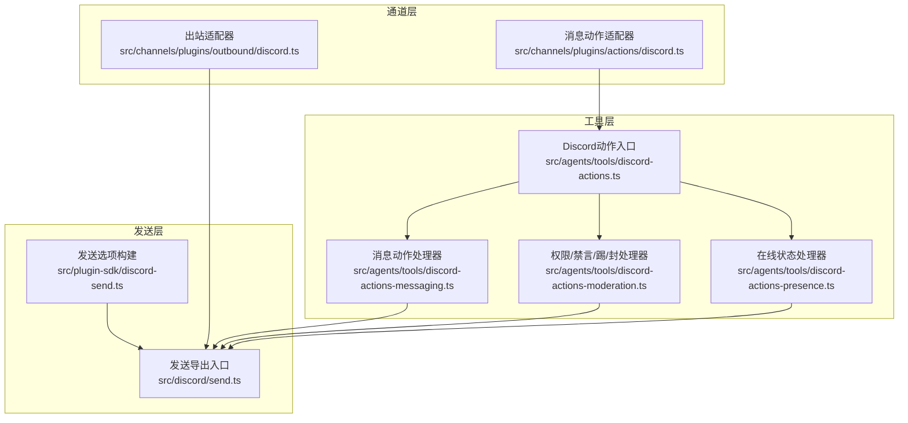
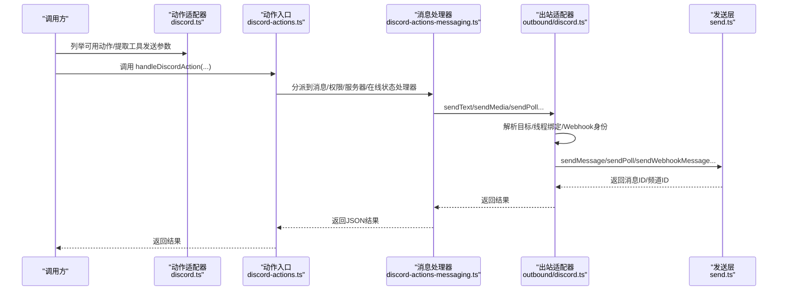
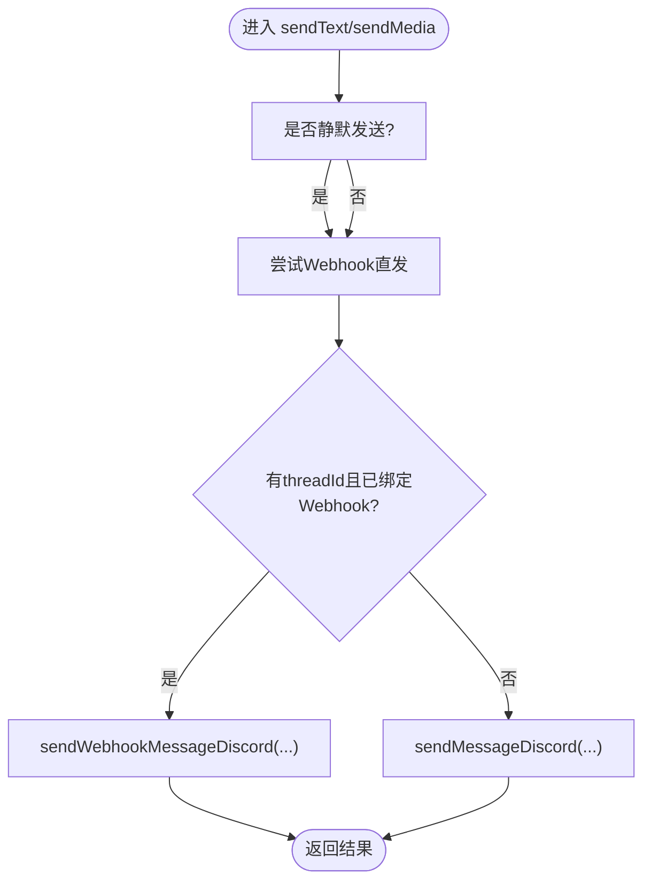
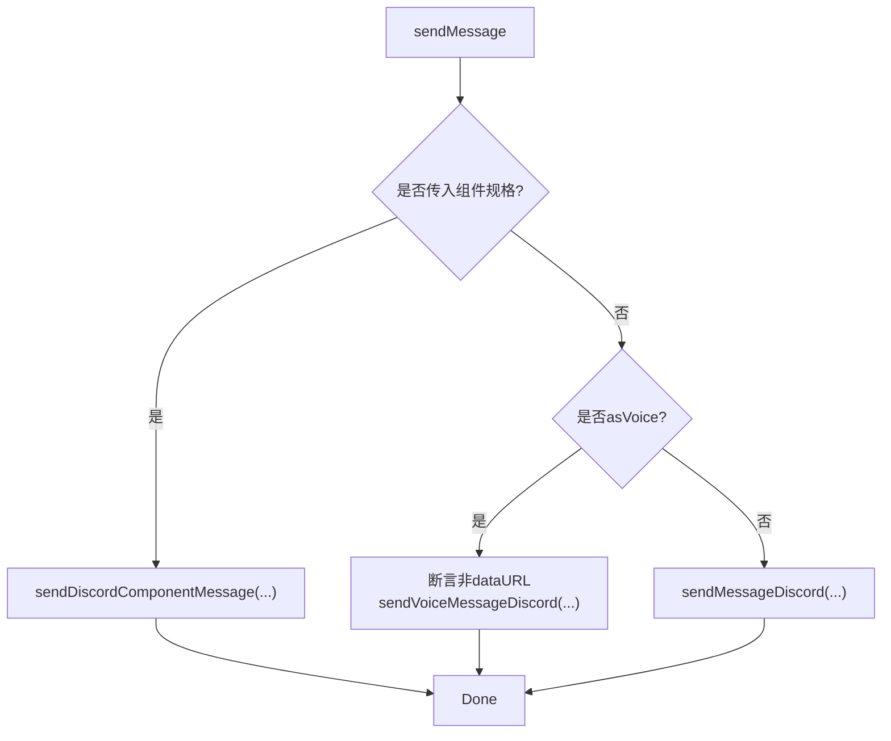
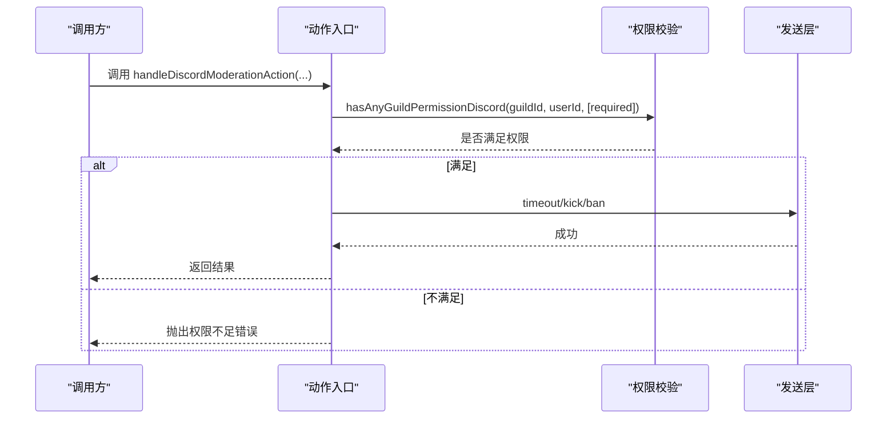
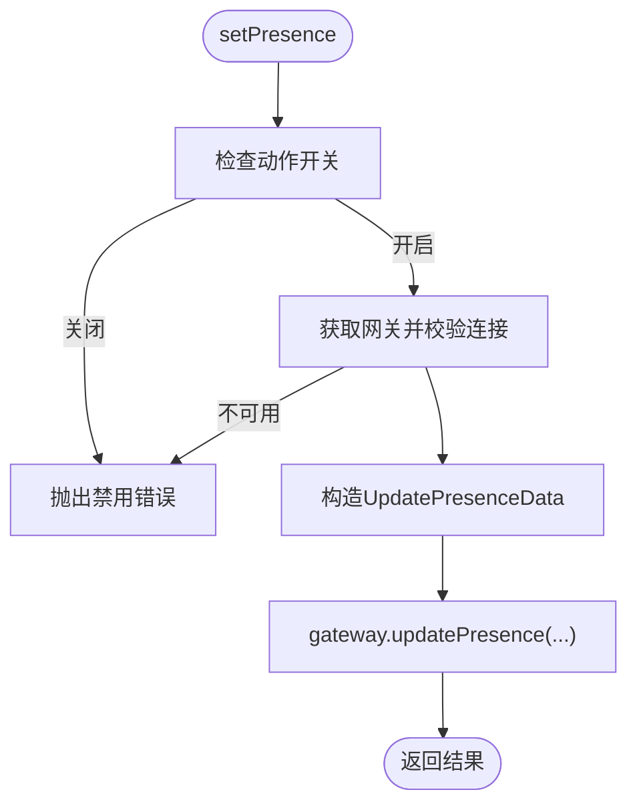
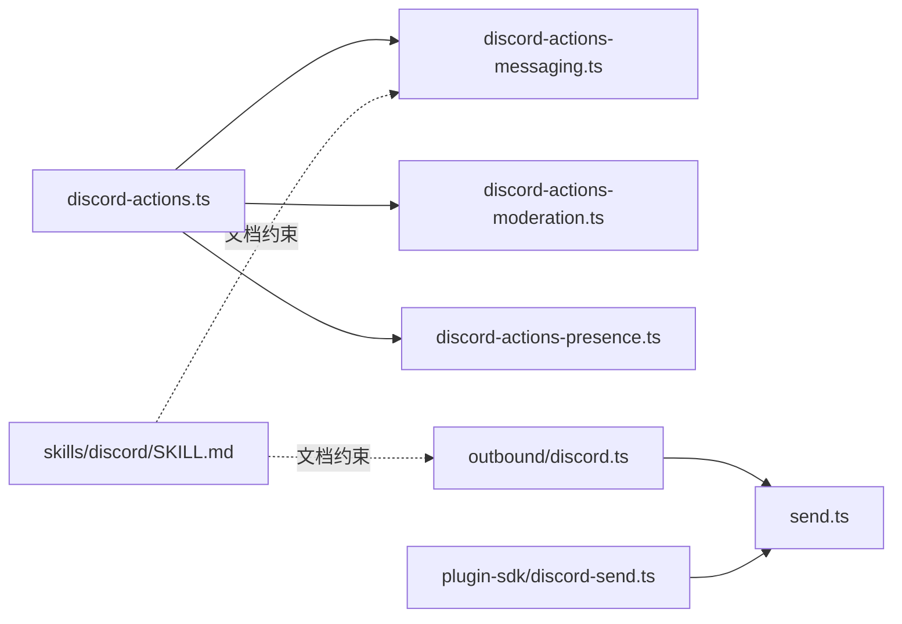

# Discord集成

<cite>
**本文引用的文件**
- [skills/discord/SKILL.md](file://skills/discord/SKILL.md)
- [src/channels/plugins/outbound/discord.ts](file://src/channels/plugins/outbound/discord.ts)
- [src/channels/plugins/actions/discord.ts](file://src/channels/plugins/actions/discord.ts)
- [src/agents/tools/discord-actions.ts](file://src/agents/tools/discord-actions.ts)
- [src/agents/tools/discord-actions-messaging.ts](file://src/agents/tools/discord-actions-messaging.ts)
- [src/agents/tools/discord-actions-moderation.ts](file://src/agents/tools/discord-actions-moderation.ts)
- [src/agents/tools/discord-actions-presence.ts](file://src/agents/tools/discord-actions-presence.ts)
- [src/discord/send.ts](file://src/discord/send.ts)
- [src/plugin-sdk/discord-send.ts](file://src/plugin-sdk/discord-send.ts)
- [src/config/discord-preview-streaming.ts](file://src/config/discord-preview-streaming.ts)
</cite>

## 目录
1. [简介](#简介)
2. [项目结构](#项目结构)
3. [核心组件](#核心组件)
4. [架构总览](#架构总览)
5. [详细组件分析](#详细组件分析)
6. [依赖关系分析](#依赖关系分析)
7. [性能考虑](#性能考虑)
8. [故障排查指南](#故障排查指南)
9. [结论](#结论)
10. [附录](#附录)

## 简介
本文件面向在OpenClaw中集成Discord渠道的开发者与运维人员，系统性阐述如何通过Bot API进行消息发送、频道管理、权限查询、服务器监控、线程与投票等能力；同时覆盖动作门控（Action Gate）、OAuth2与邀请链路、速率限制与错误处理、以及组件化UI（按钮、下拉、模态）的开发实践。文档以仓库现有实现为依据，避免臆造信息，所有技术细节均来自源码。

## 项目结构
OpenClaw围绕“通道插件 + 动作适配器 + 工具层 + 发送层”的分层组织Discord集成：
- 通道插件：负责入站/出站消息的路由与适配（如outbound、actions）
- 动作工具：将上层意图映射为具体Discord API调用（消息、权限、服务器、权限变更、在线状态）
- 发送层：封装对Discord Bot API的调用，统一错误类型与返回结构
- 配置与SDK：提供预览流模式解析、发送选项构建等辅助能力

图表来源
- [src/channels/plugins/outbound/discord.ts:81-147](file://src/channels/plugins/outbound/discord.ts#L81-L147)
- [src/channels/plugins/actions/discord.ts:7-134](file://src/channels/plugins/actions/discord.ts#L7-L134)
- [src/agents/tools/discord-actions.ts:58-82](file://src/agents/tools/discord-actions.ts#L58-L82)
- [src/agents/tools/discord-actions-messaging.ts:59-529](file://src/agents/tools/discord-actions-messaging.ts#L59-L529)
- [src/agents/tools/discord-actions-moderation.ts:37-120](file://src/agents/tools/discord-actions-moderation.ts#L37-L120)
- [src/agents/tools/discord-actions-presence.ts:18-111](file://src/agents/tools/discord-actions-presence.ts#L18-L111)
- [src/discord/send.ts:1-82](file://src/discord/send.ts#L1-L82)
- [src/plugin-sdk/discord-send.ts:14-33](file://src/plugin-sdk/discord-send.ts#L14-L33)

章节来源
- [src/channels/plugins/outbound/discord.ts:1-148](file://src/channels/plugins/outbound/discord.ts#L1-L148)
- [src/channels/plugins/actions/discord.ts:1-135](file://src/channels/plugins/actions/discord.ts#L1-L135)
- [src/agents/tools/discord-actions.ts:1-83](file://src/agents/tools/discord-actions.ts#L1-L83)
- [src/agents/tools/discord-actions-messaging.ts:1-530](file://src/agents/tools/discord-actions-messaging.ts#L1-L530)
- [src/agents/tools/discord-actions-moderation.ts:1-121](file://src/agents/tools/discord-actions-moderation.ts#L1-L121)
- [src/agents/tools/discord-actions-presence.ts:1-112](file://src/agents/tools/discord-actions-presence.ts#L1-L112)
- [src/discord/send.ts:1-82](file://src/discord/send.ts#L1-L82)
- [src/plugin-sdk/discord-send.ts:1-34](file://src/plugin-sdk/discord-send.ts#L1-L34)

## 核心组件
- 出站适配器：负责将通用消息载荷转换为Discord可执行的发送动作，支持文本、媒体、投票、线程回复、静默通知、Webhook直发等
- 消息动作处理器：实现react/reactions/sticker/poll/permissions/fetchMessage/readMessages/sendMessage/editMessage/deleteMessage/thread*/*pin*/listPins/searchMessages等
- 权限/禁言/踢/封处理器：基于权限校验后执行timeout/kick/ban
- 在线状态处理器：通过网关更新机器人的在线状态与活动
- 发送导出入口：统一导出各类发送函数、权限查询、反应操作、组件消息等
- 发送选项构建：标准化构建发送参数（回复、静默、媒体、账号选择）

章节来源
- [src/channels/plugins/outbound/discord.ts:81-147](file://src/channels/plugins/outbound/discord.ts#L81-L147)
- [src/agents/tools/discord-actions-messaging.ts:59-529](file://src/agents/tools/discord-actions-messaging.ts#L59-L529)
- [src/agents/tools/discord-actions-moderation.ts:37-120](file://src/agents/tools/discord-actions-moderation.ts#L37-L120)
- [src/agents/tools/discord-actions-presence.ts:18-111](file://src/agents/tools/discord-actions-presence.ts#L18-L111)
- [src/discord/send.ts:1-82](file://src/discord/send.ts#L1-L82)
- [src/plugin-sdk/discord-send.ts:14-33](file://src/plugin-sdk/discord-send.ts#L14-L33)

## 架构总览
下图展示从“动作入口”到“Discord API”的调用路径，以及Webhook直发与线程绑定的关系。

图表来源
- [src/channels/plugins/actions/discord.ts:115-133](file://src/channels/plugins/actions/discord.ts#L115-L133)
- [src/agents/tools/discord-actions.ts:58-82](file://src/agents/tools/discord-actions.ts#L58-L82)
- [src/agents/tools/discord-actions-messaging.ts:239-328](file://src/agents/tools/discord-actions-messaging.ts#L239-L328)
- [src/channels/plugins/outbound/discord.ts:87-113](file://src/channels/plugins/outbound/discord.ts#L87-L113)
- [src/discord/send.ts:41-46](file://src/discord/send.ts#L41-L46)

## 详细组件分析

### 出站适配器（Outbound Adapter）
职责
- 将通用消息载荷转换为Discord发送动作
- 支持线程目标解析、Webhook直发、静默通知、媒体上传
- 统一文本块大小与投票选项上限

关键点
- 目标解析：当存在threadId时，自动将目标转为thread通道
- Webhook直发：若线程绑定了webhook凭据，则优先使用webhook发送，以保留身份信息
- 发送选项：支持replyTo、silent、mediaUrl、mediaLocalRoots、accountId等

图表来源
- [src/channels/plugins/outbound/discord.ts:89-113](file://src/channels/plugins/outbound/discord.ts#L89-L113)
- [src/channels/plugins/outbound/discord.ts:41-79](file://src/channels/plugins/outbound/discord.ts#L41-L79)

章节来源
- [src/channels/plugins/outbound/discord.ts:1-148](file://src/channels/plugins/outbound/discord.ts#L1-L148)

### 消息动作处理器（Messaging Actions）
能力矩阵
- 反应类：react/reactions（添加/移除/清空自己的反应）
- 表情包：sticker（发送表情包）
- 投票：poll（问题、选项、多选、时长）
- 权限：permissions（查询频道权限）
- 消息：fetchMessage/readMessages/sendMessage/editMessage/deleteMessage
- 线程：threadCreate/threadList/threadReply
- 固定：pinMessage/unpinMessage/listPins
- 搜索：searchMessages（按内容/作者/频道聚合）

要点
- 组件消息：支持Carbon组件v2，禁止与embeds混用
- 语音消息：要求媒体文件引用，禁止文本内容
- 消息链接解析：支持标准/测试/不稳定域名的消息链接解析
- 时间戳归一化：返回消息体中的时间字段规范化

图表来源
- [src/agents/tools/discord-actions-messaging.ts:239-328](file://src/agents/tools/discord-actions-messaging.ts#L239-L328)

章节来源
- [src/agents/tools/discord-actions-messaging.ts:1-530](file://src/agents/tools/discord-actions-messaging.ts#L1-L530)

### 权限/禁言/踢/封处理器（Moderation Actions）
流程
- 校验动作开关与权限门控
- 对于CLI/手动场景，若无发送者上下文则跳过权限校验
- 执行timeout/kick/ban，必要时携带原因与删除消息天数

图表来源
- [src/agents/tools/discord-actions-moderation.ts:16-35](file://src/agents/tools/discord-actions-moderation.ts#L16-L35)
- [src/agents/tools/discord-actions-moderation.ts:57-118](file://src/agents/tools/discord-actions-moderation.ts#L57-L118)

章节来源
- [src/agents/tools/discord-actions-moderation.ts:1-121](file://src/agents/tools/discord-actions-moderation.ts#L1-L121)

### 在线状态处理器（Presence）
能力
- 通过网关更新机器人的在线状态与活动类型
- 支持多种活动类型与状态枚举校验
- 若网关未连接或不可用，抛出明确错误

图表来源
- [src/agents/tools/discord-actions-presence.ts:18-42](file://src/agents/tools/discord-actions-presence.ts#L18-L42)
- [src/agents/tools/discord-actions-presence.ts:92-99](file://src/agents/tools/discord-actions-presence.ts#L92-L99)

章节来源
- [src/agents/tools/discord-actions-presence.ts:1-112](file://src/agents/tools/discord-actions-presence.ts#L1-L112)

### 发送层与SDK
- 发送导出入口：统一导出消息、频道、权限、反应、组件、投票等发送函数
- 发送选项构建：标准化构建发送参数（replyTo、silent、mediaUrl、mediaLocalRoots、accountId），并标记通道类型

章节来源
- [src/discord/send.ts:1-82](file://src/discord/send.ts#L1-L82)
- [src/plugin-sdk/discord-send.ts:14-33](file://src/plugin-sdk/discord-send.ts#L14-L33)

### 动作适配器（ChannelMessageActions）
- 动态列举可用动作：根据各账户的动作门控联合判断，启用任一账户的动作即暴露该动作
- 提取工具发送参数：支持从sendMessage/threadReply等动作中提取目标
- 统一处理入口：转发到消息动作处理器

章节来源
- [src/channels/plugins/actions/discord.ts:7-134](file://src/channels/plugins/actions/discord.ts#L7-L134)

### 技能文档（Skill）
- 使用message工具，不直接暴露专用discord工具
- 必须指定channel=discord，建议显式使用guildId/channelId/messageId/userId
- 推荐使用组件v2（components）而非embeds；避免Markdown表格
- 支持发送、媒体、反应、读取、编辑、删除、投票、固定、线程、搜索、在线状态等

章节来源
- [skills/discord/SKILL.md:1-198](file://skills/discord/SKILL.md#L1-L198)

## 依赖关系分析
- 动作入口依赖动作处理器模块，分别处理消息、权限、服务器、在线状态
- 出站适配器依赖发送层与线程绑定管理器，优先使用Webhook直发
- 发送层统一导出各类API函数，供工具层调用
- 预览流模式解析用于兼容历史配置项，影响消息预览/草稿流行为

图表来源
- [src/agents/tools/discord-actions.ts:58-82](file://src/agents/tools/discord-actions.ts#L58-L82)
- [src/agents/tools/discord-actions-messaging.ts:59-529](file://src/agents/tools/discord-actions-messaging.ts#L59-L529)
- [src/agents/tools/discord-actions-moderation.ts:37-120](file://src/agents/tools/discord-actions-moderation.ts#L37-L120)
- [src/agents/tools/discord-actions-presence.ts:18-111](file://src/agents/tools/discord-actions-presence.ts#L18-L111)
- [src/channels/plugins/outbound/discord.ts:81-147](file://src/channels/plugins/outbound/discord.ts#L81-L147)
- [src/discord/send.ts:1-82](file://src/discord/send.ts#L1-L82)
- [src/plugin-sdk/discord-send.ts:14-33](file://src/plugin-sdk/discord-send.ts#L14-L33)
- [skills/discord/SKILL.md:1-198](file://skills/discord/SKILL.md#L1-L198)

章节来源
- [src/agents/tools/discord-actions.ts:1-83](file://src/agents/tools/discord-actions.ts#L1-L83)
- [src/channels/plugins/outbound/discord.ts:1-148](file://src/channels/plugins/outbound/discord.ts#L1-L148)
- [src/discord/send.ts:1-82](file://src/discord/send.ts#L1-L82)
- [src/plugin-sdk/discord-send.ts:1-34](file://src/plugin-sdk/discord-send.ts#L1-L34)
- [skills/discord/SKILL.md:1-198](file://skills/discord/SKILL.md#L1-L198)

## 性能考虑
- 文本块大小与投票选项上限：出站适配器定义了文本块上限与投票最大选项数，避免单次请求过大导致失败
- Webhook直发：在具备线程绑定且拥有webhook凭据时优先直发，减少Bot权限依赖并保留身份信息
- 媒体上传：通过本地根目录白名单控制，避免任意路径访问
- 静默通知：在需要抑制通知时使用静默发送，降低频道噪音
- 线程批量操作：线程列表与搜索支持分页与过滤，避免一次性拉取过多数据

章节来源
- [src/channels/plugins/outbound/discord.ts:82-85](file://src/channels/plugins/outbound/discord.ts#L82-L85)
- [src/channels/plugins/outbound/discord.ts:41-79](file://src/channels/plugins/outbound/discord.ts#L41-L79)
- [src/agents/tools/discord-actions-messaging.ts:296-316](file://src/agents/tools/discord-actions-messaging.ts#L296-L316)

## 故障排查指南
常见问题与定位
- 动作被禁用：检查对应动作门控（如reactions/messages/polls/pins/threads/search/stickers/roles/channels/moderation/presence）是否开启
- 权限不足：执行禁言/踢/封前需确保调用者具备相应服务器权限
- 网关未连接：在线状态更新需确保网关已连接
- 消息链接格式错误：sendMessage中使用消息链接时需符合标准格式
- 组件与嵌板冲突：组件v2与embeds不可同时使用
- 语音消息限制：语音消息不允许包含文本内容，且媒体引用不能为dataURL

章节来源
- [src/agents/tools/discord-actions-messaging.ts:42-57](file://src/agents/tools/discord-actions-messaging.ts#L42-L57)
- [src/agents/tools/discord-actions-messaging.ts:272-278](file://src/agents/tools/discord-actions-messaging.ts#L272-L278)
- [src/agents/tools/discord-actions-messaging.ts:297-307](file://src/agents/tools/discord-actions-messaging.ts#L297-L307)
- [src/agents/tools/discord-actions-presence.ts:32-42](file://src/agents/tools/discord-actions-presence.ts#L32-L42)
- [src/agents/tools/discord-actions-moderation.ts:16-35](file://src/agents/tools/discord-actions-moderation.ts#L16-L35)

## 结论
OpenClaw的Discord集成采用“通道插件 + 动作适配器 + 工具层 + 发送层”的清晰分层设计，既保证了对Bot API的统一抽象，又提供了丰富的消息、权限、服务器与在线状态能力。通过动作门控与权限校验，系统在安全性与灵活性之间取得平衡；通过Webhook直发与组件化UI，进一步提升用户体验与扩展性。

## 附录

### 机器人设置与OAuth2配置
- 机器人设置：在Discord开发者门户创建应用与Bot，获取Bot Token
- OAuth2与邀请：通过Bot的client_id生成邀请链接，授予所需权限
- 多账户支持：通过accountId区分不同Bot账号，配合动作门控与权限校验

说明：本节为通用实践指引，具体实现请参考项目中对Bot Token的使用与动作门控逻辑。

### 邀请链接生成指南
- 使用Bot的client_id与权限范围生成邀请URL
- 建议最小权限原则，仅授予必要权限
- 邀请链接应与项目中的动作门控配置相匹配

### 服务器监控、频道管理与用户权限
- 服务器监控：通过在线状态与活动类型更新，结合网关连接状态进行健康检查
- 频道管理：支持频道创建、编辑、移动、权限设置与删除
- 用户权限：支持查询成员权限、执行禁言/踢/封等操作

章节来源
- [src/agents/tools/discord-actions-presence.ts:18-111](file://src/agents/tools/discord-actions-presence.ts#L18-L111)
- [src/discord/send.ts:2-8](file://src/discord/send.ts#L2-L8)
- [src/discord/send.ts:48-53](file://src/discord/send.ts#L48-L53)

### 角色系统与频道权限
- 角色增删：支持为成员添加/移除角色
- 频道权限：支持设置/移除频道权限位，查询成员在频道中的权限

章节来源
- [src/discord/send.ts:14-27](file://src/discord/send.ts#L14-L27)
- [src/discord/send.ts:48-53](file://src/discord/send.ts#L48-L53)

### 消息组件、交互式按钮、下拉菜单与模态框
- 组件v2：推荐使用组件v2（容器、文本、按钮等）构建富交互UI
- 与嵌板分离：组件v2与embeds不可同时使用
- 语音消息：组件v2不支持语音消息

章节来源
- [skills/discord/SKILL.md:58-86](file://skills/discord/SKILL.md#L58-L86)
- [src/agents/tools/discord-actions-messaging.ts:272-278](file://src/agents/tools/discord-actions-messaging.ts#L272-L278)

### 速率限制、错误处理与性能优化
- 速率限制：遵循Discord API速率限制，合理拆分请求与退避重试
- 错误处理：统一的发送错误类型与明确的错误提示
- 性能优化：使用Webhook直发、组件v2、静默通知、媒体白名单与分页查询

章节来源
- [src/plugin-sdk/discord-send.ts:14-33](file://src/plugin-sdk/discord-send.ts#L14-L33)
- [src/channels/plugins/outbound/discord.ts:82-85](file://src/channels/plugins/outbound/discord.ts#L82-L85)

### 预览流模式与兼容迁移
- 支持streaming与历史streamMode的解析与映射
- 提供布尔值到新枚举的迁移提示

章节来源
- [src/config/discord-preview-streaming.ts:1-159](file://src/config/discord-preview-streaming.ts#L1-L159)