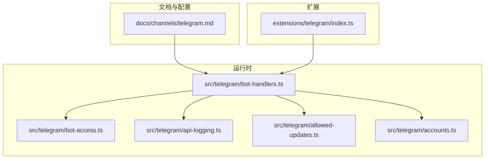
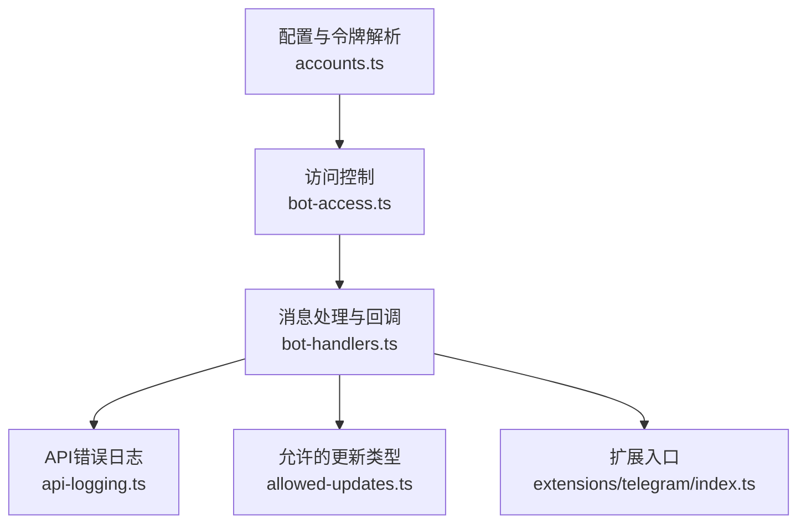
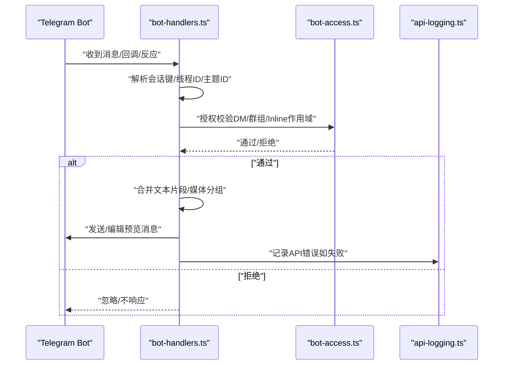
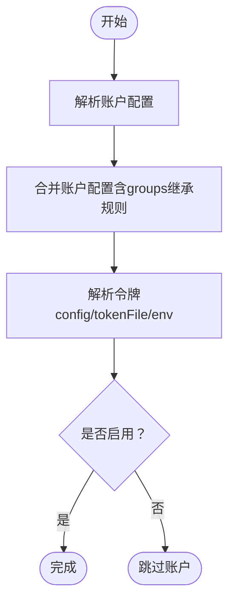
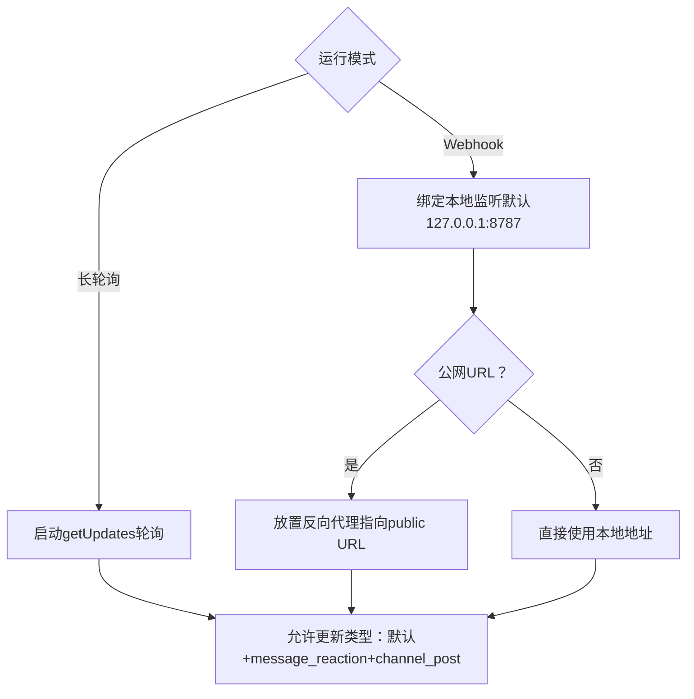
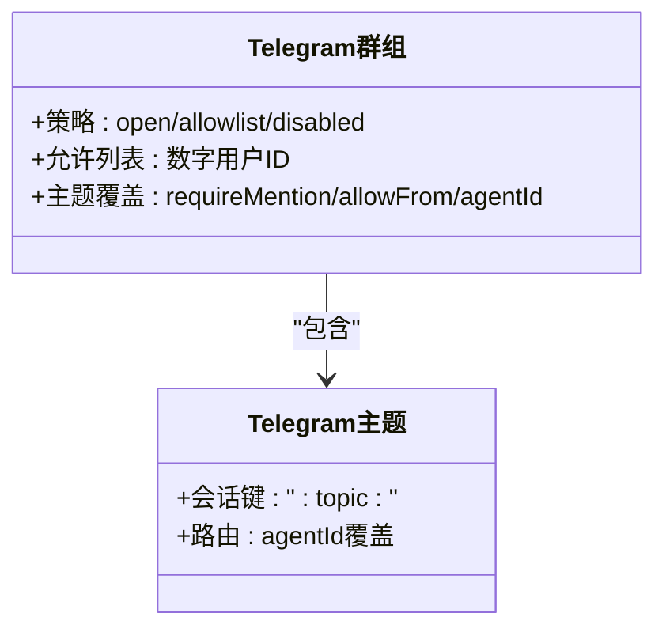
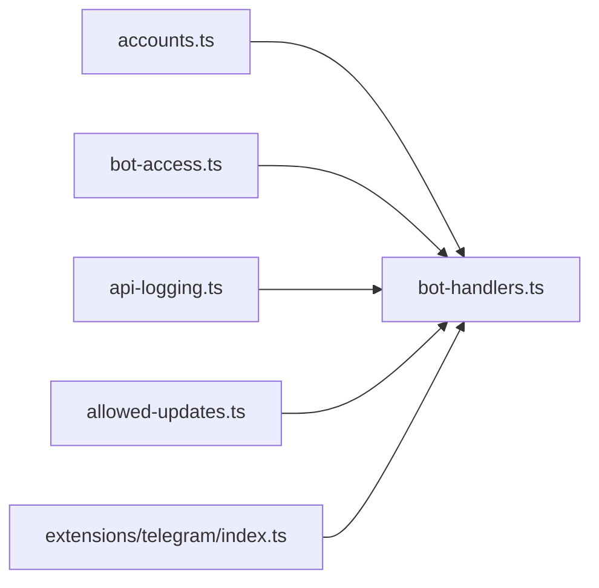

# Telegram集成

<cite>
**本文档引用的文件**
- [docs/channels/telegram.md](file://docs/channels/telegram.md)
- [src/telegram/bot-handlers.ts](file://src/telegram/bot-handlers.ts)
- [src/telegram/bot-access.ts](file://src/telegram/bot-access.ts)
- [src/telegram/api-logging.ts](file://src/telegram/api-logging.ts)
- [src/telegram/allowed-updates.ts](file://src/telegram/allowed-updates.ts)
- [src/telegram/accounts.ts](file://src/telegram/accounts.ts)
- [extensions/telegram/index.ts](file://extensions/telegram/index.ts)
</cite>

## 目录
1. [简介](#简介)
2. [项目结构](#项目结构)
3. [核心组件](#核心组件)
4. [架构总览](#架构总览)
5. [详细组件分析](#详细组件分析)
6. [依赖关系分析](#依赖关系分析)
7. [性能考虑](#性能考虑)
8. [故障排除指南](#故障排除指南)
9. [结论](#结论)
10. [附录](#附录)

## 简介
本文件面向需要在OpenClaw中集成Telegram渠道（Bot API）的开发者，系统性介绍以下内容：
- Bot API使用与grammY框架集成
- 消息处理流程、键盘交互与回调
- 令牌配置、Webhook设置与长期运行模式
- 群组管理、频道订阅、Inline查询与支付能力
- 媒体文件处理（图片、视频、语音、动画GIF）、视频转文字等技术细节
- 扩展开发指南：如何基于现有通道框架扩展Telegram功能

该集成已生产可用，支持私聊与群组，长轮询为默认模式，Webhook为可选。

**章节来源**
- [docs/channels/telegram.md:10](file://docs/channels/telegram.md#L10)

## 项目结构
OpenClaw的Telegram集成由“文档规范”“运行时处理器”“访问控制”“账户与令牌解析”“扩展入口”等模块组成。核心文件分布如下：
- 文档与配置参考：docs/channels/telegram.md
- 运行时处理器：src/telegram/bot-handlers.ts
- 访问控制与授权：src/telegram/bot-access.ts
- API错误日志封装：src/telegram/api-logging.ts
- 允许的更新类型：src/telegram/allowed-updates.ts
- 账户与令牌解析：src/telegram/accounts.ts
- 扩展入口：extensions/telegram/index.ts

**图表来源**
- [docs/channels/telegram.md:1-20](file://docs/channels/telegram.md#L1-L20)
- [src/telegram/bot-handlers.ts:1-50](file://src/telegram/bot-handlers.ts#L1-L50)
- [src/telegram/bot-access.ts:1-30](file://src/telegram/bot-access.ts#L1-L30)
- [src/telegram/api-logging.ts:1-20](file://src/telegram/api-logging.ts#L1-L20)
- [src/telegram/allowed-updates.ts:1-15](file://src/telegram/allowed-updates.ts#L1-L15)
- [src/telegram/accounts.ts:1-40](file://src/telegram/accounts.ts#L1-L40)
- [extensions/telegram/index.ts:1-20](file://extensions/telegram/index.ts#L1-L20)

**章节来源**
- [docs/channels/telegram.md:1-20](file://docs/channels/telegram.md#L1-L20)
- [src/telegram/bot-handlers.ts:1-50](file://src/telegram/bot-handlers.ts#L1-L50)
- [src/telegram/bot-access.ts:1-30](file://src/telegram/bot-access.ts#L1-L30)
- [src/telegram/api-logging.ts:1-20](file://src/telegram/api-logging.ts#L1-L20)
- [src/telegram/allowed-updates.ts:1-15](file://src/telegram/allowed-updates.ts#L1-L15)
- [src/telegram/accounts.ts:1-40](file://src/telegram/accounts.ts#L1-L40)
- [extensions/telegram/index.ts:1-20](file://extensions/telegram/index.ts#L1-L20)

## 核心组件
- 配置与令牌解析：负责从配置或环境变量解析Bot令牌，支持多账户与默认账户选择。
- 访问控制：对DM与群组发送者进行策略化授权，支持白名单、开放、配对等多种策略。
- 更新处理：统一处理消息、反应、回调、媒体分组、文本片段合并等事件。
- API日志：封装Telegram API调用失败的日志输出，便于排障。
- 允许更新类型：确保反应、频道文章等更新类型被监听。

**章节来源**
- [src/telegram/accounts.ts:100-209](file://src/telegram/accounts.ts#L100-L209)
- [src/telegram/bot-access.ts:42-95](file://src/telegram/bot-access.ts#L42-L95)
- [src/telegram/bot-handlers.ts:121-400](file://src/telegram/bot-handlers.ts#L121-L400)
- [src/telegram/api-logging.ts:28-46](file://src/telegram/api-logging.ts#L28-L46)
- [src/telegram/allowed-updates.ts:5-14](file://src/telegram/allowed-updates.ts#L5-L14)

## 架构总览
下图展示Telegram集成的整体架构：从配置与令牌解析开始，到访问控制与消息处理，再到API调用与日志记录。

**图表来源**
- [src/telegram/accounts.ts:166-209](file://src/telegram/accounts.ts#L166-L209)
- [src/telegram/bot-access.ts:42-95](file://src/telegram/bot-access.ts#L42-L95)
- [src/telegram/bot-handlers.ts:121-200](file://src/telegram/bot-handlers.ts#L121-L200)
- [src/telegram/api-logging.ts:28-46](file://src/telegram/api-logging.ts#L28-L46)
- [src/telegram/allowed-updates.ts:5-14](file://src/telegram/allowed-updates.ts#L5-L14)
- [extensions/telegram/index.ts:1-20](file://extensions/telegram/index.ts#L1-L20)

## 详细组件分析

### 组件A：消息处理与键盘交互
- 处理流程
  - 解析会话状态（群组/论坛主题/私聊线程）
  - 合并文本片段与媒体分组，提升吞吐与一致性
  - 授权校验（DM策略、群组策略、Inline按钮作用域）
  - 发送预览流式回复（编辑已有消息），复杂媒体回退为最终交付并清理预览
  - 反应通知与ACK反应
- 键盘与回调
  - 支持Inline按钮作用域配置（关闭、仅DM、群组、全部、白名单）
  - 回调数据以文本形式传递给代理（callback_data）

**图表来源**
- [src/telegram/bot-handlers.ts:293-362](file://src/telegram/bot-handlers.ts#L293-L362)
- [src/telegram/bot-handlers.ts:745-800](file://src/telegram/bot-handlers.ts#L745-L800)
- [src/telegram/bot-access.ts:42-95](file://src/telegram/bot-access.ts#L42-L95)
- [src/telegram/api-logging.ts:28-46](file://src/telegram/api-logging.ts#L28-L46)

**章节来源**
- [src/telegram/bot-handlers.ts:121-400](file://src/telegram/bot-handlers.ts#L121-L400)
- [src/telegram/bot-handlers.ts:400-800](file://src/telegram/bot-handlers.ts#L400-L800)
- [src/telegram/bot-access.ts:42-95](file://src/telegram/bot-access.ts#L42-L95)

### 组件B：令牌配置与多账户
- 令牌来源优先级：账户级配置 > 环境变量（默认账户）> 文件读取（拒绝符号链接）
- 多账户继承规则：账户未覆盖groups时不继承通道级groups，避免跨账户消息投递失败
- 默认账户选择：若未显式设置，默认使用第一个账户或“default”，否则发出警告

**图表来源**
- [src/telegram/accounts.ts:108-135](file://src/telegram/accounts.ts#L108-L135)
- [src/telegram/accounts.ts:166-209](file://src/telegram/accounts.ts#L166-L209)

**章节来源**
- [src/telegram/accounts.ts:100-209](file://src/telegram/accounts.ts#L100-L209)

### 组件C：Webhook与长期运行模式
- 长轮询：默认模式，适合大多数部署场景
- Webhook：需配置webhookUrl、webhookSecret、可选路径/主机/端口；公网URL需反向代理
- 允许更新类型：自动包含message_reaction与channel_post

**图表来源**
- [docs/channels/telegram.md:731-747](file://docs/channels/telegram.md#L731-L747)
- [src/telegram/allowed-updates.ts:5-14](file://src/telegram/allowed-updates.ts#L5-L14)

**章节来源**
- [docs/channels/telegram.md:731-747](file://docs/channels/telegram.md#L731-L747)
- [src/telegram/allowed-updates.ts:5-14](file://src/telegram/allowed-updates.ts#L5-L14)

### 组件D：群组管理与频道订阅
- 群组策略：open/allowlist/disabled；允许用户ID白名单；支持按群组与主题覆盖
- 频道订阅：通过channel_post更新类型接收频道文章
- 主题路由：论坛主题ID附加到会话键，保持隔离

**图表来源**
- [docs/channels/telegram.md:142-246](file://docs/channels/telegram.md#L142-L246)
- [src/telegram/bot-handlers.ts:313-323](file://src/telegram/bot-handlers.ts#L313-L323)

**章节来源**
- [docs/channels/telegram.md:142-246](file://docs/channels/telegram.md#L142-L246)
- [src/telegram/bot-handlers.ts:313-323](file://src/telegram/bot-handlers.ts#L313-L323)

### 组件E：Inline查询与支付
- Inline按钮作用域：off/dm/group/all/allowlist；支持账户级覆盖
- Inline查询：通过setMyCommands注册命令菜单，自定义命令需符合命名规范
- 支付：未在当前代码库中发现支付相关实现，建议通过插件或工具动作扩展

**章节来源**
- [docs/channels/telegram.md:354-443](file://docs/channels/telegram.md#L354-L443)
- [src/telegram/bot-handlers.ts:745-800](file://src/telegram/bot-handlers.ts#L745-L800)

### 组件F：媒体文件处理（图片/视频/语音/动画GIF）
- 图片/视频/文档/音频/语音/贴纸：统一解析file_id并下载至本地缓存
- 动画GIF：静态WEBP处理，TGS/WEBM跳过
- 视频转文字：未在当前代码库中发现专用实现，建议结合技能或工具动作扩展

**章节来源**
- [docs/channels/telegram.md:570-666](file://docs/channels/telegram.md#L570-L666)
- [src/telegram/bot-handlers.ts:95-119](file://src/telegram/bot-handlers.ts#L95-L119)

### 组件G：扩展开发指南
- 插件入口：extensions/telegram/index.ts作为扩展入口
- 建议扩展点
  - 自定义命令与菜单项
  - Inline按钮白名单与作用域
  - 媒体处理与视频转文字
  - 支付与订阅流程
  - 执行审批与反应通知

**章节来源**
- [extensions/telegram/index.ts:1-20](file://extensions/telegram/index.ts#L1-L20)
- [docs/channels/telegram.md:302-443](file://docs/channels/telegram.md#L302-L443)

## 依赖关系分析
- 组件耦合
  - bot-handlers依赖bot-access进行授权，依赖api-logging进行错误记录
  - accounts为多账户与令牌解析提供基础
  - allowed-updates确保必要更新类型被监听
- 外部依赖
  - grammY框架（通过API常量与更新类型）
  - Telegram Bot API（getUpdates、setMyCommands、editMessageText等）

**图表来源**
- [src/telegram/accounts.ts:166-209](file://src/telegram/accounts.ts#L166-L209)
- [src/telegram/bot-handlers.ts:121-200](file://src/telegram/bot-handlers.ts#L121-L200)
- [src/telegram/bot-access.ts:42-95](file://src/telegram/bot-access.ts#L42-L95)
- [src/telegram/api-logging.ts:28-46](file://src/telegram/api-logging.ts#L28-L46)
- [src/telegram/allowed-updates.ts:5-14](file://src/telegram/allowed-updates.ts#L5-L14)
- [extensions/telegram/index.ts:1-20](file://extensions/telegram/index.ts#L1-L20)

**章节来源**
- [src/telegram/accounts.ts:166-209](file://src/telegram/accounts.ts#L166-L209)
- [src/telegram/bot-handlers.ts:121-200](file://src/telegram/bot-handlers.ts#L121-L200)
- [src/telegram/bot-access.ts:42-95](file://src/telegram/bot-access.ts#L42-L95)
- [src/telegram/api-logging.ts:28-46](file://src/telegram/api-logging.ts#L28-L46)
- [src/telegram/allowed-updates.ts:5-14](file://src/telegram/allowed-updates.ts#L5-L14)
- [extensions/telegram/index.ts:1-20](file://extensions/telegram/index.ts#L1-L20)

## 性能考虑
- 文本片段与媒体分组合并：减少API调用次数，提升吞吐
- 预览流式回复：编辑同一消息，避免重复发送
- 并发与限速：长轮询使用grammY runner，整体并发受agents.defaults.maxConcurrent控制
- 网络稳定性：支持代理与DNS族选择配置，缓解IPv6/网络不稳定问题

**章节来源**
- [docs/channels/telegram.md:255-283](file://docs/channels/telegram.md#L255-L283)
- [docs/channels/telegram.md:850-884](file://docs/channels/telegram.md#L850-L884)

## 故障排除指南
- Bot无响应（非提及群消息）
  - 检查隐私模式与群组可见性
  - 使用openclaw channels status检查预期行为
- Bot完全看不到群消息
  - 确认已在channels.telegram.groups中添加群组或通配符
  - 检查机器人是否在群组内
- 命令部分或完全无效
  - 授权发送者身份（配对或数字allowFrom）
  - setMyCommands失败通常表示到api.telegram.org的DNS/HTTPS不可达
- 轮询或网络不稳定
  - 某些主机解析api.telegram.org优先IPv6，可切换IPv4或配置代理
  - 支持代理与DNS族选择参数

**章节来源**
- [docs/channels/telegram.md:820-884](file://docs/channels/telegram.md#L820-L884)

## 结论
OpenClaw的Telegram集成以grammY为核心，提供了完善的令牌解析、访问控制、消息处理与日志记录机制。其特性覆盖了私聊、群组、论坛主题、Inline按钮、反应通知、流式预览与网络容错等关键场景。对于尚未内置的功能（如支付、视频转文字），可通过扩展入口与工具动作进行增强。

[无需章节来源]

## 附录
- 配置参考要点
  - 启动/鉴权：enabled、botToken、tokenFile、accounts.*
  - 访问控制：dmPolicy、allowFrom、groupPolicy、groupAllowFrom、groups、groups.*.topics.*
  - 命令/菜单：commands.native、commands.nativeSkills、customCommands
  - 线程/回复：replyToMode
  - 流式预览：streaming
  - 格式化/投递：textChunkLimit、chunkMode、linkPreview、responsePrefix
  - 媒体/网络：mediaMaxMb、timeoutSeconds、retry、network.autoSelectFamily、proxy
  - Webhook：webhookUrl、webhookSecret、webhookPath、webhookHost
  - 动作/能力：capabilities.inlineButtons、actions.*

**章节来源**
- [docs/channels/telegram.md:889-975](file://docs/channels/telegram.md#L889-L975)