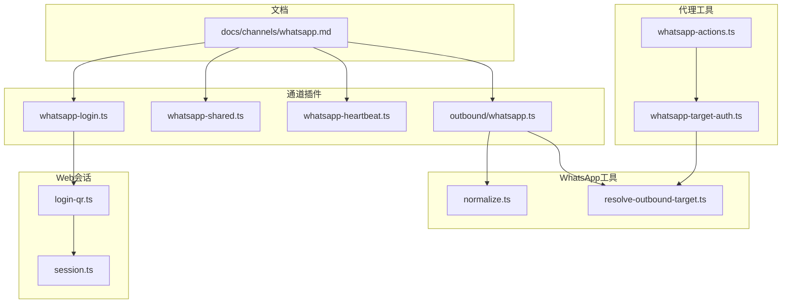
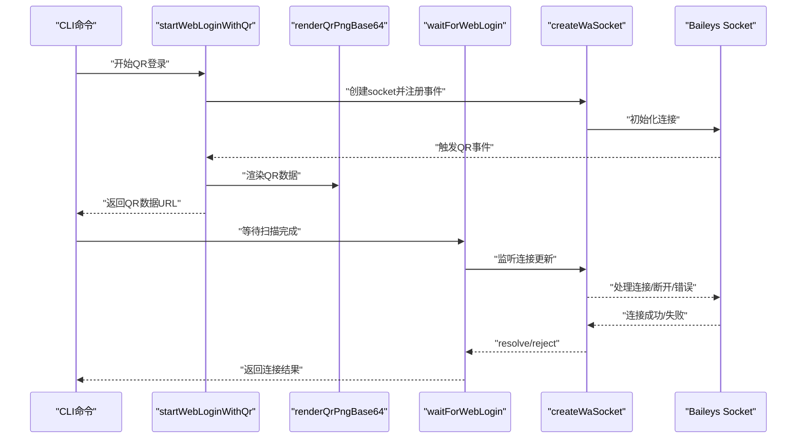
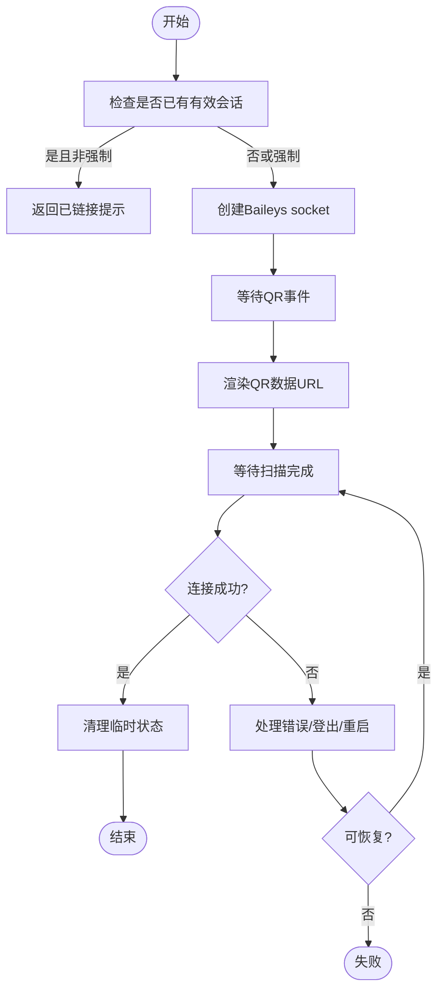
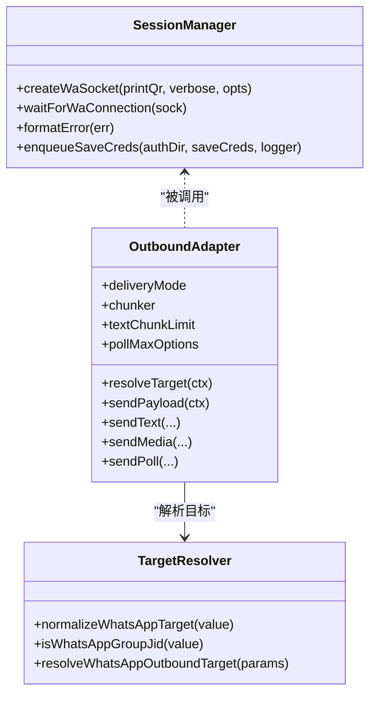
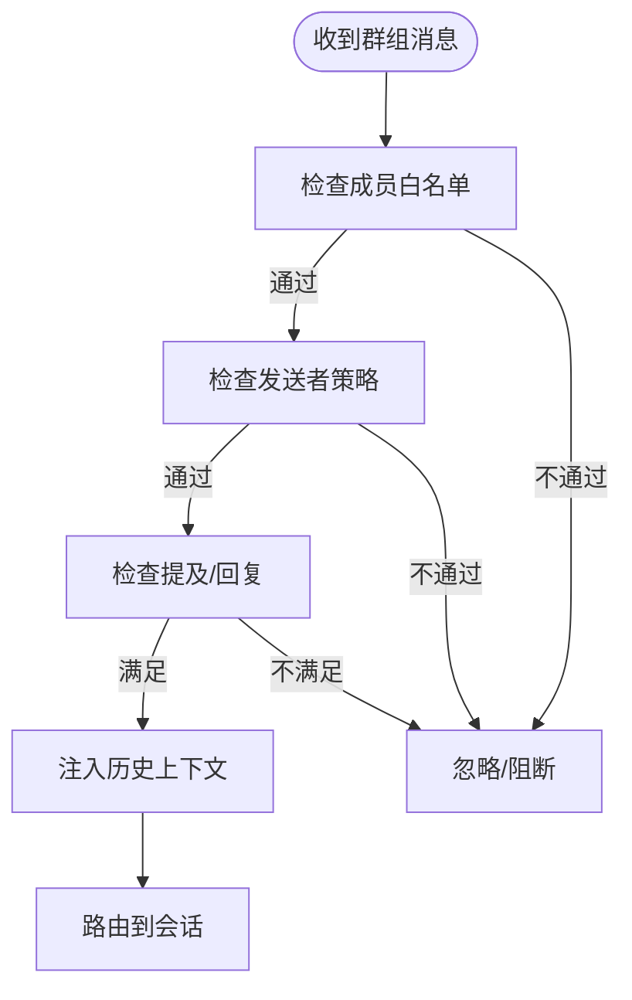
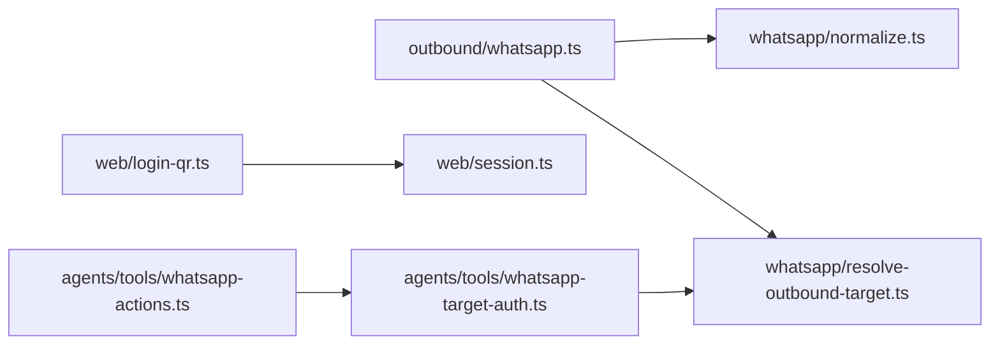

# WhatsApp集成

<cite>
**本文引用的文件**
- [docs/channels/whatsapp.md](file://docs/channels/whatsapp.md)
- [src/channels/plugins/agent-tools/whatsapp-login.ts](file://src/channels/plugins/agent-tools/whatsapp-login.ts)
- [src/channels/plugins/whatsapp-shared.ts](file://src/channels/plugins/whatsapp-shared.ts)
- [src/channels/plugins/whatsapp-heartbeat.ts](file://src/channels/plugins/whatsapp-heartbeat.ts)
- [src/channels/plugins/outbound/whatsapp.ts](file://src/channels/plugins/outbound/whatsapp.ts)
- [src/whatsapp/normalize.ts](file://src/whatsapp/normalize.ts)
- [src/whatsapp/resolve-outbound-target.ts](file://src/whatsapp/resolve-outbound-target.ts)
- [src/agents/tools/whatsapp-actions.ts](file://src/agents/tools/whatsapp-actions.ts)
- [src/agents/tools/whatsapp-target-auth.ts](file://src/agents/tools/whatsapp-target-auth.ts)
- [src/web/login-qr.ts](file://src/web/login-qr.ts)
- [src/web/session.ts](file://src/web/session.ts)
</cite>

## 目录
1. [简介](#简介)
2. [项目结构](#项目结构)
3. [核心组件](#核心组件)
4. [架构总览](#架构总览)
5. [详细组件分析](#详细组件分析)
6. [依赖关系分析](#依赖关系分析)
7. [性能考量](#性能考量)
8. [故障排除指南](#故障排除指南)
9. [结论](#结论)
10. [附录](#附录)

## 简介
本文件面向开发者，系统化阐述在OpenClaw中通过Baileys库对接WhatsApp Web（即“WhatsApp频道”）的完整集成方案。内容覆盖：
- Baileys库的使用方式与会话生命周期管理
- QR配对流程与登录状态维护
- 会话状态管理与消息处理机制
- 安装配置步骤、API限制与安全注意事项
- 群组管理、媒体处理、消息编辑与撤回能力
- 速率限制与最佳实践
- 扩展与二次开发指南

## 项目结构
与WhatsApp频道直接相关的模块主要分布在以下路径：
- 文档：docs/channels/whatsapp.md
- 入站/出站适配器与工具：src/channels/plugins/*
- 目标解析与归一化：src/whatsapp/*
- 登录与会话：src/web/login-qr.ts, src/web/session.ts
- 工具动作与授权：src/agents/tools/*

图示来源
- [docs/channels/whatsapp.md:1-446](file://docs/channels/whatsapp.md#L1-L446)
- [src/channels/plugins/agent-tools/whatsapp-login.ts:1-73](file://src/channels/plugins/agent-tools/whatsapp-login.ts#L1-L73)
- [src/channels/plugins/whatsapp-shared.ts:1-18](file://src/channels/plugins/whatsapp-shared.ts#L1-L18)
- [src/channels/plugins/whatsapp-heartbeat.ts:1-100](file://src/channels/plugins/whatsapp-heartbeat.ts#L1-L100)
- [src/channels/plugins/outbound/whatsapp.ts:1-74](file://src/channels/plugins/outbound/whatsapp.ts#L1-L74)
- [src/whatsapp/normalize.ts:1-81](file://src/whatsapp/normalize.ts#L1-L81)
- [src/whatsapp/resolve-outbound-target.ts:1-53](file://src/whatsapp/resolve-outbound-target.ts#L1-L53)
- [src/agents/tools/whatsapp-actions.ts:1-51](file://src/agents/tools/whatsapp-actions.ts#L1-L51)
- [src/agents/tools/whatsapp-target-auth.ts:1-28](file://src/agents/tools/whatsapp-target-auth.ts#L1-L28)
- [src/web/login-qr.ts:1-296](file://src/web/login-qr.ts#L1-L296)
- [src/web/session.ts:1-313](file://src/web/session.ts#L1-L313)

章节来源
- [docs/channels/whatsapp.md:1-446](file://docs/channels/whatsapp.md#L1-L446)

## 核心组件
- 通道适配器（出站）：负责文本分片、媒体发送、轮询投票等，统一由适配器封装并调用底层Web发送接口。
- 目标解析与归一化：将用户输入的目标（电话号或群JID）标准化为可路由的E.164或群JID，并校验允许列表。
- 登录与会话：基于Baileys创建socket、处理QR事件、连接状态回调与错误格式化。
- 代理工具与授权：提供反应（reactions）、轮询等动作，结合账户与允许列表进行授权判定。
- 心跳与收件人：从会话存储与允许列表中推导心跳收件人，支持单收件人或多收件人场景。

章节来源
- [src/channels/plugins/outbound/whatsapp.ts:1-74](file://src/channels/plugins/outbound/whatsapp.ts#L1-L74)
- [src/whatsapp/normalize.ts:1-81](file://src/whatsapp/normalize.ts#L1-L81)
- [src/whatsapp/resolve-outbound-target.ts:1-53](file://src/whatsapp/resolve-outbound-target.ts#L1-L53)
- [src/web/login-qr.ts:1-296](file://src/web/login-qr.ts#L1-L296)
- [src/web/session.ts:1-313](file://src/web/session.ts#L1-L313)
- [src/agents/tools/whatsapp-actions.ts:1-51](file://src/agents/tools/whatsapp-actions.ts#L1-L51)
- [src/agents/tools/whatsapp-target-auth.ts:1-28](file://src/agents/tools/whatsapp-target-auth.ts#L1-L28)
- [src/channels/plugins/whatsapp-heartbeat.ts:1-100](file://src/channels/plugins/whatsapp-heartbeat.ts#L1-L100)

## 架构总览
下图展示从CLI到Baileys的端到端流程，包括QR生成、等待扫描、连接建立与错误恢复。

图示来源
- [src/web/login-qr.ts:108-214](file://src/web/login-qr.ts#L108-L214)
- [src/web/login-qr.ts:216-295](file://src/web/login-qr.ts#L216-L295)
- [src/web/session.ts:90-161](file://src/web/session.ts#L90-L161)

章节来源
- [src/web/login-qr.ts:1-296](file://src/web/login-qr.ts#L1-L296)
- [src/web/session.ts:1-313](file://src/web/session.ts#L1-L313)

## 详细组件分析

### 组件A：QR配对与登录流程
- 功能要点
  - 生成并缓存一次性QR，支持超时控制与重复请求保护
  - 等待扫描完成，处理断线重连、登出与错误码
  - 连接成功后清理临时状态，确保后续流程可用
- 关键行为
  - 首次请求若已有有效会话且未强制刷新，直接提示已链接
  - QR有效期短，过期需重新生成
  - 对特定错误码（如515）进行一次自动重启尝试
- 适用场景
  - 新账号首次绑定
  - 账号迁移或重新配对
  - 会话异常断开后的恢复

图示来源
- [src/web/login-qr.ts:108-214](file://src/web/login-qr.ts#L108-L214)
- [src/web/login-qr.ts:216-295](file://src/web/login-qr.ts#L216-L295)
- [src/web/session.ts:90-161](file://src/web/session.ts#L90-L161)

章节来源
- [src/web/login-qr.ts:1-296](file://src/web/login-qr.ts#L1-L296)
- [src/web/session.ts:1-313](file://src/web/session.ts#L1-L313)

### 组件B：会话状态管理与消息处理
- 会话生命周期
  - 使用多文件认证状态与密钥缓存，持久化凭据并带备份保护
  - 连接事件回调中处理QR、断开与错误，必要时输出友好提示
  - WebSocket层错误捕获，避免进程崩溃
- 消息处理
  - 出站：文本分片、媒体发送、轮询投票
  - 入站：上下文包装、引用回复、媒体占位符、位置/联系人提取
  - 自聊天保护：自聊消息跳过已读回执、避免自触发提及
- 多账户
  - 支持按账户选择与凭据目录隔离
  - 默认账户优先策略与规范化查找

图示来源
- [src/web/session.ts:90-161](file://src/web/session.ts#L90-L161)
- [src/web/session.ts:163-184](file://src/web/session.ts#L163-L184)
- [src/web/session.ts:258-308](file://src/web/session.ts#L258-L308)
- [src/channels/plugins/outbound/whatsapp.ts:12-74](file://src/channels/plugins/outbound/whatsapp.ts#L12-L74)
- [src/whatsapp/normalize.ts:55-80](file://src/whatsapp/normalize.ts#L55-L80)
- [src/whatsapp/resolve-outbound-target.ts:8-52](file://src/whatsapp/resolve-outbound-target.ts#L8-L52)

章节来源
- [src/web/session.ts:1-313](file://src/web/session.ts#L1-L313)
- [src/channels/plugins/outbound/whatsapp.ts:1-74](file://src/channels/plugins/outbound/whatsapp.ts#L1-L74)
- [src/whatsapp/normalize.ts:1-81](file://src/whatsapp/normalize.ts#L1-L81)
- [src/whatsapp/resolve-outbound-target.ts:1-53](file://src/whatsapp/resolve-outbound-target.ts#L1-L53)

### 组件C：群组管理与提及检测
- 群组识别与规则
  - 通过JID后缀判断群组，支持本地段与连字符格式
  - 群组入站遵循“成员白名单 + 发送者策略”双层控制
- 提及检测
  - 显式@机器人、正则模式、回复机器人三类触发
  - 自聊天模式下避免自触发提及
- 历史注入
  - 群组未处理消息缓冲与上下文注入，支持上限配置

图示来源
- [src/channels/plugins/whatsapp-shared.ts:10-17](file://src/channels/plugins/whatsapp-shared.ts#L10-L17)
- [docs/channels/whatsapp.md:157-199](file://docs/channels/whatsapp.md#L157-L199)

章节来源
- [src/channels/plugins/whatsapp-shared.ts:1-18](file://src/channels/plugins/whatsapp-shared.ts#L1-L18)
- [docs/channels/whatsapp.md:157-199](file://docs/channels/whatsapp.md#L157-L199)

### 组件D：媒体处理与发送
- 支持类型：图片、视频、音频（含PTT语音）、文档
- 兼容性：音频自动修正编码以适配PTT播放
- 行为：多媒体回复时首项应用标题；HTTP/HTTPS/file路径均可；发送失败时首项回退为文本警告
- 限额：入站/出站媒体大小上限可配置，默认50MB；自动优化图片尺寸与质量

章节来源
- [docs/channels/whatsapp.md:301-316](file://docs/channels/whatsapp.md#L301-L316)

### 组件E：消息编辑与撤回
- 编辑与撤回能力
  - 通过代理工具动作实现对消息反应（reactions）与轮询（polls）
  - 反应动作支持添加/移除，必要时要求提供emoji
- 授权与路由
  - 基于账户与允许列表进行授权判定，确保仅对白名单内聊天执行动作

章节来源
- [src/agents/tools/whatsapp-actions.ts:1-51](file://src/agents/tools/whatsapp-actions.ts#L1-L51)
- [src/agents/tools/whatsapp-target-auth.ts:1-28](file://src/agents/tools/whatsapp-target-auth.ts#L1-L28)

### 组件F：心跳与收件人推导
- 来源
  - 会话存储中的最近对话
  - 配置与允许存储中的授权号码
- 规则
  - 单一授权收件人：直接使用
  - 多个授权收件人：按最近活跃排序去重
  - 无授权但有会话记录：取会话最近收件人
  - 无授权也无会话：回落到允许列表

章节来源
- [src/channels/plugins/whatsapp-heartbeat.ts:1-100](file://src/channels/plugins/whatsapp-heartbeat.ts#L1-L100)

## 依赖关系分析
- 组件耦合
  - 通道适配器依赖目标解析与归一化模块
  - 登录流程依赖会话管理与QR渲染
  - 代理工具依赖账户解析与目标授权
- 外部依赖
  - Baileys（@whiskeysockets/baileys）：WebSocket连接、QR事件、认证状态
  - qrcode-terminal：终端打印QR（可选）
- 潜在循环
  - 当前模块间为单向依赖，未见循环导入

图示来源
- [src/channels/plugins/outbound/whatsapp.ts:1-74](file://src/channels/plugins/outbound/whatsapp.ts#L1-L74)
- [src/whatsapp/normalize.ts:1-81](file://src/whatsapp/normalize.ts#L1-L81)
- [src/whatsapp/resolve-outbound-target.ts:1-53](file://src/whatsapp/resolve-outbound-target.ts#L1-L53)
- [src/web/login-qr.ts:1-296](file://src/web/login-qr.ts#L1-L296)
- [src/web/session.ts:1-313](file://src/web/session.ts#L1-L313)
- [src/agents/tools/whatsapp-actions.ts:1-51](file://src/agents/tools/whatsapp-actions.ts#L1-L51)
- [src/agents/tools/whatsapp-target-auth.ts:1-28](file://src/agents/tools/whatsapp-target-auth.ts#L1-L28)

章节来源
- [src/channels/plugins/outbound/whatsapp.ts:1-74](file://src/channels/plugins/outbound/whatsapp.ts#L1-L74)
- [src/whatsapp/normalize.ts:1-81](file://src/whatsapp/normalize.ts#L1-L81)
- [src/whatsapp/resolve-outbound-target.ts:1-53](file://src/whatsapp/resolve-outbound-target.ts#L1-L53)
- [src/web/login-qr.ts:1-296](file://src/web/login-qr.ts#L1-L296)
- [src/web/session.ts:1-313](file://src/web/session.ts#L1-L313)
- [src/agents/tools/whatsapp-actions.ts:1-51](file://src/agents/tools/whatsapp-actions.ts#L1-L51)
- [src/agents/tools/whatsapp-target-auth.ts:1-28](file://src/agents/tools/whatsapp-target-auth.ts#L1-L28)

## 性能考量
- 分片策略：文本分片默认上限与模式可配置，建议根据消息长度与平台限制调整
- 媒体优化：自动压缩与尺寸调整降低传输与存储压力
- 连接稳定性：错误码处理与一次自动重启提升成功率
- 并发与队列：凭据保存采用串行队列，避免竞态与损坏

## 故障排除指南
- 未链接（需要QR）
  - 症状：通道状态显示未链接
  - 处理：重新发起登录并确认扫描
- 已链接但断开/重连循环
  - 症状：反复断开/重连
  - 处理：运行诊断工具与日志追踪，必要时重新登录
- 发送时无活动监听器
  - 症状：出站发送失败
  - 处理：确保网关运行且账户已登录
- 群消息被忽略
  - 症状：群消息未触发
  - 处理：检查群策略、允许列表、提及规则与配置重复键
- Bun运行时警告
  - 症状：提示Bun不兼容
  - 处理：使用Node运行WhatsApp网关

章节来源
- [docs/channels/whatsapp.md:374-424](file://docs/channels/whatsapp.md#L374-L424)

## 结论
OpenClaw通过Baileys在WhatsApp Web上实现了稳定、可扩展的集成方案。其设计强调：
- 清晰的登录与会话管理（QR、断线恢复、错误处理）
- 可配置的访问控制与群组策略
- 完整的消息与媒体处理链路
- 多账户与自聊天保护
开发者可在上述基础上扩展更多动作与路由能力，同时遵循速率限制与安全最佳实践。

## 附录

### 安装与配置步骤
- 配置访问策略（DM/群组策略、允许列表）
- 启动登录（QR）并扫描
- 启动网关
- 如启用配对模式，审批首次配对请求

章节来源
- [docs/channels/whatsapp.md:24-76](file://docs/channels/whatsapp.md#L24-L76)

### API限制与安全注意事项
- 速率限制：遵循平台与网络环境限制，避免频繁重连
- 安全：凭据目录权限严格（600），启用备份与恢复
- 最佳实践：专用号码、最小权限、明确的群组与发送者策略

章节来源
- [docs/channels/whatsapp.md:343-364](file://docs/channels/whatsapp.md#L343-L364)
- [src/web/session.ts:47-84](file://src/web/session.ts#L47-L84)

### 开发者扩展指南
- 新增动作：参考反应与轮询动作的授权与参数解析模式
- 新增通道适配器：复用文本分片、媒体发送与轮询逻辑
- 目标解析增强：扩展JID/号码识别与白名单校验

章节来源
- [src/agents/tools/whatsapp-actions.ts:1-51](file://src/agents/tools/whatsapp-actions.ts#L1-L51)
- [src/channels/plugins/outbound/whatsapp.ts:1-74](file://src/channels/plugins/outbound/whatsapp.ts#L1-L74)
- [src/whatsapp/resolve-outbound-target.ts:1-53](file://src/whatsapp/resolve-outbound-target.ts#L1-L53)