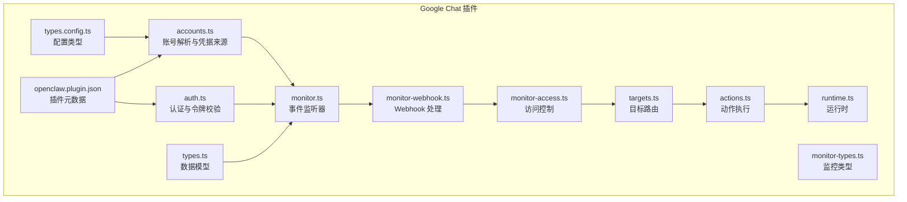
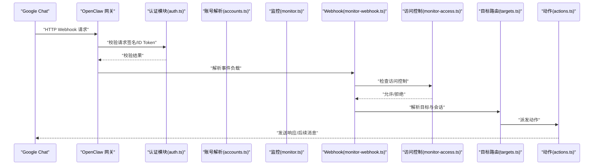
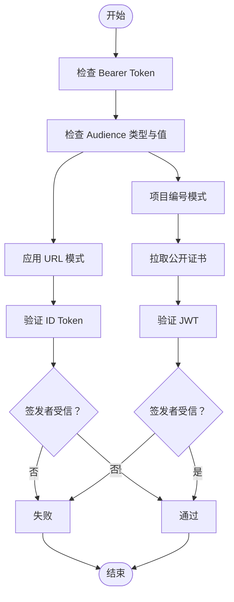
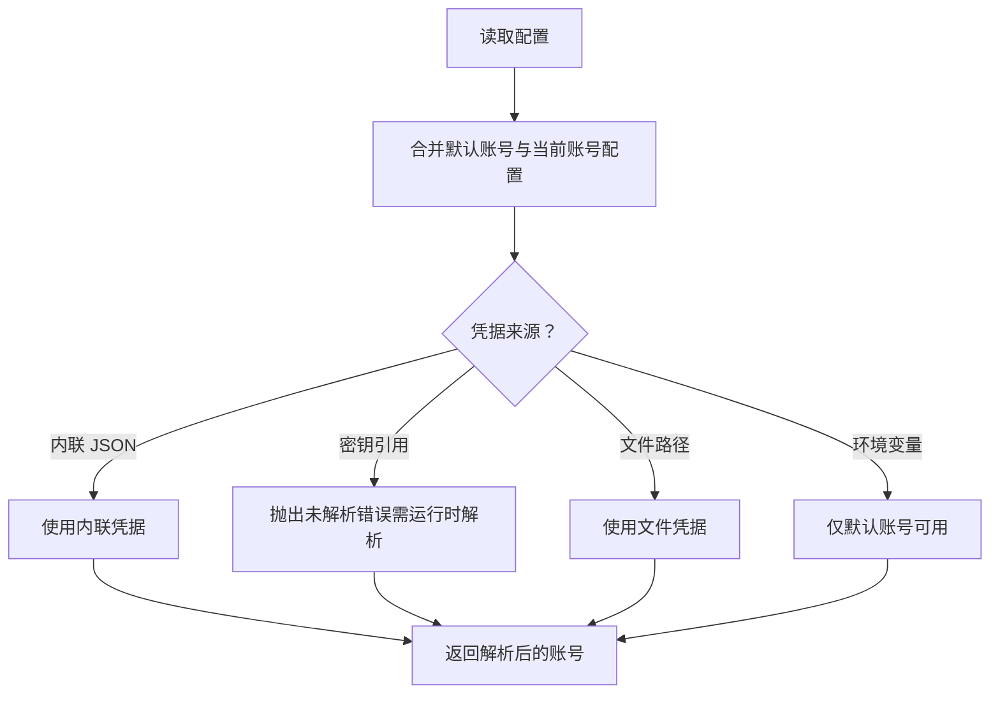
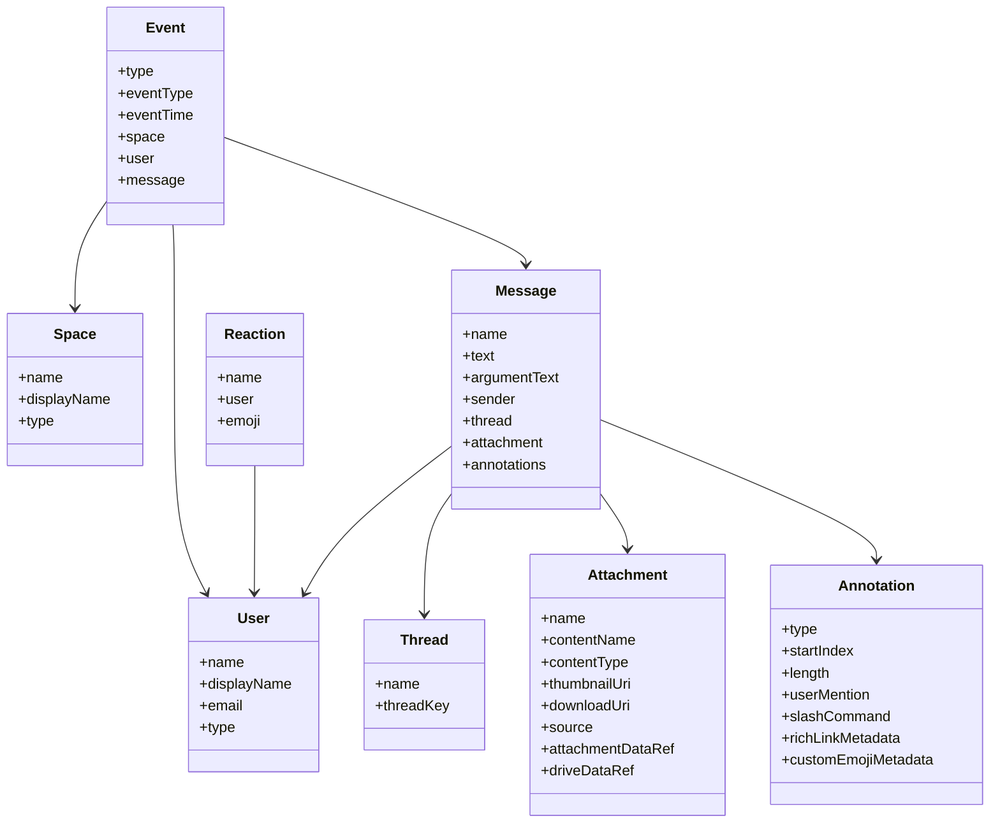
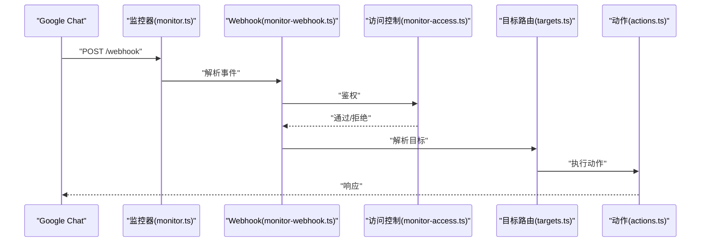
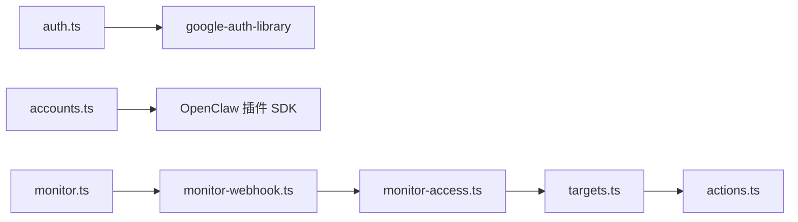

# Google Chat 渠道

<cite>
**本文引用的文件**
- [extensions/googlechat/src/auth.ts](file://extensions/googlechat/src/auth.ts)
- [extensions/googlechat/src/accounts.ts](file://extensions/googlechat/src/accounts.ts)
- [extensions/googlechat/src/types.ts](file://extensions/googlechat/src/types.ts)
- [extensions/googlechat/src/types.config.ts](file://extensions/googlechat/src/types.config.ts)
- [extensions/googlechat/src/monitor.ts](file://extensions/googlechat/src/monitor.ts)
- [extensions/googlechat/src/monitor-webhook.ts](file://extensions/googlechat/src/monitor-webhook.ts)
- [extensions/googlechat/src/monitor-access.ts](file://extensions/googlechat/src/monitor-access.ts)
- [extensions/googlechat/src/monitor-types.ts](file://extensions/googlechat/src/monitor-types.ts)
- [extensions/googlechat/src/targets.ts](file://extensions/googlechat/src/targets.ts)
- [extensions/googlechat/src/actions.ts](file://extensions/googlechat/src/actions.ts)
- [extensions/googlechat/src/runtime.ts](file://extensions/googlechat/src/runtime.ts)
- [extensions/googlechat/openclaw.plugin.json](file://extensions/googlechat/openclaw.plugin.json)
</cite>

## 目录
1. [简介](#简介)
2. [项目结构](#项目结构)
3. [核心组件](#核心组件)
4. [架构总览](#架构总览)
5. [详细组件分析](#详细组件分析)
6. [依赖分析](#依赖分析)
7. [性能考虑](#性能考虑)
8. [故障排除指南](#故障排除指南)
9. [结论](#结论)
10. [附录](#附录)

## 简介
本文件面向在 Google Workspace 中集成 Google Chat 的开发者与运维人员，系统性说明 OpenClaw 项目中 Google Chat 渠道的实现方式与使用方法。内容涵盖：
- 与 Google Workspace 的集成关系与 API 权限模型
- 应用配置、OAuth 2.0 认证与服务账户设置
- 聊天类型支持（直接聊天、群组聊天）与消息格式处理
- Google 特有功能（Spaces、自定义表情、集换式卡牌）与权限管理机制
- 与 Gmail、Drive 等 Google 服务的集成能力
- 部署配置、安全最佳实践与故障排除指南

## 项目结构
Google Chat 渠道位于扩展目录下，采用“插件式”组织方式，核心模块包括认证、账号解析、监控、目标路由、动作与运行时等子模块。

图表来源
- [extensions/googlechat/src/auth.ts:1-138](file://extensions/googlechat/src/auth.ts#L1-L138)
- [extensions/googlechat/src/accounts.ts:1-156](file://extensions/googlechat/src/accounts.ts#L1-L156)
- [extensions/googlechat/src/types.ts:1-74](file://extensions/googlechat/src/types.ts#L1-L74)
- [extensions/googlechat/src/types.config.ts:1-4](file://extensions/googlechat/src/types.config.ts#L1-L4)
- [extensions/googlechat/src/monitor.ts](file://extensions/googlechat/src/monitor.ts)
- [extensions/googlechat/src/monitor-webhook.ts](file://extensions/googlechat/src/monitor-webhook.ts)
- [extensions/googlechat/src/monitor-access.ts](file://extensions/googlechat/src/monitor-access.ts)
- [extensions/googlechat/src/monitor-types.ts](file://extensions/googlechat/src/monitor-types.ts)
- [extensions/googlechat/src/targets.ts](file://extensions/googlechat/src/targets.ts)
- [extensions/googlechat/src/actions.ts](file://extensions/googlechat/src/actions.ts)
- [extensions/googlechat/src/runtime.ts](file://extensions/googlechat/src/runtime.ts)
- [extensions/googlechat/openclaw.plugin.json:1-10](file://extensions/googlechat/openclaw.plugin.json#L1-L10)

章节来源
- [extensions/googlechat/openclaw.plugin.json:1-10](file://extensions/googlechat/openclaw.plugin.json#L1-L10)

## 核心组件
- 认证与令牌校验：负责构建 Google Chat 所需的 OAuth 2.0 访问令牌，并验证来自 Google Chat 的请求签名或 ID Token。
- 账号解析与凭据来源：统一解析多账号配置，支持内联 JSON、密钥引用、文件路径与环境变量等多种凭据来源。
- 数据模型：定义 Spaces、用户、线程、附件、注解、消息、事件与反应等核心数据结构。
- 监控与 Webhook：接收并处理 Google Chat 发来的事件，进行路由与访问控制。
- 目标路由与动作：将消息映射到具体会话或目标，并执行相应动作。
- 运行时：承载渠道生命周期与事件处理流程。

章节来源
- [extensions/googlechat/src/auth.ts:1-138](file://extensions/googlechat/src/auth.ts#L1-L138)
- [extensions/googlechat/src/accounts.ts:1-156](file://extensions/googlechat/src/accounts.ts#L1-L156)
- [extensions/googlechat/src/types.ts:1-74](file://extensions/googlechat/src/types.ts#L1-L74)
- [extensions/googlechat/src/monitor.ts](file://extensions/googlechat/src/monitor.ts)
- [extensions/googlechat/src/monitor-webhook.ts](file://extensions/googlechat/src/monitor-webhook.ts)
- [extensions/googlechat/src/monitor-access.ts](file://extensions/googlechat/src/monitor-access.ts)
- [extensions/googlechat/src/monitor-types.ts](file://extensions/googlechat/src/monitor-types.ts)
- [extensions/googlechat/src/targets.ts](file://extensions/googlechat/src/targets.ts)
- [extensions/googlechat/src/actions.ts](file://extensions/googlechat/src/actions.ts)
- [extensions/googlechat/src/runtime.ts](file://extensions/googlechat/src/runtime.ts)

## 架构总览
下图展示从 Google Chat 到 OpenClaw 的端到端交互流程，包括认证、请求验证、事件分发与动作执行。

图表来源
- [extensions/googlechat/src/auth.ts:93-135](file://extensions/googlechat/src/auth.ts#L93-L135)
- [extensions/googlechat/src/monitor-webhook.ts](file://extensions/googlechat/src/monitor-webhook.ts)
- [extensions/googlechat/src/monitor-access.ts](file://extensions/googlechat/src/monitor-access.ts)
- [extensions/googlechat/src/targets.ts](file://extensions/googlechat/src/targets.ts)
- [extensions/googlechat/src/actions.ts](file://extensions/googlechat/src/actions.ts)

## 详细组件分析

### 认证与权限模型
- OAuth 2.0 作用域：使用 Google Chat Bot 专用作用域，确保最小权限原则。
- 令牌获取：支持从文件、内联 JSON 或默认环境自动加载凭据，生成访问令牌。
- 请求验证：
  - 支持两种受众类型：
    - 应用 URL：通过 Google OAuth2 客户端验证 ID Token，校验签发邮箱是否为受信服务账户。
    - 项目编号：通过拉取公开证书并使用 JWT 校验，确保来自 Google Chat 的请求。
- 证书缓存：对公开证书进行短期缓存，避免频繁网络请求。

图表来源
- [extensions/googlechat/src/auth.ts:93-135](file://extensions/googlechat/src/auth.ts#L93-L135)

章节来源
- [extensions/googlechat/src/auth.ts:1-138](file://extensions/googlechat/src/auth.ts#L1-L138)

### 账号解析与凭据来源
- 多账号支持：支持默认账号与特定账号配置合并，便于共享默认参数与覆盖单账号设置。
- 凭据来源优先级：
  - 内联 JSON（最优先）
  - 密钥引用（SecretRef，需在运行时解析）
  - 文件路径
  - 环境变量（仅默认账号）
- 默认账号与多账号的合并策略：保留顶层与账号级覆盖，同时允许默认账号共享部分字段。

图表来源
- [extensions/googlechat/src/accounts.ts:38-127](file://extensions/googlechat/src/accounts.ts#L38-L127)

章节来源
- [extensions/googlechat/src/accounts.ts:1-156](file://extensions/googlechat/src/accounts.ts#L1-L156)

### 数据模型与消息格式
- 核心数据结构：
  - Space（空间）、User（用户）、Thread（线程）、Attachment（附件）、Annotation（注解）、Message（消息）、Event（事件）、Reaction（反应）。
- 注解类型：支持用户提及、Slash 命令、富链接元数据、自定义表情元数据等。
- 附件：支持资源名称、下载 URI、驱动数据引用等字段，便于与 Drive 集成。

图表来源
- [extensions/googlechat/src/types.ts:1-74](file://extensions/googlechat/src/types.ts#L1-L74)

章节来源
- [extensions/googlechat/src/types.ts:1-74](file://extensions/googlechat/src/types.ts#L1-L74)

### 监控与 Webhook 处理
- 监控器：负责注册与维护 Webhook，接收 Google Chat 事件。
- Webhook 解析：将请求体解析为内部事件对象，触发后续处理链。
- 访问控制：基于账号与空间权限进行访问控制决策。
- 目标路由：根据事件上下文（Space、Thread、User）解析目标会话。
- 动作执行：将消息转换为平台可理解的指令并执行。

图表来源
- [extensions/googlechat/src/monitor.ts](file://extensions/googlechat/src/monitor.ts)
- [extensions/googlechat/src/monitor-webhook.ts](file://extensions/googlechat/src/monitor-webhook.ts)
- [extensions/googlechat/src/monitor-access.ts](file://extensions/googlechat/src/monitor-access.ts)
- [extensions/googlechat/src/targets.ts](file://extensions/googlechat/src/targets.ts)
- [extensions/googlechat/src/actions.ts](file://extensions/googlechat/src/actions.ts)

章节来源
- [extensions/googlechat/src/monitor.ts](file://extensions/googlechat/src/monitor.ts)
- [extensions/googlechat/src/monitor-webhook.ts](file://extensions/googlechat/src/monitor-webhook.ts)
- [extensions/googlechat/src/monitor-access.ts](file://extensions/googlechat/src/monitor-access.ts)
- [extensions/googlechat/src/targets.ts](file://extensions/googlechat/src/targets.ts)
- [extensions/googlechat/src/actions.ts](file://extensions/googlechat/src/actions.ts)

### Google 特有功能与权限管理
- Spaces：作为消息与事件的容器，用于区分不同聊天场景（如群组或直接会话）。
- 自定义表情：通过注解元数据传递，可在渲染层识别并展示。
- 集换式卡牌：通过注解元数据传递，可在渲染层识别并展示。
- 权限管理：结合账号解析与访问控制，确保仅授权账号与空间可接入；请求验证进一步保证来源可信。

章节来源
- [extensions/googlechat/src/types.ts:40-48](file://extensions/googlechat/src/types.ts#L40-L48)
- [extensions/googlechat/src/monitor-access.ts](file://extensions/googlechat/src/monitor-access.ts)

### 与 Google 服务的集成能力
- Drive 集成：附件结构支持驱动数据引用，便于在消息中嵌入或引用云端文件。
- Gmail 集成：可通过附件或富链接元数据与邮件相关联（具体实现取决于上层动作与工具）。

章节来源
- [extensions/googlechat/src/types.ts:24-33](file://extensions/googlechat/src/types.ts#L24-L33)

## 依赖分析
- 外部依赖：google-auth-library（用于 OAuth 与 JWT 验证）。
- 内部依赖：插件 SDK 提供的账号与配置辅助函数，确保与 OpenClaw 生态一致。

图表来源
- [extensions/googlechat/src/auth.ts](file://extensions/googlechat/src/auth.ts#L1)
- [extensions/googlechat/src/accounts.ts:1-4](file://extensions/googlechat/src/accounts.ts#L1-L4)
- [extensions/googlechat/src/monitor.ts](file://extensions/googlechat/src/monitor.ts)
- [extensions/googlechat/src/monitor-webhook.ts](file://extensions/googlechat/src/monitor-webhook.ts)
- [extensions/googlechat/src/monitor-access.ts](file://extensions/googlechat/src/monitor-access.ts)
- [extensions/googlechat/src/targets.ts](file://extensions/googlechat/src/targets.ts)
- [extensions/googlechat/src/actions.ts](file://extensions/googlechat/src/actions.ts)

章节来源
- [extensions/googlechat/src/auth.ts](file://extensions/googlechat/src/auth.ts#L1)
- [extensions/googlechat/src/accounts.ts:1-4](file://extensions/googlechat/src/accounts.ts#L1-L4)

## 性能考虑
- 认证实例缓存：按账号与凭据键缓存 GoogleAuth 实例，限制最大容量，避免长期运行内存膨胀。
- 公开证书缓存：短期缓存 Google Chat 公开证书，降低网络请求频率。
- 最小权限：仅授予 chat.bot 作用域，减少权限面与潜在风险。

章节来源
- [extensions/googlechat/src/auth.ts:11-16](file://extensions/googlechat/src/auth.ts#L11-L16)
- [extensions/googlechat/src/auth.ts:77-89](file://extensions/googlechat/src/auth.ts#L77-L89)

## 故障排除指南
- 缺少访问令牌：当无法获取访问令牌时，检查凭据来源（文件、内联、环境变量）与权限范围。
- 请求验证失败：
  - 应用 URL 模式：确认 Audience 与签发邮箱匹配，且邮箱已验证。
  - 项目编号模式：确认证书拉取成功且 JWT 校验通过。
- 未解析的密钥引用：若使用 SecretRef，请在运行时快照中解析后再读取。
- Webhook 未被接收：检查监控器注册状态与网关可达性。

章节来源
- [extensions/googlechat/src/auth.ts:64-75](file://extensions/googlechat/src/auth.ts#L64-L75)
- [extensions/googlechat/src/auth.ts:93-135](file://extensions/googlechat/src/auth.ts#L93-L135)
- [extensions/googlechat/src/accounts.ts:97-107](file://extensions/googlechat/src/accounts.ts#L97-L107)
- [extensions/googlechat/src/monitor.ts](file://extensions/googlechat/src/monitor.ts)

## 结论
OpenClaw 的 Google Chat 渠道通过清晰的职责划分与严格的权限模型，实现了与 Google Workspace 的安全集成。借助多账号配置、灵活的凭据来源与完善的请求验证机制，既能满足企业级部署的安全要求，又具备良好的扩展性与可维护性。

## 附录
- 插件元数据：声明渠道 ID 与配置模式，便于在 OpenClaw 中启用与管理。

章节来源
- [extensions/googlechat/openclaw.plugin.json:1-10](file://extensions/googlechat/openclaw.plugin.json#L1-L10)