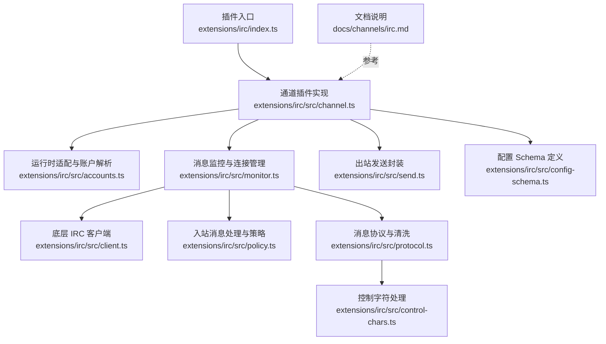
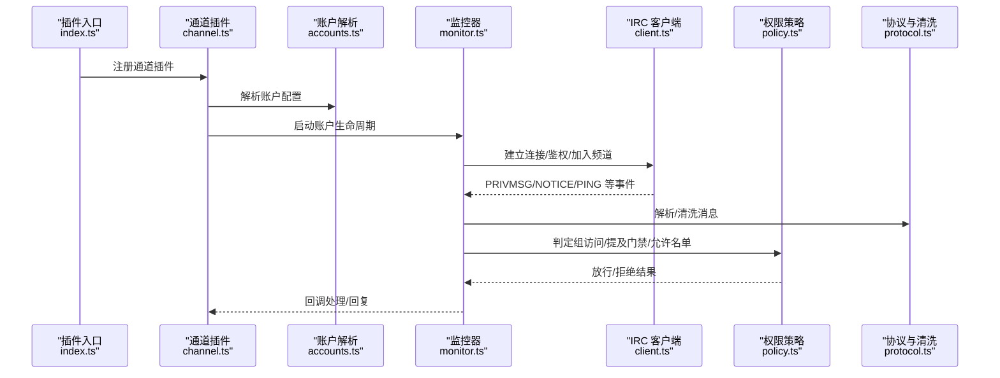
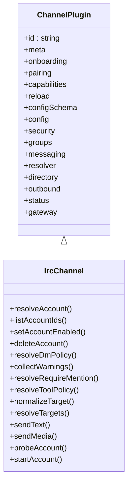
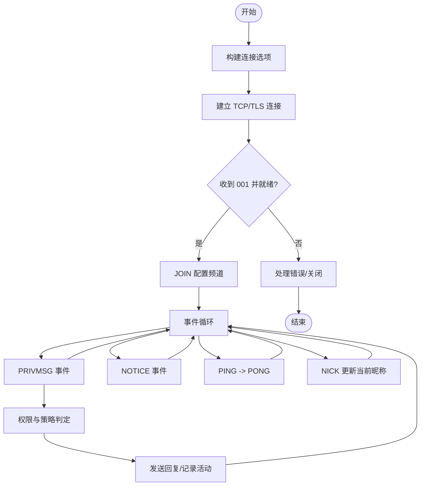
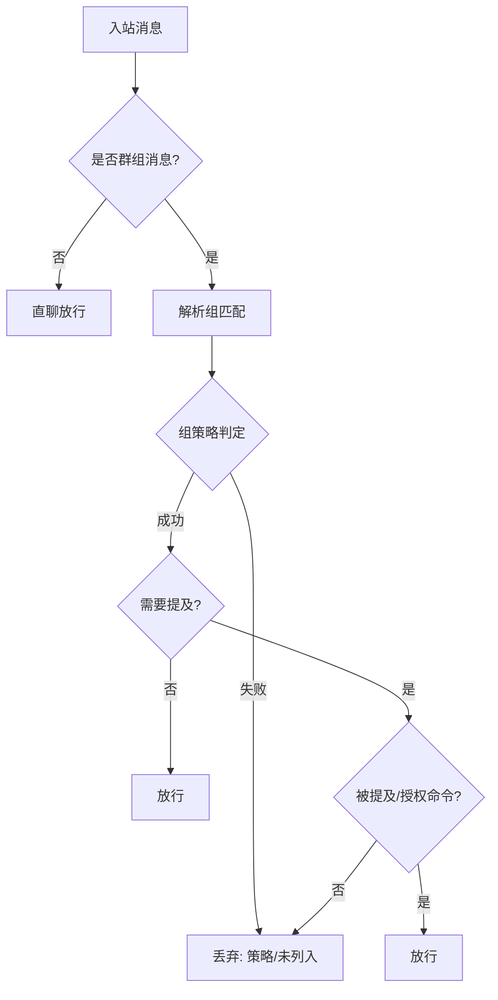
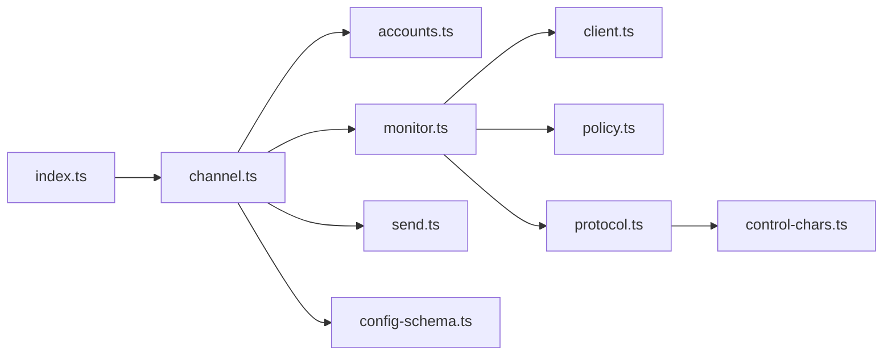

# IRC 渠道

<cite>
**本文引用的文件**
- [extensions/irc/index.ts](file://extensions/irc/index.ts)
- [extensions/irc/package.json](file://extensions/irc/package.json)
- [docs/channels/irc.md](file://docs/channels/irc.md)
- [extensions/irc/src/channel.ts](file://extensions/irc/src/channel.ts)
- [extensions/irc/src/client.ts](file://extensions/irc/src/client.ts)
- [extensions/irc/src/config-schema.ts](file://extensions/irc/src/config-schema.ts)
- [extensions/irc/src/monitor.ts](file://extensions/irc/src/monitor.ts)
- [extensions/irc/src/policy.ts](file://extensions/irc/src/policy.ts)
- [extensions/irc/src/normalize.ts](file://extensions/irc/src/normalize.ts)
- [extensions/irc/src/protocol.ts](file://extensions/irc/src/protocol.ts)
- [extensions/irc/src/send.ts](file://extensions/irc/src/send.ts)
- [extensions/irc/src/accounts.ts](file://extensions/irc/src/accounts.ts)
- [extensions/irc/src/control-chars.ts](file://extensions/irc/src/control-chars.ts)
</cite>

## 目录
1. [简介](#简介)
2. [项目结构](#项目结构)
3. [核心组件](#核心组件)
4. [架构总览](#架构总览)
5. [详细组件分析](#详细组件分析)
6. [依赖关系分析](#依赖关系分析)
7. [性能考量](#性能考量)
8. [故障排查指南](#故障排查指南)
9. [结论](#结论)
10. [附录](#附录)

## 简介
本文件面向在 OpenClaw 中集成与使用 IRC 渠道的工程师与运维人员，系统化阐述 IRC 协议基础、服务器连接机制、配置项与认证流程、消息格式与特殊字符处理、权限与用户级别控制、历史记录与状态同步策略，并给出服务器兼容性与网络稳定性建议。文档同时提供从插件入口到运行时监控、消息收发与安全策略的端到端视图。

## 项目结构
IRC 插件位于扩展目录中，采用“插件入口 + 核心运行时适配 + 协议与策略实现”的分层组织方式：
- 插件入口负责注册通道插件与运行时环境
- 运行时适配负责账户解析、配置合并、凭据加载与运行时日志
- 协议与策略模块负责消息解析/清洗、目标规范化、权限判定与发送逻辑
- 监控器负责建立连接、事件回调与生命周期管理

**图表来源**
- [extensions/irc/index.ts:1-18](file://extensions/irc/index.ts#L1-L18)
- [extensions/irc/src/channel.ts:63-387](file://extensions/irc/src/channel.ts#L63-L387)
- [extensions/irc/src/accounts.ts:154-258](file://extensions/irc/src/accounts.ts#L154-L258)
- [extensions/irc/src/monitor.ts:34-147](file://extensions/irc/src/monitor.ts#L34-L147)
- [extensions/irc/src/client.ts:116-440](file://extensions/irc/src/client.ts#L116-L440)
- [extensions/irc/src/policy.ts:1-167](file://extensions/irc/src/policy.ts#L1-L167)
- [extensions/irc/src/protocol.ts:1-169](file://extensions/irc/src/protocol.ts#L1-L169)
- [extensions/irc/src/control-chars.ts:1-22](file://extensions/irc/src/control-chars.ts#L1-L22)
- [extensions/irc/src/send.ts:35-90](file://extensions/irc/src/send.ts#L35-L90)
- [extensions/irc/src/config-schema.ts:1-93](file://extensions/irc/src/config-schema.ts#L1-L93)
- [docs/channels/irc.md:1-242](file://docs/channels/irc.md#L1-L242)

**章节来源**
- [extensions/irc/index.ts:1-18](file://extensions/irc/index.ts#L1-L18)
- [extensions/irc/package.json:1-15](file://extensions/irc/package.json#L1-L15)
- [docs/channels/irc.md:10-45](file://docs/channels/irc.md#L10-L45)

## 核心组件
- 插件注册与运行时设置：插件入口导入通道实现并注入运行时，随后注册为通道插件。
- 通道插件接口：统一暴露 onboarding、pairing、capabilities、config、security、groups、messaging、resolver、directory、outbound、status、gateway 等能力。
- 账户解析与配置合并：支持多账户、默认账户、环境变量覆盖、密码文件与密钥管理。
- 监控器与客户端：建立与维护连接，处理 PING/PONG、NICK 冲突恢复、JOIN、PRIVMSG、NOTICE 等事件。
- 权限与策略：基于组策略与允许名单、提及门禁、工具策略、按发送者差异化策略。
- 消息协议与清洗：解析 IRC 行、剥离控制字符、限制消息长度、目标校验。
- 出站发送：支持直接复用已连接客户端或临时连接发送，自动记录活动。

**章节来源**
- [extensions/irc/src/channel.ts:63-387](file://extensions/irc/src/channel.ts#L63-L387)
- [extensions/irc/src/accounts.ts:154-258](file://extensions/irc/src/accounts.ts#L154-L258)
- [extensions/irc/src/monitor.ts:34-147](file://extensions/irc/src/monitor.ts#L34-L147)
- [extensions/irc/src/client.ts:116-440](file://extensions/irc/src/client.ts#L116-L440)
- [extensions/irc/src/policy.ts:1-167](file://extensions/irc/src/policy.ts#L1-L167)
- [extensions/irc/src/protocol.ts:1-169](file://extensions/irc/src/protocol.ts#L1-L169)
- [extensions/irc/src/send.ts:35-90](file://extensions/irc/src/send.ts#L35-L90)

## 架构总览
下图展示从插件注册到消息收发与策略执行的关键交互路径：

**图表来源**
- [extensions/irc/index.ts:6-15](file://extensions/irc/index.ts#L6-L15)
- [extensions/irc/src/channel.ts:356-384](file://extensions/irc/src/channel.ts#L356-L384)
- [extensions/irc/src/accounts.ts:154-258](file://extensions/irc/src/accounts.ts#L154-L258)
- [extensions/irc/src/monitor.ts:62-134](file://extensions/irc/src/monitor.ts#L62-L134)
- [extensions/irc/src/client.ts:322-360](file://extensions/irc/src/client.ts#L322-L360)
- [extensions/irc/src/policy.ts:71-138](file://extensions/irc/src/policy.ts#L71-L138)
- [extensions/irc/src/protocol.ts:21-77](file://extensions/irc/src/protocol.ts#L21-L77)

## 详细组件分析

### 插件入口与注册
- 插件 ID、名称、描述与空配置模式定义
- 注册通道插件并注入运行时
- 将 IRC 插件作为通道插件注册到框架

**章节来源**
- [extensions/irc/index.ts:1-18](file://extensions/irc/index.ts#L1-L18)
- [extensions/irc/package.json:1-15](file://extensions/irc/package.json#L1-L15)

### 通道插件接口与能力
- 能力声明：支持群聊与私聊、媒体、阻塞流式输出
- 配置：构建配置 Schema、列出账户、解析账户、默认账户、启用/删除账户
- 安全：构建 DM 与组策略、收集安全告警
- 组策略：解析提及门禁与工具策略
- 消息：目标标准化、解析器（群/私）
- 目录：列出用户与群组
- 出站：文本/媒体发送、分块、Markdown 表格转换
- 状态：探针、快照、摘要、运行时信息
- 网关：启动/停止账户生命周期

**图表来源**
- [extensions/irc/src/channel.ts:63-387](file://extensions/irc/src/channel.ts#L63-L387)

**章节来源**
- [extensions/irc/src/channel.ts:63-387](file://extensions/irc/src/channel.ts#L63-L387)

### 账户解析与配置合并
- 支持多账户与默认账户
- 环境变量覆盖：主机、端口、TLS、昵称、用户名、真实名、密码、频道、NickServ 密码与注册邮箱
- 密码来源优先级：环境变量 > 密码文件 > 配置项
- NickServ 配置合并与环境变量补充
- 账户启用/禁用与配置完整性校验

**章节来源**
- [extensions/irc/src/accounts.ts:154-258](file://extensions/irc/src/accounts.ts#L154-L258)

### 监控器与连接生命周期
- 建立连接：根据账户配置构建连接选项，支持超时、中止信号
- 事件处理：解析行、处理 PING/PONG、NICK 更新、PRIVMSG/NOTICE、错误与关闭
- Nick 冲突恢复：尝试 Ghost/Ghost+重命名或回退昵称
- 加入频道：连接成功后 JOIN 配置的频道
- 入站消息：标准化目标（群/私）、记录活动、回调或交由入站处理器

**图表来源**
- [extensions/irc/src/monitor.ts:62-134](file://extensions/irc/src/monitor.ts#L62-L134)
- [extensions/irc/src/client.ts:322-360](file://extensions/irc/src/client.ts#L322-L360)

**章节来源**
- [extensions/irc/src/monitor.ts:34-147](file://extensions/irc/src/monitor.ts#L34-L147)
- [extensions/irc/src/client.ts:116-440](file://extensions/irc/src/client.ts#L116-L440)

### 底层 IRC 客户端
- 连接参数：主机、端口、TLS、昵称、用户名、真实名、可选密码、NickServ、频道列表
- 命令发送：原始命令、JOIN、PRIVMSG、QUIT、CLOSE
- 行解析：PING/PONG、NICK、PRIVMSG、NOTICE、错误码与昵称冲突码处理
- Nick 冲突恢复：Ghost 命令 + 重命名或回退昵称
- 超时与中止：连接超时、AbortSignal 中止
- 文本清洗与分块：限制长度、保留单词边界

**章节来源**
- [extensions/irc/src/client.ts:22-57](file://extensions/irc/src/client.ts#L22-L57)
- [extensions/irc/src/client.ts:116-440](file://extensions/irc/src/client.ts#L116-L440)

### 权限与策略
- 组匹配：区分精确键与大小写不敏感键，支持通配符“*”
- 组访问门禁：disabled/allowlist/open 三种策略；显式禁用优先
- 提及门禁：默认开启；可在组或通配符上关闭
- 组内发送者允许名单：支持全局与组内两层 allowFrom，支持裸昵称匹配开关
- 工具策略：按组与按发送者差异化授权

**图表来源**
- [extensions/irc/src/policy.ts:17-115](file://extensions/irc/src/policy.ts#L17-L115)
- [extensions/irc/src/policy.ts:117-138](file://extensions/irc/src/policy.ts#L117-L138)

**章节来源**
- [extensions/irc/src/policy.ts:1-167](file://extensions/irc/src/policy.ts#L1-L167)

### 消息协议与特殊字符处理
- 行解析：前缀、命令、参数、尾随文本
- 前缀解析：支持 nick!user@host、nick@host、server、纯 nick
- 文本清洗：解码转义序列、剥离控制字符、换行替换为空格
- 目标校验：拒绝空白与控制字符、严格模式不允许首尾空白
- 文本分块：按最大长度分割，尽量保持单词边界

**章节来源**
- [extensions/irc/src/protocol.ts:21-169](file://extensions/irc/src/protocol.ts#L21-L169)
- [extensions/irc/src/control-chars.ts:1-22](file://extensions/irc/src/control-chars.ts#L1-L22)

### 目标与允许名单标准化
- 目标标准化：支持 irc:/channel:/user: 前缀，自动补全频道前缀
- 允许名单条目标准化：统一大小写、去除前缀
- 发送者标识格式化：nick!user@host、nick@host、nick!user 等候选
- 匹配候选生成：在允许名称匹配开启时生成裸昵称候选

**章节来源**
- [extensions/irc/src/normalize.ts:10-124](file://extensions/irc/src/normalize.ts#L10-L124)

### 出站发送与状态记录
- 目标解析：优先参数，其次上下文目标
- Markdown 表格转换：根据配置选择表格渲染模式
- 回复标记：支持附加 reply: 标记
- 客户端复用：若已连接则复用，否则临时连接后退出
- 活动记录：出站方向活动上报

**章节来源**
- [extensions/irc/src/send.ts:35-90](file://extensions/irc/src/send.ts#L35-L90)

### 配置 Schema 与环境变量
- 账户级 Schema：支持组策略、提及门禁、工具策略、DM 策略、允许名单、NickServ 注册等
- 环境变量覆盖：IRC_HOST/PORT/TLS/NICK/USERNAME/REALNAME/PASSWORD/CHANNELS/NICKSERV_PASSWORD/NICKSERV_REGISTER_EMAIL
- 默认行为：TLS 默认开启；DM 策略默认 pairing；组策略默认 allowlist

**章节来源**
- [extensions/irc/src/config-schema.ts:13-93](file://extensions/irc/src/config-schema.ts#L13-L93)
- [docs/channels/irc.md:222-242](file://docs/channels/irc.md#L222-L242)

## 依赖关系分析
- 插件入口依赖通道实现与运行时设置
- 通道插件依赖账户解析、监控器、协议与策略、发送模块
- 监控器依赖客户端与协议模块
- 客户端依赖协议模块进行行解析与清洗
- 策略模块依赖标准化与允许名单匹配
- 发送模块依赖账户解析与协议模块

**图表来源**
- [extensions/irc/index.ts:1-18](file://extensions/irc/index.ts#L1-L18)
- [extensions/irc/src/channel.ts:1-41](file://extensions/irc/src/channel.ts#L1-L41)
- [extensions/irc/src/monitor.ts:1-10](file://extensions/irc/src/monitor.ts#L1-L10)
- [extensions/irc/src/client.ts:1-9](file://extensions/irc/src/client.ts#L1-L9)
- [extensions/irc/src/policy.ts:1-4](file://extensions/irc/src/policy.ts#L1-L4)
- [extensions/irc/src/protocol.ts:1-3](file://extensions/irc/src/protocol.ts#L1-L3)
- [extensions/irc/src/control-chars.ts:1-3](file://extensions/irc/src/control-chars.ts#L1-L3)
- [extensions/irc/src/send.ts:1-9](file://extensions/irc/src/send.ts#L1-L9)
- [extensions/irc/src/config-schema.ts:1-11](file://extensions/irc/src/config-schema.ts#L1-L11)

**章节来源**
- [extensions/irc/src/channel.ts:1-41](file://extensions/irc/src/channel.ts#L1-L41)
- [extensions/irc/src/monitor.ts:1-10](file://extensions/irc/src/monitor.ts#L1-L10)
- [extensions/irc/src/client.ts:1-9](file://extensions/irc/src/client.ts#L1-L9)
- [extensions/irc/src/protocol.ts:1-3](file://extensions/irc/src/protocol.ts#L1-L3)
- [extensions/irc/src/control-chars.ts:1-3](file://extensions/irc/src/control-chars.ts#L1-L3)
- [extensions/irc/src/send.ts:1-9](file://extensions/irc/src/send.ts#L1-L9)
- [extensions/irc/src/config-schema.ts:1-11](file://extensions/irc/src/config-schema.ts#L1-L11)

## 性能考量
- 连接复用：优先复用现有客户端以减少握手开销
- 文本分块：按最大长度分割，避免单条消息过长导致截断或服务端拒绝
- 日志与调试：仅在 verbose 模式记录原始行，避免生产环境过度 IO
- 超时与中止：合理设置连接超时与 AbortSignal，防止资源泄漏
- 目标与策略缓存：对组匹配与允许名单匹配结果可做轻量缓存（当前实现未见缓存，建议在高频场景评估）

## 故障排查指南
- 连接失败：检查主机、端口、TLS 设置与证书；确认密码与 NickServ 认证
- 不回复消息：确认组策略与允许名单；检查是否启用了提及门禁
- Nick 冲突：查看是否触发了 GHOST/回退昵称；必要时调整昵称或启用 NickServ
- 文本异常：确认是否包含控制字符或非法目标；检查换行与转义序列
- 环境变量：核对 IRC_HOST/PORT/TLS/NICK 等变量是否正确设置

**章节来源**
- [docs/channels/irc.md:237-242](file://docs/channels/irc.md#L237-L242)
- [extensions/irc/src/client.ts:303-320](file://extensions/irc/src/client.ts#L303-L320)
- [extensions/irc/src/protocol.ts:120-141](file://extensions/irc/src/protocol.ts#L120-L141)

## 结论
该 IRC 插件通过清晰的分层设计实现了从账户配置、连接管理、消息协议处理到权限策略与出站发送的完整闭环。其特性包括灵活的组策略与允许名单、可配置的提及门禁、对控制字符与目标的严格清洗、以及对 NickServ 与昵称冲突的稳健处理。结合合理的网络与日志策略，可在多数 IRC 网络稳定运行。

## 附录

### 服务器兼容性与网络建议
- 推荐使用 TLS 端口（默认 6697），除非明确接受明文传输
- 对于自建网络，确保主机名与证书一致，避免 SNI 与证书校验失败
- 防火墙与 NAT：开放出站 TCP 端口；如需入站 DM，请确保服务器允许 NOTICE/PRIVMSG
- 连接稳定性：启用 PING/PONG 自动响应；设置合理超时与重连策略；避免频繁切换昵称

**章节来源**
- [docs/channels/irc.md:39-45](file://docs/channels/irc.md#L39-L45)
- [extensions/irc/src/client.ts:282-287](file://extensions/irc/src/client.ts#L282-L287)

### 历史记录与状态同步
- 历史记录：IRC 协议本身不提供内置的历史拉取机制；建议通过外部存储或第三方扩展实现
- 状态同步：插件记录入站/出站活动时间戳，可用于健康度与延迟观测
- 快照与探针：提供账户快照与探针接口，便于诊断与自动化巡检

**章节来源**
- [extensions/irc/src/channel.ts:327-354](file://extensions/irc/src/channel.ts#L327-L354)