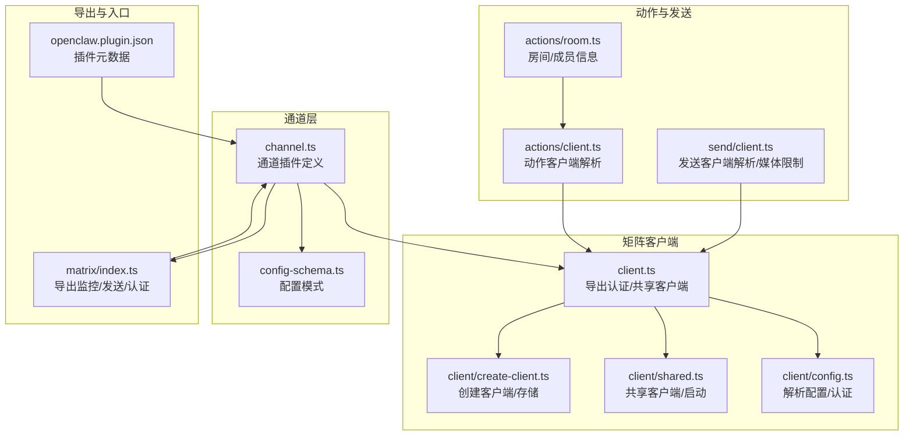
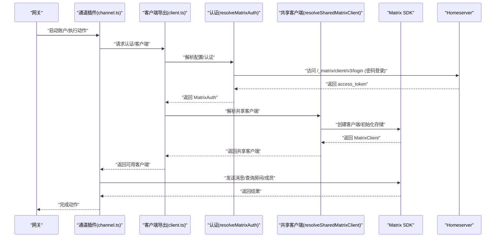
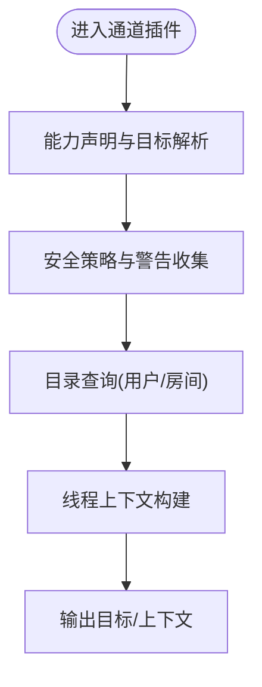
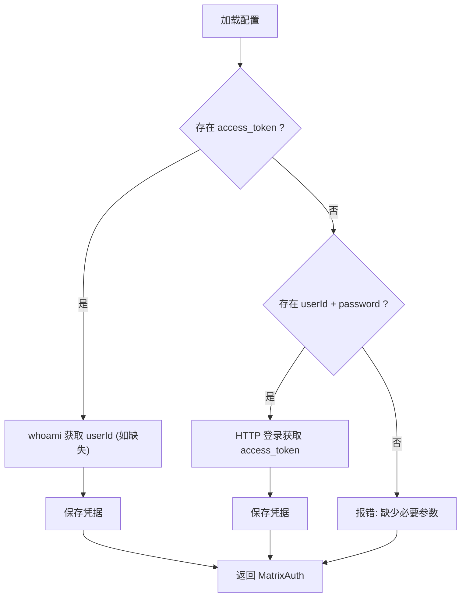
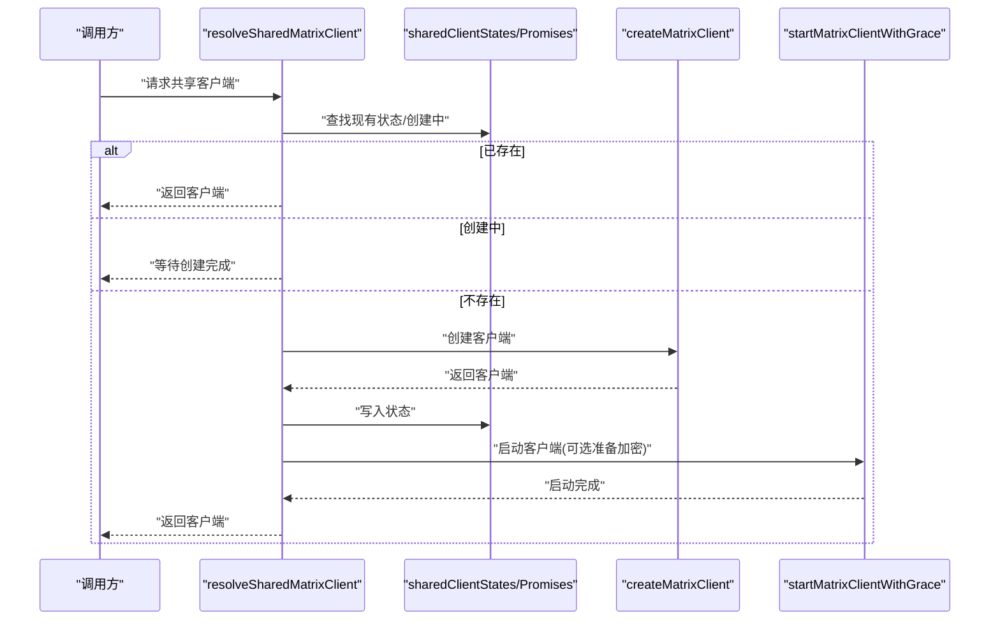
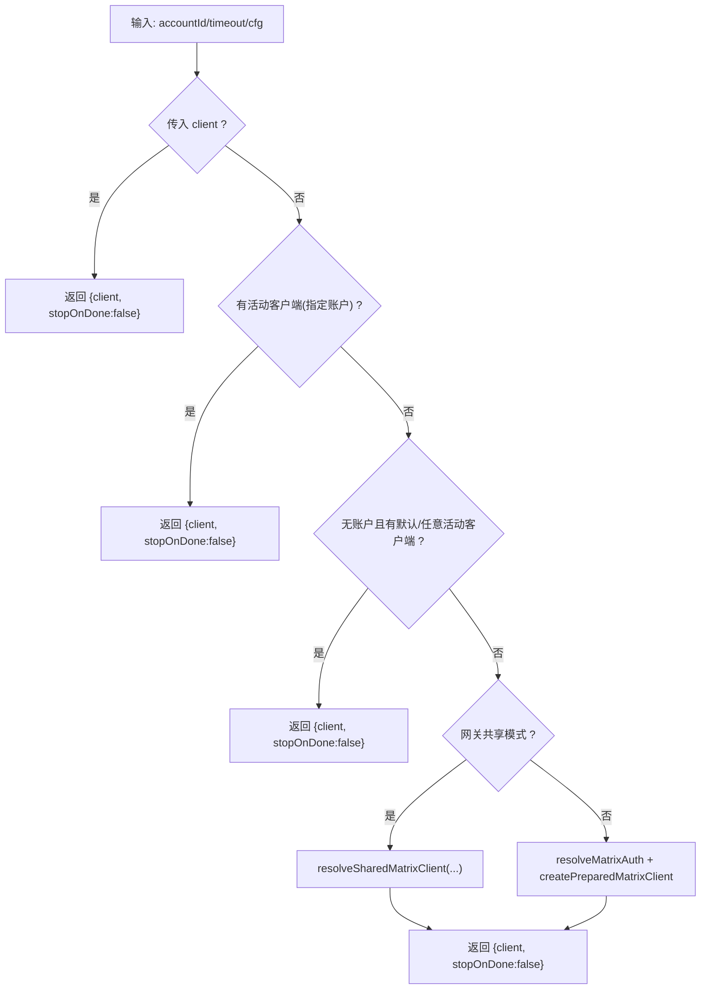
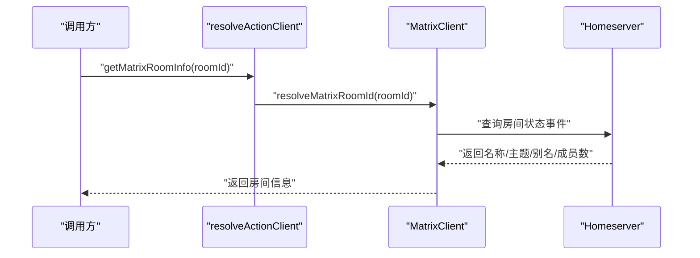
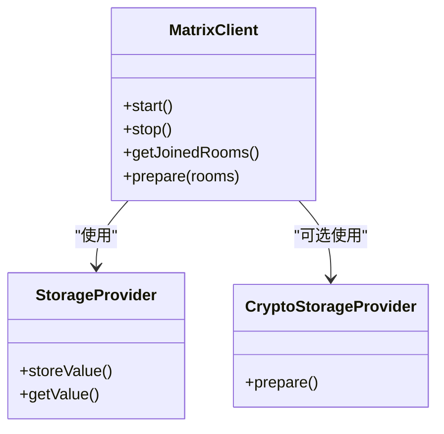
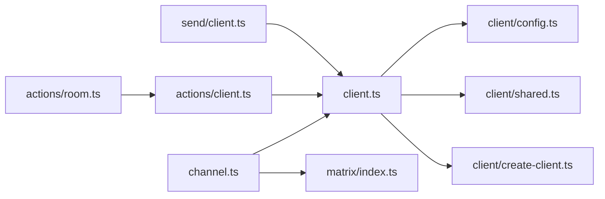

# Matrix 渠道

<cite>
**本文引用的文件**
- [extensions/matrix/src/channel.ts](file://extensions/matrix/src/channel.ts)
- [extensions/matrix/src/config-schema.ts](file://extensions/matrix/src/config-schema.ts)
- [extensions/matrix/src/matrix/index.ts](file://extensions/matrix/src/matrix/index.ts)
- [extensions/matrix/src/matrix/client.ts](file://extensions/matrix/src/matrix/client.ts)
- [extensions/matrix/src/matrix/client/config.ts](file://extensions/matrix/src/matrix/client/config.ts)
- [extensions/matrix/src/matrix/client/create-client.ts](file://extensions/matrix/src/matrix/client/create-client.ts)
- [extensions/matrix/src/matrix/client/shared.ts](file://extensions/matrix/src/matrix/client/shared.ts)
- [extensions/matrix/src/matrix/actions/client.ts](file://extensions/matrix/src/matrix/actions/client.ts)
- [extensions/matrix/src/matrix/actions/room.ts](file://extensions/matrix/src/matrix/actions/room.ts)
- [extensions/matrix/src/matrix/send/client.ts](file://extensions/matrix/src/matrix/send/client.ts)
- [extensions/matrix/openclaw.plugin.json](file://extensions/matrix/openclaw.plugin.json)
</cite>

## 目录
1. [简介](#简介)
2. [项目结构](#项目结构)
3. [核心组件](#核心组件)
4. [架构总览](#架构总览)
5. [详细组件分析](#详细组件分析)
6. [依赖关系分析](#依赖关系分析)
7. [性能考量](#性能考量)
8. [故障排查指南](#故障排查指南)
9. [结论](#结论)
10. [附录](#附录)

## 简介
本文件为 Matrix 渠道集成的综合技术文档，面向需要在 OpenClaw 生态中接入 Matrix 分布式网络的工程师与运维人员。文档围绕以下主题展开：
- Matrix 分布式网络与 Homeserver 概念
- 客户端令牌配置与认证流程
- 房间权限管理与策略控制
- 加密消息处理与存储
- 房间类型支持（直接消息、群组聊天、公共频道）
- 消息格式转换、附件处理与富文本渲染
- 身份验证与安全注意事项
- 配置示例、常见问题与性能优化建议

## 项目结构
Matrix 渠道插件位于扩展目录下，核心入口为通道插件定义，配套实现包括：
- 通道插件与能力声明：负责账户生命周期、配置校验、状态探测、目标解析与目录查询等
- 客户端与认证：封装 homeserver、用户凭证、访问令牌与密码登录逻辑
- 共享客户端与同步：多账号共享客户端、启动与停止、加密准备
- 发送与动作：消息发送、房间/成员信息查询、媒体大小限制解析
- 配置模式：基于 Zod 的配置模式定义，覆盖 Markdown、DM、群组策略、自动加入等

**图表来源**
- [extensions/matrix/src/channel.ts:132-462](file://extensions/matrix/src/channel.ts#L132-L462)
- [extensions/matrix/src/config-schema.ts:34-63](file://extensions/matrix/src/config-schema.ts#L34-L63)
- [extensions/matrix/src/matrix/index.ts:1-12](file://extensions/matrix/src/matrix/index.ts#L1-L12)
- [extensions/matrix/src/matrix/client.ts:1-15](file://extensions/matrix/src/matrix/client.ts#L1-L15)
- [extensions/matrix/src/matrix/client/config.ts:36-101](file://extensions/matrix/src/matrix/client/config.ts#L36-L101)
- [extensions/matrix/src/matrix/client/create-client.ts:39-126](file://extensions/matrix/src/matrix/client/create-client.ts#L39-L126)
- [extensions/matrix/src/matrix/client/shared.ts:107-174](file://extensions/matrix/src/matrix/client/shared.ts#L107-L174)
- [extensions/matrix/src/matrix/actions/client.ts:15-47](file://extensions/matrix/src/matrix/actions/client.ts#L15-L47)
- [extensions/matrix/src/matrix/actions/room.ts:5-86](file://extensions/matrix/src/matrix/actions/room.ts#L5-L86)
- [extensions/matrix/src/matrix/send/client.ts:52-100](file://extensions/matrix/src/matrix/send/client.ts#L52-L100)
- [extensions/matrix/openclaw.plugin.json:1-9](file://extensions/matrix/openclaw.plugin.json#L1-L9)

**章节来源**
- [extensions/matrix/src/channel.ts:132-462](file://extensions/matrix/src/channel.ts#L132-L462)
- [extensions/matrix/src/config-schema.ts:34-63](file://extensions/matrix/src/config-schema.ts#L34-L63)
- [extensions/matrix/src/matrix/index.ts:1-12](file://extensions/matrix/src/matrix/index.ts#L1-L12)
- [extensions/matrix/src/matrix/client.ts:1-15](file://extensions/matrix/src/matrix/client.ts#L1-L15)
- [extensions/matrix/src/matrix/client/config.ts:36-101](file://extensions/matrix/src/matrix/client/config.ts#L36-L101)
- [extensions/matrix/src/matrix/client/create-client.ts:39-126](file://extensions/matrix/src/matrix/client/create-client.ts#L39-L126)
- [extensions/matrix/src/matrix/client/shared.ts:107-174](file://extensions/matrix/src/matrix/client/shared.ts#L107-L174)
- [extensions/matrix/src/matrix/actions/client.ts:15-47](file://extensions/matrix/src/matrix/actions/client.ts#L15-L47)
- [extensions/matrix/src/matrix/actions/room.ts:5-86](file://extensions/matrix/src/matrix/actions/room.ts#L5-L86)
- [extensions/matrix/src/matrix/send/client.ts:52-100](file://extensions/matrix/src/matrix/send/client.ts#L52-L100)
- [extensions/matrix/openclaw.plugin.json:1-9](file://extensions/matrix/openclaw.plugin.json#L1-L9)

## 核心组件
- 通道插件与能力
  - 插件元数据、配对标识、能力清单（支持直接消息、群组、线程、投票、反应、媒体）
  - 配置模式构建、账户描述、安全警告收集
  - 目标解析、目录查询（用户与房间）、线程上下文构建
  - 状态探测、运行时快照、网关启动流程（含并发启动互斥）

- 认证与配置
  - 多账号配置合并与回退（账户级优先，其次顶层）
  - 支持环境变量回退（HOMESERVER、USER ID、ACCESS TOKEN、PASSWORD、DEVICE NAME）
  - 访问令牌优先；若无则使用密码登录并缓存令牌
  - whoami 获取用户 ID 并持久化凭据

- 共享客户端与同步
  - 基于 homeserver、用户、令牌、是否启用加密、账户键生成唯一键
  - 单例化管理，避免重复创建；支持并发启动去重
  - 启动时可准备加密（如已加入房间），错误记录但不中断

- 发送与动作
  - 动作客户端解析：优先复用活动客户端，否则共享或新建
  - 发送客户端解析：支持默认账户优先、任意活动客户端兜底
  - 媒体大小限制解析：账户级优先，其次顶层，单位换算为字节

**章节来源**
- [extensions/matrix/src/channel.ts:132-462](file://extensions/matrix/src/channel.ts#L132-L462)
- [extensions/matrix/src/matrix/client/config.ts:36-101](file://extensions/matrix/src/matrix/client/config.ts#L36-L101)
- [extensions/matrix/src/matrix/client/shared.ts:107-174](file://extensions/matrix/src/matrix/client/shared.ts#L107-L174)
- [extensions/matrix/src/matrix/actions/client.ts:15-47](file://extensions/matrix/src/matrix/actions/client.ts#L15-L47)
- [extensions/matrix/src/matrix/send/client.ts:52-100](file://extensions/matrix/src/matrix/send/client.ts#L52-L100)

## 架构总览
下图展示从通道插件到客户端、共享客户端、SDK 初始化与发送调用的整体交互。

**图表来源**
- [extensions/matrix/src/channel.ts:418-462](file://extensions/matrix/src/channel.ts#L418-L462)
- [extensions/matrix/src/matrix/client.ts:3-15](file://extensions/matrix/src/matrix/client.ts#L3-L15)
- [extensions/matrix/src/matrix/client/config.ts:103-245](file://extensions/matrix/src/matrix/client/config.ts#L103-L245)
- [extensions/matrix/src/matrix/client/shared.ts:107-174](file://extensions/matrix/src/matrix/client/shared.ts#L107-L174)
- [extensions/matrix/src/matrix/index.ts:1-12](file://extensions/matrix/src/matrix/index.ts#L1-L12)

## 详细组件分析

### 通道插件与能力
- 能力与目标
  - 支持 chatTypes: direct/group/thread
  - 支持 reactions、polls、threads、media
  - 目标规范化与提示（支持 room/alias/user 形态）
- 安全与策略
  - DM 策略解析器与允许列表归一化
  - 收集“开放群组策略”警告并给出修复建议
- 目录与解析
  - 列举用户与房间（支持 live 查询）
  - 解析目标（支持 matrix:、!、@、#、room:、channel:、user: 前缀）
- 线程上下文
  - 根据 MessageThreadId 或 ReplyToId 构建当前线程上下文

**图表来源**
- [extensions/matrix/src/channel.ts:143-217](file://extensions/matrix/src/channel.ts#L143-L217)
- [extensions/matrix/src/channel.ts:164-184](file://extensions/matrix/src/channel.ts#L164-L184)
- [extensions/matrix/src/channel.ts:218-302](file://extensions/matrix/src/channel.ts#L218-L302)
- [extensions/matrix/src/channel.ts:189-201](file://extensions/matrix/src/channel.ts#L189-L201)

**章节来源**
- [extensions/matrix/src/channel.ts:132-462](file://extensions/matrix/src/channel.ts#L132-L462)

### 认证与配置解析
- 配置合并与回退
  - 账户级配置优先，未设置时回退至顶层配置
  - 对嵌套对象（如 dm、actions）进行深合并，保证部分覆盖仍保留基础字段
- 环境变量回退
  - 支持 MATRIX_HOMESERVER、MATRIX_USER_ID、MATRIX_ACCESS_TOKEN、MATRIX_PASSWORD、MATRIX_DEVICE_NAME
- 登录与令牌缓存
  - 若已有 access_token：可通过 whoami 补齐 userId 并持久化
  - 若无 access_token：使用密码登录获取 access_token 并保存
- 错误处理
  - 缺少必要参数时抛出明确错误
  - 登录失败时返回错误文本

**图表来源**
- [extensions/matrix/src/matrix/client/config.ts:36-101](file://extensions/matrix/src/matrix/client/config.ts#L36-L101)
- [extensions/matrix/src/matrix/client/config.ts:103-245](file://extensions/matrix/src/matrix/client/config.ts#L103-L245)

**章节来源**
- [extensions/matrix/src/matrix/client/config.ts:36-101](file://extensions/matrix/src/matrix/client/config.ts#L36-L101)
- [extensions/matrix/src/matrix/client/config.ts:103-245](file://extensions/matrix/src/matrix/client/config.ts#L103-L245)

### 共享客户端与同步
- 唯一键构建
  - 由 homeserver、userId、accessToken、是否加密、账户键拼接而成
- 单例化与并发控制
  - 使用 Map 存储状态，Promise Map 避免重复创建
  - 启动去重：同一键仅一次启动任务
- 启动与加密准备
  - 可选准备加密（如已加入房间），错误记录但不中断
  - 启动后标记 started/cryptoReady

**图表来源**
- [extensions/matrix/src/matrix/client/shared.ts:107-174](file://extensions/matrix/src/matrix/client/shared.ts#L107-L174)

**章节来源**
- [extensions/matrix/src/matrix/client/shared.ts:107-174](file://extensions/matrix/src/matrix/client/shared.ts#L107-L174)

### 发送与动作客户端
- 动作客户端解析
  - 优先使用已激活客户端；网关共享模式下解析共享客户端
  - 无共享模式时解析认证并创建准备好的客户端
- 发送客户端解析
  - 优先特定账户活动客户端；无则默认账户；最后兜底任意活动客户端
  - 支持共享客户端与新建客户端两种路径
- 媒体大小限制
  - 账户级优先，其次顶层，单位换算为字节

**图表来源**
- [extensions/matrix/src/matrix/actions/client.ts:15-47](file://extensions/matrix/src/matrix/actions/client.ts#L15-L47)
- [extensions/matrix/src/matrix/send/client.ts:52-100](file://extensions/matrix/src/matrix/send/client.ts#L52-L100)

**章节来源**
- [extensions/matrix/src/matrix/actions/client.ts:15-47](file://extensions/matrix/src/matrix/actions/client.ts#L15-L47)
- [extensions/matrix/src/matrix/send/client.ts:52-100](file://extensions/matrix/src/matrix/send/client.ts#L52-L100)

### 房间与成员信息查询
- 成员信息
  - 通过客户端获取用户资料（显示名、头像），可选指定房间以获取房间维度信息占位
- 房间信息
  - 获取名称、主题、规范别名、加入成员数等状态事件
  - 异常忽略，确保稳健性

**图表来源**
- [extensions/matrix/src/matrix/actions/room.ts:34-86](file://extensions/matrix/src/matrix/actions/room.ts#L34-L86)

**章节来源**
- [extensions/matrix/src/matrix/actions/room.ts:5-86](file://extensions/matrix/src/matrix/actions/room.ts#L5-L86)

### 客户端创建与存储
- 存储提供者
  - 使用 SimpleFsStorageProvider 写入本地文件系统
  - 可选 RustSdkCryptoStorageProvider（SQLite）用于端到端加密
- 加密准备
  - 捕获设备列表异常条目，避免崩溃
- 日志与兼容
  - 统一日志配置，兼容不同运行时

**图表来源**
- [extensions/matrix/src/matrix/client/create-client.ts:39-126](file://extensions/matrix/src/matrix/client/create-client.ts#L39-L126)

**章节来源**
- [extensions/matrix/src/matrix/client/create-client.ts:39-126](file://extensions/matrix/src/matrix/client/create-client.ts#L39-L126)

## 依赖关系分析
- 通道插件依赖客户端导出与内部模块（配置、共享客户端、发送）
- 客户端模块之间存在清晰分层：配置解析 → 客户端创建 → 共享客户端管理
- 动作与发送模块均依赖客户端解析逻辑，形成统一的客户端生命周期管理

**图表来源**
- [extensions/matrix/src/channel.ts:132-462](file://extensions/matrix/src/channel.ts#L132-L462)
- [extensions/matrix/src/matrix/client.ts:1-15](file://extensions/matrix/src/matrix/client.ts#L1-15)
- [extensions/matrix/src/matrix/index.ts:1-12](file://extensions/matrix/src/matrix/index.ts#L1-L12)
- [extensions/matrix/src/matrix/actions/client.ts:15-47](file://extensions/matrix/src/matrix/actions/client.ts#L15-L47)
- [extensions/matrix/src/matrix/send/client.ts:52-100](file://extensions/matrix/src/matrix/send/client.ts#L52-L100)
- [extensions/matrix/src/matrix/actions/room.ts:5-86](file://extensions/matrix/src/matrix/actions/room.ts#L5-L86)

**章节来源**
- [extensions/matrix/src/channel.ts:132-462](file://extensions/matrix/src/channel.ts#L132-L462)
- [extensions/matrix/src/matrix/client.ts:1-15](file://extensions/matrix/src/matrix/client.ts#L1-15)
- [extensions/matrix/src/matrix/index.ts:1-12](file://extensions/matrix/src/matrix/index.ts#L1-L12)
- [extensions/matrix/src/matrix/actions/client.ts:15-47](file://extensions/matrix/src/matrix/actions/client.ts#L15-L47)
- [extensions/matrix/src/matrix/send/client.ts:52-100](file://extensions/matrix/src/matrix/send/client.ts#L52-L100)
- [extensions/matrix/src/matrix/actions/room.ts:5-86](file://extensions/matrix/src/matrix/actions/room.ts#L5-L86)

## 性能考量
- 启动互斥与共享客户端
  - 通过全局锁与共享客户端单例，避免并发动态导入与重复创建带来的资源浪费
- 同步与加密准备
  - 启动阶段可准备加密，减少后续首次解密开销；异常不影响整体启动
- 媒体大小限制
  - 明确媒体上限，避免超大附件导致内存压力
- 运行时选择
  - 动作/发送客户端解析优先复用活动客户端，降低连接与握手成本

[本节为通用性能建议，无需具体文件引用]

## 故障排查指南
- 启动互斥与动态导入
  - 若出现启动竞争，检查启动序列与锁释放逻辑
- 认证失败
  - 确认 homeserver、userId、accessToken 或 password 配置正确
  - 密码登录失败会返回服务器错误文本，需根据响应排查
- 共享客户端未启动
  - 检查共享客户端状态映射与启动去重逻辑
- 加密准备失败
  - 观察日志中的设备列表异常条目处理与错误记录
- 目标解析异常
  - 确认目标字符串前缀与形态符合规范（matrix:、!、@、#、room:、channel:、user:）

**章节来源**
- [extensions/matrix/src/channel.ts:418-462](file://extensions/matrix/src/channel.ts#L418-L462)
- [extensions/matrix/src/matrix/client/config.ts:103-245](file://extensions/matrix/src/matrix/client/config.ts#L103-L245)
- [extensions/matrix/src/matrix/client/shared.ts:107-174](file://extensions/matrix/src/matrix/client/shared.ts#L107-L174)
- [extensions/matrix/src/matrix/client/create-client.ts:88-122](file://extensions/matrix/src/matrix/client/create-client.ts#L88-L122)

## 结论
Matrix 渠道集成在 OpenClaw 中通过模块化的通道插件与客户端层实现，具备完善的认证、共享客户端、加密准备与动作/发送能力。其配置模式覆盖了房间策略、Markdown 渲染、自动加入、媒体限制等关键场景，并提供了稳健的状态探测与安全警告收集。按本文档的配置与最佳实践，可在多账号与多房间场景下稳定运行。

[本节为总结性内容，无需具体文件引用]

## 附录

### 配置示例与要点
- 基础配置项
  - homeserver：Matrix Homeserver 地址
  - userId / accessToken：优先使用访问令牌；若无则需提供 userId 与 password
  - deviceName：设备显示名称（登录时使用）
  - initialSyncLimit：初始同步限制（数字）
  - encryption：是否启用端到端加密
- 策略与权限
  - groupPolicy：群组策略（如 allowlist）
  - groupAllowFrom：允许触发群组的来源列表
  - dm.policy / dm.allowFrom：直接消息策略与允许列表
  - rooms/groups：房间级策略（允许、提及要求、工具策略、用户白名单等）
- Markdown 与线程
  - markdown：Markdown 渲染配置
  - replyToMode：回复模式（off/first/all）
  - threadReplies：线程回复策略（off/inbound/always）
- 自动加入与媒体
  - autoJoin / autoJoinAllowlist：自动加入策略与白名单
  - mediaMaxMb：媒体最大大小（MB）

**章节来源**
- [extensions/matrix/src/config-schema.ts:34-63](file://extensions/matrix/src/config-schema.ts#L34-L63)
- [extensions/matrix/src/matrix/client/config.ts:60-90](file://extensions/matrix/src/matrix/client/config.ts#L60-L90)

### 插件元数据
- 插件 ID 与通道键一致，支持快速启动与文档链接

**章节来源**
- [extensions/matrix/openclaw.plugin.json:1-9](file://extensions/matrix/openclaw.plugin.json#L1-L9)