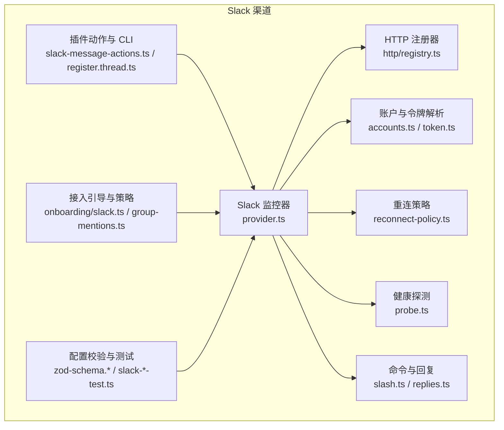
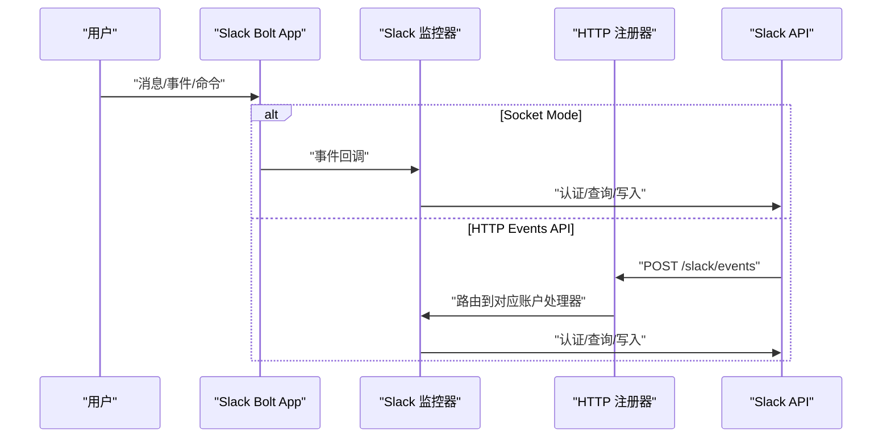
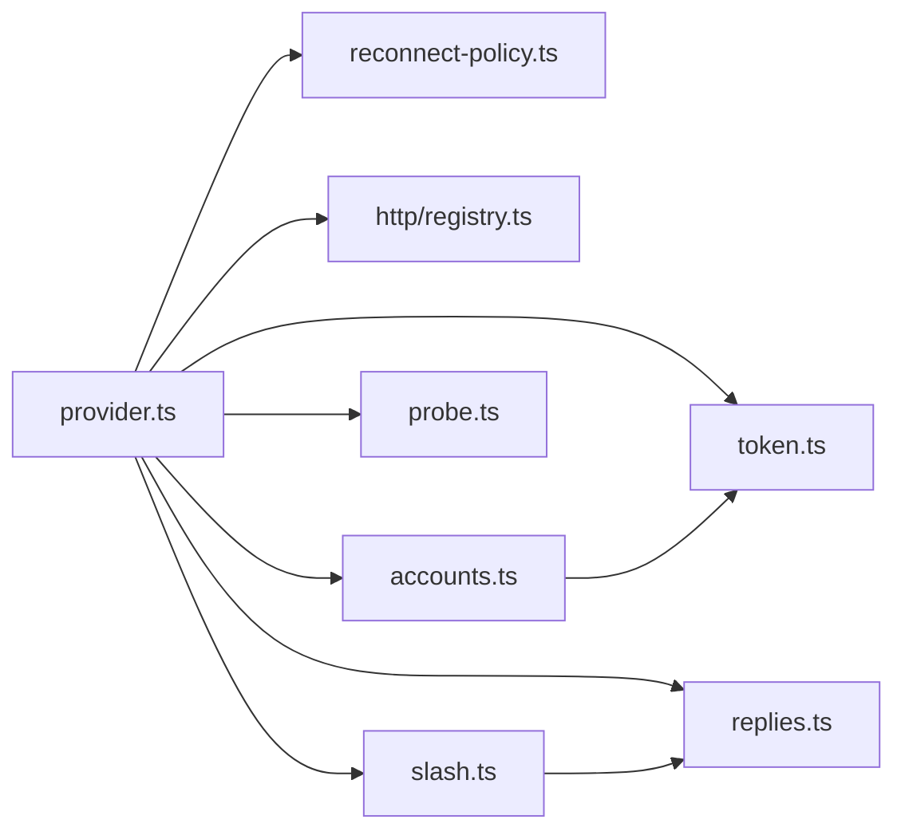

# Slack 渠道

<cite>
**本文引用的文件**
- [docs/channels/slack.md](file://docs/channels/slack.md)
- [src/slack/monitor/provider.ts](file://src/slack/monitor/provider.ts)
- [src/slack/monitor/reconnect-policy.ts](file://src/slack/monitor/reconnect-policy.ts)
- [src/slack/http/registry.ts](file://src/slack/http/registry.ts)
- [src/slack/accounts.ts](file://src/slack/accounts.ts)
- [src/slack/token.ts](file://src/slack/token.ts)
- [src/slack/probe.ts](file://src/slack/probe.ts)
- [src/slack/monitor/slash.ts](file://src/slack/monitor/slash.ts)
- [src/slack/monitor/replies.ts](file://src/slack/monitor/replies.ts)
- [src/plugin-sdk/slack-message-actions.ts](file://src/plugin-sdk/slack-message-actions.ts)
- [src/channels/plugins/onboarding/slack.ts](file://src/channels/plugins/onboarding/slack.ts)
- [src/channels/plugins/group-mentions.ts](file://src/channels/plugins/group-mentions.ts)
- [src/config/zod-schema.providers-core.ts](file://src/config/zod-schema.providers-core.ts)
- [src/config/zod-schema.secret-input-validation.ts](file://src/config/zod-schema.secret-input-validation.ts)
- [src/config/slack-token-validation.test.ts](file://src/config/slack-token-validation.test.ts)
- [src/config/slack-http-config.test.ts](file://src/config/slack-http-config.test.ts)
- [src/cli/program/message/register.thread.ts](file://src/cli/program/message/register.thread.ts)
- [src/plugin-sdk/reply-payload.test.ts](file://src/plugin-sdk/reply-payload.test.ts)
</cite>

## 目录
1. [简介](#简介)
2. [项目结构](#项目结构)
3. [核心组件](#核心组件)
4. [架构总览](#架构总览)
5. [详细组件分析](#详细组件分析)
6. [依赖关系分析](#依赖关系分析)
7. [性能考量](#性能考量)
8. [故障排除指南](#故障排除指南)
9. [结论](#结论)
10. [附录](#附录)

## 简介
本文件面向在 OpenClaw 中集成 Slack 渠道的工程与运维人员，系统性说明以下内容：
- Slack 应用配置与两种连接模式（Socket Mode 与 HTTP Events API）的设置流程
- 令牌模型（botToken、appToken、userToken）与权限范围配置
- 环境变量与配置优先级
- 访问控制策略（DM Policy、Channel Policy）与提及过滤机制
- 命令系统（原生 Slash 命令与单命令模式）、线程管理与回复标签
- 媒体处理、文本分块与交付目标配置
- 故障排除与配置参考清单

## 项目结构
围绕 Slack 渠道的核心实现分布在如下模块：
- 文档与指引：docs/channels/slack.md
- 运行时监控与事件处理：src/slack/monitor/*
- HTTP 路由注册：src/slack/http/registry.ts
- 账户与令牌解析：src/slack/accounts.ts、src/slack/token.ts
- 健康探测：src/slack/probe.ts
- 命令与回复处理：src/slack/monitor/slash.ts、src/slack/monitor/replies.ts
- 插件动作与 CLI：src/plugin-sdk/slack-message-actions.ts、src/cli/program/message/register.thread.ts
- 接入引导与策略：src/channels/plugins/onboarding/slack.ts、src/channels/plugins/group-mentions.ts
- 配置校验与测试：src/config/zod-schema.providers-core.ts、src/config/zod-schema.secret-input-validation.ts、src/config/slack-token-validation.test.ts、src/config/slack-http-config.test.ts

图表来源
- [src/slack/monitor/provider.ts:97-509](file://src/slack/monitor/provider.ts#L97-L509)
- [src/slack/http/registry.ts:1-49](file://src/slack/http/registry.ts#L1-L49)
- [src/slack/accounts.ts:47-101](file://src/slack/accounts.ts#L47-L101)
- [src/slack/token.ts:1-30](file://src/slack/token.ts#L1-L30)
- [src/slack/monitor/reconnect-policy.ts:1-109](file://src/slack/monitor/reconnect-policy.ts#L1-L109)
- [src/slack/probe.ts:12-45](file://src/slack/probe.ts#L12-L45)
- [src/slack/monitor/slash.ts:400-436](file://src/slack/monitor/slash.ts#L400-L436)
- [src/slack/monitor/replies.ts:139-184](file://src/slack/monitor/replies.ts#L139-L184)
- [src/plugin-sdk/slack-message-actions.ts:33-81](file://src/plugin-sdk/slack-message-actions.ts#L33-L81)
- [src/channels/plugins/onboarding/slack.ts:156-197](file://src/channels/plugins/onboarding/slack.ts#L156-L197)
- [src/channels/plugins/group-mentions.ts:132-159](file://src/channels/plugins/group-mentions.ts#L132-L159)
- [src/config/zod-schema.providers-core.ts:934-972](file://src/config/zod-schema.providers-core.ts#L934-L972)
- [src/config/zod-schema.secret-input-validation.ts:74-102](file://src/config/zod-schema.secret-input-validation.ts#L74-L102)
- [src/config/slack-token-validation.test.ts:1-72](file://src/config/slack-token-validation.test.ts#L1-L72)
- [src/config/slack-http-config.test.ts:1-57](file://src/config/slack-http-config.test.ts#L1-L57)

章节来源
- [docs/channels/slack.md:1-555](file://docs/channels/slack.md#L1-L555)
- [src/slack/monitor/provider.ts:97-509](file://src/slack/monitor/provider.ts#L97-L509)

## 核心组件
- Slack 监控器：负责初始化 App（Socket Mode 或 HTTP），注册事件与命令处理器，解析账户与令牌，执行通道与用户白名单解析，并维护连接状态与重连策略。
- HTTP 注册器：统一管理 Slack Webhook 路径注册与分发，支持多账户不同路径。
- 账户与令牌解析：合并全局与账户级配置，解析环境变量回退，标准化令牌类型。
- 重连策略：定义 Socket Mode 的指数退避与非恢复性错误检测。
- 健康探测：对 Slack API 执行 auth.test，返回状态与耗时。
- 命令与回复：处理 Slash 命令授权、提及过滤、线程与回复标签、文本分块与媒体发送。
- 插件动作与 CLI：提供 sendMessage/react 等动作接口与线程回复 CLI。

章节来源
- [src/slack/monitor/provider.ts:97-509](file://src/slack/monitor/provider.ts#L97-L509)
- [src/slack/http/registry.ts:1-49](file://src/slack/http/registry.ts#L1-L49)
- [src/slack/accounts.ts:47-101](file://src/slack/accounts.ts#L47-L101)
- [src/slack/token.ts:1-30](file://src/slack/token.ts#L1-L30)
- [src/slack/monitor/reconnect-policy.ts:1-109](file://src/slack/monitor/reconnect-policy.ts#L1-L109)
- [src/slack/probe.ts:12-45](file://src/slack/probe.ts#L12-L45)
- [src/slack/monitor/slash.ts:400-436](file://src/slack/monitor/slash.ts#L400-L436)
- [src/slack/monitor/replies.ts:139-184](file://src/slack/monitor/replies.ts#L139-L184)
- [src/plugin-sdk/slack-message-actions.ts:33-81](file://src/plugin-sdk/slack-message-actions.ts#L33-L81)
- [src/cli/program/message/register.thread.ts:38-55](file://src/cli/program/message/register.thread.ts#L38-L55)

## 架构总览
下图展示 Socket Mode 与 HTTP 模式的关键交互：

图表来源
- [src/slack/monitor/provider.ts:188-232](file://src/slack/monitor/provider.ts#L188-L232)
- [src/slack/http/registry.ts:38-49](file://src/slack/http/registry.ts#L38-L49)

章节来源
- [docs/channels/slack.md:24-121](file://docs/channels/slack.md#L24-L121)
- [src/slack/monitor/provider.ts:188-232](file://src/slack/monitor/provider.ts#L188-L232)

## 详细组件分析

### Slack 应用与连接模式
- Socket Mode（默认）：需要 botToken 与 appToken；启用 Socket Mode 并安装应用后获取。
- HTTP Events API：需要 botToken 与 signingSecret；设置事件订阅与交互 URL 到同一路径（默认 /slack/events）。
- 多账户 HTTP：为每个账户配置唯一 webhookPath，避免冲突。

章节来源
- [docs/channels/slack.md:27-121](file://docs/channels/slack.md#L27-L121)
- [src/slack/monitor/provider.ts:130-149](file://src/slack/monitor/provider.ts#L130-L149)
- [src/slack/http/registry.ts:17-23](file://src/slack/http/registry.ts#L17-L23)

### 令牌模型与环境变量
- 令牌类型与用途
  - botToken：必须用于 Socket Mode 与 HTTP 模式
  - appToken：Socket Mode 必需，用于 connections:write
  - userToken：可选，用于读操作；可通过 userTokenReadOnly 控制写权限
- 环境变量回退
  - 默认账户仅支持 SLACK_BOT_TOKEN、SLACK_APP_TOKEN、SLACK_USER_TOKEN 回退
  - 其他账户不支持环境回退，需显式配置
- 配置优先级
  - 账户级配置覆盖全局配置；未配置时按上述规则回退

章节来源
- [docs/channels/slack.md:123-134](file://docs/channels/slack.md#L123-L134)
- [src/slack/accounts.ts:56-77](file://src/slack/accounts.ts#L56-L77)
- [src/slack/token.ts:10-29](file://src/slack/token.ts#L10-L29)
- [src/config/slack-token-validation.test.ts:5-35](file://src/config/slack-token-validation.test.ts#L5-L35)

### 权限范围与 Manifest 示例
- Bot 权限示例（含聊天、历史、反应、贴图、文件等）
- User 权限示例（读取频道/群组/私信历史、用户信息、反应、贴图、搜索等）
- 事件订阅建议：app_mention、message.*、reaction_*、member_*、channel_rename、pin_*

章节来源
- [docs/channels/slack.md:340-431](file://docs/channels/slack.md#L340-L431)

### 访问控制策略（DM Policy 与 Channel Policy）
- DM Policy
  - pairing（默认）、allowlist、open（需 allowFrom 包含 "*"）、disabled
  - 支持 dm.enabled、dm.groupEnabled、dm.groupChannels
- Channel Policy
  - open、allowlist、disabled
  - per-channel 控制：requireMention、users、allowBots、skills、systemPrompt、tools/*、toolsBySender
- 名称匹配开关
  - dangerouslyAllowNameMatching：默认关闭，仅在必要时开启

章节来源
- [docs/channels/slack.md:136-205](file://docs/channels/slack.md#L136-L205)
- [src/channels/plugins/onboarding/slack.ts:183-197](file://src/channels/plugins/onboarding/slack.ts#L183-L197)
- [src/channels/plugins/group-mentions.ts:132-159](file://src/channels/plugins/group-mentions.ts#L132-L159)

### 提及过滤与通道用户
- 默认按提及过滤（显式 app mention、正则模式、回复线程）
- per-channel requireMention 可覆盖默认行为
- 支持 per-channel users 白名单与 tools 策略

章节来源
- [docs/channels/slack.md:184-204](file://docs/channels/slack.md#L184-L204)
- [src/slack/monitor/slash.ts:400-436](file://src/slack/monitor/slash.ts#L400-L436)

### 命令系统（原生 Slash 命令与单命令模式）
- 原生命令：需显式开启 channels.slack.commands.native 或全局 commands.native
- 单命令模式：channels.slack.slashCommand.enabled=true 时，使用单一命令名
- 会话键隔离：agent:<agentId>:slack:slash:<userId>
- 参数菜单渲染策略：按钮/静态选择/外部选择/确认对话框

章节来源
- [docs/channels/slack.md:207-233](file://docs/channels/slack.md#L207-L233)
- [src/slack/monitor/slash.ts:400-436](file://src/slack/monitor/slash.ts#L400-L436)

### 线程管理与回复标签
- 会话路由：DM=direct、Channel=channel、MPIM=group
- 线程会话后缀：当适用时追加 ":thread:<threadTs>"
- replyToMode：off（默认）、first、all；支持按聊天类型覆盖
- 显式回复标签：[[reply_to_current]]、[[reply_to:<id>]]
- 注意：replyToMode="off" 会禁用所有回复线程（包括显式标签）

章节来源
- [docs/channels/slack.md:234-255](file://docs/channels/slack.md#L234-L255)
- [src/cli/program/message/register.thread.ts:38-55](file://src/cli/program/message/register.thread.ts#L38-L55)

### 媒体处理、文本分块与交付目标
- 入站附件：从 Slack 私有 URL 下载并写入媒体存储（受大小限制）
- 出站文本：textChunkLimit（默认 4000），chunkMode="newline" 启用段落优先拆分
- 出站文件：使用 Slack 上传 API，支持 thread_ts
- 媒体上限：channels.slack.mediaMaxMb 控制；未配置时遵循媒体管道默认
- 交付目标：user:<id>、channel:<id>；DM 通过对话 API 打开

章节来源
- [docs/channels/slack.md:256-282](file://docs/channels/slack.md#L256-L282)
- [src/slack/monitor/replies.ts:139-184](file://src/slack/monitor/replies.ts#L139-L184)
- [src/plugin-sdk/reply-payload.test.ts:1-58](file://src/plugin-sdk/reply-payload.test.ts#L1-L58)

### 插件动作与工具集
- 动作组：messages、reactions、pins、memberInfo、emojiList
- sendMessage：支持 message、blocks、media 与 threadId/replyTo；不支持同时传 blocks 与 media
- react：支持移除表情

章节来源
- [docs/channels/slack.md:284-298](file://docs/channels/slack.md#L284-L298)
- [src/plugin-sdk/slack-message-actions.ts:33-81](file://src/plugin-sdk/slack-message-actions.ts#L33-L81)

### Socket Mode 重连与健康
- 退避策略：初始 2s，最大 30s，因子 1.8，抖动 0.25，最多 12 次
- 非恢复性错误：如 invalid_auth、token_revoked 等，直接失败不再重试
- 连接状态上报：连接/断开/错误事件更新 lastEventAt/lastError

章节来源
- [src/slack/monitor/reconnect-policy.ts:1-109](file://src/slack/monitor/reconnect-policy.ts#L1-L109)
- [src/slack/monitor/provider.ts:414-508](file://src/slack/monitor/provider.ts#L414-L508)

### HTTP 模式与 Webhook 路由
- HTTPReceiver 使用 signingSecret 与 endpoints
- 请求体限制与超时保护
- 路由注册：normalizeSlackWebhookPath 统一路径格式，避免重复注册

章节来源
- [src/slack/monitor/provider.ts:188-232](file://src/slack/monitor/provider.ts#L188-L232)
- [src/slack/http/registry.ts:17-36](file://src/slack/http/registry.ts#L17-L36)

### 健康探测与诊断
- probeSlack：auth.test 返回 bot 与 team 信息，带耗时与状态
- 建议：channels status --probe、logs --follow、doctor

章节来源
- [src/slack/probe.ts:12-45](file://src/slack/probe.ts#L12-L45)
- [docs/channels/slack.md:433-451](file://docs/channels/slack.md#L433-L451)

## 依赖关系分析

图表来源
- [src/slack/monitor/provider.ts:1-521](file://src/slack/monitor/provider.ts#L1-L521)
- [src/slack/monitor/reconnect-policy.ts:1-109](file://src/slack/monitor/reconnect-policy.ts#L1-L109)
- [src/slack/http/registry.ts:1-49](file://src/slack/http/registry.ts#L1-L49)
- [src/slack/accounts.ts:1-123](file://src/slack/accounts.ts#L1-L123)
- [src/slack/token.ts:1-30](file://src/slack/token.ts#L1-L30)
- [src/slack/probe.ts:1-45](file://src/slack/probe.ts#L1-L45)
- [src/slack/monitor/slash.ts:400-436](file://src/slack/monitor/slash.ts#L400-L436)
- [src/slack/monitor/replies.ts:139-184](file://src/slack/monitor/replies.ts#L139-L184)

章节来源
- [src/slack/monitor/provider.ts:1-521](file://src/slack/monitor/provider.ts#L1-L521)

## 性能考量
- 文本分块：默认 4000 字符；段落优先拆分可提升阅读体验
- 媒体上限：合理设置 mediaMaxMb，避免大文件阻塞
- 重连退避：避免频繁重试导致资源占用
- HTTP 限流：请求体保护与超时，防止异常流量放大

## 故障排除指南
- 无回复（频道）
  - 检查 groupPolicy、通道 allowlist、requireMention、per-channel users
  - 使用 channels status --probe、logs --follow、doctor 定位
- DM 被忽略
  - 检查 dm.enabled、dmPolicy、配对/allowFrom
  - 使用 pairing list slack 查看配对状态
- Socket 模式无法连接
  - 校验 bot/app 令牌与 Slack 应用 Socket Mode 开启
- HTTP 模式未接收事件
  - 校验 signingSecret、webhookPath、Slack Request URLs、多账户路径唯一性
- 原生/Slaash 命令未触发
  - 确认是否启用 native 命令或单命令模式，检查 commands.useAccessGroups 与 allowlist

章节来源
- [docs/channels/slack.md:433-490](file://docs/channels/slack.md#L433-L490)

## 结论
OpenClaw 对 Slack 的集成提供了生产就绪的能力：Socket Mode 默认稳定，HTTP 模式灵活适配；完善的令牌与配置体系、访问控制与提及过滤、命令与线程管理、媒体与文本分块，以及详尽的故障排除与健康探测，能够满足从个人到企业级的多样化需求。

## 附录

### 配置参考清单（高信号字段）
- 模式与鉴权：mode、botToken、appToken、signingSecret、webhookPath、accounts.*
- DM 访问：dm.enabled、dmPolicy、allowFrom、dm.groupEnabled、dm.groupChannels
- 兼容开关：dangerouslyAllowNameMatching
- 通道访问：groupPolicy、channels.*、channels.*.users、channels.*.requireMention
- 线程与历史：replyToMode、replyToModeByChatType、thread.*、historyLimit、dmHistoryLimit、dms.*.historyLimit
- 交付与特性：textChunkLimit、chunkMode、mediaMaxMb、streaming、nativeStreaming、configWrites、commands.native、slashCommand.*、actions.*、userToken、userTokenReadOnly

章节来源
- [docs/channels/slack.md:533-555](file://docs/channels/slack.md#L533-L555)