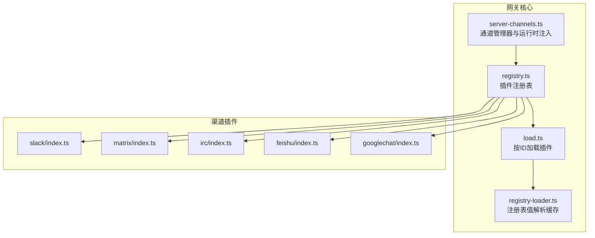
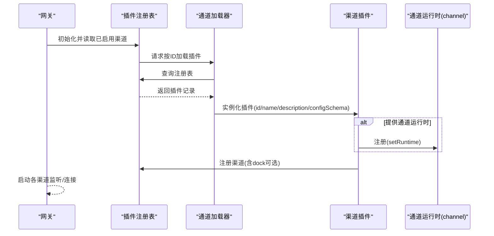
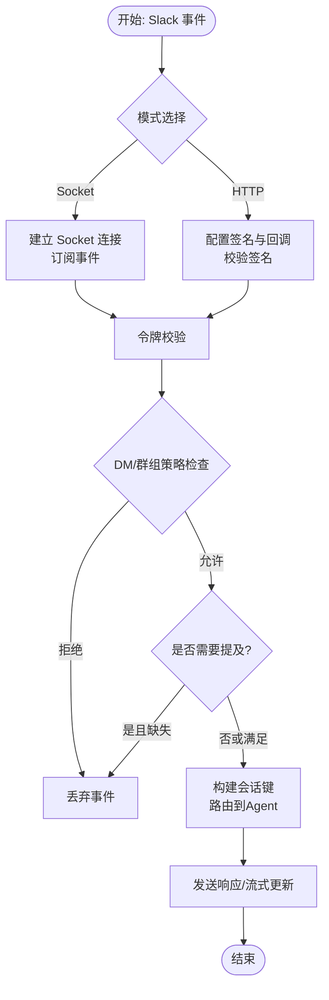
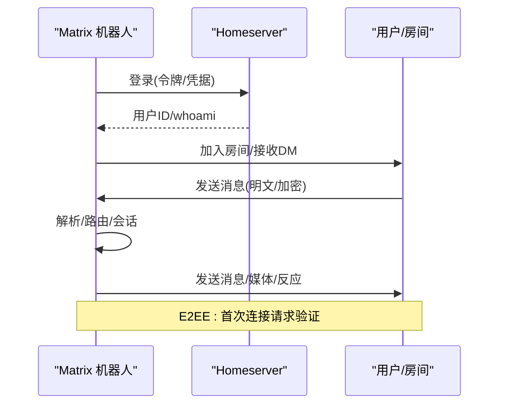
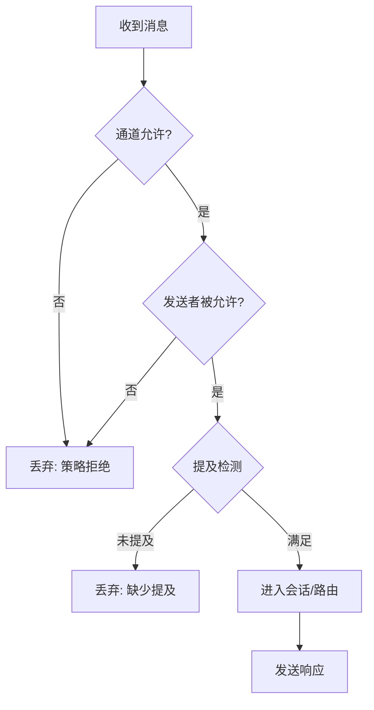
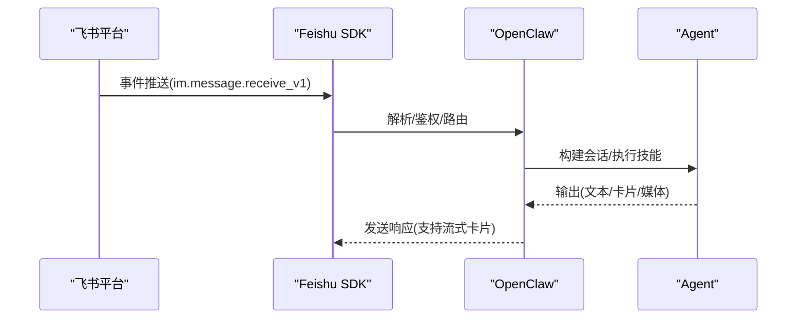
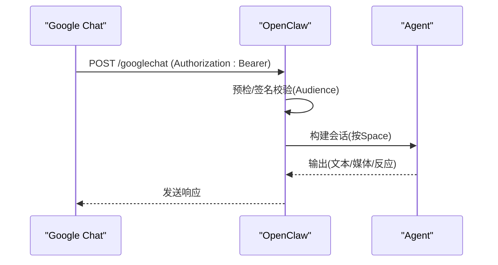
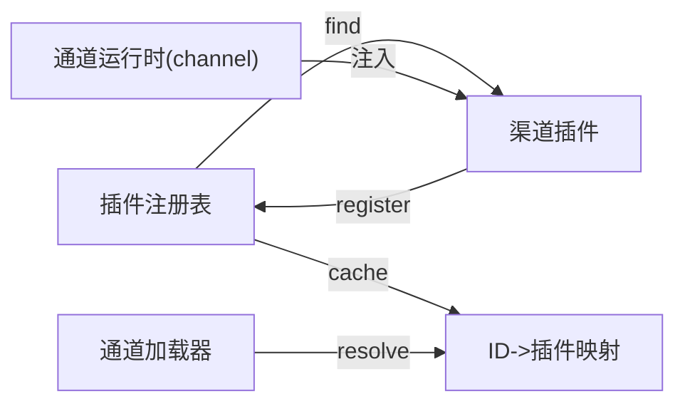

# 其他渠道

<cite>
**本文引用的文件**
- [slack.md](file://docs/channels/slack.md)
- [matrix.md](file://docs/channels/matrix.md)
- [irc.md](file://docs/channels/irc.md)
- [feishu.md](file://docs/channels/feishu.md)
- [googlechat.md](file://docs/channels/googlechat.md)
- [slack/index.ts](file://extensions/slack/index.ts)
- [matrix/index.ts](file://extensions/matrix/index.ts)
- [irc/index.ts](file://extensions/irc/index.ts)
- [feishu/index.ts](file://extensions/feishu/index.ts)
- [googlechat/index.ts](file://extensions/googlechat/index.ts)
- [server-channels.ts](file://src/gateway/server-channels.ts)
- [registry.ts](file://src/plugins/registry.ts)
- [load.ts](file://src/channels/plugins/load.ts)
- [registry-loader.ts](file://src/channels/plugins/registry-loader.ts)
- [plugin-sdk.md](file://docs/zh-CN/refactor/plugin-sdk.md)
</cite>

## 目录
1. [简介](#简介)
2. [项目结构](#项目结构)
3. [核心组件](#核心组件)
4. [架构总览](#架构总览)
5. [详细组件分析](#详细组件分析)
6. [依赖关系分析](#依赖关系分析)
7. [性能考量](#性能考量)
8. [故障排查指南](#故障排查指南)
9. [结论](#结论)
10. [附录](#附录)

## 简介
本文件面向希望在 OpenClaw 中集成或扩展即时通讯渠道的开发者，系统梳理 Slack、Matrix、IRC、飞书（Feishu/Lark）、Google Chat 等渠道的接入方式、配置要点、消息格式与权限模型、安全与性能注意事项，并提供扩展新渠道的通用开发指南与模板路径。

## 项目结构
OpenClaw 将“渠道”以“插件”的形式组织，核心通道管理器负责加载与注册插件，插件内部封装各自平台的认证、事件订阅、消息收发与会话路由逻辑。文档侧则为每个渠道提供“快速上手、配置参考、权限与安全、功能特性与限制、排障”等完整说明。

**图示来源**
- [server-channels.ts:59-98](file://src/gateway/server-channels.ts#L59-L98)
- [registry.ts:402-428](file://src/plugins/registry.ts#L402-L428)
- [load.ts:1-8](file://src/channels/plugins/load.ts#L1-L8)
- [registry-loader.ts:1-35](file://src/channels/plugins/registry-loader.ts#L1-L35)
- [slack/index.ts:1-18](file://extensions/slack/index.ts#L1-L18)
- [matrix/index.ts:1-23](file://extensions/matrix/index.ts#L1-L23)
- [irc/index.ts:1-18](file://extensions/irc/index.ts#L1-L18)
- [feishu/index.ts:1-66](file://extensions/feishu/index.ts#L1-L66)
- [googlechat/index.ts:1-18](file://extensions/googlechat/index.ts#L1-L18)

**章节来源**
- [server-channels.ts:59-98](file://src/gateway/server-channels.ts#L59-L98)
- [registry.ts:402-428](file://src/plugins/registry.ts#L402-L428)
- [load.ts:1-8](file://src/channels/plugins/load.ts#L1-L8)
- [registry-loader.ts:1-35](file://src/channels/plugins/registry-loader.ts#L1-L35)

## 核心组件
- 通道插件注册与加载
  - 插件通过统一入口导出对象，注册到插件注册表；注册表维护插件与渠道映射，并支持按ID加载。
  - 通道管理器可选择性注入“通道运行时”（channel runtime），使外部插件能复用统一的SDK能力（如AI调度、路由、文本处理等）。
- 渠道能力与配置
  - 每个渠道插件暴露 id、名称、描述、配置Schema，并在注册时声明其能力边界（如是否支持房间、线程、媒体、反应等）。
- 平台特性与安全
  - 各渠道在文档中明确认证方式（令牌/密钥/服务账号）、事件订阅/回调、会话与线程模型、媒体大小限制、提及/允许列表策略、打字指示与流式输出等。

**章节来源**
- [slack/index.ts:1-18](file://extensions/slack/index.ts#L1-L18)
- [matrix/index.ts:1-23](file://extensions/matrix/index.ts#L1-L23)
- [irc/index.ts:1-18](file://extensions/irc/index.ts#L1-L18)
- [feishu/index.ts:1-66](file://extensions/feishu/index.ts#L1-L66)
- [googlechat/index.ts:1-18](file://extensions/googlechat/index.ts#L1-L18)
- [server-channels.ts:59-98](file://src/gateway/server-channels.ts#L59-L98)
- [registry.ts:402-428](file://src/plugins/registry.ts#L402-L428)

## 架构总览
下图展示 OpenClaw 如何通过“插件注册表 + 通道管理器”加载各渠道插件，并在运行时注入统一的通道运行时，以实现跨渠道的一致行为与能力。

**图示来源**
- [registry.ts:402-428](file://src/plugins/registry.ts#L402-L428)
- [load.ts:1-8](file://src/channels/plugins/load.ts#L1-L8)
- [slack/index.ts:11-14](file://extensions/slack/index.ts#L11-L14)
- [matrix/index.ts:12-18](file://extensions/matrix/index.ts#L12-L18)
- [irc/index.ts:11-13](file://extensions/irc/index.ts#L11-L13)
- [feishu/index.ts:53-62](file://extensions/feishu/index.ts#L53-L62)
- [googlechat/index.ts:11-13](file://extensions/googlechat/index.ts#L11-L13)

## 详细组件分析

### Slack 渠道
- 接入模式
  - 支持 Socket Mode 与 HTTP Events API 两种模式；默认 Socket Mode，HTTP 模式需配置签名密钥与唯一 webhook 路径。
- 认证与作用域
  - Socket Mode 需要 App Token 与 Bot Token；HTTP 模式需要 Bot Token 与 Signing Secret；可配置 userToken 用于读写场景差异控制。
- 权限与路由
  - DM 策略：pairing/allowlist/open/disabled；支持分账户继承与覆盖；群组策略：open/allowlist/disabled；支持按频道设置 requireMention/users/allowBots/tools 等。
- 功能特性
  - 媒体下载/上传、文本分片、线程与回复标签、打字指示、反应、钉板、成员变更、块交互与视图事件等。
  - 支持原生流式输出（Assistant Streams），可配置流式行为与回退策略。
- 安全与合规
  - 建议最小权限授权；对敏感操作使用 userToken 并限制只读；注意签名验证与请求来源校验。
- 配置要点
  - 关键字段：mode、botToken、appToken/signingSecret、webhookPath、accounts.*、dmPolicy、groupPolicy、channels.*、thread.*、mediaMaxMb、streaming、nativeStreaming 等。

**图示来源**
- [slack.md:24-121](file://docs/channels/slack.md#L24-L121)
- [slack.md:136-205](file://docs/channels/slack.md#L136-L205)
- [slack.md:298-340](file://docs/channels/slack.md#L298-L340)
- [slack.md:492-555](file://docs/channels/slack.md#L492-L555)

**章节来源**
- [slack.md:1-555](file://docs/channels/slack.md#L1-L555)
- [slack/index.ts:1-18](file://extensions/slack/index.ts#L1-L18)

### Matrix 渠道
- 接入模式
  - 作为插件安装，登录任意 Homeserver 作为用户；支持 DM、房间、线程、媒体、反应、投票（发送/开始文本）、位置、端到端加密（E2EE）。
- 认证与加密
  - 使用访问令牌或用户名+密码登录；支持 E2EE，首次连接请求设备验证；加密模块缺失时会降级并告警。
- 多账户与路由
  - 支持多账户，每账户独立运行；DM 默认共享主会话，房间映射为群组会话；支持自动加入与白名单。
- 权限与安全
  - DM 默认 pairing；房间默认 allowlist 且按需提及；支持 per-room sender allowlist；建议开启 TLS 与最小权限。
- 配置要点
  - 关键字段：homeserver、accessToken/password、encryption、dm.policy、groupPolicy、groups.*、autoJoin/autoJoinAllowlist、threadReplies、replyToMode、mediaMaxMb、accounts.*、actions.* 等。

**图示来源**
- [matrix.md:1-304](file://docs/channels/matrix.md#L1-L304)
- [matrix/index.ts:1-23](file://extensions/matrix/index.ts#L1-L23)

**章节来源**
- [matrix.md:1-304](file://docs/channels/matrix.md#L1-L304)
- [matrix/index.ts:1-23](file://extensions/matrix/index.ts#L1-L23)

### IRC 渠道
- 接入模式
  - 作为扩展插件配置于主配置；支持经典频道与私信；默认 TLS；支持 NickServ 身份识别与一次性注册。
- 权限与路由
  - 两道“闸门”：通道访问（groupPolicy + groups）与发送者访问（groupAllowFrom/每频道 allowFrom）；默认按提及触发；支持 per-channel requireMention=false。
- 安全与工具限制
  - 公共频道开放 allowFrom:* 需谨慎，建议通过 tools/toolsBySender 对不同来源施加差异化工具策略。
- 配置要点
  - 关键字段：host/port/tls/nick/channels；dmPolicy/groupPolicy；groupAllowFrom；groups["#channel"].*；nickserv.*；dangerouslyAllowNameMatching；toolsBySender 等。

**图示来源**
- [irc.md:46-186](file://docs/channels/irc.md#L46-L186)

**章节来源**
- [irc.md:1-242](file://docs/channels/irc.md#L1-L242)
- [irc/index.ts:1-18](file://extensions/irc/index.ts#L1-L18)

### 飞书（Feishu/Lark）渠道
- 接入模式
  - 通过 WebSocket 事件长连接接收消息，无需公网 webhook；支持多账户与多租户（国内/国际域名）。
- 认证与权限
  - 应用凭证（App ID/Secret）+ 事件订阅；支持 per-account 凭证与域名覆盖；可配置 typingIndicator/resolveSenderNames 降低配额消耗。
- 权限与路由
  - DM 默认 pairing；群组默认 open（可改为 allowlist/disabled）；支持 requireMention 控制自动回复；支持 per-group sender allowlist。
- 功能特性
  - 支持富文本卡片流式输出（blockStreaming 可控）；媒体上传/下载；反应；多代理路由（bindings）。
- 配置要点
  - 关键字段：domain/connectionMode/defaultAccount/verificationToken/webhookPath/webhookHost/webhookPort；accounts.*.{appId,appSecret,domain}；dmPolicy/groupPolicy/groupAllowFrom/groups.*.{requireMention,allowFrom}；textChunkLimit/mediaMaxMb/streaming/blockStreaming；actions.* 等。

**图示来源**
- [feishu.md:1-652](file://docs/channels/feishu.md#L1-L652)
- [feishu/index.ts:1-66](file://extensions/feishu/index.ts#L1-L66)

**章节来源**
- [feishu.md:1-652](file://docs/channels/feishu.md#L1-L652)
- [feishu/index.ts:1-66](file://extensions/feishu/index.ts#L1-L66)

### Google Chat（Chat API）渠道
- 接入模式
  - 仅支持 HTTP Webhook；需要服务账号与公开 HTTPS 网关；支持 Tailscale Funnel 精准暴露路径。
- 认证与安全
  - Bearer Token 预检 + Audience 校验（app-url/project-number）；支持 authorizationEventObject 严格预检；附件下载经 Chat API 存储到媒体管道。
- 权限与路由
  - DM 默认 pairing；群空间默认 requireMention；支持 botUser 辅助提及检测；支持 per-space sender allowlist。
- 配置要点
  - 关键字段：serviceAccountFile/serviceAccountRef/audienceType/audience/webhookPath；dm.policy/dm.allowFrom；groupPolicy/groups.*.{allow,requireMention,users,systemPrompt}；actions.reactions；typingIndicator；mediaMaxMb；accounts.*.serviceAccountRef 等。

**图示来源**
- [googlechat.md:1-262](file://docs/channels/googlechat.md#L1-L262)
- [googlechat/index.ts:1-18](file://extensions/googlechat/index.ts#L1-L18)

**章节来源**
- [googlechat.md:1-262](file://docs/channels/googlechat.md#L1-L262)
- [googlechat/index.ts:1-18](file://extensions/googlechat/index.ts#L1-L18)

## 依赖关系分析
- 插件注册与发现
  - 插件注册表维护已启用渠道插件清单，按ID查询并缓存；加载器基于注册表返回具体插件实例。
- 通道运行时注入
  - 通道管理器可选择性注入统一的“通道运行时”，使外部插件复用 SDK 能力（AI调度、路由、文本处理等），提升一致性与可维护性。
- 渠道间共性
  - 所有渠道均遵循“策略优先”原则：先判断是否允许（DM/群组/来源），再决定是否需要提及，最后进入会话与路由。

**图示来源**
- [registry.ts:402-428](file://src/plugins/registry.ts#L402-L428)
- [registry-loader.ts:1-35](file://src/channels/plugins/registry-loader.ts#L1-L35)
- [load.ts:1-8](file://src/channels/plugins/load.ts#L1-L8)
- [server-channels.ts:59-98](file://src/gateway/server-channels.ts#L59-L98)

**章节来源**
- [registry.ts:402-428](file://src/plugins/registry.ts#L402-L428)
- [registry-loader.ts:1-35](file://src/channels/plugins/registry-loader.ts#L1-L35)
- [load.ts:1-8](file://src/channels/plugins/load.ts#L1-L8)
- [server-channels.ts:59-98](file://src/gateway/server-channels.ts#L59-L98)

## 性能考量
- 流式输出
  - Slack/Feishu/Google Chat 等支持流式输出，可显著改善用户体验；需根据平台能力与网络状况调整流式策略与回退机制。
- 媒体与分片
  - 合理设置 textChunkLimit 与 mediaMaxMb，避免超限导致失败或延迟；优先使用平台上传接口以减少中间存储。
- 事件与鉴权
  - 在 HTTP 模式下，优先进行轻量预检（如 Bearer 预检）再解析完整请求体，缩短关键路径。
- 多账户与并发
  - 多账户启动应串行化以避免模块导入竞争；合理拆分任务队列，避免阻塞主事件循环。

## 故障排查指南
- Slack
  - 无回复：检查 groupPolicy、频道 allowlist、requireMention、用户 allowlist；使用诊断命令与日志定位。
  - Socket/HTTP 不通：核对令牌、签名密钥、回调路径与事件订阅。
- Matrix
  - 无回复/解密失败：确认 E2EE 开启与设备验证；检查加密模块可用性与存储路径。
- IRC
  - 无回复：确认 groupPolicy 与 groupAllowFrom；若需免提及自动回复，设置 requireMention=false。
- 飞书
  - 无消息：确认应用已发布、事件订阅包含 receive_v1、长连接已启用、权限齐全。
- Google Chat
  - 405/未注册：确认通道已配置、插件启用、网关已重启；核对 Audience 与回调 URL。

**章节来源**
- [slack.md:433-490](file://docs/channels/slack.md#L433-L490)
- [matrix.md:248-272](file://docs/channels/matrix.md#L248-L272)
- [irc.md:237-242](file://docs/channels/irc.md#L237-L242)
- [feishu.md:450-480](file://docs/channels/feishu.md#L450-L480)
- [googlechat.md:209-256](file://docs/channels/googlechat.md#L209-L256)

## 结论
通过统一的插件架构与通道运行时，OpenClaw 为 Slack、Matrix、IRC、飞书、Google Chat 等渠道提供了标准化的接入体验。开发者可依据各渠道的认证方式、事件模型与权限策略，结合统一的配置与运行时能力，快速完成集成与扩展。

## 附录

### 渠道对比概览
- Slack
  - 模式：Socket/HTTP；认证：App/Bot/Signing；特性：线程/媒体/反应/流式；安全：最小权限、签名校验。
- Matrix
  - 模式：插件；认证：令牌/凭据；特性：E2EE/房间/线程/媒体；安全：TLS、最小权限、设备验证。
- IRC
  - 模式：插件；认证：服务器凭据/NickServ；特性：频道/私信/线程；安全：提及/允许列表/工具限制。
- 飞书
  - 模式：WebSocket；认证：App ID/Secret；特性：卡片流式/媒体/反应；安全：权限与配额优化。
- Google Chat
  - 模式：HTTP/Webhook；认证：服务账号/Audience；特性：反应/媒体；安全：Bearer 预检与严格校验。

### 扩展新渠道的通用开发指南
- 插件骨架
  - 创建插件入口，导出 id、name、description、configSchema，并在注册时调用 setRuntime 与 registerChannel。
  - 若需要 Dock（如 Google Chat），在注册时传入 dock。
- 注册与加载
  - 插件由注册表统一管理；加载器按ID解析并实例化；通道管理器可注入通道运行时以复用 SDK 能力。
- 配置与策略
  - 明确认证方式与最小权限；设计 DM/群组/来源三段式策略；提供分片与媒体上限配置；支持多账户与 per-account 覆盖。
- 安全与合规
  - 优先采用签名/令牌预检；限制工具与权限；对敏感操作使用只读 userToken；关注平台速率限制与配额。
- 文档与测试
  - 提供快速上手、配置参考、常见问题与排障流程；编写单元/集成测试覆盖关键路径。

**章节来源**
- [plugin-sdk.md:1-40](file://docs/zh-CN/refactor/plugin-sdk.md#L1-L40)
- [slack/index.ts:1-18](file://extensions/slack/index.ts#L1-L18)
- [matrix/index.ts:1-23](file://extensions/matrix/index.ts#L1-L23)
- [irc/index.ts:1-18](file://extensions/irc/index.ts#L1-L18)
- [feishu/index.ts:1-66](file://extensions/feishu/index.ts#L1-L66)
- [googlechat/index.ts:1-18](file://extensions/googlechat/index.ts#L1-L18)
- [registry.ts:402-428](file://src/plugins/registry.ts#L402-L428)
- [load.ts:1-8](file://src/channels/plugins/load.ts#L1-L8)
- [registry-loader.ts:1-35](file://src/channels/plugins/registry-loader.ts#L1-L35)
- [server-channels.ts:59-98](file://src/gateway/server-channels.ts#L59-L98)