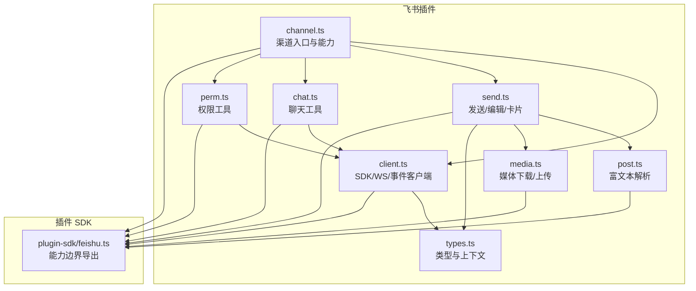
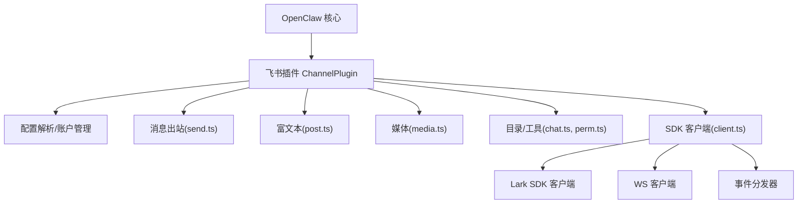
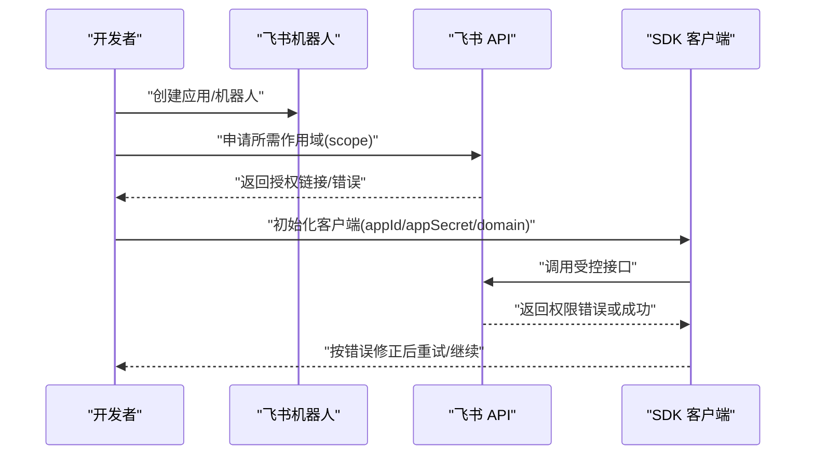
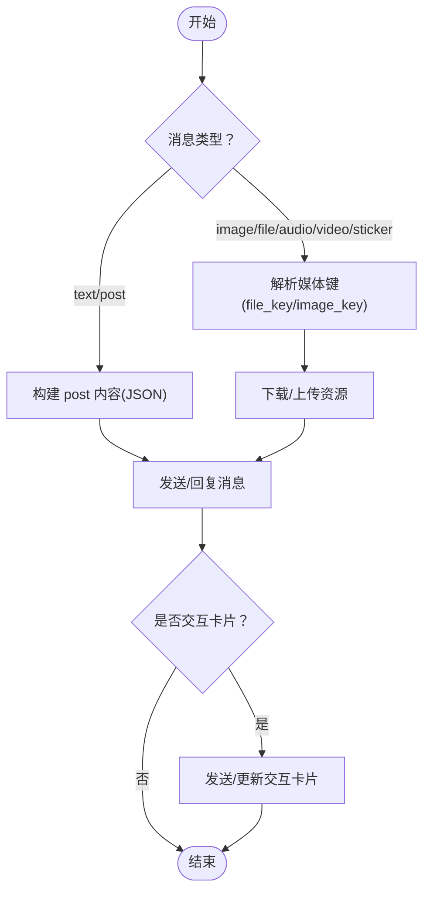
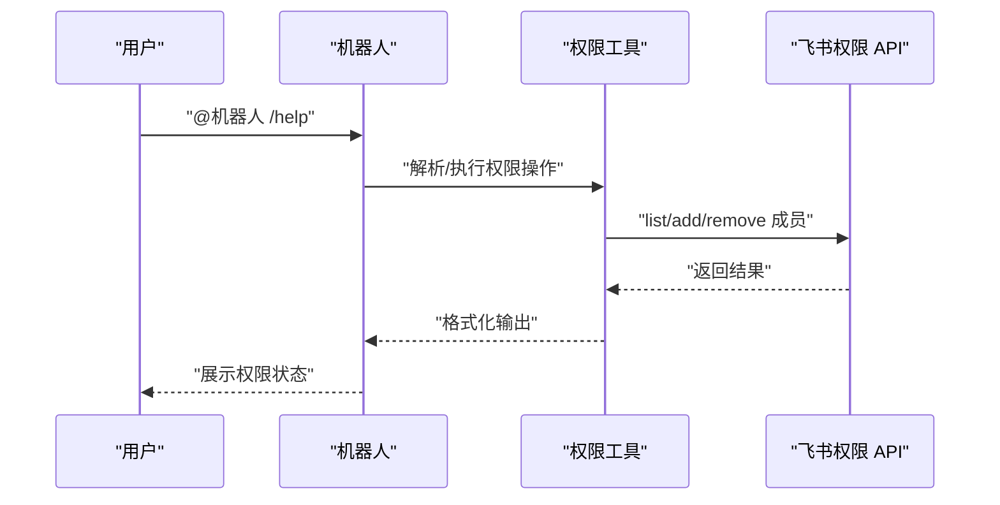
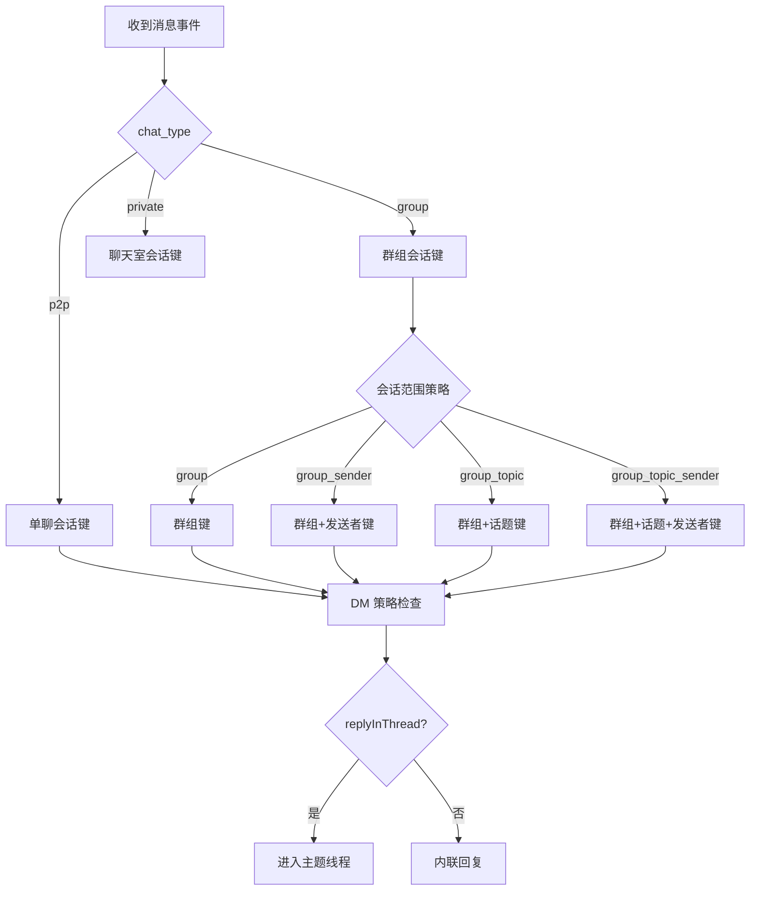
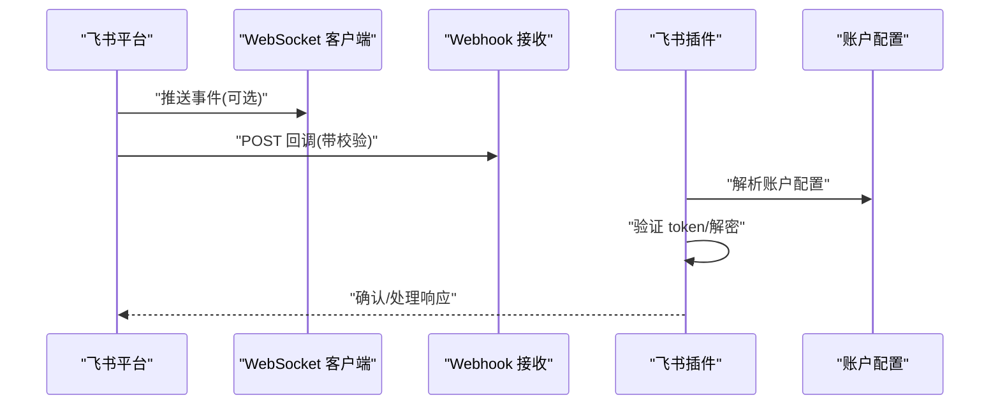
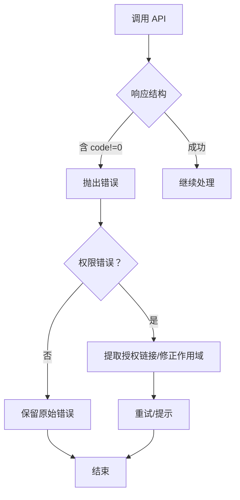
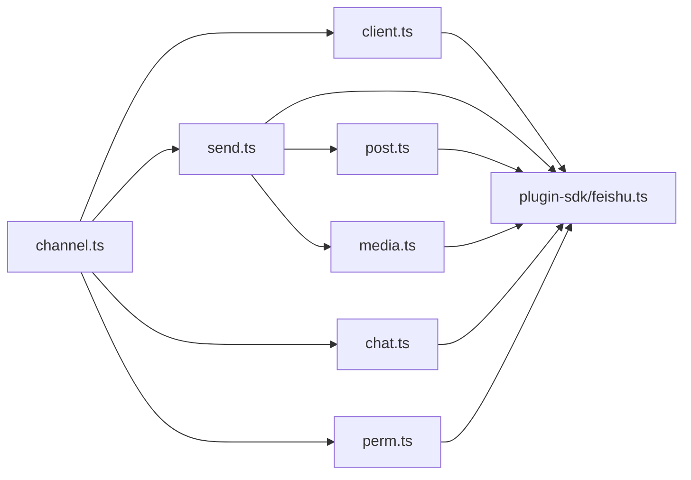

# 飞书渠道

<cite>
**本文引用的文件**
- [extensions/feishu/src/channel.ts](file://extensions/feishu/src/channel.ts)
- [extensions/feishu/src/types.ts](file://extensions/feishu/src/types.ts)
- [extensions/feishu/src/client.ts](file://extensions/feishu/src/client.ts)
- [extensions/feishu/src/send.ts](file://extensions/feishu/src/send.ts)
- [extensions/feishu/src/post.ts](file://extensions/feishu/src/post.ts)
- [extensions/feishu/src/media.ts](file://extensions/feishu/src/media.ts)
- [extensions/feishu/src/chat.ts](file://extensions/feishu/src/chat.ts)
- [extensions/feishu/src/perm.ts](file://extensions/feishu/src/perm.ts)
- [src/plugin-sdk/feishu.ts](file://src/plugin-sdk/feishu.ts)
</cite>

## 目录
1. [简介](#简介)
2. [项目结构](#项目结构)
3. [核心组件](#核心组件)
4. [架构总览](#架构总览)
5. [详细组件分析](#详细组件分析)
6. [依赖关系分析](#依赖关系分析)
7. [性能考量](#性能考量)
8. [故障排查指南](#故障排查指南)
9. [结论](#结论)
10. [附录](#附录)

## 简介
本文件面向飞书（Lark）企业级 IM 渠道的集成与使用，系统性阐述其架构、API 体系、应用与机器人配置、权限申请流程、消息类型与交互卡片支持、用户与部门权限管理、@提醒与免打扰策略、会话类型与权限控制、多企业账号支持、消息回调与安全校验、以及错误处理机制。内容基于仓库中的飞书插件实现进行归纳总结，帮助开发者与运维人员快速理解并正确部署。

## 项目结构
飞书渠道以“插件”形式集成在 OpenClaw 生态中，核心位于 extensions/feishu，并通过 src/plugin-sdk/feishu.ts 对外暴露能力边界。主要模块包括：
- 渠道入口与能力声明：channel.ts
- 类型定义与上下文：types.ts
- 客户端与连接：client.ts（SDK 客户端、WS 客户端、事件分发器）
- 消息发送与编辑：send.ts（文本、卡片、富文本、媒体）
- 富文本解析：post.ts（从 post 内容提取纯文本、提及、媒体键）
- 媒体下载与上传：media.ts（图片、文件、音频、视频等资源）
- 会话与目录工具：chat.ts（聊天信息与成员查询）、perm.ts（权限管理工具）
- 插件 SDK 边界：src/plugin-sdk/feishu.ts（对上层能力的导出）

**图表来源**
- [extensions/feishu/src/channel.ts:85-370](file://extensions/feishu/src/channel.ts#L85-L370)
- [extensions/feishu/src/types.ts:1-90](file://extensions/feishu/src/types.ts#L1-L90)
- [extensions/feishu/src/client.ts:1-197](file://extensions/feishu/src/client.ts#L1-L197)
- [extensions/feishu/src/send.ts:1-478](file://extensions/feishu/src/send.ts#L1-L478)
- [extensions/feishu/src/post.ts:1-275](file://extensions/feishu/src/post.ts#L1-L275)
- [extensions/feishu/src/media.ts:1-497](file://extensions/feishu/src/media.ts#L1-L497)
- [extensions/feishu/src/chat.ts:1-131](file://extensions/feishu/src/chat.ts#L1-L131)
- [extensions/feishu/src/perm.ts:1-177](file://extensions/feishu/src/perm.ts#L1-L177)
- [src/plugin-sdk/feishu.ts:1-83](file://src/plugin-sdk/feishu.ts#L1-L83)

**章节来源**
- [extensions/feishu/src/channel.ts:34-43](file://extensions/feishu/src/channel.ts#L34-L43)
- [src/plugin-sdk/feishu.ts:1-83](file://src/plugin-sdk/feishu.ts#L1-L83)

## 核心组件
- 渠道元数据与能力
  - 渠道 ID、标签、别名、文档路径、排序等由 meta 统一声明；能力包括直聊/频道、主题线程、媒体、反应、编辑、回复等。
- 配置模式
  - 支持全局与多账户配置，包含 appId/appSecret、domain、连接模式（WebSocket/Webhook）、回调主机/路径/端口、DM/群组策略、@策略、会话范围、历史长度、媒体大小限制、渲染模式等。
- 账户解析与默认账户
  - 支持默认账户与命名账户，可启用/禁用、删除、描述、解析 allowFrom。
- 安全与合规
  - 提供 allowlist provider 的安全警告收集，便于识别开放策略风险。
- 网关启动与状态
  - 根据账户配置启动网关（WebSocket 或 Webhook），并生成运行时状态快照与探测结果摘要。

**章节来源**
- [extensions/feishu/src/channel.ts:85-370](file://extensions/feishu/src/channel.ts#L85-L370)
- [extensions/feishu/src/types.ts:23-36](file://extensions/feishu/src/types.ts#L23-L36)

## 架构总览
飞书渠道采用“插件 + SDK 封装”的架构：
- 插件层负责渠道能力声明、配置解析、目录查询、消息出站、状态探测与网关启动。
- SDK 层封装 Lark SDK，提供 HTTP 客户端、WebSocket 客户端与事件分发器，并内置超时与代理支持。
- 上层通过 plugin-sdk/feishu.ts 暴露统一能力，确保与 OpenClaw 其他组件解耦。

**图表来源**
- [extensions/feishu/src/channel.ts:85-370](file://extensions/feishu/src/channel.ts#L85-L370)
- [extensions/feishu/src/client.ts:111-197](file://extensions/feishu/src/client.ts#L111-L197)
- [extensions/feishu/src/send.ts:278-324](file://extensions/feishu/src/send.ts#L278-L324)
- [extensions/feishu/src/post.ts:232-275](file://extensions/feishu/src/post.ts#L232-L275)
- [extensions/feishu/src/media.ts:87-156](file://extensions/feishu/src/media.ts#L87-L156)
- [extensions/feishu/src/chat.ts:74-131](file://extensions/feishu/src/chat.ts#L74-L131)
- [extensions/feishu/src/perm.ts:115-177](file://extensions/feishu/src/perm.ts#L115-L177)

## 详细组件分析

### 应用创建、机器人配置与权限申请
- 应用与机器人
  - 需要准备应用 ID 与应用密钥，并在飞书后台创建自建应用与机器人，获取 app_id 与 app_secret。
  - 可选 domain 支持：feishu、lark 或私有化域名。
- 连接模式
  - 支持 WebSocket 与 Webhook 两种模式；Webhook 需配置 host/port/path。
- 权限与作用域
  - 首次调用相关 API 可能返回权限错误，其中包含授权链接；插件内置对常见错误码与作用域名称差异的修正逻辑，避免重复通知。
- 加密与校验
  - 支持 encryptKey 与 verificationToken，用于事件回调的安全校验与消息解密。

**图表来源**
- [extensions/feishu/src/client.ts:111-147](file://extensions/feishu/src/client.ts#L111-L147)
- [extensions/feishu/src/bot.ts:67-94](file://extensions/feishu/src/bot.ts#L67-L94)

**章节来源**
- [extensions/feishu/src/client.ts:29-37](file://extensions/feishu/src/client.ts#L29-L37)
- [extensions/feishu/src/bot.ts:36-104](file://extensions/feishu/src/bot.ts#L36-L104)

### 消息类型与交互组件
- 文本与富文本
  - 文本消息直接发送；富文本 post 通过 JSON 结构承载多段落与样式，解析为纯文本用于摘要与检索。
- 图片、文件、音视频、贴图
  - 使用 messageResource API 下载消息内的图片/文件；上传时根据扩展名自动推断类型并映射到消息类型。
- 交互卡片
  - 支持发送/更新交互卡片（schema 2.0），卡片内可渲染 Markdown（表格、代码块、链接等）。
- 引用/回复
  - 支持回复到指定消息 ID；若回复目标不可用，自动回退为直接发送。

**图表来源**
- [extensions/feishu/src/post.ts:232-275](file://extensions/feishu/src/post.ts#L232-L275)
- [extensions/feishu/src/media.ts:123-156](file://extensions/feishu/src/media.ts#L123-L156)
- [extensions/feishu/src/send.ts:278-324](file://extensions/feishu/src/send.ts#L278-L324)
- [extensions/feishu/src/send.ts:336-393](file://extensions/feishu/src/send.ts#L336-L393)

**章节来源**
- [extensions/feishu/src/post.ts:1-275](file://extensions/feishu/src/post.ts#L1-L275)
- [extensions/feishu/src/media.ts:1-497](file://extensions/feishu/src/media.ts#L1-L497)
- [extensions/feishu/src/send.ts:1-478](file://extensions/feishu/src/send.ts#L1-L478)

### 用户与部门权限管理、@提醒与免打扰
- 用户与部门权限
  - 提供权限工具（feishu_perm），支持列出/添加/移除对象权限，覆盖文档、表格、文件、知识库、多维表等多种资源类型。
- @提醒
  - 解析消息中的 @ 提及，支持 post 富文本中的提及；发送时可将 mentions 转换为平台兼容的 <at> 标签。
- 免打扰与会话策略
  - 通过配置项控制 DM 策略、群组策略、是否要求 @、会话范围（群组/话题/发送者/话题+发送者）、回复是否进入主题线程等。

**图表来源**
- [extensions/feishu/src/perm.ts:115-177](file://extensions/feishu/src/perm.ts#L115-L177)
- [extensions/feishu/src/bot.ts:454-470](file://extensions/feishu/src/bot.ts#L454-L470)

**章节来源**
- [extensions/feishu/src/perm.ts:1-177](file://extensions/feishu/src/perm.ts#L1-L177)
- [extensions/feishu/src/bot.ts:454-496](file://extensions/feishu/src/bot.ts#L454-L496)

### 会话类型与权限控制策略
- 会话类型
  - p2p（单聊）、group（群聊）、private（聊天室）三类，分别对应不同的消息与权限模型。
- 会话范围与主题线程
  - 支持按群组、发送者、话题、或其组合作为会话键；可配置“回复是否进入主题线程”，实现更清晰的讨论流。
- 权限控制
  - DM 策略（开放/需配对/白名单）、群组策略（开放/白名单/禁用）、允许来源（allowFrom）与群组允许来源（groupAllowFrom）共同构成细粒度访问控制。

**图表来源**
- [extensions/feishu/src/bot.ts:231-307](file://extensions/feishu/src/bot.ts#L231-L307)
- [extensions/feishu/src/channel.ts:116-158](file://extensions/feishu/src/channel.ts#L116-L158)

**章节来源**
- [extensions/feishu/src/bot.ts:177-307](file://extensions/feishu/src/bot.ts#L177-L307)
- [extensions/feishu/src/channel.ts:116-158](file://extensions/feishu/src/channel.ts#L116-L158)

### 多企业账号支持、消息回调与安全校验
- 多企业/多账户
  - 支持默认账户与命名账户；每个账户可独立配置 appId/appSecret/domain/connectionMode/webhook 参数。
- 回调与安全
  - 通过 verificationToken 与 encryptKey 校验事件来源与解密消息；SDK 提供 EventDispatcher。
- 网关启动
  - 根据 connectionMode 启动 WebSocket 或 Webhook；记录运行时端口与状态。

**图表来源**
- [extensions/feishu/src/client.ts:173-178](file://extensions/feishu/src/client.ts#L173-L178)
- [extensions/feishu/src/client.ts:153-168](file://extensions/feishu/src/client.ts#L153-L168)
- [extensions/feishu/src/channel.ts:352-369](file://extensions/feishu/src/channel.ts#L352-L369)

**章节来源**
- [extensions/feishu/src/client.ts:107-197](file://extensions/feishu/src/client.ts#L107-L197)
- [extensions/feishu/src/channel.ts:352-369](file://extensions/feishu/src/channel.ts#L352-L369)

### 错误处理机制
- 权限错误提取与修正
  - 从 API 响应中提取权限错误码与授权链接，修正作用域名称差异，过滤过期提示，避免重复告警。
- 回复目标失效回退
  - 当回复目标不存在或被撤回时，自动回退为直接发送。
- 响应格式适配
  - 对 SDK 返回的多种响应形态（Buffer、ArrayBuffer、Readable、AsyncIterable 等）进行统一读取与错误抛出。

**图表来源**
- [extensions/feishu/src/bot.ts:67-94](file://extensions/feishu/src/bot.ts#L67-L94)
- [extensions/feishu/src/send.ts:14-41](file://extensions/feishu/src/send.ts#L14-L41)
- [extensions/feishu/src/media.ts:25-81](file://extensions/feishu/src/media.ts#L25-L81)

**章节来源**
- [extensions/feishu/src/bot.ts:36-104](file://extensions/feishu/src/bot.ts#L36-L104)
- [extensions/feishu/src/send.ts:14-41](file://extensions/feishu/src/send.ts#L14-L41)
- [extensions/feishu/src/media.ts:25-81](file://extensions/feishu/src/media.ts#L25-L81)

## 依赖关系分析
- 组件耦合
  - channel.ts 作为入口，聚合 client.ts、send.ts、post.ts、media.ts、chat.ts、perm.ts 的能力。
  - send.ts 依赖 post.ts 的富文本解析与 media.ts 的资源下载/上传。
  - client.ts 为所有 API 调用提供统一客户端与 WS/事件能力。
- 外部依赖
  - Lark SDK（@larksuiteoapi/node-sdk）用于 HTTP/WS/事件处理。
  - 插件 SDK（plugin-sdk/feishu.ts）提供统一能力导出与运行时环境。

**图表来源**
- [extensions/feishu/src/channel.ts:85-370](file://extensions/feishu/src/channel.ts#L85-L370)
- [extensions/feishu/src/client.ts:111-197](file://extensions/feishu/src/client.ts#L111-L197)
- [extensions/feishu/src/send.ts:1-478](file://extensions/feishu/src/send.ts#L1-L478)
- [extensions/feishu/src/post.ts:1-275](file://extensions/feishu/src/post.ts#L1-L275)
- [extensions/feishu/src/media.ts:1-497](file://extensions/feishu/src/media.ts#L1-L497)
- [extensions/feishu/src/chat.ts:1-131](file://extensions/feishu/src/chat.ts#L1-L131)
- [extensions/feishu/src/perm.ts:1-177](file://extensions/feishu/src/perm.ts#L1-L177)
- [src/plugin-sdk/feishu.ts:1-83](file://src/plugin-sdk/feishu.ts#L1-L83)

**章节来源**
- [extensions/feishu/src/channel.ts:85-370](file://extensions/feishu/src/channel.ts#L85-L370)
- [src/plugin-sdk/feishu.ts:1-83](file://src/plugin-sdk/feishu.ts#L1-L83)

## 性能考量
- 超时与代理
  - SDK HTTP 实例注入默认请求超时，避免慢响应导致的队列阻塞；支持 HTTPS 代理。
- 缓存与去重
  - 发送者名称缓存、权限错误冷却、消息去重缓存，降低重复 API 调用与告警风暴。
- 媒体传输
  - 媒体下载/上传使用较高超时与临时文件写入，确保大文件稳定传输。
- 速率限制与异常监控
  - 提供内存级速率限制与异常计数器，辅助 Webhook 护栏。

**章节来源**
- [extensions/feishu/src/client.ts:44-61](file://extensions/feishu/src/client.ts#L44-L61)
- [extensions/feishu/src/bot.ts:96-104](file://extensions/feishu/src/bot.ts#L96-L104)
- [extensions/feishu/src/media.ts:12-15](file://extensions/feishu/src/media.ts#L12-L15)
- [src/plugin-sdk/feishu.ts:76-83](file://src/plugin-sdk/feishu.ts#L76-L83)

## 故障排查指南
- 权限不足
  - 观察权限错误提取与修正逻辑，确认授权链接是否有效、作用域名称是否被修正。
- 回复目标无效
  - 若回复失败且命中“撤回/未找到”错误码，插件会自动回退为直接发送，请检查消息 ID 是否仍有效。
- 媒体下载失败
  - 检查 file_key 是否有效、网络与代理配置、临时目录写入权限。
- Webhook 不生效
  - 确认 verificationToken/encryptKey 配置一致、回调路径与端口可达、防火墙放行。

**章节来源**
- [extensions/feishu/src/bot.ts:67-94](file://extensions/feishu/src/bot.ts#L67-L94)
- [extensions/feishu/src/send.ts:14-41](file://extensions/feishu/src/send.ts#L14-L41)
- [extensions/feishu/src/media.ts:123-156](file://extensions/feishu/src/media.ts#L123-L156)
- [extensions/feishu/src/client.ts:173-178](file://extensions/feishu/src/client.ts#L173-L178)

## 结论
飞书渠道在 OpenClaw 中提供了完善的企业级 IM 能力：从应用与机器人配置、权限申请，到消息类型与交互卡片、媒体资源处理，再到多企业账号、回调安全与错误处理均有明确实现。通过可配置的会话范围与策略，既能满足个人助理场景，也能适配团队协作与知识管理需求。

## 附录
- 关键能力导出（来自 plugin-sdk/feishu.ts）
  - 消息去重、去重持久化、HTTP 请求体限制保护、fetch 守卫、Webhook 内存护栏、配对挑战与配对访问、状态汇总与快照、Markdown 表格转换、媒体加载与占位符等。

**章节来源**
- [src/plugin-sdk/feishu.ts:53-83](file://src/plugin-sdk/feishu.ts#L53-L83)