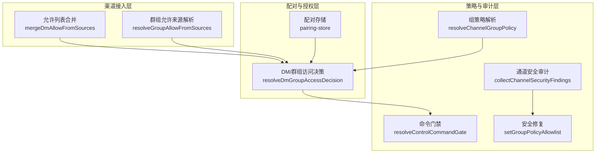
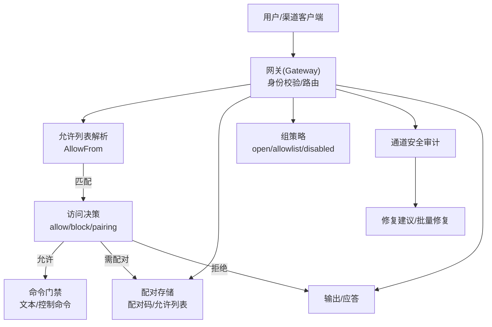
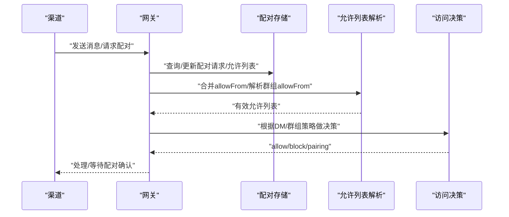
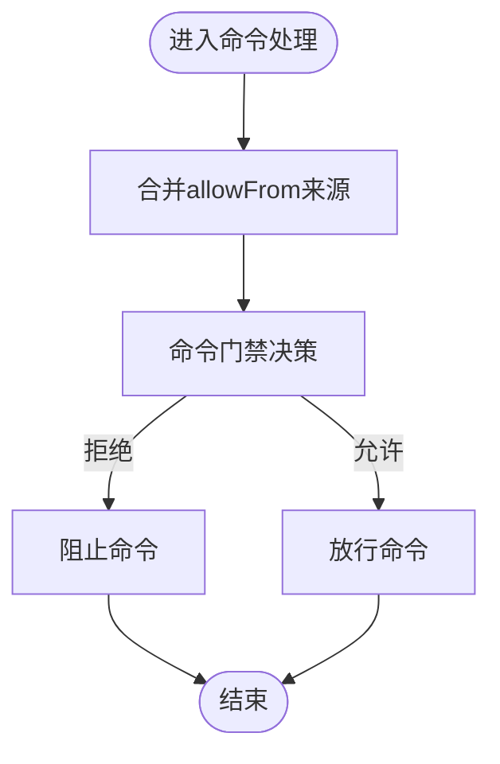
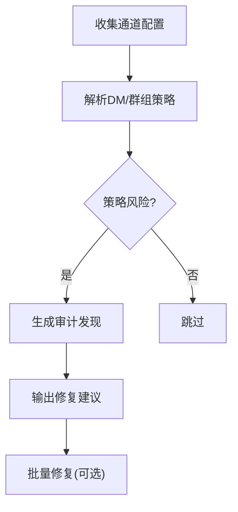
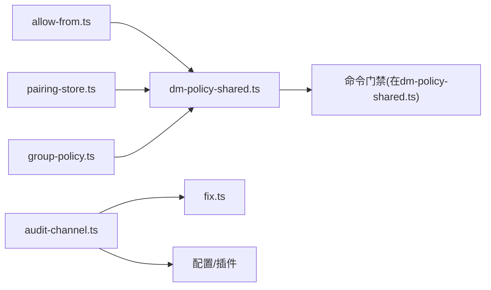

# 渠道安全

<cite>
**本文引用的文件**   
- [dm-policy-shared.ts](file://src/security/dm-policy-shared.ts)
- [allow-from.ts](file://src/channels/allow-from.ts)
- [pairing-store.ts](file://src/pairing/pairing-store.ts)
- [audit-channel.ts](file://src/security/audit-channel.ts)
- [audit.ts](file://src/security/audit.ts)
- [fix.ts](file://src/security/fix.ts)
- [group-policy.ts](file://src/config/group-policy.ts)
- [command-gating.test.ts](file://src/channels/command-gating.test.ts)
- [pairing.md](file://docs/channels/pairing.md)
- [THREAT-MODEL-ATLAS.md](file://docs/security/THREAT-MODEL-ATLAS.md)
- [README.md](file://docs/security/README.md)
- [connect-policy.ts](file://src/gateway/server/ws-connection/connect-policy.ts)
</cite>

## 目录
1. [简介](#简介)
2. [项目结构](#项目结构)
3. [核心组件](#核心组件)
4. [架构总览](#架构总览)
5. [详细组件分析](#详细组件分析)
6. [依赖关系分析](#依赖关系分析)
7. [性能考量](#性能考量)
8. [故障排查指南](#故障排查指南)
9. [结论](#结论)
10. [附录](#附录)

## 简介
本文件面向OpenClaw渠道安全体系，围绕DM配对机制、允许列表管理、地理位置限制与访问控制策略展开，结合威胁模型与防护建议，提供安全配置指南、风险评估方法与应急响应流程，并覆盖恶意行为检测、异常监控与自动封禁思路，帮助管理员完成渠道安全审计、合规检查与安全加固。

## 项目结构
OpenClaw在安全方面采用分层设计：
- 渠道接入层：负责消息路由与身份校验（AllowFrom/AllowList）
- 配对与授权层：设备与发送者配对、允许列表持久化与读取
- 策略与审计层：组策略、命令门禁、通道安全审计与修复
- 威胁建模与文档：基于MITRE ATLAS的威胁模型与安全文档

**图表来源**
- [allow-from.ts:1-54](file://src/channels/allow-from.ts#L1-L54)
- [dm-policy-shared.ts:105-196](file://src/security/dm-policy-shared.ts#L105-L196)
- [pairing-store.ts:542-563](file://src/pairing/pairing-store.ts#L542-L563)
- [group-policy.ts:325-359](file://src/config/group-policy.ts#L325-L359)
- [audit-channel.ts:119-725](file://src/security/audit-channel.ts#L119-L725)
- [fix.ts:186-229](file://src/security/fix.ts#L186-L229)

**章节来源**
- [allow-from.ts:1-54](file://src/channels/allow-from.ts#L1-L54)
- [dm-policy-shared.ts:105-196](file://src/security/dm-policy-shared.ts#L105-L196)
- [pairing-store.ts:542-563](file://src/pairing/pairing-store.ts#L542-L563)
- [group-policy.ts:325-359](file://src/config/group-policy.ts#L325-L359)
- [audit-channel.ts:119-725](file://src/security/audit-channel.ts#L119-L725)
- [fix.ts:186-229](file://src/security/fix.ts#L186-L229)

## 核心组件
- DM配对与访问决策
  - 合并DM允许来源、解析群组允许来源、计算有效允许列表
  - 基于DM策略与群组策略进行访问决策（允许/拒绝/需配对）
- 配对存储
  - 生成与管理一次性配对码、请求池裁剪与过期清理、允许列表原子写入
- 允许列表与命令门禁
  - 通过AllowFrom条目匹配发送者；支持命令级访问组与文本命令控制
- 组策略
  - 解析渠道/账号/群组维度的组策略模式（open/allowlist/disabled）
- 通道安全审计与修复
  - 自动扫描通道配置中的风险项（如开放DM、未配置允许列表、名称型条目等），并提供修复建议与批量修复

**章节来源**
- [dm-policy-shared.ts:105-196](file://src/security/dm-policy-shared.ts#L105-L196)
- [pairing-store.ts:697-797](file://src/pairing/pairing-store.ts#L697-L797)
- [allow-from.ts:1-54](file://src/channels/allow-from.ts#L1-L54)
- [group-policy.ts:325-359](file://src/config/group-policy.ts#L325-L359)
- [audit-channel.ts:119-725](file://src/security/audit-channel.ts#L119-L725)
- [fix.ts:186-229](file://src/security/fix.ts#L186-L229)

## 架构总览
下图展示从消息进入、身份校验、命令门禁到最终输出的关键路径与信任边界。

**图表来源**
- [dm-policy-shared.ts:105-196](file://src/security/dm-policy-shared.ts#L105-L196)
- [pairing-store.ts:697-797](file://src/pairing/pairing-store.ts#L697-L797)
- [allow-from.ts:1-54](file://src/channels/allow-from.ts#L1-L54)
- [group-policy.ts:325-359](file://src/config/group-policy.ts#L325-L359)
- [audit-channel.ts:119-725](file://src/security/audit-channel.ts#L119-L725)
- [fix.ts:186-229](file://src/security/fix.ts#L186-L229)

## 详细组件分析

### DM配对机制与访问控制
- 配对码生成与请求池
  - 生成8字符、不含歧义字符的配对码，带过期时间与最大挂起数限制
  - 请求池按最后出现时间排序并裁剪，确保资源可控
- 允许列表读取与合并
  - DM策略为allowlist时忽略配对存储；否则合并配置与配对存储条目
  - 群组允许列表可回退至DM允许列表，或显式指定
- 访问决策
  - DM策略：disabled/open/allowlist/pairing
  - 群组策略：disabled/allowlist（open时群组无限制）
  - 决策结果包含原因码，便于审计与告警

**图表来源**
- [pairing-store.ts:697-797](file://src/pairing/pairing-store.ts#L697-L797)
- [dm-policy-shared.ts:105-196](file://src/security/dm-policy-shared.ts#L105-L196)
- [allow-from.ts:1-54](file://src/channels/allow-from.ts#L1-L54)

**章节来源**
- [pairing.md:1-55](file://docs/channels/pairing.md#L1-L55)
- [pairing-store.ts:697-797](file://src/pairing/pairing-store.ts#L697-L797)
- [dm-policy-shared.ts:105-196](file://src/security/dm-policy-shared.ts#L105-L196)
- [allow-from.ts:1-54](file://src/channels/allow-from.ts#L1-L54)

### 允许列表管理与命令门禁
- 允许列表来源
  - 配置allowFrom、群组groupAllowFrom、配对存储storeAllowFrom
  - 支持回退策略：群组允许列表可回退到DM允许列表
- 命令门禁
  - 文本命令与控制命令分别受控
  - 使用Access Groups策略与作者器（authorizer）组合决定是否放行
  - 测试用例覆盖了启用/禁用Access Groups、作者器配置与modeWhenAccessGroupsOff=deny的行为

**图表来源**
- [dm-policy-shared.ts:227-292](file://src/security/dm-policy-shared.ts#L227-L292)
- [command-gating.test.ts:1-46](file://src/channels/command-gating.test.ts#L1-L46)

**章节来源**
- [dm-policy-shared.ts:227-292](file://src/security/dm-policy-shared.ts#L227-L292)
- [command-gating.test.ts:1-46](file://src/channels/command-gating.test.ts#L1-L46)

### 组策略与地理位置限制
- 组策略解析
  - 支持渠道级与账号级策略，以及群组级通配与默认配置
  - 当groupPolicy为allowlist且存在sender-level过滤时，允许组通过以实现细粒度控制
- 地理位置限制
  - 代码库中未发现直接的地理位置限制实现；建议通过网关代理/出口网络策略或渠道侧能力实现

**章节来源**
- [group-policy.ts:325-359](file://src/config/group-policy.ts#L325-L359)

### 通道安全审计与修复
- 审计范围
  - 扫描各通道DM策略、允许列表配置、名称型条目风险、Slash命令权限等
  - 对Telegram、Discord、Slack等通道给出针对性警告与修复建议
- 修复策略
  - 将groupPolicy从open收紧为allowlist
  - 修正日志敏感信息脱敏级别
  - 收紧本地权限与状态文件权限

**图表来源**
- [audit-channel.ts:119-725](file://src/security/audit-channel.ts#L119-L725)
- [fix.ts:186-229](file://src/security/fix.ts#L186-L229)

**章节来源**
- [audit-channel.ts:119-725](file://src/security/audit-channel.ts#L119-L725)
- [fix.ts:186-229](file://src/security/fix.ts#L186-L229)

### 威胁模型与防护措施
- 关键威胁与残余风险
  - 配对码拦截、AllowFrom欺骗、令牌窃取、提示注入、供应链攻击、资源耗尽、声誉损害等
- 防护建议
  - 缩短配对宽限期、增强确认步骤
  - 在可行通道引入加密身份验证
  - 实施令牌加密与轮换、配置完整性校验
  - 引入速率限制、成本预算、输出过滤与内容包装

**章节来源**
- [THREAT-MODEL-ATLAS.md:170-205](file://docs/security/THREAT-MODEL-ATLAS.md#L170-L205)
- [THREAT-MODEL-ATLAS.md:410-433](file://docs/security/THREAT-MODEL-ATLAS.md#L410-L433)

## 依赖关系分析
- 组件耦合
  - DM策略依赖AllowFrom合并与配对存储；命令门禁依赖Access Groups与作者器
  - 审计模块依赖各通道插件与配置快照，修复模块依赖配置结构
- 外部集成点
  - 渠道插件注册与适配器（如配对适配器）
  - 文件系统锁与原子写入保障配对存储一致性

**图表来源**
- [allow-from.ts:1-54](file://src/channels/allow-from.ts#L1-L54)
- [dm-policy-shared.ts:105-196](file://src/security/dm-policy-shared.ts#L105-L196)
- [pairing-store.ts:542-563](file://src/pairing/pairing-store.ts#L542-L563)
- [group-policy.ts:325-359](file://src/config/group-policy.ts#L325-L359)
- [audit-channel.ts:119-725](file://src/security/audit-channel.ts#L119-L725)
- [fix.ts:186-229](file://src/security/fix.ts#L186-L229)

**章节来源**
- [dm-policy-shared.ts:105-196](file://src/security/dm-policy-shared.ts#L105-L196)
- [pairing-store.ts:542-563](file://src/pairing/pairing-store.ts#L542-L563)
- [allow-from.ts:1-54](file://src/channels/allow-from.ts#L1-L54)
- [group-policy.ts:325-359](file://src/config/group-policy.ts#L325-L359)
- [audit-channel.ts:119-725](file://src/security/audit-channel.ts#L119-L725)
- [fix.ts:186-229](file://src/security/fix.ts#L186-L229)

## 性能考量
- 配对存储缓存
  - 允许列表读取具备缓存命中判断，避免频繁磁盘IO
- 文件锁与重试
  - 配对与允许列表写入使用文件锁与指数退避，降低并发冲突
- 建议
  - 在高并发场景下，合理设置配对请求上限与过期时间，避免请求池膨胀
  - 对审计与修复任务进行批处理与限速，避免对系统造成瞬时压力

[本节为通用指导，不直接分析具体文件]

## 故障排查指南
- 常见问题定位
  - DM策略为open但allowFrom未包含通配符：审计会提示不一致
  - Telegram群组allowFrom包含通配符或非数字条目：提示高危或无效条目
  - Slack/Discord Slash命令未配置允许列表：提示无允许列表
- 修复步骤
  - 使用安全审计命令生成报告与修复建议
  - 执行修复脚本批量收紧groupPolicy与修正敏感配置
  - 重新运行审计确认修复效果

**章节来源**
- [audit-channel.ts:201-262](file://src/security/audit-channel.ts#L201-L262)
- [audit-channel.ts:670-720](file://src/security/audit-channel.ts#L670-L720)
- [fix.ts:186-229](file://src/security/fix.ts#L186-L229)

## 结论
OpenClaw在渠道安全方面提供了完善的DM配对、允许列表与命令门禁机制，并通过通道安全审计与修复流程实现持续加固。结合MITRE ATLAS威胁模型，建议在实际部署中缩短配对宽限期、引入加密身份验证、实施令牌加密与轮换、完善速率限制与输出过滤，以进一步降低关键风险。

[本节为总结性内容，不直接分析具体文件]

## 附录

### 安全配置清单（摘要）
- DM策略
  - 默认优先使用allowlist或pairing，避免open
  - 确保allowFrom包含必要条目，Telegram需使用稳定ID
- 命令门禁
  - 启用Access Groups，为Slack/Discord配置明确的用户/群组允许列表
- 审计与修复
  - 定期运行安全审计，按建议收紧groupPolicy与修正敏感配置
  - 使用修复脚本批量收紧策略

**章节来源**
- [pairing.md:1-55](file://docs/channels/pairing.md#L1-L55)
- [THREAT-MODEL-ATLAS.md:530-556](file://docs/security/THREAT-MODEL-ATLAS.md#L530-L556)

### 威胁模型参考
- MITRE ATLAS框架下的关键威胁与建议
  - 配对码拦截、AllowFrom欺骗、令牌窃取、提示注入、供应链攻击、资源耗尽、声誉损害
  - 建议包括：缩短配对宽限期、加密身份验证、令牌加密与轮换、速率限制、输出过滤、内容包装

**章节来源**
- [THREAT-MODEL-ATLAS.md:170-205](file://docs/security/THREAT-MODEL-ATLAS.md#L170-L205)
- [THREAT-MODEL-ATLAS.md:410-433](file://docs/security/THREAT-MODEL-ATLAS.md#L410-L433)