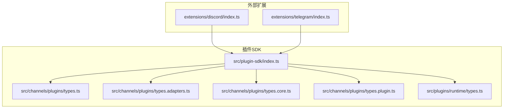
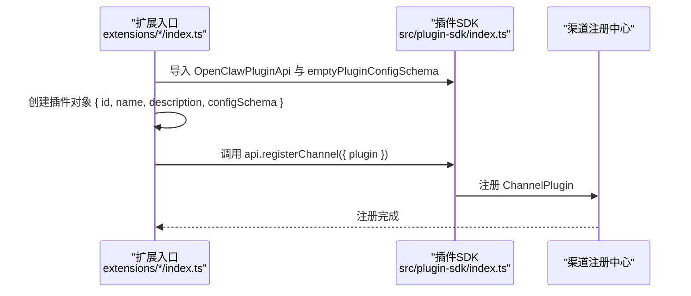
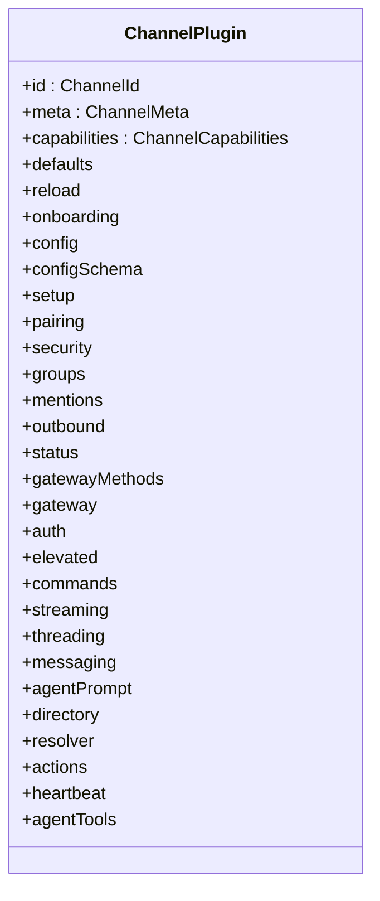
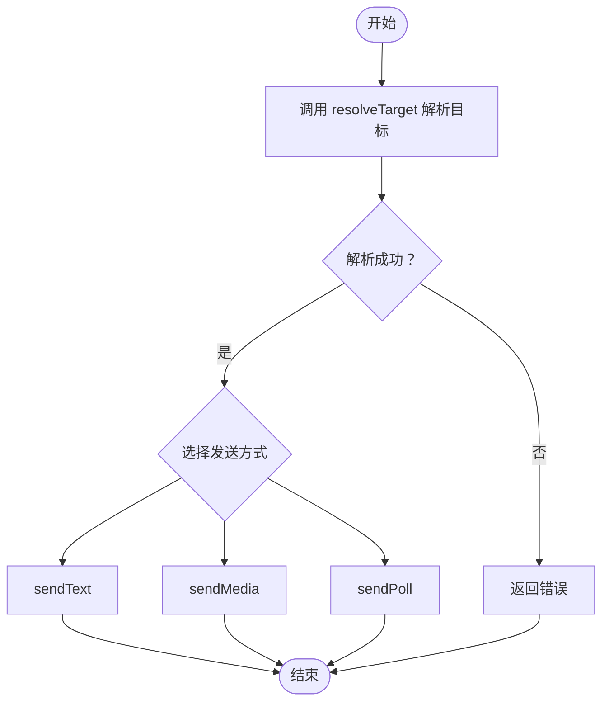
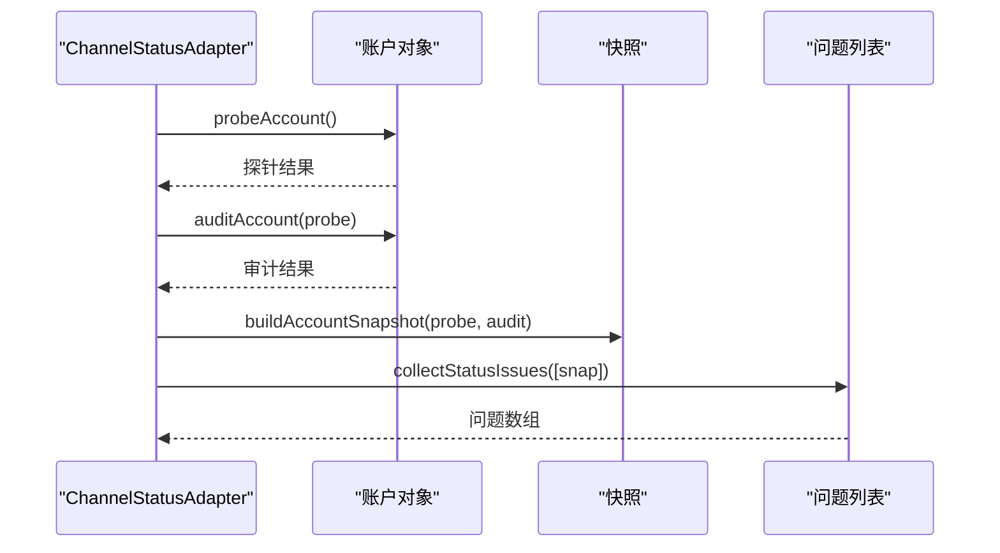
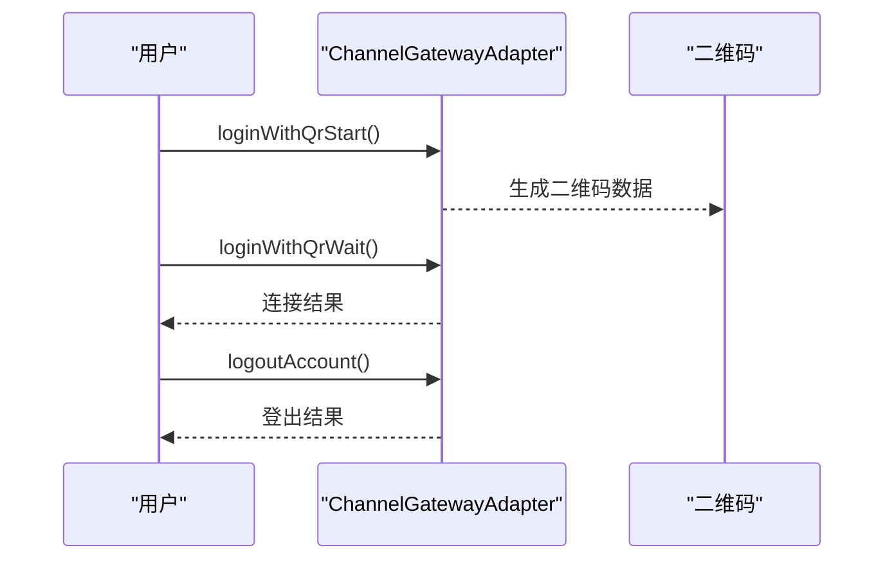
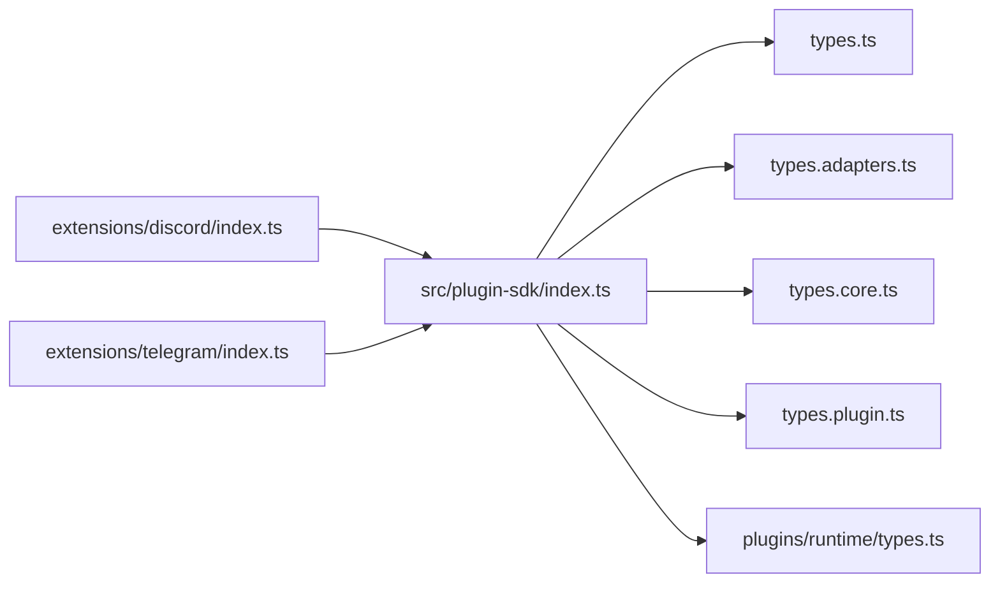

# 渠道开发

<cite>
**本文引用的文件**
- [src/plugin-sdk/index.ts](file://src/plugin-sdk/index.ts)
- [src/channels/plugins/types.ts](file://src/channels/plugins/types.ts)
- [src/channels/plugins/types.plugin.ts](file://src/channels/plugins/types.plugin.ts)
- [src/channels/plugins/types.adapters.ts](file://src/channels/plugins/types.adapters.ts)
- [src/channels/plugins/types.core.ts](file://src/channels/plugins/types.core.ts)
- [src/plugins/runtime/types.ts](file://src/plugins/runtime/types.ts)
- [extensions/discord/index.ts](file://extensions/discord/index.ts)
- [extensions/telegram/index.ts](file://extensions/telegram/index.ts)
- [extensions/shared/resolve-target-test-helpers.ts](file://extensions/shared/resolve-target-test-helpers.ts)
</cite>

## 目录
1. [引言](#引言)
2. [项目结构](#项目结构)
3. [核心组件](#核心组件)
4. [架构总览](#架构总览)
5. [详细组件分析](#详细组件分析)
6. [依赖关系分析](#依赖关系分析)
7. [性能考量](#性能考量)
8. [故障排查指南](#故障排查指南)
9. [结论](#结论)
10. [附录](#附录)

## 引言
本指南面向为 OpenClaw 开发“渠道”（Channel）插件的开发者，目标是帮助你快速理解渠道适配器的架构设计、插件接口规范与注册机制，并提供从零到一的开发流程、代码模板、测试方法、消息格式转换与状态同步、错误处理模式、认证流程、API 封装与性能优化策略，以及打包发布、版本管理与社区贡献的最佳实践。

## 项目结构
OpenClaw 的渠道开发以“插件 SDK + 外部扩展”的方式组织：核心能力由 SDK 暴露，具体渠道（如 Discord、Telegram 等）作为独立扩展实现并注册到系统中。关键目录与文件如下：
- 插件 SDK 入口与导出：src/plugin-sdk/index.ts
- 渠道插件接口定义：src/channels/plugins/types.*.ts
- 插件运行时类型：src/plugins/runtime/types.ts
- 扩展示例：extensions/discord/index.ts、extensions/telegram/index.ts
- 测试辅助：extensions/shared/resolve-target-test-helpers.ts

**图表来源**
- [src/plugin-sdk/index.ts:1-826](file://src/plugin-sdk/index.ts#L1-L826)
- [src/channels/plugins/types.ts:1-66](file://src/channels/plugins/types.ts#L1-L66)
- [src/channels/plugins/types.adapters.ts:1-384](file://src/channels/plugins/types.adapters.ts#L1-L384)
- [src/channels/plugins/types.core.ts:1-403](file://src/channels/plugins/types.core.ts#L1-L403)
- [src/channels/plugins/types.plugin.ts:1-86](file://src/channels/plugins/types.plugin.ts#L1-L86)
- [src/plugins/runtime/types.ts:1-64](file://src/plugins/runtime/types.ts#L1-L64)
- [extensions/discord/index.ts:1-20](file://extensions/discord/index.ts#L1-L20)
- [extensions/telegram/index.ts:1-18](file://extensions/telegram/index.ts#L1-L18)

**章节来源**
- [src/plugin-sdk/index.ts:1-826](file://src/plugin-sdk/index.ts#L1-L826)
- [src/channels/plugins/types.ts:1-66](file://src/channels/plugins/types.ts#L1-L66)
- [src/channels/plugins/types.adapters.ts:1-384](file://src/channels/plugins/types.adapters.ts#L1-L384)
- [src/channels/plugins/types.core.ts:1-403](file://src/channels/plugins/types.core.ts#L1-L403)
- [src/channels/plugins/types.plugin.ts:1-86](file://src/channels/plugins/types.plugin.ts#L1-L86)
- [src/plugins/runtime/types.ts:1-64](file://src/plugins/runtime/types.ts#L1-L64)
- [extensions/discord/index.ts:1-20](file://extensions/discord/index.ts#L1-L20)
- [extensions/telegram/index.ts:1-18](file://extensions/telegram/index.ts#L1-L18)

## 核心组件
- 插件接口规范
  - ChannelPlugin：渠道插件的统一契约，包含元数据、能力声明、配置与各适配器（认证、网关、消息、群组、安全等）。
  - ChannelConfigAdapter：账户生命周期管理（列举、解析、启用/禁用、删除、检查配置状态等）。
  - ChannelOutboundAdapter：出站消息发送（文本、媒体、投票），目标解析与分块策略。
  - ChannelStatusAdapter：账户探针、审计、快照构建与状态汇总。
  - ChannelGatewayAdapter：账户生命周期（启动/停止）、二维码登录、登出。
  - ChannelAuthAdapter：一次性登录流程。
  - ChannelHeartbeatAdapter：就绪检查与心跳收件人解析。
  - ChannelDirectoryAdapter：联系人/群组目录查询。
  - ChannelResolverAdapter：目标解析（用户/群组）。
  - ChannelElevatedAdapter：允许白名单回退策略。
  - ChannelCommandAdapter：命令执行策略。
  - ChannelSecurityAdapter：私信策略与告警收集。
  - ChannelStreamingAdapter：流式输出合并策略。
  - ChannelThreadingAdapter：回复模式与线程工具上下文。
  - ChannelMessagingAdapter：目标规范化与显示格式化。
  - ChannelAgentPromptAdapter：提示词工具建议。
  - ChannelMessageActionAdapter：消息动作（按钮/卡片/轮询）支持与处理。
- 运行时与上下文
  - ChannelGatewayContext：账户级运行时上下文，含配置、账户对象、日志、状态读写、可选的 channelRuntime 能力。
  - PluginRuntime：子代理运行时（run/wait/getSession/deleteSession）与 channel 子域能力。
- 类型与契约
  - ChannelCapabilities：聊天类型、轮询、反应、编辑、撤回、回复、效果、群组管理、线程、媒体、原生命令、阻断流式等能力。
  - ChannelAccountSnapshot：账户状态快照字段集合。
  - ChannelStatusIssue：状态问题结构。
  - ChannelPollContext/PollInput：投票上下文与输入。
  - ChannelMessageActionContext：消息动作上下文。

**章节来源**
- [src/channels/plugins/types.ts:1-66](file://src/channels/plugins/types.ts#L1-L66)
- [src/channels/plugins/types.adapters.ts:1-384](file://src/channels/plugins/types.adapters.ts#L1-L384)
- [src/channels/plugins/types.core.ts:1-403](file://src/channels/plugins/types.core.ts#L1-L403)
- [src/channels/plugins/types.plugin.ts:1-86](file://src/channels/plugins/types.plugin.ts#L1-L86)
- [src/plugins/runtime/types.ts:1-64](file://src/plugins/runtime/types.ts#L1-L64)

## 架构总览
下图展示了“插件 SDK 导出层”如何为外部扩展提供统一的注册入口与能力接口，以及扩展如何通过 registerChannel 完成渠道注册。

**图表来源**
- [extensions/discord/index.ts:1-20](file://extensions/discord/index.ts#L1-L20)
- [extensions/telegram/index.ts:1-18](file://extensions/telegram/index.ts#L1-L18)
- [src/plugin-sdk/index.ts:1-826](file://src/plugin-sdk/index.ts#L1-L826)

**章节来源**
- [extensions/discord/index.ts:1-20](file://extensions/discord/index.ts#L1-L20)
- [extensions/telegram/index.ts:1-18](file://extensions/telegram/index.ts#L1-L18)
- [src/plugin-sdk/index.ts:1-826](file://src/plugin-sdk/index.ts#L1-L826)

## 详细组件分析

### 组件A：ChannelPlugin 契约与注册机制
- 契约要点
  - id/meta/capabilities：标识渠道、展示信息与能力清单。
  - config/configSchema：配置解析与 UI 提示。
  - 各适配器可选实现：setup/pairing/security/groups/mentions/outbound/status/gateway/auth/elevated/commands/streaming/threading/messaging/agentPrompt/directory/resolver/actions/heartbeat/agentTools。
  - defaults/reload：队列去抖动、热重载前缀等。
- 注册流程
  - 扩展在入口文件中创建插件对象，调用 api.registerChannel({ plugin }) 完成注册。
  - 可选设置运行时（如 setDiscordRuntime/setTelegramRuntime）。
- 代码路径参考
  - 插件契约定义：[src/channels/plugins/types.plugin.ts:49-85](file://src/channels/plugins/types.plugin.ts#L49-L85)
  - 扩展注册示例：[extensions/discord/index.ts:7-16](file://extensions/discord/index.ts#L7-L16), [extensions/telegram/index.ts:6-14](file://extensions/telegram/index.ts#L6-L14)

**图表来源**
- [src/channels/plugins/types.plugin.ts:49-85](file://src/channels/plugins/types.plugin.ts#L49-L85)

**章节来源**
- [src/channels/plugins/types.plugin.ts:1-86](file://src/channels/plugins/types.plugin.ts#L1-L86)
- [extensions/discord/index.ts:1-20](file://extensions/discord/index.ts#L1-L20)
- [extensions/telegram/index.ts:1-18](file://extensions/telegram/index.ts#L1-L18)

### 组件B：适配器接口族（Adapter Contracts）
- ChannelConfigAdapter：账户生命周期与配置校验。
- ChannelOutboundAdapter：出站发送、目标解析、分块策略。
- ChannelStatusAdapter：探针、审计、快照与汇总。
- ChannelGatewayAdapter：账户生命周期、二维码登录、登出。
- ChannelAuthAdapter：一次性登录。
- ChannelHeartbeatAdapter：就绪检查与收件人解析。
- ChannelDirectoryAdapter：目录查询。
- ChannelResolverAdapter：目标解析。
- ChannelElevatedAdapter：允许白名单回退。
- ChannelCommandAdapter：命令策略。
- ChannelSecurityAdapter：私信策略与告警。
- ChannelStreamingAdapter：流式合并默认值。
- ChannelThreadingAdapter：回复模式与工具上下文。
- ChannelMessagingAdapter：目标规范化与显示格式化。
- ChannelAgentPromptAdapter：提示词工具建议。
- ChannelMessageActionAdapter：动作支持与处理。

```mermaid
classDiagram
class ChannelConfigAdapter
class ChannelOutboundAdapter
class ChannelStatusAdapter
class ChannelGatewayAdapter
class ChannelAuthAdapter
class ChannelHeartbeatAdapter
class ChannelDirectoryAdapter
class ChannelResolverAdapter
class ChannelElevatedAdapter
class ChannelCommandAdapter
class ChannelSecurityAdapter
class ChannelStreamingAdapter
class ChannelThreadingAdapter
class ChannelMessagingAdapter
class ChannelAgentPromptAdapter
class ChannelMessageActionAdapter
ChannelPlugin --> ChannelConfigAdapter
ChannelPlugin --> ChannelOutboundAdapter
ChannelPlugin --> ChannelStatusAdapter
ChannelPlugin --> ChannelGatewayAdapter
ChannelPlugin --> ChannelAuthAdapter
ChannelPlugin --> ChannelHeartbeatAdapter
ChannelPlugin --> ChannelDirectoryAdapter
ChannelPlugin --> ChannelResolverAdapter
ChannelPlugin --> ChannelElevatedAdapter
ChannelPlugin --> ChannelCommandAdapter
ChannelPlugin --> ChannelSecurityAdapter
ChannelPlugin --> ChannelStreamingAdapter
ChannelPlugin --> ChannelThreadingAdapter
ChannelPlugin --> ChannelMessagingAdapter
ChannelPlugin --> ChannelAgentPromptAdapter
ChannelPlugin --> ChannelMessageActionAdapter
```

**图表来源**
- [src/channels/plugins/types.adapters.ts:1-384](file://src/channels/plugins/types.adapters.ts#L1-L384)
- [src/channels/plugins/types.plugin.ts:49-85](file://src/channels/plugins/types.plugin.ts#L49-L85)

**章节来源**
- [src/channels/plugins/types.adapters.ts:1-384](file://src/channels/plugins/types.adapters.ts#L1-L384)
- [src/channels/plugins/types.core.ts:1-403](file://src/channels/plugins/types.core.ts#L1-L403)

### 组件C：消息发送与目标解析流程
- 出站发送链路
  - ChannelOutboundAdapter.resolveTarget：根据 allowFrom 与模式（显式/隐式/心跳）解析目标。
  - sendText/sendMedia/sendPoll：按能力选择发送路径。
  - 分块策略：chunker/chunkerMode/textChunkLimit 控制文本分块。
- 目标解析通用错误场景
  - 归一化失败、未提供目标、空白字符目标、无 allowFrom 且未提供目标等。

**图表来源**
- [src/channels/plugins/types.adapters.ts:108-125](file://src/channels/plugins/types.adapters.ts#L108-L125)
- [extensions/shared/resolve-target-test-helpers.ts:17-66](file://extensions/shared/resolve-target-test-helpers.ts#L17-L66)

**章节来源**
- [src/channels/plugins/types.adapters.ts:108-125](file://src/channels/plugins/types.adapters.ts#L108-L125)
- [extensions/shared/resolve-target-test-helpers.ts:1-67](file://extensions/shared/resolve-target-test-helpers.ts#L1-L67)

### 组件D：状态同步与问题收集
- ChannelStatusAdapter 提供 probe/augment/build 等阶段化能力，最终生成 ChannelAccountSnapshot。
- 收集状态问题：collectStatusIssues 返回 ChannelStatusIssue 列表，用于诊断与修复建议。

**图表来源**
- [src/channels/plugins/types.adapters.ts:127-166](file://src/channels/plugins/types.adapters.ts#L127-L166)
- [src/channels/plugins/types.core.ts:97-159](file://src/channels/plugins/types.core.ts#L97-L159)

**章节来源**
- [src/channels/plugins/types.adapters.ts:127-166](file://src/channels/plugins/types.adapters.ts#L127-L166)
- [src/channels/plugins/types.core.ts:55-61](file://src/channels/plugins/types.core.ts#L55-L61)

### 组件E：认证流程（二维码登录）
- ChannelGatewayAdapter.loginWithQrStart/loginWithQrWait：启动二维码登录并等待连接。
- ChannelGatewayAdapter.logoutAccount：账户登出。
- 代码路径参考：[src/channels/plugins/types.adapters.ts:275-289](file://src/channels/plugins/types.adapters.ts#L275-L289)

**图表来源**
- [src/channels/plugins/types.adapters.ts:275-289](file://src/channels/plugins/types.adapters.ts#L275-L289)

**章节来源**
- [src/channels/plugins/types.adapters.ts:247-289](file://src/channels/plugins/types.adapters.ts#L247-L289)

## 依赖关系分析
- 插件 SDK 对外导出统一入口，集中暴露类型、工具函数与注册 API。
- 外部扩展仅依赖 SDK 导出，不直接耦合内部模块，保证可插拔性。
- 渠道适配器之间低耦合，通过 ChannelPlugin 契约聚合。

**图表来源**
- [src/plugin-sdk/index.ts:1-826](file://src/plugin-sdk/index.ts#L1-L826)
- [src/channels/plugins/types.ts:1-66](file://src/channels/plugins/types.ts#L1-L66)
- [src/channels/plugins/types.adapters.ts:1-384](file://src/channels/plugins/types.adapters.ts#L1-L384)
- [src/channels/plugins/types.core.ts:1-403](file://src/channels/plugins/types.core.ts#L1-L403)
- [src/channels/plugins/types.plugin.ts:1-86](file://src/channels/plugins/types.plugin.ts#L1-L86)
- [src/plugins/runtime/types.ts:1-64](file://src/plugins/runtime/types.ts#L1-L64)
- [extensions/discord/index.ts:1-20](file://extensions/discord/index.ts#L1-L20)
- [extensions/telegram/index.ts:1-18](file://extensions/telegram/index.ts#L1-L18)

**章节来源**
- [src/plugin-sdk/index.ts:1-826](file://src/plugin-sdk/index.ts#L1-L826)
- [extensions/discord/index.ts:1-20](file://extensions/discord/index.ts#L1-L20)
- [extensions/telegram/index.ts:1-18](file://extensions/telegram/index.ts#L1-L18)

## 性能考量
- 分块与限流
  - 使用 textChunkLimit 与 chunker 控制文本分块，避免平台限制。
  - webhook 内存守卫（限流、异常追踪）可减少突发流量对系统的影响。
- 流式输出合并
  - blockStreamingCoalesceDefaults 可降低频繁小片段传输带来的开销。
- 队列与重试
  - defaults.queue.debounceMs 可平滑高频操作。
- 并发与幂等
  - 使用 idempotencyKey 与去重缓存避免重复投递。
- 日志与可观测性
  - 使用 ChannelLogSink 与诊断事件（diagnostic events）记录关键路径，便于定位瓶颈。

**章节来源**
- [src/channels/plugins/types.adapters.ts:108-125](file://src/channels/plugins/types.adapters.ts#L108-L125)
- [src/channels/plugins/types.core.ts:225-230](file://src/channels/plugins/types.core.ts#L225-L230)
- [src/plugin-sdk/index.ts:440-452](file://src/plugin-sdk/index.ts#L440-L452)

## 故障排查指南
- 目标解析失败
  - 检查 allowFrom、模式（显式/隐式/心跳）与归一化逻辑。
  - 参考测试用例覆盖的错误场景：空白目标、未提供目标、归一化失败等。
- 状态问题收集
  - 使用 collectStatusIssues 输出问题类别（意图、权限、配置、认证、运行时）与修复建议。
- 认证与登录
  - 二维码登录失败时，确认 start/wait 流程与超时参数；登出后清理凭证。
- 错误日志
  - 使用 ChannelLogSink 记录 info/warn/error；结合诊断事件定位异常。

**章节来源**
- [extensions/shared/resolve-target-test-helpers.ts:17-66](file://extensions/shared/resolve-target-test-helpers.ts#L17-L66)
- [src/channels/plugins/types.adapters.ts:127-166](file://src/channels/plugins/types.adapters.ts#L127-L166)
- [src/channels/plugins/types.adapters.ts:275-289](file://src/channels/plugins/types.adapters.ts#L275-L289)

## 结论
通过统一的 ChannelPlugin 契约与插件 SDK，OpenClaw 将渠道适配器的实现与注册过程标准化，既保证了内置渠道的深度集成能力，也为外部扩展提供了清晰的边界与强大的运行时能力。遵循本文档的接口规范、开发流程与最佳实践，你可以高效地完成新渠道的开发、测试、发布与维护。

## 附录

### 新渠道开发完整流程
- 设计阶段
  - 明确渠道能力清单（ChannelCapabilities）与消息/群组/媒体等特性。
  - 设计配置 Schema 与 UI 提示（ChannelConfigSchema）。
- 实现阶段
  - 实现 ChannelConfigAdapter：账户列举、解析、启用/禁用、删除、配置检查。
  - 实现出站适配器：resolveTarget、sendText/sendMedia/sendPoll。
  - 实现状态适配器：probe/augment/build 与问题收集。
  - 可选实现：认证（ChannelAuthAdapter）、网关（ChannelGatewayAdapter）、心跳（ChannelHeartbeatAdapter）、目录（ChannelDirectoryAdapter）、解析（ChannelResolverAdapter）、安全（ChannelSecurityAdapter）、线程（ChannelThreadingAdapter）、消息（ChannelMessagingAdapter）、动作（ChannelMessageActionAdapter）。
- 注册阶段
  - 在扩展入口创建插件对象，调用 api.registerChannel({ plugin }) 完成注册。
  - 如需，设置运行时（setXxxRuntime）。
- 测试阶段
  - 使用 resolve-target 测试助手覆盖常见错误场景。
  - 编写单元测试与端到端测试，验证消息发送、状态同步、认证流程。
- 发布与维护
  - 遵循版本管理与变更日志规范，提交社区 PR 并接受审查。

**章节来源**
- [src/channels/plugins/types.plugin.ts:49-85](file://src/channels/plugins/types.plugin.ts#L49-L85)
- [extensions/discord/index.ts:7-16](file://extensions/discord/index.ts#L7-L16)
- [extensions/telegram/index.ts:6-14](file://extensions/telegram/index.ts#L6-L14)
- [extensions/shared/resolve-target-test-helpers.ts:17-66](file://extensions/shared/resolve-target-test-helpers.ts#L17-L66)

### 代码模板与参考路径
- 插件契约与适配器接口：[src/channels/plugins/types.plugin.ts:49-85](file://src/channels/plugins/types.plugin.ts#L49-L85), [src/channels/plugins/types.adapters.ts:1-384](file://src/channels/plugins/types.adapters.ts#L1-L384), [src/channels/plugins/types.core.ts:1-403](file://src/channels/plugins/types.core.ts#L1-L403)
- 扩展注册示例：[extensions/discord/index.ts:7-16](file://extensions/discord/index.ts#L7-L16), [extensions/telegram/index.ts:6-14](file://extensions/telegram/index.ts#L6-L14)
- 目标解析测试用例：[extensions/shared/resolve-target-test-helpers.ts:17-66](file://extensions/shared/resolve-target-test-helpers.ts#L17-L66)