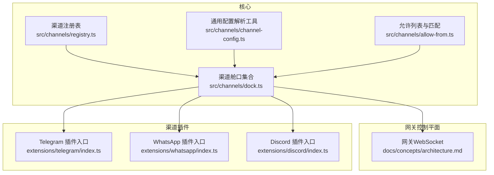
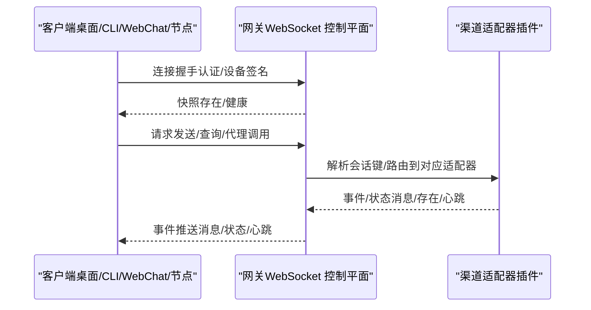
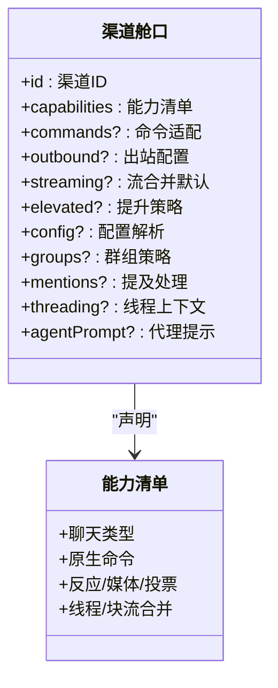
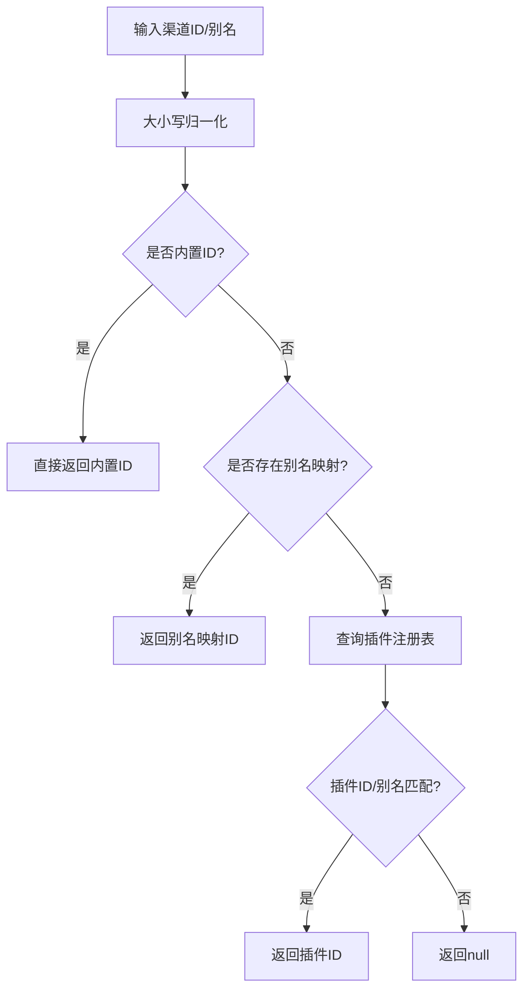
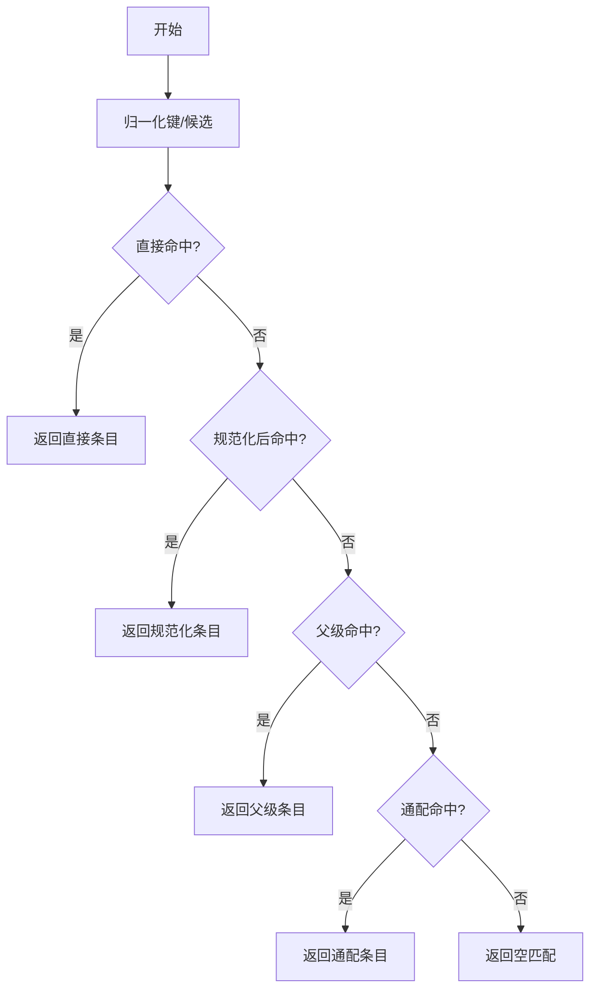
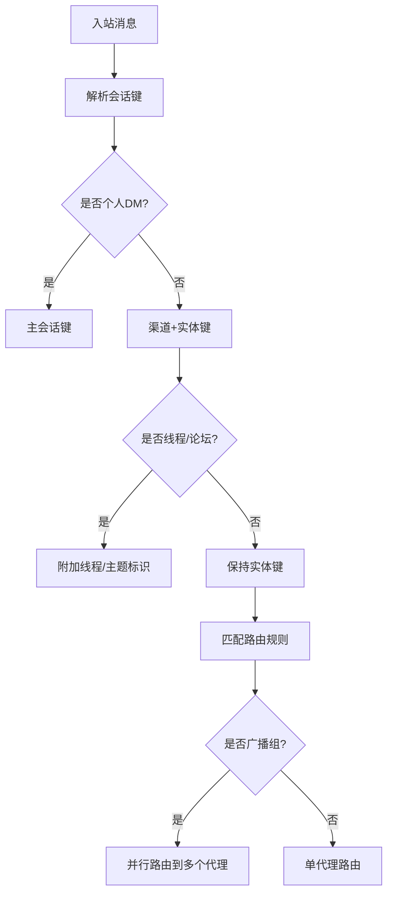
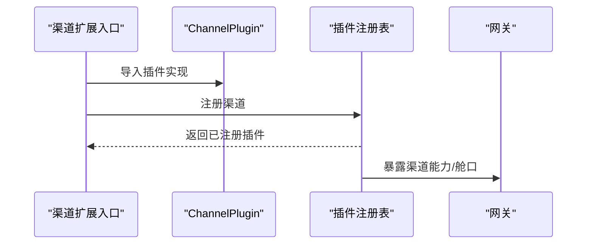
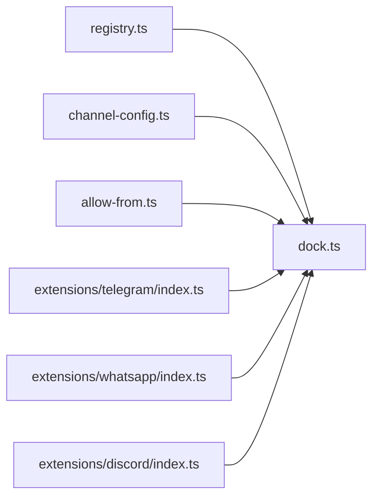

# 渠道概览

<cite>
**本文引用的文件**
- [README.md](file://README.md)
- [docs/channels/index.md](file://docs/channels/index.md)
- [docs/concepts/architecture.md](file://docs/concepts/architecture.md)
- [docs/channels/channel-routing.md](file://docs/channels/channel-routing.md)
- [docs/channels/groups.md](file://docs/channels/groups.md)
- [src/channels/registry.ts](file://src/channels/registry.ts)
- [src/channels/dock.ts](file://src/channels/dock.ts)
- [src/channels/channel-config.ts](file://src/channels/channel-config.ts)
- [src/channels/allow-from.ts](file://src/channels/allow-from.ts)
- [extensions/telegram/index.ts](file://extensions/telegram/index.ts)
- [extensions/discord/index.ts](file://extensions/discord/index.ts)
- [extensions/whatsapp/index.ts](file://extensions/whatsapp/index.ts)
</cite>

## 目录
1. [简介](#简介)
2. [项目结构](#项目结构)
3. [核心组件](#核心组件)
4. [架构总览](#架构总览)
5. [详细组件分析](#详细组件分析)
6. [依赖关系分析](#依赖关系分析)
7. [性能考量](#性能考量)
8. [故障排查指南](#故障排查指南)
9. [结论](#结论)
10. [附录](#附录)

## 简介
本概览面向希望在 OpenClaw 中选择与集成即时通讯渠道（20+ 平台）的用户与工程师。文档聚焦以下目标：
- 整体架构与设计理念：以“网关控制平面 + 多通道适配器”的统一模型，实现跨平台消息路由与会话管理。
- 渠道适配器的统一接口设计：通过“渠道舱口（ChannelDock）”抽象能力、配置解析、提及处理、线程上下文等，屏蔽各平台差异。
- 消息路由机制与会话管理策略：基于“会话键（SessionKey）”的确定性路由、广播组策略、主会话 DM 路由固定等。
- 渠道选择指南、性能对比与配置建议：结合各平台特性与限制，给出选型建议与最佳实践。
- 兼容性矩阵、功能特性对比表与部署注意事项：帮助快速评估与落地。

## 项目结构
OpenClaw 的渠道体系由“核心注册表 + 渠道舱口 + 插件式扩展”构成：
- 核心注册表：定义受支持的内置渠道顺序、元数据与别名，确保统一入口与可发现性。
- 渠道舱口：集中声明各渠道的能力、默认行为（如文本分片、流合并）、允许列表格式化、提及规则、线程上下文构建等。
- 插件式扩展：每个渠道以独立插件形式注册，遵循统一的 ChannelPlugin 接口，实现登录、收发、事件处理等。

图表来源
- [src/channels/registry.ts:1-201](file://src/channels/registry.ts#L1-L201)
- [src/channels/dock.ts:228-637](file://src/channels/dock.ts#L228-L637)
- [src/channels/channel-config.ts:1-183](file://src/channels/channel-config.ts#L1-L183)
- [src/channels/allow-from.ts:1-54](file://src/channels/allow-from.ts#L1-L54)
- [extensions/telegram/index.ts:1-18](file://extensions/telegram/index.ts#L1-L18)
- [extensions/whatsapp/index.ts:1-18](file://extensions/whatsapp/index.ts#L1-L18)
- [extensions/discord/index.ts:1-20](file://extensions/discord/index.ts#L1-L20)
- [docs/concepts/architecture.md:12-140](file://docs/concepts/architecture.md#L12-L140)

章节来源
- [README.md:126-176](file://README.md#L126-L176)
- [docs/channels/index.md:9-48](file://docs/channels/index.md#L9-L48)
- [docs/concepts/architecture.md:12-140](file://docs/concepts/architecture.md#L12-L140)

## 核心组件
- 渠道注册表（Registry）
  - 定义内置渠道顺序、元信息（标签、文档路径、图标等），并提供标准化 ID 归一化与别名映射。
- 渠道舱口（Dock）
  - 面向共享代码路径的轻量抽象，集中声明渠道能力、默认行为、允许列表格式化、提及规则、线程上下文构建等。
- 通用配置解析与匹配
  - 提供键归一化、通配匹配、父级回退、嵌套允许列表决策等通用逻辑，支撑多层级配置解析。
- 允许列表与匹配
  - 合并与判定允许列表，支持通配与空集时的行为，保障 DM 与群组访问安全。

章节来源
- [src/channels/registry.ts:5-201](file://src/channels/registry.ts#L5-L201)
- [src/channels/dock.ts:65-82](file://src/channels/dock.ts#L65-L82)
- [src/channels/channel-config.ts:14-183](file://src/channels/channel-config.ts#L14-L183)
- [src/channels/allow-from.ts:1-54](file://src/channels/allow-from.ts#L1-L54)

## 架构总览
OpenClaw 采用“单网关 + 多渠道适配器”的统一架构：
- 网关作为控制平面，负责会话、存在、配置、心跳、Webhook 等；客户端（桌面、CLI、WebChat、节点）通过 WebSocket 连接。
- 渠道适配器以插件形式接入，各自实现登录、消息收发、事件订阅与回推。
- 路由与会话管理由网关侧统一完成，确保跨渠道一致性与可审计性。

图表来源
- [docs/concepts/architecture.md:59-140](file://docs/concepts/architecture.md#L59-L140)

章节来源
- [docs/concepts/architecture.md:12-140](file://docs/concepts/architecture.md#L12-L140)

## 详细组件分析

### 统一渠道接口设计（ChannelDock）
ChannelDock 将各渠道的能力与行为标准化，便于共享代码复用：
- 能力声明：聊天类型、原生命令、反应、媒体、投票、线程、块流合并等。
- 默认行为：出站文本分片上限、块流合并默认参数。
- 配置解析：允许列表解析与格式化、默认回复账号解析。
- 群组策略：提及必填、工具策略、群介绍提示等。
- 提及处理：不同渠道的提及正则或剥离模式。
- 线程上下文：根据渠道语义构建当前频道/主题/线程标识与已回复标记。

图表来源
- [src/channels/dock.ts:65-82](file://src/channels/dock.ts#L65-L82)
- [src/channels/dock.ts:238-556](file://src/channels/dock.ts#L238-L556)

章节来源
- [src/channels/dock.ts:228-637](file://src/channels/dock.ts#L228-L637)

### 渠道注册与别名（Registry）
- 内置渠道顺序与元信息：确保 UI 选择、文档链接与体验一致。
- 别名映射：如 imsg→imessage、internet-relay-chat→irc 等，提升兼容性。
- 标准化 ID：对任意渠道（内置或插件）进行大小写归一与别名解析。

图表来源
- [src/channels/registry.ts:147-183](file://src/channels/registry.ts#L147-L183)

章节来源
- [src/channels/registry.ts:1-201](file://src/channels/registry.ts#L1-L201)

### 配置解析与匹配（ChannelConfig 与 AllowFrom）
- 键归一化与候选生成：去除前后空白、转小写、保留唯一值，支持通配键与父级键回退。
- 匹配优先级：直接命中 > 规范化后命中 > 父级命中 > 通配命中。
- 允许列表合并：支持 DM 策略与存储项叠加，空集时的默认行为判定。
- 嵌套允许列表决策：外层未配置时整体放行，外层未命中时整体拒绝，内层未配置时继承外层。

图表来源
- [src/channels/channel-config.ts:60-164](file://src/channels/channel-config.ts#L60-L164)

章节来源
- [src/channels/channel-config.ts:14-183](file://src/channels/channel-config.ts#L14-L183)
- [src/channels/allow-from.ts:1-54](file://src/channels/allow-from.ts#L1-L54)

### 消息路由与会话管理
- 路由规则：精确对等体匹配 > 父级对等体继承 > 服务器/团队匹配 > 账号匹配 > 渠道匹配 > 默认代理。
- 会话键：个人 DM 使用主会话键；群组/频道使用带渠道与实体标识的键；线程/论坛主题附加线程序列。
- 主会话 DM 路由固定：当 allowFrom 仅含一个非通配条目且与入站发送者不匹配时，保持主会话 lastRoute 不被覆盖。
- 广播组：同一对等体可同时路由到多个代理，适合需要并行处理的场景。

图表来源
- [docs/channels/channel-routing.md:24-135](file://docs/channels/channel-routing.md#L24-L135)

章节来源
- [docs/channels/channel-routing.md:58-135](file://docs/channels/channel-routing.md#L58-L135)

### 渠道插件注册与运行时
- 插件入口：每个渠道在扩展入口导出插件对象，并在注册时注入运行时。
- 注册流程：设置运行时 → 注册渠道 → 可选钩子（如 Discord 子代理钩子）。

图表来源
- [extensions/telegram/index.ts:1-18](file://extensions/telegram/index.ts#L1-L18)
- [extensions/discord/index.ts:1-20](file://extensions/discord/index.ts#L1-L20)
- [extensions/whatsapp/index.ts:1-18](file://extensions/whatsapp/index.ts#L1-L18)

章节来源
- [extensions/telegram/index.ts:1-18](file://extensions/telegram/index.ts#L1-L18)
- [extensions/discord/index.ts:1-20](file://extensions/discord/index.ts#L1-L20)
- [extensions/whatsapp/index.ts:1-18](file://extensions/whatsapp/index.ts#L1-L18)

## 依赖关系分析
- 渠道舱口依赖：
  - 渠道注册表：用于内置渠道的顺序与元信息。
  - 通用配置解析：用于允许列表解析、键归一化、通配与父级回退。
  - 允许列表工具：用于合并与判定允许列表。
- 插件扩展依赖：
  - 插件 SDK：提供 ChannelPlugin 接口与运行时注入。
  - 渠道舱口：插件可直接导出舱口，或由运行时动态构建。

图表来源
- [src/channels/registry.ts:1-201](file://src/channels/registry.ts#L1-L201)
- [src/channels/dock.ts:228-637](file://src/channels/dock.ts#L228-L637)
- [src/channels/channel-config.ts:1-183](file://src/channels/channel-config.ts#L1-L183)
- [src/channels/allow-from.ts:1-54](file://src/channels/allow-from.ts#L1-L54)
- [extensions/telegram/index.ts:1-18](file://extensions/telegram/index.ts#L1-L18)
- [extensions/whatsapp/index.ts:1-18](file://extensions/whatsapp/index.ts#L1-L18)
- [extensions/discord/index.ts:1-20](file://extensions/discord/index.ts#L1-L20)

章节来源
- [src/channels/dock.ts:558-637](file://src/channels/dock.ts#L558-L637)

## 性能考量
- 文本分片与流合并
  - 不同渠道默认文本分片上限不同，避免超长消息被截断。
  - 块流合并默认参数（最小字符数、空闲等待时间）影响实时性与网络开销。
- 线程与提及处理
  - 合理配置 replyToMode 与提及剥离模式，减少无效重试与重复消息。
- 允许列表与匹配
  - 使用规范化键与父级回退，降低匹配成本；避免过度通配导致的误判。
- 网关与通道
  - 单网关控制所有通道，减少连接数与资源占用；注意通道间并发与队列策略。

## 故障排查指南
- 渠道选择与配置
  - 查看渠道文档索引与各渠道配置要点，确认令牌/密钥、允许列表、群组策略等。
- 路由与会话
  - 检查会话键生成与路由规则，确认广播组配置是否符合预期。
- 安全与权限
  - DM 配对策略与允许列表生效范围；群组访问需满足组策略与提及要求。
- 网关协议与握手
  - 确认 WebSocket 握手、认证令牌与设备签名；本地/远程连接的授权策略。

章节来源
- [docs/channels/index.md:9-48](file://docs/channels/index.md#L9-L48)
- [docs/channels/channel-routing.md:58-135](file://docs/channels/channel-routing.md#L58-L135)
- [docs/channels/groups.md:177-201](file://docs/channels/groups.md#L177-L201)
- [docs/concepts/architecture.md:80-140](file://docs/concepts/architecture.md#L80-L140)

## 结论
OpenClaw 通过“渠道舱口 + 插件式扩展 + 统一网关”的架构，实现了对 20+ 即时通讯平台的一致接入与管理。其关键优势包括：
- 统一接口与行为抽象，降低多平台适配复杂度；
- 明确的消息路由与会话管理策略，保障跨渠道一致性；
- 丰富的配置与安全控制，兼顾易用性与可控性。

## 附录

### 渠道选择指南（基于仓库文档与实现）
- 快速上手
  - Telegram：最简配置（机器人令牌），适合首次部署。
  - WhatsApp：需二维码配对，状态较多，适合已有设备与隐私需求。
- 企业与协作
  - Slack/Discord：生态完善，支持线程、反应、媒体，适合团队协作。
  - Microsoft Teams/Google Chat：企业环境首选，具备组织与权限模型。
- 移动与私密
  - Signal：注重隐私，需本地设备支持。
  - iMessage（推荐 BlueBubbles）：macOS 生态首选，功能丰富。
- 其他
  - IRC/Matrix/Mattermost/Nextcloud Talk/Nostr/Tlon/Twitch/Zalo/Zalo Personal/WebChat 等，按需选择。

章节来源
- [docs/channels/index.md:14-48](file://docs/channels/index.md#L14-L48)
- [README.md:21-22](file://README.md#L21-L22)

### 渠道兼容性矩阵（基于实现与文档）
说明：以下矩阵基于仓库中渠道注册表、舱口与文档的公开信息整理，具体可用性以实际版本为准。

- 支持平台（内置）
  - Telegram、WhatsApp、Discord、IRC、Google Chat、Slack、Signal、iMessage、LINE
- 支持平台（插件）
  - Feishu、Matrix、Mattermost、Microsoft Teams、Nextcloud Talk、Nostr、Synology Chat、Tlon、Twitch、Zalo、Zalo Personal
- WebChat：通过网关 WebSocket 提供 UI

章节来源
- [src/channels/registry.ts:7-17](file://src/channels/registry.ts#L7-L17)
- [docs/channels/index.md:16-37](file://docs/channels/index.md#L16-L37)

### 功能特性对比（部分关键项）
- 文本分片上限：不同渠道默认不同，需按渠道舱口配置调整。
- 媒体/反应/投票/线程：各渠道支持度不同，详见各渠道舱口能力声明。
- 提及处理：部分渠道提供原生提及剥离，部分依赖正则或前缀剥离。
- 群组策略：提及必填、工具策略、群介绍提示等，按渠道舱口配置。

章节来源
- [src/channels/dock.ts:238-556](file://src/channels/dock.ts#L238-L556)

### 部署注意事项
- 网关绑定与暴露
  - 默认绑定 127.0.0.1，可通过 Tailscale 或 SSH 隧道安全暴露。
- 认证与配对
  - 设备配对与本地信任策略；远程连接仍需网关认证。
- 安全策略
  - DM 策略与允许列表；群组策略与提及要求；必要时启用沙箱隔离。

章节来源
- [docs/concepts/architecture.md:117-140](file://docs/concepts/architecture.md#L117-L140)
- [README.md:112-125](file://README.md#L112-L125)
- [docs/channels/groups.md:177-201](file://docs/channels/groups.md#L177-L201)