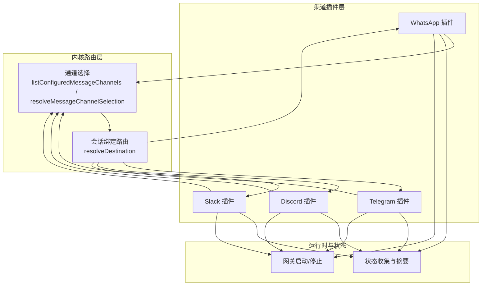
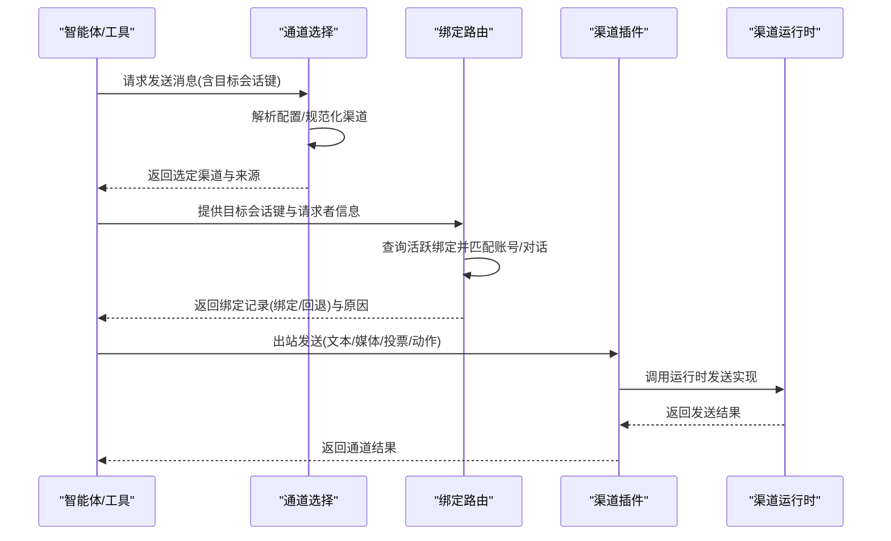
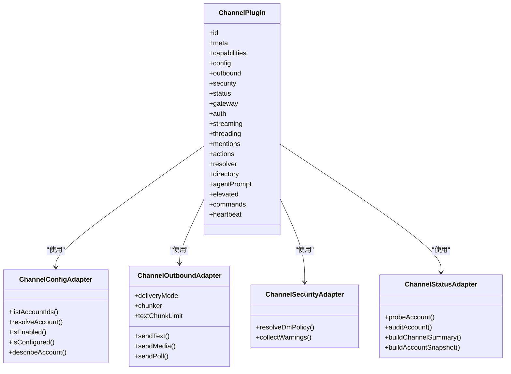
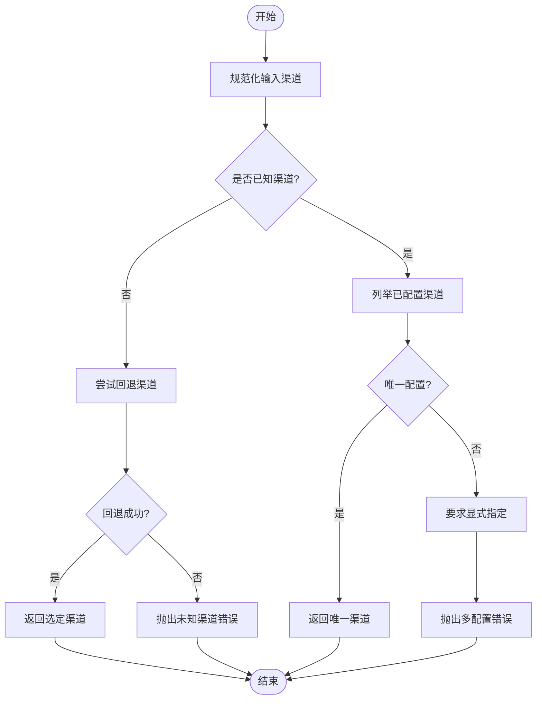
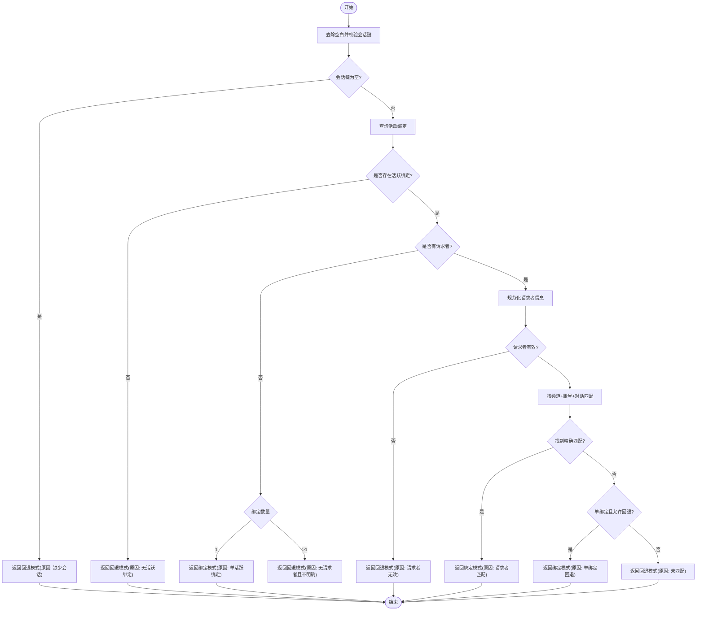
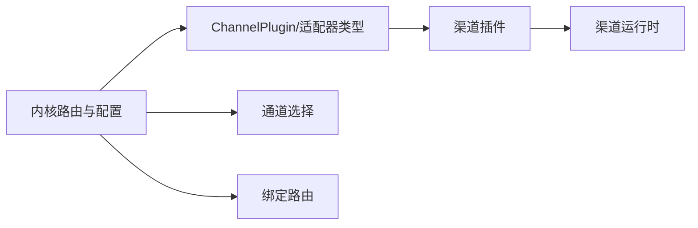

# 渠道集成

<cite>
**本文引用的文件**
- [docs/channels/index.md](file://docs/channels/index.md)
- [src/infra/outbound/channel-selection.ts](file://src/infra/outbound/channel-selection.ts)
- [src/infra/outbound/bound-delivery-router.ts](file://src/infra/outbound/bound-delivery-router.ts)
- [src/channels/plugins/types.plugin.ts](file://src/channels/plugins/types.plugin.ts)
- [src/channels/plugins/types.adapters.ts](file://src/channels/plugins/types.adapters.ts)
- [src/channels/plugins/onboarding-types.ts](file://src/channels/plugins/onboarding-types.ts)
- [extensions/whatsapp/index.ts](file://extensions/whatsapp/index.ts)
- [extensions/whatsapp/src/channel.ts](file://extensions/whatsapp/src/channel.ts)
- [extensions/telegram/index.ts](file://extensions/telegram/index.ts)
- [extensions/telegram/src/channel.ts](file://extensions/telegram/src/channel.ts)
- [extensions/discord/index.ts](file://extensions/discord/index.ts)
- [extensions/discord/src/channel.ts](file://extensions/discord/src/channel.ts)
- [extensions/slack/index.ts](file://extensions/slack/index.ts)
- [extensions/slack/src/channel.ts](file://extensions/slack/src/channel.ts)
</cite>

## 目录
1. [简介](#简介)
2. [项目结构](#项目结构)
3. [核心组件](#核心组件)
4. [架构总览](#架构总览)
5. [详细组件分析](#详细组件分析)
6. [依赖关系分析](#依赖关系分析)
7. [性能考量](#性能考量)
8. [故障排查指南](#故障排查指南)
9. [结论](#结论)
10. [附录](#附录)

## 简介
本文件面向OpenClaw的多渠道集成系统，系统性阐述20+即时通讯平台的适配架构、消息路由机制、身份认证流程与配置管理，并提供各渠道的安装配置要点、API限制、最佳实践与常见问题处理。同时给出扩展新渠道的开发指南，帮助开发者快速接入新的消息渠道。

## 项目结构
OpenClaw采用“插件化渠道适配器 + 内核路由”的架构：
- 渠道适配器以独立插件形式存在，统一通过ChannelPlugin接口注册到系统。
- 内核负责渠道发现、配置校验、消息路由与会话绑定决策。
- 外发消息通过“通道选择”和“会话绑定路由”决定具体发送路径与目标账号。

图表来源
- [src/infra/outbound/channel-selection.ts:71-134](file://src/infra/outbound/channel-selection.ts#L71-L134)
- [src/infra/outbound/bound-delivery-router.ts:55-131](file://src/infra/outbound/bound-delivery-router.ts#L55-L131)
- [extensions/whatsapp/src/channel.ts:43-473](file://extensions/whatsapp/src/channel.ts#L43-L473)
- [extensions/telegram/src/channel.ts:120-586](file://extensions/telegram/src/channel.ts#L120-L586)
- [extensions/discord/src/channel.ts:74-462](file://extensions/discord/src/channel.ts#L74-L462)
- [extensions/slack/src/channel.ts:107-474](file://extensions/slack/src/channel.ts#L107-L474)

章节来源
- [docs/channels/index.md:14-47](file://docs/channels/index.md#L14-L47)
- [src/infra/outbound/channel-selection.ts:1-135](file://src/infra/outbound/channel-selection.ts#L1-L135)
- [src/infra/outbound/bound-delivery-router.ts:1-132](file://src/infra/outbound/bound-delivery-router.ts#L1-L132)

## 核心组件
- 渠道插件接口与能力声明
  - ChannelPlugin定义了渠道的元信息、能力、配置、出站发送、安全策略、状态、网关生命周期、代理工具等扩展点。
  - 适配器接口涵盖配置、网关、认证、安全、群组、提及、线程、流式传输、动作、命令、解析器、目录、心跳等。
- 通道选择与路由
  - 通道选择：根据配置列举已配置且可用的渠道，支持显式指定、工具上下文回退、单配置自动选择等策略。
  - 绑定路由：基于会话键与请求者信息，从活跃绑定中精确匹配目标账号与对话，支持宽松回退模式。
- 渠道清单与概览
  - 文档列出支持的渠道列表，覆盖主流IM平台与部分企业协作平台，标注功能差异与注意事项。

章节来源
- [src/channels/plugins/types.plugin.ts:49-85](file://src/channels/plugins/types.plugin.ts#L49-L85)
- [src/channels/plugins/types.adapters.ts:52-81](file://src/channels/plugins/types.adapters.ts#L52-L81)
- [src/channels/plugins/onboarding-types.ts:87-100](file://src/channels/plugins/onboarding-types.ts#L87-L100)
- [src/infra/outbound/channel-selection.ts:71-134](file://src/infra/outbound/channel-selection.ts#L71-L134)
- [src/infra/outbound/bound-delivery-router.ts:55-131](file://src/infra/outbound/bound-delivery-router.ts#L55-L131)
- [docs/channels/index.md:14-47](file://docs/channels/index.md#L14-L47)

## 架构总览
下图展示从“消息到达”到“渠道发送”的端到端流程，以及关键适配器如何协同工作：

图表来源
- [src/infra/outbound/channel-selection.ts:86-134](file://src/infra/outbound/channel-selection.ts#L86-L134)
- [src/infra/outbound/bound-delivery-router.ts:55-131](file://src/infra/outbound/bound-delivery-router.ts#L55-L131)
- [extensions/whatsapp/src/channel.ts:286-331](file://extensions/whatsapp/src/channel.ts#L286-L331)
- [extensions/telegram/src/channel.ts:312-396](file://extensions/telegram/src/channel.ts#L312-L396)
- [extensions/discord/src/channel.ts:296-342](file://extensions/discord/src/channel.ts#L296-L342)
- [extensions/slack/src/channel.ts:353-401](file://extensions/slack/src/channel.ts#L353-L401)

## 详细组件分析

### 渠道插件接口与适配器
- ChannelPlugin核心字段
  - id/meta/capabilities：标识渠道、显示信息与能力矩阵。
  - config：账户枚举、解析、启用/禁用、配置检查、描述快照等。
  - outbound：发送模式、分片器、文本长度限制、目标解析、文本/媒体/投票发送。
  - security/status/gateway/auth/heartbeat/commands/threading/messaging/actions/resolver/directory/agentPrompt/elevated/commands/heartbeats 等扩展点。
- 适配器职责
  - 配置适配器：账户级配置读取与校验。
  - 网关适配器：启动/停止/登录/登出生命周期。
  - 安全适配器：私信策略、群组策略、白名单告警收集。
  - 状态适配器：探针、审计、汇总与快照构建。
  - 其他：提及、线程、动作、解析、目录、心跳、代理提示等。

图表来源
- [src/channels/plugins/types.plugin.ts:49-85](file://src/channels/plugins/types.plugin.ts#L49-L85)
- [src/channels/plugins/types.adapters.ts:52-81](file://src/channels/plugins/types.adapters.ts#L52-L81)

章节来源
- [src/channels/plugins/types.plugin.ts:49-85](file://src/channels/plugins/types.plugin.ts#L49-L85)
- [src/channels/plugins/types.adapters.ts:52-81](file://src/channels/plugins/types.adapters.ts#L52-L81)
- [src/channels/plugins/onboarding-types.ts:87-100](file://src/channels/plugins/onboarding-types.ts#L87-L100)

### 通道选择与会话绑定路由

#### 通道选择
- 功能要点
  - 列举已配置且启用的渠道，支持显式指定、工具上下文回退、单配置自动选择等策略。
  - 规范化渠道ID，未知渠道抛错；多配置时要求显式指定。
- 关键流程

图表来源
- [src/infra/outbound/channel-selection.ts:86-134](file://src/infra/outbound/channel-selection.ts#L86-L134)

章节来源
- [src/infra/outbound/channel-selection.ts:71-134](file://src/infra/outbound/channel-selection.ts#L71-L134)

#### 会话绑定路由
- 功能要点
  - 基于目标会话键查询活跃绑定，若无请求者则单绑定直接命中，多绑定时可按请求者精确匹配或宽松回退。
  - 支持失败关闭与失败回退两种模式，确保在多绑定场景下的安全性与可用性。
- 关键流程

图表来源
- [src/infra/outbound/bound-delivery-router.ts:55-131](file://src/infra/outbound/bound-delivery-router.ts#L55-L131)

章节来源
- [src/infra/outbound/bound-delivery-router.ts:55-131](file://src/infra/outbound/bound-delivery-router.ts#L55-L131)

### 主流渠道适配器详解

#### WhatsApp
- 能力与特性
  - 支持直聊与群聊、投票、反应、媒体。
  - 使用Web登录与监听，支持QR配对与心跳检查。
  - 安全策略：账户级私信策略、群组策略与路由白名单告警。
- 关键实现点
  - 配置：账户枚举、默认账户、启用/删除账户、配置检查、描述快照。
  - 出站：文本/媒体/投票发送，目标解析，分片器。
  - 安全：DM策略构建、群组策略告警收集。
  - 网关：启动监控、QR登录、登出。
  - 状态：探针、审计、汇总与快照。
- 开发要点
  - 注意authDir存在性与监听状态，确保链路可用。
  - 合理设置群组策略与路由白名单，避免广播风险。

章节来源
- [extensions/whatsapp/index.ts:1-18](file://extensions/whatsapp/index.ts#L1-L18)
- [extensions/whatsapp/src/channel.ts:43-473](file://extensions/whatsapp/src/channel.ts#L43-L473)

#### Telegram
- 能力与特性
  - 支持直聊、群组、频道、线程、投票、反应、媒体与原生命令。
  - 支持Webhook/Polling两种模式，线程回复与静默发送。
  - 安全策略：账户级私信策略、群组策略与路由白名单告警。
- 关键实现点
  - 配置：账户枚举、默认账户、令牌来源检查（避免重复令牌共享）、描述快照。
  - 出站：文本/媒体/投票发送，目标解析，分片器。
  - 安全：DM策略构建、群组策略告警收集。
  - 网关：启动监控（含Webhook参数）、登出清理。
  - 状态：探针、审计（群组未提及检测）、汇总与快照。
- 开发要点
  - 令牌去重：同一令牌仅保留一个拥有者账户。
  - Webhook部署需正确配置host/port/path/cert。
  - 合理配置群组策略，避免未提及群组被广播。

章节来源
- [extensions/telegram/index.ts:1-18](file://extensions/telegram/index.ts#L1-L18)
- [extensions/telegram/src/channel.ts:120-586](file://extensions/telegram/src/channel.ts#L120-L586)

#### Discord
- 能力与特性
  - 支持直聊、频道、线程、投票、反应、媒体与原生命令。
  - 支持Socket/Webhook等多种接入方式，流式输出阻断策略。
  - 安全策略：账户级私信策略、群组策略与路由白名单告警。
- 关键实现点
  - 配置：账户枚举、默认账户、令牌来源检查、描述快照。
  - 出站：文本/媒体/投票发送，目标解析，分片器。
  - 安全：DM策略构建、群组策略告警收集。
  - 网关：启动监控（意图提示、媒体大小、历史限制）。
  - 状态：探针（应用/机器人信息）、审计（频道权限）、汇总与快照。
- 开发要点
  - Message Content Intent需开启以接收频道消息内容。
  - 合理配置群组策略与频道白名单，避免广播风险。

章节来源
- [extensions/discord/index.ts:1-20](file://extensions/discord/index.ts#L1-L20)
- [extensions/discord/src/channel.ts:74-462](file://extensions/discord/src/channel.ts#L74-L462)

#### Slack
- 能力与特性
  - 支持直聊、频道、线程、投票、反应、媒体与原生命令。
  - 支持Socket与HTTP两种模式，用户令牌/机器人令牌切换。
  - 安全策略：账户级私信策略、群组策略与路由白名单告警。
- 关键实现点
  - 配置：账户枚举、默认账户、令牌来源检查、描述快照。
  - 出站：文本/媒体发送，目标解析，线程上下文构建。
  - 安全：DM策略构建、群组策略告警收集。
  - 网关：启动监控（媒体大小、Slash命令、状态回调）。
  - 状态：探针、汇总与快照。
- 开发要点
  - Socket模式需appToken，HTTP模式需signingSecret。
  - 用户写入权限可通过userTokenReadOnly控制。

章节来源
- [extensions/slack/index.ts:1-18](file://extensions/slack/index.ts#L1-L18)
- [extensions/slack/src/channel.ts:107-474](file://extensions/slack/src/channel.ts#L107-L474)

### 渠道特定功能、性能与安全
- 功能特性
  - 投票：Telegram/Discord/Slack支持投票，WhatsApp支持投票但需注意选项上限。
  - 反应：Telegram/Discord/WhatsApp支持反应。
  - 媒体：Telegram/Discord/WhatsApp支持媒体发送。
  - 线程：Telegram/Discord/Slack支持线程与回复。
  - 原生命令：Telegram/Discord/Slack支持原生命令。
- 性能考虑
  - 文本分片：各渠道均提供分片器与文本长度限制，避免超限。
  - 流式输出：Discord/Slack提供流式阻断策略，减少频繁小包。
  - 网关参数：媒体大小、历史限制、心跳等参数影响吞吐与延迟。
- 安全注意事项
  - 私信策略：构建账户级DM策略，严格白名单。
  - 群组策略：结合路由白名单与未提及群组检测，降低广播风险。
  - 令牌管理：Telegram避免重复令牌共享；Slack区分用户/机器人令牌；Discord/Microsoft Teams等需正确配置权限与意图。

章节来源
- [extensions/telegram/src/channel.ts:144-152](file://extensions/telegram/src/channel.ts#L144-L152)
- [extensions/discord/src/channel.ts:98-100](file://extensions/discord/src/channel.ts#L98-L100)
- [extensions/slack/src/channel.ts:149-151](file://extensions/slack/src/channel.ts#L149-L151)
- [extensions/whatsapp/src/channel.ts:57-62](file://extensions/whatsapp/src/channel.ts#L57-L62)

### 开发指南：扩展新渠道支持
- 步骤
  - 选择渠道ID与配置结构，放置于channels.<id>下，优先使用accounts.<accountId>组织多账户。
  - 定义渠道元数据（label/selectionLabel/docsPath/blurb/aliases/preferOver/detailLabel/systemImage）。
  - 实现必需适配器：config（账户枚举/解析/启用/配置检查/描述）、outbound（deliveryMode/sendText/sendMedia/sendPoll）。
  - 可选适配器：setup/security/status/gateway/mentions/threading/streaming/actions/commands/resolver/directory/agentPrompt/heartbeat等。
  - 在插件中注册渠道：api.registerChannel({ plugin })。
- 最小示例
  - 参考注册消息渠道的最小插件结构与配置示例，确保channels.<id>下存在accounts/default或自定义账户条目。
- 注意事项
  - 配置必须位于channels.<id>而非plugins.entries。
  - meta.aliases用于规范化与CLI输入。
  - meta.preferOver用于自动启用时的优先级控制。
  - UI丰富展示可通过meta.detailLabel与meta.systemImage实现。

章节来源
- [docs/tools/plugin.md:362-515](file://docs/tools/plugin.md#L362-L515)
- [docs/tools/plugin.md:655-705](file://docs/tools/plugin.md#L655-L705)

## 依赖关系分析
- 渠道插件与内核耦合
  - 插件通过ChannelPlugin接口与内核解耦，内核仅依赖插件暴露的配置、能力与适配器。
  - 通道选择与绑定路由作为通用基础设施，不依赖具体渠道实现。
- 外部依赖
  - 各渠道插件依赖对应SDK/运行时（如WhatsApp运行时、Telegram运行时等）。
  - 网关方法与RPC调用由插件注册，内核负责调度。
- 循环依赖
  - 插件与内核之间为单向依赖，未见循环依赖迹象。

图表来源
- [src/channels/plugins/types.plugin.ts:49-85](file://src/channels/plugins/types.plugin.ts#L49-L85)
- [src/infra/outbound/channel-selection.ts:1-135](file://src/infra/outbound/channel-selection.ts#L1-L135)
- [src/infra/outbound/bound-delivery-router.ts:1-132](file://src/infra/outbound/bound-delivery-router.ts#L1-L132)

章节来源
- [src/channels/plugins/types.plugin.ts:49-85](file://src/channels/plugins/types.plugin.ts#L49-L85)
- [src/infra/outbound/channel-selection.ts:1-135](file://src/infra/outbound/channel-selection.ts#L1-L135)
- [src/infra/outbound/bound-delivery-router.ts:1-132](file://src/infra/outbound/bound-delivery-router.ts#L1-L132)

## 性能考量
- 分片与限长
  - 各渠道提供分片器与文本长度限制，避免一次性发送超限导致失败。
- 流式输出阻断
  - 对Discord/Slack提供流式阻断策略，减少频繁小包与抖动。
- 网关参数优化
  - 媒体大小、历史限制、心跳间隔等参数直接影响吞吐与延迟，应按渠道API限制与业务需求调整。
- 并发与绑定
  - 绑定路由在多绑定场景下提供回退策略，避免阻塞；建议合理配置请求者信息以提升命中率。

## 故障排查指南
- 通道选择
  - 未知渠道：确认渠道ID是否在已知列表中，检查别名与规范化。
  - 多配置未指定：在多渠道配置时必须显式指定渠道。
- 绑定路由
  - 无活跃绑定：检查网关是否已启动对应账户。
  - 请求者无效/不匹配：确认请求者信息格式与会话键一致。
  - 不明确匹配：在多绑定场景下提供请求者信息以精确匹配。
- 渠道特有问题
  - Telegram：重复令牌共享、Webhook配置错误、未提及群组广播。
  - Discord：Message Content Intent未开启、频道权限不足。
  - Slack：Socket/HTTP模式令牌缺失、用户写入权限限制。
  - WhatsApp：Web认证缺失、监听未运行。
- 建议
  - 使用status与heartbeat适配器进行健康检查与问题定位。
  - 结合安全适配器的告警收集，识别路由白名单与群组策略问题。

章节来源
- [src/infra/outbound/channel-selection.ts:86-134](file://src/infra/outbound/channel-selection.ts#L86-L134)
- [src/infra/outbound/bound-delivery-router.ts:55-131](file://src/infra/outbound/bound-delivery-router.ts#L55-L131)
- [extensions/telegram/src/channel.ts:398-483](file://extensions/telegram/src/channel.ts#L398-L483)
- [extensions/discord/src/channel.ts:343-414](file://extensions/discord/src/channel.ts#L343-L414)
- [extensions/slack/src/channel.ts:402-453](file://extensions/slack/src/channel.ts#L402-L453)
- [extensions/whatsapp/src/channel.ts:343-364](file://extensions/whatsapp/src/channel.ts#L343-L364)

## 结论
OpenClaw通过标准化的ChannelPlugin接口与内核路由机制，实现了对20+即时通讯平台的一致化接入。通道选择与绑定路由保障了在多账户、多渠道场景下的可靠投递；各渠道插件在配置、安全、状态、网关等方面提供了完善的扩展点。遵循本文的开发指南与最佳实践，可快速、安全地扩展新的消息渠道。

## 附录
- 支持渠道概览（节选）
  - WhatsApp、Telegram、Discord、Slack等主流平台均已提供插件实现。
  - 更多渠道详见文档索引页。
- 安装与配置要点（节选）
  - Telegram：推荐使用botToken，避免重复令牌共享；可配置Webhook或Polling。
  - Discord：需开启Message Content Intent；配置群组策略与频道白名单。
  - Slack：Socket模式需appToken，HTTP模式需signingSecret；可切换用户/机器人令牌。
  - WhatsApp：需Web认证与监听运行，注意群组策略与路由白名单。

章节来源
- [docs/channels/index.md:14-47](file://docs/channels/index.md#L14-L47)