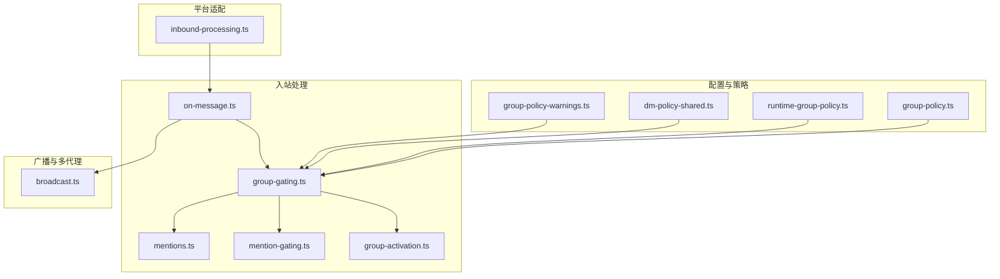
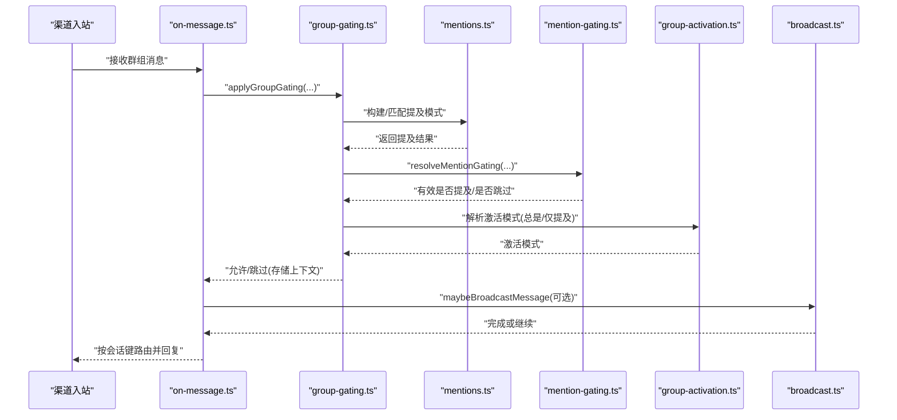
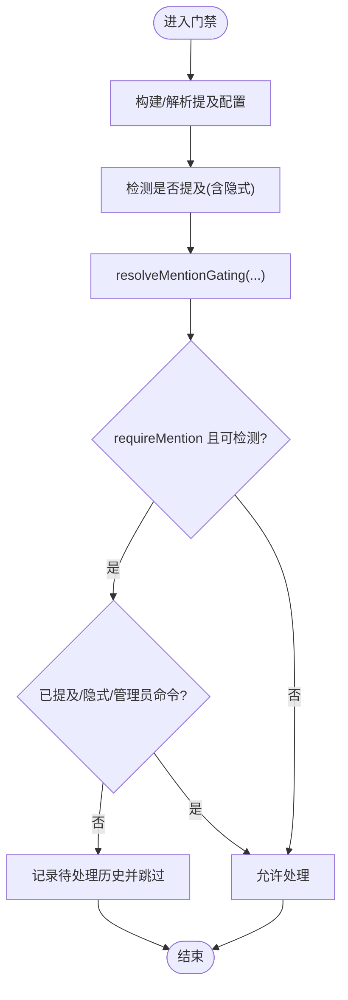
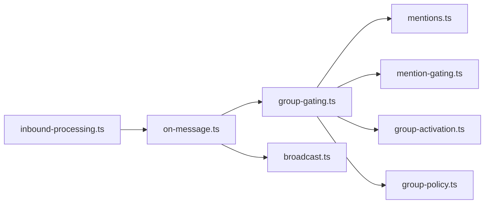

# 群组管理

<cite>
**本文引用的文件**
- [docs/channels/groups.md](file://docs/channels/groups.md)
- [src/web/auto-reply/monitor/group-gating.ts](file://src/web/auto-reply/monitor/group-gating.ts)
- [src/auto-reply/reply/mentions.ts](file://src/auto-reply/reply/mentions.ts)
- [src/channels/mention-gating.ts](file://src/channels/mention-gating.ts)
- [src/web/auto-reply/monitor/group-activation.ts](file://src/web/auto-reply/monitor/group-activation.ts)
- [src/config/group-policy.ts](file://src/config/group-policy.ts)
- [src/web/auto-reply/monitor/on-message.ts](file://src/web/auto-reply/monitor/on-message.ts)
- [src/web/auto-reply/monitor/broadcast.ts](file://src/web/auto-reply/monitor/broadcast.ts)
- [src/web/auto-reply/web-auto-reply-monitor.test.ts](file://src/web/auto-reply/web-auto-reply-monitor.test.ts)
- [src/imessage/monitor/inbound-processing.ts](file://src/imessage/monitor/inbound-processing.ts)
- [docs/channels/imessage.md](file://docs/channels/imessage.md)
- [src/security/dm-policy-shared.ts](file://src/security/dm-policy-shared.ts)
- [src/channels/plugins/group-policy-warnings.ts](file://src/channels/plugins/group-policy-warnings.ts)
- [src/config/runtime-group-policy.ts](file://src/config/runtime-group-policy.ts)
- [src/plugin-sdk/group-access.test.ts](file://src/plugin-sdk/group-access.test.ts)
</cite>

## 目录
1. [简介](#简介)
2. [项目结构](#项目结构)
3. [核心组件](#核心组件)
4. [架构总览](#架构总览)
5. [详细组件分析](#详细组件分析)
6. [依赖关系分析](#依赖关系分析)
7. [性能考量](#性能考量)
8. [故障排查指南](#故障排查指南)
9. [结论](#结论)
10. [附录：实现与扩展指南](#附录实现与扩展指南)

## 简介
本文件系统性阐述 OpenClaw 的群组管理能力，覆盖以下主题：
- 群组识别与会话隔离
- 成员管理与上下文记录
- 权限控制与访问策略
- 消息路由与提及检测
- 群组激活与管理员权限
- 群组消息的特殊处理、@提及系统与通知设置
- 安全策略、隐私设置与违规处理
- 开发者自定义与扩展群组管理能力的实践指南

## 项目结构
围绕群组管理的关键代码分布在如下模块：
- 配置与策略：group-policy.ts、runtime-group-policy.ts、dm-policy-shared.ts、group-policy-warnings.ts
- 入站消息处理：on-message.ts、group-gating.ts、mentions.ts、mention-gating.ts、group-activation.ts
- 广播与多代理：broadcast.ts
- 文档与示例：docs/channels/groups.md、docs/channels/imessage.md、web-auto-reply-monitor.test.ts
- 平台适配：inbound-processing.ts（iMessage）

**图表来源**
- [src/config/group-policy.ts:325-389](file://src/config/group-policy.ts#L325-L389)
- [src/web/auto-reply/monitor/group-gating.ts:82-157](file://src/web/auto-reply/monitor/group-gating.ts#L82-L157)
- [src/auto-reply/reply/mentions.ts:40-97](file://src/auto-reply/reply/mentions.ts#L40-L97)
- [src/channels/mention-gating.ts:30-59](file://src/channels/mention-gating.ts#L30-L59)
- [src/web/auto-reply/monitor/group-activation.ts:13-64](file://src/web/auto-reply/monitor/group-activation.ts#L13-L64)
- [src/web/auto-reply/monitor/on-message.ts:127-171](file://src/web/auto-reply/monitor/on-message.ts#L127-L171)
- [src/web/auto-reply/monitor/broadcast.ts:47-125](file://src/web/auto-reply/monitor/broadcast.ts#L47-L125)
- [src/imessage/monitor/inbound-processing.ts:120-164](file://src/imessage/monitor/inbound-processing.ts#L120-L164)

**章节来源**
- [docs/channels/groups.md:1-380](file://docs/channels/groups.md#L1-L380)
- [src/web/auto-reply/monitor/on-message.ts:100-171](file://src/web/auto-reply/monitor/on-message.ts#L100-L171)

## 核心组件
- 群组策略解析：负责从配置解析 groupPolicy、requireMention、工具策略与发送者白名单。
- 群组门禁：在入站阶段评估是否允许处理群组消息，支持提及检测、隐式提及与管理员豁免。
- 提及检测：构建正则模式、清洗文本、匹配提及并剥离提及标记。
- 群组激活：解析每会话的激活模式（总是/仅提及），支持 owner 切换。
- 广播与多代理：在满足条件时对多个代理进行广播处理。
- 平台适配：不同渠道（如 iMessage）在入站前做群组识别与访问决策。

**章节来源**
- [src/config/group-policy.ts:325-429](file://src/config/group-policy.ts#L325-L429)
- [src/web/auto-reply/monitor/group-gating.ts:82-157](file://src/web/auto-reply/monitor/group-gating.ts#L82-L157)
- [src/auto-reply/reply/mentions.ts:40-180](file://src/auto-reply/reply/mentions.ts#L40-L180)
- [src/web/auto-reply/monitor/group-activation.ts:13-64](file://src/web/auto-reply/monitor/group-activation.ts#L13-L64)
- [src/web/auto-reply/monitor/broadcast.ts:47-125](file://src/web/auto-reply/monitor/broadcast.ts#L47-L125)
- [src/imessage/monitor/inbound-processing.ts:120-164](file://src/imessage/monitor/inbound-processing.ts#L120-L164)

## 架构总览
下图展示从入站到处理的端到端流程，包括群组识别、门禁、提及检测、会话隔离与回复路由。

**图表来源**
- [src/web/auto-reply/monitor/on-message.ts:127-171](file://src/web/auto-reply/monitor/on-message.ts#L127-L171)
- [src/web/auto-reply/monitor/group-gating.ts:82-157](file://src/web/auto-reply/monitor/group-gating.ts#L82-L157)
- [src/auto-reply/reply/mentions.ts:40-97](file://src/auto-reply/reply/mentions.ts#L40-L97)
- [src/channels/mention-gating.ts:30-59](file://src/channels/mention-gating.ts#L30-L59)
- [src/web/auto-reply/monitor/group-activation.ts:49-64](file://src/web/auto-reply/monitor/group-activation.ts#L49-L64)
- [src/web/auto-reply/monitor/broadcast.ts:47-125](file://src/web/auto-reply/monitor/broadcast.ts#L47-L125)

## 详细组件分析

### 群组识别与会话隔离
- 识别依据：通过渠道提供的群组标识（如 chat_id、group id）判定是否为群组，并据此决定会话隔离策略。
- 会话键：群组使用 agent:<agentId>:<channel>:group:<id>，确保上下文不与其他会话混用；心跳在群组会话被跳过以降低资源消耗。
- 平台差异：iMessage 偏好 chat_id 路由与允许列表；文档给出各渠道的群组标识与路由建议。

**章节来源**
- [docs/channels/groups.md:50-56](file://docs/channels/groups.md#L50-L56)
- [docs/channels/imessage.md:173-178](file://docs/channels/imessage.md#L173-L178)
- [src/imessage/monitor/inbound-processing.ts:120-164](file://src/imessage/monitor/inbound-processing.ts#L120-L164)

### 成员管理与上下文记录
- 成员登记：每次入站消息触发时，记录发送者的 E.164 与名称，维护群组成员映射。
- 上下文注入：当消息因未提及而跳过时，将该消息作为“待处理历史”写入群组历史，供后续会话使用。
- 历史限制：可通过配置项限制历史条目数量，避免无限增长。

**章节来源**
- [src/web/auto-reply/monitor/group-gating.ts:89-94](file://src/web/auto-reply/monitor/group-gating.ts#L89-L94)
- [src/web/auto-reply/monitor/group-gating.ts:47-69](file://src/web/auto-reply/monitor/group-gating.ts#L47-L69)
- [src/web/auto-reply/web-auto-reply-monitor.test.ts:38-65](file://src/web/auto-reply/web-auto-reply-monitor.test.ts#L38-L65)

### 权限控制与访问策略
- 策略解析：groupPolicy 支持 open/allowlist/disabled；requireMention 可按群组或默认配置；工具策略支持按群组与按发送者叠加。
- 运行时回退：当渠道配置缺失时，采用 fail-closed 回退策略（默认 allowlist），避免宽泛放行。
- 发送者授权：部分渠道使用 groupAllowFrom 或等价字段进行发送者白名单校验；DM 配对与群组发送者授权相互独立。

**章节来源**
- [src/config/group-policy.ts:325-389](file://src/config/group-policy.ts#L325-L389)
- [src/config/runtime-group-policy.ts:16-27](file://src/config/runtime-group-policy.ts#L16-L27)
- [docs/channels/groups.md:183-195](file://docs/channels/groups.md#L183-L195)
- [src/security/dm-policy-shared.ts:125-161](file://src/security/dm-policy-shared.ts#L125-L161)

### 消息路由与提及检测
- 提及检测：支持原生提及与基于正则的提及模式；可剥离提及标记用于指令解析；支持隐式提及（如回复机器人消息）。
- 门禁判定：当 requireMention 且无法检测到提及时，消息被跳过但计入上下文；管理员发送受控命令可绕过提及要求。
- 调试输出：门禁过程会输出调试信息，便于定位问题。

**图表来源**
- [src/web/auto-reply/monitor/group-gating.ts:136-156](file://src/web/auto-reply/monitor/group-gating.ts#L136-L156)
- [src/auto-reply/reply/mentions.ts:88-127](file://src/auto-reply/reply/mentions.ts#L88-L127)
- [src/channels/mention-gating.ts:30-59](file://src/channels/mention-gating.ts#L30-L59)

**章节来源**
- [src/auto-reply/reply/mentions.ts:40-180](file://src/auto-reply/reply/mentions.ts#L40-L180)
- [src/channels/mention-gating.ts:1-59](file://src/channels/mention-gating.ts#L1-L59)
- [src/web/auto-reply/monitor/group-gating.ts:113-156](file://src/web/auto-reply/monitor/group-gating.ts#L113-L156)

### 群组激活与管理员权限
- 激活模式：每会话可保存激活模式（always/mention），默认根据 requireMention 决定；owner 可通过 /activation 切换。
- 管理员判定：基于渠道 allowFrom 或自身 E.164 判定 owner；非 owner 发送 /activation 将被忽略并记录历史。
- 测试覆盖：验证 owner 的命令绕过提及，非 owner 的命令被拒绝。

**章节来源**
- [src/web/auto-reply/monitor/group-activation.ts:49-64](file://src/web/auto-reply/monitor/group-activation.ts#L49-L64)
- [src/auto-reply/group-activation.ts:1-35](file://src/auto-reply/group-activation.ts#L1-L35)
- [src/web/auto-reply/web-auto-reply-monitor.test.ts:128-167](file://src/web/auto-reply/web-auto-reply-monitor.test.ts#L128-L167)

### 群组消息的特殊处理、@提及系统与通知设置
- 特殊处理：未提及的消息不会直接回复，而是作为上下文保存；首次进入新群组会注入群组介绍提示。
- @提及系统：支持全局与代理级 mentionPatterns；可结合通道特定的 stripMentions 逻辑清理无关标记。
- 通知设置：通过 requireMention 与 per-group 配置控制是否需要提及；支持 per-agent 的 mentionPatterns 以满足多代理共享群组场景。

**章节来源**
- [docs/channels/groups.md:202-252](file://docs/channels/groups.md#L202-L252)
- [src/auto-reply/reply/mentions.ts:147-180](file://src/auto-reply/reply/mentions.ts#L147-L180)
- [src/web/auto-reply/monitor/group-gating.ts:123-129](file://src/web/auto-reply/monitor/group-gating.ts#L123-L129)

### 安全策略、隐私设置与违规处理
- 安全策略：运行时回退采用 fail-closed（allowlist），避免因配置缺失导致的过度放行；警告模块对 open 策略给出风险提示与修复建议。
- 隐私设置：群组会话隔离、历史上下文限制、工具策略按群组/发送者叠加，减少敏感信息泄露与误操作。
- 违规处理：通过 groupPolicy=disabled 或空 allowlist 实现阻断；对非 owner 的 /activation 命令直接忽略并记录。

**章节来源**
- [src/config/runtime-group-policy.ts:16-27](file://src/config/runtime-group-policy.ts#L16-L27)
- [src/channels/plugins/group-policy-warnings.ts:11-32](file://src/channels/plugins/group-policy-warnings.ts#L11-L32)
- [src/security/dm-policy-shared.ts:125-161](file://src/security/dm-policy-shared.ts#L125-L161)
- [src/plugin-sdk/group-access.test.ts:124-151](file://src/plugin-sdk/group-access.test.ts#L124-L151)

## 依赖关系分析
- on-message.ts 依赖 group-gating.ts 完成门禁；group-gating.ts 依赖 mentions.ts、mention-gating.ts、group-activation.ts 与 group-policy.ts。
- 广播模块与门禁解耦，可在允许处理后并行/串行触发多个代理。
- 平台适配层（如 iMessage）在入站前完成群组识别与访问决策，再交由通用处理链路。

**图表来源**
- [src/web/auto-reply/monitor/on-message.ts:127-171](file://src/web/auto-reply/monitor/on-message.ts#L127-L171)
- [src/web/auto-reply/monitor/group-gating.ts:82-157](file://src/web/auto-reply/monitor/group-gating.ts#L82-L157)
- [src/auto-reply/reply/mentions.ts:40-97](file://src/auto-reply/reply/mentions.ts#L40-L97)
- [src/channels/mention-gating.ts:30-59](file://src/channels/mention-gating.ts#L30-L59)
- [src/web/auto-reply/monitor/group-activation.ts:13-64](file://src/web/auto-reply/monitor/group-activation.ts#L13-L64)
- [src/config/group-policy.ts:325-389](file://src/config/group-policy.ts#L325-L389)
- [src/web/auto-reply/monitor/broadcast.ts:47-125](file://src/web/auto-reply/monitor/broadcast.ts#L47-L125)
- [src/imessage/monitor/inbound-processing.ts:120-164](file://src/imessage/monitor/inbound-processing.ts#L120-L164)

**章节来源**
- [src/web/auto-reply/monitor/on-message.ts:100-171](file://src/web/auto-reply/monitor/on-message.ts#L100-L171)
- [src/web/auto-reply/monitor/group-gating.ts:22-36](file://src/web/auto-reply/monitor/group-gating.ts#L22-L36)

## 性能考量
- 缓存与去重：提及正则编译缓存、成员去重与会话键稳定化，减少重复计算与内存占用。
- 广播策略：支持并行/串行两种广播策略，可根据并发度与资源限制选择。
- 心跳与会话：群组会话跳过心跳，降低后台开销；工具策略按需加载，避免不必要的初始化。

[本节为通用指导，无需列出具体文件来源]

## 故障排查指南
- 群组消息被跳过：检查 groupPolicy、requireMention 与提及模式；确认是否为隐式提及或管理员命令；查看调试日志中的 mention 结果。
- 群组激活无效：确认 owner 判定是否正确；检查 /activation 是否为独立消息；核对 per-session 存储中的 groupActivation。
- 广播未生效：确认 broadcast 配置与策略；检查代理 ID 是否存在于 agents.list；查看并行/串行执行状态。
- 平台路由异常：核对 iMessage 的 chat_id 与 allowFrom；确认 treatAsGroupByConfig 的配置。

**章节来源**
- [src/web/auto-reply/monitor/group-gating.ts:113-156](file://src/web/auto-reply/monitor/group-gating.ts#L113-L156)
- [src/web/auto-reply/monitor/group-activation.ts:49-64](file://src/web/auto-reply/monitor/group-activation.ts#L49-L64)
- [src/web/auto-reply/monitor/broadcast.ts:72-125](file://src/web/auto-reply/monitor/broadcast.ts#L72-L125)
- [src/imessage/monitor/inbound-processing.ts:120-164](file://src/imessage/monitor/inbound-processing.ts#L120-L164)

## 结论
OpenClaw 的群组管理以“策略可配置、门禁可绕过、上下文可沉淀、会话可隔离”为核心设计，既保证了安全性与可控性，又提供了灵活的扩展空间。通过统一的提及检测与激活机制，开发者可以快速实现跨渠道的一致群组体验。

[本节为总结性内容，无需列出具体文件来源]

## 附录：实现与扩展指南

### 群组创建、邀请加入、退出群组与管理员权限
- 创建与邀请：通过渠道侧的群组创建/邀请接口完成；OpenClaw 在入站时识别群组标识并应用相应策略。
- 退出群组：当群组不再允许或发送者移除时，groupPolicy 与 allowlist 将阻止后续消息进入。
- 管理员权限：基于 allowFrom 或自身 E.164 判定 owner；owner 可通过 /activation 切换激活模式并绕过部分门禁。

**章节来源**
- [docs/channels/groups.md:350-358](file://docs/channels/groups.md#L350-L358)
- [src/web/auto-reply/monitor/group-activation.ts:49-64](file://src/web/auto-reply/monitor/group-activation.ts#L49-L64)

### 群组消息的特殊处理、@提及系统与通知设置
- 特殊处理：未提及消息计入上下文；首次进入新群组注入系统提示。
- @提及系统：支持全局与代理级 mentionPatterns；通道可提供 stripMentions 逻辑。
- 通知设置：requireMention 控制是否需要提及；per-group 与 per-agent 配置可组合使用。

**章节来源**
- [docs/channels/groups.md:202-252](file://docs/channels/groups.md#L202-L252)
- [src/auto-reply/reply/mentions.ts:147-180](file://src/auto-reply/reply/mentions.ts#L147-L180)

### 群组安全策略、隐私设置与违规处理
- 安全策略：groupPolicy 默认 allowlist；运行时回退采用 fail-closed；警告模块提示 open 策略风险。
- 隐私设置：群组会话隔离、历史上下文限制、工具策略叠加。
- 违规处理：禁用策略、空 allowlist、非 owner 命令忽略。

**章节来源**
- [src/config/runtime-group-policy.ts:16-27](file://src/config/runtime-group-policy.ts#L16-L27)
- [src/channels/plugins/group-policy-warnings.ts:11-32](file://src/channels/plugins/group-policy-warnings.ts#L11-L32)
- [src/security/dm-policy-shared.ts:125-161](file://src/security/dm-policy-shared.ts#L125-L161)

### 开发者自定义与扩展
- 自定义提及模式：在 agents.list[].groupChat 或 messages.groupChat 中配置 mentionPatterns。
- 工具策略扩展：在 channels.<provider>.groups["*"] 或具体群组下配置 tools/toolsBySender，支持按发送者叠加。
- 广播与多代理：通过 broadcast 配置启用并选择并行/串行策略，按 peerId 绑定多个代理。
- 平台适配：在 inbound-processing.ts 类似路径中实现渠道特有的群组识别与访问决策。

**章节来源**
- [docs/channels/groups.md:253-294](file://docs/channels/groups.md#L253-L294)
- [src/web/auto-reply/monitor/broadcast.ts:47-125](file://src/web/auto-reply/monitor/broadcast.ts#L47-L125)
- [src/imessage/monitor/inbound-processing.ts:120-164](file://src/imessage/monitor/inbound-processing.ts#L120-L164)