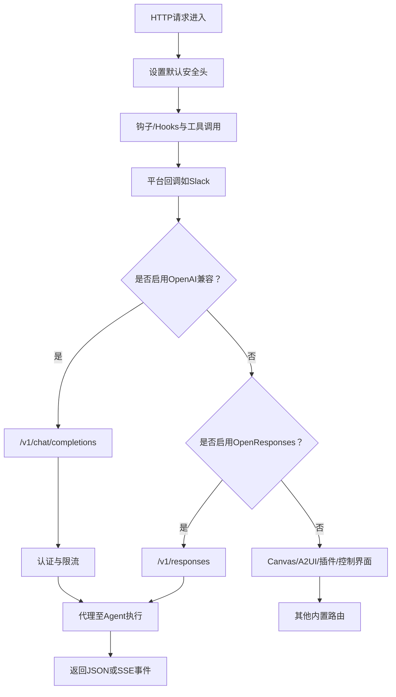
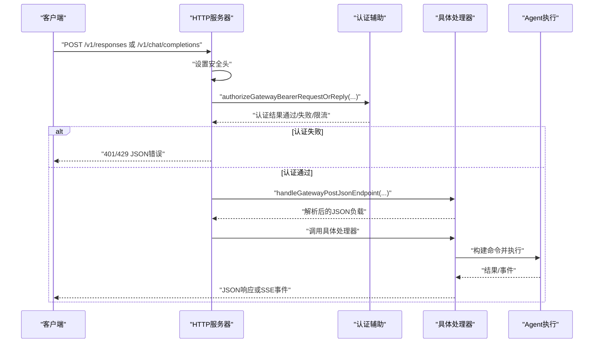
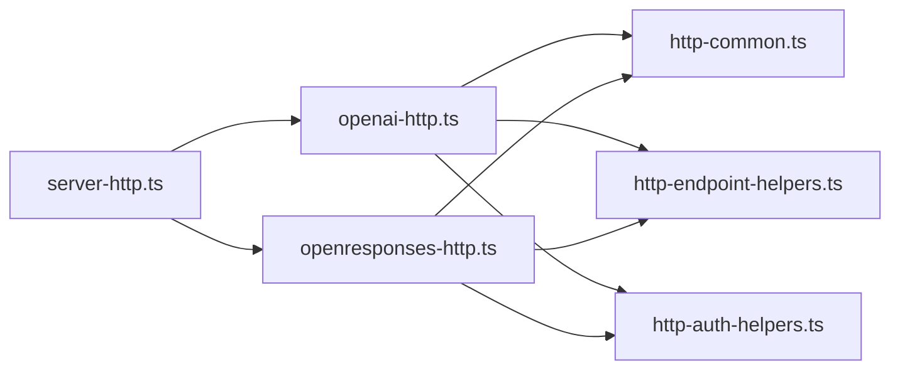

# HTTP API服务

<cite>
**本文引用的文件**
- [openai-http-api.md](file://docs/gateway/openai-http-api.md)
- [openresponses-http-api.md](file://docs/gateway/openresponses-http-api.md)
- [http-common.ts](file://src/gateway/http-common.ts)
- [http-auth-helpers.ts](file://src/gateway/http-auth-helpers.ts)
- [http-endpoint-helpers.ts](file://src/gateway/http-endpoint-helpers.ts)
- [server-http.ts](file://src/gateway/server-http.ts)
- [openai-http.ts](file://src/gateway/openai-http.ts)
- [openresponses-http.ts](file://src/gateway/openresponses-http.ts)
</cite>

## 目录
1. [简介](#简介)
2. [项目结构](#项目结构)
3. [核心组件](#核心组件)
4. [架构总览](#架构总览)
5. [详细组件分析](#详细组件分析)
6. [依赖关系分析](#依赖关系分析)
7. [性能考量](#性能考量)
8. [故障排查指南](#故障排查指南)
9. [结论](#结论)
10. [附录](#附录)

## 简介
本文件面向OpenClaw Gateway的HTTP API服务，系统化梳理并输出OpenAI兼容与OpenResponses兼容的HTTP接口规范，涵盖：
- RESTful设计原则与端点定义
- 请求/响应格式与流式传输（SSE）
- 认证与安全边界
- 错误处理与状态码
- 配置开关与版本化演进策略
- 开发者集成指南与最佳实践

## 项目结构
OpenClaw Gateway在单一HTTP(S)服务中复用WebSocket端口，按路由阶段顺序处理多类入口：
- 钩子（Hooks）与工具调用（Tools Invoke）
- 平台通道（如Slack）回调
- OpenAI兼容端点（/v1/chat/completions）
- OpenResponses兼容端点（/v1/responses）
- Canvas/A2UI能力
- 插件路由与控制界面（Control UI）

图表来源
- [server-http.ts:612-783](file://src/gateway/server-http.ts#L612-L783)

章节来源
- [server-http.ts:612-783](file://src/gateway/server-http.ts#L612-L783)

## 核心组件
- HTTP通用工具与错误响应
  - 统一设置安全头、发送JSON/文本、方法不允许、未授权、限流、无效请求等
- HTTP认证辅助
  - 基于Bearer Token的网关认证流程封装
- 通用POST JSON端点处理
  - 路径匹配、方法校验、认证、Body读取与大小限制
- OpenAI兼容处理器
  - /v1/chat/completions端点，支持SSE流式输出
- OpenResponses兼容处理器
  - /v1/responses端点，支持SSE事件流、客户端工具调用、文件/图片输入
- 服务器编排
  - 路由阶段化处理、条件启用、错误兜底

章节来源
- [http-common.ts:1-109](file://src/gateway/http-common.ts#L1-L109)
- [http-auth-helpers.ts:1-30](file://src/gateway/http-auth-helpers.ts#L1-L30)
- [http-endpoint-helpers.ts:1-47](file://src/gateway/http-endpoint-helpers.ts#L1-L47)
- [openai-http.ts:408-613](file://src/gateway/openai-http.ts#L408-L613)
- [openresponses-http.ts:265-800](file://src/gateway/openresponses-http.ts#L265-L800)
- [server-http.ts:612-783](file://src/gateway/server-http.ts#L612-L783)

## 架构总览
下图展示HTTP请求在Gateway中的处理链路与关键决策点。

图表来源
- [server-http.ts:612-783](file://src/gateway/server-http.ts#L612-L783)
- [http-auth-helpers.ts:7-29](file://src/gateway/http-auth-helpers.ts#L7-L29)
- [http-endpoint-helpers.ts:7-47](file://src/gateway/http-endpoint-helpers.ts#L7-L47)
- [openai-http.ts:408-613](file://src/gateway/openai-http.ts#L408-L613)
- [openresponses-http.ts:265-800](file://src/gateway/openresponses-http.ts#L265-L800)

## 详细组件分析

### OpenAI兼容端点：/v1/chat/completions
- 端点
  - POST /v1/chat/completions
  - 默认端口与WebSocket复用同一端口
- 认证
  - Bearer Token；支持令牌/密码两种模式；失败触发速率限制
- 会话行为
  - 默认每次请求生成新会话；若提供user字段则派生稳定会话键
- 请求体
  - 支持messages数组（含role/content）、stream布尔、user字符串等
  - 图像输入通过content中的image_url（支持data URI与URL）
- 响应
  - 非流式：标准OpenAI风格JSON
  - 流式：SSE，逐块输出choices.delta
- 安全边界
  - 该端点视为“全操作员权限”面，仅限内网/私有入口使用

章节来源
- [openai-http-api.md:14-133](file://docs/gateway/openai-http-api.md#L14-L133)
- [openai-http.ts:408-613](file://src/gateway/openai-http.ts#L408-L613)
- [http-common.ts:41-71](file://src/gateway/http-common.ts#L41-L71)

### OpenResponses兼容端点：/v1/responses
- 端点
  - POST /v1/responses
  - 默认端口与WebSocket复用同一端口
- 认证
  - Bearer Token；支持令牌/密码两种模式；失败触发速率限制
- 会话行为
  - 默认每次请求生成新会话；若提供user字段则派生稳定会话键
- 请求体
  - 支持input（字符串或项数组）、instructions、tools、tool_choice、stream、max_output_tokens、user等
  - 支持项类型：message、function_call_output、reasoning、item_reference等
  - 支持input_image与input_file（base64或URL），含MIME与大小限制
- 响应
  - 非流式：包含id、object、created、model、status、output、usage等
  - 流式：SSE事件序列（response.created、response.in_progress、response.output_item.added、response.content_part.added、response.output_text.delta、response.output_text.done、response.content_part.done、response.output_item.done、response.completed、response.failed）
- 文件/图片限制
  - 可配置最大Body字节数、URL部件数量、文件/图片的MIME白名单、大小上限、超时、重定向次数等
- 安全边界
  - 该端点视为“全操作员权限”面，仅限内网/私有入口使用

章节来源
- [openresponses-http-api.md:15-355](file://docs/gateway/openresponses-http-api.md#L15-L355)
- [openresponses-http.ts:265-800](file://src/gateway/openresponses-http.ts#L265-L800)
- [http-common.ts:41-71](file://src/gateway/http-common.ts#L41-L71)

### HTTP通用工具与错误处理
- 安全头
  - 设置X-Content-Type-Options、Referrer-Policy、Permissions-Policy等
- 响应工具
  - sendJson/sendText/sendMethodNotAllowed/sendUnauthorized/sendRateLimited/sendInvalidRequest
- SSE工具
  - setSseHeaders/writeDone
- 通用POST JSON端点处理
  - 路径匹配、方法校验、认证、Body读取与大小限制
- 认证辅助
  - authorizeGatewayBearerRequestOrReply：从请求头提取Bearer Token并进行网关认证

章节来源
- [http-common.ts:1-109](file://src/gateway/http-common.ts#L1-L109)
- [http-endpoint-helpers.ts:1-47](file://src/gateway/http-endpoint-helpers.ts#L1-L47)
- [http-auth-helpers.ts:1-30](file://src/gateway/http-auth-helpers.ts#L1-L30)

### 服务器编排与路由阶段
- 升级阶段跳过HTTP处理
- 路由阶段（按优先级）：
  - 钩子/Hooks与工具调用
  - 平台回调（如Slack）
  - OpenAI兼容端点（可选）
  - OpenResponses端点（可选）
  - Canvas/A2UI
  - 插件路由
  - 控制界面
  - 健康探针（/ready、/health等）
- 错误兜底：未匹配任何阶段返回404；异常返回500

章节来源
- [server-http.ts:612-783](file://src/gateway/server-http.ts#L612-L783)

## 依赖关系分析
- 处理器依赖
  - OpenAI处理器依赖通用HTTP工具、端点辅助、认证辅助、Agent命令执行
  - OpenResponses处理器依赖Zod Schema校验、通用HTTP工具、端点辅助、认证辅助、Agent命令执行
- 服务器编排
  - server-http.ts根据配置动态启用/禁用端点，并将请求分派给对应处理器
- 错误与安全
  - http-common.ts统一错误响应与SSE工具；http-auth-helpers.ts负责认证与限流

图表来源
- [server-http.ts:612-783](file://src/gateway/server-http.ts#L612-L783)
- [openai-http.ts:1-613](file://src/gateway/openai-http.ts#L1-L613)
- [openresponses-http.ts:1-800](file://src/gateway/openresponses-http.ts#L1-L800)
- [http-common.ts:1-109](file://src/gateway/http-common.ts#L1-L109)
- [http-endpoint-helpers.ts:1-47](file://src/gateway/http-endpoint-helpers.ts#L1-L47)
- [http-auth-helpers.ts:1-30](file://src/gateway/http-auth-helpers.ts#L1-L30)

## 性能考量
- 速率限制
  - 认证失败触发限流，返回429并携带Retry-After
- 负载限制
  - 请求体大小限制（OpenAI默认约20MB，OpenResponses默认约20MB，可按配置调整）
- 流式传输
  - SSE减少长连接等待，提升交互体验
- 并发与资源
  - 服务器按阶段顺序处理，避免重复解析与认证
- 建议
  - 在公网暴露前，务必启用TLS与严格代理配置
  - 合理设置max_output_tokens与媒体文件大小限制，避免资源滥用

## 故障排查指南
- 常见错误与状态码
  - 401 未授权：缺少或无效的Bearer Token
  - 400 请求无效：JSON解析失败、请求体过大、参数不符合规范
  - 405 方法不允许：非POST请求
  - 413 请求体过大：超过maxBodyBytes限制
  - 429 速率限制：认证失败过多，触发限流
  - 500 内部错误：Agent执行异常
- 定位步骤
  - 检查Authorization头与网关认证配置
  - 核对请求体大小与字段类型
  - 查看SSE事件流是否正常结束（[DONE]）
  - 关注日志中的“invalid request”“internal error”等提示
- 速率限制
  - 若频繁收到429，请检查客户端重试策略与网关限流配置

章节来源
- [http-common.ts:36-71](file://src/gateway/http-common.ts#L36-L71)
- [openai-http.ts:448-466](file://src/gateway/openai-http.ts#L448-L466)
- [openresponses-http.ts:404-410](file://src/gateway/openresponses-http.ts#L404-L410)

## 结论
OpenClaw Gateway通过统一的HTTP(S)服务承载多种兼容端点，采用阶段化路由与集中认证/错误处理，既满足OpenAI兼容生态，又提供OpenResponses的扩展能力。建议在生产环境中：
- 明确启用/禁用端点的配置开关
- 严格控制访问范围，避免直接暴露于公网
- 合理设置限流与负载限制
- 使用SSE提升实时性与可观测性

## 附录

### API参考速览
- OpenAI兼容：/v1/chat/completions
  - 方法：POST
  - 认证：Bearer Token
  - 请求体字段：model、messages、stream、user等
  - 响应：非流式JSON或SSE事件
  - 会话：默认无状态；user派生稳定会话
  - 安全：全操作员权限面，仅限内网/私有入口
- OpenResponses兼容：/v1/responses
  - 方法：POST
  - 认证：Bearer Token
  - 请求体字段：model、input、instructions、tools、tool_choice、stream、max_output_tokens、user等
  - 响应：非流式JSON或SSE事件序列
  - 会话：默认无状态；user派生稳定会话
  - 安全：全操作员权限面，仅限内网/私有入口

章节来源
- [openai-http-api.md:14-133](file://docs/gateway/openai-http-api.md#L14-L133)
- [openresponses-http-api.md:15-355](file://docs/gateway/openresponses-http-api.md#L15-L355)

### 配置与版本管理
- 端点开关
  - OpenAI：gateway.http.endpoints.chatCompletions.enabled
  - OpenResponses：gateway.http.endpoints.responses.enabled
- 版本策略
  - 文档建议将OpenAI端点标记为遗留，逐步迁移至OpenResponses
  - 两个端点可独立启用/禁用，便于渐进式演进

章节来源
- [openai-http-api.md:59-89](file://docs/gateway/openai-http-api.md#L59-L89)
- [openresponses-http-api.md:61-76](file://docs/gateway/openresponses-http-api.md#L61-L76)